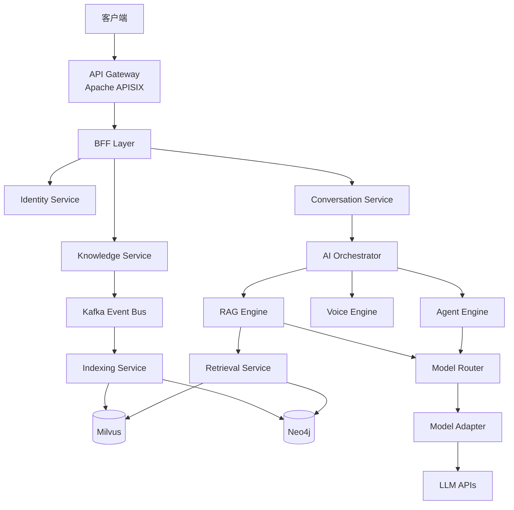

# VoiceHelper AI 客服语音助手平台

<div align="center">

[](https://github.com/yourusername/VoiceAssistant)
[](https://golang.org)
[](https://www.python.org)
[](LICENSE)

**GraphRAG + Multi-Agent 语音助手平台，基于 DDD 和云原生最佳实践**

[快速开始](QUICKSTART.md) • [架构设计](docs/microservice-architecture-v2.md) • [贡献指南](CONTRIBUTING.md) • [文档](docs/)

</div>

---

## ✨ 特性

### 核心能力

- 🎯 **GraphRAG 知识检索** - 结合向量检索、BM25 和知识图谱的混合检索
- 🤖 **Multi-Agent 编排** - 支持 ReAct、Plan-Execute 等多种 Agent 模式
- 🎙️ **实时语音对话** - 端到端延迟 < 3s，支持 VAD 端点检测
- 👁️ **多模态理解** - OCR、图像理解、视频分析
- 📊 **实时分析** - 基于 Flink + ClickHouse 的秒级数据分析
- 🔐 **企业级安全** - mTLS、RBAC、审计日志、PII 脱敏

### 技术架构

- 🏗️ **微服务架构** - 12 个领域服务，基于 DDD 设计
- ⚡ **高性能通信** - gRPC (5-10x 性能提升)
- 📡 **事件驱动** - Apache Kafka 事件总线
- 🔍 **全链路追踪** - OpenTelemetry + Jaeger
- 📈 **可观测性** - Prometheus + Grafana + Loki
- 🚀 **云原生** - Kubernetes + Istio + Argo CD

---

## 🏗️ 架构概览

### 服务拓扑



### 技术栈

| 分类           | 技术                                             |
| -------------- | ------------------------------------------------ |
| **微服务框架** | Kratos v2 (Go), FastAPI (Python)                 |
| **API 网关**   | Apache APISIX v3.7+                              |
| **服务网格**   | Istio v1.20+                                     |
| **消息队列**   | Apache Kafka v3.6+                               |
| **流处理**     | Apache Flink v1.18+                              |
| **数据库**     | PostgreSQL v15+, Redis v7+, ClickHouse v23+      |
| **向量数据库** | Milvus v2.3+                                     |
| **图数据库**   | Neo4j v5+                                        |
| **对象存储**   | MinIO                                            |
| **可观测性**   | OpenTelemetry, Prometheus, Jaeger, Grafana, Loki |
| **GitOps**     | Argo CD v2.9+                                    |

---

## 🚀 快速开始

### 前置要求

- **Go**: v1.21+
- **Python**: v3.11+
- **Docker**: v24+
- **Docker Compose**: v2.20+

### 5 分钟启动

```bash
# 1. 克隆项目
git clone https://github.com/yourusername/VoiceAssistant.git
cd VoiceAssistant

# 2. 启动基础设施
docker-compose up -d

# 3. 初始化数据库
make db-init

# 4. 启动所有服务
make dev

# 5. 访问前端
open http://localhost:3000
```

详细说明请参考 [快速开始指南](QUICKSTART.md)。

---

## 📚 文档

### 核心文档

- [📖 快速开始](QUICKSTART.md) - 5 分钟上手指南
- [📚 文档索引](docs/DOCS_INDEX.md) - 文档导航中心 ⭐
- [🏛️ 架构设计 v2.0](docs/microservice-architecture-v2.md) - 当前系统架构
- [📋 迁移检查清单](docs/migration-checklist.md) - 架构迁移指南
- [🤝 贡献指南](CONTRIBUTING.md) - 如何参与贡献
- [🤝 团队协作指南](TEAM_COLLABORATION_GUIDE.md) - 工作流程与规范
- [💡 建议文档](RECOMMENDATIONS.md) - 架构与技术建议

### 运维与优化

- [⚡ Cursor 性能优化](docs/CURSOR_PERFORMANCE_OPTIMIZATION.md) - 提升开发工具性能
- [📦 归档说明](docs/ARCHIVE_SUMMARY.md) - 历史文档归档情况
- [📁 归档目录](docs/reports/archive/) - 历史报告存档

### 服务文档

- [Identity Service](cmd/identity-service/README.md) - 用户认证、租户管理
- [Conversation Service](cmd/conversation-service/README.md) - 会话管理、消息路由
- [Knowledge Service](cmd/knowledge-service/README.md) - 文档管理、版本控制
- [AI Orchestrator](cmd/ai-orchestrator/README.md) - AI 任务编排
- [Notification Service](cmd/notification-service/README.md) - 消息推送

### API 文档

- [OpenAPI 规范](api/openapi.yaml) - RESTful API 定义
- [Protobuf 定义](api/proto/) - gRPC 接口定义

### 📦 历史文档

> **注意**: 项目进度报告和阶段性总结已归档到 `docs/reports/archive/`
> 查看归档内容请访问 [归档目录](docs/reports/archive/README.md)

---

## 🎯 服务列表

### Go 微服务 (Kratos v2)

| 服务                 | 端口      | 职责                 | 状态 |
| -------------------- | --------- | -------------------- | ---- |
| Identity Service     | 8000/9000 | 认证、授权、租户管理 | ✅   |
| Conversation Service | 8001/9001 | 会话、消息、上下文   | ✅   |
| Knowledge Service    | 8002/9002 | 文档、集合、版本     | ✅   |
| AI Orchestrator      | 8003/9003 | 任务编排、流程控制   | ✅   |
| Model Router         | 8004/9004 | 模型路由、成本优化   | ✅   |
| Notification Service | 8005/9005 | 消息推送、通知       | ✅   |
| Analytics Service    | 8006/9006 | 实时统计、报表       | ✅   |

### Python 微服务 (FastAPI)

| 服务              | 端口      | 职责                 | 状态 |
| ----------------- | --------- | -------------------- | ---- |
| Indexing Service  | 8010/9010 | 文档解析、向量化     | ✅   |
| Retrieval Service | 8011/9011 | 混合检索、重排序     | ✅   |
| Agent Engine      | 8012/9012 | Agent 执行、工具调用 | ✅   |
| RAG Engine        | 8013/9013 | 检索增强生成         | ✅   |
| Voice Engine      | 8014/9014 | ASR/TTS/VAD          | ✅   |
| Multimodal Engine | 8015/9015 | OCR/视觉理解         | ✅   |
| Model Adapter     | 8016/9016 | API 适配、协议转换   | ✅   |

---

## 📊 性能指标

| 指标              | 目标值   | 说明           |
| ----------------- | -------- | -------------- |
| **API P95 延迟**  | < 100ms  | API 网关到 BFF |
| **gRPC P95 延迟** | < 50ms   | 服务间通信     |
| **向量检索 P95**  | < 10ms   | Milvus 检索    |
| **流式首帧延迟**  | < 300ms  | 流式响应首包   |
| **端到端问答**    | < 2.5s   | 用户提问到回答 |
| **并发能力**      | ≥ 1k RPS | 单实例 QPS     |
| **系统可用性**    | ≥ 99.95% | SLA 目标       |

---

## 🔧 开发指南

### 本地开发

```bash
# 启动单个 Go 服务
cd cmd/identity-service
go run main.go wire.go

# 启动单个 Python 服务
cd algo/indexing-service
pip install -r requirements.txt
python main.py

# 运行测试
make test

# 代码检查
make lint
```

### 添加新服务

```bash
# Go 服务
make new-go-service SERVICE=my-service

# Python 服务
make new-python-service SERVICE=my-service
```

### 构建镜像

```bash
# 构建所有镜像
make docker-build

# 构建单个服务
make docker-build-go SERVICE=identity-service
make docker-build-python SERVICE=indexing-service
```

---

## 🧪 测试

```bash
# 单元测试
make test

# 集成测试
make integration-test

# 端到端测试
make e2e-test

# 压力测试
make load-test

# 测试覆盖率
make coverage
```

---

## 📦 部署

### Docker Compose (本地开发)

```bash
docker-compose up -d
```

### Kubernetes (生产环境)

```bash
# 使用 Helm
helm install voicehelper deployments/helm/voicehelper \
  --namespace voicehelper-prod \
  --create-namespace

# 使用 Argo CD
kubectl apply -f deployments/argocd/
```

---

## 🔍 可观测性

### 监控指标

```bash
# Prometheus
kubectl port-forward -n monitoring svc/prometheus 9090:9090

# Grafana
kubectl port-forward -n monitoring svc/grafana 3000:80
```

### 链路追踪

```bash
# Jaeger
kubectl port-forward -n observability svc/jaeger 16686:16686
```

### 日志查询

```bash
# Loki
kubectl port-forward -n monitoring svc/loki 3100:3100
```

---

## 🤝 贡献

我们欢迎所有形式的贡献！请查看 [贡献指南](CONTRIBUTING.md)。

### 贡献者

感谢所有贡献者！

<a href="https://github.com/yourusername/VoiceAssistant/graphs/contributors">
  
</a>

---

## 📄 许可证

本项目采用 [MIT](LICENSE) 许可证。

---

## 🔗 相关链接

- **官网**: https://voicehelper.ai
- **文档**: https://docs.voicehelper.ai
- **博客**: https://blog.voicehelper.ai
- **问题反馈**: https://github.com/yourusername/VoiceAssistant/issues
- **讨论区**: https://github.com/yourusername/VoiceAssistant/discussions

---

## 📧 联系我们

- **邮箱**: team@voicehelper.ai
- **Slack**: [加入我们的 Slack](https://join.slack.com/t/voicehelper)
- **Twitter**: [@VoiceHelper](https://twitter.com/voicehelper)

---

<div align="center">

**[⬆️ 回到顶部](#voicehelper-ai-客服语音助手平台)**

Made with ❤️ by VoiceHelper Team

</div>
