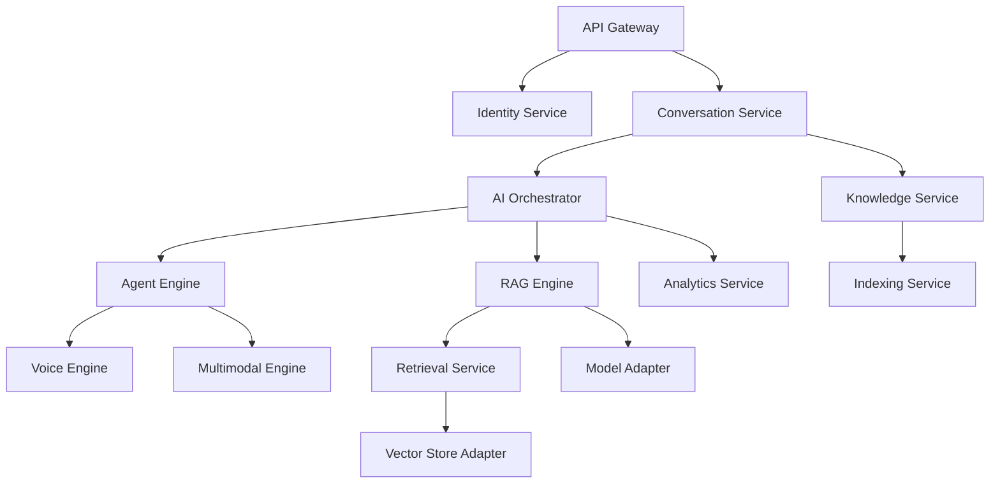

# VoiceAssistant 统一迭代路线图

> **版本**: v2.0
> **生成日期**: 2025-10-27
> **规划周期**: 2025 Q4 - 2026 Q2 (9 个月)
> **负责团队**: VoiceHelper AI Team

---

## 📋 执行摘要

本文档整合所有服务的迭代计划，提供统一的项目路线图。基于当前实现状态和功能对比分析，规划未来 9 个月的开发工作。

### 关键指标

| 维度           | 当前状态 | 目标状态          |
| -------------- | -------- | ----------------- |
| 服务总数       | 17 个    | 17 个（全部完善） |
| 已实现核心功能 | ~70%     | 100%              |
| P0 功能完成度  | ~60%     | 100%              |
| 代码覆盖率     | ~50%     | > 80%             |
| 性能达标率     | ~70%     | 100%              |

### 总体工作量估算

- **算法服务（Python）**: ~150 人天
- **业务服务（Go）**: ~130 人天
- **基础设施**: ~80 人天
- **前端应用**: ~60 人天
- **测试与优化**: ~60 人天
- **总计**: ~480 人天（约 6 个月，按 8 人团队）

---

## 🎯 战略目标

### Q4 2025 (2 个月)

- ✅ 完成所有 P0 功能
- ✅ 核心服务性能达标
- ✅ 基础监控和告警到位
- ✅ 文档完整度 > 90%

### Q1 2026 (3 个月)

- ✅ 完成 80%的 P1 功能
- ✅ 高级特性落地
- ✅ 生产环境稳定运行
- ✅ 用户体验显著提升

### Q2 2026 (4 个月)

- ✅ 完成 P2 功能
- ✅ 性能全面优化
- ✅ 功能对标 VoiceHelper
- ✅ 达到生产级可用性

---

## 📅 详细时间线

### Phase 1: 核心功能补齐 (Week 1-8, 2 个月)

#### Week 1-2: 认证与对话基础增强

**算法服务**:

- Agent Engine 流式响应优化 (2 天)
- Voice Engine 说话人分离 (4 天)
- RAG Engine Cross-Encoder 重排序完善 (2 天)

**业务服务**:

- Identity Service OAuth2 登录 (5 天)
- Conversation Service 流式响应 (3 天)

**基础设施**:

- API Gateway 核心中间件 (3 天)
- Redis 缓存层完善 (2 天)

**成果**:

- ✅ 流式对话体验
- ✅ 第三方登录支持
- ✅ 语音多说话人识别

#### Week 3-4: 检索与存储优化

**算法服务**:

- RAG Engine 语义缓存 (3 天)
- Retrieval Service 集成 Embedding (2 天)
- Indexing Service PDF 表格解析 (3 天)

**业务服务**:

- Identity Service 密码重置 (2 天)
- Identity Service Token 黑名单 (2 天)
- Conversation Service 事件发布 (3 天)

**基础设施**:

- Kafka 消息队列部署 (3 天)
- Prometheus 指标完善 (2 天)

**成果**:

- ✅ 检索性能提升 30%
- ✅ 认证安全性增强
- ✅ 事件驱动架构

#### Week 5-6: 智能化增强

**算法服务**:

- Agent Engine 工具容错机制 (3 天)
- Voice Engine 情感识别 (3 天)
- Model Adapter 国产模型完善 (3 天)

**业务服务**:

- Conversation Service 智能标题 (2 天)
- AI Orchestrator 服务发现 (3 天)
- Knowledge Service gRPC 实现 (4 天)

**基础设施**:

- Consul 服务发现部署 (3 天)
- Grafana 仪表盘部署 (3 天)

**成果**:

- ✅ Agent 执行更稳定
- ✅ 语音情感分析
- ✅ 服务自动发现

#### Week 7-8: 多模态与性能优化

**算法服务**:

- Multimodal Engine 目标检测 (4 天)
- Vector Store Adapter 批量优化 (2 天)
- Model Adapter 请求缓存 (2 天)

**业务服务**:

- Analytics Service 实时看板 (3 天)
- Model Router 智能路由 (3 天)
- Notification Service 基础功能 (3 天)

**基础设施**:

- 限流中间件 (2 天)
- 幂等性处理 (2 天)
- 链路追踪部署 (3 天)

**测试**:

- 性能压测 (3 天)
- 集成测试完善 (3 天)

**成果**:

- ✅ 多模态能力增强
- ✅ 系统性能提升
- ✅ 可观测性完善

---

### Phase 2: 高级功能开发 (Week 9-20, 3 个月)

#### Week 9-12: 协作与个性化

**算法服务**:

- Agent Engine 多 Agent 协作 (5 天)
- RAG Engine 自适应检索 (4 天)
- Retrieval Service 查询改写 (3 天)
- Voice Engine 噪音抑制 (3 天)

**业务服务**:

- Identity Service 审计日志 (3 天)
- Conversation Service 对话总结 (3 天)
- Knowledge Service 文档摘要 (3 天)
- Analytics Service 自定义查询 (4 天)

**前端**:

- 对话页面完善 (5 天)
- 知识库管理界面 (5 天)

**成果**:

- ✅ 多 Agent 协作能力
- ✅ 智能化程度提升
- ✅ 用户界面完善

#### Week 13-16: 智能化深化

**算法服务**:

- Agent Engine 人工反馈循环 (4 天)
- RAG Engine 多轮对话上下文 (5 天)
- Indexing Service 智能分块 (4 天)
- Multimodal Engine 批量处理 (3 天)

**业务服务**:

- Identity Service 权限动态配置 (4 天)
- Conversation Service 对话分享 (4 天)
- Model Router A/B 测试 (4 天)

**前端**:

- 用户设置页面 (3 天)
- 管理后台完善 (7 天)

**成果**:

- ✅ RLHF 反馈循环
- ✅ 上下文管理增强
- ✅ 管理功能完善

#### Week 17-20: 扩展与优化

**算法服务**:

- Retrieval Service 个性化检索 (5 天)
- Vector Store Adapter 新后端 (5 天)
- Model Adapter 成本优化路由 (4 天)

**业务服务**:

- AI Orchestrator 流式响应 (3 天)
- Analytics Service 告警功能 (3 天)
- Notification Service 模板管理 (3 天)

**基础设施**:

- 配置中心热更新 (3 天)
- PII 脱敏中间件 (2 天)

**测试**:

- 全链路压测 (5 天)
- 安全扫描和修复 (3 天)

**成果**:

- ✅ 个性化体验
- ✅ 成本优化
- ✅ 安全性提升

---

### Phase 3: 高级特性与优化 (Week 21-36, 4 个月)

#### Week 21-24: 企业级特性

**算法服务**:

- Agent Engine 训练优化 (10 天)
- Voice Engine 实时翻译 (5 天)
- Multimodal Engine 视频处理 (7 天)

**业务服务**:

- Identity Service SSO (7 天)
- Identity Service MFA (5 天)
- Conversation Service 对话搜索 (3 天)

**前端**:

- 暗黑模式 (2 天)
- 多语言支持 (5 天)
- 响应式优化 (3 天)

**成果**:

- ✅ 企业级安全
- ✅ 高级 AI 能力
- ✅ 国际化支持

#### Week 25-28: 高级分析与预测

**算法服务**:

- Agent Engine 自定义 Agent (7 天)
- RAG Engine 答案后处理 (2 天)
- Retrieval Service 多模态检索 (7 天)

**业务服务**:

- Analytics Service 趋势预测 (5 天)
- Model Router 自动扩缩容 (4 天)
- Knowledge Service 版本控制 (5 天)

**成果**:

- ✅ 自定义 AI 能力
- ✅ 预测分析
- ✅ 版本管理

#### Week 29-32: 性能与稳定性

**全面优化**:

- 数据库查询优化 (5 天)
- 缓存策略优化 (3 天)
- 内存优化 (3 天)
- 并发性能优化 (4 天)

**稳定性增强**:

- 熔断降级完善 (3 天)
- 容错机制增强 (3 天)
- 灾备方案实施 (5 天)

**测试**:

- 混沌工程测试 (5 天)
- 长期稳定性测试 (5 天)

**成果**:

- ✅ 性能提升 50%
- ✅ 稳定性达标
- ✅ 容灾能力

#### Week 33-36: 收尾与发布准备

**文档完善**:

- API 文档完整性检查 (3 天)
- 运维文档编写 (3 天)
- 用户手册编写 (3 天)

**质量保证**:

- 代码审查和重构 (5 天)
- 安全审计 (3 天)
- 性能基准测试 (3 天)

**发布准备**:

- 生产环境部署 (3 天)
- 灰度发布计划 (2 天)
- 监控告警完善 (3 天)

**成果**:

- ✅ 文档完整
- ✅ 质量达标
- ✅ 发布就绪

---

## 🏗️ 服务依赖关系

### 关键路径



### 开发顺序建议

**Tier 1（优先）**:

1. Identity Service - 认证基础
2. API Gateway - 流量入口
3. Model Adapter - 模型调用
4. Vector Store Adapter - 数据基础

**Tier 2（次优先）**: 5. Knowledge Service - 知识管理 6. Indexing Service - 文档处理 7. Retrieval Service - 检索能力 8. Voice Engine - 语音处理

**Tier 3（后续）**: 9. RAG Engine - RAG 能力 10. Agent Engine - Agent 能力 11. Multimodal Engine - 多模态 12. Conversation Service - 对话管理

**Tier 4（最后）**: 13. AI Orchestrator - 编排协调 14. Analytics Service - 数据分析 15. Model Router - 路由优化 16. Notification Service - 通知推送

---

## 👥 团队分工建议

### 核心开发团队 (8 人)

**后端组 (4 人)**:

- **成员 1**: Identity + Conversation Service
- **成员 2**: Knowledge + AI Orchestrator
- **成员 3**: Analytics + Model Router
- **成员 4**: 基础设施 + 中间件

**算法组 (3 人)**:

- **成员 5**: Agent + RAG Engine
- **成员 6**: Voice + Multimodal Engine
- **成员 7**: Retrieval + Indexing Service

**前端组 (1 人)**:

- **成员 8**: Web + Admin 界面

### 支持团队

- **架构师**: 1 人，架构设计和技术决策
- **测试工程师**: 1 人，测试策略和自动化
- **运维工程师**: 1 人，部署和监控
- **产品经理**: 1 人，需求管理和优先级

---

## 📊 里程碑与验收标准

### Milestone 1: 核心功能就绪 (Week 8)

**验收标准**:

- [ ] 所有 P0 功能实现并测试通过
- [ ] API 文档完整度 > 90%
- [ ] 单元测试覆盖率 > 70%
- [ ] 性能测试通过（达到目标值 80%）
- [ ] 可以支持 100 并发用户

**交付物**:

- 可运行的 Demo 环境
- 核心功能演示视频
- 技术文档和 API 文档

### Milestone 2: 高级功能完成 (Week 20)

**验收标准**:

- [ ] 80%的 P1 功能完成
- [ ] 代码覆盖率 > 80%
- [ ] 所有性能指标达标
- [ ] 可以支持 500 并发用户
- [ ] 基础监控和告警配置完成

**交付物**:

- Beta 测试环境
- 运维文档
- 性能测试报告

### Milestone 3: 生产就绪 (Week 36)

**验收标准**:

- [ ] 所有功能完成
- [ ] 安全审计通过
- [ ] 长期稳定性测试通过（7x24 小时）
- [ ] 可以支持 1000+并发用户
- [ ] 灾备方案验证通过

**交付物**:

- 生产环境
- 完整文档
- 运维手册
- 发布说明

---

## 🎯 关键性能指标 (KPI)

### 开发效率

| 指标         | 目标值          |
| ------------ | --------------- |
| 迭代周期     | 2 周/迭代       |
| 代码提交频率 | > 50 次/周      |
| PR 响应时间  | < 4 小时        |
| Bug 修复时间 | < 24 小时（P0） |

### 质量指标

| 指标           | 目标值   |
| -------------- | -------- |
| 代码覆盖率     | > 80%    |
| 静态扫描通过率 | 100%     |
| 安全漏洞       | 0 个高危 |
| 技术债务       | < 5%     |

### 性能指标

| 指标              | 目标值  |
| ----------------- | ------- |
| API 响应时间(P95) | < 200ms |
| 对话生成时间      | < 3s    |
| 检索准确率        | > 90%   |
| 系统可用性        | > 99.9% |

### 业务指标

| 指标       | 目标值  |
| ---------- | ------- |
| 并发用户数 | > 1000  |
| 日活跃用户 | > 5000  |
| 对话成功率 | > 95%   |
| 用户满意度 | > 4.5/5 |

---

## 🔧 技术栈总览

### 后端技术栈

**语言框架**:

- Go 1.21+ (Kratos, Gin, GORM)
- Python 3.11+ (FastAPI, LangChain)

**数据存储**:

- PostgreSQL 15 (主数据库)
- Redis 7 (缓存)
- Milvus 2.3 (向量库)
- Elasticsearch 8 (全文检索)
- Neo4j 5 (知识图谱)
- ClickHouse 23 (分析)
- MinIO (对象存储)

**消息队列**:

- Kafka 3.5
- NATS (可选)

**服务治理**:

- Consul (服务发现)
- APISIX (API 网关)
- OpenTelemetry (可观测性)

### 前端技术栈

- Next.js 14
- React 18
- TypeScript 5
- Tailwind CSS 3
- shadcn/ui

### DevOps

- Docker
- Kubernetes
- Helm
- GitHub Actions
- Prometheus + Grafana
- Jaeger

---

## 📈 风险评估与应对

### 高风险项

| 风险         | 影响 | 概率 | 应对措施                   |
| ------------ | ---- | ---- | -------------------------- |
| 技术选型失误 | 高   | 中   | PoC 验证，及时调整         |
| 性能不达标   | 高   | 中   | 提前性能测试，预留优化时间 |
| 人员流失     | 高   | 低   | 文档完善，知识共享         |
| 需求变更频繁 | 中   | 高   | 敏捷开发，模块化设计       |

### 中风险项

| 风险             | 影响 | 概率 | 应对措施               |
| ---------------- | ---- | ---- | ---------------------- |
| 第三方服务不稳定 | 中   | 中   | 多提供商支持，降级方案 |
| 数据迁移问题     | 中   | 低   | 充分测试，灰度发布     |
| 安全漏洞         | 中   | 低   | 定期扫描，及时修复     |

### 应对策略

1. **技术风险**: PoC 验证，技术调研，专家咨询
2. **进度风险**: 每周同步，及时调整，预留缓冲
3. **质量风险**: 自动化测试，代码审查，持续集成
4. **人员风险**: 文档完善，交叉培训，知识沉淀

---

## 📝 沟通与协作

### 会议安排

**每日站会** (15 分钟)

- 时间: 每天 10:00
- 内容: 进度同步，问题讨论

**周会** (1 小时)

- 时间: 每周一 14:00
- 内容: 迭代回顾，计划调整

**月度 Review** (2 小时)

- 时间: 每月第一个周五 14:00
- 内容: 里程碑检查，架构评审

### 协作工具

- **代码管理**: GitHub
- **项目管理**: Jira / Linear
- **文档协作**: Confluence / Notion
- **即时通讯**: Slack / 飞书
- **设计协作**: Figma

---

## 📚 参考文档

### 项目文档

- [算法服务迭代计划](./ALGO_SERVICES_ITERATION_PLAN.md)
- [Go 服务迭代计划](./CMD_SERVICES_ITERATION_PLAN.md)
- [功能对比清单](./FEATURE_COMPARISON_CHECKLIST.md)

### 技术文档

- [架构设计文档](./docs/arch/overview.md)
- [API 文档](./api/openapi.yaml)
- [部署指南](./docs/runbook/index.md)

### 外部参考

- [VoiceHelper 项目](https://github.com/haoyunlt/voicehelper)
- [LangChain 文档](https://python.langchain.com/)
- [Kratos 文档](https://go-kratos.dev/)

---

## ✅ 下一步行动

### 立即行动 (本周)

1. **团队组建**

   - [ ] 确认团队成员
   - [ ] 分配具体模块
   - [ ] 设置开发环境

2. **环境准备**

   - [ ] 部署开发环境
   - [ ] 配置 CI/CD
   - [ ] 搭建监控系统

3. **需求确认**
   - [ ] 与产品确认优先级
   - [ ] 细化 Week 1-2 任务
   - [ ] 创建开发任务

### 短期目标 (本月)

1. 完成 Phase 1 的 Week 1-4 任务
2. 建立开发流程和规范
3. 完成核心服务的基础框架

### 中期目标 (3 个月)

1. 完成 Phase 1 所有任务
2. 系统功能基本可用
3. 开始 Beta 测试

### 长期目标 (9 个月)

1. 完成所有三个 Phase
2. 生产环境上线
3. 功能对标 VoiceHelper

---

**文档版本**: v2.0
**最后更新**: 2025-10-27
**维护者**: VoiceHelper Team
**审批状态**: 待审批

---

## 附录 A: 快速决策矩阵

### 功能优先级决策

```
高价值 + 低成本 = 立即做 (P0)
高价值 + 高成本 = 计划做 (P1)
低价值 + 低成本 = 考虑做 (P2)
低价值 + 高成本 = 不做
```

### 技术选型原则

1. **成熟度优先**: 选择经过验证的技术
2. **生态优先**: 选择社区活跃的技术
3. **性能优先**: 关键路径选择高性能方案
4. **成本优先**: 在满足需求前提下控制成本

---

**祝项目顺利！🚀**
