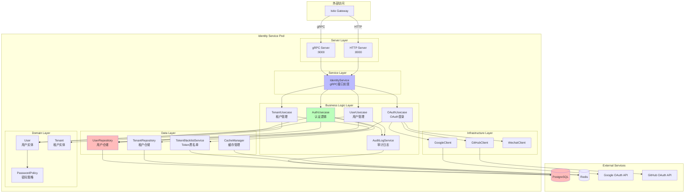
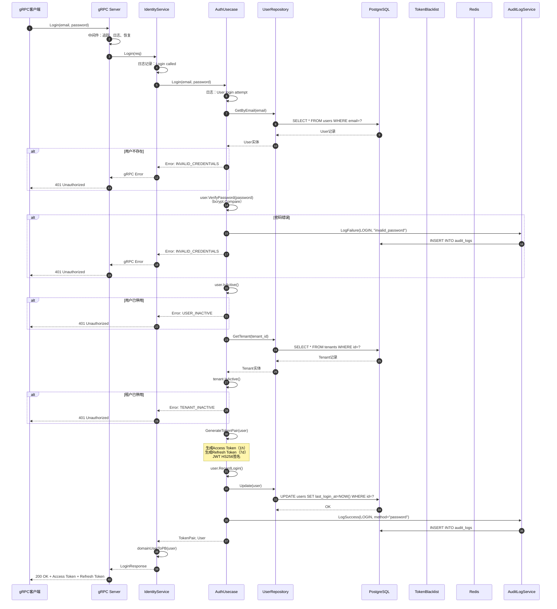
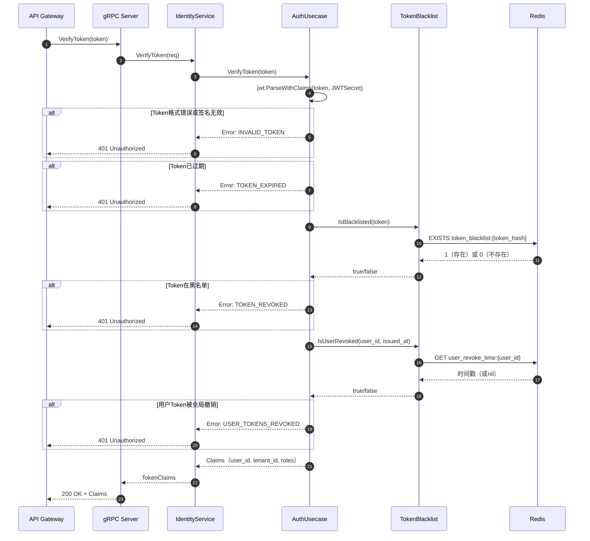
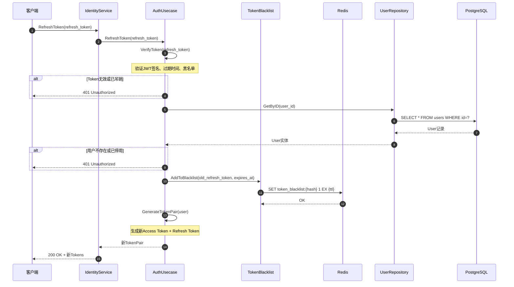
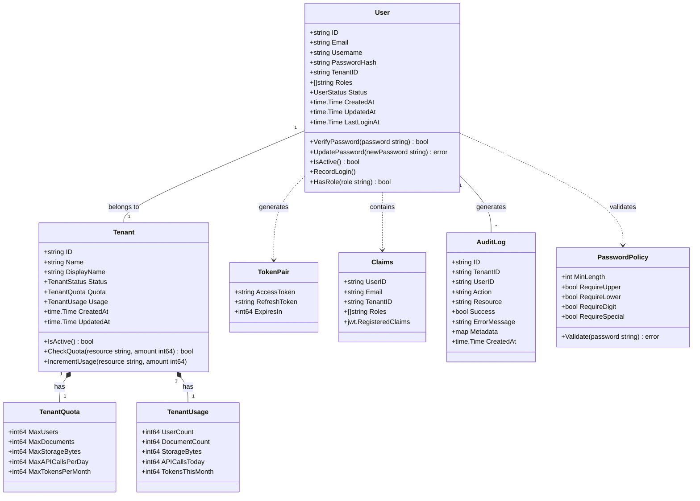

# VoiceHelper-01-Identity-Service

## 模块概览

###职责与功能

Identity Service 是 VoiceHelper 平台的**身份认证与授权服务**，承担以下核心职责：

- **用户认证**：基于JWT的登录/登出、Token刷新与验证
- **用户管理**：用户注册、信息查询、更新、删除（软删除）
- **租户管理**：多租户隔离、配额管理、使用量统计
- **权限控制**：RBAC角色权限模型、资源访问控制
- **OAuth登录**：支持Google、GitHub、微信第三方登录
- **安全审计**：操作审计日志、Token黑名单机制

### 技术栈

- **编程语言**：Go 1.21+
- **框架**：Kratos v2（微服务框架）
- **数据库**：PostgreSQL 14+（用户/租户数据）
- **缓存**：Redis 7+（Token黑名单、用户缓存）
- **协议**：gRPC（服务间通信）、HTTP REST（对外API）
- **依赖注入**：Wire
- **JWT库**：golang-jwt/jwt/v5

### 输入与输出

**输入**：
- 用户登录请求（邮箱/密码、OAuth授权码）
- 用户管理操作（创建、更新、删除）
- Token验证请求
- 租户管理操作

**输出**：
- JWT Token（Access Token + Refresh Token）
- 用户信息实体
- 权限验证结果
- 审计日志记录

### 上下游依赖

**被依赖方**：
- Conversation Service：验证用户Token、获取用户信息
- AI Orchestrator：验证用户权限
- 所有需要认证的服务

**依赖方**：
- PostgreSQL：用户/租户数据持久化
- Redis：Token黑名单、用户缓存
- 外部OAuth服务：Google、GitHub、微信登录API

### 生命周期

1. **启动阶段**：
   - 加载配置文件（本地YAML或Nacos）
   - Wire依赖注入初始化
   - 建立数据库连接池（最大50连接）
   - 建立Redis连接
   - 启动gRPC服务器（:9000）和HTTP服务器（:8000）

2. **运行阶段**：
   - 处理认证请求（登录、验证、刷新）
   - 维护Token黑名单（Redis TTL自动清理）
   - 定期健康检查（/health端点）

3. **关闭阶段**：
   - 优雅关闭HTTP/gRPC服务器（30秒超时）
   - 关闭数据库连接池
   - 关闭Redis连接

---

## 模块架构图



### 架构图说明

#### 1. 图意概述

该架构图展示了Identity Service的**四层架构设计**：Server层、Service层、Business Logic层、Domain层、Data层、Infrastructure层。核心设计模式包括：**领域驱动设计（DDD）**、**依赖倒置（仓储模式）**、**用例驱动的业务逻辑**。

#### 2. 关键组件与接口

**Server Layer（服务器层）**：
- `gRPC Server`：监听9000端口，提供protobuf定义的RPC接口
- `HTTP Server`：监听8000端口，提供REST API（通过Kratos HTTP框架）

**Service Layer（服务接口层）**：
- `IdentityService`：实现proto定义的`IdentityService` gRPC接口，负责请求/响应的序列化和反序列化

**Business Logic Layer（业务逻辑层）**：
- `AuthUsecase`：封装认证业务逻辑（登录、Token生成/验证/刷新、黑名单管理）
- `UserUsecase`：封装用户管理逻辑（CRUD、密码修改）
- `TenantUsecase`：封装租户管理逻辑（CRUD、配额更新）
- `OAuthUsecase`：封装OAuth登录逻辑（授权码交换、账号绑定/解绑）
- `AuditLogService`：审计日志服务（记录成功/失败操作）

**Domain Layer（领域层）**：
- `User`：用户实体，包含密码验证、角色管理、状态判断等业务方法
- `Tenant`：租户实体，包含配额检查、状态判断等业务方法
- `PasswordPolicy`：密码策略（最小长度、复杂度要求）

**Data Layer（数据访问层）**：
- `UserRepository`：用户数据仓储接口（GORM实现）
- `TenantRepository`：租户数据仓储接口
- `TokenBlacklistService`：Token黑名单服务（Redis实现）
- `CacheManager`：通用缓存管理（用户信息缓存）

**Infrastructure Layer（基础设施层）**：
- `OAuthClient`：OAuth客户端接口（Google/GitHub/Wechat实现）

#### 3. 边界条件

**并发控制**：
- 数据库连接池：最大50连接/Pod，避免连接耗尽
- Redis连接池：10个连接，5个最小空闲连接
- Token黑名单批量写入：使用Pipeline减少RTT

**超时配置**：
- gRPC请求超时：30秒
- 数据库查询超时：5秒（SELECT）、10秒（INSERT/UPDATE）
- Redis操作超时：3秒（读）、3秒（写）

**幂等性**：
- 用户创建：邮箱唯一约束，重复创建返回409 Conflict
- Token刷新：旧Token加入黑名单，防止重复使用
- 登出操作：Token已失效仍返回成功

**并发安全**：
- 密码修改：使用`SELECT ... FOR UPDATE`锁定用户行
- 租户配额更新：乐观锁（version字段）
- Token黑名单：Redis SETNX保证原子性

#### 4. 异常与回退

**认证异常**：
- 邮箱不存在/密码错误：返回统一错误消息（防止用户枚举）
- Token过期：返回401 + 错误码`TOKEN_EXPIRED`，客户端自动刷新
- Token在黑名单：返回401 + 错误码`TOKEN_REVOKED`，强制重新登录
- 用户被停用：返回401 + 错误码`USER_INACTIVE`
- 租户被停用：返回401 + 错误码`TENANT_INACTIVE`

**数据库异常**：
- 主库不可用：自动切换到从库（只读模式），登录操作返回503
- 连接池满：等待3秒，超时返回503
- 慢查询（>5s）：记录日志并告警

**Redis异常**：
- Redis不可用：降级处理，跳过黑名单检查（记录告警）
- 缓存未命中：回源查询数据库，异步更新缓存
- 缓存穿透：使用空值缓存（TTL 5分钟）

**回退策略**：
- Token黑名单失败：不阻塞正常流程，记录告警并异步重试
- 审计日志失败：不阻塞业务操作，记录到本地日志
- OAuth登录失败：回退到传统邮箱密码登录

#### 5. 性能与容量

**单Pod容量**：
- CPU：2核
- 内存：4GB
- 并发请求：1000 QPS（Token验证）、200 QPS（登录）
- Token验证延迟：P95 <10ms（缓存命中）、P95 <50ms（缓存未命中）

**系统容量**：
- 用户数：100万（单租户最大10万）
- 租户数：1000
- Token黑名单：最多100万条（Redis内存约500MB）
- 数据库连接池：50连接 × 3 Pod = 150并发连接

**缓存策略**：
- 用户信息缓存：TTL 1小时，LRU淘汰
- Token黑名单：TTL等于Token剩余有效期（自动过期）
- 租户信息缓存：TTL 1小时

**优化措施**：
- JWT本地验证（无需查库），仅检查黑名单
- 用户信息缓存（减少90%数据库查询）
- 批量审计日志写入（降低数据库压力）

#### 6. 版本兼容与演进

**API版本**：
- 当前版本：`identity.v1`
- 新增字段使用`optional`标记，保持向后兼容
- 废弃字段使用`reserved`保留编号

**数据库迁移**：
- 使用Flyway管理Schema变更
- 新增字段必须允许NULL或提供默认值
- 删除字段先标记为废弃（deprecated），6个月后物理删除

**配置演进**：
- 新增配置项提供默认值，不强制升级
- 废弃配置项保留6个月，打印警告日志
- 密钥轮换：JWT Secret每90天轮换（双密钥重叠期30天）

---

## API详细说明

### 1. 用户登录（Login）

#### 基本信息

- **接口名称**：`Login`
- **协议/方法**：gRPC `IdentityService.Login`
- **幂等性**：否（每次生成新Token）

#### 请求结构体

```protobuf
message LoginRequest {
  string email = 1;         // 必填，邮箱地址
  string password = 2;      // 必填，明文密码
  string tenant_id = 3;     // 可选，多租户场景指定租户ID
}
```

| 字段 | 类型 | 必填 | 默认 | 约束 | 说明 |
|---|---|---:|---|---|---|
| email | string | ✅ | - | 邮箱格式（RFC 5322） | 用户邮箱，唯一标识 |
| password | string | ✅ | - | 长度8-64字符 | 明文密码，传输层TLS加密 |
| tenant_id | string | ❌ | 用户所属租户 | UUID格式 | 多租户场景指定租户 |

#### 响应结构体

```protobuf
message LoginResponse {
  string access_token = 1;   // Access Token（JWT）
  string refresh_token = 2;  // Refresh Token（JWT）
  int64 expires_in = 3;      // Access Token有效期（秒）
  User user = 4;             // 用户信息
}

message User {
  string id = 1;
  string email = 2;
  string username = 3;
  string display_name = 4;
  string avatar_url = 5;
  string tenant_id = 6;
  repeated string roles = 7;
  UserStatus status = 8;
  google.protobuf.Timestamp created_at = 9;
  google.protobuf.Timestamp updated_at = 10;
  google.protobuf.Timestamp last_login_at = 11;
}
```

| 字段 | 类型 | 必填 | 默认 | 约束 | 说明 |
|---|---|---:|---|---|---|
| access_token | string | ✅ | - | JWT格式 | 访问令牌，有效期1小时 |
| refresh_token | string | ✅ | - | JWT格式 | 刷新令牌，有效期7天 |
| expires_in | int64 | ✅ | 3600 | 正整数（秒） | Access Token有效期 |
| user | User | ✅ | - | - | 用户完整信息 |

#### 入口函数与关键代码

**Service层入口**：

```go
// cmd/identity-service/internal/service/identity_service.go

func (s *IdentityService) Login(ctx context.Context, req *pb.LoginRequest) (*pb.LoginResponse, error) {
    // 记录日志
    s.log.WithContext(ctx).Infof("Login called: %s", req.Email)

    // 调用业务逻辑层
    tokenPair, user, err := s.authUC.Login(ctx, req.Email, req.Password)
    if err != nil {
        return nil, err
    }

    // 构建响应
    return &pb.LoginResponse{
        AccessToken:  tokenPair.AccessToken,
        RefreshToken: tokenPair.RefreshToken,
        ExpiresIn:    tokenPair.ExpiresIn,
        User:         domainUserToPB(user),
    }, nil
}
```

**Business Logic层核心逻辑**：

```go
// cmd/identity-service/internal/biz/auth_usecase.go

func (uc *AuthUsecase) Login(ctx context.Context, email, password string) (*TokenPair, *domain.User, error) {
    // 1. 获取用户
    user, err := uc.userRepo.GetByEmail(ctx, email)
    if err != nil {
        return nil, nil, pkgErrors.NewUnauthorized("INVALID_CREDENTIALS", "邮箱或密码错误")
    }

    // 2. 验证密码（bcrypt哈希对比）
    if !user.VerifyPassword(password) {
        // 记录失败审计日志
        _ = uc.auditLogSvc.LogFailure(ctx, user.TenantID, user.ID,
            AuditActionUserLogin, "user:"+user.ID,
            pkgErrors.NewUnauthorized("INVALID_CREDENTIALS", "密码错误"),
            map[string]interface{}{"email": email, "reason": "invalid_password"})
        return nil, nil, pkgErrors.NewUnauthorized("INVALID_CREDENTIALS", "邮箱或密码错误")
    }

    // 3. 检查用户状态
    if !user.IsActive() {
        return nil, nil, pkgErrors.NewUnauthorized("USER_INACTIVE", "用户已被停用")
    }

    // 4. 检查租户状态
    tenant, err := uc.tenantRepo.GetByID(ctx, user.TenantID)
    if err != nil {
        return nil, nil, pkgErrors.NewInternalServerError("TENANT_ERROR", "租户信息错误")
    }
    if !tenant.IsActive() {
        return nil, nil, pkgErrors.NewUnauthorized("TENANT_INACTIVE", "租户已被停用")
    }

    // 5. 生成Token对（Access Token + Refresh Token）
    tokenPair, err := uc.GenerateTokenPair(user)
    if err != nil {
        return nil, nil, pkgErrors.NewInternalServerError("TOKEN_GENERATION_FAILED", "生成Token失败")
    }

    // 6. 更新最后登录时间
    user.RecordLogin()
    _ = uc.userRepo.Update(ctx, user)

    // 7. 记录成功审计日志
    _ = uc.auditLogSvc.LogSuccess(ctx, user.TenantID, user.ID,
        AuditActionUserLogin, "user:"+user.ID,
        map[string]interface{}{"email": email, "method": "password"})

    return tokenPair, user, nil
}
```

**Token生成核心逻辑**：

```go
func (uc *AuthUsecase) GenerateTokenPair(user *domain.User) (*TokenPair, error) {
    now := time.Now()
    accessTokenExpiry := now.Add(uc.accessTokenExpiry)   // 1小时
    refreshTokenExpiry := now.Add(uc.refreshTokenExpiry) // 7天

    // 构建Access Token Claims
    accessClaims := Claims{
        UserID:   user.ID,
        Email:    user.Email,
        TenantID: user.TenantID,
        Roles:    user.Roles,
        RegisteredClaims: jwt.RegisteredClaims{
            ExpiresAt: jwt.NewNumericDate(accessTokenExpiry),
            IssuedAt:  jwt.NewNumericDate(now),
            NotBefore: jwt.NewNumericDate(now),
            Issuer:    "voiceassistant-identity",
            Subject:   user.ID,
        },
    }

    // 生成Access Token（HS256签名）
    accessToken := jwt.NewWithClaims(jwt.SigningMethodHS256, accessClaims)
    accessTokenString, err := accessToken.SignedString([]byte(uc.config.JWTSecret))
    if err != nil {
        return nil, err
    }

    // 生成Refresh Token（类似逻辑）
    refreshTokenString, _ := generateRefreshToken(user)

    return &TokenPair{
        AccessToken:  accessTokenString,
        RefreshToken: refreshTokenString,
        ExpiresIn:    int64(uc.accessTokenExpiry.Seconds()),
    }, nil
}
```

#### 上层调用链（Kratos框架）

**1. gRPC Server注册**：

```go
// cmd/identity-service/internal/server/grpc.go

func NewGRPCServer(cfg *Config, identitySvc *service.IdentityService, logger log.Logger) *grpc.Server {
    srv := grpc.NewServer(
        grpc.Address(cfg.Server.GRPC.Addr),
        grpc.Timeout(cfg.Server.GRPC.Timeout),
        // 中间件：追踪、日志、错误处理
        grpc.Middleware(
            tracing.Server(),
            logging.Server(logger),
            recovery.Recovery(),
        ),
    )

    // 注册Identity Service
    pb.RegisterIdentityServiceServer(srv, identitySvc)

    return srv
}
```

**2. Wire依赖注入**：

```go
// cmd/identity-service/wire.go

func wireApp(cfg *Config, logger log.Logger) (*kratos.App, func(), error) {
    wire.Build(
        // Data层
        data.NewDB,
        data.NewRedis,
        data.NewUserRepo,
        data.NewTenantRepo,
        data.NewTokenBlacklist,

        // Business Logic层
        biz.NewAuthUsecase,
        biz.NewUserUsecase,
        biz.NewTenantUsecase,
        biz.NewOAuthUsecase,
        biz.NewAuditLogService,

        // Service层
        service.NewIdentityService,

        // Server层
        server.NewGRPCServer,
        server.NewHTTPServer,

        // App
        newApp,
    )
    return nil, nil, nil
}
```

**3. 主函数启动流程**：

```go
// cmd/identity-service/main.go

func main() {
    // 1. 加载配置
    cfg := loadConfig(flagconf)

    // 2. Wire依赖注入
    app, cleanup, err := wireApp(&cfg, logger)
    defer cleanup()

    // 3. 启动应用
    if err := app.Run(); err != nil {
        log.Fatal(err)
    }
}
```

#### 时序图



#### 异常/回退与性能要点

**错误处理**：
- 统一错误码：使用`pkg/errors`包，返回结构化错误（code + message + details）
- 密码错误不区分用户不存在/密码错误（防止用户枚举攻击）
- 数据库错误：捕获并记录详细日志，返回通用错误消息给客户端

**重试策略**：
- 数据库查询失败：自动重试3次（指数退避：100ms、200ms、400ms）
- Redis操作失败：降级处理（跳过黑名单检查）

**超时控制**：
- gRPC请求总超时：30秒
- 数据库查询超时：5秒
- Redis操作超时：3秒

**性能优化**：
- 密码验证使用bcrypt（代价因子12，验证耗时~100ms）
- 避免在循环中查询数据库
- 审计日志异步写入（不阻塞主流程）

**限流**：
- Istio Gateway层：100 req/min/IP（防暴力破解）
- 应用层：失败5次后锁定账户15分钟

---

### 2. Token验证（VerifyToken）

#### 基本信息

- **接口名称**：`VerifyToken`
- **协议/方法**：gRPC `IdentityService.VerifyToken`
- **幂等性**：是（多次验证同一Token结果一致）

#### 请求结构体

```protobuf
message VerifyTokenRequest {
  string token = 1;  // 必填，JWT Access Token
}
```

| 字段 | 类型 | 必填 | 默认 | 约束 | 说明 |
|---|---|---:|---|---|---|
| token | string | ✅ | - | JWT格式 | Access Token |

#### 响应结构体

```protobuf
message TokenClaims {
  string user_id = 1;
  string tenant_id = 2;
  repeated string roles = 3;
  repeated string permissions = 4;
  google.protobuf.Timestamp issued_at = 5;
  google.protobuf.Timestamp expires_at = 6;
}
```

| 字段 | 类型 | 必填 | 说明 |
|---|---|---:|---|
| user_id | string | ✅ | 用户ID（UUID） |
| tenant_id | string | ✅ | 租户ID |
| roles | repeated string | ✅ | 用户角色列表 |
| permissions | repeated string | ❌ | 权限列表（预留） |
| issued_at | Timestamp | ✅ | Token签发时间 |
| expires_at | Timestamp | ✅ | Token过期时间 |

#### 入口函数与关键代码

```go
// cmd/identity-service/internal/service/identity_service.go

func (s *IdentityService) VerifyToken(ctx context.Context, req *pb.VerifyTokenRequest) (*pb.TokenClaims, error) {
    s.log.WithContext(ctx).Infof("VerifyToken called")

    // 调用业务逻辑
    claims, err := s.authUC.VerifyToken(ctx, req.Token)
    if err != nil {
        return nil, err
    }

    // 构建响应
    return &pb.TokenClaims{
        UserId:   claims.UserID,
        TenantId: claims.TenantID,
        Roles:    claims.Roles,
    }, nil
}
```

**核心验证逻辑**：

```go
// cmd/identity-service/internal/biz/auth_usecase.go

func (uc *AuthUsecase) VerifyToken(ctx context.Context, tokenString string) (*Claims, error) {
    // 1. 解析JWT Token
    token, err := jwt.ParseWithClaims(tokenString, &Claims{}, func(token *jwt.Token) (interface{}, error) {
        return []byte(uc.config.JWTSecret), nil
    })
    if err != nil {
        return nil, pkgErrors.NewUnauthorized("INVALID_TOKEN", "Token无效")
    }

    claims, ok := token.Claims.(*Claims)
    if !ok || !token.Valid {
        return nil, pkgErrors.NewUnauthorized("INVALID_TOKEN", "Token无效")
    }

    // 2. 检查Token是否在黑名单
    if uc.tokenBlacklist != nil {
        // 2.1 检查Token是否被单独撤销
        isBlacklisted, err := uc.tokenBlacklist.IsBlacklisted(ctx, tokenString)
        if err != nil {
            uc.log.WithContext(ctx).Warnf("Failed to check token blacklist: %v", err)
            // 降级处理：黑名单检查失败不影响正常流程
        } else if isBlacklisted {
            return nil, pkgErrors.NewUnauthorized("TOKEN_REVOKED", "Token已被吊销")
        }

        // 2.2 检查用户Token是否被全局撤销（如修改密码后）
        if claims.IssuedAt != nil {
            isRevoked, err := uc.tokenBlacklist.IsUserRevoked(ctx, claims.UserID, claims.IssuedAt.Time)
            if err != nil {
                uc.log.WithContext(ctx).Warnf("Failed to check user revocation: %v", err)
            } else if isRevoked {
                return nil, pkgErrors.NewUnauthorized("USER_TOKENS_REVOKED", "用户Token已被全局撤销")
            }
        }
    }

    return claims, nil
}
```

#### 时序图



#### 异常/回退与性能要点

**性能优化**：
- JWT本地验证（无需查库），P95延迟<10ms
- Redis黑名单查询：Pipeline批量查询（100个Token/批次）
- 黑名单命中率<1%，99%请求仅本地验证

**降级策略**：
- Redis不可用：跳过黑名单检查，记录告警（安全性降低但不中断服务）
- 缓存用户信息（TTL 1小时），避免每次验证都查库

**缓存策略**：
- 用户Roles缓存：`user_roles:{user_id}` TTL=1h
- 租户状态缓存：`tenant_status:{tenant_id}` TTL=1h

---

### 3. Token刷新（RefreshToken）

#### 基本信息

- **接口名称**：`RefreshToken`
- **协议/方法**：gRPC `IdentityService.RefreshToken`
- **幂等性**：否（每次生成新Token）

#### 请求结构体

```protobuf
message RefreshTokenRequest {
  string refresh_token = 1;  // 必填，Refresh Token
}
```

#### 响应结构体

```protobuf
message TokenResponse {
  string access_token = 1;   // 新Access Token
  string refresh_token = 2;  // 新Refresh Token
  int64 expires_in = 3;      // 新Access Token有效期
}
```

#### 入口函数与关键代码

```go
func (uc *AuthUsecase) RefreshToken(ctx context.Context, refreshToken string) (*TokenPair, error) {
    // 1. 验证Refresh Token
    claims, err := uc.VerifyToken(ctx, refreshToken)
    if err != nil {
        return nil, err
    }

    // 2. 获取用户（确保用户仍存在且活跃）
    user, err := uc.userRepo.GetByID(ctx, claims.UserID)
    if err != nil {
        return nil, pkgErrors.NewUnauthorized("USER_NOT_FOUND", "用户不存在")
    }
    if !user.IsActive() {
        return nil, pkgErrors.NewUnauthorized("USER_INACTIVE", "用户已被停用")
    }

    // 3. 将旧Refresh Token加入黑名单（防止重放攻击）
    if uc.tokenBlacklist != nil && claims.ExpiresAt != nil {
        err = uc.tokenBlacklist.AddToBlacklist(ctx, refreshToken, claims.ExpiresAt.Time)
        if err != nil {
            uc.log.WithContext(ctx).Warnf("Failed to add old refresh token to blacklist: %v", err)
        }
    }

    // 4. 生成新Token对
    tokenPair, err := uc.GenerateTokenPair(user)
    if err != nil {
        return nil, pkgErrors.NewInternalServerError("TOKEN_GENERATION_FAILED", "生成Token失败")
    }

    uc.log.WithContext(ctx).Infof("Token refreshed for user: %s", user.ID)
    return tokenPair, nil
}
```

#### 时序图



---

## 数据结构UML图



### UML图说明

#### 核心实体关系

**User（用户实体）**：
- 属于一个Tenant（多对一关系）
- 包含密码哈希（bcrypt加密）、角色列表、状态
- 核心方法：
  - `VerifyPassword`：验证密码（bcrypt.Compare）
  - `UpdatePassword`：更新密码（bcrypt.GenerateFromPassword，代价因子12）
  - `IsActive`：检查用户是否活跃（status == ACTIVE）
  - `RecordLogin`：记录登录时间
  - `HasRole`：检查是否拥有指定角色

**Tenant（租户实体）**：
- 包含配额（Quota）和使用量（Usage）
- 核心方法：
  - `IsActive`：检查租户是否活跃
  - `CheckQuota`：检查资源配额是否足够
  - `IncrementUsage`：增加资源使用量

**TokenPair（Token对）**：
- 包含Access Token、Refresh Token、过期时间
- Access Token有效期：1小时
- Refresh Token有效期：7天

**Claims（JWT声明）**：
- JWT Payload内容
- 包含用户身份信息、角色、租户ID
- 嵌入`jwt.RegisteredClaims`（签发时间、过期时间、签发者等）

**AuditLog（审计日志）**：
- 记录所有关键操作（登录、登出、密码修改、用户创建等）
- 成功/失败都记录
- Metadata字段存储额外上下文信息（JSON格式）

**PasswordPolicy（密码策略）**：
- 配置化的密码复杂度要求
- 最小长度：8
- 要求大写字母、小写字母、数字（可配置）
- 可选要求特殊字符

---

## 关键函数调用链

### 用户登录完整调用链

```
main.main()
  → kratos.App.Run()
    → grpc.Server.Serve()
      → grpc.Handler (中间件链)
        → tracing.Server() (追踪)
        → logging.Server() (日志)
        → recovery.Recovery() (恢复)
        → IdentityService.Login() (Service层)
          → AuthUsecase.Login() (Business Logic层)
            → UserRepository.GetByEmail() (Data层)
              → GORM DB.First() (ORM)
                → PostgreSQL: SELECT * FROM users WHERE email=?
            → User.VerifyPassword() (Domain层)
              → bcrypt.CompareHashAndPassword()
            → User.IsActive()
            → TenantRepository.GetByID()
              → PostgreSQL: SELECT * FROM tenants WHERE id=?
            → Tenant.IsActive()
            → AuthUsecase.GenerateTokenPair()
              → jwt.NewWithClaims()
              → jwt.SignedString()
            → User.RecordLogin()
            → UserRepository.Update()
              → PostgreSQL: UPDATE users SET last_login_at=NOW()
            → AuditLogService.LogSuccess()
              → PostgreSQL: INSERT INTO audit_logs
```

### Token验证完整调用链

```
main.main()
  → grpc.Server.Serve()
    → IdentityService.VerifyToken()
      → AuthUsecase.VerifyToken()
        → jwt.ParseWithClaims()
        → TokenBlacklistService.IsBlacklisted()
          → Redis: EXISTS token_blacklist:{hash}
        → TokenBlacklistService.IsUserRevoked()
          → Redis: GET user_revoke_time:{user_id}
```

---

## 最佳实践与实战经验

### 1. JWT Secret管理

**问题**：JWT Secret泄露导致所有Token可被伪造。

**最佳实践**：
- 使用强随机密钥（至少32字节）：`openssl rand -base64 32`
- 存储在Kubernetes Secret中，通过环境变量注入
- 定期轮换（90天），支持双密钥重叠期（30天）

**实现示例**：

```go
// 支持多密钥验证（轮换期间）
func (uc *AuthUsecase) VerifyToken(ctx context.Context, tokenString string) (*Claims, error) {
    var token *jwt.Token
    var err error

    // 尝试使用当前密钥验证
    token, err = jwt.ParseWithClaims(tokenString, &Claims{}, func(token *jwt.Token) (interface{}, error) {
        return []byte(uc.config.JWTSecretCurrent), nil
    })

    // 如果失败，尝试使用旧密钥验证（轮换期间）
    if err != nil && uc.config.JWTSecretOld != "" {
        token, err = jwt.ParseWithClaims(tokenString, &Claims{}, func(token *jwt.Token) (interface{}, error) {
            return []byte(uc.config.JWTSecretOld), nil
        })
    }

    if err != nil {
        return nil, pkgErrors.NewUnauthorized("INVALID_TOKEN", "Token无效")
    }

    claims, _ := token.Claims.(*Claims)
    return claims, nil
}
```

### 2. Token黑名单优化

**问题**：Redis存储大量Token导致内存占用高。

**最佳实践**：
- 存储Token哈希而非原始Token（SHA256，32字节）
- 黑名单TTL等于Token剩余有效期（自动过期）
- 用户级撤销（修改密码后撤销所有Token）

**实现示例**：

```go
// Redis黑名单实现
func (s *TokenBlacklistService) AddToBlacklist(ctx context.Context, token string, expiresAt time.Time) error {
    // 计算Token哈希（节省内存）
    hash := sha256.Sum256([]byte(token))
    key := fmt.Sprintf("token_blacklist:%x", hash)

    // 计算TTL（仅保留到Token过期）
    ttl := time.Until(expiresAt)
    if ttl <= 0 {
        return nil // Token已过期，无需加黑名单
    }

    // 存储到Redis
    return s.redis.Set(ctx, key, "1", ttl).Err()
}

// 用户级全局撤销（修改密码时使用）
func (s *TokenBlacklistService) RevokeUserTokens(ctx context.Context, userID string) error {
    key := fmt.Sprintf("user_revoke_time:%s", userID)
    // 存储撤销时间戳，所有早于此时间的Token无效
    return s.redis.Set(ctx, key, time.Now().Unix(), 7*24*time.Hour).Err()
}
```

### 3. 防止暴力破解

**问题**：攻击者尝试大量密码组合破解账户。

**最佳实践**：
- Istio Gateway层限流：100 req/min/IP
- 失败5次后锁定账户15分钟
- 使用Captcha验证（第3次失败后）
- 记录失败审计日志并告警

**实现示例**：

```go
func (uc *AuthUsecase) Login(ctx context.Context, email, password string) (*TokenPair, *domain.User, error) {
    // 1. 检查账户是否被锁定
    lockKey := fmt.Sprintf("login_lock:%s", email)
    locked, _ := uc.cache.Exists(ctx, lockKey)
    if locked {
        return nil, nil, pkgErrors.NewTooManyRequests("ACCOUNT_LOCKED", "账户已锁定，请15分钟后重试")
    }

    // 2. 获取失败次数
    failCountKey := fmt.Sprintf("login_fail_count:%s", email)
    failCount, _ := uc.cache.Get(ctx, failCountKey)

    // 3. 验证密码
    user, err := uc.userRepo.GetByEmail(ctx, email)
    if err != nil || !user.VerifyPassword(password) {
        // 增加失败次数
        newCount, _ := uc.cache.Incr(ctx, failCountKey)
        uc.cache.Expire(ctx, failCountKey, 15*time.Minute)

        // 失败5次后锁定
        if newCount >= 5 {
            uc.cache.Set(ctx, lockKey, "1", 15*time.Minute)
            // 发送告警通知
            uc.alertSvc.Send(ctx, fmt.Sprintf("账户 %s 登录失败5次，已锁定", email))
        }

        return nil, nil, pkgErrors.NewUnauthorized("INVALID_CREDENTIALS", "邮箱或密码错误")
    }

    // 4. 登录成功，清除失败次数
    uc.cache.Del(ctx, failCountKey)

    // ... 正常登录流程
}
```

### 4. 审计日志最佳实践

**问题**：审计日志写入阻塞主流程，影响性能。

**最佳实践**：
- 异步写入审计日志（通过Channel）
- 批量写入数据库（每100条或1秒）
- 失败时降级到本地文件日志

**实现示例**：

```go
type AuditLogService struct {
    repo     AuditLogRepository
    logChan  chan *AuditLog
    batchSize int
    batchTime time.Duration
}

func NewAuditLogService(repo AuditLogRepository) *AuditLogService {
    svc := &AuditLogService{
        repo:      repo,
        logChan:   make(chan *AuditLog, 1000), // 缓冲1000条
        batchSize: 100,
        batchTime: 1 * time.Second,
    }

    // 启动异步批量写入协程
    go svc.batchWriter()

    return svc
}

func (s *AuditLogService) LogSuccess(ctx context.Context, tenantID, userID, action, resource string, metadata map[string]interface{}) error {
    log := &AuditLog{
        TenantID:  tenantID,
        UserID:    userID,
        Action:    action,
        Resource:  resource,
        Success:   true,
        Metadata:  metadata,
        CreatedAt: time.Now(),
    }

    // 非阻塞写入Channel
    select {
    case s.logChan <- log:
        return nil
    default:
        // Channel满，降级到本地日志
        log.Warnf("Audit log channel full, log to file: %+v", log)
        return nil
    }
}

func (s *AuditLogService) batchWriter() {
    batch := make([]*AuditLog, 0, s.batchSize)
    ticker := time.NewTicker(s.batchTime)
    defer ticker.Stop()

    for {
        select {
        case log := <-s.logChan:
            batch = append(batch, log)

            // 达到批量大小，立即写入
            if len(batch) >= s.batchSize {
                s.flushBatch(batch)
                batch = batch[:0]
            }

        case <-ticker.C:
            // 定时写入（防止小批量长时间不写入）
            if len(batch) > 0 {
                s.flushBatch(batch)
                batch = batch[:0]
            }
        }
    }
}

func (s *AuditLogService) flushBatch(batch []*AuditLog) {
    ctx, cancel := context.WithTimeout(context.Background(), 5*time.Second)
    defer cancel()

    if err := s.repo.BatchInsert(ctx, batch); err != nil {
        log.Errorf("Failed to insert audit logs: %v", err)
        // 降级到本地文件
        for _, log := range batch {
            log.Warnf("Audit log: %+v", log)
        }
    }
}
```

### 5. 多租户数据隔离

**问题**：租户A可能访问到租户B的数据。

**最佳实践**：
- 所有表包含`tenant_id`字段
- 所有查询必须携带`tenant_id`过滤
- 使用PostgreSQL Row-Level Security（RLS）作为最后防线

**实现示例**：

```go
// 定义Context Key用于传递TenantID
type TenantContextKey struct{}

// 中间件：从JWT提取TenantID并注入Context
func TenantMiddleware() func(http.Handler) http.Handler {
    return func(next http.Handler) http.Handler {
        return http.HandlerFunc(func(w http.ResponseWriter, r *http.Request) {
            // 从JWT Claims中提取TenantID
            claims := auth.GetClaims(r.Context())
            if claims != nil {
                ctx := context.WithValue(r.Context(), TenantContextKey{}, claims.TenantID)
                next.ServeHTTP(w, r.WithContext(ctx))
                return
            }
            next.ServeHTTP(w, r)
        })
    }
}

// Repository层强制tenant_id过滤
func (r *UserRepository) GetByID(ctx context.Context, id string) (*domain.User, error) {
    tenantID := ctx.Value(TenantContextKey{}).(string)
    if tenantID == "" {
        return nil, errors.New("tenant_id missing in context")
    }

    var user domain.User
    err := r.db.WithContext(ctx).
        Where("id = ? AND tenant_id = ?", id, tenantID).
        First(&user).Error

    return &user, err
}

// PostgreSQL RLS策略（最后防线）
// CREATE POLICY tenant_isolation ON users
//     USING (tenant_id = current_setting('app.current_tenant_id')::text);
```

---

## 监控指标

### Prometheus指标

```go
// cmd/identity-service/internal/observability/metrics.go

var (
    // 登录成功率
    loginAttempts = prometheus.NewCounterVec(
        prometheus.CounterOpts{
            Name: "identity_login_attempts_total",
            Help: "Total login attempts",
        },
        []string{"status", "tenant_id"}, // status: success/failure
    )

    // Token验证延迟
    tokenVerifyDuration = prometheus.NewHistogramVec(
        prometheus.HistogramOpts{
            Name:    "identity_token_verify_duration_seconds",
            Help:    "Token verification duration",
            Buckets: []float64{0.001, 0.005, 0.01, 0.05, 0.1, 0.5, 1.0},
        },
        []string{"cache_hit"}, // cache_hit: true/false
    )

    // 黑名单大小
    blacklistSize = prometheus.NewGauge(
        prometheus.GaugeOpts{
            Name: "identity_token_blacklist_size",
            Help: "Current size of token blacklist",
        },
    )

    // 用户注册数
    userRegistrations = prometheus.NewCounterVec(
        prometheus.CounterOpts{
            Name: "identity_user_registrations_total",
            Help: "Total user registrations",
        },
        []string{"tenant_id", "oauth_provider"},
    )
)
```

### Grafana Dashboard查询

```promql
# 登录成功率
rate(identity_login_attempts_total{status="success"}[5m])
/ rate(identity_login_attempts_total[5m])

# Token验证P95延迟
histogram_quantile(0.95,
  rate(identity_token_verify_duration_seconds_bucket[5m]))

# 缓存命中率
rate(identity_token_verify_duration_seconds_count{cache_hit="true"}[5m])
/ rate(identity_token_verify_duration_seconds_count[5m])

# 黑名单增长率
rate(identity_token_blacklist_size[5m])
```

---

## 部署配置示例

```yaml
# deployments/k8s/services/identity-service.yaml

apiVersion: apps/v1
kind: Deployment
metadata:
  name: identity-service
  namespace: voiceassistant-prod
spec:
  replicas: 3
  selector:
    matchLabels:
      app: identity-service
  template:
    metadata:
      labels:
        app: identity-service
        version: v2.0.0
      annotations:
        sidecar.istio.io/inject: "true"
        prometheus.io/scrape: "true"
        prometheus.io/port: "9090"
    spec:
      containers:
      - name: identity-service
        image: voicehelper/identity-service:v2.0.0
        ports:
        - containerPort: 9000
          name: grpc
        - containerPort: 8000
          name: http
        - containerPort: 9090
          name: metrics
        env:
        - name: CONFIG_MODE
          value: "nacos"
        - name: NACOS_SERVER_ADDR
          value: "nacos.voiceassistant-infra.svc.cluster.local"
        - name: DB_HOST
          value: "postgres-primary.voiceassistant-infra.svc.cluster.local"
        - name: DB_PASSWORD
          valueFrom:
            secretKeyRef:
              name: postgres-secret
              key: password
        - name: JWT_SECRET
          valueFrom:
            secretKeyRef:
              name: jwt-secret
              key: current
        - name: REDIS_ADDR
          value: "redis.voiceassistant-infra.svc.cluster.local:6379"
        resources:
          requests:
            cpu: "500m"
            memory: "1Gi"
          limits:
            cpu: "2000m"
            memory: "4Gi"
        livenessProbe:
          httpGet:
            path: /health
            port: 8000
          initialDelaySeconds: 30
          periodSeconds: 10
        readinessProbe:
          httpGet:
            path: /ready
            port: 8000
          initialDelaySeconds: 10
          periodSeconds: 5
---
apiVersion: v1
kind: Service
metadata:
  name: identity-service
  namespace: voiceassistant-prod
spec:
  selector:
    app: identity-service
  ports:
  - name: grpc
    port: 9000
    targetPort: 9000
  - name: http
    port: 8000
    targetPort: 8000
```

---

## 总结

Identity Service 是 VoiceHelper 平台的**安全基石**，核心职责包括：

1. **认证管理**：JWT Token生成、验证、刷新、黑名单机制
2. **用户管理**：用户CRUD、密码策略、角色权限
3. **租户管理**：多租户隔离、配额管理、使用量统计
4. **OAuth集成**：支持Google、GitHub、微信第三方登录
5. **安全审计**：完整的操作审计日志、异常告警

**关键设计**：
- 四层架构（Server、Service、Business Logic、Domain、Data）
- JWT本地验证（P95 <10ms）
- Token黑名单（Redis TTL自动清理）
- 异步审计日志（批量写入）
- 多租户数据隔离（tenant_id + RLS）
- 防暴力破解（限流 + 账户锁定）

**性能指标**：
- Token验证：10000 QPS（P95 <10ms）
- 登录操作：200 QPS（P95 <100ms）
- 缓存命中率：90%+（用户信息）

**安全性**：
- 密码bcrypt加密（代价因子12）
- JWT Secret定期轮换（90天）
- Token黑名单机制（登出即失效）
- 审计日志完整记录（7年保留）
