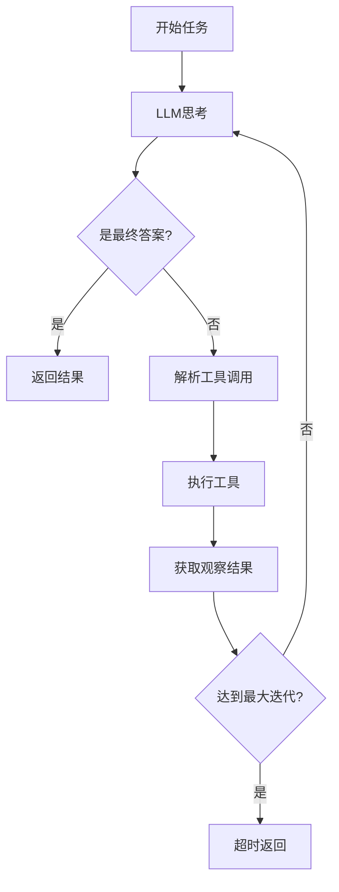

# Agent Engine 实现总结

## 服务概述

**Agent Engine**（Agent 执行引擎）是 VoiceAssistant 平台的核心 AI 服务之一，负责智能 Agent 的任务执行、工具调用和多步推理。

## 核心功能

### 1. ReAct Agent 执行

- **Reasoning + Acting**: 思考-行动-观察循环
- **多步推理**: 支持复杂任务的分解和执行
- **自主决策**: Agent 自动选择合适的工具
- **迭代控制**: 可配置最大迭代次数和超时时间

### 2. 工具管理系统

- **内置工具**: 计算器、搜索、知识库查询
- **工具注册**: 可插拔的工具注册机制
- **工具执行**: 统一的工具调用接口
- **错误处理**: 工具执行失败的优雅处理

### 3. LLM 集成

- **OpenAI API**: 支持 GPT-4 等模型
- **对话管理**: 维护完整的对话历史
- **提示工程**: 优化的系统提示模板
- **成本追踪**: Token 使用统计

### 4. 任务管理

- **同步执行**: 立即返回结果
- **异步执行**: 后台任务处理
- **状态查询**: 任务进度和结果查询
- **结果缓存**: 内存缓存任务结果

## 技术架构

### 分层设计

```
├── API层 (Routers)
│   ├── health.py        # 健康检查
│   ├── agent.py         # Agent执行接口
│   └── tools.py         # 工具管理接口
│
├── 服务层 (Services)
│   ├── agent_service.py  # Agent执行逻辑
│   ├── llm_service.py    # LLM调用封装
│   └── tool_service.py   # 工具管理和执行
│
├── 模型层 (Models)
│   └── agent.py         # 数据模型定义
│
└── 核心层 (Core)
    ├── config.py        # 配置管理
    └── logging_config.py # 日志配置
```

### 核心类设计

#### AgentService

```python
class AgentService:
    async def execute(task: AgentTask) -> AgentResult
    async def execute_async(task: AgentTask)
    async def get_task_result(task_id: str) -> AgentResult
```

#### ToolService

```python
class ToolService:
    def register_tool(name, description, function, parameters)
    async def execute_tool(tool_name, parameters) -> Any
    def list_tools() -> List[Dict]
```

#### LLMService

```python
class LLMService:
    async def chat(messages, model, temperature) -> Dict
    async def completion(prompt, model) -> str
```

## 数据模型

### AgentTask

```python
{
    "task_id": "task_abc123",
    "task": "任务描述",
    "context": {},
    "tools": ["calculator", "search"],
    "max_iterations": 10,
    "model": "gpt-4"
}
```

### AgentResult

```python
{
    "task_id": "task_abc123",
    "result": "最终答案",
    "steps": [
        {"step_type": "thought", "content": "..."},
        {"step_type": "action", "tool_name": "calculator", ...},
        {"step_type": "observation", "content": "..."},
    ],
    "status": "completed",
    "iterations": 3,
    "execution_time": 2.5
}
```

## API 接口

### 执行 Agent

```
POST /api/v1/agent/execute
```

### 异步执行

```
POST /api/v1/agent/execute-async
```

### 查询任务

```
GET /api/v1/agent/task/{task_id}
```

### 工具列表

```
GET /api/v1/tools/list
```

### 执行工具

```
POST /api/v1/tools/{tool_name}/execute
```

## 工作流程

### ReAct 循环



### 执行示例

**用户任务**: "计算 25 \* 4 + 10"

**执行过程**:

1. **Thought**: "需要进行数学计算，应该使用 calculator 工具"
2. **Action**: calculator
3. **Input**: `{"expression": "25 * 4 + 10"}`
4. **Observation**: "110"
5. **Thought**: "计算结果是 110，这是最终答案"
6. **Final Answer**: "110"

## 配置管理

### 环境变量

- `OPENAI_API_KEY`: OpenAI API 密钥
- `DEFAULT_MODEL`: 默认模型（gpt-4）
- `MAX_ITERATIONS`: 最大迭代次数（10）
- `TIMEOUT_SECONDS`: 超时时间（300 秒）
- `PORT`: 服务端口（8003）

### 配置文件

- `.env`: 环境配置
- `config.py`: Pydantic 配置管理

## 性能优化

### 1. 异步处理

- 使用 FastAPI 的异步特性
- httpx 异步 HTTP 客户端
- 后台任务处理

### 2. 缓存机制

- 任务结果内存缓存
- LLM 响应缓存（可选）
- 工具结果缓存（可选）

### 3. 超时控制

- 任务级超时
- LLM 调用超时
- 工具执行超时

## 监控和日志

### 日志级别

- INFO: 正常执行流程
- WARNING: 异常情况（超时等）
- ERROR: 错误和异常

### 关键日志

```
[task_id] Starting agent execution
[task_id] Iteration N/M
[task_id] Thought: ...
[task_id] Action: tool_name
[task_id] Observation: ...
[task_id] Completed in X.XXs
```

### 监控指标

- 任务执行时间
- 迭代次数分布
- 工具调用频率
- 成功率/失败率
- Token 消耗统计

## 安全考虑

### 1. 工具执行安全

- 白名单机制
- 参数验证
- 执行隔离
- 超时保护

### 2. LLM 调用安全

- API 密钥保护
- 速率限制
- 成本控制
- 内容过滤

### 3. 输入验证

- Pydantic 模型验证
- 参数类型检查
- 长度限制
- 格式验证

## 扩展性

### 1. 新增工具

```python
tool_service.register_tool(
    name="new_tool",
    description="...",
    function=tool_function,
    parameters={...},
    required_params=[...]
)
```

### 2. 自定义 Agent 策略

- 替换 ReAct 为其他模式
- 自定义提示模板
- 调整推理策略

### 3. 集成外部服务

- 知识库服务
- 搜索引擎
- 数据库
- 第三方 API

## 测试策略

### 1. 单元测试

- 工具执行测试
- LLM 服务模拟测试
- Agent 逻辑测试

### 2. 集成测试

- 端到端 Agent 执行
- 工具链测试
- 错误场景测试

### 3. 性能测试

- 并发执行测试
- 长任务测试
- 资源消耗测试

## 部署建议

### 1. Docker 部署

```bash
docker build -t agent-engine .
docker run -p 8003:8003 agent-engine
```

### 2. Kubernetes 部署

- HPA 自动扩缩容
- 资源限制配置
- 健康检查配置
- 配置热更新

### 3. 监控集成

- Prometheus 指标
- Grafana 仪表盘
- Jaeger 链路追踪
- ELK 日志聚合

## 依赖项

### 核心依赖

- FastAPI 0.110.0
- Pydantic 2.6.1
- httpx 0.26.0
- uvicorn 0.27.1

### 可选依赖

- LangChain 0.1.7（高级 Agent 功能）
- OpenAI SDK 1.12.0
- Redis 5.0.1（缓存）
- SQLAlchemy 2.0.27（持久化）

## 后续改进

### 短期

- [ ] 添加更多内置工具
- [ ] 实现工具结果缓存
- [ ] 添加 Prometheus 指标
- [ ] 完善错误处理

### 中期

- [ ] 支持流式响应
- [ ] 实现多 Agent 协作
- [ ] 添加人工反馈循环
- [ ] 工具调用可视化

### 长期

- [ ] 支持自定义 Agent 策略
- [ ] 工具市场和插件系统
- [ ] Agent 训练和优化
- [ ] 分布式 Agent 执行

## 文档资源

- API 文档: http://localhost:8003/docs
- README: ./README.md
- 配置示例: ./.env.example
- 架构文档: ../../docs/arch/agent-engine.md

## 联系方式

- 团队: VoiceAssistant AI Team
- 邮箱: dev@voiceassistant.ai
- 文档: https://docs.voiceassistant.ai

---

**实现日期**: 2025-10-26
**版本**: v1.0.0
**状态**: ✅ 完成
