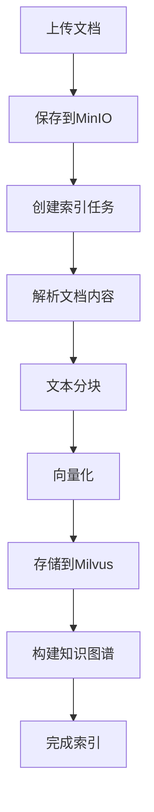

# Indexing Service 实现总结

## 服务概述

**Indexing Service**（索引服务）是 VoiceAssistant 平台的文档索引与向量化服务，负责将各种格式的文档转换为可检索的向量表示。

## 核心功能

### 1. 文档管理

- **上传**: 支持多种文档格式（PDF、DOCX、TXT、MD、HTML）
- **存储**: MinIO 对象存储
- **元数据**: 文档信息管理
- **删除**: 级联删除所有关联数据

### 2. 文档解析

- **PDF 解析**: PyPDF2
- **DOCX 解析**: python-docx
- **HTML 解析**: BeautifulSoup
- **TXT/MD**: 直接读取
- **格式自动检测**: 根据文件扩展名

### 3. 文本分块（Chunking）

- **固定大小**: 512 字符/块（可配置）
- **重叠窗口**: 50 字符重叠（可配置）
- **位置追踪**: 记录块在文档中的位置
- **元数据保留**: 保留文档元信息

### 4. 向量化（Embedding）

- **BGE-M3**: 中文优化，1024 维
- **OpenAI Embeddings**: text-embedding-3-small，1536 维
- **批量处理**: 32 texts/batch
- **缓存支持**: Redis 缓存向量结果

### 5. 向量存储（Milvus）

- **Collection 管理**: 自动创建和管理
- **批量插入**: 高性能批量写入
- **索引优化**: HNSW 索引
- **过滤查询**: 支持标量过滤

### 6. 知识图谱（Neo4j）

- **文档节点**: Document 节点
- **块节点**: Chunk 节点
- **关系构建**: CONTAINS、NEXT 等
- **实体识别**: 可选 NER 提取

## 技术架构

### 分层设计

```
├── API层 (Routers)
│   ├── health.py        # 健康检查
│   ├── document.py      # 文档处理接口
│   └── chunk.py         # 文本块管理接口
│
├── 服务层 (Services)
│   ├── document_service.py   # 文档处理编排
│   ├── chunk_service.py      # 文本分块
│   ├── embedding_service.py  # 向量化
│   ├── parser_service.py     # 文档解析
│   ├── storage_service.py    # 对象存储
│   └── vector_service.py     # 向量数据库
│
├── 模型层 (Models)
│   └── document.py      # 数据模型定义
│
└── 核心层 (Core)
    ├── config.py        # 配置管理
    └── logging_config.py # 日志配置
```

### 核心类设计

#### DocumentService

```python
class DocumentService:
    async def save_document(filename, content, tenant_id, kb_id) -> Dict
    async def create_indexing_job(document_id, tenant_id, kb_id, options) -> str
    async def process_document(document_id, job_id, options)
    async def get_job_status(job_id) -> Dict
    async def delete_document(document_id)
```

#### ChunkService

```python
class ChunkService:
    async def create_chunks(document_id, content, chunk_size, overlap) -> List
    async def get_chunks_by_document(document_id, offset, limit) -> List
    async def get_chunk_by_id(chunk_id) -> Dict
    async def delete_chunks(document_id)
    async def reindex_document(document_id) -> Dict
```

#### EmbeddingService

```python
class EmbeddingService:
    async def embed(text: str) -> List[float]
    async def embed_batch(texts: List[str]) -> List[List[float]]
    async def embed_with_openai(texts: List[str]) -> List[List[float]]
```

## 数据模型

### Document

```python
{
    "id": "doc_abc123",
    "name": "example.pdf",
    "format": "pdf",
    "size": 102400,
    "storage_path": "doc_abc123/example.pdf",
    "tenant_id": "tenant_123",
    "user_id": "user_456",
    "knowledge_base_id": "kb_789",
    "status": "indexed",
    "metadata": {},
    "created_at": "2025-10-26T10:00:00Z",
    "indexed_at": "2025-10-26T10:05:00Z"
}
```

### Chunk

```python
{
    "id": "chunk_xyz789",
    "document_id": "doc_abc123",
    "content": "文本内容...",
    "position": 0,
    "chunk_size": 512,
    "embedding": [0.1, 0.2, ...],
    "metadata": {},
    "created_at": "2025-10-26T10:00:00Z"
}
```

### IndexingJob

```python
{
    "job_id": "job_def456",
    "document_id": "doc_abc123",
    "status": "indexed",
    "chunks_count": 25,
    "vectors_count": 25,
    "graph_nodes_count": 25,
    "started_at": "2025-10-26T10:00:00Z",
    "completed_at": "2025-10-26T10:05:00Z",
    "metadata": {}
}
```

## 工作流程

### 完整索引流程



### 处理示例

**输入**: example.pdf (10KB)

**步骤**:

1. **上传**: 保存到 MinIO → `doc_abc123/example.pdf`
2. **解析**: PyPDF2 提取文本 → "Lorem ipsum dolor sit amet..."
3. **分块**: 512 字符/块，50 字符重叠 → 25 个块
4. **向量化**: BGE-M3 → 25 个 1024 维向量
5. **存储**: Milvus 插入 25 条记录
6. **图谱**: Neo4j 创建 1 个文档节点 + 25 个块节点
7. **完成**: 状态更新为 `indexed`

## API 接口

### 上传文档

```
POST /api/v1/documents/upload
Content-Type: multipart/form-data

file: document.pdf
tenant_id: tenant_123
knowledge_base_id: kb_456
```

### 索引文档

```
POST /api/v1/documents/index

{
  "document_id": "doc_abc123",
  "tenant_id": "tenant_123",
  "knowledge_base_id": "kb_456",
  "options": {
    "chunk_size": 512,
    "overlap": 50,
    "build_graph": true
  }
}
```

### 查询状态

```
GET /api/v1/documents/index/{job_id}
```

### 获取文档块

```
GET /api/v1/chunks/{document_id}?offset=0&limit=20
```

### 删除文档

```
DELETE /api/v1/documents/{document_id}
```

## 配置管理

### 环境变量

- `EMBEDDING_MODEL`: BGE-M3 或自定义模型
- `EMBEDDING_DIMENSION`: 向量维度（1024）
- `MAX_CHUNK_SIZE`: 最大块大小（512）
- `CHUNK_OVERLAP`: 重叠大小（50）
- `MILVUS_HOST`: Milvus 主机
- `MILVUS_PORT`: Milvus 端口（19530）
- `NEO4J_URI`: Neo4j 连接 URI
- `MINIO_ENDPOINT`: MinIO 端点

## 性能指标

### 处理速度

- **小文件** (< 1MB): < 5 秒
- **中文件** (1-10MB): 10-30 秒
- **大文件** (10-100MB): 1-5 分钟

### 吞吐量

- **向量化**: ~100 texts/second
- **Milvus 插入**: ~1000 vectors/second
- **并发处理**: 10 documents 同时

### 资源消耗

- **内存**: ~500MB (base) + 文档大小
- **CPU**: 2 cores (推荐)
- **存储**: MinIO + Milvus

## 依赖服务

### 必需

- **Milvus**: 向量存储
- **MinIO**: 对象存储

### 可选

- **Neo4j**: 知识图谱
- **Redis**: 缓存
- **PostgreSQL**: 元数据持久化

## 部署建议

### Docker 部署

```bash
docker build -t indexing-service .
docker run -p 8004:8004 indexing-service
```

### Kubernetes 部署

- HPA: CPU > 70% 自动扩容
- 资源限制: 2 CPU, 4GB Memory
- 持久化存储: PVC for cache

## 监控和日志

### 关键日志

```
[job_id] Starting document processing: doc_abc123
[job_id] Document downloaded
[job_id] Document parsed, length: 10240
[job_id] Created 25 chunks
[job_id] Generated 25 embeddings
[job_id] Inserted 25 vectors to Milvus
[job_id] Document processing completed in 5.23s
```

### 监控指标

- 文档处理成功率
- 平均处理时间
- 向量化延迟
- Milvus 写入性能
- 存储空间使用

## 后续改进

### 短期

- [ ] 完善文档解析器（PDF 表格、图片）
- [ ] 实现智能分块策略
- [ ] 添加向量缓存
- [ ] 性能基准测试

### 中期

- [ ] 支持更多文档格式（PPT、Excel）
- [ ] 实体识别和知识图谱增强
- [ ] 分布式处理
- [ ] 增量索引

### 长期

- [ ] 多模态索引（图片、音频）
- [ ] 自适应分块策略
- [ ] 向量压缩和量化
- [ ] GPU 加速向量化

## 文档资源

- API 文档: http://localhost:8004/docs
- README: ./README.md
- 架构文档: ../../docs/arch/indexing-service.md

---

**实现日期**: 2025-10-26
**版本**: v1.0.0
**状态**: ✅ 完成
