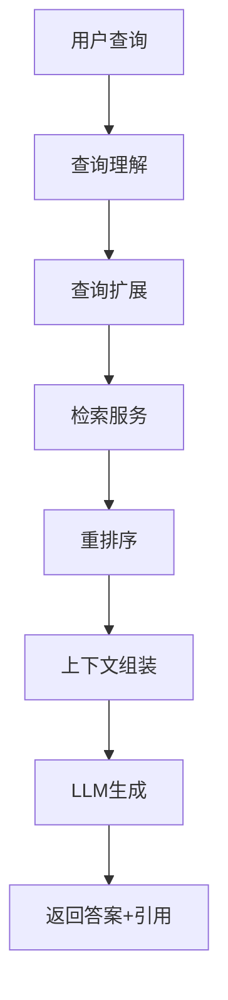

# RAG Engine - 检索增强生成引擎

## 概述

RAG Engine 是 VoiceHelper 平台的检索增强生成引擎，负责：

- **查询理解**：查询扩展、关键词提取
- **检索增强**：调用检索服务获取相关文档
- **重排序**：对检索结果进行重排序
- **上下文组装**：智能组装上下文，控制长度
- **生成答案**：调用 LLM 生成答案
- **引用管理**：保留文档来源和引用

## 技术栈

- **FastAPI**: Python Web 框架
- **httpx**: 异步 HTTP 客户端
- **Pydantic**: 数据验证

## 核心功能

### 1. RAG 流程

```
1. 查询理解
   ├─ 查询扩展（生成多个查询变体）
   └─ 关键词提取

2. 检索
   ├─ 调用检索服务
   ├─ 多查询融合
   └─ 去重

3. 重排序（可选）
   ├─ Cross-Encoder
   └─ LLM Rerank

4. 上下文组装
   ├─ 智能截断
   └─ 格式化

5. 生成答案
   ├─ 构建提示词
   └─ 调用 LLM

6. 引用提取
   └─ 返回来源文档
```

### 2. 查询理解

- **查询扩展**: 使用 LLM 生成查询变体
- **关键词提取**: 提取关键词和实体
- **语义理解**: 理解用户意图

### 3. 检索增强

- **向量检索**: 调用检索服务
- **多查询融合**: 合并多个查询的结果
- **结果去重**: 去除重复文档

### 4. 重排序

- **Cross-Encoder**: 精确重排序
- **LLM Rerank**: 使用 LLM 评分
- **分数融合**: 融合多个分数

## 快速开始

### 1. 安装依赖

```bash
pip install -r requirements.txt
```

### 2. 配置环境变量

复制 `.env.example` 到 `.env` 并配置：

```bash
cp .env.example .env
```

配置依赖服务：

```env
# 检索服务
RETRIEVAL_SERVICE_URL=http://localhost:8007

# 模型适配器
MODEL_ADAPTER_URL=http://localhost:8005

# LLM
DEFAULT_LLM_MODEL=gpt-4
```

### 3. 启动服务

```bash
# 开发模式
make run

# 或直接使用uvicorn
uvicorn main:app --reload --host 0.0.0.0 --port 8006
```

### 4. 访问 API 文档

- Swagger UI: http://localhost:8006/docs
- ReDoc: http://localhost:8006/redoc

## API 端点

### RAG 生成

```bash
POST /api/v1/rag/generate
Content-Type: application/json

{
  "query": "什么是RAG？",
  "knowledge_base_id": "kb_123",
  "tenant_id": "tenant_456",
  "top_k": 5,
  "enable_rerank": true,
  "model": "gpt-4",
  "temperature": 0.7,
  "stream": false
}
```

响应：

```json
{
  "query": "什么是RAG？",
  "answer": "RAG（检索增强生成）是一种...",
  "sources": [
    {
      "chunk_id": "chunk_abc",
      "document_id": "doc_123",
      "content": "...",
      "score": 0.95
    }
  ],
  "metadata": {
    "retrieved_count": 10,
    "context_length": 2048,
    "model": "gpt-4"
  },
  "processing_time": 2.5
}
```

### 仅检索（不生成）

```bash
POST /api/v1/rag/retrieve
Content-Type: application/json

{
  "query": "什么是RAG？",
  "knowledge_base_id": "kb_123",
  "tenant_id": "tenant_456",
  "top_k": 5
}
```

### 查询扩展

```bash
POST /api/v1/query/expand
Content-Type: application/json

{
  "query": "什么是RAG？",
  "num_expansions": 3
}
```

响应：

```json
{
  "original_query": "什么是RAG？",
  "expanded_queries": ["RAG的定义是什么？", "检索增强生成的工作原理", "RAG技术的应用场景"],
  "keywords": ["RAG", "检索", "生成"]
}
```

## 流式响应

```bash
POST /api/v1/rag/generate
Content-Type: application/json

{
  "query": "介绍一下RAG技术",
  "knowledge_base_id": "kb_123",
  "tenant_id": "tenant_456",
  "stream": true
}
```

响应格式（SSE）：

```
data: {"type":"sources","data":[{...}]}

data: {"type":"content","data":"RAG"}

data: {"type":"content","data":"是"}

data: [DONE]
```

## 配置说明

| 配置项                   | 说明              | 默认值    |
| ------------------------ | ----------------- | --------- |
| `RETRIEVAL_TOP_K`        | 检索 top-k        | 10        |
| `RERANK_TOP_K`           | 重排序 top-k      | 5         |
| `MAX_CONTEXT_LENGTH`     | 最大上下文长度    | 4000 字符 |
| `ENABLE_RERANK`          | 是否启用重排序    | true      |
| `ENABLE_QUERY_EXPANSION` | 是否启用查询扩展  | true      |
| `DEFAULT_LLM_MODEL`      | 默认 LLM 模型     | gpt-4     |
| `LLM_MAX_TOKENS`         | LLM 最大 Token 数 | 2048      |

## 架构设计

### 服务分层

```
├── API层 (Routers)
│   ├── rag.py           # RAG主接口
│   └── query.py         # 查询理解接口
│
├── 服务层 (Services)
│   ├── rag_service.py        # RAG流程编排
│   ├── query_service.py      # 查询理解
│   ├── retrieval_client.py   # 检索客户端
│   ├── context_service.py    # 上下文组装
│   └── generator_service.py  # 生成服务
│
├── 模型层 (Models)
│   └── rag.py           # 数据模型
│
└── 核心层 (Core)
    ├── config.py        # 配置管理
    └── logging_config.py # 日志配置
```

### RAG 流程图



## 性能优化

### 1. 查询扩展

- 缓存扩展结果
- 限制扩展数量
- 可配置开关

### 2. 检索优化

- 并发检索
- 结果去重
- 分数归一化

### 3. 上下文管理

- 智能截断
- 动态调整
- Token 计数

### 4. 生成优化

- 流式响应
- 提示词缓存
- Temperature 调节

## Docker 部署

```bash
# 构建镜像
make docker-build

# 运行容器
make docker-run
```

## 测试

```bash
# 运行测试
make test

# 代码检查
make lint

# 代码格式化
make format
```

## 许可证

MIT License
