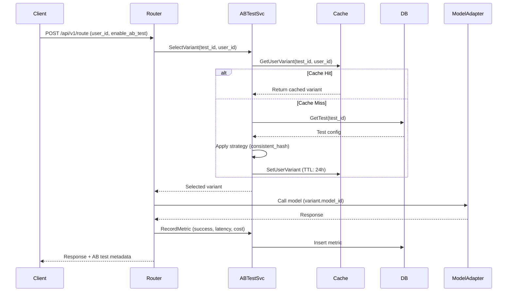

# Model Router Service

模型路由服务 - 智能模型选择与A/B测试

## 功能特性

### 1. 智能路由
- **多策略路由**: 支持成本最优、延迟最低、可用性最高等多种策略
- **模型注册表**: 统一管理多个LLM提供商的模型
- **健康检查**: 自动检测模型健康状态
- **熔断器**: 保护系统免受故障模型影响

### 2. A/B测试 ✨ 新功能
- **变体管理**: 创建和管理多个模型变体
- **分流策略**:
  - 一致性哈希 (consistent_hash): 同一用户始终分配到相同变体
  - 加权随机 (weighted_random): 按权重随机分配
- **指标收集**: 实时收集延迟、成本、成功率等指标
- **结果分析**: 聚合分析各变体的表现
- **缓存优化**: Redis缓存用户变体分配，确保一致性

### 3. 成本优化
- **预算管理**: 设置日/月预算限制
- **成本预测**: 预估请求成本
- **用量统计**: 实时统计各模型用量和成本

### 4. 可观测性
- **Prometheus指标**: 请求量、延迟、错误率等
- **OpenTelemetry追踪**: 全链路追踪
- **结构化日志**: JSON格式日志输出

## 快速开始

### 前置条件
- Go 1.21+
- PostgreSQL 14+
- Redis 6+

### 安装依赖
```bash
cd cmd/model-router
go mod tidy
```

### 数据库迁移
```bash
# 应用迁移
psql -h localhost -U postgres -d voiceassistant -f ../../migrations/postgres/010_create_model_router_abtests.up.sql

# 回滚迁移（如需要）
psql -h localhost -U postgres -d voiceassistant -f ../../migrations/postgres/010_create_model_router_abtests.down.sql
```

### 配置
编辑 `configs/model-router.yaml`:
```yaml
abtest:
  enabled: true
  cache_ttl: 1h
  user_variant_cache_ttl: 24h
  default_strategy: consistent_hash
```

### 运行服务
```bash
go run main.go -conf ../../configs/model-router.yaml
```

## API 文档

### 路由接口

#### POST /api/v1/route
智能路由请求到最佳模型

**请求体**:
```json
{
  "prompt": "用户的问题",
  "max_tokens": 1000,
  "strategy": "cheapest",
  "user_id": "user123",
  "enable_ab_test": true
}
```

**响应**:
```json
{
  "model_id": "gpt-4-turbo-preview",
  "model_name": "GPT-4 Turbo",
  "provider": "openai",
  "estimated_cost": 0.015,
  "estimated_latency": "500ms",
  "reason": "A/B Test: test_001, Variant: variant_gpt4",
  "ab_test_id": "test_001",
  "variant_id": "variant_gpt4",
  "is_ab_test": true
}
```

### A/B测试接口

#### POST /api/v1/abtests
创建A/B测试

**请求体**:
```json
{
  "name": "GPT-4 vs Claude-3 Test",
  "description": "比较两个模型的性能",
  "start_time": "2024-01-01T00:00:00Z",
  "end_time": "2024-01-08T00:00:00Z",
  "strategy": "consistent_hash",
  "variants": [
    {
      "id": "variant_gpt4",
      "name": "GPT-4 Turbo",
      "model_id": "gpt-4-turbo-preview",
      "weight": 0.5,
      "description": "OpenAI GPT-4"
    },
    {
      "id": "variant_claude3",
      "name": "Claude-3 Opus",
      "model_id": "claude-3-opus-20240229",
      "weight": 0.5,
      "description": "Anthropic Claude-3"
    }
  ],
  "created_by": "admin"
}
```

#### GET /api/v1/abtests
列出所有A/B测试

**查询参数**:
- `status`: 过滤状态 (draft/running/paused/completed)
- `created_by`: 创建者
- `limit`: 返回数量
- `offset`: 偏移量

#### GET /api/v1/abtests/:id
获取A/B测试详情

#### POST /api/v1/abtests/:id/start
启动A/B测试

#### POST /api/v1/abtests/:id/pause
暂停A/B测试

#### POST /api/v1/abtests/:id/complete
完成A/B测试

#### GET /api/v1/abtests/:id/results
获取A/B测试结果

**响应**:
```json
{
  "test_id": "test_001",
  "results": {
    "variant_gpt4": {
      "variant_id": "variant_gpt4",
      "request_count": 1000,
      "success_count": 995,
      "failure_count": 5,
      "avg_latency_ms": 450.5,
      "total_tokens": 50000,
      "total_cost": 15.75
    },
    "variant_claude3": {
      "variant_id": "variant_claude3",
      "request_count": 1000,
      "success_count": 998,
      "failure_count": 2,
      "avg_latency_ms": 380.2,
      "total_tokens": 48000,
      "total_cost": 18.20
    }
  }
}
```

#### POST /api/v1/abtests/:id/metrics
记录A/B测试指标

**请求体**:
```json
{
  "variant_id": "variant_gpt4",
  "user_id": "user123",
  "success": true,
  "latency_ms": 452.3,
  "tokens": 500,
  "cost": 0.015
}
```

#### DELETE /api/v1/abtests/:id
删除A/B测试

## 架构设计

### 领域驱动设计 (DDD)
```
cmd/model-router/
├── internal/
│   ├── domain/          # 领域层
│   │   ├── ab_testing.go         # A/B测试领域模型
│   │   ├── model.go              # 模型领域模型
│   │   └── repository.go         # 仓储接口
│   ├── application/     # 应用层
│   │   ├── ab_testing_service_v2.go  # A/B测试服务
│   │   ├── routing_service.go        # 路由服务
│   │   └── cost_optimizer.go         # 成本优化
│   ├── data/            # 数据层
│   │   ├── ab_test_repo.go       # A/B测试仓储实现
│   │   └── db.go                 # 数据库连接
│   ├── infrastructure/  # 基础设施层
│   │   └── ab_test_cache.go      # Redis缓存实现
│   ├── service/         # 服务层
│   │   └── model_router_service.go
│   └── server/          # 服务器层
│       ├── http.go               # HTTP服务器
│       └── abtest_handler.go     # A/B测试HTTP处理器
└── wire.go              # 依赖注入
```

### A/B测试流程


## 开发指南

### 生成Wire代码
```bash
cd cmd/model-router
wire
```

### 运行测试
```bash
go test ./...
```

### 构建
```bash
make build
```

### Docker构建
```bash
docker build -t model-router:latest .
```

## 最佳实践

### 1. A/B测试设计
- **样本量**: 确保每个变体至少1000次请求
- **测试时长**: 至少运行7天以覆盖周期性变化
- **变体数量**: 建议2-3个变体，避免过度分流
- **权重分配**: 初期可以采用保守分配 (90%/10%)

### 2. 分流策略选择
- **consistent_hash**: 适用于需要用户体验一致性的场景
- **weighted_random**: 适用于快速实验和探索

### 3. 监控指标
- **成功率**: success_count / request_count
- **平均延迟**: avg_latency_ms
- **成本效率**: total_cost / total_tokens
- **统计显著性**: 使用t检验或卡方检验验证结果

### 4. 缓存策略
- 测试配置缓存TTL: 1小时 (频繁访问)
- 用户变体缓存TTL: 24小时 (确保一致性)
- 测试结束后立即清除缓存

## 故障排查

### 常见问题

#### 1. 用户未被分配到变体
**症状**: `no active ab test found`

**解决**:
```bash
# 检查测试状态
curl http://localhost:9004/api/v1/abtests | jq '.tests[] | select(.status=="running")'

# 启动测试
curl -X POST http://localhost:9004/api/v1/abtests/{test_id}/start
```

#### 2. Redis连接失败
**症状**: `failed to connect to redis`

**解决**:
```bash
# 检查Redis状态
redis-cli ping

# 检查配置
cat configs/model-router.yaml | grep -A 10 redis
```

#### 3. 数据库迁移失败
**症状**: `relation "model_router.ab_tests" does not exist`

**解决**:
```bash
# 重新应用迁移
psql -h localhost -U postgres -d voiceassistant -f migrations/postgres/010_create_model_router_abtests.up.sql
```

## 性能优化

### 缓存优化
- 使用Redis pipeline批量操作
- 合理设置TTL避免缓存雪崩
- 考虑使用布隆过滤器防止缓存穿透

### 数据库优化
- 为高频查询字段添加索引
- 使用物化视图加速聚合查询
- 定期归档历史指标数据

### 并发优化
- 使用Go routine池控制并发数
- 实现请求限流和降级策略
- 使用熔断器保护下游服务

## 贡献指南

欢迎提交PR！请确保:
1. 代码通过 `golangci-lint` 检查
2. 添加单元测试（覆盖率 > 70%）
3. 更新相关文档
4. 遵循 Conventional Commits 规范

## 许可证

MIT License
