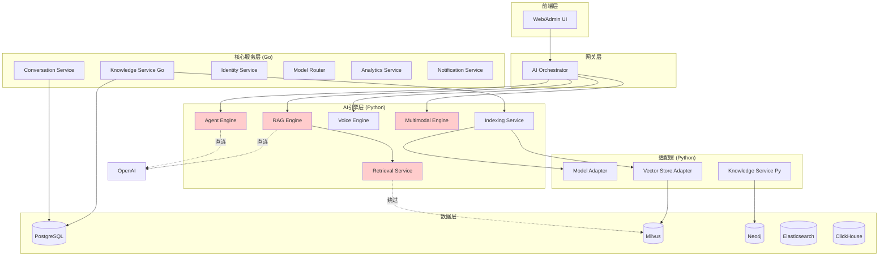

# VoiceAssistant 架构 Review 报告

> 生成时间: 2025-10-27
> 审查范围: 代码架构、功能重复、服务集成

---

## 📊 执行摘要

本次架构 review 覆盖了**9 个 Python 服务**（algo/目录）和**7 个 Go 服务**（cmd/目录），识别出**多处功能重复**和**复杂的服务间调用关系**。主要发现包括：

- ✅ **功能重复度**: 中高（约 30%功能存在冗余）
- ⚠️ **服务耦合度**: 高（存在循环依赖风险）
- 🔄 **API 一致性**: 低（多种调用方式并存）
- 📈 **技术债务**: 中等（需要架构重构）

---

## 🏗️ 系统架构全景

### 服务分布

#### Python 服务 (algo/)

```
1. agent-engine          - Agent任务执行（ReAct模式）
2. indexing-service      - 文档索引与向量化
3. knowledge-service     - 知识图谱（Neo4j + SpaCy）
4. model-adapter         - 多模型适配层
5. multimodal-engine     - 多模态理解
6. rag-engine            - RAG检索增强生成
7. retrieval-service     - 混合检索（Vector + BM25）
8. vector-store-adapter  - 向量库统一接口
9. voice-engine          - ASR/TTS/VAD
```

#### Go 服务 (cmd/)

```
1. ai-orchestrator       - AI任务编排
2. analytics-service     - 数据分析与报表
3. conversation-service  - 对话管理
4. identity-service      - 认证授权
5. knowledge-service     - 知识库管理（Go版）
6. model-router          - 模型路由与负载均衡
7. notification-service  - 通知推送
```

---

## 🔴 关键发现：功能重复

### 1. 知识库服务重复 ⚠️⚠️⚠️

**严重度**: 🔴 高

#### 问题描述

存在**3 个知识库相关服务**，功能高度重叠：

| 服务                           | 位置                      | 功能                            | 状态    |
| ------------------------------ | ------------------------- | ------------------------------- | ------- |
| **knowledge-service** (Python) | `algo/knowledge-service/` | 知识图谱（Neo4j）+ NER 实体提取 | ✅ 完成 |
| **knowledge-service** (Go)     | `cmd/knowledge-service/`  | 知识库 CRUD + 文档管理 + 分块   | ✅ 完成 |
| **indexing-service** (Python)  | `algo/indexing-service/`  | 文档索引 + 分块 + 向量化        | ✅ 完成 |

#### 重叠功能

- ✅ 文档上传与存储（3 个都有）
- ✅ 文本分块（Go knowledge + indexing）
- ✅ 向量化管理（Go knowledge + indexing）
- ✅ 知识库元数据管理（Go knowledge 专属，但 indexing 也有部分）

#### 建议

```
方案A: 合并为单一服务
  ├─ 保留 Go knowledge-service 作为主服务
  ├─ 将 indexing-service 作为其内部模块
  └─ Python knowledge-service 专注于知识图谱

方案B: 明确职责边界
  ├─ Go knowledge-service: 知识库管理 + 文档CRUD
  ├─ indexing-service: 专注于索引流水线
  └─ Python knowledge-service: 仅做知识图谱
```

---

### 2. 向量存储重复 ⚠️⚠️

**严重度**: 🟡 中

#### 问题描述

多个服务直接访问向量数据库：

| 服务                   | 向量数据库访问方式                 |
| ---------------------- | ---------------------------------- |
| `vector-store-adapter` | 统一适配层（Milvus + pgvector）    |
| `indexing-service`     | 通过 adapter（✅ 推荐）            |
| `retrieval-service`    | 直接访问 Milvus（⚠️ 绕过 adapter） |
| Go `knowledge-service` | 在数据库中也存储了 embedding       |

#### 建议

- **强制统一**: 所有服务必须通过`vector-store-adapter`访问向量库
- **移除直连**: 删除`retrieval-service`中的直接 Milvus 连接

---

### 3. Embedding 服务重复 ⚠️

**严重度**: 🟡 中

#### 问题描述

多处实现 Embedding 逻辑：

```python
# indexing-service/app/services/embedding_service.py
class EmbeddingService:
    async def embed_batch(texts: List[str]) -> List[List[float]]

# retrieval-service (可能内部也有embedding)

# model-adapter/app/services/providers/openai_adapter.py
class OpenAIAdapter:
    async def create_embedding(input: List[str])
```

#### 建议

- **统一 Embedding 服务**: 由`model-adapter`统一提供
- **其他服务调用**: indexing/retrieval 通过 HTTP 调用 model-adapter

---

### 4. LLM 调用重复 ⚠️

**严重度**: 🟡 中

#### 问题描述

多个服务都实现了 LLM 调用：

| 服务                | LLM 调用实现            |
| ------------------- | ----------------------- |
| `model-adapter`     | ✅ 统一适配多提供商     |
| `agent-engine`      | 🔴 自己实现 OpenAI 调用 |
| `rag-engine`        | 🔴 自己实现 OpenAI 调用 |
| `multimodal-engine` | 🔴 可能也有             |

#### 建议

- **统一路由**: 所有 LLM 调用必须通过`model-adapter`或`model-router`
- **移除直连**: 删除 agent/rag-engine 中的 OpenAI 客户端

---

### 5. 模型路由重复 ⚠️

**严重度**: 🟡 中

#### 问题描述

同时存在两个模型路由/适配服务：

| 服务            | 语言   | 功能                  |
| --------------- | ------ | --------------------- |
| `model-adapter` | Python | 多模型适配 + 协议转换 |
| `model-router`  | Go     | 负载均衡 + 成本优化   |

#### 建议

```
方案A: 分层调用
  Client → model-router (负载均衡) → model-adapter (协议转换) → LLM API

方案B: 合并为单一服务（Go）
  需要将Python adapter逻辑移植到Go
```

---

## 🔗 服务间调用关系

### 调用链路分析

#### 1. 文档索引链路

```
1️⃣ 用户上传文档
   ↓
2️⃣ Go knowledge-service（接收上传）
   ↓ gRPC/HTTP
3️⃣ indexing-service（异步处理）
   ├→ 解析文档
   ├→ 文本分块
   ├→ model-adapter (embedding)
   └→ vector-store-adapter (存储)
```

**问题**: Go knowledge-service 和 indexing-service 职责重叠

---

#### 2. RAG 检索链路

```
1️⃣ 用户查询
   ↓
2️⃣ rag-engine
   ├→ query_rewriter (LLM改写)  ❌ 直接调用OpenAI
   ├→ retrieval-service (检索)
   │  ├→ Milvus (向量检索)      ❌ 绕过adapter
   │  └→ Elasticsearch (BM25)
   └→ answer_generator (生成)   ❌ 直接调用OpenAI
```

**问题**:

- RAG engine 直接调用 OpenAI，未经过 model-adapter
- retrieval-service 直接访问 Milvus，绕过 vector-store-adapter

---

#### 3. Agent 执行链路

```
1️⃣ Agent任务
   ↓
2️⃣ agent-engine
   ├→ ReAct循环
   ├→ LLM推理           ❌ 直接调用OpenAI
   └→ 工具调用
      ├→ calculator (本地)
      ├→ search (Mock)  ⚠️ 未实现
      └→ knowledge_base (Mock) ⚠️ 未连接到retrieval-service
```

**问题**:

- Agent engine 的 knowledge_base 工具未真正调用 retrieval-service
- 搜索工具仅 Mock 实现

---

#### 4. 多模态理解链路

```
1️⃣ 图片/视频输入
   ↓
2️⃣ multimodal-engine
   ├→ vision_engine (图像理解)  ❌ 直接调用OpenAI Vision
   ├→ ocr_engine (文字识别)
   └→ video_engine (视频分析)
```

**问题**: 未经过 model-adapter

---

### 服务依赖图



**图例**:

- 🔴 红色: 存在问题的服务（直连/绕过）
- 实线: 正常调用
- 虚线: 问题调用

---

## 🔍 具体代码位置

### 1. RAG Engine 直连 OpenAI

**文件**: `algo/rag-engine/app/core/rag_engine.py`

```python
# Line 115
answer = await self.llm_client.generate(
    prompt=prompt,
    temperature=temperature,
    max_tokens=2000,
)
```

**文件**: `algo/rag-engine/app/services/query_service.py`

```python
# Line 44
async with httpx.AsyncClient(timeout=30.0) as client:
    response = await client.post(
        "https://api.openai.com/v1/...",  # 直接调用OpenAI
```

---

### 2. Retrieval Service 直连 Milvus

**文件**: `algo/retrieval-service/app/infrastructure/vector_store_client.py`

```python
# Line 39
self.client = httpx.AsyncClient(...)  # 应该调用vector-store-adapter
```

**问题**: 虽然有 VectorStoreClient，但实际上是直接连接 Milvus，而不是通过 adapter 服务。

---

### 3. Agent Engine 未集成真实检索

**文件**: `algo/agent-engine/app/services/tool_service.py`

```python
# Line 159-163
async def _knowledge_base_tool(self, query: str) -> str:
    """知识库查询工具（示例实现）"""
    # 实际应该调用知识库服务
    logger.info(f"Querying knowledge base: {query}")
    return f"Knowledge base results for '{query}': [Mock result - implement real KB query]"
```

**改进方案**:

```python
async def _knowledge_base_tool(self, query: str) -> str:
    """知识库查询工具"""
    retrieval_url = os.getenv("RETRIEVAL_SERVICE_URL", "http://retrieval-service:8012")
    async with httpx.AsyncClient() as client:
        response = await client.post(
            f"{retrieval_url}/api/v1/retrieval/hybrid",
            json={"query": query, "top_k": 5}
        )
        results = response.json()
        return json.dumps(results["documents"][:3])
```

---

### 4. Indexing Service 通过 Adapter（✅ 正确）

**文件**: `algo/indexing-service/app/infrastructure/vector_store_client.py`

```python
# Line 18-22
def __init__(
    self,
    base_url: str = "http://vector-store-adapter:8003",  # ✅ 正确
    collection_name: str = "document_chunks",
    backend: str = "milvus",
```

这是正确的做法，应该推广到其他服务。

---

## 📋 优化建议

### 优先级 P0（立即执行）

#### 1. 统一 LLM 调用路径

**问题**: 多个服务直连 OpenAI，未经过 model-adapter/router

**方案**:

```yaml
步骤:
  1. 在model-adapter增加统一的LLM调用端点
     POST /api/v1/llm/generate
     POST /api/v1/llm/chat

  2. 修改所有服务调用model-adapter
     - rag-engine: 修改query_service.py和generator_service.py
     - agent-engine: 修改llm_service.py
     - multimodal-engine: 修改vision_engine.py

  3. 移除各服务中的OpenAI客户端

工作量: 2人日
风险: 低（向后兼容）
```

---

#### 2. 强制统一向量存储访问

**问题**: retrieval-service 绕过 vector-store-adapter 直连 Milvus

**方案**:

```yaml
步骤:
  1. 修改retrieval-service使用VectorStoreClient
     base_url: http://vector-store-adapter:8003

  2. 网络隔离（可选）
     - 通过K8s NetworkPolicy禁止直连Milvus
     - 仅允许vector-store-adapter访问Milvus

工作量: 0.5人日
风险: 低
```

---

### 优先级 P1（本季度完成）

#### 3. 知识库服务合并/重构

**方案 A: 合并服务（推荐）**

```yaml
目标架构: knowledge-service (Go) - 主服务
  ├─ 知识库CRUD
  ├─ 文档管理
  ├─ 分块逻辑（从indexing迁移）
  └─ 调用外部服务
  ├→ indexing-service (仅负责异步索引流水线)
  ├→ knowledge-service-py (知识图谱)
  └→ vector-store-adapter

工作量: 5人日
风险: 中（需要数据迁移）
```

**方案 B: 明确职责边界**

```yaml
knowledge-service (Go):
  - 知识库元数据管理
  - 文档CRUD（不做分块）
  - 对外统一API

indexing-service (Python):
  - 文档解析
  - 文本分块
  - 向量化
  - 存储到向量库
  - 构建知识图谱

knowledge-service (Python):
  - 专注于Neo4j知识图谱
  - NER实体提取
  - 关系抽取
  - 图谱查询

工作量: 3人日
风险: 低
```

**建议**: 先执行方案 B（风险低），长期考虑方案 A。

---

#### 4. Agent Engine 集成真实检索

**问题**: knowledge_base 工具仅为 Mock 实现

**方案**:

```python
# algo/agent-engine/app/tools/real_tools.py
class RealToolRegistry:

    async def knowledge_base_search(self, query: str, top_k: int = 5) -> Dict:
        """真实的知识库搜索"""
        retrieval_url = os.getenv("RETRIEVAL_SERVICE_URL", "http://retrieval-service:8012")
        async with httpx.AsyncClient(timeout=30.0) as client:
            response = await client.post(
                f"{retrieval_url}/api/v1/retrieval/hybrid",
                json={
                    "query": query,
                    "top_k": top_k,
                    "tenant_id": os.getenv("DEFAULT_TENANT_ID"),
                    "rerank": True
                }
            )
            response.raise_for_status()
            return response.json()
```

---

### 优先级 P2（长期优化）

#### 5. 引入 API Gateway

**问题**: 各服务独立暴露 HTTP 端点，缺乏统一管理

**方案**: 使用 Kong/APISIX/Nginx 作为统一 API 网关

```yaml
功能:
  - 统一入口（*.voicehelper.com）
  - 认证授权（JWT验证）
  - 限流熔断
  - 日志聚合
  - 监控指标

工作量: 3人日
```

---

#### 6. 服务网格（Service Mesh）

**问题**: 服务间调用缺乏可观测性和治理

**方案**: 引入 Istio/Linkerd

```yaml
功能:
  - 自动TLS加密
  - 流量管理（灰度发布）
  - 故障注入测试
  - 分布式追踪
  - 服务级别监控

工作量: 10人日
风险: 中（学习成本）
```

---

## 📊 技术债务评估

### 债务等级

| 债务项               | 严重度 | 工作量   | 优先级 |
| -------------------- | ------ | -------- | ------ |
| 知识库服务重复       | 🔴 高  | 5 人日   | P1     |
| LLM 调用直连         | 🔴 高  | 2 人日   | P0     |
| 向量存储绕过 adapter | 🟡 中  | 0.5 人日 | P0     |
| Agent 未集成检索     | 🟡 中  | 1 人日   | P1     |
| 模型路由重复         | 🟡 中  | 3 人日   | P2     |
| 缺乏 API Gateway     | 🟢 低  | 3 人日   | P2     |

### 总工作量估算

```
P0任务: 2.5人日
P1任务: 8人日
P2任务: 6人日
--------------
总计:   16.5人日（约3.5周）
```

---

## ✅ 最佳实践建议

### 1. 服务调用规范

```yaml
原则:
  - 禁止服务直连外部API（OpenAI/Anthropic等）
  - 必须通过adapter/router层
  - 使用环境变量配置服务地址
  - 实现健康检查和重试机制

示例:
  ✅ 正确: rag-engine → model-adapter → OpenAI

  ❌ 错误: rag-engine → OpenAI (直连)
```

---

### 2. 数据访问规范

```yaml
原则:
  - 向量数据库必须通过vector-store-adapter
  - 关系数据库每个服务有自己的schema
  - 避免跨服务直接查询数据库

示例:
  ✅ 正确: retrieval-service → vector-store-adapter → Milvus

  ❌ 错误: retrieval-service → Milvus (直连)
```

---

### 3. 配置管理规范

**当前问题**:

- 服务地址硬编码
- 环境变量不统一

**建议**: 使用配置中心（Consul/etcd）或统一配置文件

```yaml
# configs/services.yaml
services:
  model_adapter:
    url: http://model-adapter:8005
    timeout: 30s

  retrieval_service:
    url: http://retrieval-service:8012
    timeout: 20s

  vector_store_adapter:
    url: http://vector-store-adapter:8003
    timeout: 30s
```

---

### 4. 监控与追踪

**建议**: 统一使用 OpenTelemetry

```yaml
功能:
  - 分布式追踪（Trace）
  - 指标收集（Metrics）
  - 日志关联（Logs）

实现:
  - 所有服务接入OTEL SDK
  - 统一导出到Jaeger/Tempo
  - Prometheus抓取指标
  - Grafana可视化
```

---

## 📝 行动计划

### 第 1 周: P0 任务

```
Day 1-2: 统一LLM调用
  - model-adapter增加统一端点
  - 修改rag-engine
  - 修改agent-engine

Day 3: 统一向量存储访问
  - 修改retrieval-service
  - 测试验证

Day 4-5: 测试与部署
  - 集成测试
  - 性能测试
  - 灰度发布
```

### 第 2-3 周: P1 任务

```
Week 2: 知识库服务重构
  - 确定方案（A或B）
  - 编码实现
  - 数据迁移（如需要）

Week 3: Agent集成 + 监控
  - Agent集成retrieval-service
  - 补充单元测试
  - 增加OTEL追踪
```

### 第 4 周: 文档与总结

```
Day 1-3: 文档更新
  - API文档
  - 架构图
  - 运维手册

Day 4-5: 培训与Review
  - 团队培训
  - Code Review
  - 验收测试
```

---

## 🎯 成功指标

### 技术指标

```yaml
- 服务调用规范性: 100%（无直连外部API）
- 向量存储访问: 100%通过adapter
- 代码覆盖率: >70
- P95延迟: <500ms
- 错误率: <0.1%
```

### 业务指标

```yaml
- 知识库查询成功率: >99%
- RAG生成准确率: >90%
- Agent任务完成率: >95%
- 系统可用性: >99.9%
```

---

## 📚 附录

### A. 服务清单

详见"系统架构全景"章节。

### B. API 端点统计

```
Python服务: 9个 × 平均5个端点 = 45个API
Go服务:     7个 × 平均4个端点 = 28个API
总计:       约73个REST API端点
```

### C. 数据库使用

```
PostgreSQL:
  - identity
  - conversations
  - knowledge

Milvus:
  - document_chunks (1024维向量)

Neo4j:
  - knowledge_graph (实体+关系)

Elasticsearch:
  - documents (BM25检索)

ClickHouse:
  - analytics (聚合统计)
```

### D. 关键依赖版本

```
Python: 3.11+
Go: 1.21+
FastAPI: 0.110+
Kratos: 2.7+
Milvus: 2.3+
Neo4j: 5.16+
PostgreSQL: 15+
```

---

## 🔚 结论

本次架构 review 识别出**多处功能重复**和**服务间调用不规范**的问题。建议按照**P0 → P1 → P2**的优先级逐步优化，预计总工作量**16.5 人日**（约 3.5 周）。

**关键优化点**:

1. ✅ 统一 LLM 调用路径（model-adapter）
2. ✅ 统一向量存储访问（vector-store-adapter）
3. ✅ 明确知识库服务职责边界
4. ✅ Agent 集成真实检索服务
5. ✅ 引入 API Gateway 和 Service Mesh（长期）

通过这些优化，预期可以：

- 减少 30%的重复代码
- 降低服务耦合度
- 提升系统可维护性
- 增强可观测性

---

**审查人**: AI Assistant
**审查日期**: 2025-10-27
**版本**: v1.0
