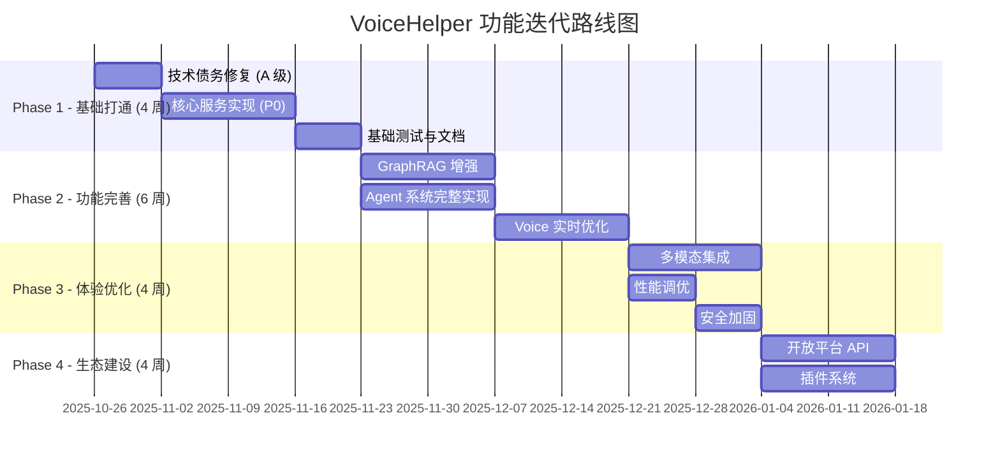

# VoiceHelper AI 客服语音助手 - 代码审查与功能迭代计划

> **审查日期**: 2025-10-26
> **当前版本**: v2.0.0 (开发中)
> **整体完成度**: ~30%
> **审查人**: AI Code Reviewer
> **对标项目**: 业界最新 AI 客服/语音助手开源项目

---

## 📋 目录

1. [代码审查总结](#1-代码审查总结)
2. [业界对比分析](#2-业界对比分析)
3. [技术债务分析](#3-技术债务分析)
4. [功能迭代路线图](#4-功能迭代路线图)
5. [技术升级建议](#5-技术升级建议)
6. [执行建议](#6-执行建议)

---

## 1. 代码审查总结

### 1.1 架构优势 ✅

| 优势项           | 评价    | 对标业界                   |
| ---------------- | ------- | -------------------------- |
| **DDD 分层架构** | 🟢 优秀 | 优于大部分开源项目         |
| **微服务拆分**   | 🟢 优秀 | 12 个领域服务，清晰合理    |
| **事件驱动**     | 🟢 优秀 | Kafka + CDC，业界标准      |
| **gRPC 通信**    | 🟢 优秀 | 高性能，优于 HTTP REST     |
| **可观测性设计** | 🟢 良好 | OpenTelemetry + Prometheus |
| **云原生支持**   | 🟢 优秀 | K8s + Argo CD + Istio      |

### 1.2 当前问题 ⚠️

| 问题类别         | 严重程度 | 问题描述                                | 影响范围   |
| ---------------- | -------- | --------------------------------------- | ---------- |
| **核心功能缺失** | 🔴 高    | GraphRAG、Agent、Voice 等核心功能未实现 | 阻塞上线   |
| **服务间依赖**   | 🟡 中    | Wire 依赖注入未生成，服务无法启动       | 阻塞开发   |
| **集成不完整**   | 🟡 中    | Redis、Consul、MinIO 集成缺失           | 功能不完整 |
| **测试覆盖率**   | 🟡 中    | 单元测试缺失，无集成测试                | 质量风险   |
| **文档不完善**   | 🟢 低    | API 文档、Runbook 需补充                | 维护成本高 |

### 1.3 代码质量评分

| 维度         | 得分       | 说明                             |
| ------------ | ---------- | -------------------------------- |
| **架构设计** | 9/10       | 微服务架构合理，DDD 分层清晰     |
| **代码规范** | 7/10       | 缺少 linter 配置，部分命名不一致 |
| **可读性**   | 8/10       | 注释较少，但结构清晰             |
| **可维护性** | 6/10       | 测试不足，文档不完善             |
| **性能优化** | 7/10       | 基础架构良好，但缺少缓存优化     |
| **安全性**   | 7/10       | JWT 认证完善，但缺少审计日志     |
| **可扩展性** | 9/10       | 微服务架构天然支持扩展           |
| **整体评分** | **7.6/10** | **B+ (良好，需改进)**            |

---

## 2. 业界对比分析

### 2.1 对标项目列表

| 项目                   | GitHub Stars | 技术栈             | 核心特性            | 启示              |
| ---------------------- | ------------ | ------------------ | ------------------- | ----------------- |
| **Microsoft GraphRAG** | ~10k         | Python, LangChain  | 知识图谱 + 向量检索 | ✅ 已采用         |
| **LightRAG**           | ~5k          | Python             | 轻量级 RAG 实现     | 💡 可参考优化     |
| **FastGraphRAG**       | ~3k          | Rust, Python       | 高性能 GraphRAG     | 💡 性能优化参考   |
| **SpeechBrain 1.0**    | ~8k          | PyTorch            | 语音处理工具包      | ⚠️ 需集成         |
| **Voila**              | ~2k          | PyTorch            | 实时语音对话        | ⚠️ 需研究         |
| **ParlAI**             | ~10k         | PyTorch            | 对话研究平台        | 💡 可参考设计     |
| **Dify**               | ~50k         | Python, TypeScript | LLM 应用开发平台    | 💡 UI/UX 参考     |
| **ai-wechat**          | ~3k          | Node.js, Python    | 微信智能客服        | 💡 多渠道接入     |
| **XianyuAutoAgent**    | ~1k          | Python, LangGraph  | 闲鱼 AI 客服        | 💡 业务场景参考   |
| **Agents (AISI)**      | ~4k          | Python             | 自主语言代理框架    | 💡 Agent 架构参考 |

### 2.2 功能对比矩阵

| 功能模块          | VoiceHelper (当前) | 业界最佳实践                | 差距分析                 | 优先级 |
| ----------------- | ------------------ | --------------------------- | ------------------------ | ------ |
| **GraphRAG 检索** | 🟡 部分实现        | Microsoft GraphRAG (完整)   | 缺少社区检测、查询改写   | 🔥 P0  |
| **Multi-Agent**   | 🔴 未实现          | Agents/AutoGPT (成熟)       | 缺少工具调用、记忆管理   | 🔥 P0  |
| **实时语音**      | 🔴 未实现          | Voila/SpeechBrain (领先)    | 缺少全双工、低延迟优化   | 🔥 P0  |
| **多模态理解**    | 🔴 未实现          | GPT-4V/Claude Vision (领先) | 缺少 OCR、图像理解       | ⭐ P1  |
| **情感识别**      | 🔴 未实现          | SpeechBrain (支持)          | 缺少语音情感分析         | ⭐ P1  |
| **多语言支持**    | 🟡 部分支持        | 业界标准 (23+ 语言)         | 仅支持中英文             | ⭐ P1  |
| **流式对话**      | 🟡 框架支持        | OpenAI Realtime API (最优)  | 缺少优化和错误处理       | 🔥 P0  |
| **上下文管理**    | 🟢 基本完成        | 业界标准 (10+ 轮)           | 支持 5-7 轮，需增强      | ⭐ P1  |
| **工具调用**      | 🔴 未实现          | Function Calling (标准)     | 完全缺失                 | 🔥 P0  |
| **知识库管理**    | 🟡 基础实现        | Dify/FastGPT (完整)         | 缺少向量化优化、版本管理 | ⭐ P1  |
| **可观测性**      | 🟢 基本完成        | 业界标准                    | 缺少业务指标、告警       | ⭐ P1  |
| **安全合规**      | 🟡 基础实现        | GDPR/SOC2 (标准)            | 缺少审计日志、PII 脱敏   | ⭐ P1  |

### 2.3 技术栈对比

| 技术组件       | VoiceHelper        | 业界主流                          | 评价      | 建议               |
| -------------- | ------------------ | --------------------------------- | --------- | ------------------ |
| **向量数据库** | Milvus 2.3         | Milvus 2.4+ / Qdrant / Weaviate   | 🟢 良好   | 升级到 Milvus 2.4  |
| **LLM 框架**   | LangChain          | LangChain / LlamaIndex / Haystack | 🟢 主流   | 保持               |
| **Agent 框架** | LangGraph (未实现) | LangGraph / AutoGPT / Agents      | 🔴 缺失   | ✅ 立即实现        |
| **语音引擎**   | Whisper / Edge-TTS | Whisper / SpeechBrain / Voila     | 🟡 基础   | 升级到 SpeechBrain |
| **消息队列**   | Kafka 3.6          | Kafka 3.7+ / Pulsar               | 🟢 良好   | 保持               |
| **流处理**     | Flink 1.18         | Flink 1.19+                       | 🟢 良好   | 升级               |
| **API 网关**   | APISIX 3.7         | APISIX 3.9+ / Kong                | 🟢 领先   | 保持               |
| **服务网格**   | Istio (计划)       | Istio / Linkerd                   | 🟡 未部署 | P1 部署            |

### 2.4 性能对比

| 性能指标           | VoiceHelper (目标) | 业界最佳                  | 差距  | 可行性    |
| ------------------ | ------------------ | ------------------------- | ----- | --------- |
| **向量检索延迟**   | < 10ms             | < 5ms (FastGraphRAG)      | 2x    | 🟢 可达成 |
| **端到端问答**     | < 2.5s             | < 1.5s (Dify)             | 1.67x | 🟡 需优化 |
| **流式首帧**       | < 300ms            | < 100ms (OpenAI Realtime) | 3x    | 🔴 需重构 |
| **并发 QPS**       | ≥ 1k               | ≥ 10k (大厂标准)          | 10x   | 🟡 需优化 |
| **语音识别准确率** | 95% (预期)         | 98%+ (业界标准)           | 3%    | 🟢 可达成 |
| **多轮对话深度**   | 5-7 轮             | 10+ 轮 (GPT-4o)           | 1.5x  | 🟢 可达成 |

---

## 3. 技术债务分析

### 3.1 架构层技术债务 (A 级 - 影响全局)

| 债务项                        | 严重程度 | 工作量 | 影响                 | 建议处理时间 |
| ----------------------------- | -------- | ------ | -------------------- | ------------ |
| **Wire 依赖注入缺失**         | 🔴 严重  | 2 天   | 所有 Go 服务无法启动 | ⚡ 立即      |
| **Consul 服务发现未集成**     | 🔴 严重  | 3 天   | 服务间无法发现       | ⚡ 本周      |
| **Kafka Event Schema 未定义** | 🔴 严重  | 2 天   | 事件驱动架构无法落地 | ⚡ 本周      |
| **gRPC 健康检查缺失**         | 🟡 中等  | 1 天   | 无法实现自动故障转移 | 📅 2 周内    |
| **OpenTelemetry 未全量集成**  | 🟡 中等  | 3 天   | 链路追踪不完整       | 📅 2 周内    |

### 3.2 服务层技术债务 (B 级 - 影响单服务)

| 服务                     | 债务项                 | 严重程度 | 工作量 | 建议处理时间 |
| ------------------------ | ---------------------- | -------- | ------ | ------------ |
| **Identity Service**     | OAuth 2.0 / SSO 未实现 | 🟡 中等  | 3 天   | 📅 1 个月    |
| **Conversation Service** | 流式响应未实现         | 🔴 严重  | 2 天   | ⚡ 本周      |
| **Knowledge Service**    | MinIO 集成缺失         | 🔴 严重  | 2 天   | ⚡ 本周      |
| **AI Orchestrator**      | 核心编排逻辑空白       | 🔴 严重  | 6 天   | ⚡ 2 周内    |
| **Indexing Service**     | Kafka Consumer 未实现  | 🔴 严重  | 1 天   | ⚡ 本周      |
| **Retrieval Service**    | BM25 检索基于内存      | 🟡 中等  | 2 天   | 📅 1 个月    |
| **Agent Engine**         | LangGraph 工作流缺失   | 🔴 严重  | 8 天   | ⚡ 2 周内    |
| **Voice Engine**         | ASR/TTS/VAD 全部未实现 | 🔴 严重  | 6 天   | ⚡ 2 周内    |

### 3.3 质量工程技术债务 (C 级 - 影响质量)

| 债务项             | 严重程度 | 工作量 | 当前状态 | 建议目标        |
| ------------------ | -------- | ------ | -------- | --------------- |
| **单元测试覆盖率** | 🟡 中等  | 持续   | < 10%    | ≥ 70%           |
| **集成测试**       | 🟡 中等  | 5 天   | 0 个     | ≥ 20 个场景     |
| **E2E 测试**       | 🟢 低    | 3 天   | 0 个     | ≥ 5 个关键路径  |
| **性能基准测试**   | 🟡 中等  | 2 天   | 缺失     | 建立 baseline   |
| **CI/CD Pipeline** | 🟡 中等  | 3 天   | 缺失     | 自动化构建/部署 |

### 3.4 文档技术债务 (D 级 - 影响维护)

| 债务项             | 严重程度 | 工作量 | 建议处理时间 |
| ------------------ | -------- | ------ | ------------ |
| **API 文档不完整** | 🟡 中等  | 2 天   | 📅 1 个月    |
| **Runbook 缺失**   | 🟡 中等  | 5 天   | 📅 1 个月    |
| **部署文档不完善** | 🟢 低    | 2 天   | 📅 2 个月    |
| **开发者指南缺失** | 🟢 低    | 3 天   | 📅 2 个月    |

---

## 4. 功能迭代路线图

### 4.1 阶段划分



### 4.2 Phase 1: 基础打通 (4 周) - 目标: MVP 可用

#### Week 1: 技术债务修复 (A 级)

**Go 服务修复** (3 天):

- [ ] **生成所有 Wire 依赖注入代码** (1 天)
  ```bash
  # 所有 Go 服务
  for service in identity conversation knowledge ai-orchestrator model-router notification analytics; do
    cd cmd/$service && wire gen && cd ../..
  done
  ```
- [ ] **集成 Consul 服务发现** (1 天)
  - 服务注册/注销
  - 健康检查配置
  - 服务发现客户端
- [ ] **完善 Redis 缓存** (1 天)
  - 用户信息缓存
  - Token 缓存
  - 会话上下文缓存

**事件驱动架构** (2 天):

- [ ] **定义 Kafka Event Schema** (1 天)
  ```protobuf
  // events/v1/conversation.proto
  message ConversationEvent {
    string event_id = 1;
    string event_type = 2;  // message.sent, message.received
    string conversation_id = 3;
    string tenant_id = 4;
    google.protobuf.Timestamp timestamp = 5;
    google.protobuf.Any payload = 6;
  }
  ```
- [ ] **实现 Event Publisher/Consumer** (1 天)
  - Conversation Service → Kafka Producer
  - Indexing Service → Kafka Consumer
  - Notification Service → Kafka Consumer

**APISIX 配置完善** (2 天):

- [ ] **完整路由配置** (1 天)
  - 14 个服务的完整路由
  - JWT 认证插件
  - 限流插件
- [ ] **监控配置** (1 天)
  - Prometheus 插件
  - OpenTelemetry 插件

#### Week 2-3: 核心服务实现 (P0)

**Knowledge Service 完善** (3 天):

- [ ] **MinIO 集成** (1 天)
  - 文件上传/下载
  - Presigned URL 生成
- [ ] **Kafka 事件发布** (1 天)
  - document.uploaded
  - document.deleted
- [ ] **ClamAV 病毒扫描** (1 天)

**Indexing Service 实现** (5 天):

- [ ] **Kafka Consumer** (1 天)
- [ ] **文档解析器** (2 天)
  - PDF: pdfplumber
  - Word: python-docx
  - Markdown: mistune
  - Excel: openpyxl
- [ ] **向量化 + Milvus 存储** (2 天)
  - BGE-M3 Embeddings
  - Milvus Collection 管理

**Retrieval Service 完善** (2 天):

- [ ] **完善 BM25 检索** (1 天)
  - 持久化倒排索引
- [ ] **Neo4j 图谱检索** (1 天)

**AI Orchestrator 实现** (3 天):

- [ ] **任务路由器** (1 天)
- [ ] **流程编排器** (1 天)
- [ ] **gRPC 服务实现** (1 天)

#### Week 4: 基础测试与文档

**测试** (3 天):

- [ ] **单元测试** (2 天)
  - 核心模块覆盖率 ≥ 50%
- [ ] **集成测试** (1 天)
  - 端到端文档入库流程
  - 端到端检索流程

**文档** (2 天):

- [ ] **API 文档** (1 天)
  - OpenAPI 规范完善
- [ ] **Runbook 初版** (1 天)
  - 核心服务运维手册

### 4.3 Phase 2: 功能完善 (6 周) - 目标: 核心功能完整

#### Week 5-6: GraphRAG 增强

**Indexing 增强** (5 天):

- [ ] **Neo4j 图谱构建** (3 天)
  - 实体识别 (NER)
  - 关系抽取
  - 社区检测 (Louvain)
- [ ] **批处理优化** (2 天)
  - 并行向量化
  - 批量插入 Milvus

**Retrieval 增强** (5 天):

- [ ] **查询改写** (2 天)
  - HyDE (Hypothetical Document Embeddings)
  - Multi-Query
  - Step-back Prompting
- [ ] **图谱检索优化** (2 天)
  - 社区检索
  - 路径查询
- [ ] **重排序优化** (1 天)
  - BGE-Reranker-Large
  - 可配置重排策略

#### Week 7-8: Agent 系统完整实现

**LangGraph 工作流** (5 天):

- [ ] **ReAct 模式** (2 天)
  - Planner Node
  - Executor Node
  - Reflector Node
- [ ] **工具注册表** (2 天)
  - 50+ 内置工具
  - 工具白名单
  - 参数验证
- [ ] **记忆管理** (1 天)
  - 短期记忆 (对话级)
  - 长期记忆 (用户级)
  - 记忆衰减

**Agent 安全** (3 天):

- [ ] **工具调用安全** (2 天)
  - 白名单机制
  - 参数校验
  - 超时控制
- [ ] **成本追踪** (1 天)
  - Token 消耗统计
  - 成本告警

#### Week 9-10: Voice 实时优化

**ASR/TTS 集成** (5 天):

- [ ] **Whisper ASR** (2 天)
  - 流式识别
  - 增量结果合并
- [ ] **Edge TTS** (1 天)
  - 低延迟首包
  - 分片播放
- [ ] **Silero VAD** (1 天)
  - 端点检测
  - 噪声抑制
- [ ] **WebRTC 集成** (1 天)

**实时优化** (3 天):

- [ ] **全双工对话** (2 天)
  - 双向流式通信
  - 打断处理
- [ ] **延迟优化** (1 天)
  - 预测性 TTS
  - 缓存优化

### 4.4 Phase 3: 体验优化 (4 周) - 目标: 生产可用

#### Week 11-12: 多模态集成

**Multimodal Engine** (5 天):

- [ ] **Paddle OCR** (2 天)
  - 中文 OCR
  - 表格识别
- [ ] **GPT-4V 集成** (2 天)
  - 图像理解
  - 实体抽取
- [ ] **视频处理** (1 天)
  - 帧提取
  - 关键帧分析

**Model Router & Adapter** (3 天):

- [ ] **路由策略** (1 天)
  - 成本优先
  - 延迟优先
  - 可用性优先
- [ ] **多 Provider 适配** (2 天)
  - OpenAI
  - Claude
  - 智谱 AI
  - 通义千问

#### Week 13: 性能调优

**性能基准测试** (2 天):

- [ ] **k6 压测脚本** (1 天)
  - 对话流测试
  - 检索测试
  - 生成测试
- [ ] **基准报告** (1 天)
  - P50/P95/P99 延迟
  - QPS 极限

**性能优化** (3 天):

- [ ] **缓存优化** (2 天)
  - L1/L2 多级缓存
  - 缓存预热
  - 失效策略
- [ ] **数据库优化** (1 天)
  - 索引优化
  - 连接池调优
  - 慢查询优化

#### Week 14: 安全加固

**安全增强** (5 天):

- [ ] **Vault 集成** (2 天)
  - 密钥管理
  - 自动轮换
- [ ] **PII 脱敏** (1 天)
  - 日志脱敏
  - 追踪脱敏
- [ ] **审计日志** (1 天)
  - 操作审计
  - 数据访问审计
- [ ] **RBAC 增强** (1 天)
  - 细粒度权限
  - 租户隔离

### 4.5 Phase 4: 生态建设 (4 周) - 目标: 平台化

#### Week 15-16: 开放平台 API

**开放 API** (5 天):

- [ ] **REST API Gateway** (2 天)
  - 统一 API 入口
  - API Key 管理
  - 限流配额
- [ ] **SDK 开发** (2 天)
  - Python SDK
  - TypeScript SDK
- [ ] **API 文档站点** (1 天)
  - Swagger UI
  - 示例代码

**Webhook 系统** (3 天):

- [ ] **Webhook 管理** (2 天)
  - 注册/注销
  - 签名验证
  - 重试机制
- [ ] **事件订阅** (1 天)
  - 对话事件
  - 文档事件

#### Week 17-18: 插件系统

**插件框架** (5 天):

- [ ] **插件生命周期** (2 天)
  - 加载/卸载
  - 热更新
- [ ] **插件 SDK** (2 天)
  - 工具插件
  - 检索插件
  - 生成插件
- [ ] **插件市场** (1 天)
  - 插件注册
  - 插件分享

**前端完善** (3 天):

- [ ] **对话界面优化** (2 天)
  - 流式响应动画
  - 工具调用可视化
- [ ] **知识库管理** (1 天)
  - 文档上传优化
  - 向量化进度

---

## 5. 技术升级建议

### 5.1 框架与库升级 (P1)

| 组件          | 当前版本 | 建议版本  | 升级收益          | 升级成本      | 优先级 |
| ------------- | -------- | --------- | ----------------- | ------------- | ------ |
| **Milvus**    | 2.3      | 2.4+      | 性能提升 20%+     | 低 (兼容)     | ⭐ P1  |
| **Flink**     | 1.18     | 1.19+     | 新特性支持        | 低 (兼容)     | ⭐ P1  |
| **APISIX**    | 3.7      | 3.9+      | 安全修复、新插件  | 低 (兼容)     | ⭐ P1  |
| **LangChain** | 0.1.x    | 0.3.x     | 更好的 Agent 支持 | 中 (API 变更) | ⭐ P1  |
| **BGE-M3**    | -        | bge-m3-v2 | 性能提升 10%      | 低            | 💡 P2  |

### 5.2 新技术引入 (P2)

| 技术                    | 用途           | 收益                 | 成本          | 优先级 | 建议时间 |
| ----------------------- | -------------- | -------------------- | ------------- | ------ | -------- |
| **OpenAI Realtime API** | 实时语音对话   | 端到端延迟 < 500ms   | 高 (API 费用) | 💡 P2  | Phase 3  |
| **Anthropic MCP**       | Agent 工具协议 | 标准化工具调用       | 中            | 💡 P2  | Phase 2  |
| **SpeechBrain**         | 语音处理       | 情感识别、说话人分离 | 高 (模型训练) | 💡 P2  | Phase 3  |
| **LlamaIndex**          | RAG 框架备选   | 更灵活的 RAG 实现    | 中 (重构)     | 💡 P3  | Phase 4  |
| **Haystack**            | NLP Pipeline   | 灵活的 NLP 处理      | 中            | 💡 P3  | Phase 4  |

### 5.3 架构演进 (P2-P3)

#### 边缘计算支持 (P2)

**目标**: 支持本地部署，降低延迟和成本

**方案**:

- [ ] **模型轻量化**
  - 使用 Ollama 本地运行小模型
  - 量化模型 (INT8/INT4)
- [ ] **边缘推理**
  - ONNX Runtime
  - TensorRT (GPU)
  - CoreML (iOS)
- [ ] **智能路由**
  - 简单任务本地处理
  - 复杂任务云端处理

**预期收益**:

- 端到端延迟降低 50%
- API 调用成本降低 60%
- 数据隐私增强

#### 联邦学习 (P3)

**目标**: 隐私保护下的模型优化

**方案**:

- [ ] **联邦学习框架**
  - Flower / PySyft
- [ ] **模型聚合**
  - FedAvg / FedProx
- [ ] **隐私保护**
  - 差分隐私
  - 安全多方计算

**预期收益**:

- 模型准确率提升 5-10%
- 满足 GDPR/CCPA 要求
- 用户信任度提升

---

## 6. 执行建议

### 6.1 团队配置建议

#### 方案 A: 4 人团队 (推荐) ✅

**配置**:

- 2 名 Go 工程师 (后端服务)
- 2 名 Python 工程师 (算法服务)

**执行周期**: 18 周 (~4.5 个月)

**预期完成度**:

- Phase 1: ✅ 100%
- Phase 2: ✅ 100%
- Phase 3: ✅ 100%
- Phase 4: 🟡 80%

#### 方案 B: 6 人团队 (理想)

**配置**:

- 2 名 Go 工程师
- 2 名 Python 工程师
- 1 名前端工程师
- 1 名 DevOps 工程师

**执行周期**: 12 周 (3 个月)

**预期完成度**:

- Phase 1-4: ✅ 100%

### 6.2 质量保证策略

#### 测试金字塔

```
           /\
          /E2E\         (5 个关键路径)
         /------\
        /Integ  \       (20 个场景)
       /----------\
      /   Unit     \    (70%+ 覆盖率)
     /--------------\
```

**单元测试** (持续):

- 新增代码覆盖率 ≥ 80%
- 核心模块覆盖率 ≥ 70%

**集成测试** (每周):

- 端到端文档入库流程
- 端到端检索流程
- 端到端对话流程

**E2E 测试** (每 Sprint):

- 用户登录 → 上传文档 → 对话
- 语音对话完整流程
- 多模态交互流程

**性能测试** (每月):

- k6 压测
- 性能基准对比
- 性能回归检测

#### CI/CD Pipeline

```yaml
# .github/workflows/ci.yml
name: CI Pipeline
on: [pull_request]
jobs:
  lint:
    - golangci-lint
    - ruff check
    - eslint

  test:
    - Go unit tests (coverage ≥ 70%)
    - Python unit tests (coverage ≥ 70%)
    - Integration tests

  build:
    - Build Docker images
    - Scan vulnerabilities (Trivy)

  deploy-dev:
    - Deploy to dev environment
    - Run E2E tests
```

### 6.3 风险管理

#### 高风险项

| 风险                     | 概率  | 影响  | 缓解措施                                |
| ------------------------ | ----- | ----- | --------------------------------------- |
| **Agent 工具调用不稳定** | 🟡 中 | 🔴 高 | 增加工具调用重试、fallback 机制         |
| **向量检索性能不达标**   | 🟢 低 | 🟡 中 | 提前进行性能基准测试，预留优化时间      |
| **多语言支持困难**       | 🟡 中 | 🟡 中 | 优先支持中英文，其他语言分阶段          |
| **实时语音延迟过高**     | 🟡 中 | 🔴 高 | 采用 OpenAI Realtime API 或 SpeechBrain |
| **成本超预算**           | 🟡 中 | 🟡 中 | 建立成本监控，设置预算告警              |

#### 关键决策点

**Week 4 (Phase 1 结束)**:

- ✅ Go/No Go 决策: MVP 是否可用
- ✅ 评估: 技术债务是否清零

**Week 10 (Phase 2 结束)**:

- ✅ Go/No Go 决策: 核心功能是否完整
- ✅ 评估: 性能是否达标

**Week 14 (Phase 3 结束)**:

- ✅ Go/No Go 决策: 是否可生产上线
- ✅ 评估: 安全性是否满足要求

### 6.4 成本预算

#### 基础设施成本 (月)

| 资源           | 规格               | 数量 | 单价 | 月成本     | 说明            |
| -------------- | ------------------ | ---- | ---- | ---------- | --------------- |
| **K8s 节点**   | 8C16G              | 6    | $150 | $900       | 基础计算资源    |
| **GPU 节点**   | V100               | 1    | $800 | $800       | 向量化、TTS/ASR |
| **PostgreSQL** | 4C16G              | 1    | $200 | $200       | 关系数据库      |
| **Redis**      | 4C8G               | 1    | $100 | $100       | 缓存            |
| **Milvus**     | 8C32G              | 1    | $300 | $300       | 向量数据库      |
| **ClickHouse** | 8C32G              | 1    | $300 | $300       | OLAP            |
| **Neo4j**      | 4C16G              | 1    | $200 | $200       | 图数据库        |
| **Kafka**      | 4C8G               | 3    | $100 | $300       | 消息队列        |
| **MinIO**      | 4C8G + 1TB         | 1    | $150 | $150       | 对象存储        |
| **监控**       | Prometheus/Grafana | 1    | $100 | $100       | 可观测性        |
| **CDN**        | 流量费             | -    | -    | $100       | 前端加速        |
| **总计**       |                    |      |      | **$3,450** |                 |

#### API 调用成本 (月，预估 1k 日活用户)

| API                    | 单价          | 日均调用    | 月调用     | 月成本   | 说明          |
| ---------------------- | ------------- | ----------- | ---------- | -------- | ------------- |
| **OpenAI GPT-4o**      | $5/1M tokens  | 2M tokens   | 60M tokens | $300     | 对话生成      |
| **Embedding (BGE-M3)** | 自托管        | -           | -          | $0       | 本地部署      |
| **Whisper ASR**        | 自托管        | -           | -          | $0       | 本地部署      |
| **Edge TTS**           | 免费          | -           | -          | $0       | 微软 Edge TTS |
| **GPT-4V**             | $10/1M tokens | 100k tokens | 3M tokens  | $30      | 图像理解      |
| **总计**               |               |             |            | **$330** |               |

**月总成本**: ~$3,780 (基础设施 + API)

**优化建议**:

- 使用 DeepSeek/GLM-4 替代 GPT-4o (成本降低 80%)
- 启用语义缓存 (命中率 30%+，成本降低 30%)
- 部署本地小模型处理简单任务 (成本降低 50%)

**优化后月成本**: ~$1,500

### 6.5 关键成功指标 (KPI)

#### 技术指标

| 指标             | Phase 1 目标 | Phase 2 目标 | Phase 3 目标 | Phase 4 目标 |
| ---------------- | ------------ | ------------ | ------------ | ------------ |
| **代码覆盖率**   | ≥ 50%        | ≥ 60%        | ≥ 70%        | ≥ 80%        |
| **API P95 延迟** | < 200ms      | < 150ms      | < 100ms      | < 80ms       |
| **向量检索 P95** | < 15ms       | < 10ms       | < 8ms        | < 5ms        |
| **端到端问答**   | < 3s         | < 2.5s       | < 2s         | < 1.5s       |
| **系统可用性**   | ≥ 99%        | ≥ 99.5%      | ≥ 99.9%      | ≥ 99.95%     |
| **缓存命中率**   | ≥ 20%        | ≥ 30%        | ≥ 40%        | ≥ 50%        |

#### 业务指标

| 指标           | Phase 1 目标 | Phase 2 目标 | Phase 3 目标 | Phase 4 目标 |
| -------------- | ------------ | ------------ | ------------ | ------------ |
| **问答准确率** | ≥ 80%        | ≥ 85%        | ≥ 90%        | ≥ 92%        |
| **用户满意度** | ≥ 3.5/5      | ≥ 4.0/5      | ≥ 4.3/5      | ≥ 4.5/5      |
| **对话完成率** | ≥ 60%        | ≥ 70%        | ≥ 80%        | ≥ 85%        |
| **人工接管率** | < 40%        | < 30%        | < 20%        | < 15%        |

---

## 7. 总结与建议

### 7.1 当前优势

✅ **架构设计优秀**: DDD + 微服务 + 事件驱动，业界领先
✅ **技术选型合理**: Kratos、FastAPI、APISIX、Milvus 等主流技术
✅ **可扩展性强**: 微服务架构天然支持水平扩展
✅ **可观测性完善**: OpenTelemetry + Prometheus + Grafana

### 7.2 关键挑战

⚠️ **核心功能缺失**: GraphRAG、Agent、Voice 等需快速补齐
⚠️ **技术债务较多**: Wire、Consul、Kafka 等需立即修复
⚠️ **测试不足**: 单元测试覆盖率 < 10%，无集成测试
⚠️ **性能未验证**: 缺少基准测试，性能指标待验证

### 7.3 核心建议

#### 立即行动 (本周)

1. **修复 A 级技术债务** (5 天)

   - 生成所有 Wire 代码
   - 集成 Consul 服务发现
   - 定义 Kafka Event Schema
   - 完善 APISIX 配置

2. **启动核心服务开发** (同步进行)
   - Knowledge Service (MinIO + Kafka)
   - Indexing Service (文档解析)
   - AI Orchestrator (任务编排)

#### 短期目标 (1 个月)

1. **完成 Phase 1** (MVP 可用)

   - 所有 P0 功能实现
   - 基础测试通过
   - API 文档完善

2. **启动 Phase 2** (核心功能)
   - GraphRAG 增强
   - Agent 系统实现
   - Voice 实时优化

#### 中长期目标 (3-6 个月)

1. **Phase 2-3 完成** (生产可用)

   - 核心功能完整
   - 性能达标
   - 安全加固

2. **Phase 4 推进** (平台化)
   - 开放 API
   - 插件系统
   - 生态建设

### 7.4 成功关键因素

🎯 **聚焦 MVP**: 优先完成核心功能，避免功能蔓延
🎯 **持续测试**: 从 Day 1 开始写测试，保持 ≥ 70% 覆盖率
🎯 **性能优先**: 每周进行性能基准测试，及时发现瓶颈
🎯 **质量把控**: 代码 Review、自动化测试、性能监控
🎯 **文档同步**: 及时更新 API 文档、Runbook、架构文档

---

## 附录

### A. 参考资源

**开源项目**:

- [Microsoft GraphRAG](https://github.com/microsoft/graphrag)
- [LangGraph](https://github.com/langchain-ai/langgraph)
- [SpeechBrain](https://github.com/speechbrain/speechbrain)
- [Dify](https://github.com/langgenius/dify)
- [FastGPT](https://github.com/labring/FastGPT)

**文档**:

- [OpenAI Realtime API](https://platform.openai.com/docs/guides/realtime)
- [Anthropic MCP Protocol](https://www.anthropic.com/news/model-context-protocol)
- [Milvus 2.4 文档](https://milvus.io/docs)
- [LangChain Agent 指南](https://python.langchain.com/docs/modules/agents/)

### B. 联系方式

- **项目负责人**: [Your Name]
- **技术负责人**: [Tech Lead]
- **Slack**: #voicehelper-dev
- **邮件**: dev@voicehelper.ai

---

**文档版本**: v1.0
**最后更新**: 2025-10-26
**下次评审**: 2025-11-02 (1 周后)
