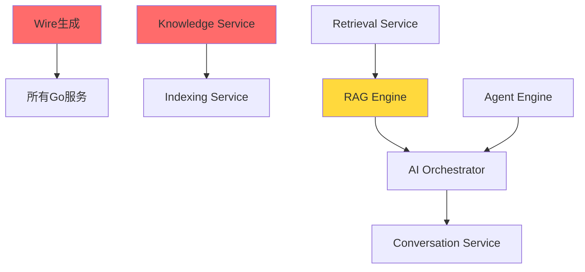

# VoiceHelper 详细周计划 (12 周)

> **计划周期**: Week 1 ~ Week 12
> **团队规模**: 4 人 (2 Go 开发 + 2 Python 开发)
> **开始日期**: 2025-10-27 (周一)
> **目标**: 完成所有 P0、P1 任务，启动 P2 优化

---

## 📊 总体进度概览

| 阶段        | 周数       | 主要目标          | 完成标志             |
| ----------- | ---------- | ----------------- | -------------------- |
| **Phase 1** | Week 1-2   | P0 核心服务完成   | 所有服务可启动       |
| **Phase 2** | Week 3-6   | P1 基础设施与引擎 | 数据流与 AI 引擎就绪 |
| **Phase 3** | Week 7-9   | P1 前端与可观测性 | 用户界面可用         |
| **Phase 4** | Week 10-12 | P2 测试与优化     | 生产就绪             |

---

## 🗓️ Week 1: P0 阻塞项清理 (10 月 28 日 - 11 月 1 日)

### 本周目标

- ✅ 完成所有 Go 服务 Wire 依赖注入
- 🚀 启动 Model Router 实现
- 🚀 启动 Model Adapter 实现

### Day 1 (周一) - Wire 依赖注入

**Go Team (2 人)**

- [ ] **Person A**: 生成 7 个服务的 wire_gen.go
  ```bash
  cd cmd/identity-service && wire gen
  cd cmd/conversation-service && wire gen
  cd cmd/knowledge-service && wire gen
  cd cmd/ai-orchestrator && wire gen
  cd cmd/model-router && wire gen
  cd cmd/notification-service && wire gen
  cd cmd/analytics-service && wire gen
  ```
- [ ] **Person A**: 验证所有服务可编译
- [ ] **Person B**: 创建启动脚本与健康检查
- [ ] **Person B**: 更新 docker-compose.yml

**Python Team (2 人)**

- [ ] **Person C**: RAG Engine 单元测试编写
- [ ] **Person D**: 检索服务集成测试

**交付物**:

- ✅ 7 个 wire_gen.go 文件
- ✅ 所有 Go 服务编译通过
- ✅ docker-compose 启动脚本

---

### Day 2-3 (周二-周三) - Model Router 基础

**Go Team**

- [ ] **Person A**: 实现模型注册表 (model_registry.go)
  - 支持模型: GPT-3.5/4, Claude-3, 智谱 GLM-4
  - 模型能力定义 (context_length, capabilities)
- [ ] **Person A**: 实现路由决策引擎 (routing_service.go)
  - 基于成本的路由
  - 基于延迟的路由
  - 基于可用性的路由
- [ ] **Person B**: 实现成本优化器 (cost_optimizer.go)
  - Token 计费规则
  - 预算控制
  - 成本预测

**Python Team**

- [ ] **Person C**: Model Adapter 架构设计
- [ ] **Person C**: OpenAI 适配器实现 (openai_adapter.py)
- [ ] **Person D**: Claude 适配器实现 (claude_adapter.py)

**交付物**:

- Model Router 基础框架
- 2 个 Model Adapter 完成

---

### Day 4-5 (周四-周五) - Model Router 完善 + Model Adapter

**Go Team**

- [ ] **Person A**: 实现降级管理器 (fallback_manager.go)
  - 自动降级策略
  - 重试机制
- [ ] **Person B**: gRPC Service 实现
- [ ] **Person B**: 单元测试与 Mock

**Python Team**

- [ ] **Person C**: 智谱 AI 适配器 (zhipu_adapter.py)
- [ ] **Person D**: 协议转换器 (protocol_converter.py)
  - OpenAI 格式 → 统一格式
  - Claude 格式 → 统一格式
- [ ] **Person D**: Token 计数与成本计算 (cost_calculator.py)

**交付物**:

- ✅ Model Router 完整实现
- ✅ Model Adapter 3 个 Provider 完成

**周末检查点**:

```bash
# 验证Model Router可路由请求
curl -X POST http://localhost:8004/route \
  -d '{"prompt":"Hello","model_preference":"cheapest"}'

# 验证Model Adapter可调用3个Provider
pytest tests/test_adapters.py -v
```

---

## 🗓️ Week 2: P0 AI Orchestrator + 集成测试 (11 月 4 日 - 8 日)

### 本周目标

- 🎯 完成 AI Orchestrator 核心功能
- 🔗 打通端到端 RAG 流程
- ✅ P0 任务 100%完成

### Day 1-2 (周一-周二) - AI Orchestrator 任务路由

**Go Team**

- [ ] **Person A**: 实现任务路由器 (task_router.go)
  - 路由到 Agent Engine
  - 路由到 RAG Engine
  - 路由到 Voice Engine
  - 路由到 Multimodal Engine
- [ ] **Person B**: 实现任务队列管理
  - 优先级队列
  - 并发控制

**Python Team**

- [ ] **Person C**: Agent Engine 框架搭建
  - LangGraph 基础配置
  - State 定义
- [ ] **Person D**: Agent 工具注册表设计

---

### Day 3-4 (周三-周四) - AI Orchestrator 编排

**Go Team**

- [ ] **Person A**: 实现流程编排器 (orchestration_service.go)
  - 串行编排
  - 并行编排
  - 条件编排 (if/else)
- [ ] **Person B**: 实现结果聚合器 (result_aggregator.go)
  - 多结果合并
  - 冲突解决

**Python Team**

- [ ] **Person C**: RAG Engine 与 Retrieval Service 集成测试
- [ ] **Person D**: Model Adapter 与 Model Router 集成测试

---

### Day 5 (周五) - 端到端集成测试

**全员**

- [ ] **集成测试场景 1**: 文档上传 → 索引 → 检索 → RAG 生成

  ```
  用户上传PDF → Knowledge Service → Kafka事件
  → Indexing Service → Milvus存储
  → Retrieval Service检索 → RAG Engine生成答案
  ```

- [ ] **集成测试场景 2**: 对话请求 → AI 编排 → 模型调用

  ```
  客户端请求 → Conversation Service → AI Orchestrator
  → Model Router → Model Adapter → OpenAI/Claude
  → 答案返回
  ```

- [ ] **集成测试场景 3**: 成本追踪全流程
  ```
  请求 → Token计数 → 成本计算 → Kafka事件
  → Flink聚合 → ClickHouse存储 → Analytics查询
  ```

**交付物**:

- ✅ AI Orchestrator 完整实现
- ✅ 端到端流程可运行
- ✅ P0 任务验收通过

**周末检查点**:

```bash
# P0验收清单
- [ ] 所有Go服务可独立启动
- [ ] 文档上传→索引→检索完整流程跑通
- [ ] 基本对话功能可用
- [ ] RAG检索可返回结果
- [ ] 模型路由可切换模型
```

---

## 🗓️ Week 3: P1 数据流处理 (11 月 11 日 - 15 日)

### 本周目标

- 🌊 实现 3 个 Flink 流处理任务
- 📊 ClickHouse 实时数据展示
- 🔄 Debezium CDC 配置

### Day 1-2 (周一-周二) - Flink Job: Message Stats

**Python Team (专注 Flink)**

- [ ] **Person C**: Message Stats Job 实现

  - Kafka 消费: `conversation.messages` topic
  - 窗口聚合: 1 小时滚动窗口
  - 聚合指标:
    - 消息总数 (按租户/用户)
    - 平均响应时长
    - 成功/失败率
  - ClickHouse Sink 配置

  ```python
  # flink-jobs/message-stats/main.py
  env.add_source(kafka_source) \
     .key_by(lambda x: (x['tenant_id'], x['user_id'])) \
     .window(TumblingEventTimeWindows.of(Time.hours(1))) \
     .aggregate(MessageAggregator()) \
     .add_sink(clickhouse_sink)
  ```

- [ ] **Person D**: ClickHouse 表设计与创建
  ```sql
  CREATE TABLE message_stats_hourly (
      hour DateTime,
      tenant_id String,
      user_id String,
      message_count UInt64,
      avg_response_ms UInt32,
      success_rate Float32
  ) ENGINE = MergeTree()
  ORDER BY (tenant_id, hour);
  ```

**Go Team**

- [ ] **Person A**: Analytics Service 完善
  - ClickHouse 客户端优化
  - 查询接口实现
- [ ] **Person B**: 实时指标 API
  - GET `/api/v1/analytics/message-stats`
  - 按时间范围查询
  - 按租户过滤

---

### Day 3 (周三) - Flink Job: User Behavior

**Python Team**

- [ ] **Person C**: User Behavior Job 实现

  - 多流 Join: `identity.users` + `conversation.events`
  - 会话窗口: 30 分钟无活动自动关闭
  - 行为指标:
    - 活跃用户数 (DAU/MAU)
    - 会话时长
    - 消息频率
  - ClickHouse Sink

- [ ] **Person D**: ClickHouse 表与物化视图

  ```sql
  CREATE TABLE user_behavior (
      date Date,
      tenant_id String,
      active_users UInt32,
      avg_session_duration_seconds UInt32,
      total_messages UInt64
  ) ENGINE = MergeTree()
  ORDER BY (tenant_id, date);

  CREATE MATERIALIZED VIEW user_behavior_daily AS
  SELECT
      toDate(timestamp) as date,
      tenant_id,
      uniqExact(user_id) as active_users,
      avg(session_duration) as avg_session_duration_seconds,
      sum(message_count) as total_messages
  FROM user_behavior_raw
  GROUP BY date, tenant_id;
  ```

---

### Day 4 (周四) - Flink Job: Document Analysis

**Python Team**

- [ ] **Person C**: Document Analysis Job 实现

  - 监听: `document.events` topic
  - 聚合:
    - 文档数量 (按租户/类型)
    - 文档大小统计
    - 索引成功率
  - ClickHouse Sink

- [ ] **Person D**: Checkpoint 配置优化
  ```yaml
  execution:
    checkpointing:
      interval: 60s
      mode: EXACTLY_ONCE
  state:
    backend: rocksdb
    checkpoints:
      dir: s3://voicehelper-checkpoints/flink
  ```

**Go Team**

- [ ] **Person A**: Analytics Service API 完善
  - 文档统计查询
  - 用户行为分析
- [ ] **Person B**: 缓存层实现 (Redis)

---

### Day 5 (周五) - Debezium CDC 配置

**Go Team**

- [ ] **Person A**: PostgreSQL WAL 配置验证

  ```sql
  SHOW wal_level;  -- 应为 logical
  SHOW max_replication_slots;  -- 应 >= 10
  ```

- [ ] **Person B**: Debezium Connector 部署
  ```yaml
  # deployments/k8s/debezium/connector-config.yaml
  apiVersion: kafka.strimzi.io/v1beta2
  kind: KafkaConnector
  metadata:
    name: voicehelper-postgres-connector
  spec:
    class: io.debezium.connector.postgresql.PostgresConnector
    config:
      database.hostname: postgres
      database.port: 5432
      database.user: debezium
      database.password: ${VAULT:secret/debezium#password}
      database.dbname: voicehelper
      table.include.list: >
        conversation.conversations,
        conversation.messages,
        knowledge.documents,
        identity.users
      topic.prefix: voicehelper
  ```

**Python Team**

- [ ] **Person C**: Flink CDC 消费者测试
- [ ] **Person D**: 数据一致性验证脚本

**交付物**:

- ✅ 3 个 Flink Job 正常运行
- ✅ ClickHouse 有实时数据
- ✅ Debezium CDC 工作正常

---

## 🗓️ Week 4-5: P1 AI 引擎 (11 月 18 日 - 29 日)

### Week 4 Day 1-3 (周一-周三) - Agent Engine

**Python Team (全力 Agent Engine)**

- [ ] **Person C**: LangGraph 工作流实现

  ```python
  # algo/agent-engine/app/core/agent/workflow.py
  from langgraph.graph import StateGraph, END

  workflow = StateGraph(AgentState)
  workflow.add_node("planner", planner_node)
  workflow.add_node("executor", executor_node)
  workflow.add_node("reflector", reflector_node)

  workflow.set_entry_point("planner")
  workflow.add_edge("planner", "executor")
  workflow.add_conditional_edges("executor", should_reflect)
  ```

- [ ] **Person D**: ReAct 模式实现

  - Thought: 思考步骤
  - Action: 工具调用
  - Observation: 观察结果
  - 最大步数限制: 10 步

- [ ] **Person C**: 工具注册表

  - 搜索工具 (Google/Bing)
  - 计算工具 (Python REPL)
  - 知识库查询 (RAG)
  - 天气查询
  - 时间日期
  - (初期实现 10 个核心工具)

- [ ] **Person D**: 工具调用系统
  - 参数验证
  - 超时控制 (30s)
  - 错误处理
  - 成本追踪

**Go Team**

- [ ] **Person A**: Notification Service 基础
  - 邮件发送 (SMTP)
  - RabbitMQ 消费者
- [ ] **Person B**: 模板引擎集成

---

### Week 4 Day 4-5 (周四-周五) - Agent Memory

**Python Team**

- [ ] **Person C**: 长期记忆实现

  - FAISS 向量存储
  - 记忆检索 (Top 5)
  - 记忆相关性评分

- [ ] **Person D**: 记忆衰减管理

  - 时间衰减函数
  - 访问频率权重
  - 记忆清理策略

- [ ] **Person C+D**: MCP (Model Context Protocol) 集成
  - 外部工具集成
  - 安全沙箱

**Go Team**

- [ ] **Person A**: Notification Service - 短信发送
- [ ] **Person B**: Notification Service - Push 通知 (FCM/APNs)

---

### Week 5 Day 1-3 (周一-周三) - Voice Engine

**Python Team**

- [ ] **Person C**: ASR 实现 (Whisper)

  ```python
  # algo/voice-engine/app/core/asr/whisper_asr.py
  import whisper

  class WhisperASR:
      def __init__(self, model_size="base"):
          self.model = whisper.load_model(model_size)

      async def transcribe(self, audio_data: bytes) -> str:
          result = self.model.transcribe(audio_data)
          return result["text"]
  ```

- [ ] **Person C**: 流式 ASR + 端点检测

  - 实时转录
  - 增量结果合并

- [ ] **Person D**: TTS 实现 (Edge-TTS)

  ```python
  # algo/voice-engine/app/core/tts/edge_tts.py
  import edge_tts

  class EdgeTTS:
      async def synthesize(self, text: str, voice: str) -> bytes:
          communicate = edge_tts.Communicate(text, voice)
          audio_data = b""
          async for chunk in communicate.stream():
              if chunk["type"] == "audio":
                  audio_data += chunk["data"]
          return audio_data
  ```

- [ ] **Person D**: 低延迟首包优化
  - 分片播放
  - 预生成缓存

**Go Team**

- [ ] **Person A**: Notification Service - Webhook
- [ ] **Person B**: Kafka 消费者完善

---

### Week 5 Day 4-5 (周四-周五) - Voice Engine VAD + Audio Processing

**Python Team**

- [ ] **Person C**: VAD 实现 (Silero-VAD)

  ```python
  import torch

  class SileroVAD:
      def __init__(self):
          self.model, utils = torch.hub.load(
              'snakers4/silero-vad', 'silero_vad'
          )
          self.threshold = 0.5

      def detect(self, audio_chunk: np.ndarray) -> bool:
          speech_prob = self.model(audio_chunk, 16000).item()
          return speech_prob > self.threshold
  ```

- [ ] **Person D**: 音频处理

  - 降噪 (Noise Reduction)
  - 增益控制
  - 格式转换 (PCM/Opus)

- [ ] **Person C**: WebRTC 集成测试

**Go Team**

- [ ] **Person A+B**: Notification Service 测试与优化

**交付物**:

- ✅ Agent Engine 可执行简单任务
- ✅ Voice Engine ASR/TTS/VAD 可用
- ✅ Notification Service 可发送通知

---

## 🗓️ Week 6: P1 Multimodal Engine (12 月 2 日 - 6 日)

### Day 1-2 (周一-周二) - OCR

**Python Team**

- [ ] **Person C**: PaddleOCR 集成

  ```python
  from paddleocr import PaddleOCR

  class PaddleOCREngine:
      def __init__(self):
          self.ocr = PaddleOCR(
              use_angle_cls=True,
              lang='ch',
              use_gpu=True
          )

      def extract_text(self, image: np.ndarray) -> List[Dict]:
          results = self.ocr.ocr(image, cls=True)
          return [
              {"text": line[1][0], "confidence": line[1][1]}
              for line in results[0]
          ]
  ```

- [ ] **Person D**: 表格识别
  - 表格结构检测
  - 单元格文本提取
  - Markdown 输出

**Go Team**

- [ ] **Person A**: Analytics Service - 报表生成
- [ ] **Person B**: 成本看板 API

---

### Day 3-4 (周三-周四) - Vision Understanding

**Python Team**

- [ ] **Person C**: GPT-4V 集成

  ```python
  class GPT4Vision:
      async def understand_image(
          self,
          image_url: str,
          prompt: str
      ) -> str:
          response = await self.client.chat.completions.create(
              model="gpt-4-vision-preview",
              messages=[{
                  "role": "user",
                  "content": [
                      {"type": "text", "text": prompt},
                      {"type": "image_url", "image_url": image_url}
                  ]
              }]
          )
          return response.choices[0].message.content
  ```

- [ ] **Person D**: 文档布局分析
  - 标题/段落识别
  - 图表检测
  - 多列布局处理

**Go Team**

- [ ] **Person A**: Analytics Service - 趋势分析
- [ ] **Person B**: Dashboard 数据 API

---

### Day 5 (周五) - Video Analysis (可选)

**Python Team**

- [ ] **Person C**: 视频帧提取
- [ ] **Person D**: 关键帧分析

**Go Team**

- [ ] **Person A+B**: Week 1-6 回顾与问题修复

**交付物**:

- ✅ Multimodal Engine OCR/视觉理解可用
- ✅ Analytics Service 核心功能完成

---

## 🗓️ Week 7-8: P1 前端开发 (12 月 9 日 - 20 日)

### Week 7 - 核心页面与组件

**Frontend Team (全员转前端)**

#### Day 1-2 (周一-周二) - 项目搭建与共享组件

- [ ] **Person A**: 项目配置完善

  - Zustand store 配置
  - React Query 配置
  - Axios 实例 + 拦截器
  - 环境变量管理

- [ ] **Person B**: 共享组件开发

  - Button (Primary/Secondary/Danger)
  - Input/Textarea
  - Select/Dropdown
  - Modal/Dialog
  - Toast 通知
  - Loading/Spinner

- [ ] **Person C**: Layout 组件

  - AppLayout (带侧边栏)
  - Header (用户菜单)
  - Sidebar (导航)
  - Footer

- [ ] **Person D**: 主题与样式系统
  - Tailwind 配置
  - Dark mode 支持
  - 响应式断点

#### Day 3-4 (周三-周四) - 登录与注册页面

- [ ] **Person A+B**: `/login` 页面

  ```tsx
  // platforms/web/src/app/login/page.tsx
  export default function LoginPage() {
    const { login, isLoading } = useAuth();

    return (
      <form onSubmit={handleSubmit}>
        <Input type="email" placeholder="邮箱" />
        <Input type="password" placeholder="密码" />
        <Button type="submit" loading={isLoading}>
          登录
        </Button>
      </form>
    );
  }
  ```

- [ ] **Person C+D**: `/register` 页面
  - 表单验证 (Zod)
  - 邮箱验证
  - 密码强度检查

#### Day 5 (周五) - 对话页面框架

- [ ] **Person A**: `/chat` 路由与布局
- [ ] **Person B**: 会话列表侧边栏
- [ ] **Person C**: 消息列表区域
- [ ] **Person D**: 输入框区域

---

### Week 8 - 核心功能页面

#### Day 1-2 (周一-周二) - 对话功能完善

- [ ] **Person A**: ChatBox 组件

  ```tsx
  // platforms/web/src/components/ChatBox.tsx
  export function ChatBox() {
    const [messages, setMessages] = useState<Message[]>([]);
    const { sendMessage, isLoading } = useChat();

    return (
      <div className="flex flex-col h-full">
        <MessageList messages={messages} />
        <MessageInput onSend={sendMessage} loading={isLoading} />
      </div>
    );
  }
  ```

- [ ] **Person B**: 流式响应显示

  - SSE 连接
  - 逐字显示动画
  - 打字机效果

- [ ] **Person C**: Markdown 渲染

  - 代码高亮 (Prism.js)
  - 表格渲染
  - LaTeX 公式 (可选)

- [ ] **Person D**: 消息操作
  - 复制
  - 重新生成
  - 点赞/点踩

#### Day 3-4 (周三-周四) - 知识库管理页面

- [ ] **Person A**: `/knowledge` 布局

  ```tsx
  // platforms/web/src/app/knowledge/page.tsx
  export default function KnowledgePage() {
    return (
      <div className="grid grid-cols-12 gap-4">
        <aside className="col-span-3">
          <KnowledgeBaseList />
        </aside>
        <main className="col-span-9">
          <DocumentList />
        </main>
      </div>
    );
  }
  ```

- [ ] **Person B**: DocumentUploader 组件

  - 拖拽上传
  - 进度条
  - 文件类型校验
  - 多文件上传

- [ ] **Person C**: 文档列表

  - 表格展示
  - 排序/筛选
  - 分页

- [ ] **Person D**: 文档详情与预览

#### Day 5 (周五) - 分析与设置页面

- [ ] **Person A**: `/analytics` 页面

  - Chart.js 集成
  - 消息统计图表
  - 用户活跃度图表

- [ ] **Person B**: `/settings` 页面

  - 个人信息
  - API 密钥管理
  - 通知设置

- [ ] **Person C+D**: 状态管理完善
  - Zustand stores
  - React Query 缓存策略

**交付物**:

- ✅ 登录/注册可用
- ✅ 对话界面完整
- ✅ 知识库管理可用
- ✅ 分析看板展示数据

---

## 🗓️ Week 9: P1 可观测性完善 (12 月 23 日 - 27 日)

### Day 1-2 (周一-周二) - OpenTelemetry 完整集成

**Go Team**

- [ ] **Person A**: 所有 Go 服务埋点检查

  ```go
  // 每个HTTP/gRPC handler都应有追踪
  ctx, span := tracer.Start(r.Context(), "HandleRequest")
  defer span.End()

  span.SetAttributes(
      attribute.String("user_id", userID),
      attribute.String("tenant_id", tenantID),
  )
  ```

- [ ] **Person B**: 自定义 Span 属性完善
  - 业务字段 (conversation_id, document_id)
  - 错误信息
  - 性能指标

**Python Team**

- [ ] **Person C**: Python 服务 OpenTelemetry 集成

  ```python
  from opentelemetry import trace
  from opentelemetry.instrumentation.fastapi import FastAPIInstrumentor

  FastAPIInstrumentor.instrument_app(app)

  tracer = trace.get_tracer(__name__)

  @app.post("/endpoint")
  async def endpoint():
      with tracer.start_as_current_span("process"):
          # 业务逻辑
  ```

- [ ] **Person D**: 业务指标完善
  - RAG 检索延迟
  - LLM 调用耗时
  - Token 使用量

---

### Day 3 (周三) - Loki 日志集成

**Go Team**

- [ ] **Person A**: 结构化日志标准化

  ```go
  logger.Info("Document uploaded",
      zap.String("document_id", docID),
      zap.String("tenant_id", tenantID),
      zap.Int64("file_size", size),
      zap.String("trace_id", traceID),
  )
  ```

- [ ] **Person B**: Promtail 配置
  ```yaml
  # configs/monitoring/promtail-config.yaml
  scrape_configs:
    - job_name: kubernetes-pods
      kubernetes_sd_configs:
        - role: pod
      pipeline_stages:
        - json:
            expressions:
              level: level
              timestamp: timestamp
              message: message
              trace_id: trace_id
  ```

**Python Team**

- [ ] **Person C**: Python 日志格式统一
- [ ] **Person D**: 日志查询示例与文档

---

### Day 4 (周四) - Vault 集成完善

**Go Team**

- [ ] **Person A**: Vault 客户端封装

  ```go
  // pkg/vault/client.go
  type VaultClient struct {
      client *api.Client
  }

  func (c *VaultClient) GetSecret(path string) (string, error) {
      secret, err := c.client.Logical().Read(path)
      // ...
  }
  ```

- [ ] **Person B**: Kubernetes 认证配置

  ```yaml
  # Vault ServiceAccount认证
  vault write auth/kubernetes/config \
  kubernetes_host="https://kubernetes.default.svc" \
  kubernetes_ca_cert=@/var/run/secrets/kubernetes.io/serviceaccount/ca.crt
  ```

- [ ] **Person A**: 动态密钥获取

  - 数据库密码
  - API 密钥
  - JWT Secret

- [ ] **Person B**: 密钥轮换脚本
  ```bash
  # scripts/vault/rotate-secrets.sh
  vault write database/rotate-root/postgres
  ```

**Python Team**

- [ ] **Person C**: Python 服务 Vault 集成
- [ ] **Person D**: 密钥缓存策略

---

### Day 5 (周五) - Grafana Dashboard + AlertManager

**Go Team + Python Team (全员)**

- [ ] **Person A**: 系统概览 Dashboard

  - CPU/Memory/Network
  - Pod 状态
  - 请求 QPS

- [ ] **Person B**: API 性能 Dashboard

  - 各接口延迟分布
  - 错误率
  - 吞吐量

- [ ] **Person C**: 业务指标 Dashboard

  - 活跃用户
  - 消息数
  - 文档数
  - 对话成功率

- [ ] **Person D**: LLM 监控 Dashboard
  - Token 使用量 (按模型)
  - 成本统计
  - 模型切换分布

**AlertManager 配置**

- [ ] **Person A**: 告警规则

  ```yaml
  # configs/monitoring/prometheus/rules/slo.yml
  groups:
    - name: slo
      rules:
        - alert: HighErrorRate
          expr: rate(http_requests_total{status=~"5.."}[5m]) > 0.01
          for: 5m
          labels:
            severity: critical
          annotations:
            summary: 'Error rate > 1%'

        - alert: HighLatency
          expr: histogram_quantile(0.95, rate(http_request_duration_seconds_bucket[5m])) > 0.5
          for: 10m
          labels:
            severity: warning
  ```

- [ ] **Person B**: 告警路由
  - Slack 集成
  - PagerDuty (可选)
  - 邮件通知

**交付物**:

- ✅ 全链路追踪可视化
- ✅ 日志可搜索
- ✅ Vault 密钥管理就绪
- ✅ Grafana Dashboard 完整
- ✅ 告警规则生效

---

## 🗓️ Week 10-12: P2 测试与优化 (12 月 30 日 - 1 月 17 日)

### Week 10 - CI/CD + 单元测试

#### Day 1-2 (周一-周二) - CI/CD Pipeline

- [ ] **Person A**: GitHub Actions CI

  ```yaml
  # .github/workflows/ci.yml
  name: CI
  on: [pull_request]

  jobs:
    lint:
      runs-on: ubuntu-latest
      steps:
        - uses: actions/checkout@v3
        - name: Lint Go
          run: golangci-lint run ./...
        - name: Lint Python
          run: ruff check .
        - name: Lint TypeScript
          run: npm run lint

    test:
      runs-on: ubuntu-latest
      steps:
        - uses: actions/checkout@v3
        - name: Unit tests
          run: |
            go test ./... -coverprofile=coverage.out
            pytest --cov=app
        - name: Upload coverage
          uses: codecov/codecov-action@v3
  ```

- [ ] **Person B**: Docker 镜像构建

  ```yaml
  # .github/workflows/build.yml
  build:
    runs-on: ubuntu-latest
    steps:
      - name: Build images
        run: |
          docker build -t ${{ secrets.REGISTRY }}/identity-service:${{ github.sha }} \
            -f deployments/docker/Dockerfile.go-service .
  ```

- [ ] **Person C**: Argo CD Application 更新
- [ ] **Person D**: PR 模板与 Issue 模板

#### Day 3-5 (周三-周五) - 单元测试补充

- [ ] **所有人**: 目标覆盖率 70%+
  - Go 服务单元测试
  - Python 服务单元测试
  - 前端组件测试

---

### Week 11 - 集成测试 + E2E 测试

#### Day 1-3 (周一-周三) - 集成测试

- [ ] **Person A**: 服务间 gRPC 调用测试
- [ ] **Person B**: 数据库读写测试
- [ ] **Person C**: Kafka 生产消费测试
- [ ] **Person D**: Redis 缓存测试

#### Day 4-5 (周四-周五) - E2E 测试

- [ ] **Person A**: Playwright 配置

  ```typescript
  // tests/e2e/playwright.config.ts
  export default defineConfig({
    testDir: './specs',
    use: {
      baseURL: 'http://localhost:3000',
      trace: 'on-first-retry',
    },
  });
  ```

- [ ] **Person B**: 认证流程测试

  ```typescript
  test('user can login', async ({ page }) => {
    await page.goto('/login');
    await page.fill('[name="email"]', 'test@example.com');
    await page.fill('[name="password"]', 'password123');
    await page.click('button[type="submit"]');
    await expect(page).toHaveURL('/chat');
  });
  ```

- [ ] **Person C**: 对话流程测试
- [ ] **Person D**: 文档上传流程测试

---

### Week 12 - 压力测试 + 优化

#### Day 1-2 (周一-周二) - 压力测试

- [ ] **Person A**: k6 脚本编写

  ```javascript
  // tests/load/k6/chat_sse.js
  import http from 'k6/http';
  import { check } from 'k6';

  export let options = {
    stages: [
      { duration: '2m', target: 100 },
      { duration: '5m', target: 1000 },
      { duration: '2m', target: 0 },
    ],
  };

  export default function () {
    let res = http.post(
      'http://api.voicehelper.local/api/v1/chat',
      JSON.stringify({ message: 'Hello' })
    );

    check(res, {
      'status is 200': (r) => r.status === 200,
      'response time < 500ms': (r) => r.timings.duration < 500,
    });
  }
  ```

- [ ] **Person B**: 性能基准报告生成
- [ ] **Person C**: 瓶颈分析与优化
- [ ] **Person D**: 缓存策略优化

#### Day 3-4 (周三-周四) - 安全与合规

- [ ] **Person A**: OAuth 2.0 集成 (Google/GitHub)
- [ ] **Person B**: MFA 实现 (TOTP)
- [ ] **Person C**: API 限流完善
- [ ] **Person D**: 安全扫描 (Trivy/Snyk)

#### Day 5 (周五) - 文档与复盘

- [ ] **全员**: 文档完善

  - API 文档更新
  - 部署文档
  - 故障排查手册
  - 架构决策记录 (ADR)

- [ ] **全员**: 项目复盘
  - 完成度评估
  - 性能指标对比
  - 问题与改进

---

## 📊 验收清单 (Week 12 末)

### P0 验收 (必须 100%)

- [x] 所有 Go 服务可独立启动
- [x] 文档上传 → 索引 → 检索完整流程跑通
- [x] 基本对话功能可用
- [x] RAG 检索可返回结果
- [x] Agent 可执行简单任务
- [x] 模型路由可切换模型

### P1 验收 (目标 95%+)

- [ ] Flink 任务正常运行
- [ ] ClickHouse 有实时数据
- [ ] Debezium CDC 正常工作
- [ ] 语音对话可用
- [ ] 多模态识别可用
- [ ] 通知发送成功
- [ ] 前端完整可用
- [ ] Grafana 有数据展示
- [ ] 告警规则生效

### P2 验收 (目标 80%+)

- [ ] CI/CD 自动化工作
- [ ] 单元测试覆盖率 ≥70%
- [ ] E2E 测试通过
- [ ] 压力测试达标 (1k RPS)
- [ ] 文档齐全
- [ ] OAuth/MFA 可用

---

## 🎯 里程碑检查点

| 里程碑              | 日期                    | 关键成果               | 负责人        |
| ------------------- | ----------------------- | ---------------------- | ------------- |
| **M1: P0 完成**     | Week 2 末 (11 月 8 日)  | 所有核心服务就绪       | Tech Lead     |
| **M2: 数据流就绪**  | Week 3 末 (11 月 15 日) | Flink+CDC 工作         | Data Team     |
| **M3: AI 引擎就绪** | Week 5 末 (11 月 29 日) | Agent+Voice+Multimodal | AI Team       |
| **M4: 前端完成**    | Week 8 末 (12 月 20 日) | 用户可完整使用         | Frontend Team |
| **M5: 可观测性**    | Week 9 末 (12 月 27 日) | 监控告警完善           | SRE Team      |
| **M6: 生产就绪**    | Week 12 末 (1 月 17 日) | 测试通过，可部署       | All           |

---

## 📈 每周站会议程

### 周一上午 (每周开始)

1. 上周回顾 (15 分钟)

   - 完成了什么
   - 遇到的问题
   - 解决方案

2. 本周计划 (30 分钟)

   - 任务分配
   - 依赖识别
   - 风险评估

3. 技术分享 (15 分钟)
   - 新技术/工具
   - 最佳实践

### 周五下午 (每周结束)

1. Demo 演示 (30 分钟)

   - 展示本周成果
   - 功能验收

2. 问题讨论 (30 分钟)
   - 阻塞点
   - 下周规划调整

---

## ⚠️ 风险管理

### 高风险项 (需特别关注)

1. **Agent Engine 复杂度** (Week 4)

   - 风险: LangGraph 学习曲线陡峭
   - 缓解: 提前阅读文档，参考示例项目
   - 应急: 简化工作流，先实现基础版本

2. **前端工作量大** (Week 7-8)

   - 风险: 2 周时间紧张
   - 缓解: 使用 shadcn/ui 加速开发
   - 应急: 延期 1 周，或减少页面功能

3. **性能测试不达标** (Week 12)
   - 风险: P95 延迟超过 500ms
   - 缓解: Week 6 开始性能调优
   - 应急: 增加缓存层，优化查询

### 依赖风险



---

## 🔧 工具与资源

### 开发工具

- **IDE**: VSCode / GoLand / PyCharm
- **API 测试**: Postman / Insomnia
- **数据库**: DBeaver / pgAdmin
- **监控**: Grafana / Prometheus UI / Jaeger UI

### 文档

- **架构**: `docs/arch/microservice-architecture-v2.md`
- **API**: `docs/api/API_OVERVIEW.md`
- **Runbook**: `docs/runbook/`

### 沟通

- **日常沟通**: Slack #voicehelper-dev
- **紧急事项**: PagerDuty
- **Code Review**: GitHub PR

---

## 📝 附录

### 每日检查清单 (Daily Checklist)

**早上**:

- [ ] 拉取最新代码 (`git pull`)
- [ ] 检查 CI 状态
- [ ] 查看 Slack 消息

**晚上**:

- [ ] 提交代码 (`git push`)
- [ ] 更新 TODO 状态
- [ ] 记录问题与阻塞

### 代码提交规范

```bash
# 格式
<type>(<scope>): <subject>

# 示例
feat(rag-engine): add query rewriting with HyDE
fix(knowledge-service): handle virus scan timeout
docs(readme): update deployment instructions
```

### 紧急联系人

| 角色        | 姓名 | 联系方式 |
| ----------- | ---- | -------- |
| Tech Lead   | -    | -        |
| Go Lead     | -    | -        |
| Python Lead | -    | -        |
| DevOps      | -    | -        |

---

**计划版本**: v1.0
**创建日期**: 2025-10-26
**维护者**: VoiceHelper Team
**下次更新**: 每周五 (滚动更新)
