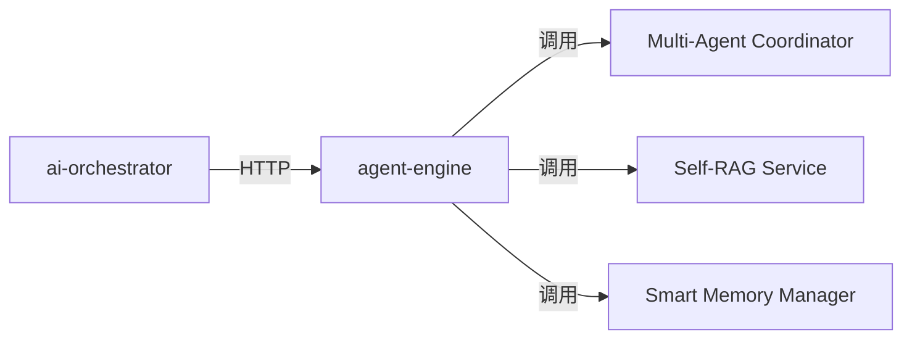

# Enhanced Agent API 集成文档

## 概述

本文档描述了如何将算法服务（agent-engine）的三个新增API集成到后端服务（ai-orchestrator）中。

### 新增功能

1. **Multi-Agent 协作** - 支持多个Agent协同工作，提供5种协作模式
2. **Self-RAG** - 自适应检索增强生成，带幻觉检测和引用
3. **Smart Memory** - 智能记忆管理，支持分层记忆和自动维护

---

## 架构说明

### 调用链路

```
用户请求 → ai-orchestrator (Go) → AIServiceClient (HTTP) → agent-engine (Python/FastAPI)
```

### 组件关系



---

## API 接口说明

### 1. Multi-Agent 协作

#### 1.1 执行协作任务

**端点**: `POST /multi-agent/collaborate`

**请求参数**:
```json
{
  "task": "分析市场趋势并生成报告",
  "mode": "parallel",
  "agent_ids": ["agent-1", "agent-2"],
  "priority": 8,
  "tenant_id": "tenant-001",
  "user_id": "user-001"
}
```

**协作模式**:
- `sequential`: 串行执行（任务依赖）
- `parallel`: 并行执行（独立任务）
- `debate`: 辩论模式（多轮讨论）
- `voting`: 投票模式（多数决定）
- `hierarchical`: 分层模式（coordinator分配）

**响应**:
```json
{
  "task": "分析市场趋势并生成报告",
  "mode": "parallel",
  "agents_involved": ["agent-1", "agent-2"],
  "final_result": "报告内容...",
  "quality_score": 0.85,
  "completion_time": 5.2,
  "status": "completed",
  "metadata": {}
}
```

#### 1.2 注册Agent

**端点**: `POST /multi-agent/agents/register`

**请求参数**:
```json
{
  "agent_id": "research-agent-001",
  "role": "researcher",
  "tools": ["search", "analyze", "summarize"],
  "tenant_id": "tenant-001",
  "user_id": "user-001"
}
```

**角色类型**:
- `coordinator`: 协调者（任务分配）
- `researcher`: 研究者（信息收集）
- `planner`: 规划者（任务规划）
- `executor`: 执行者（任务执行）
- `reviewer`: 审核者（结果审核）

#### 1.3 列出所有Agents

**端点**: `GET /multi-agent/agents?tenant_id=xxx&user_id=xxx`

**响应**:
```json
{
  "agents": [
    {
      "agent_id": "research-agent-001",
      "role": "researcher",
      "tools_count": 3,
      "processed_messages": 42
    }
  ],
  "count": 1
}
```

#### 1.4 获取统计信息

**端点**: `GET /multi-agent/stats?tenant_id=xxx&user_id=xxx`

**响应**:
```json
{
  "total_tasks": 100,
  "completed_tasks": 85,
  "failed_tasks": 5,
  "success_rate": 0.85,
  "avg_completion_time": 3.5,
  "collaboration_quality_avg": 0.82,
  "active_agents": 10,
  "agent_load": {
    "agent-1": 15,
    "agent-2": 12
  }
}
```

---

### 2. Self-RAG

#### 2.1 执行查询

**端点**: `POST /self-rag/query`

**请求参数**:
```json
{
  "query": "什么是人工智能？",
  "mode": "adaptive",
  "context": {
    "domain": "technology"
  },
  "enable_citations": true,
  "max_refinements": 2,
  "tenant_id": "tenant-001",
  "user_id": "user-001"
}
```

**查询模式**:
- `standard`: 标准模式（基础RAG）
- `adaptive`: 自适应模式（动态选择策略）
- `strict`: 严格模式（高置信度要求）
- `fast`: 快速模式（牺牲精度换速度）

**响应**:
```json
{
  "query": "什么是人工智能？",
  "answer": "人工智能是...",
  "confidence": 0.92,
  "retrieval_strategy": "hybrid",
  "refinement_count": 1,
  "hallucination_level": "low",
  "is_grounded": true,
  "citations": [
    {
      "source": "AI Wikipedia",
      "content": "人工智能定义...",
      "url": "https://...",
      "relevance_score": 0.95
    }
  ],
  "metadata": {}
}
```

#### 2.2 获取统计信息

**端点**: `GET /self-rag/stats?tenant_id=xxx&user_id=xxx`

**响应**:
```json
{
  "total_queries": 1000,
  "refinement_triggered": 150,
  "hallucination_detected": 20,
  "query_rewrites": 80,
  "refinement_rate": 0.15,
  "hallucination_rate": 0.02,
  "cache_hit_rate": 0.65
}
```

---

### 3. Smart Memory

#### 3.1 添加记忆

**端点**: `POST /smart-memory/add`

**请求参数**:
```json
{
  "content": "今天学习了Go语言的并发编程",
  "tier": "short_term",
  "importance": 0.8,
  "metadata": {
    "category": "learning",
    "topic": "golang"
  },
  "tenant_id": "tenant-001",
  "user_id": "user-001"
}
```

**记忆层级**:
- `working`: 工作记忆（临时，秒级）
- `short_term`: 短期记忆（分钟到小时级）
- `long_term`: 长期记忆（天到月级）

**响应**:
```json
{
  "memory_id": "mem-12345",
  "tier": "short_term",
  "importance": 0.8,
  "message": "Memory added successfully"
}
```

#### 3.2 检索记忆

**端点**: `POST /smart-memory/retrieve`

**请求参数**:
```json
{
  "query": "Go语言",
  "top_k": 5,
  "tier_filter": "short_term",
  "min_importance": 0.5,
  "tenant_id": "tenant-001",
  "user_id": "user-001"
}
```

**响应**:
```json
{
  "memories": [
    {
      "memory_id": "mem-12345",
      "content": "今天学习了Go语言的并发编程",
      "tier": "short_term",
      "importance": 0.8,
      "current_importance": 0.75,
      "access_count": 3,
      "created_at": "2025-01-01T10:00:00Z",
      "last_accessed": "2025-01-02T15:30:00Z"
    }
  ],
  "count": 1
}
```

#### 3.3 压缩记忆

**端点**: `POST /smart-memory/compress?tier=short_term&tenant_id=xxx&user_id=xxx`

**响应**:
```json
{
  "summary": "总结内容...",
  "original_count": 50,
  "compressed_ratio": 0.2,
  "message": "Compressed 50 memories to summary"
}
```

#### 3.4 维护记忆

**端点**: `POST /smart-memory/maintain?tenant_id=xxx&user_id=xxx`

执行自动维护（遗忘、提升、降级、压缩）

**响应**:
```json
{
  "message": "Memory maintenance completed successfully",
  "stats": {
    "total_added": 100,
    "total_forgotten": 20,
    "total_promoted": 5,
    "total_demoted": 3,
    "total_compressed": 2,
    "memory_counts": {
      "working": 10,
      "short_term": 30,
      "long_term": 20
    },
    "total_memories": 60,
    "avg_importance": 0.65
  }
}
```

#### 3.5 获取统计信息

**端点**: `GET /smart-memory/stats?tenant_id=xxx&user_id=xxx`

---

## Go客户端使用示例

### 1. Multi-Agent协作示例

```go
package main

import (
	"context"
	"fmt"
	"time"

	"voicehelper/cmd/ai-orchestrator/internal/application"
	"voicehelper/cmd/ai-orchestrator/internal/infrastructure"
)

func multiAgentExample() {
	// 创建AI服务客户端
	aiClient := infrastructure.NewAIServiceClientFromConfig(
		map[string]string{
			"agent-engine": "http://localhost:8003",
		},
		60*time.Second,
	)

	// 创建handler
	handler := application.NewEnhancedAgentHandler(aiClient, logger)

	// 执行Multi-Agent协作
	ctx := context.Background()
	req := &application.MultiAgentCollaborateRequest{
		Task:     "分析市场趋势并生成报告",
		Mode:     "parallel",
		Priority: 8,
		TenantID: "tenant-001",
		UserID:   "user-001",
	}

	resp, err := handler.MultiAgentCollaborate(ctx, req)
	if err != nil {
		panic(err)
	}

	fmt.Printf("任务完成: %s\n", resp.FinalResult)
	fmt.Printf("质量分数: %.2f\n", resp.QualityScore)
	fmt.Printf("耗时: %.2f秒\n", resp.CompletionTime)
}
```

### 2. Self-RAG查询示例

```go
func selfRAGExample() {
	handler := application.NewEnhancedAgentHandler(aiClient, logger)
	ctx := context.Background()

	req := &application.SelfRAGQueryRequest{
		Query:           "什么是人工智能？",
		Mode:            "adaptive",
		EnableCitations: true,
		MaxRefinements:  2,
		TenantID:        "tenant-001",
		UserID:          "user-001",
	}

	resp, err := handler.SelfRAGQuery(ctx, req)
	if err != nil {
		panic(err)
	}

	fmt.Printf("答案: %s\n", resp.Answer)
	fmt.Printf("置信度: %.2f\n", resp.Confidence)
	fmt.Printf("引用数量: %d\n", len(resp.Citations))

	// 打印引用
	for _, citation := range resp.Citations {
		fmt.Printf("- %s (相关性: %.2f)\n", citation.Source, citation.RelevanceScore)
	}
}
```

### 3. Smart Memory管理示例

```go
func smartMemoryExample() {
	handler := application.NewEnhancedAgentHandler(aiClient, logger)
	ctx := context.Background()

	// 添加记忆
	addReq := &application.AddMemoryRequest{
		Content:    "今天学习了Go语言的并发编程",
		Tier:       "short_term",
		Importance: 0.8,
		Metadata: map[string]interface{}{
			"category": "learning",
			"topic":    "golang",
		},
		TenantID: "tenant-001",
		UserID:   "user-001",
	}

	addResp, err := handler.AddMemory(ctx, addReq)
	if err != nil {
		panic(err)
	}
	fmt.Printf("记忆ID: %s\n", addResp.MemoryID)

	// 检索记忆
	retrieveReq := &application.RetrieveMemoryRequest{
		Query:         "Go语言",
		TopK:          5,
		MinImportance: 0.5,
		TenantID:      "tenant-001",
		UserID:        "user-001",
	}

	retrieveResp, err := handler.RetrieveMemory(ctx, retrieveReq)
	if err != nil {
		panic(err)
	}

	fmt.Printf("找到 %d 条记忆\n", retrieveResp.Count)
	for _, mem := range retrieveResp.Memories {
		fmt.Printf("- %s (重要性: %.2f)\n", mem.Content, mem.Importance)
	}
}
```

---

## 运行测试

### 单元测试

```bash
# 运行所有测试
go test ./tests/integration/... -v

# 运行特定测试
go test ./tests/integration/... -v -run TestMultiAgentCollaborate

# 跳过集成测试（short模式）
go test ./tests/integration/... -short
```

### 性能测试

```bash
# 运行基准测试
go test ./tests/integration/... -bench=. -benchtime=10s

# 生成性能报告
go test ./tests/integration/... -bench=. -cpuprofile=cpu.prof
go tool pprof cpu.prof
```

### 集成测试前提条件

1. 启动agent-engine服务（默认端口：8003）
```bash
cd algo/agent-engine
python main.py
```

2. 设置环境变量（可选）
```bash
export AGENT_ENGINE_URL=http://localhost:8003
export MODEL_ADAPTER_URL=http://localhost:8005
export RAG_ENGINE_URL=http://localhost:8006
```

3. 运行集成测试
```bash
go test ./tests/integration/... -v
```

---

## 配置说明

### 服务配置（configs/services.yaml）

```yaml
services:
  - name: agent-engine
    type: http
    address: http://localhost:8003
    timeout: 60s
    retry:
      max_attempts: 3
      initial_interval: 100ms
    circuit_breaker:
      max_requests: 3
      interval: 10s
      timeout: 30s
      failure_ratio: 0.6
```

### 环境变量配置

```bash
# agent-engine相关配置
AGENT_ENGINE_URL=http://localhost:8003
AGENT_ENGINE_TIMEOUT=60s

# 功能开关
MULTI_AGENT_ENABLED=true
SELF_RAG_ENABLED=true
SMART_MEMORY_ENABLED=true

# Self-RAG配置
SELF_RAG_HALLUCINATION_THRESHOLD=0.7
SELF_RAG_MAX_REFINEMENTS=2

# Smart Memory配置
MEMORY_COMPRESSION_ENABLED=true
MEMORY_AUTO_MAINTAIN_INTERVAL=1h
```

---

## 监控和指标

### Prometheus指标

```
# Multi-Agent协作
multi_agent_tasks_total{mode, status, tenant_id}
multi_agent_task_duration_seconds{mode, tenant_id}
multi_agent_quality_score{tenant_id}

# Self-RAG
self_rag_queries_total{mode, status, tenant_id}
self_rag_refinement_rate{tenant_id}
self_rag_hallucination_rate{tenant_id}
self_rag_cache_hit_rate{tenant_id}

# Smart Memory
smart_memory_operations_total{operation, status, tenant_id}
smart_memory_size{tier, tenant_id}
smart_memory_importance_avg{tier, tenant_id}
```

### Grafana仪表盘

参考：`deployments/grafana/dashboards/enhanced-agent.json`

---

## 故障排除

### 常见问题

#### 1. 连接超时

**问题**: `context deadline exceeded` 或 `connection timeout`

**解决方案**:
- 检查agent-engine服务是否启动
- 增加超时时间配置
- 检查网络连接和防火墙设置

#### 2. 幻觉检测误报

**问题**: Self-RAG频繁触发幻觉检测

**解决方案**:
- 调整`SELF_RAG_HALLUCINATION_THRESHOLD`阈值（降低值会减少误报）
- 使用`strict`模式以提高准确性
- 改进知识库质量

#### 3. 记忆检索不准确

**问题**: 检索到的记忆不相关

**解决方案**:
- 提高`min_importance`阈值
- 使用`tier_filter`限制检索范围
- 定期执行记忆维护（`/maintain`）

#### 4. Multi-Agent协作性能问题

**问题**: 协作任务耗时过长

**解决方案**:
- 使用`parallel`模式代替`sequential`
- 减少参与的agent数量
- 调整任务优先级

---

## 最佳实践

### 1. Multi-Agent协作

- **选择合适的模式**: 独立任务用`parallel`，有依赖用`sequential`
- **合理设置优先级**: 重要任务设置高优先级（8-10）
- **监控质量分数**: 如果质量分数持续低于0.6，考虑调整agent配置

### 2. Self-RAG

- **默认使用`adaptive`模式**: 性能和准确性的最佳平衡
- **启用引用**: 对于需要可验证性的场景必须启用`enable_citations`
- **设置合理的`max_refinements`**: 通常2-3次足够

### 3. Smart Memory

- **合理分层**: 临时数据用`working`，重要数据用`long_term`
- **设置重要性**: 自动评估可能不准确，关键数据手动指定
- **定期维护**: 建议每小时或每天执行一次`/maintain`

---

## 后续改进

### 短期（1-2周）
- [ ] 添加API限流和降级策略
- [ ] 完善错误处理和重试机制
- [ ] 增加更多的监控指标

### 中期（1个月）
- [ ] 支持流式响应（WebSocket）
- [ ] 添加任务队列和异步处理
- [ ] 实现跨租户隔离

### 长期（3个月）
- [ ] Multi-Agent工作流可视化
- [ ] Self-RAG模型微调
- [ ] 分布式记忆存储

---

## 参考资料

- [Agent Engine文档](../algo/agent-engine/README.md)
- [AI Orchestrator文档](./VoiceHelper-01-AI-Orchestrator.md)
- [Proto定义](../api/proto/agent/v1/agent.proto)
- [配置说明](../configs/README.md)

---

## 联系方式

如有问题，请联系：
- 技术负责人: [技术负责人邮箱]
- 开发团队: [团队邮箱]
- Issue: [GitHub Issues链接]

