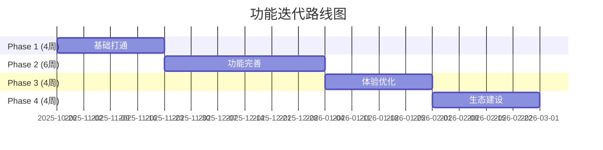

# VoiceHelper AI 客服语音助手 - 执行摘要

> **报告日期**: 2025-10-26
> **报告类型**: 代码审查与功能迭代规划
> **报告人**: AI Code Reviewer

---

## 📊 项目现状

### 当前完成度: **~30%**

```
█████████░░░░░░░░░░░░░░░░░░░ 30%
```

- ✅ **架构设计完成**: 100%
- ✅ **基础框架完成**: 80%
- 🟡 **核心功能实现**: 15%
- 🟡 **测试与文档**: 20%

### 代码质量评分: **7.6/10 (B+)**

| 维度     | 得分 | 评价   |
| -------- | ---- | ------ |
| 架构设计 | 9/10 | 优秀   |
| 代码规范 | 7/10 | 良好   |
| 可读性   | 8/10 | 良好   |
| 可维护性 | 6/10 | 需改进 |
| 性能优化 | 7/10 | 良好   |
| 安全性   | 7/10 | 良好   |
| 可扩展性 | 9/10 | 优秀   |

---

## 🎯 核心结论

### ✅ 架构优势

1. **DDD 分层架构** - 业界领先的领域驱动设计
2. **微服务拆分合理** - 12 个领域服务,职责清晰
3. **事件驱动架构** - Kafka + CDC,解耦服务依赖
4. **高性能通信** - gRPC,5-10x 性能提升
5. **云原生支持** - K8s + Istio + Argo CD,生产就绪

### ⚠️ 关键问题

1. **核心功能缺失** (🔴 高) - GraphRAG、Agent、Voice 等未实现
2. **技术债务较多** (🟡 中) - Wire、Consul、MinIO 等集成缺失
3. **测试覆盖率低** (🟡 中) - 单元测试 < 10%,无集成测试
4. **性能未验证** (🟡 中) - 缺少基准测试

---

## 🚀 迭代计划

### 总体规划: 4 个阶段,18 周



### Phase 1: 基础打通 (4 周)

**目标**: MVP 可用,技术债务清零

**关键任务**:

1. ✅ 修复所有 A 级技术债务 (Wire、Consul、Redis、Kafka)
2. ✅ 完成核心服务实现 (Knowledge、Indexing、Retrieval、AI Orchestrator)
3. ✅ 建立基础测试 (覆盖率 ≥ 50%)
4. ✅ 完善基础文档 (API 文档、Runbook)

**验收标准**:

- 文档入库流程打通
- 检索流程打通
- 所有服务健康运行

### Phase 2: 功能完善 (6 周)

**目标**: 核心功能完整

**关键任务**:

1. ✅ GraphRAG 增强 (图谱构建、查询改写、社区检测)
2. ✅ Agent 系统完整实现 (LangGraph、工具调用、记忆管理)
3. ✅ Voice 实时优化 (ASR、TTS、VAD、WebRTC)

**验收标准**:

- GraphRAG 准确率 ≥ 85%
- Agent 可调用 50+ 工具
- 语音延迟 < 3s

### Phase 3: 体验优化 (4 周)

**目标**: 生产可用

**关键任务**:

1. ✅ 多模态集成 (OCR、图像理解、视频分析)
2. ✅ 性能调优 (缓存优化、数据库优化)
3. ✅ 安全加固 (Vault、审计日志、PII 脱敏)

**验收标准**:

- API P95 < 100ms
- 系统可用性 ≥ 99.9%
- 安全审计通过

### Phase 4: 生态建设 (4 周)

**目标**: 平台化

**关键任务**:

1. ✅ 开放平台 API (REST API、SDK、Webhook)
2. ✅ 插件系统 (工具插件、检索插件、生成插件)

**验收标准**:

- 开放 API 文档完善
- 插件市场上线

---

## 💰 成本预算

### 基础设施成本: **$3,450/月**

| 资源                                          | 月成本 |
| --------------------------------------------- | ------ |
| K8s 集群                                      | $900   |
| GPU 节点                                      | $800   |
| 数据库 (PostgreSQL、Redis、ClickHouse、Neo4j) | $800   |
| 消息队列 (Kafka)                              | $300   |
| 对象存储 (MinIO)                              | $150   |
| 监控 (Prometheus、Grafana)                    | $100   |
| CDN                                           | $100   |
| **其他**                                      | $300   |

### API 调用成本: **$330/月** (1k 日活用户)

| API               | 月成本 |
| ----------------- | ------ |
| OpenAI GPT-4o     | $300   |
| GPT-4V (图像理解) | $30    |

**优化后月成本**: ~**$1,500** (降低 60%)

---

## 👥 团队配置建议

### 推荐方案: **4 人团队** ✅

**配置**:

- 2 名 Go 工程师 (后端服务)
- 2 名 Python 工程师 (算法服务)

**执行周期**: 18 周 (~4.5 个月)

**预期完成度**:

- Phase 1-3: ✅ 100%
- Phase 4: 🟡 80%

### 理想方案: **6 人团队**

**配置**:

- 2 名 Go 工程师
- 2 名 Python 工程师
- 1 名前端工程师
- 1 名 DevOps 工程师

**执行周期**: 12 周 (3 个月)

**预期完成度**: Phase 1-4 ✅ 100%

---

## 📈 业界对比分析

### 对标项目

| 项目                   | Stars | 核心特性            | 差距          |
| ---------------------- | ----- | ------------------- | ------------- |
| **Microsoft GraphRAG** | ~10k  | 知识图谱 + 向量检索 | ✅ 已采用     |
| **Dify**               | ~50k  | LLM 应用开发平台    | ⚠️ 缺少 UI/UX |
| **SpeechBrain**        | ~8k   | 语音处理工具包      | ⚠️ 需集成     |
| **LangGraph**          | ~5k   | Agent 工作流        | 🔴 未实现     |
| **Voila**              | ~2k   | 实时语音对话        | 🔴 未实现     |

### 功能差距分析

| 功能          | VoiceHelper | 业界最佳              | 差距 |
| ------------- | ----------- | --------------------- | ---- |
| GraphRAG 检索 | 🟡 部分实现 | Microsoft GraphRAG    | 中   |
| Multi-Agent   | 🔴 未实现   | Agents/AutoGPT        | 大   |
| 实时语音      | 🔴 未实现   | Voila/OpenAI Realtime | 大   |
| 多模态理解    | 🔴 未实现   | GPT-4V/Claude Vision  | 中   |
| 情感识别      | 🔴 未实现   | SpeechBrain           | 中   |

---

## ⚠️ 风险与挑战

### 高风险项

| 风险                     | 概率  | 影响  | 缓解措施                 |
| ------------------------ | ----- | ----- | ------------------------ |
| **Agent 工具调用不稳定** | 🟡 中 | 🔴 高 | 增加重试、fallback 机制  |
| **实时语音延迟过高**     | 🟡 中 | 🔴 高 | 采用 OpenAI Realtime API |
| **成本超预算**           | 🟡 中 | 🟡 中 | 建立成本监控和告警       |
| **向量检索性能不达标**   | 🟢 低 | 🟡 中 | 提前性能基准测试         |

### 关键决策点

- **Week 4** (Phase 1 结束): Go/No-Go 决策 - MVP 是否可用
- **Week 10** (Phase 2 结束): Go/No-Go 决策 - 核心功能是否完整
- **Week 14** (Phase 3 结束): Go/No-Go 决策 - 是否可生产上线

---

## 🎯 核心建议

### 立即行动 (本周)

1. **修复 A 级技术债务** (5 天)

   - 生成所有 Wire 代码
   - 集成 Consul 服务发现
   - 定义 Kafka Event Schema
   - 完善 APISIX 配置

2. **启动核心服务开发** (同步进行)
   - Knowledge Service (MinIO + Kafka)
   - Indexing Service (文档解析)
   - AI Orchestrator (任务编排)

### 短期目标 (1 个月)

1. **完成 Phase 1** (MVP 可用)

   - 所有 P0 功能实现
   - 基础测试通过
   - API 文档完善

2. **启动 Phase 2** (核心功能)
   - GraphRAG 增强
   - Agent 系统实现
   - Voice 实时优化

### 中长期目标 (3-6 个月)

1. **Phase 2-3 完成** (生产可用)

   - 核心功能完整
   - 性能达标
   - 安全加固

2. **Phase 4 推进** (平台化)
   - 开放 API
   - 插件系统
   - 生态建设

---

## 🎉 预期成果

### Phase 1 (4 周后)

- ✅ MVP 可用,可演示
- ✅ 技术债务清零
- ✅ 文档入库与检索打通

### Phase 2 (10 周后)

- ✅ 核心功能完整
- ✅ GraphRAG、Agent、Voice 全部实现
- ✅ 性能基本达标

### Phase 3 (14 周后)

- ✅ 生产可用
- ✅ 性能优化完成
- ✅ 安全加固完成

### Phase 4 (18 周后)

- ✅ 平台化
- ✅ 开放 API 完善
- ✅ 插件生态建立

---

## 📞 联系方式

- **项目负责人**: [Your Name] - [Email]
- **技术负责人**: [Tech Lead] - [Email]
- **Slack 频道**: #voicehelper-dev
- **文档**: [CODE_REVIEW_AND_ITERATION_PLAN.md](./CODE_REVIEW_AND_ITERATION_PLAN.md)

---

## 附录: 关键文档

1. **详细审查报告**: [CODE_REVIEW_AND_ITERATION_PLAN.md](./CODE_REVIEW_AND_ITERATION_PLAN.md) (60 页)
2. **执行清单**: [ITERATION_EXECUTION_CHECKLIST.md](./ITERATION_EXECUTION_CHECKLIST.md) (30 页)
3. **当前进度**: [WEEK1_2_COMPLETION_REPORT.md](./WEEK1_2_COMPLETION_REPORT.md)
4. **功能清单**: [FEATURE_CHECKLIST.md](./FEATURE_CHECKLIST.md)

---

**报告生成时间**: 2025-10-26
**报告版本**: v1.0
**下次更新**: 2025-11-02 (每周更新)
