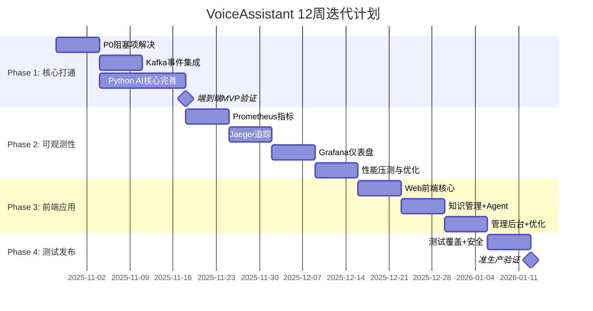

# VoiceAssistant 项目主计划

> **文档版本**: v3.0
> **生成日期**: 2025-10-27
> **项目状态**: 开发中 (45% 完成)
> **目标版本**: v2.3.0
> **预计周期**: 12-14 周

---

## 📑 文档说明

本文档整合了以下关键文档的内容:

- 未完成功能清单与 TODO 审计
- 代码审查与迭代计划 (2025 Q4)
- 后续迭代计划与任务清单
- 功能迁移报告 (voicehelper)
- 文档索引与协作指南

**目的**: 为项目团队提供统一的真实来源 (Single Source of Truth)

---

## 🎯 执行摘要

### 一句话总结

**在 12 周内**,通过解决 31 个 P0 阻塞项、补全核心功能、建立可观测性、开发前端应用,将项目从 **45%** 提升到 **85% 可发布状态**。

### 当前状态快照

| 维度               | 完成度 | 关键问题                    | 行动计划         |
| ------------------ | ------ | --------------------------- | ---------------- |
| **架构设计**       | 95%    | ✅ 完善                     | 持续优化         |
| **Go 微服务**      | 45%    | ⚠️ Wire 未生成,服务无法启动 | Week 1 解决      |
| **Python AI 服务** | 40%    | 核心算法未完成              | Week 1-4 补全    |
| **前端应用**       | 10%    | 仅有骨架                    | Week 9-11 开发   |
| **可观测性**       | 0%     | ❌ 无监控/追踪/告警         | Week 5-8 建立    |
| **测试覆盖**       | <5%    | ❌ 几乎无测试               | Week 12 达到 70% |
| **文档体系**       | 85%    | ✅ 技术文档完善             | 持续更新         |

**总体进度**: **45%** → **目标 85%** (提升 40 个百分点)

### P0 阻塞项 (必须立即解决)

| #   | 问题                 | 影响                 | 计划解决时间   | 负责人                             |
| --- | -------------------- | -------------------- | -------------- | ---------------------------------- |
| 1   | **Wire 代码未生成**  | Go 服务无法启动      | Week 1 Day 1-2 | Backend Engineer 1                 |
| 2   | **Proto 代码不完整** | 服务间通信受阻       | Week 1 Day 2-3 | Backend Engineer 1                 |
| 3   | **Kafka 未集成**     | 异步处理流程无法工作 | Week 1-2       | Backend Engineer 2 + AI Engineer 1 |

**Action**: Week 1 全团队优先解决这 3 个阻塞项。

---

## 📊 项目统计数据

### 代码规模

- **Go 代码**: ~15,000 行 (7 个微服务)
- **Python 代码**: ~12,000 行 (8 个 AI 服务)
- **前端代码**: ~500 行 (骨架)
- **文档**: ~25,000 字 (完善)

### 未完成功能统计

| 优先级        | 数量    | 预估工时       | 占比 | 状态        |
| ------------- | ------- | -------------- | ---- | ----------- |
| **P0 (阻塞)** | 31      | 45-60 天       | 33%  | 🔥 紧急     |
| **P1 (重要)** | 58      | 65-80 天       | 49%  | ⚠️ 高优先级 |
| **P2 (优化)** | 44      | 35-45 天       | 18%  | 📌 中优先级 |
| **总计**      | **133** | **145-185 天** | 100% | -           |

**关键发现**:

- ✅ **架构设计完善**: DDD 微服务架构清晰,API 接口定义完整
- ⚠️ **核心功能缺失**: 31 个 P0 阻塞项需要在 2 周内解决
- ❌ **可观测性为零**: 无监控、追踪、告警系统
- ❌ **测试几乎为零**: 测试覆盖率 < 5%
- ✅ **文档体系完善**: 8000+ 行技术文档

---

## 🗺️ 迭代路线图

### 总体规划 (12 周)

### 里程碑时间线

| 里程碑                   | 日期 (相对) | 验收标准                           | 状态      |
| ------------------------ | ----------- | ---------------------------------- | --------- |
| **M1: P0 阻塞项解决**    | Week 1      | 所有服务可启动,Wire/Proto 生成完成 | 📋 待开始 |
| **M2: MVP 端到端打通**   | Week 4      | 完整业务流程演示成功               | 📋 待开始 |
| **M3: 可观测性体系建立** | Week 8      | 监控/追踪/告警/压测完成            | 📋 待开始 |
| **M4: 前端应用发布**     | Week 11     | Web + 管理后台可用                 | 📋 待开始 |
| **M5: 准生产验证通过**   | Week 12     | 测试/安全/CI/CD 完成,准生产稳定    | 📋 待开始 |
| **M6: 生产发布 v2.1.0**  | Week 13+    | 正式发布到生产环境                 | 📋 待开始 |

---

## 📅 分阶段详细计划

### Phase 1: 核心打通与补全 (Week 1-4) 🔥

**目标**: 解决 P0 阻塞项,实现端到端 MVP 流程
**里程碑**: 用户登录 → 上传文档 → 知识检索 → 流式问答

#### Week 1: P0 阻塞项解决

**关键任务**:

1. ✅ **Wire 代码生成** (2 天, P0) ⚠️

   - 安装 Wire 工具: `go install github.com/google/wire/cmd/wire@latest`
   - 为所有 7 个 Go 服务生成 `wire_gen.go`
   - 验证编译通过: `make build-all`
   - **负责人**: Backend Engineer 1
   - **验收**: 所有服务可启动

2. ✅ **Proto 代码生成** (1 天, P0)

   - 更新 `scripts/proto-gen.sh`
   - 生成 Go proto: `make proto-gen`
   - 生成 Python proto
   - **负责人**: Backend Engineer 1
   - **验收**: `import` 无错误

3. ✅ **服务启动验证** (1 天, P0)

   - 启动所有基础设施: `make dev-up`
   - 逐个启动并验证健康检查
   - **负责人**: SRE Engineer
   - **验收**: 所有服务健康检查通过

4. ✅ **MinIO 集成** (2 天, P1)
   - 实现 `internal/infra/minio_client.go`
   - 文件上传/下载 API
   - **负责人**: Backend Engineer 2
   - **验收**: curl 上传/下载成功

**交付物**:

- `cmd/*/wire_gen.go` (7 个文件)
- `api/proto/*/pb/*.go` (Go proto)
- `algo/*/protos/*_pb2.py` (Python proto)
- `cmd/knowledge-service/internal/infra/minio_client.go`
- `docs/development/service-startup-guide.md`

#### Week 2: Kafka 事件系统集成

**关键任务**:

1. Knowledge Service Kafka Producer (2 天, P0)
2. Conversation Service Kafka Producer (2 天, P1)
3. Indexing Service Kafka Consumer (3 天, P0)

**交付物**:

- `cmd/knowledge-service/internal/infra/kafka_producer.go`
- `cmd/conversation-service/internal/infra/kafka_producer.go`
- `algo/indexing-service/app/infrastructure/kafka_consumer.py`
- `docs/development/kafka-integration.md`

#### Week 3: Python AI 服务核心完善

**关键任务**:

1. Neo4j 知识图谱构建 (3 天, P1)
2. Retrieval Service 混合检索 (3 天, P1)
3. RAG Engine 多路召回 (2 天, P1)
4. Model Adapter 国产模型 (1 天, P2)

**交付物**:

- `algo/indexing-service/app/infrastructure/neo4j_client.py`
- `algo/retrieval-service/app/services/hybrid_retrieval.py`
- `algo/rag-engine/app/services/multi_retrieval.py`
- `algo/model-adapter/app/services/providers/{baidu,zhipu,qwen}_adapter.py`

#### Week 4: Agent 与流式响应

**关键任务**:

1. Agent Engine Plan-and-Execute (3 天, P1)
2. Agent Memory 持久化 (2 天, P1)
3. Conversation Service SSE 流式 (2 天, P1)
4. **端到端 MVP 验证** (1 天, P0)

**交付物**:

- `algo/agent-engine/app/memory/persistent_memory.py`
- `cmd/conversation-service/internal/server/sse_handler.go`
- MVP 演示视频
- `docs/nfr/mvp-performance-baseline.md`

---

### Phase 2: 可观测性与 NFR (Week 5-8) 📊

**目标**: 建立完整的监控、追踪、告警体系,达到 SLO 标准
**里程碑**: 生产级可观测性、性能达标、成本可控

#### Week 5: Prometheus 指标采集

**关键任务**:

1. Go 服务指标采集 (2 天)

   - 业务指标: QPS、错误率、延迟 (P50/P95/P99)
   - 系统指标: CPU、内存、goroutine 数
   - 应用到所有 7 个 Go 服务

2. Python 服务指标采集 (2 天)

   - FastAPI 中间件指标
   - 业务指标: 任务数、Token 使用、模型调用
   - 应用到所有 7 个 Python 服务

3. 自定义业务指标 (1 天)
   - 对话成功率
   - 知识召回准确率
   - Agent 任务成功率
   - Token 成本 (按模型分类)

**交付物**:

- `pkg/monitoring/prometheus.go`
- `internal/*/observability/metrics.go`
- Python: `app/infrastructure/metrics.py`
- `docs/observability/metrics-catalog.md`

#### Week 6: Jaeger 分布式追踪

**关键任务**:

1. OpenTelemetry Go 集成 (2 天)
2. OpenTelemetry Python 集成 (2 天)
3. 跨服务追踪验证 (1 天)

**交付物**:

- `pkg/tracing/otel.go`
- `internal/*/observability/tracing.go`
- Python: `app/infrastructure/tracing.py`
- `configs/otel-collector.yaml`

#### Week 7: Grafana 仪表盘与告警

**关键任务**:

1. Grafana Dashboard 开发 (3 天)

   - 服务概览面板
   - 业务指标面板
   - 成本分析面板
   - 系统资源面板

2. AlertManager 告警规则 (2 天)
   - 服务不可用告警
   - 高错误率告警
   - 高延迟告警
   - SLO 违约告警
   - 成本超限告警

**交付物**:

- `configs/grafana/dashboards/*.json` (5 个面板)
- `configs/prometheus/alerts/*.yml`
- `deployments/helm/values-observability.yaml`

#### Week 8: 性能压测与优化

**关键任务**:

1. k6 压测脚本 (2 天)
2. 性能基准测试 (2 天)
3. 性能优化 (2 天)
4. 成本优化 (1 天)

**交付物**:

- `tests/load/k6/*.js` (3 个脚本)
- `docs/nfr/performance-test-report.md`
- `docs/nfr/performance-optimization-summary.md`
- `algo/*/app/services/cost_optimizer.py`

---

### Phase 3: 前端与用户体验 (Week 9-11) 🎨

**目标**: 构建生产级 Web 应用,优化用户体验
**里程碑**: Web 应用发布、管理后台、移动端适配

**技术栈**: Next.js 14 + React 18 + Tailwind CSS + shadcn/ui

#### Week 9: Web 前端核心功能

**关键任务**:

1. 认证与布局 (2 天)

   - 登录/注册页面
   - JWT 认证流程
   - 主布局 (侧边栏 + Header)
   - 响应式设计 + 暗黑模式

2. 对话界面 (3 天)
   - 对话列表组件
   - 消息组件 (Markdown + 代码高亮)
   - 流式打字效果 (SSE 集成)
   - 输入组件 (文本 + 文件上传)

**交付物**:

- `platforms/web/app/(auth)/` (登录注册)
- `platforms/web/app/(main)/chat/` (对话页面)
- `platforms/web/components/chat/` (对话组件)
- `platforms/web/lib/api.ts` (API 客户端)

#### Week 10: 知识管理与 Agent 可视化

**关键任务**:

1. 文档管理 (2 天)
2. Agent 调试面板 (2 天)
3. 多模态交互 (1 天)

**交付物**:

- `platforms/web/app/(main)/knowledge/`
- `platforms/web/components/agent/`
- `platforms/web/components/multimodal/`

#### Week 11: 管理后台与优化

**关键任务**:

1. 管理后台 (简化版) (3 天)
2. 前端性能优化 (1 天)
3. 移动端适配 (1 天)

**交付物**:

- `platforms/admin/` (管理后台)
- `platforms/web/.next/` (优化后构建)
- PWA 配置: `platforms/web/public/manifest.json`

---

### Phase 4: 测试、安全与发布 (Week 12) 🚀

**目标**: 测试覆盖、安全加固、生产发布准备
**里程碑**: 测试通过、安全审计、准生产验证

#### Week 12: 测试与发布

**关键任务**:

1. **单元测试** (2 天, 优先核心模块)

   - Go 服务: Domain + Biz 层 (目标 70%)
   - Python 服务: Service 层 (目标 70%)
   - 前端: 核心组件测试

2. **集成测试** (2 天)

   - API 契约测试
   - Kafka 事件测试
   - 端到端流程测试 (Playwright)

3. **安全审计** (1 天)

   - SAST 扫描 (SonarQube)
   - 依赖漏洞扫描 (Snyk/Trivy)
   - 镜像扫描

4. **CI/CD 完善** (1 天)

   - GitHub Actions 配置
   - PR 检查门禁 (lint + test + build)
   - Argo CD 配置 (金丝雀发布)

5. **准生产验证** (1 天)
   - 部署到预发布环境
   - 灰度发布测试 (5% → 20% → 50%)
   - 监控指标验证
   - 回滚测试

**交付物**:

- `tests/unit/**/*_test.go` (单元测试)
- `tests/unit/**/*_test.py`
- `tests/integration/` (集成测试)
- `.github/workflows/ci.yml`
- `.github/workflows/cd.yml`
- `docs/release/pre-release-checklist.md`

---

## 🎯 功能迁移计划 (voicehelper)

基于对 [voicehelper](https://github.com/haoyunlt/voicehelper) v0.9.2 的深度分析,识别出 **15 项**值得迁移的功能特性。

### v2.1.0 核心增强 (P0/P1)

| #   | 功能                    | 优先级 | 预估工时 | 负责人  | 状态      |
| --- | ----------------------- | ------ | -------- | ------- | --------- |
| 1   | **Redis 任务持久化**    | P0     | 2-3 天   | Backend | ⏸️ 待开始 |
| 2   | **分布式限流器**        | P0     | 3-4 天   | Backend | ⏸️ 待开始 |
| 3   | **长期记忆时间衰减**    | P0     | 2 天     | AI      | ⏸️ 待开始 |
| 4   | **Silero VAD 深度学习** | P0     | 3-5 天   | AI      | ⏸️ 待开始 |
| 5   | **智谱 AI GLM-4 支持**  | P1     | 2-3 天   | AI      | ⏸️ 待开始 |
| 6   | **文档版本管理 (MVP)**  | P1     | 5-7 天   | Backend | ⏸️ 待开始 |
| 7   | **病毒扫描 (ClamAV)**   | P1     | 3-5 天   | Backend | ⏸️ 待开始 |

### v2.2.0 功能扩展 (P1)

| #   | 功能                   | 优先级 | 预估工时 | 负责人  | 状态      |
| --- | ---------------------- | ------ | -------- | ------- | --------- |
| 8   | **FCM/APNs Push 通知** | P1     | 5-7 天   | Backend | ⏸️ 待开始 |
| 9   | **声学情感识别**       | P1     | 7-10 天  | AI      | ⏸️ 待开始 |

### v2.3.0 优化提升 (P2)

| #   | 功能                      | 优先级 | 预估工时 | 负责人  | 状态      |
| --- | ------------------------- | ------ | -------- | ------- | --------- |
| 10  | **CLI 工具开发**          | P2     | 2-3 天   | Backend | ⏸️ 待开始 |
| 11  | **快速部署脚本优化**      | P2     | 2 天     | SRE     | ⏸️ 待开始 |
| 12  | **GraphRAG 批量优化**     | P2     | 3 天     | AI      | ⏸️ 待开始 |
| 13  | **文档格式转换 (Pandoc)** | P2     | 1-2 天   | Backend | ⏸️ 待开始 |

**总工时预估**: 120-150 人天

---

## 📋 TODO 列表与追踪

### 当前 Sprint 任务 (Week 1)

#### P0 任务 (本周必须完成)

- [ ] **Wire 代码生成** (2 天)

  - [ ] 安装 Wire 工具
  - [ ] 为 7 个 Go 服务生成 `wire_gen.go`
  - [ ] 验证编译通过
  - **负责人**: Backend Engineer 1

- [ ] **Proto 代码生成** (1 天)

  - [ ] 更新 `scripts/proto-gen.sh`
  - [ ] 生成 Go 和 Python proto 代码
  - [ ] 验证导入正常
  - **负责人**: Backend Engineer 1

- [ ] **服务启动验证** (1 天)
  - [ ] 启动所有基础设施
  - [ ] 逐个启动并验证健康检查
  - [ ] 创建启动脚本和文档
  - **负责人**: SRE Engineer

#### P1 任务 (尽量完成)

- [ ] **MinIO 集成 Knowledge Service** (2 天)
  - [ ] 实现 `minio_client.go`
  - [ ] 文件上传/下载 API
  - [ ] 单元测试
  - **负责人**: Backend Engineer 2

### 阻塞问题

| #   | 问题                               | 影响                | 负责人    | 状态      | 计划解决时间   |
| --- | ---------------------------------- | ------------------- | --------- | --------- | -------------- |
| 1   | Wire 代码未生成导致服务无法编译    | 🔴 阻塞所有 Go 服务 | Backend 1 | ⏸️ 待解决 | Week 1 Day 1-2 |
| 2   | Proto 代码不完整导致 gRPC 调用失败 | 🔴 阻塞服务间通信   | Backend 1 | ⏸️ 待解决 | Week 1 Day 2-3 |
| 3   | Kafka 事件未集成导致异步流程中断   | 🟡 影响完整功能     | Backend 2 | ⏸️ 待解决 | Week 1-2       |

### 模块统计

| 模块                     | 总任务数 | P0     | P1     | P2     | 完成度  |
| ------------------------ | -------- | ------ | ------ | ------ | ------- |
| **Voice Engine**         | 15       | 6      | 7      | 2      | 40%     |
| **Agent Engine**         | 18       | 8      | 8      | 2      | 35%     |
| **RAG Engine**           | 14       | 5      | 7      | 2      | 45%     |
| **Knowledge Service**    | 12       | 3      | 6      | 3      | 50%     |
| **Identity Service**     | 8        | 2      | 4      | 2      | 60%     |
| **Conversation Service** | 10       | 3      | 5      | 2      | 50%     |
| **Model Router**         | 9        | 2      | 5      | 2      | 55%     |
| **Indexing Service**     | 13       | 4      | 7      | 2      | 40%     |
| **Multimodal Engine**    | 8        | 2      | 4      | 2      | 50%     |
| **Analytics Service**    | 7        | 1      | 4      | 2      | 40%     |
| **Frontend (Web)**       | 10       | 0      | 8      | 2      | 10%     |
| **Frontend (Admin)**     | 6        | 0      | 4      | 2      | 5%      |
| **Infrastructure**       | 3        | 0      | 2      | 1      | 70%     |
| **Total**                | **133**  | **31** | **58** | **44** | **45%** |

---

## 👥 资源配置

### 团队配置 (建议)

| 角色                  | 人数  | 职责                            | 状态            |
| --------------------- | ----- | ------------------------------- | --------------- |
| **Backend Engineer**  | 2     | Go 服务、API、Kafka 集成        | ✅ 现有         |
| **AI Engineer**       | 2     | Python AI 服务、算法优化        | ✅ 现有         |
| **Frontend Engineer** | 1     | Web 应用、管理后台              | ⚠️ 需招聘       |
| **SRE Engineer**      | 1     | 可观测性、CI/CD、压测、部署     | ⚠️ 需招聘       |
| **QA Engineer**       | 1     | 测试用例、自动化测试、质量保证  | ⚠️ 需招聘       |
| **Tech Lead**         | 1     | 技术决策、架构审查、Code Review | ✅ 现有         |
| **总计**              | **8** | -                               | **需新增 3 人** |

### 时间分配

| Phase       | 周数      | 人周        | 重点任务                     |
| ----------- | --------- | ----------- | ---------------------------- |
| **Phase 1** | 4 周      | 24 人周     | 核心功能补全、P0 阻塞项解决  |
| **Phase 2** | 4 周      | 28 人周     | 可观测性、性能优化、成本控制 |
| **Phase 3** | 3 周      | 21 人周     | 前端应用、用户体验           |
| **Phase 4** | 1 周      | 8 人周      | 测试、安全、发布准备         |
| **总计**    | **12 周** | **81 人周** | 约 3 个月 (全职团队)         |

### 预算估算

#### 人力成本

- 8 人 × 12 周 = **96 人周**
- 按平均 $1,500/人周 = **$144,000**

#### 基础设施成本 (3 个月)

- 计算 + 数据库 + 存储: $10,000/月 × 3 = **$30,000**
- AI 模型 API: $2,000/月 × 3 = **$6,000**

#### 总计: **~$180,000** (3 个月)

---

## ⚠️ 风险管理

### 高风险

| 风险                | 影响 | 概率 | 缓解措施                                       | 责任人        |
| ------------------- | ---- | ---- | ---------------------------------------------- | ------------- |
| **人员不足**        | 高   | 高   | 立即招聘 Frontend/SRE/QA (Week 1-2 完成)       | Tech Lead     |
| **技术债务累积**    | 中   | 高   | 每周技术债务审查会议,及时重构                  | Tech Lead     |
| **第三方 API 限流** | 高   | 中   | 多提供商冗余、降级策略、本地模型备选           | AI Team       |
| **性能不达标**      | 高   | 中   | Week 8 提前压测、及时优化、必要时架构调整      | SRE + Backend |
| **进度延期**        | 中   | 中   | 双周回顾调整优先级、砍掉 P3 功能、延长 Phase 4 | Tech Lead     |

### 中风险

| 风险             | 影响 | 概率 | 缓解措施                          | 责任人       |
| ---------------- | ---- | ---- | --------------------------------- | ------------ |
| **集成问题**     | 中   | 中   | 早期集成测试 (Week 4)、持续验证   | Backend Team |
| **测试覆盖不足** | 中   | 中   | 强制 PR 覆盖率门禁、专职 QA       | QA Engineer  |
| **安全漏洞**     | 中   | 低   | 每次 PR 自动扫描、定期安全审查    | SRE Engineer |
| **文档滞后**     | 低   | 高   | PR 模板强制文档更新、每周文档审查 | All Team     |
| **成本超支**     | 中   | 中   | 实时成本监控、告警、预算审批流程  | Tech Lead    |

---

## ✅ 验收标准

### Phase 1 验收 (Week 4)

- [ ] 所有 Go 服务可启动并通过健康检查
- [ ] Kafka 事件系统集成到 3 个核心服务
- [ ] MinIO 文件上传/下载可用
- [ ] Neo4j 知识图谱构建成功
- [ ] RAG 混合检索召回率提升 15%+
- [ ] 端到端 MVP 流程演示成功

### Phase 2 验收 (Week 8)

- [ ] Prometheus 指标采集覆盖所有服务
- [ ] Grafana 5 个仪表盘可用
- [ ] Jaeger 追踪端到端链路清晰
- [ ] AlertManager 告警规则测试通过
- [ ] k6 压测达到 NFR 基线:
  - API P95 < 200ms
  - 并发 ≥ 1k RPS
  - 可用性 ≥ 99.9% (模拟测试)
- [ ] Token 成本降低 20%+

### Phase 3 验收 (Week 11)

- [ ] Web 应用核心功能完整 (登录、对话、文档、Agent)
- [ ] 管理后台可用 (用户、租户、监控、配置)
- [ ] 移动端响应式适配完成
- [ ] Lighthouse 性能评分 > 90
- [ ] 前端 E2E 测试通过

### Phase 4 验收 (Week 12)

- [ ] 单元测试覆盖率 ≥ 70% (核心模块)
- [ ] 集成测试覆盖核心流程
- [ ] E2E 测试自动化运行通过
- [ ] 安全扫描无高危漏洞
- [ ] CI/CD 流水线完整且通过
- [ ] 准生产环境灰度发布成功
- [ ] 准生产环境稳定运行 24h+

### 最终发布标准 (v2.1.0)

- [ ] 所有 Phase 1-4 验收标准通过
- [ ] 文档齐全 (API、Runbook、用户手册)
- [ ] 性能达到 NFR 基线
- [ ] 安全审计通过
- [ ] 回滚机制验证成功
- [ ] 准生产运行 1 周无重大问题
- [ ] 发布检查清单 100% 完成

---

## 📚 文档索引

### 快速导航

#### 📖 开发指南

- [快速入门 (QUICKSTART.md)](../QUICKSTART.md)
- [团队协作指南 (TEAM_COLLABORATION_GUIDE.md)](../TEAM_COLLABORATION_GUIDE.md)
- [.cursorrules (开发规范)](../.cursorrules)

#### 🏗️ 架构设计

- [微服务架构 v2.0 (microservice-architecture-v2.md)](arch/microservice-architecture-v2.md)
- [API 概览 (API_OVERVIEW.md)](api/API_OVERVIEW.md)
- [服务清单 (services/)](services/)

#### 📅 项目进度

- [迭代路线图 2025 Q4 (ITERATION_ROADMAP_2025Q4.md)](../ITERATION_ROADMAP_2025Q4.md)
- [功能迁移报告 (FEATURE_MIGRATION_REPORT.md)](../FEATURE_MIGRATION_REPORT.md)
- [TODO 审计报告 (TODO_AUDIT_REPORT.md)](../TODO_AUDIT_REPORT.md)
- [未完成功能清单 (INCOMPLETE_FEATURES_CHECKLIST.md)](INCOMPLETE_FEATURES_CHECKLIST.md)

#### 🔧 开发文档

- [服务启动指南](development/service-startup-guide.md)
- [Kafka 集成文档](development/kafka-integration.md)
- [Wire 依赖注入](development/wire-usage.md)

#### 📊 监控与运维

- [NFR 基线 (nfr-baseline.md)](nfr/nfr-baseline.md)
- [SLO 定义 (slo.md)](nfr/slo.md)
- [成本看板 (cost-dashboard.md)](nfr/cost-dashboard.md)
- [Runbook (runbook/)](runbook/)

#### 🔒 安全与合规

- [威胁模型 (threat-model/)](threat-model/)
- [安全策略 (security/policies.md)](security/policies.md)

#### 📦 部署与发布

- [Kubernetes 部署](../deployments/k8s/)
- [Helm Charts](../deployments/helm/)
- [Docker Compose](../docker-compose.yml)
- [发布检查清单 (release/pre-release-checklist.md)](release/pre-release-checklist.md)

#### 📝 历史归档

- [历史报告 (reports/archive/)](reports/archive/)
- [归档总结 (ARCHIVE_SUMMARY.md)](ARCHIVE_SUMMARY.md)

---

## 🔄 迭代管理

### 双周回顾

- **频率**: 每 2 周
- **参与**: 全体工程师 + Tech Lead + CTO
- **内容**:
  1. 回顾已完成任务
  2. 识别风险与阻塞项
  3. 调整优先级与资源
  4. 更新迭代计划文档

### 每日站会

- **时间**: 每天 10:00 AM
- **时长**: 15 分钟
- **内容**:
  1. 昨天完成了什么
  2. 今天计划做什么
  3. 有什么阻塞

### 任务跟踪

- **工具**: GitHub Projects / Jira / Linear
- **看板**:
  - Backlog
  - Todo
  - In Progress
  - In Review
  - Done
- **标签**:
  - `priority/P0`, `priority/P1`, `priority/P2`
  - `area/backend`, `area/ai`, `area/frontend`, `area/infra`
  - `type/feature`, `type/bugfix`, `type/refactor`, `type/test`

---

## 📞 联系与支持

### 关键联系人

| 角色             | 姓名 | 联系方式 | 负责模块                 |
| ---------------- | ---- | -------- | ------------------------ |
| **Tech Lead**    | TBD  | -        | 整体架构、技术决策       |
| **Backend Lead** | TBD  | -        | Go 服务、基础设施        |
| **AI Lead**      | TBD  | -        | Python AI 服务、算法     |
| **SRE Lead**     | TBD  | -        | 可观测性、部署、性能     |
| **CTO**          | TBD  | -        | 战略方向、资源分配、审批 |

### 文档维护

- **文档所有者**: AI 架构团队
- **最后更新**: 2025-10-27
- **下次审查**: 每双周 (Week 2, 4, 6, 8, 10, 12)
- **反馈渠道**: GitHub Issues / 团队会议 / Slack #voiceassistant-dev

---

## 🎯 最终目标

在 12 周内,将 VoiceAssistant 平台从当前 45% 完成度提升到 **85% 可发布状态**,达到以下标准:

- ✅ 核心业务流程完整且稳定
- ✅ 性能达到 NFR 基线
- ✅ 生产级可观测性
- ✅ Web 应用和管理后台可用
- ✅ 测试覆盖 ≥ 70%
- ✅ 安全审计通过
- ✅ 准生产环境验证通过

---

## 💡 重要提示

1. **本计划基于代码审查结果调整**,优先级重新排序,聚焦 P0/P1 任务。
2. **12 周是紧凑周期**,需要团队全力投入。如果人员不足,建议延长至 16 周。
3. **P2/P3 任务可根据进度动态调整**,优先保证核心功能和质量。
4. **持续集成验证**:每完成一个 Week 的任务,立即进行集成测试,避免最后阶段大量问题。
5. **文档与代码同步更新**:每个 PR 必须包含相关文档更新。

---

**准备好迎接挑战了吗？Let's build something great! 🚀**

---

_本文档整合自多个项目管理与规划文档,旨在为团队提供统一的项目视图和执行指南。_
