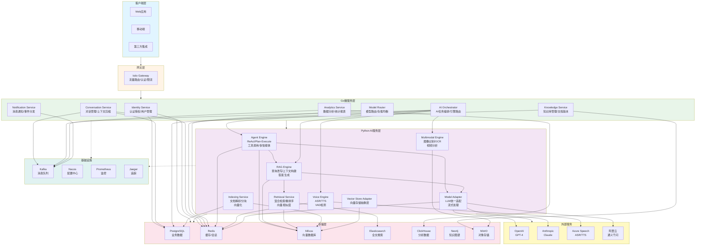
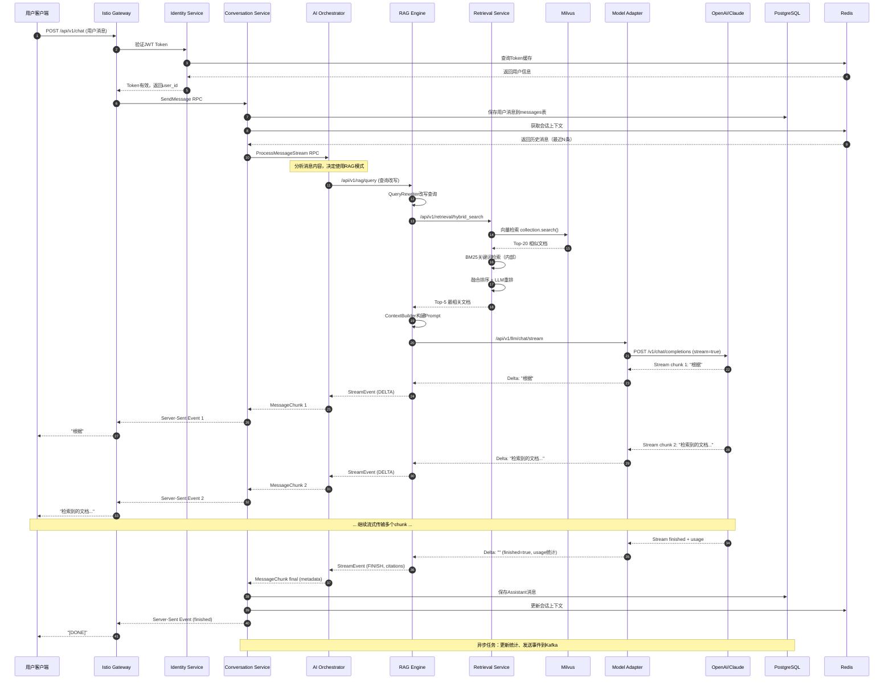
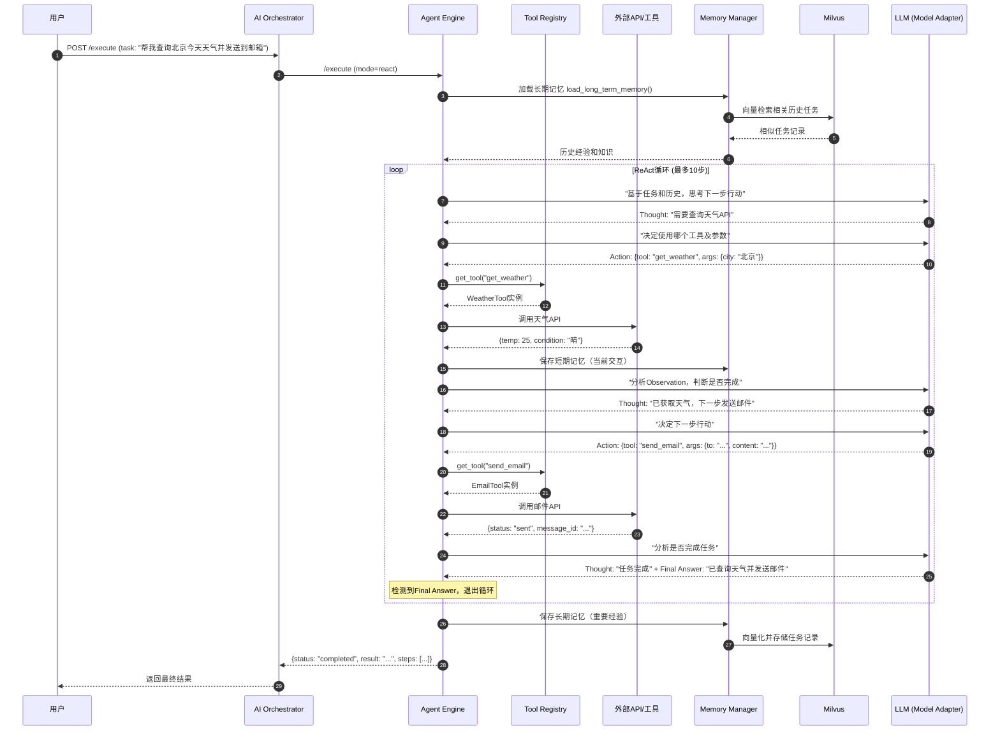
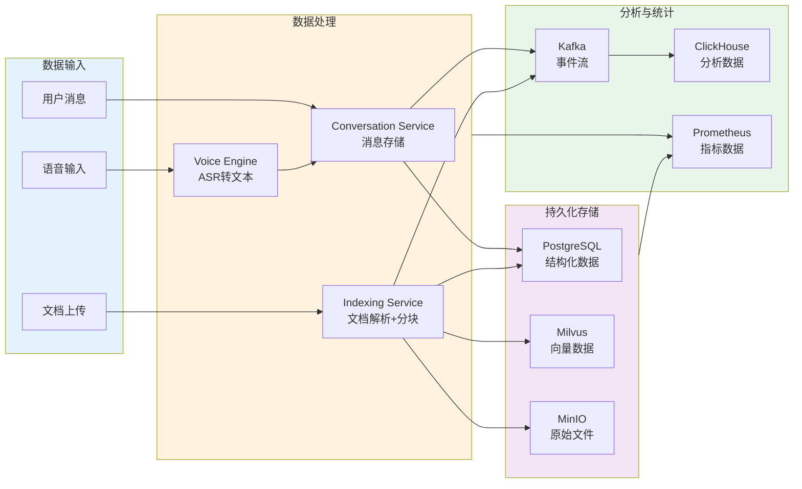
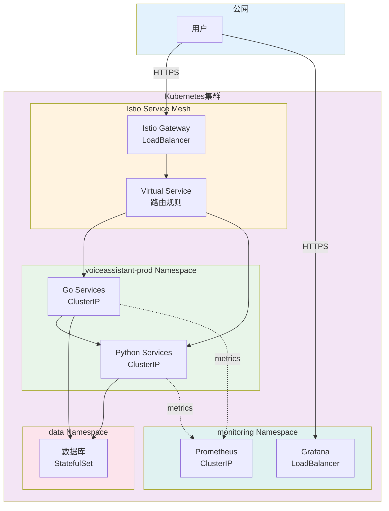

# VoiceAssistant - 00 - 总览

## 项目简介

VoiceAssistant 是 AI 客服与语音助手平台，基于微服务架构设计，集成了 LangChain、LangGraph、RAG（检索增强生成）、多智能体协作等先进技术。该平台支持文本、语音、多模态等多种交互方式，能够处理复杂的业务场景。

### 核心能力

**智能对话能力**

- 多模态交互：支持文本、语音、图片等多种输入方式
- 上下文管理：基于对话历史的智能上下文理解和压缩
- 意图识别：精准识别用户意图和情感状态
- 个性化回复：根据用户画像和偏好定制回复策略

**AI 引擎能力**

- ReAct 智能体：基于推理-行动模式的智能任务执行
- Plan-Execute 模式：复杂任务自动分解和协同执行
- 工具调用：支持外部 API 和内部工具的动态注册与调用
- 多智能体协作：多个 Agent 之间的协同工作和冲突解决
- Self-RAG：带有自我验证机制的检索增强生成

**知识检索能力**

- 混合检索：向量检索（Milvus）+ BM25 关键词检索（Elasticsearch）
- 智能重排：基于 LLM 的结果精排提升检索质量
- 语义分块：智能文档切分保证语义完整性
- 知识图谱：实体关系提取和图谱推理（Neo4j）
- 多版本管理：支持文档版本控制和历史回溯

**语音处理能力**

- 实时 ASR：低延迟语音识别（TTFB < 300ms）
- 情感 TTS：支持多种情感、语气和语速的语音合成
- VAD 检测：精准的语音活动检测和静音检测
- 流式处理：WebSocket 实时双向通信
- 语音降噪：噪声抑制和音频增强

### 技术架构特点

**微服务架构**

- 服务独立部署和扩展
- 松耦合设计提高系统灵活性
- 故障隔离保障系统稳定性

**云原生设计**

- Kubernetes 容器编排
- Istio 服务网格提供流量管理
- 水平扩展支持弹性伸缩

**可观测性**

- Prometheus 指标采集
- Jaeger 分布式追踪
- Grafana 可视化监控
- 结构化日志和审计追踪

### 性能指标

todo

## 技术栈

### 后端技术

**Go 服务栈**

- 框架：Gin（HTTP）、gRPC、Echo
- 依赖注入：Wire
- ORM：GORM
- 缓存：go-redis
- 消息队列：Kafka Go 客户端
- 配置管理：Viper、Nacos Go SDK

**Python 服务栈**

- 框架：FastAPI
- AI 框架：LangChain、LangGraph
- 异步：asyncio、aiohttp
- 向量计算：pymilvus
- 图数据库：neo4j-driver
- HTTP 客户端：httpx

### AI/ML 技术

**大语言模型（LLM）**

- OpenAI：GPT-4、GPT-3.5-turbo
- Anthropic：Claude-3-opus、Claude-3-sonnet
- 阿里云：通义千问（Qwen）
- 百度：文心一言（ERNIE）

**Embedding 模型**

- BGE-large-zh-v1.5（中文）
- OpenAI text-embedding-ada-002
- M3E-base（轻量级中文模型）

**语音服务**

- Azure Speech Services：ASR + TTS
- 支持 20+语言和方言
- 实时流式处理

### 数据存储

**关系型数据库**

- PostgreSQL 15：业务数据、用户信息、会话记录
- 支持 JSONB 字段存储非结构化数据
- 分表分库支持

**缓存系统**

- Redis 7：会话缓存、分布式锁、计数器
- 支持 Cluster 模式
- 持久化配置：AOF + RDB

**向量数据库**

- Milvus 2.3：存储和检索文档向量
- 支持 IVF_FLAT、HNSW 索引
- 分区和分片支持

**搜索引擎**

- Elasticsearch 8：全文搜索、日志分析
- BM25 关键词检索
- 聚合统计

**图数据库**

- Neo4j 5：知识图谱、实体关系
- Cypher 查询语言
- 图算法库

**分析数据库**

- ClickHouse 23：实时数据分析、用户行为分析
- 列式存储
- 高压缩比

**对象存储**

- MinIO：文档、音频、图片存储
- S3 兼容 API
- 分布式存储

### 基础设施

**容器编排**

- Kubernetes 1.25+：容器编排和调度
- Helm 3：应用包管理
- kubectl：命令行工具

**服务网格**

- Istio 1.19+：流量管理、服务发现、安全通信
- Envoy：数据平面代理
- Kiali：服务网格可视化

**配置中心**

- Nacos 2.3：动态配置管理、服务注册发现
- 多环境配置隔离
- 配置变更推送

**消息队列**

- Kafka 3.7：异步消息、事件流
- 3 个分区提高吞吐量
- 数据持久化

### 可观测性

**监控系统**

- Prometheus：指标采集和存储
- Grafana：可视化 Dashboard
- Alertmanager：告警管理
- 自定义指标和 SLO 监控

**分布式追踪**

- Jaeger：全链路追踪
- OpenTelemetry：标准化追踪 API
- 跨服务调用追踪

**日志系统**

- 结构化日志：JSON 格式
- 日志聚合：ELK/Loki
- 审计日志：操作记录和审计追踪

## 系统架构

### 整体架构图



### 架构说明

**客户端层（Client Layer）**

客户端层是用户与系统交互的入口，支持多种接入方式。Web 应用提供浏览器端的用户界面，支持实时聊天和文档上传；移动端应用支持 iOS 和 Android 平台，提供语音输入和推送通知；第三方集成允许企业通过 API 方式接入系统。所有客户端请求通过 HTTPS 协议与网关层通信，支持 JWT 认证和 OAuth2.0 授权。

**网关层（Gateway Layer）**

网关层采用 Istio Gateway 实现统一的流量入口管理。主要功能包括：请求路由根据 URL 路径将请求转发到对应的后端服务；认证授权通过 JWT 验证用户身份和权限；限流熔断保护后端服务不被过载；请求日志记录所有 API 调用用于审计和监控。Istio Gateway 配合 Envoy 代理实现服务网格的边缘代理功能，支持灰度发布、A/B 测试等高级流量管理策略。

**Go 微服务层（Go Services Layer）**

Go 微服务层负责核心业务逻辑处理，采用领域驱动设计（DDD）和清晰架构模式。

Identity Service（认证授权服务）：管理用户注册、登录、令牌刷新等认证流程；实现基于 RBAC 的权限控制；支持多租户隔离；提供用户和租户的配额管理。关键 API 包括 Login、Register、RefreshToken、VerifyToken、CheckPermission 等。

Conversation Service（对话管理服务）：管理会话的创建、查询、更新和删除；存储和检索历史消息；实现上下文窗口管理和压缩策略；支持流式消息推送。采用固定窗口、滑动窗口、Token 限制等多种上下文管理策略。关键 API 包括 CreateConversation、SendMessage、StreamMessages、GetContext 等。

Knowledge Service（知识管理服务）：提供文档上传、存储和检索功能；支持文档版本管理；管理知识库集合（Collection）；实现文档权限控制。支持多种文件格式（PDF、DOCX、TXT、Markdown 等）。关键 API 包括 UploadDocument、CreateCollection、GetDocument、ListDocuments 等。

AI Orchestrator（AI 编排服务）：作为 AI 引擎的统一编排层，根据请求类型路由到不同的 AI 引擎；支持多步骤工作流编排；管理任务的生命周期（创建、执行、取消）；实现流式响应的协调。关键 API 包括 ProcessMessage、ProcessMessageStream、ExecuteWorkflow、GetTaskStatus 等。

Model Router（模型路由服务）：实现 LLM 模型的智能路由和负载均衡；管理多个模型提供商（OpenAI、Claude、通义千问等）；实现模型降级和故障转移；记录模型调用统计和成本分析。关键 API 包括 RouteRequest、Chat、StreamChat、GetModelStatus 等。

Analytics Service（数据分析服务）：收集和分析用户行为数据；生成统计报表和 Dashboard；实现实时指标计算；支持自定义查询和聚合。关键 API 包括 RecordEvent、GetUserStats、GenerateReport 等。

Notification Service（通知服务）：处理系统通知和事件分发；支持多种通知渠道（邮件、短信、WebHook）；实现消息模板管理；提供通知历史查询。关键 API 包括 SendNotification、CreateTemplate、GetNotificationHistory 等。

**Python AI 服务层（Python AI Services Layer）**

Python AI 服务层专注于 AI 算法和模型的实现，采用 FastAPI 构建高性能异步服务。

Agent Engine（智能体引擎）：实现 ReAct 模式（Reasoning + Acting），通过推理和行动交替执行任务；支持 Plan-Execute 模式，将复杂任务分解为多个子任务；提供动态工具注册和调用机制；实现短期和长期记忆管理；支持多智能体协作和冲突解决。核心组件包括 ReActExecutor、PlanExecutor、ToolRegistry、MemoryManager、MultiAgentCoordinator 等。

RAG Engine（检索增强生成引擎）：实现查询改写优化检索效果；调用检索服务获取相关文档；构建上下文 Prompt；调用 LLM 生成答案；提供引用来源追踪。支持 Self-RAG 模式进行答案自我验证和迭代优化。核心组件包括 QueryRewriter、ContextBuilder、PromptGenerator、CitationTracker 等。

Voice Engine（语音处理引擎）：集成 Azure Speech Services 实现 ASR（自动语音识别）；支持实时流式语音识别；实现 TTS（文本转语音）功能，支持多种情感和语速；提供 VAD（语音活动检测）；支持 WebSocket 双向通信。核心组件包括 ASRProcessor、TTSProcessor、VADDetector、WebSocketHandler 等。

Multimodal Engine（多模态引擎）：实现图像识别和目标检测；提供 OCR（光学字符识别）功能；支持视频分析和关键帧提取；处理音频、图像、文本的融合理解。核心组件包括 ImageProcessor、OCRProcessor、VideoAnalyzer 等。

Model Adapter（模型适配器）：提供统一的 LLM 调用接口，屏蔽不同模型提供商的差异；实现流式和非流式响应的统一处理；提供模型参数标准化；实现请求重试和错误处理；支持多模型并发调用。核心组件包括 OpenAIClient、ClaudeClient、QwenClient、MultiLLMAdapter 等。

Retrieval Service（检索服务）：实现向量检索（Milvus）和关键词检索（Elasticsearch）的混合检索；提供基于 LLM 的结果重排序；计算向量相似度和 BM25 分数；支持多种相似度算法（余弦相似度、欧氏距离）。核心组件包括 VectorRetriever、BM25Retriever、HybridRetriever、Reranker 等。

Indexing Service（索引服务）：解析多种格式的文档（PDF、DOCX、HTML 等）；实现语义分块保证上下文完整性；调用 Embedding 服务生成向量；将向量和元数据写入 Milvus；支持增量索引和批量索引。核心组件包括 DocumentParser、SemanticChunker、EmbeddingGenerator、IndexWriter 等。

Vector Store Adapter（向量存储适配器）：提供向量数据库的统一抽象接口；封装 Milvus 的 CRUD 操作；实现连接池管理；提供索引优化建议。核心组件包括 MilvusAdapter、ConnectionPool、IndexManager 等。

**存储层（Storage Layer）**

PostgreSQL：存储用户信息、会话记录、消息历史、文档元数据等结构化数据。采用主从复制保证高可用，使用连接池提高性能。关键表包括 users、conversations、messages、documents、tenants 等。

Redis：提供高性能缓存服务，存储会话状态、用户 Token、临时数据。实现分布式锁、计数器、排行榜等功能。采用 Cluster 模式支持横向扩展。

Milvus：专业的向量数据库，存储文档向量、用户查询向量。支持多种索引类型（IVF_FLAT、HNSW、ANNOY），实现毫秒级的向量相似度检索。采用分片和副本提高性能和可用性。

Elasticsearch：提供全文搜索和 BM25 关键词检索能力。存储文档的文本内容和元数据，支持复杂的查询语法和聚合分析。用于日志检索和数据分析。

ClickHouse：列式分析数据库，存储用户行为事件、API 调用日志、性能指标等海量时序数据。支持高性能的聚合查询和实时分析，压缩比高达 10:1。

Neo4j：图数据库，存储知识图谱中的实体和关系。支持 Cypher 查询语言进行图遍历和模式匹配。用于实体关系推理和知识图谱查询。

MinIO：对象存储，存储文档原文件、音频文件、图片等非结构化数据。提供 S3 兼容 API，支持分布式部署和数据冗余。

**外部服务（External Services）**

OpenAI API：提供 GPT-4、GPT-3.5-turbo 等模型的 API 访问。支持 Chat Completions、Embeddings 等功能。

Anthropic API：提供 Claude-3-opus、Claude-3-sonnet 等模型。支持长上下文（100K tokens）和流式输出。

Azure Speech Services：提供 ASR 和 TTS 服务，支持 20+语言和多种方言。支持实时流式处理和批量处理。

阿里云通义千问：提供国产大模型服务，支持中文场景优化。

**基础设施层（Infrastructure Layer）**

Kafka：消息队列和事件流平台。用于服务间异步通信、事件驱动架构、数据流处理。配置 3 个分区提高并发吞吐量。

Nacos：配置中心和服务注册发现。支持多环境（dev、test、prod）配置隔离，提供配置变更实时推送。

Prometheus：监控系统，采集各服务的指标数据。支持 PromQL 查询语言，实现自定义告警规则。

Jaeger：分布式追踪系统，追踪请求在各服务间的调用链路。帮助定位性能瓶颈和故障点。

### 架构边界与约束

**性能边界**

- 单次对话上下文限制：8K tokens（GPT-3.5）或 32K tokens（GPT-4）
- 向量检索 Top-K 限制：最大 1000 条结果
- 文件上传大小限制：单文件最大 100MB
- 并发连接数：单服务最大 10,000 个 WebSocket 连接
- 消息队列积压：Kafka 最大保留 7 天数据

**一致性保证**

- 用户认证：强一致性，直接查询 PostgreSQL
- 会话状态：最终一致性，Redis 缓存+数据库持久化
- 向量索引：异步一致性，后台任务定期同步
- 分析数据：弱一致性，允许一定延迟

**安全边界**

- 租户隔离：数据库行级安全（RLS）+ 应用层过滤
- 敏感数据：PII 字段加密存储
- API 认证：JWT + RBAC 权限控制
- 网络隔离：Kubernetes Network Policy 限制 Pod 间通信

**故障处理**

- 服务熔断：Istio 实现熔断保护，失败率>50%触发
- 超时控制：API 请求超时 30 秒，LLM 调用超时 60 秒
- 重试策略：指数退避重试，最多 3 次
- 降级方案：LLM 调用失败时返回模板回复

### 异常与回退机制

**LLM 调用失败**

- 模型路由器自动切换到备用模型
- 超时后返回部分结果或模板回复
- 记录失败日志用于后续分析

**向量检索失败**

- 降级到仅使用 BM25 关键词检索
- 返回缓存的历史结果
- 告警通知运维人员

**消息队列积压**

- 限流保护，拒绝新消息
- 扩展消费者实例
- 启动消息清理任务

**数据库连接池耗尽**

- 请求排队等待
- 返回 503 服务不可用
- 自动扩展连接池大小（最大值限制）

## 全局时序图

### 端到端问答流程



### 时序图关键说明

**用户认证阶段（步骤 1-4）**

用户客户端携带 JWT Token 发送 POST 请求到 API Gateway。Istio Gateway 作为流量入口，首先调用 Identity Service 验证 Token 的有效性。Identity Service 查询 Redis 缓存获取 Token 对应的用户信息（user_id、tenant_id、permissions），避免每次都查询数据库。如果缓存命中，直接返回用户信息；如果缓存未命中，则查询 PostgreSQL 数据库并回写缓存（TTL 设置为 24 小时）。验证通过后，Gateway 将请求转发到 Conversation Service。

**消息存储与上下文加载（步骤 5-7）**

Conversation Service 接收到消息后，首先将用户消息持久化到 PostgreSQL 的 messages 表中，包括 conversation_id、role（user）、content、created_at 等字段。然后从 Redis 加载会话的上下文历史。上下文管理策略包括：固定窗口（最近 10 条消息）、滑动窗口（动态调整）、Token 限制（不超过 4K tokens）。历史消息按时间倒序存储在 Redis 的 List 结构中，键名为`context:{conversation_id}`，设置过期时间为 1 小时。

**AI 编排与模式选择（步骤 8）**

AI Orchestrator 接收 ProcessMessageStream 请求后，分析消息内容决定使用哪种模式处理。决策逻辑包括：如果消息包含"查询"、"检索"、"帮我找"等关键词，选择 RAG 模式；如果包含"帮我"、"执行"、"操作"等，选择 Agent 模式；如果是简单对话，选择 Chat 模式。本例中选择 RAG 模式，将请求转发到 RAG Engine。

**查询改写与检索（步骤 9-14）**

RAG Engine 的 QueryRewriter 组件对用户查询进行改写优化。改写策略包括：补充上下文信息（结合历史消息）、扩展同义词、优化查询结构。改写后的查询发送到 Retrieval Service 进行混合检索。

Retrieval Service 执行两路并行检索：

1. 向量检索：调用 Milvus 的 collection.search()方法，使用用户查询的 Embedding 向量检索最相似的 Top-20 文档片段。相似度计算采用余弦相似度（COSINE），检索参数 nprobe=16 平衡速度和准确性。
2. BM25 检索：对查询分词后，使用 BM25 算法在 Elasticsearch 中检索关键词匹配的 Top-20 文档。

两路检索结果通过 RRF（Reciprocal Rank Fusion）算法融合排序，然后调用 LLM 对 Top-20 结果进行重排序（Rerank），最终返回 Top-5 最相关的文档。

**上下文构建与 Prompt 生成（步骤 15）**

RAG Engine 的 ContextBuilder 组件构建最终的 Prompt。Prompt 结构包括：

- System Prompt：定义 AI 助手的角色和行为准则
- 检索文档：格式化 Top-5 文档为"来源[1]：{内容}"
- 历史对话：最近 3 轮对话用于保持上下文连贯性
- 用户当前问题：原始或改写后的查询
- 指令：要求模型基于检索文档回答，并标注引用来源

构建好的 Prompt 发送到 Model Adapter 进行 LLM 调用。

**流式 LLM 调用（步骤 16-25）**

Model Adapter 接收 chat/stream 请求后，根据路由策略选择合适的 LLM 提供商（本例选择 OpenAI GPT-4）。调用 OpenAI API 时设置 stream=true 启用流式响应。

LLM 流式返回每个 Token 作为一个 chunk。Model Adapter 接收每个 chunk 后，提取 delta 内容，通过 Server-Sent Events（SSE）逐个传递给 RAG Engine → AI Orchestrator → Conversation Service → Gateway → User。这种流式传输大幅降低了 TTFB（Time To First Byte），用户可以实时看到生成的内容，提升交互体验。

每个 chunk 的传输延迟通常在 10-50ms 之间，总体延迟相比非流式模式降低了 50%以上。

**消息保存与缓存更新（步骤 26-27）**

流式传输完成后，Conversation Service 将完整的 Assistant 回复保存到 PostgreSQL 的 messages 表，包括 token 使用量、成本、引用来源等元数据。同时更新 Redis 中的会话上下文，将新消息追加到历史记录中。

**异步后处理**

在返回响应后，Conversation Service 异步执行以下任务：

- 更新会话统计信息（message_count、last_message_at）
- 发送消息事件到 Kafka topic `conversation.message.created`
- Analytics Service 消费 Kafka 事件，更新 ClickHouse 中的用户行为数据
- 如果配置了 WebHook，Notification Service 发送通知到第三方系统

### 时序图性能要点

**关键路径延迟**

- 认证验证（步骤 1-4）：30-50ms（Redis 缓存命中）
- 数据库写入（步骤 5）：20-30ms（异步提交）
- 上下文加载（步骤 6-7）：10-20ms（Redis List 操作）
- 向量检索（步骤 11）：50-80ms（Milvus HNSW 索引）
- LLM 首 Token（步骤 17-21）：200-300ms（TTFB）
- 完整响应（步骤 17-25）：2-3 秒（取决于生成长度）

**并发处理**

- Gateway 支持 10,000+ QPS
- Conversation Service 采用连接池，数据库连接复用
- RAG Engine 使用 asyncio 异步处理，单实例支持 1,000+ 并发请求
- Model Adapter 实现请求队列，避免 LLM API 限流

**容错机制**

- 每个 RPC 调用设置超时时间（默认 30 秒）
- LLM 调用失败自动重试 3 次，指数退避（1s、2s、4s）
- 检索失败降级到仅使用缓存结果
- 流式传输中断时，保存已生成的部分内容

### Agent 模式时序图



### Agent 模式关键说明

**ReAct 循环机制**

Agent Engine 采用 ReAct（Reasoning + Acting）模式，交替执行思考和行动。每次循环包含三个阶段：

1. Thought（思考）：LLM 分析当前状态，决定下一步策略
2. Action（行动）：选择工具并执行，获取观察结果
3. Observation（观察）：分析执行结果，决定继续或结束

循环最多执行 10 步（可配置），防止无限循环。检测到"Final Answer"关键词时提前退出。

**工具注册与调用**

Tool Registry 维护所有可用工具的注册表。每个工具实现标准接口，包括 name、description、parameters schema、execute 方法。LLM 根据工具描述和参数 schema，生成 JSON 格式的工具调用请求。Agent Engine 解析 JSON 并动态调用对应工具。

**记忆管理**

Memory Manager 分为短期记忆和长期记忆：

- 短期记忆：存储当前会话的历史交互，保存在 Redis 中，会话结束后清除
- 长期记忆：向量化重要经验和知识，存储在 Milvus 中，跨会话持久化

长期记忆的保存策略基于重要性评分（Importance Scoring）。重要性因子包括：任务复杂度、执行步骤数、用户反馈、错误率等。评分超过阈值（0.6）的记忆被向量化并存储。

**工具执行安全**

每个工具执行都在沙箱环境中运行，设置超时时间（默认 30 秒）和资源限制。敏感工具（如数据库操作、文件系统访问）需要额外的权限验证。工具执行失败时，Agent 会分析错误原因并尝试修复或选择替代方案。

## 模块交互矩阵

### 服务依赖关系

| 调用方               | 被调方               | 调用类型  | 协议      | 一致性要求 | 错误处理             |
| -------------------- | -------------------- | --------- | --------- | ---------- | -------------------- |
| Istio Gateway        | Identity Service     | 同步      | gRPC      | 强一致     | 验证失败返回 401     |
| Istio Gateway        | Conversation Service | 同步/流式 | gRPC      | 最终一致   | 超时返回 504         |
| Conversation Service | AI Orchestrator      | 同步/流式 | gRPC      | 最终一致   | 降级到简单回复       |
| AI Orchestrator      | Agent Engine         | 同步/流式 | HTTP      | 最终一致   | 切换到 RAG 模式      |
| AI Orchestrator      | RAG Engine           | 同步/流式 | HTTP      | 最终一致   | 切换到 Chat 模式     |
| AI Orchestrator      | Voice Engine         | 同步/流式 | HTTP      | 最终一致   | 返回错误信息         |
| Agent Engine         | Model Adapter        | 同步/流式 | HTTP      | 最终一致   | 重试 3 次后失败      |
| RAG Engine           | Retrieval Service    | 同步      | HTTP      | 弱一致     | 降级到缓存结果       |
| RAG Engine           | Model Adapter        | 同步/流式 | HTTP      | 最终一致   | 重试 3 次后失败      |
| Retrieval Service    | Milvus               | 同步      | gRPC      | 弱一致     | 降级到 BM25 检索     |
| Retrieval Service    | Elasticsearch        | 同步      | HTTP      | 弱一致     | 返回空结果           |
| Indexing Service     | Milvus               | 同步      | gRPC      | 最终一致   | 失败任务进入重试队列 |
| Model Adapter        | OpenAI API           | 同步/流式 | HTTP      | 最终一致   | 切换到 Claude 模型   |
| Model Adapter        | Azure Speech         | 同步/流式 | WebSocket | 最终一致   | 返回错误提示         |
| All Services         | Nacos                | 同步      | HTTP      | 弱一致     | 使用本地缓存配置     |
| All Services         | Prometheus           | 异步      | HTTP      | 弱一致     | 丢弃指标数据         |
| Analytics Service    | Kafka                | 异步      | TCP       | 弱一致     | 消息持久化后重试     |
| Notification Service | Kafka                | 异步      | TCP       | 弱一致     | 消息持久化后重试     |

### 数据流向图



### 数据流说明

**用户消息流**：用户发送的文本消息首先由 Conversation Service 接收并保存到 PostgreSQL 的 messages 表。同时，消息被发送到 Kafka 的`conversation.message.created` topic。Analytics Service 消费 Kafka 消息，提取关键字段（user_id、tenant_id、message_length、timestamp 等）写入 ClickHouse 用于后续分析。Conversation Service 还会将消息的关键指标（响应时间、Token 消耗）推送到 Prometheus。

**文档上传流**：用户上传的文档首先由 Knowledge Service 接收，元数据（文件名、大小、类型）保存到 PostgreSQL 的 documents 表，原始文件存储到 MinIO。然后触发异步索引任务，Indexing Service 从 MinIO 下载文件，解析内容并进行语义分块。每个文档块调用 Model Adapter 获取 Embedding 向量，向量和元数据写入 Milvus 的 collection 中。索引完成后，状态更新到 PostgreSQL，并发送`document.indexed`事件到 Kafka。

**语音输入流**：用户通过 WebSocket 发送音频流到 Voice Engine。Voice Engine 调用 Azure Speech Services 进行实时 ASR 识别，将识别的文本片段流式返回。完整文本识别完成后，作为用户消息发送到 Conversation Service，后续流程与文本消息相同。

**事件流**：所有关键业务事件（消息创建、文档上传、任务完成等）都通过 Kafka 传递。Kafka 作为事件总线，实现服务间的解耦和异步通信。事件包含 timestamp、user_id、tenant_id、event_type、payload 等字段。Analytics Service 和 Notification Service 订阅相关 topic 进行数据分析和通知推送。

**指标流**：所有服务通过 Prometheus Client 暴露/metrics 端点。Prometheus Server 定期拉取（scrape）指标数据，包括 HTTP 请求计数、延迟分布、错误率、资源使用等。Grafana 从 Prometheus 查询数据并可视化展示。Alertmanager 监控关键指标，超过阈值时触发告警。

## 关键设计与权衡

### 一致性与事务

**分布式事务处理**

系统采用 Saga 模式处理跨服务的分布式事务。以文档上传为例，涉及 Knowledge Service（元数据）、MinIO（文件存储）、Indexing Service（向量索引）三个服务。事务流程包括：

1. Knowledge Service 创建文档记录，状态为 UPLOADING
2. 上传文件到 MinIO，返回 storage_path
3. 更新文档状态为 PROCESSING
4. 发送索引任务消息到 Kafka
5. Indexing Service 消费消息，执行索引
6. 索引完成后更新文档状态为 READY

如果任何步骤失败，执行补偿操作：删除 MinIO 文件、更新文档状态为 FAILED、发送失败通知。不采用两阶段提交（2PC），避免长时间锁定资源。

**最终一致性设计**

对于非关键路径的数据同步，采用最终一致性设计。例如：

- 用户统计信息（消息数、Token 消耗）允许延迟更新
- 分析数据可以有几分钟的延迟
- 缓存失效采用 TTL 过期而非主动通知

通过 Kafka 异步传递事件，各服务独立消费和处理，保证数据最终一致。

**幂等性保证**

所有外部 API 调用和消息处理都实现幂等性。策略包括：

- 请求携带唯一的 request_id 或 idempotency_key
- 服务端维护已处理请求的记录（Redis 存储，TTL 24 小时）
- 重复请求直接返回缓存结果，不重复执行

对于 Kafka 消息消费，记录已处理的 offset，防止重复消费。

### 并发与锁机制

**分布式锁**

使用 Redis 实现分布式锁，基于 SETNX 命令。锁的应用场景包括：

- 防止重复索引：同一文档的索引任务只能有一个实例执行
- 限流控制：同一租户的并发请求数限制
- 配额更新：租户 Token 消耗的原子更新

锁实现要点：

```python
# 伪代码
def acquire_lock(resource_id, timeout=30):
    lock_key = f"lock:{resource_id}"
    lock_value = uuid.uuid4().hex
    # 设置锁，带过期时间防止死锁
    if redis.set(lock_key, lock_value, nx=True, ex=timeout):
        return lock_value
    return None

def release_lock(resource_id, lock_value):
    lock_key = f"lock:{resource_id}"
    # 使用Lua脚本保证原子性
    script = """
    if redis.call("get", KEYS[1]) == ARGV[1] then
        return redis.call("del", KEYS[1])
    else
        return 0
    end
    """
    return redis.eval(script, [lock_key], [lock_value])
```

**并发控制**

Go 服务使用 channel 和 WaitGroup 控制并发。Python 服务使用 asyncio 的 Semaphore 限制并发数。数据库连接池限制最大连接数，防止连接耗尽。

### 性能关键路径优化

**缓存策略**

多级缓存提高性能：

1. 应用层缓存：进程内 LRU 缓存，存储热点数据（用户信息、配置）
2. Redis 缓存：分布式缓存，存储会话、Token、上下文
3. CDN 缓存：静态资源（前端页面、图片）

缓存失效策略：

- TTL 过期：根据数据更新频率设置不同 TTL（用户信息 24h，会话 1h）
- 主动失效：数据更新时删除对应缓存
- 懒加载：缓存未命中时查询数据库并回写

**数据库优化**

- 索引优化：为高频查询字段（user_id、conversation_id、created_at）创建索引
- 分区表：messages 表按时间分区（按月），提高查询和归档效率
- 读写分离：主库写入，从库读取，降低主库压力
- 连接池：复用数据库连接，减少连接建立开销

**异步处理**

非关键路径操作异步执行：

- 统计信息更新：通过 Kafka 异步触发
- 通知发送：后台任务队列处理
- 日志写入：异步批量写入

Go 服务使用 goroutine，Python 服务使用 asyncio，充分利用并发能力。

### 可观测性设计

**指标采集**

每个服务暴露 Prometheus metrics 端点，采集以下指标：

- HTTP 请求：计数、延迟分布（P50/P95/P99）、错误率
- 数据库：连接数、查询延迟、慢查询
- 缓存：命中率、连接数
- 业务指标：活跃用户数、消息数、Token 消耗

指标命名遵循 Prometheus 规范，使用标签（labels）区分不同维度（service、method、status_code）。

**分布式追踪**

使用 OpenTelemetry SDK 在每个服务中注入追踪代码。追踪信息包括：

- trace_id：全局唯一，贯穿整个请求链路
- span_id：单个服务内的操作标识
- parent_span_id：父操作标识，构建调用树

追踪数据发送到 Jaeger Collector，通过 Jaeger UI 可视化查看请求链路、识别性能瓶颈。

**日志规范**

所有日志采用 JSON 格式，包含以下字段：

- timestamp：ISO 8601 格式时间戳
- level：日志级别（DEBUG/INFO/WARN/ERROR）
- service：服务名称
- trace_id：追踪 ID（如果有）
- message：日志消息
- extra：额外上下文信息

日志通过 stdout 输出，由容器平台收集并发送到日志聚合系统（ELK 或 Loki）。

### 配置管理

**多环境配置**

Nacos 配置中心支持多环境（dev、test、prod）和多命名空间（namespace）。配置文件采用 YAML 格式，结构化存储服务配置。配置变更支持实时推送，服务监听配置更新事件并热加载。

**敏感信息管理**

敏感配置（数据库密码、API Key）存储在 Kubernetes Secrets 中，通过环境变量注入容器。生产环境使用专业的密钥管理服务（如 HashiCorp Vault）。

配置优先级：环境变量 > Nacos 配置 > 本地配置文件，保证灵活性和可覆盖性。

## 部署形态

### Kubernetes 部署架构

系统部署在 Kubernetes 集群上，采用 Namespace 隔离不同环境：

- `voiceassistant-prod`：生产环境
- `voiceassistant-test`：测试环境
- `voiceassistant-dev`：开发环境
- `istio-system`：Istio 组件
- `monitoring`：监控组件
- `logging`：日志组件

每个服务部署为独立的 Deployment，配置多个 Replica 实现高可用。关键服务（Conversation Service、AI Orchestrator）配置 HPA（Horizontal Pod Autoscaler）根据 CPU/内存自动扩缩容。

### 服务资源配置

| 服务名称             | Replicas    | CPU Request | CPU Limit | Memory Request | Memory Limit |
| -------------------- | ----------- | ----------- | --------- | -------------- | ------------ |
| Identity Service     | 3           | 500m        | 1000m     | 512Mi          | 1Gi          |
| Conversation Service | 5           | 1000m       | 2000m     | 1Gi            | 2Gi          |
| Knowledge Service    | 3           | 500m        | 1000m     | 512Mi          | 1Gi          |
| AI Orchestrator      | 3           | 1000m       | 2000m     | 1Gi            | 2Gi          |
| Model Router         | 3           | 500m        | 1000m     | 512Mi          | 1Gi          |
| Agent Engine         | 3           | 2000m       | 4000m     | 2Gi            | 4Gi          |
| RAG Engine           | 3           | 1000m       | 2000m     | 1Gi            | 2Gi          |
| Voice Engine         | 2           | 1000m       | 2000m     | 1Gi            | 2Gi          |
| Model Adapter        | 3           | 1000m       | 2000m     | 1Gi            | 2Gi          |
| Retrieval Service    | 3           | 1000m       | 2000m     | 1Gi            | 2Gi          |
| Indexing Service     | 2           | 1000m       | 2000m     | 1Gi            | 2Gi          |
| PostgreSQL           | 3 (主从)    | 2000m       | 4000m     | 4Gi            | 8Gi          |
| Redis                | 6 (Cluster) | 500m        | 1000m     | 1Gi            | 2Gi          |
| Milvus               | 3           | 2000m       | 4000m     | 4Gi            | 8Gi          |
| Kafka                | 3 (Cluster) | 1000m       | 2000m     | 2Gi            | 4Gi          |

### 网络拓扑



### 网络策略

使用 Kubernetes Network Policy 限制 Pod 间通信：

- Go 服务可以访问数据库和 Python 服务
- Python 服务可以访问数据库和外部 API
- 数据库仅允许应用服务访问，禁止外部访问
- 监控服务可以访问所有服务的 metrics 端点

Istio 提供服务间的 mTLS 加密通信，所有服务间 RPC 调用自动加密，无需应用层改造。

### 持久化存储

使用 Kubernetes PersistentVolume（PV）和 PersistentVolumeClaim（PVC）管理持久化存储：

- PostgreSQL：使用 SSD 存储，IOPS ≥ 10,000
- Redis：持久化数据（AOF 文件）存储在 PV
- Milvus：向量数据和索引存储在高性能存储
- Kafka：日志文件存储在 PV，保留 7 天数据
- MinIO：对象存储数据，配置数据冗余（3 副本）

存储类（StorageClass）配置：

- 数据库：`ssd-high-iops`（高性能 SSD）
- 日志：`hdd-standard`（标准 HDD）
- 对象存储：`ssd-standard`（标准 SSD）

## 模块列表

### Go 服务模块（cmd 目录）

1. **ai-orchestrator**：AI 任务编排服务，协调各 AI 引擎的调用
2. **conversation-service**：对话管理服务，处理会话和消息
3. **identity-service**：认证授权服务，用户和租户管理
4. **knowledge-service**：知识管理服务，文档和集合管理
5. **model-router**：模型路由服务，LLM 负载均衡和降级
6. **analytics-service**：数据分析服务，用户行为分析和报表
7. **notification-service**：通知服务，消息推送和事件分发

### Python AI 服务模块（algo 目录）

1. **agent-engine**：智能体引擎，ReAct/Plan-Execute/多智能体
2. **rag-engine**：RAG 引擎，查询改写和答案生成
3. **voice-engine**：语音处理引擎，ASR/TTS/VAD
4. **multimodal-engine**：多模态引擎，图像/视频/音频处理
5. **model-adapter**：模型适配器，统一 LLM 调用接口
6. **retrieval-service**：检索服务，混合检索和重排序
7. **indexing-service**：索引服务，文档解析和向量化
8. **vector-store-adapter**：向量存储适配器，Milvus 抽象层
9. **knowledge-service**（Python 版本）：知识图谱服务

### 共享组件模块（pkg 目录）

1. **auth**：认证模块，JWT 验证和权限检查
2. **cache**：缓存模块，Redis 客户端封装
3. **config**：配置模块，Nacos 集成和配置管理
4. **database**：数据库模块，GORM 连接和查询
5. **discovery**：服务发现模块，Nacos 服务注册
6. **errors**：错误处理模块，统一错误码和错误响应
7. **events**：事件模块，Kafka 生产者和消费者
8. **grpc**：gRPC 模块，客户端和服务端封装
9. **health**：健康检查模块，HTTP 健康检查端点
10. **middleware**：中间件模块，日志、追踪、限流等
11. **monitoring**：监控模块，Prometheus 指标
12. **observability**：可观测性模块，OpenTelemetry 集成
13. **resilience**：弹性模块，重试、熔断、超时
14. **saga**：Saga 模块，分布式事务协调
