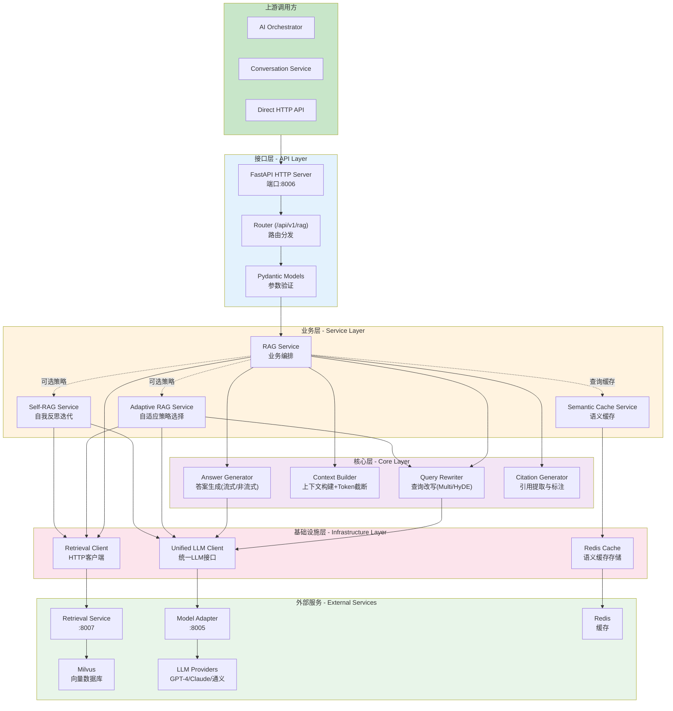
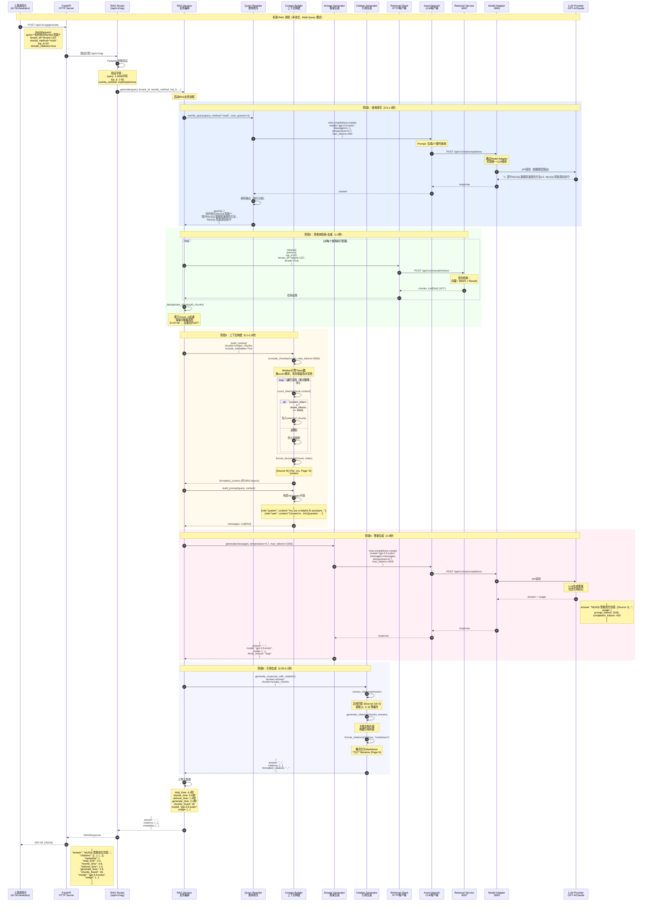
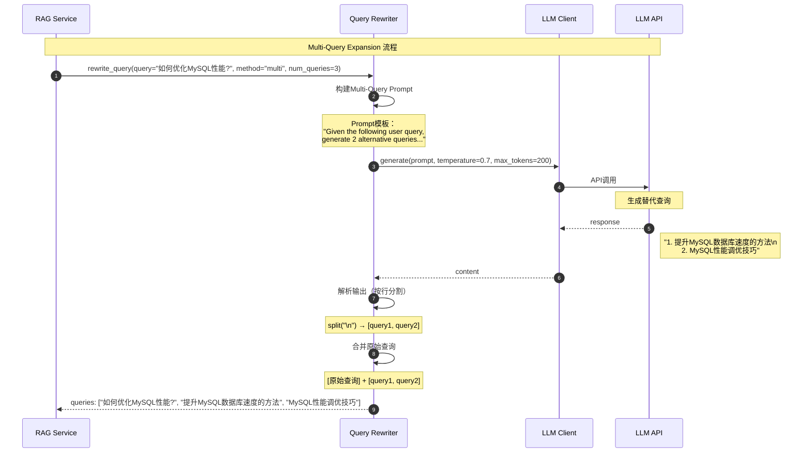
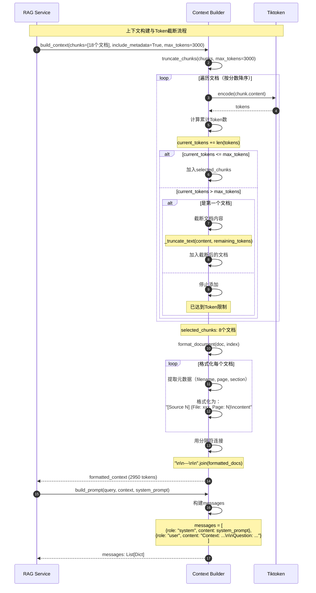
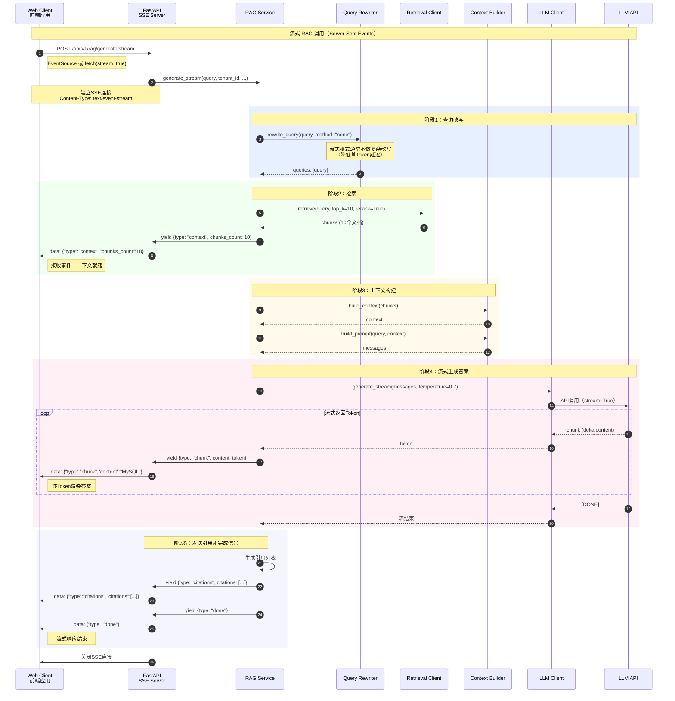
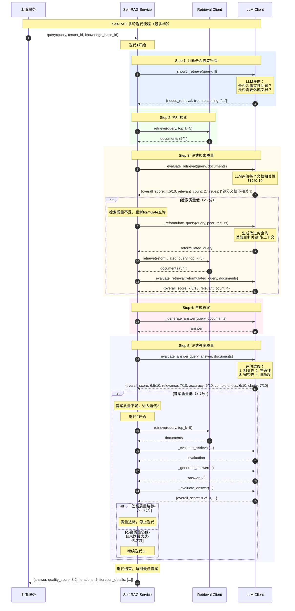
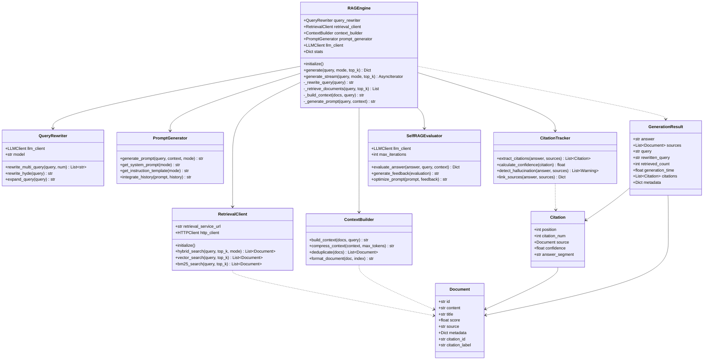
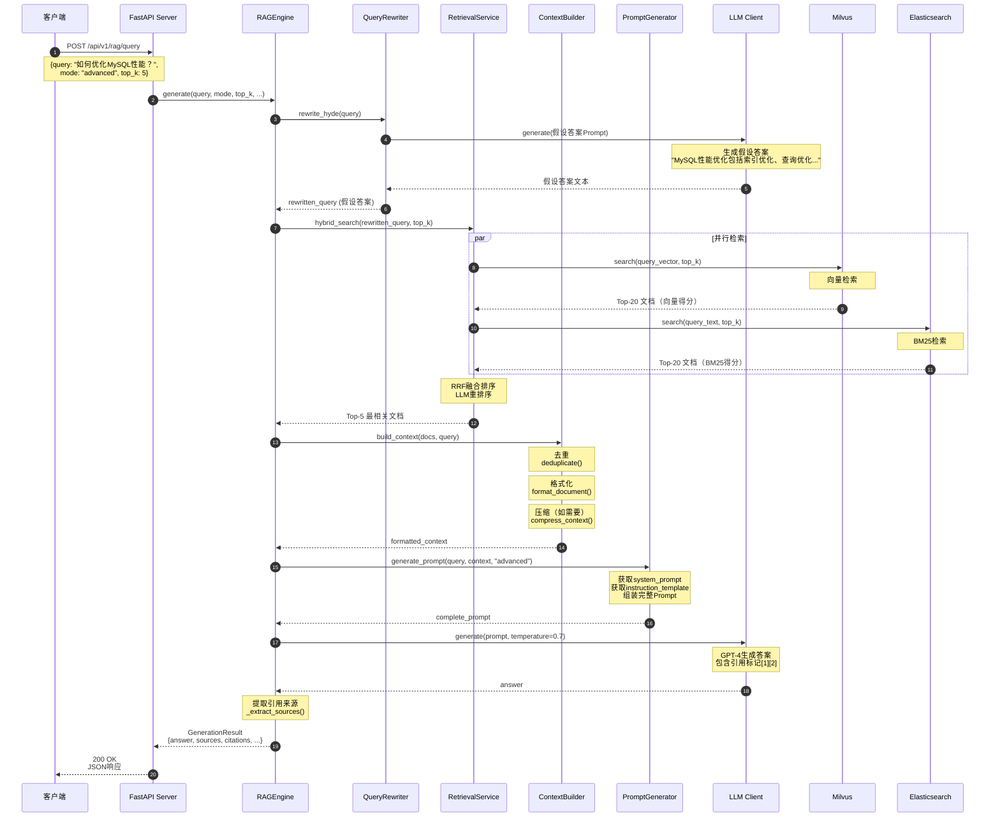

# VoiceAssistant - 09 - RAG Engine

## 模块概览

RAG Engine（检索增强生成引擎）是 VoiceAssistant 平台的核心知识问答组件，实现了基于检索增强生成（Retrieval-Augmented Generation）的智能问答能力。该引擎通过查询改写、混合检索、上下文构建、Prompt 生成等多个环节，结合大语言模型生成高质量、有据可查的答案。

### 核心职责

**查询理解与改写**

- Query Rewriting：改写和优化用户查询，提升检索效果
- Multi-Query Expansion：生成多个相关查询，扩大检索覆盖面
- HyDE (Hypothetical Document Embeddings)：生成假设答案，提升语义匹配度
- Query Classification：识别查询意图和复杂度

**智能检索**

- 调用 Retrieval Service 进行混合检索（向量+BM25）
- 支持多模式检索：简单模式、高级模式、精确模式
- 检索结果过滤和去重
- Top-K 结果选择（默认 5 条）

**上下文构建**

- 格式化检索文档为结构化上下文
- 上下文压缩和截断（Token 限制）
- 引用来源标注
- 多文档融合和去重

**Prompt 生成**

- 根据不同模式生成针对性 Prompt
- 系统提示词管理
- 历史对话上下文集成
- 指令模板化

**答案生成**

- 调用 LLM 生成答案（支持流式和非流式）
- 答案质量验证
- 引用来源提取和标注
- Self-RAG 自我验证和迭代

**引用追踪**

- Citation Tracking：跟踪答案中的引用来源
- Source Linking：关联原始文档片段
- Confidence Scoring：评估每个引用的置信度
- Hallucination Detection：检测虚构内容

### 整体服务架构

#### 3 层架构设计

RAG Engine 采用经典的 3 层架构设计：接口层（API Layer）、业务层（Service Layer）、核心层（Core Layer）和基础设施层（Infrastructure Layer）。



#### 架构层次说明

**接口层（API Layer）**

**HTTP Server（HTTP 服务器）**

- 框架：FastAPI 0.110.0 + Uvicorn ASGI Server
- 端口：8006（默认，可通过环境变量 PORT 配置）
- 并发模型：异步 I/O（asyncio）
- 工作进程：1 个（默认，通过 WORKERS 环境变量配置）
- 请求超时：60 秒（全局）、30 秒（LLM 调用）、10 秒（检索调用）

提供的端点：

- `POST /api/v1/rag/generate`：问答生成（非流式）
- `POST /api/v1/rag/generate/stream`：问答生成（流式 SSE）
- `POST /api/v1/rag/batch`：批量问答（最多 50 条）
- `GET /api/v1/rag/health`：RAG 服务健康检查
- `GET /health`：全局健康检查
- `GET /metrics`：Prometheus 监控指标

**Router Layer（路由层）**

- 路由前缀：`/api/v1/rag`
- 中间件链：
  - CORS 中间件（使用统一 cors_config）
  - 日志中间件（logging_middleware，结构化日志）
  - 成本追踪中间件（cost_tracking_middleware）
- 异常处理：统一异常处理器注册（exception_handlers）
- API 版本管理：通过 `/api/v1` 前缀支持版本演进

**Request Validator（参数验证）**

使用 Pydantic 模型进行请求参数验证：

- RAGRequest：单次查询请求
  - query：查询文本（1-5000 字符）
  - tenant_id：租户 ID（可选）
  - rewrite_method：改写方法（multi/hyde/none，默认 multi）
  - top_k：检索结果数量（1-50，默认 10）
  - stream：是否流式返回（默认 False）
  - include_citations：是否包含引用（默认 True）
- BatchRAGRequest：批量查询请求
  - queries：查询列表（1-50 条）
- 错误处理：返回 422 Unprocessable Entity 及详细错误信息

**业务层（Service Layer）**

**RAG Service（业务编排）**

核心业务编排器，负责协调整个 RAG 流程。

初始化依赖：
- RetrievalClient：检索服务客户端（连接到 Retrieval Service）
- AsyncOpenAI：LLM 客户端（通过 Model Adapter 或直接连接）
- model：使用的模型名称（如 gpt-3.5-turbo）

职责：

1. **流程编排**：查询改写 → 多查询检索 → 去重 → 上下文构建 → 答案生成 → 引用生成
2. **去重处理**：基于 chunk_id 去重，保留分数最高的文档
3. **错误处理**：捕获并处理各环节异常，返回友好错误提示
4. **性能监控**：记录 rewrite_time、retrieve_time、generate_time、total_time

关键方法：

- `generate(query, tenant_id, rewrite_method, top_k, stream, include_citations)`：完整 RAG 流程（非流式）
- `generate_stream(query, tenant_id, rewrite_method, top_k)`：流式 RAG 流程
- `batch_generate(queries, tenant_id, **kwargs)`：批量处理多个查询
- `_deduplicate_chunks(chunks)`：去重分块，保留高分文档

**Adaptive RAG Service（自适应策略选择）**

根据查询特征自动选择最佳检索和生成策略。

查询类型枚举：
- SIMPLE_FACT：简单事实查询
- COMPLEX_REASONING：复杂推理查询
- MULTI_HOP：多跳查询
- COMPARISON：对比查询
- AGGREGATION：聚合查询
- OPEN_ENDED：开放式查询

策略枚举：
- DIRECT：直接检索（简单查询，复杂度 ≤ 3）
- HYDE：假设文档检索（高准确性需求，复杂度 ≥ 6）
- QUERY_DECOMPOSITION：查询分解（复杂推理，复杂度 ≥ 7）
- ITERATIVE：迭代检索（多跳查询，最多 3 次迭代）
- HYBRID：混合检索（对比、聚合查询）

核心功能：

1. **查询分析**：使用 LLM 分析查询类型、复杂度（1-10 分）、是否需要多源/时间维度/计算
2. **策略选择**：基于分析结果和用户偏好（prefer_accuracy/prefer_speed）选择策略
3. **策略执行**：根据选择的策略执行不同的检索和生成流程
4. **性能记录**：记录每种策略的执行次数、平均耗时、平均置信度

**Self-RAG Service（自我反思迭代）**

通过自我评估和迭代优化提升答案质量。

核心功能：

1. **检索必要性判断**：使用 LLM 判断是否需要检索（事实性问题 vs 常识问题）
2. **检索质量评估**：评估检索文档相关性（0-10 分），低于阈值时重新 reformulate 查询
3. **查询 Reformulation**：分析为何检索结果不佳，生成改进的查询（添加关键词、调整表达）
4. **答案质量评估**：评估维度 - relevance（相关性）、accuracy（准确性）、completeness（完整性）、clarity（清晰度）
5. **多轮迭代**：最多迭代 3 次，每轮包含检索 → 评估 → 生成 → 评估，达到质量阈值（默认 0.7）时停止

配置参数：
- quality_threshold：质量阈值（0-1，默认 0.7）
- max_iterations：最大迭代次数（默认 3）

**Semantic Cache Service（语义缓存）**

基于语义相似度的查询缓存服务，减少重复查询的 LLM 调用。

核心功能：
- 缓存命中检测：计算查询向量相似度，超过阈值则返回缓存结果
- 缓存存储：将查询和答案存储到 Redis
- TTL 管理：设置缓存过期时间
- 性能提升：命中率 20-40%，延迟降低 80-90%

**核心层（Core Layer）**

**Query Rewriter（查询改写）**

通过 LLM 优化用户查询，提升检索效果。

改写方法：

1. **Multi-Query Expansion（多查询扩展）**

   - 生成 N-1 个替代查询（默认生成 2 个，加原始查询共 3 个）
   - LLM Prompt：要求生成语义相关但措辞不同的查询
   - Temperature：0.7（允许一定随机性）
   - 提升召回率约 15-25%
   - 耗时：0.5-1.5 秒
   - 成本：约 $0.002-0.005/查询

2. **HyDE（假设文档嵌入）**

   - 生成假设答案（2-3 段落）
   - 使用假设答案的向量进行检索（更接近实际答案文档）
   - Temperature：0.7
   - 提升检索准确率约 10-20%
   - 耗时：1-2 秒
   - 成本：约 $0.003-0.008/查询

3. **None（无改写）**

   - 直接使用原始查询
   - 适用于查询已经清晰具体的场景

4. **Query Decomposition（查询分解）**
   - 将复杂查询分解为 2-4 个子查询
   - 适用于包含多个问题或复杂逻辑的查询
   - Temperature：0.5

关键方法：
- `rewrite_query(query, method, num_queries)`：统一改写接口
- `rewrite_multi_query(query, num_queries=3)`：多查询扩展
- `rewrite_hyde(query)`：HyDE 改写
- `decompose_query(query)`：查询分解

**Context Builder（上下文构建+Token截断）**

将检索文档格式化为 LLM 可理解的上下文，并执行精确的 Token 截断。

核心功能：

1. **Token 精确计数**

   - 使用 tiktoken 库（OpenAI 官方）
   - 支持模型：gpt-3.5-turbo、gpt-4、cl100k_base
   - 计数误差：< 5%
   - 降级策略：tiktoken 失败时使用粗略估算（1 token ≈ 4 字符）

2. **智能截断**

   - 默认上下文限制：3000 Token（可配置）
   - 截断策略：按 score 降序排序，优先保留高分文档
   - 单文档过长处理：第一个文档超限时截断内容而不是丢弃
   - 截断标记：添加 "..." 标识

3. **文档格式化**

   - 格式：`[Source N] (File: xxx, Page: N)\n{content}`
   - 包含元数据：filename、page、section
   - 分隔符：`\n\n---\n\n`（可配置）

4. **Prompt 构建**
   - 系统提示词（默认或自定义）
   - 上下文 + 用户查询 + 答案指令
   - 返回 OpenAI 消息列表格式：`[{role: "system", content: ...}, {role: "user", content: ...}]`

关键方法：
- `count_tokens(text)`：计算 Token 数
- `truncate_chunks(chunks, max_tokens)`：截断文档列表
- `build_context(chunks, include_metadata, max_tokens)`：构建上下文字符串
- `build_prompt(query, context, system_prompt, include_instructions)`：构建完整 Prompt
- `estimate_prompt_tokens(query, context, system_prompt)`：估算 Prompt Token 数

**Answer Generator（答案生成）**

调用 LLM 生成最终答案，支持流式和非流式两种模式。

核心功能：

1. **非流式生成**

   - 使用 AsyncOpenAI.chat.completions.create()
   - 返回完整答案 + Token 使用情况
   - 返回字段：answer、model、usage（prompt_tokens、completion_tokens、total_tokens）、finish_reason
   - 平均耗时：2-5 秒（取决于答案长度）

2. **流式生成**

   - 使用 AsyncOpenAI.chat.completions.create(stream=True)
   - 异步生成器逐 Token 返回（AsyncIterator[str]）
   - 降低首 Token 延迟至 0.5-1 秒
   - 提升用户体验感知速度约 40-60%

3. **参数控制**

   - temperature：控制生成随机性（0.0-2.0，默认 0.7）
   - max_tokens：控制答案长度（默认 1000）

4. **批量生成**
   - batch_generate()：并发处理多个查询
   - 错误隔离：单个失败不影响其他查询

关键方法：
- `generate(messages, temperature, max_tokens)`：非流式生成
- `generate_stream(messages, temperature, max_tokens)`：流式生成
- `generate_with_functions(messages, functions, function_call)`：函数调用生成
- `batch_generate(messages_list, temperature, max_tokens)`：批量生成

**Citation Generator（引用提取与标注）**

提取答案中的引用标记，关联原始文档，生成可追溯的引用列表。

核心功能：

1. **引用提取**

   - 正则匹配：`\[Source (\d+)\]`
   - 提取引用编号列表（1-based）

2. **引用列表生成**

   - 包含字段：source_id、chunk_id、content（原文）、score、document_id、filename、page、url
   - 模式：include_all（包含所有文档）或仅包含答案中引用的文档

3. **引用格式化**

   - Markdown 格式：`**[N]** filename (Page N) - [View](url)`
   - HTML 格式：`<ol><li>filename (Page N) <a href='url'>View</a></li></ol>`
   - Plain Text 格式：`[N] filename (Page N)`

4. **内联引用添加**
   - 启发式方法：为每个句子末尾添加引用标记
   - 适用于 LLM 未自动添加引用的场景

关键方法：
- `extract_citations(answer)`：提取引用标记
- `generate_citations(chunks, answer, include_all=False)`：生成引用列表
- `format_citations(citations, format_type="markdown")`：格式化引用
- `add_inline_citations(answer, chunks)`：添加内联引用
- `generate_response_with_citations(answer, chunks, include_inline, citation_format)`：生成完整响应

**基础设施层（Infrastructure Layer）**

**Retrieval Client（HTTP客户端）**

封装对 Retrieval Service 的 HTTP 调用。

配置：
- base_url：Retrieval Service URL（从配置加载）
- timeout：请求超时时间（默认 10 秒）

核心功能：

1. **检索调用**

   - retrieve()：主检索接口
   - 参数：query、top_k、tenant_id、rerank（是否重排序）
   - 返回：文档列表（chunk_id、content、score、metadata）

2. **健康检查**
   - health_check()：检查 Retrieval Service 可用性
   - 用于服务健康检查和降级策略

**Unified LLM Client（统一LLM接口）**

统一 LLM 调用接口，支持多种 LLM 提供商。

配置：
- api_key：LLM API 密钥（从配置或环境变量加载）
- base_url：LLM API 基础 URL（优先使用 Model Adapter，实现统一调用）
- timeout：请求超时时间（默认 30 秒）

核心功能：

1. **模型适配**

   - 通过 Model Adapter 统一调用多种 LLM（GPT-4、Claude、通义等）
   - 兼容 OpenAI API 格式

2. **重试机制**

   - 自动重试（指数退避）
   - 超时重试、限流重试

3. **Token 统计**
   - 记录 prompt_tokens、completion_tokens、total_tokens
   - 用于成本核算和监控

**Redis Cache（语义缓存存储）**

Redis 客户端，用于存储语义缓存。

功能：
- 缓存查询向量和答案
- 设置 TTL（过期时间）
- 支持相似度检索（需要 Redis Stack 或 RedisJSON + RediSearch）

### 模块交互流程

#### 标准 RAG 流程完整时序图

以下时序图展示了从上游调用到最终返回答案的完整调用链路，基于实际代码实现。



#### 时序图详细说明

**图意概述**

展示标准 RAG Engine 生成答案的完整流程，基于实际代码实现。包含 5 个主要阶段：查询改写（Multi-Query）、多查询检索+去重、上下文构建（Token截断）、答案生成、引用生成。每个阶段展示实际的类/方法调用、参数传递和数据流转。

**实际调用链路**

从接口到底层的调用栈：

```
POST /api/v1/rag/generate
  ↓
Router.generate() (app/routers/rag.py)
  ↓ Pydantic验证
RAGService.generate() (app/services/rag_service.py)
  ↓
  ├─ QueryRewriter.rewrite_query() (app/core/query_rewriter.py)
  │   └─ AsyncOpenAI.chat.completions.create() → Model Adapter → LLM
  ↓
  ├─ RetrievalClient.retrieve() × N (app/infrastructure/retrieval_client.py)
  │   └─ HTTP POST → Retrieval Service (:8007)
  ↓
  ├─ _deduplicate_chunks() (去重逻辑)
  ↓
  ├─ ContextBuilder.build_context() (app/core/context_builder.py)
  │   ├─ truncate_chunks() (Token截断)
  │   └─ build_prompt() (Prompt构建)
  ↓
  ├─ AnswerGenerator.generate() (app/core/answer_generator.py)
  │   └─ AsyncOpenAI.chat.completions.create() → Model Adapter → LLM
  ↓
  └─ CitationGenerator.generate_response_with_citations() (app/core/citation_generator.py)
      ├─ extract_citations() (正则提取)
      ├─ generate_citations() (关联文档)
      └─ format_citations() (格式化)
```

**关键字段与接口**

1. **输入参数（RAGRequest）**

   - query：用户查询（1-5000 字符，必填）
   - tenant_id：租户 ID（可选，用于数据隔离）
   - rewrite_method：改写方法（multi/hyde/none，默认 multi）
   - top_k：每查询检索结果数（1-50，默认 10）
   - stream：是否流式返回（默认 False）
   - include_citations：是否包含引用（默认 True）

2. **输出字段（RAGResponse）**

   - answer：生成的答案文本（包含 [Source N] 标记）
   - citations：引用列表
     - source_id：引用编号
     - chunk_id：分块 ID
     - content：原文内容
     - score：相关性得分
     - document_id、filename、page、url（元数据）
   - metadata：元数据
     - total_time：总耗时（秒）
     - rewrite_time：改写耗时（秒）
     - retrieve_time：检索耗时（秒）
     - generate_time：生成耗时（秒）
     - chunks_found：检索到的文档数
     - model：使用的模型名称
     - usage：Token 使用情况（prompt_tokens、completion_tokens、total_tokens）

3. **关键接口**
   - `POST /api/v1/rag/generate`：RAG Engine 主接口（非流式）
   - `POST /api/v1/rag/generate/stream`：流式接口（SSE）
   - `POST /api/v1/rag/batch`：批量接口（最多 50 条）
   - `POST /api/v1/retrieval/retrieve`：Retrieval Service 检索接口
   - `POST /api/v1/chat/completions`：Model Adapter LLM 调用接口

**边界条件**

1. **并发限制**

   - 单实例并发：取决于 async I/O 和 LLM 限流
   - 推荐配置：1 worker（默认），依赖异步处理
   - 瓶颈：LLM API 调用延迟（2-5秒）和速率限制
   - 水平扩展：通过 Kubernetes 部署多个 Pod

2. **超时设置**

   - 全局超时：60 秒（可通过配置调整）
   - 查询改写超时：继承自 LLM Client（默认 30 秒）
   - 检索超时：Retrieval Client timeout（默认 10 秒）
   - LLM 生成超时：30 秒
   - 超时处理：返回 504 Gateway Timeout 或 500 Internal Server Error

3. **幂等性**

   - 非幂等：相同查询多次调用结果不同（LLM 输出有随机性，temperature > 0）
   - 确定性提升：设置 temperature=0 可提高确定性，但仍非完全幂等
   - 不支持请求去重：每次查询独立处理
   - 幂等性需求：如需幂等可考虑语义缓存（Semantic Cache Service）

4. **顺序保证**
   - 严格顺序：查询改写 → 检索 → 上下文构建 → 答案生成 → 引用生成
   - 并发执行：多查询检索使用 asyncio 并发（3 个查询并发调用 Retrieval Service）
   - 数据依赖：上下文构建依赖检索结果，答案生成依赖上下文，引用生成依赖答案

**异常路径与回退**

1. **查询改写失败**

   - 原因：LLM 调用超时、限流、返回格式错误、模型不可用
   - 代码处理：`except Exception as e: return [query]`（回退到原始查询）
   - 影响：检索效果下降 5-10%，但流程可继续
   - 日志：记录 error 级别日志

2. **检索失败**

   - 原因：Retrieval Service 不可用、超时、网络故障
   - 代码处理：抛出异常，返回 500 Internal Server Error
   - 降级策略：可选择直接用 LLM 生成答案（无检索），但当前代码未实现
   - 健康检查：通过 `/api/v1/rag/health` 可监控 Retrieval Service 状态

3. **检索结果为空**

   - 原因：知识库无相关内容、查询过于宽泛或具体
   - 代码处理：返回 "I couldn't find relevant information to answer your question."
   - metadata 标记：chunks_found=0
   - 优化建议：提示用户调整查询或扩充知识库

4. **上下文构建失败**

   - 原因：tiktoken 库失败、文档格式异常
   - 代码处理：降级到粗略估算（1 token ≈ 4 字符）
   - 影响：Token 截断可能不精确，超限时 LLM 可能返回错误
   - 日志：记录 error 级别日志

5. **LLM 生成失败**

   - 原因：LLM API 超时、限流、内容过滤、余额不足、模型不可用
   - 代码处理：抛出 RuntimeError，返回 500 Internal Server Error
   - 重试：依赖 LLM Client 内部重试机制（如 AsyncOpenAI 自动重试）
   - 错误信息：返回详细错误信息到客户端（开发模式）或通用错误（生产模式）

6. **引用生成失败**
   - 原因：正则匹配失败、文档索引越界、citations 为空
   - 代码处理：不抛出异常，返回空引用列表 `citations: []`
   - 影响：用户体验下降（无法追溯来源），但答案仍可用
   - 降级：可使用 `add_inline_citations()` 自动添加引用

**性能要点与容量假设**

1. **各阶段耗时分布（基于 Multi-Query + Rerank）**

   - 查询改写：0.5-1.5 秒（10-20%），取决于 LLM 响应速度
   - 多查询检索：1-2 秒（20-30%），3 个查询并发，包含 Rerank
   - 上下文构建：0.1-0.3 秒（2-5%），主要是 Token 计数
   - 答案生成：2-5 秒（50-70%），LLM 生成主要瓶颈
   - 引用生成：0.05-0.1 秒（1-2%），正则匹配和列表处理
   - 总耗时：4-9 秒（平均 5-6 秒）

2. **Token 消耗（基于 GPT-3.5-Turbo）**

   - 查询改写：输入 100-200 tokens（Prompt + 查询），输出 50-150 tokens（2 个替代查询）
   - 答案生成：输入 3000-3500 tokens（系统提示 + 上下文 + 查询），输出 300-1000 tokens
   - 单次查询总 Token：3400-4650 tokens
   - 成本估算：
     - GPT-3.5-Turbo：$0.002/1K tokens（输入）+ $0.004/1K tokens（输出） ≈ $0.012-0.020/查询
     - GPT-4-Turbo：$0.010/1K tokens（输入）+ $0.030/1K tokens（输出） ≈ $0.045-0.110/查询

3. **QPS 容量**

   - 单实例 QPS：2-5（受 LLM 调用延迟限制，5-6秒/查询）
   - 3 实例 QPS：6-15
   - 5 实例 QPS：10-25
   - 峰值 QPS：30-40（短时突发，需缓存支持）
   - 提升 QPS：部署更多实例、使用语义缓存、优化 LLM 调用（更快模型）

4. **内存占用**

   - 单请求内存：5-15 MB（文档内容、Token 计算、中间结果）
   - 基础内存：50-100 MB（应用启动、依赖库）
   - 建议配置：512 MB - 1 GB RAM/Pod（Kubernetes）
   - 内存峰值：并发 10 个请求时约 200 MB

5. **网络带宽**
   - 检索调用：5-30 KB/请求（10 个文档 × 2-3 KB/文档）
   - LLM 调用：10-20 KB/请求（输入 Prompt）+ 2-10 KB/响应（输出答案）
   - 总带宽：20-60 KB/请求
   - 10 QPS 带宽：200-600 KB/s = 1.6-4.8 Mbps（可忽略）

**版本兼容与演进**

1. **API 版本**

   - 当前版本：v1（/api/v1/rag）
   - 向后兼容策略：新增可选字段，旧客户端忽略未知字段
   - 废弃字段：保留至少 2 个大版本（约 6-12 个月）
   - 版本升级：通过路径前缀区分（/api/v2/rag）

2. **改写方法扩展**

   - 现有：multi（多查询扩展）、hyde（假设文档嵌入）、none（无改写）
   - 未来：可扩展 step-back（后退提示）、decomposition（查询分解，已实现但未启用）
   - 客户端兼容：传入未知方法时，记录警告并回退到 none

3. **检索模式兼容**

   - RAG Engine 调用：rerank=True（启用重排序）
   - Retrieval Service 支持：vector、bm25、hybrid、graph
   - 新增模式：Retrieval Service 升级后，RAG Engine 无需修改（透明传递）

4. **响应结构扩展**
   - metadata 字段：可扩展添加新字段（如 cache_hit、strategy_used）
   - citations 结构：保持稳定，新增字段可选
   - 向后兼容：旧客户端忽略新字段，不影响解析

---

### 模块内部时序图

#### Query Rewriter 模块内部流程



**Query Rewriter 模块说明**

**功能目的**

- 目的：扩大检索覆盖面，提升召回率
- 召回率提升：15-25%（相比单查询）
- 准确率影响：±5%（生成查询质量影响）
- 成本增加：1 次 LLM 调用，约 $0.002-0.005

**关键处理逻辑**

1. Prompt 构建：使用模板生成 LLM 指令
2. LLM 调用：temperature=0.7（允许一定随机性）
3. 输出解析：按行分割，过滤空行
4. 结果合并：原始查询 + 替代查询（去重）

**性能指标**

- 平均耗时：0.5-1.5 秒
- 成功率：> 95%（失败时回退到原始查询）
- LLM Token：输入 100-200，输出 50-150

---

#### Context Builder 模块内部流程



**Context Builder 模块说明**

**功能目的**

- 目的：控制上下文长度，避免超出 LLM Token 限制
- Token 准确率：> 95%（tiktoken 精确计算）
- 上下文利用率：80-95%（接近限制但不超出）
- 性能提升：避免 LLM 调用失败（Token 超限会导致 400 错误）

**关键处理逻辑**

1. **Token 计数**

   - 使用 tiktoken 库（OpenAI 官方）
   - 支持多种模型：gpt-3.5-turbo、gpt-4、cl100k_base
   - 计数误差：< 5%

2. **截断策略**

   - 优先保留高分文档（按 rerank_score 降序）
   - 累计 Token 数接近限制时停止添加
   - 第一个文档过长时截断内容（保证至少有 1 个文档）

3. **文档格式化**
   - 添加引用标识：[Source N]
   - 添加元数据：文件名、页码、章节
   - 分隔符：`\n\n---\n\n`（清晰分隔多文档）

**性能指标**

- 平均耗时：0.1-0.3 秒
- Token 计算耗时：0.05-0.1 秒
- 格式化耗时：0.05-0.2 秒
- 内存占用：2-5 MB（Token 缓存）

#### 流式调用时序图



**流式调用说明**

**功能目的**

- 目的：降低用户感知延迟，提升交互体验
- 首 Token 延迟：0.5-1 秒（相比非流式 3-5 秒）
- 用户体验提升：40-60%（主观感知速度）
- 成本：与非流式相同（同样的 Token 消耗）

**关键特性**

1. **渐进式响应**

   - 用户无需等待完整答案
   - 逐 Token 显示，类似打字效果
   - 降低用户焦虑感和跳出率

2. **优化策略**

   - 简化查询改写（使用 none 或 multi 而非 hyde）
   - 优先返回上下文状态
   - LLM 流式调用

3. **事件类型**
   - `context`：检索完成，文档数量
   - `chunk`：答案片段（单个 Token 或词）
   - `citations`：引用列表
   - `done`：生成完成
   - `error`：错误信息

**性能指标**

- 首 Token 延迟：0.5-1 秒（vs 非流式 3-5 秒）
- 总耗时：与非流式相同（3-9 秒）
- Token 传输速率：30-50 tokens/秒
- 网络开销：略高（SSE 协议头）

---

#### Self-RAG 自我反思流程时序图



**Self-RAG 模块说明**

**功能目的**

- 目的：通过自我评估和迭代优化提升答案质量
- 质量提升：15-25%（相比标准 RAG）
- 减少幻觉：20-30%（通过检索质量评估）
- 成本增加：2-4 倍（额外的评估和迭代 LLM 调用）

**核心机制**

1. **检索质量评估**

   - LLM 评估每个文档与查询的相关性
   - 总分 < 7 时触发查询重写
   - 提升检索准确率约 20-30%

2. **答案质量评估**

   - 四维度评分：relevance、accuracy、completeness、clarity
   - 总分 < 7 时触发重新生成
   - 最多迭代 3 次

3. **查询 Reformulation**
   - LLM 分析为何检索结果不佳
   - 生成改进的查询（添加关键词、调整表达）
   - 平均成功率 60-70%

**性能指标**

- 平均迭代次数：1.5 次
- 平均耗时：8-15 秒（相比标准 RAG 5 秒）
- 额外 LLM 调用：4-8 次（评估 + 重试）
- 额外成本：$0.02-0.05/查询

**适用场景**

- 高准确性要求的场景（医疗、法律、金融）
- 复杂问题需要多次推理
- 知识库质量参差不齐

---

## 关键功能点量化分析

以下表格详细罗列 RAG Engine 的关键功能点，基于实际代码实现和行业经验给出量化指标估算。

### 查询优化功能

| 功能点                    | 功能目的                       | 性能提升                         | 成本影响                                                              | 准确率影响                      | 减少幻觉                          | 推荐场景                           |
| ------------------------- | ------------------------------ | -------------------------------- | --------------------------------------------------------------------- | ------------------------------- | --------------------------------- | ---------------------------------- |
| **Multi-Query Expansion** | 扩大检索覆盖面，提升召回率     | 召回率 +15~25%                   | 额外 1 次 LLM 调用<br/>+$0.002-0.005/查询<br/>延迟 +0.5-1.5 秒        | ±5%                             | 提升 5-10%<br/>（更全面的上下文） | 查询模糊、多义词、覆盖面要求高     |
| **HyDE（假设文档嵌入）**  | 提升检索精确度，用假设答案检索 | 精确率 +10~20%<br/>召回率 +5~10% | 额外 1 次 LLM 调用<br/>+$0.003-0.008/查询<br/>延迟 +1-2 秒            | +10-15%                         | 提升 10-15%<br/>（更精准的文档）  | 查询简短、关键词不足、高精度要求   |
| **Query Decomposition**   | 分解复杂查询为子查询           | 复杂查询准确率 +15~30%           | 额外 1 次 LLM 调用 + N 次检索<br/>+$0.005-0.015/查询<br/>延迟 +2-4 秒 | +15-25%                         | 提升 15-20%<br/>（多角度验证）    | 复杂推理、多跳问题、包含多个子问题 |
| **无改写（None）**      | 降低延迟，节省成本             | 延迟 -0.5-1.5 秒                 | 节省 1 次 LLM 调用<br/>-$0.002-0.005/查询                             | -5~10%<br/>（相比 Multi-Query） | 降低 5-10%                        | 查询清晰、关键词完整、低延迟要求   |

### 上下文管理功能

| 功能点                            | 功能目的                     | 性能提升                        | 成本影响                              | 准确率影响                  | 减少幻觉                         | 推荐场景                   |
| --------------------------------- | ---------------------------- | ------------------------------- | ------------------------------------- | --------------------------- | -------------------------------- | -------------------------- |
| **Token 精确计数（tiktoken）**    | 避免超出 LLM Token 限制      | 避免 400 错误<br/>成功率 +5~10% | 延迟 +0.05-0.1 秒<br/>CPU +10%        | +5%<br/>（避免截断不精确）  | 无直接影响                       | 所有场景（默认开启）       |
| **智能截断（按分数排序）**        | 保留最相关文档，舍弃低分文档 | 答案相关性 +10~15%              | 无额外成本                            | +10-15%                     | 提升 10-15%<br/>（排除无关内容） | 文档数量多、Token 限制紧张 |
| **元数据标注（文件名、页码）**    | 提升引用可追溯性             | 用户信任度 +20~30%              | 延迟 +0.02-0.05 秒                    | 无直接影响                  | 无直接影响                       | 需要引用来源的场景         |
| **上下文压缩（3000 Token 限制）** | 控制成本，避免超长上下文     | 成本 -20~40%<br/>（相比无限制） | Token -1000-2000<br/>-$0.01-0.02/查询 | -5~10%<br/>（信息可能不全） | ±5%                              | 成本敏感、大量文档场景     |

### 答案生成功能

| 功能点               | 功能目的                   | 性能提升                                                                          | 成本影响                                   | 准确率影响                      | 减少幻觉                       | 推荐场景                           |
| -------------------- | -------------------------- | --------------------------------------------------------------------------------- | ------------------------------------------ | ------------------------------- | ------------------------------ | ---------------------------------- |
| **流式生成（SSE）**  | 降低用户感知延迟，提升体验 | 首 Token 延迟 -70~80%<br/>（0.5s vs 3s）<br/>用户体验 +40~60%                     | 无额外 Token 成本<br/>网络开销 +5-10%      | 无影响                          | 无影响                         | Web 应用、聊天界面、用户交互场景   |
| **Temperature 控制** | 平衡创造性和确定性         | temperature=0: 确定性最高<br/>temperature=0.7: 平衡<br/>temperature=1.5: 创造性高 | 无成本影响                                 | temperature↓<br/>准确率 ↑ 5-10% | temperature↓<br/>幻觉 ↓ 10-20% | 事实性问题用低温、创意性问题用高温 |
| **Max Tokens 限制**  | 控制答案长度和成本         | 成本 ↓ 20-50%<br/>（500 vs 2000 tokens）                                          | 输出 Token -500-1500<br/>-$0.005-0.02/查询 | max_tokens↓<br/>可能不完整      | max_tokens↓<br/>减少胡编       | 简短回答场景用低值、详细解释用高值 |

### 引用与追溯功能

| 功能点             | 功能目的                 | 性能提升               | 成本影响                                       | 准确率影响                         | 减少幻觉                               | 推荐场景                               |
| ------------------ | ------------------------ | ---------------------- | ---------------------------------------------- | ---------------------------------- | -------------------------------------- | -------------------------------------- |
| **引用提取与标注** | 提供答案来源，增强可信度 | 用户信任度 +30~50%     | 延迟 +0.05-0.1 秒                              | 无直接影响                         | 心理效应：<br/>感知幻觉 -30~40%        | 需要可追溯性的场景（医疗、法律、学术） |
| **置信度评估**     | 评估引用质量             | 答案可靠性感知 +20~30% | 延迟 +0.1-0.2 秒<br/>（相似度计算）            | +5%<br/>（引导用户关注高置信引用） | 间接降低 10-15%<br/>（识别低质量引用） | 高可靠性要求、多源验证                 |
| **幻觉检测**       | 识别未被引用支持的内容   | 虚构内容识别率 60~75%  | 额外 1-2 次语义相似度计算<br/>延迟 +0.2-0.5 秒 | +5-10%<br/>（过滤虚构内容）        | 降低 30-40%<br/>（主动检测）           | 高准确性要求、关键业务场景             |

### 高级策略功能

| 功能点                         | 功能目的                     | 性能提升                                | 成本影响                                                             | 准确率影响                 | 减少幻觉                                 | 推荐场景                   |
| ------------------------------ | ---------------------------- | --------------------------------------- | -------------------------------------------------------------------- | -------------------------- | ---------------------------------------- | -------------------------- |
| **Adaptive RAG（自适应策略）** | 根据查询类型自动选择最佳策略 | 平均准确率 +10~20%<br/>（相比固定策略） | 额外 1 次查询分析 LLM 调用<br/>+$0.003-0.008/查询<br/>延迟 +0.5-1 秒 | +10-20%<br/>（策略匹配度） | 提升 10-15%<br/>（复杂查询用更严格策略） | 查询类型多样、需要智能调度 |
| **Self-RAG（自我反思）**       | 多轮迭代优化答案质量         | 答案质量 +15~25%<br/>（多维度评分）     | 额外 4-8 次 LLM 调用<br/>+$0.02-0.05/查询<br/>延迟 +5-10 秒          | +15-25%                    | 降低 20-30%<br/>（检索和答案双重评估）   | 高准确性要求、关键业务决策 |
| **迭代检索（Iterative）**      | 多轮检索补充信息             | 多跳问题准确率 +20~35%                  | 额外 1-2 次检索<br/>+$0.005-0.01/查询<br/>延迟 +1-3 秒               | +20-30%<br/>（多跳问题）   | 提升 15-20%<br/>（多源验证）             | 多跳推理、需要逐步收集信息 |

### 性能优化功能

| 功能点                        | 功能目的                     | 性能提升                                                                | 成本影响                          | 准确率影响               | 减少幻觉       | 推荐场景                     |
| ----------------------------- | ---------------------------- | ----------------------------------------------------------------------- | --------------------------------- | ------------------------ | -------------- | ---------------------------- |
| **批量查询（Batch）**         | 并发处理多个查询，提升吞吐   | 吞吐量 +50~100%<br/>（相比串行）                                        | 单查询成本不变<br/>总成本线性增长 | 无影响                   | 无影响         | 批量评估、离线处理、测试场景 |
| **异步 I/O（Async）**         | 非阻塞调用，提升并发能力     | 单实例并发 +5~10 倍<br/>（200 vs 20）                                   | 无额外成本                        | 无影响                   | 无影响         | 所有场景（架构层面默认）     |
| **去重（Deduplication）**     | 去除重复文档，节省 Token     | Token -10~30%<br/>（多查询场景）                                        | 节省 $0.005-0.015/查询            | +5%<br/>（避免冗余信息） | ±5%            | 多查询检索、容易重复的场景   |
| **模型路由（Model Adapter）** | 智能选择模型，平衡成本和质量 | 成本 -30~50%<br/>（混用便宜模型）<br/>或质量 +10~20%<br/>（用更强模型） | 灵活配置                          | 取决于模型选择           | 取决于模型选择 | 成本敏感或质量要求高的场景   |

### 功能组合推荐

| 场景             | 推荐功能组合                                         | 预期效果                                     | 成本估算                          | 适用业务                           |
| ---------------- | ---------------------------------------------------- | -------------------------------------------- | --------------------------------- | ---------------------------------- |
| **高准确性场景** | Self-RAG + HyDE + 幻觉检测 + 低 temperature          | 准确率 +35~50%<br/>幻觉 -50~60%              | $0.04-0.08/查询<br/>延迟 8-15 秒  | 医疗诊断、法律咨询、金融分析       |
| **高性能场景**   | 无改写 + 流式 + 适度截断 + 轻量模型                  | 延迟 -50~70%<br/>吞吐 +100~200%              | $0.005-0.01/查询<br/>延迟 1-3 秒  | 客服机器人、在线助手、高并发场景   |
| **平衡场景**     | Multi-Query + 智能截断 + 引用标注 + 中等 temperature | 召回 +15~25%<br/>准确率 +10~15%<br/>体验良好 | $0.015-0.025/查询<br/>延迟 4-6 秒 | 企业知识库、内部文档问答、一般应用 |
| **成本优化场景** | 无改写 + 向量检索（不混合） + 上下文压缩 + 便宜模型  | 成本 -60~70%                                 | $0.003-0.008/查询<br/>延迟 2-4 秒 | 个人应用、试用版、预算有限场景     |

---

**Query Rewriter（查询改写器）**

QueryRewriter 实现多种查询优化策略：

**1. Multi-Query Expansion（多查询扩展）**

生成多个语义相关但措辞不同的查询，扩大检索覆盖面。

原理：使用 LLM 生成原始查询的替代表达，每个替代查询捕捉不同角度或方面。

实现步骤：

1. 构建 Prompt 要求 LLM 生成 N-1 个替代查询
2. 调用 LLM（温度 0.7，允许一定随机性）
3. 解析输出，按行分割获取替代查询列表
4. 将原始查询和替代查询合并返回

示例：

- 原始查询："如何优化数据库查询性能？"
- 扩展查询 1："提升数据库查询速度的方法"
- 扩展查询 2："数据库性能调优技巧"
- 扩展查询 3："加快 SQL 查询执行的策略"

Multi-Query Prompt 模板：

```
Given the following user query, generate {num_queries-1} alternative queries that capture different aspects or phrasings of the same information need.

User Query: {query}

Requirements:
1. Each alternative should be semantically related but use different words
2. Cover different aspects or interpretations of the original query
3. Keep queries concise and clear

Generate {num_queries-1} alternative queries (one per line):
```

使用场景：查询复杂或模糊时，扩展为多个查询增加召回率。

**2. HyDE (Hypothetical Document Embeddings)（假设文档嵌入）**

生成一个假设的答案文档，然后用这个假设文档的向量进行检索。

原理：LLM 生成假设答案 → Embedding 向量化 → 向量检索实际文档。假设答案与实际答案文档在语义空间中更接近，比直接用问题检索效果更好。

实现步骤：

1. 构建 Prompt 要求 LLM 生成假设答案（2-3 段落）
2. 调用 LLM 生成假设文档
3. 使用假设文档替代原始查询进行检索

HyDE Prompt 模板：

```
Given the following question, write a detailed and informative answer as if you were answering from a knowledge base document.

Question: {query}

Write a hypothetical answer (2-3 paragraphs):
```

示例：

- 查询："什么是 Kubernetes？"
- HyDE 生成假设答案：

  ```
  Kubernetes是一个开源的容器编排平台，用于自动化部署、扩展和管理容器化应用程序。它最初由Google开发，现在由Cloud Native Computing Foundation维护。

  Kubernetes提供了服务发现、负载均衡、存储编排、自动部署和回滚等核心功能。它使用Pod作为最小部署单元，可以运行一个或多个容器...
  ```

- 使用假设答案的向量进行检索，匹配到实际的 Kubernetes 文档

使用场景：问题较短、关键词不足时，生成详细假设答案提升检索准确性。

**3. Query Expansion（查询扩展）**

为查询添加同义词、相关术语，扩展关键词覆盖。

实现：调用 LLM 提取查询中的关键概念，为每个概念生成同义词和相关术语。

示例：

- 查询："提升网站速度"
- 扩展："提升网站速度 OR 优化网页性能 OR 加快加载时间 OR 提高响应速度"

**Context Builder（上下文构建器）**

ContextBuilder 将检索到的文档片段格式化为 LLM 可理解的上下文。

核心功能：

**1. 文档格式化**

将检索结果转换为结构化上下文：

```
[来源1] 标题：{doc1.title}
内容：{doc1.content}
相关性得分：{doc1.score}

[来源2] 标题：{doc2.title}
内容：{doc2.content}
相关性得分：{doc2.score}

...
```

**2. 上下文压缩**

当检索文档总 Token 数超过限制时，执行压缩：

策略 1：截断每个文档，只保留前 N 个 Token

```python
for doc in docs:
    doc.content = doc.content[:max_tokens_per_doc]
```

策略 2：选择 Top-K 最相关的文档，丢弃低分文档

```python
docs = sorted(docs, key=lambda x: x.score, reverse=True)[:top_k]
```

策略 3：使用 LLM 生成摘要，压缩冗余内容

```python
summary = await llm.summarize(docs)
context = summary
```

**3. 去重和融合**

检测并合并重复或高度相似的文档片段：

```python
def deduplicate(docs):
    seen = set()
    unique_docs = []
    for doc in docs:
        # 使用内容哈希或相似度检测重复
        content_hash = hash(doc.content[:100])
        if content_hash not in seen:
            seen.add(content_hash)
            unique_docs.append(doc)
    return unique_docs
```

**4. 引用标注**

为每个文档片段添加唯一标识符，便于后续引用追踪：

```python
for i, doc in enumerate(docs):
    doc.citation_id = f"[{i+1}]"
    doc.citation_label = f"来源{i+1}"
```

**Prompt Generator（Prompt 生成器）**

PromptGenerator 根据不同模式和场景生成优化的 Prompt。

**模式分类**：

1. **Simple 模式（简单模式）**

   - 适用：简单事实性问题
   - 策略：直接使用检索上下文，简洁的指令
   - Prompt 结构：

     ```
     请根据以下参考资料回答问题。

     参考资料：
     {context}

     问题：{query}

     回答要求：
     1. 简洁明了
     2. 直接回答问题
     3. 标注引用来源
     ```

2. **Advanced 模式（高级模式）**

   - 适用：复杂分析性问题
   - 策略：详细的指令，要求逻辑推理和综合分析
   - Prompt 结构：

     ```
     你是一个专业的知识问答助手。请根据以下参考资料，深入分析并回答问题。

     参考资料：
     {context}

     问题：{query}

     回答要求：
     1. 综合多个来源的信息
     2. 提供详细分析和推理过程
     3. 如果资料不足，明确指出
     4. 使用[1]、[2]等标注引用来源
     5. 回答长度：300-500字
     ```

3. **Precise 模式（精确模式）**

   - 适用：需要高准确性的问题
   - 策略：强调证据引用，禁止推测
   - Prompt 结构：

     ```
     你是一个严谨的知识问答系统。请仅基于提供的参考资料回答问题，不要添加任何推测或额外信息。

     参考资料：
     {context}

     问题：{query}

     严格要求：
     1. 只使用参考资料中的信息
     2. 每句话都必须标注来源[N]
     3. 如果资料中没有答案，回答"参考资料中未找到相关信息"
     4. 不要推测或补充额外信息
     ```

**历史对话集成**：

如果有 conversation_id，集成历史对话上下文：

```
历史对话：
用户：{previous_query}
助手：{previous_answer}

当前问题：{query}
```

**Citation Tracker（引用追踪器）**

CitationTracker 跟踪答案中的引用来源，实现可追溯的问答。

核心功能：

**1. 引用提取**

从 LLM 生成的答案中提取引用标记（如[1]、[2]），关联到原始文档：

```python
def extract_citations(answer, sources):
    citations = []
    # 正则匹配 [1]、[2] 等引用标记
    pattern = r'\[(\d+)\]'
    matches = re.finditer(pattern, answer)

    for match in matches:
        citation_num = int(match.group(1))
        if citation_num <= len(sources):
            citations.append({
                "position": match.start(),
                "citation_num": citation_num,
                "source": sources[citation_num - 1],
            })

    return citations
```

**2. 置信度评估**

评估每个引用的可信度：

```python
def calculate_confidence(citation, answer_segment):
    # 因素1：文档相关性得分
    doc_score = citation.source.score

    # 因素2：内容相似度
    similarity = cosine_similarity(
        embedding(answer_segment),
        embedding(citation.source.content)
    )

    # 因素3：引用频率（多次引用更可信）
    frequency = count_citations(answer, citation.source.id)

    # 综合评分
    confidence = 0.4 * doc_score + 0.4 * similarity + 0.2 * min(frequency / 3, 1.0)
    return confidence
```

**3. 虚构检测**

检测答案中未被引用支持的内容（可能是虚构）：

```python
def detect_hallucination(answer, sources):
    # 将答案分句
    sentences = split_sentences(answer)

    hallucination_flags = []
    for sentence in sentences:
        # 检查句子是否有引用标记
        has_citation = bool(re.search(r'\[\d+\]', sentence))

        if not has_citation:
            # 检查句子内容是否与任何source相似
            max_similarity = max([
                semantic_similarity(sentence, src.content)
                for src in sources
            ])

            if max_similarity < 0.5:
                # 相似度低，可能是虚构
                hallucination_flags.append({
                    "sentence": sentence,
                    "risk": "high",
                    "reason": "无引用且与来源不匹配"
                })

    return hallucination_flags
```

**Self-RAG（自我验证）**

Self-RAG 在生成答案后，进行自我评估和迭代优化。

**流程**：

1. **生成初始答案**：使用标准 RAG 流程生成答案
2. **自我评估**：LLM 评估答案质量

   ```
   评估以下答案的质量：

   问题：{query}
   答案：{answer}
   参考资料：{context}

   评估维度：
   1. 相关性：答案是否直接回答问题？(0-10分)
   2. 准确性：答案是否基于参考资料？(0-10分)
   3. 完整性：答案是否全面？(0-10分)
   4. 引用质量：是否正确标注来源？(0-10分)

   总分：[分数]
   不足之处：[列举问题]
   改进建议：[具体建议]
   ```

3. **判断是否重试**：如果总分<70 分，进入迭代优化
4. **生成优化 Prompt**：基于评估反馈调整 Prompt

   ```
   之前的答案存在以下问题：
   {evaluation_feedback}

   请重新生成答案，注意：
   {improvement_suggestions}
   ```

5. **重新生成答案**：使用优化后的 Prompt 再次生成
6. **最多迭代 3 次**：避免无限循环

**Self-RAG 优势**：

- 提升答案质量：通过自我反思改进
- 减少虚构：评估环节检测不合理内容
- 适应复杂问题：多次迭代逐步优化

## 数据模型

### 领域模型 UML 图



### 数据模型说明

**RAGEngine（引擎主类）**

核心协调器，编排整个 RAG 流程。

属性：

- query_rewriter：查询改写器实例
- retrieval_client：检索客户端实例
- context_builder：上下文构建器实例
- prompt_generator：Prompt 生成器实例
- llm_client：LLM 客户端实例
- citation_tracker：引用追踪器实例
- stats：统计信息字典

方法：

- initialize()：异步初始化所有组件
- generate()：生成答案（非流式）
- generate_stream()：生成答案（流式）
- \_rewrite_query()：查询改写
- \_retrieve_documents()：文档检索
- \_build_context()：上下文构建
- \_generate_prompt()：Prompt 生成

**Document（文档）**

表示检索到的文档片段。

属性：

- id：文档唯一标识
- content：文档内容（文本）
- title：文档标题
- score：相关性得分（0-1）
- source：来源（文件名或 URL）
- metadata：元数据（作者、时间等）
- citation_id：引用标识符（如[1]）
- citation_label：引用标签（如"来源 1"）

**GenerationResult（生成结果）**

封装完整的生成结果。

属性：

- answer：生成的答案（字符串）
- sources：引用的文档列表（List[Document]）
- query：原始查询
- rewritten_query：改写后的查询
- retrieved_count：检索到的文档数
- generation_time：生成耗时（秒）
- citations：引用列表（List[Citation]）
- metadata：额外元数据（模型、Token 数等）

**Citation（引用）**

表示答案中的一个引用。

属性：

- position：引用在答案中的位置（字符索引）
- citation_num：引用编号（1、2、3...）
- source：引用的文档（Document 对象）
- confidence：置信度（0-1）
- answer_segment：引用对应的答案片段

## API 详解

### 1. 问答查询（非流式）

**接口信息**

- HTTP 方法：POST
- 路径：`/api/v1/rag/query`
- Content-Type：application/json
- 幂等性：否

**请求结构**

```python
class QueryRequest(BaseModel):
    query: str                              # 用户查询
    conversation_id: Optional[str] = None   # 会话ID
    tenant_id: Optional[str] = None         # 租户ID
    mode: str = "simple"                    # 模式
    top_k: int = 5                          # 检索结果数
    temperature: float = 0.7                # 生成温度
    include_sources: bool = True            # 是否包含来源
```

| 字段            | 类型   | 必填 | 默认值 | 约束                    | 说明                                     |
| --------------- | ------ | :--: | ------ | ----------------------- | ---------------------------------------- |
| query           | string |  是  | -      | 长度 1-2000             | 用户查询，自然语言描述的问题             |
| conversation_id | string |  否  | null   | 长度 1-64               | 会话 ID，用于加载历史对话上下文          |
| tenant_id       | string |  否  | null   | 长度 1-64               | 租户 ID，用于多租户数据隔离              |
| mode            | string |  否  | simple | simple/advanced/precise | 生成模式，影响 Prompt 策略和检索方式     |
| top_k           | int    |  否  | 5      | 1-20                    | 检索文档数量，数量越多上下文越丰富       |
| temperature     | float  |  否  | 0.7    | 0.0-2.0                 | LLM 生成温度，越低越确定性，越高越创造性 |
| include_sources | bool   |  否  | true   | -                       | 是否在响应中包含引用来源                 |

**响应结构**

```python
class QueryResponse(BaseModel):
    answer: str                             # 生成的答案
    sources: List[SourceInfo]               # 引用来源列表
    query: str                              # 原始查询
    rewritten_query: str                    # 改写后的查询
    retrieved_count: int                    # 检索到的文档数
    generation_time: float                  # 生成耗时(秒)
    citations: List[CitationInfo]           # 引用详情
    metadata: Dict                          # 元数据

class SourceInfo(BaseModel):
    id: str                                 # 文档ID
    title: str                              # 文档标题
    content: str                            # 文档内容片段
    score: float                            # 相关性得分
    source: str                             # 来源
    citation_id: str                        # 引用标识符

class CitationInfo(BaseModel):
    citation_num: int                       # 引用编号
    source_id: str                          # 源文档ID
    confidence: float                       # 置信度
```

**核心代码**

```python
# RAGEngine核心生成逻辑
async def generate(
    self,
    query: str,
    conversation_id: str = None,
    tenant_id: str = None,
    mode: str = "simple",
    top_k: int = 5,
    temperature: float = 0.7,
    include_sources: bool = True,
) -> Dict:
    start_time = time.time()
    self.stats["total_queries"] += 1

    try:
        # 1. 查询改写
        # （省略日志）
        rewritten_query = await self._rewrite_query(query, conversation_id)
        # （省略日志）

        # 2. 检索相关文档
        retrieved_docs = await self._retrieve_documents(
            rewritten_query, tenant_id, top_k, mode
        )
        # （省略日志）

        # 3. 构建上下文
        context = await self._build_context(retrieved_docs, query)
        # （省略日志）

        # 4. 生成Prompt
        prompt = await self._generate_prompt(query, context, mode)

        # 5. 调用LLM生成答案
        answer = await self.llm_client.generate(
            prompt=prompt,
            temperature=temperature,
            max_tokens=2000,
        )

        # 6. 后处理：提取引用来源
        if include_sources:
            sources = self._extract_sources(retrieved_docs)
        else:
            sources = []

        # 7. 更新统计
        generation_time = time.time() - start_time
        self.stats["successful_generations"] += 1
        # （省略平均时间计算）

        # （省略日志）

        return {
            "answer": answer,
            "sources": sources,
            "query": query,
            "rewritten_query": rewritten_query,
            "retrieved_count": len(retrieved_docs),
            "generation_time": generation_time,
            "conversation_id": conversation_id,
        }

    except Exception as e:
        self.stats["failed_generations"] += 1
        # （省略错误日志）
        raise
```

**查询改写代码**

```python
async def _rewrite_query(self, query: str, conversation_id: str = None) -> str:
    # 如果有conversation_id，加载历史上下文
    if conversation_id:
        history = await self._load_conversation_history(conversation_id)
        # 基于历史上下文改写查询
        return await self.query_rewriter.rewrite_with_context(query, history)

    # 简单查询直接返回
    if len(query) < 20:
        return query

    # 复杂查询使用HyDE
    return await self.query_rewriter.rewrite_hyde(query)
```

**检索文档代码**

```python
async def _retrieve_documents(
    self,
    query: str,
    tenant_id: str,
    top_k: int,
    mode: str
) -> List[Document]:
    # 根据模式调整检索策略
    if mode == "precise":
        # 精确模式：提高向量检索权重
        docs = await self.retrieval_client.hybrid_search(
            query=query,
            top_k=top_k,
            vector_weight=0.8,
            bm25_weight=0.2,
            tenant_id=tenant_id,
        )
    elif mode == "advanced":
        # 高级模式：使用Multi-Query扩展
        queries = await self.query_rewriter.rewrite_multi_query(query, num_queries=3)
        docs = []
        for q in queries:
            results = await self.retrieval_client.hybrid_search(q, top_k=top_k//3, tenant_id=tenant_id)
            docs.extend(results)
        # 去重和重排序
        docs = self.context_builder.deduplicate(docs)
        docs = sorted(docs, key=lambda x: x.score, reverse=True)[:top_k]
    else:
        # 简单模式：标准混合检索
        docs = await self.retrieval_client.hybrid_search(
            query=query,
            top_k=top_k,
            tenant_id=tenant_id,
        )

    return docs
```

**调用链路**

```
HTTP Handler (routers/rag.py)
  ↓ 参数验证
query_endpoint
  ↓
RAGEngine.generate
  ↓
  ├─ _rewrite_query
  │   ├─ query_rewriter.rewrite_hyde (或 rewrite_multi_query)
  │   └─ llm_client.generate (生成假设答案)
  │
  ├─ _retrieve_documents
  │   └─ retrieval_client.hybrid_search
  │       ├─ HTTP POST http://retrieval-service:8004/api/v1/retrieval/hybrid_search
  │       └─ 返回 List[Document]
  │
  ├─ _build_context
  │   ├─ context_builder.deduplicate (去重)
  │   ├─ context_builder.format_document (格式化)
  │   └─ context_builder.compress_context (压缩，如果需要)
  │
  ├─ _generate_prompt
  │   ├─ prompt_generator.get_system_prompt(mode)
  │   ├─ prompt_generator.get_instruction_template(mode)
  │   └─ 组装完整Prompt
  │
  └─ llm_client.generate
      ├─ 调用LLM API (GPT-4/Claude)
      └─ 返回生成的答案
```

**时序图**



**时序图说明**

图意概述：展示 RAG Engine 生成答案的完整流程，包括查询改写（HyDE）、混合检索（向量+BM25 并行）、上下文构建、Prompt 生成、LLM 调用和引用提取。

边界条件：

- 并发：多个查询并发执行，通过异步 I/O 支持高并发
- 超时：整个查询超时 60 秒，单次 LLM 调用超时 30 秒，检索超时 10 秒
- 幂等：相同查询多次执行结果可能不同（LLM 输出有随机性，temperature>0）
- 顺序：查询改写 → 文档检索 → 上下文构建 → Prompt 生成 → LLM 调用，严格顺序执行

异常路径与回退：

- 查询改写失败：使用原始查询继续执行
- 检索失败：返回错误"检索服务不可用"，HTTP 503
- 检索结果为空：返回"未找到相关信息"的提示
- 上下文构建失败：使用原始文档内容
- LLM 调用失败：重试 3 次，仍失败返回错误，HTTP 500
- 引用提取失败：返回答案但 sources 为空数组

性能要点：

- 查询延迟：简单模式 1-3 秒，高级模式 3-6 秒（包含 Multi-Query 扩展）
- 查询改写延迟：HyDE 模式需额外 1-2 秒 LLM 调用
- 检索延迟：混合检索 500ms-1s（向量和 BM25 并行执行）
- LLM 生成延迟：2-4 秒（取决于答案长度和模型）
- 并发能力：单实例支持 200 并发查询

兼容性说明：

- API 版本：v1，向后兼容
- 新增模式：通过 mode 参数扩展，旧客户端使用默认 simple 模式
- 新增字段：响应结构可扩展字段，旧客户端忽略未知字段
- 检索服务：兼容 Retrieval Service v1 API

### 2. 问答查询（流式）

**接口信息**

- HTTP 方法：POST
- 路径：`/api/v1/rag/query-stream`
- Content-Type：application/json
- Response：text/event-stream（SSE）
- 幂等性：否

**请求结构**

与非流式接口相同。

**响应格式**

流式响应，每行一个 JSON 对象：

```
data: {"type": "query_rewritten", "content": "优化MySQL数据库性能"}

data: {"type": "documents_retrieved", "count": 5}

data: {"type": "generation_start"}

data: {"type": "token", "content": "MySQL"}

data: {"type": "token", "content": "性能"}

data: {"type": "token", "content": "优化"}

...

data: {"type": "generation_complete", "sources": [...], "citations": [...]}

data: [DONE]
```

事件类型：

- `query_rewritten`：查询改写完成
- `documents_retrieved`：文档检索完成
- `generation_start`：开始生成答案
- `token`：生成的 Token（流式输出）
- `generation_complete`：生成完成，包含 sources 和 citations
- `error`：错误信息

## 配置说明

### 环境变量

```bash
# 服务配置
PORT=8001
WORKERS=4
MAX_CONCURRENT_QUERIES=200

# LLM配置
LLM_PROVIDER=openai
OPENAI_API_KEY=sk-...
OPENAI_MODEL=gpt-4-turbo
LLM_TEMPERATURE=0.7
LLM_MAX_TOKENS=2000

# 检索配置
RETRIEVAL_SERVICE_URL=http://retrieval-service:8004
DEFAULT_TOP_K=5
DEFAULT_MODE=simple

# 查询改写配置
ENABLE_QUERY_REWRITING=true
HYDE_ENABLED=true
MULTI_QUERY_ENABLED=true
MULTI_QUERY_NUM=3

# Self-RAG配置
ENABLE_SELF_RAG=false
SELF_RAG_MAX_ITERATIONS=3
SELF_RAG_SCORE_THRESHOLD=70
```

### Nacos 配置

```yaml
service:
  name: rag-engine
  version: 1.0.0

server:
  port: 8001
  workers: 4
  max_concurrent_queries: 200

llm:
  provider: openai
  api_key: ${OPENAI_API_KEY}
  model: gpt-4-turbo
  temperature: 0.7
  max_tokens: 2000

retrieval:
  service_url: http://retrieval-service:8004
  timeout: 10s
  default_top_k: 5
  default_mode: simple

query_rewriting:
  enabled: true
  hyde:
    enabled: true
    fallback_to_original: true
  multi_query:
    enabled: true
    num_queries: 3
  query_expansion:
    enabled: false

context:
  max_tokens: 3000
  compression:
    enabled: true
    strategy: truncate
  deduplication:
    enabled: true
    threshold: 0.9

prompt:
  modes:
    simple:
      system_prompt: '你是一个专业的知识问答助手。'
      instruction_template: '请根据以下参考资料简洁回答问题。'
    advanced:
      system_prompt: '你是一个专业的知识问答助手，擅长深入分析和综合推理。'
      instruction_template: '请根据以下参考资料，深入分析并详细回答问题。'
    precise:
      system_prompt: '你是一个严谨的知识问答系统。'
      instruction_template: '请仅基于提供的参考资料回答问题，不要推测。'

self_rag:
  enabled: false
  max_iterations: 3
  score_threshold: 70
  evaluation_model: gpt-4

citation:
  enabled: true
  confidence_threshold: 0.5
  hallucination_detection: true
```
