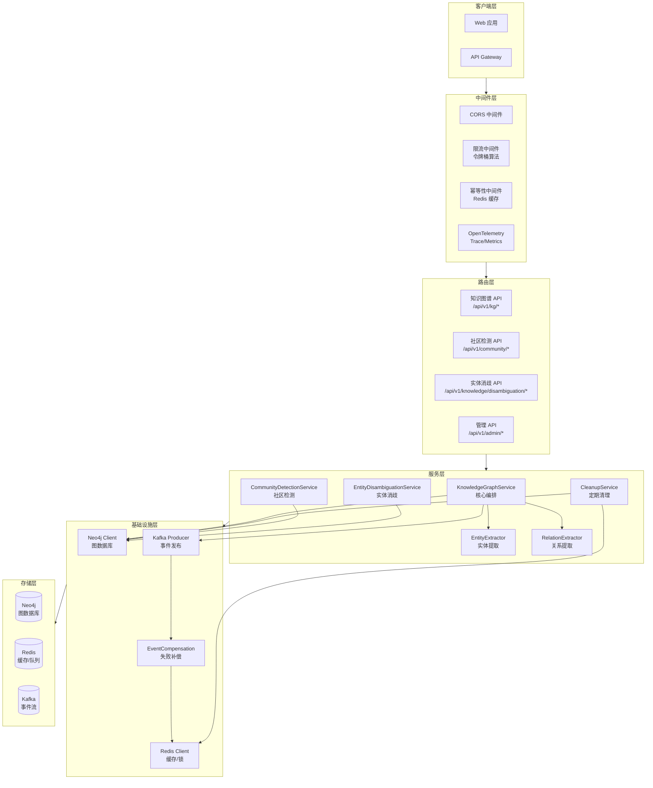
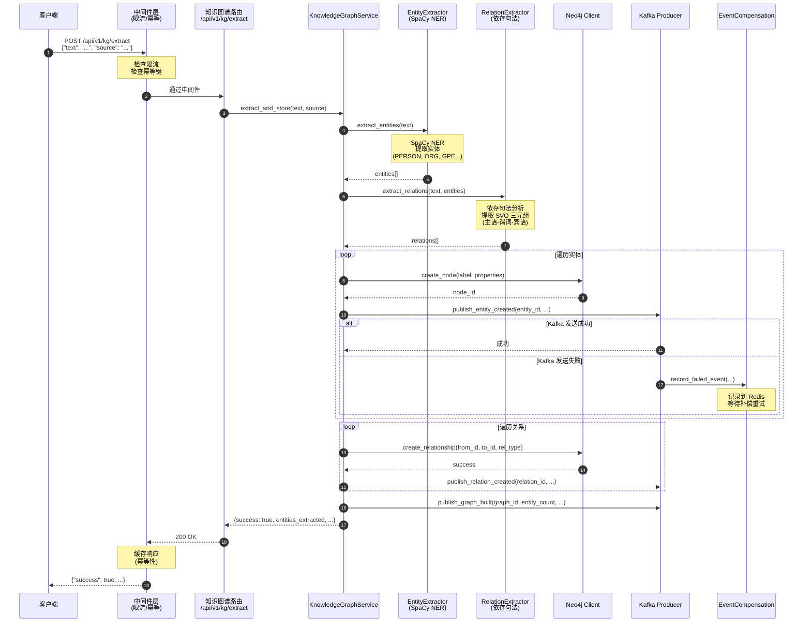
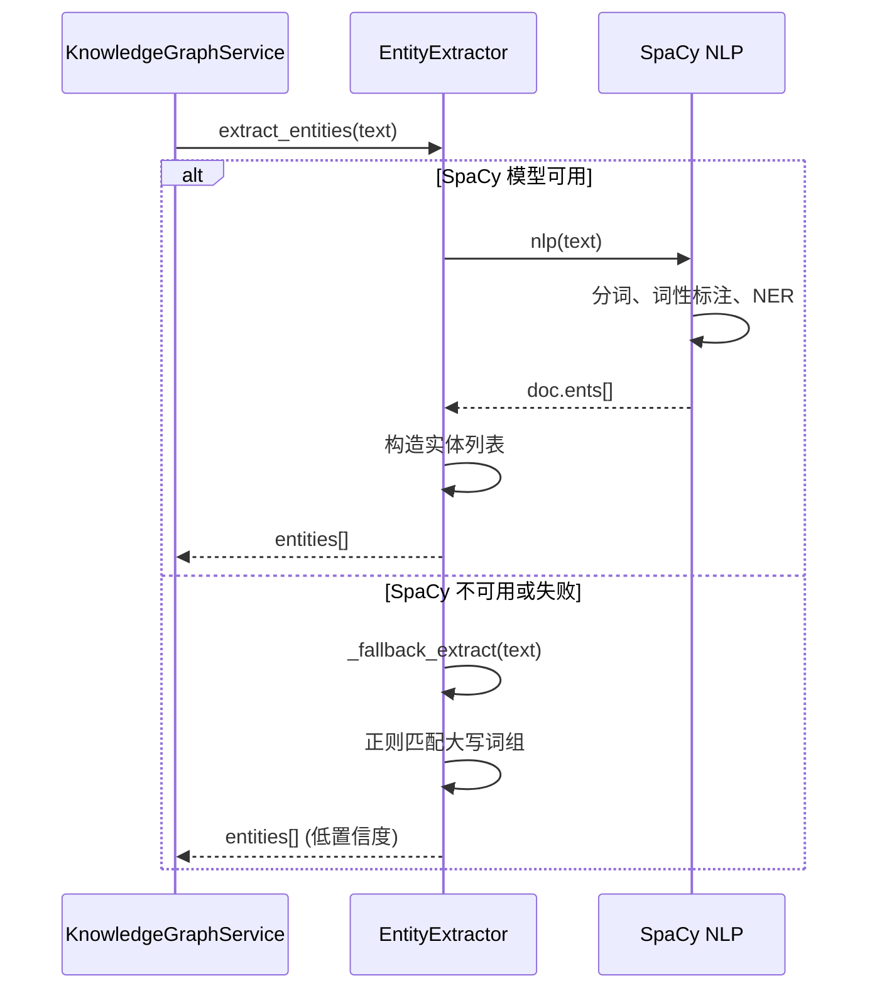
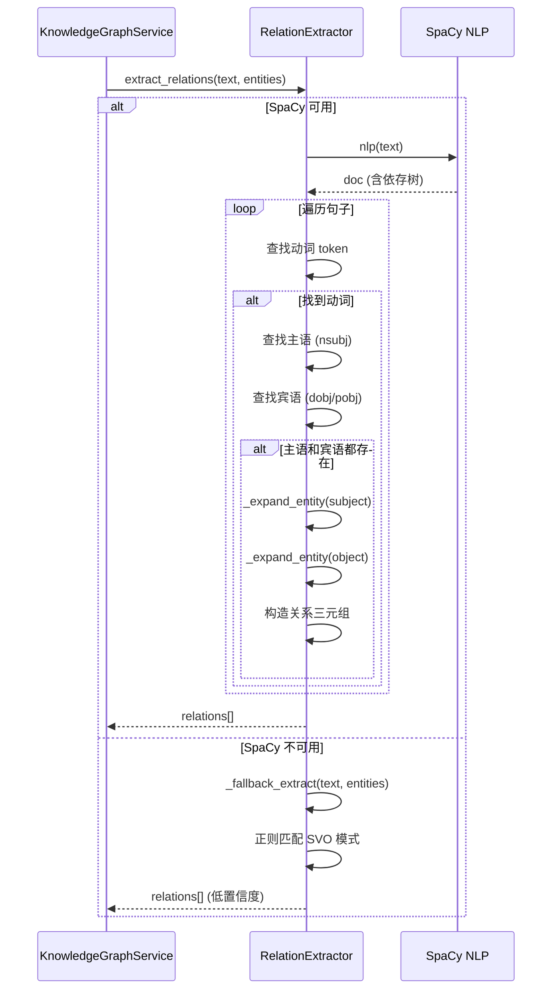
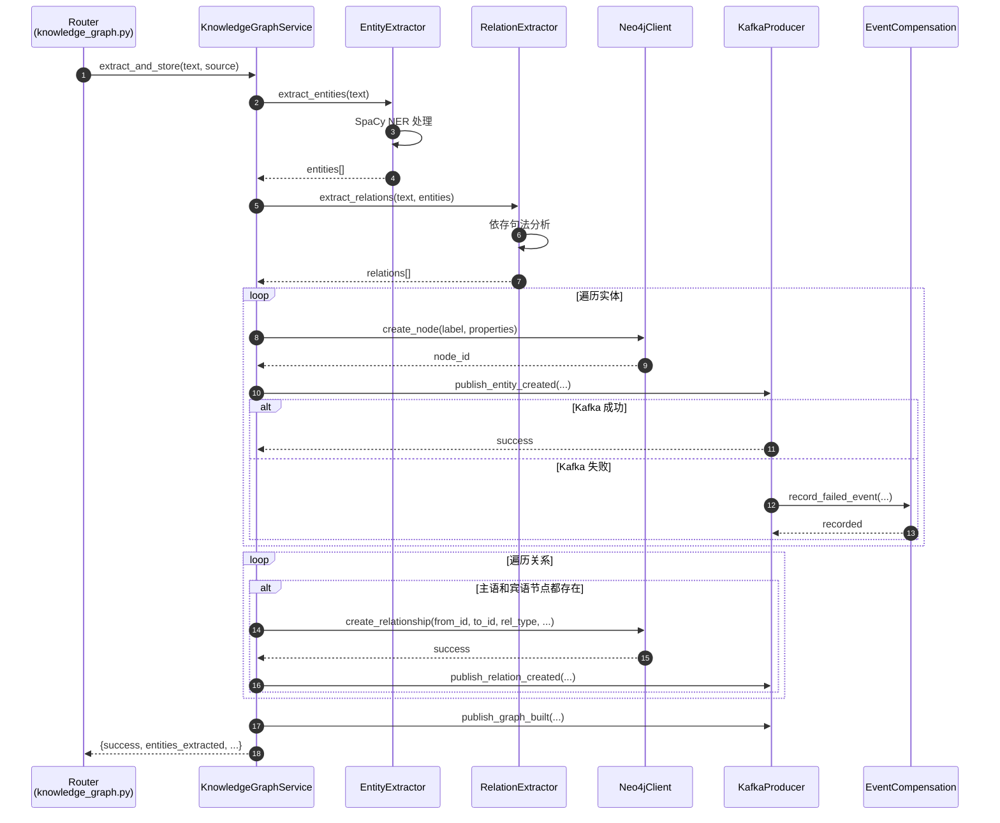
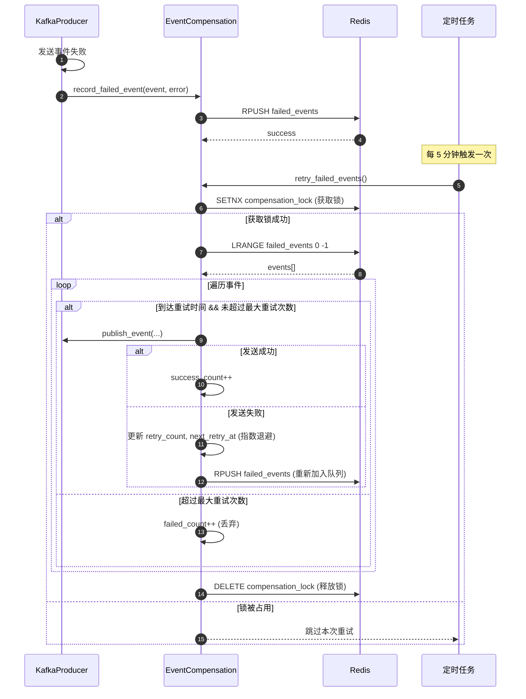

# VoiceHelper-04-Knowledge-Service (Python版本)

---

## 目录

- [0. 摘要](#0-摘要)
- [1. 整体架构与运行机理](#1-整体架构与运行机理)
- [2. 核心模块概览](#2-核心模块概览)
- [3. 配置模块 (core/config)](#3-配置模块-coreconfig)
- [4. 实体提取模块 (graph/entity_extractor)](#4-实体提取模块-graphentity_extractor)
- [5. 关系提取模块 (graph/relation_extractor)](#5-关系提取模块-graphrelation_extractor)
- [6. Neo4j 客户端模块 (graph/neo4j_client)](#6-neo4j-客户端模块-graphneo4j_client)
- [7. 知识图谱服务模块 (graph/knowledge_graph_service)](#7-知识图谱服务模块-graphknowledge_graph_service)
- [8. Kafka 生产者模块 (infrastructure/kafka_producer)](#8-kafka-生产者模块-infrastructurekafka_producer)
- [9. 事件补偿模块 (infrastructure/event_compensation)](#9-事件补偿模块-infrastructureevent_compensation)
- [10. 限流中间件 (middleware/rate_limiter)](#10-限流中间件-middlewarerate_limiter)
- [11. 幂等性中间件 (middleware/idempotency)](#11-幂等性中间件-middlewareidempotency)
- [12. 清理服务模块 (services/cleanup_service)](#12-清理服务模块-servicescleanup_service)
- [13. 社区检测服务模块 (services/community_detection_service)](#13-社区检测服务模块-servicescommunity_detection_service)
- [14. 知识图谱 API 路由 (routers/knowledge_graph)](#14-知识图谱-api-路由-routersknowledge_graph)
- [15. 社区检测 API 路由 (routers/community)](#15-社区检测-api-路由-routerscommunity)
- [16. 实体消歧 API 路由 (routers/disambiguation)](#16-实体消歧-api-路由-routersdisambiguation)
- [17. 管理 API 路由 (routers/admin)](#17-管理-api-路由-routersadmin)
- [18. 应用入口 (main.py)](#18-应用入口-mainpy)
- [19. 最佳实践与使用示例](#19-最佳实践与使用示例)
- [20. 性能与可观测性](#20-性能与可观测性)

---

## 0. 摘要

### 项目目标

Knowledge Service（知识图谱服务）是 VoiceHelper 平台的知识管理核心组件，提供企业级知识图谱构建、查询、社区检测和实体消歧能力。

### 核心能力边界

**包含功能：**
- 基于 SpaCy NER 的实体提取
- 依存句法分析的关系抽取
- Neo4j 图数据库存储与查询
- Kafka 事件流实时通知
- Leiden/Louvain 社区检测算法
- 基于相似度的实体消歧与合并
- 分布式限流与幂等性保证
- 事件补偿与自动清理机制
- OpenTelemetry 全链路追踪

**非目标：**
- 不提供深度学习实体链接
- 不包含知识推理引擎
- 不支持动态本体学习

### 运行环境

- **语言**: Python 3.10+
- **框架**: FastAPI 0.109.2
- **图数据库**: Neo4j 5.16.0 (需要 GDS 插件用于社区检测)
- **缓存**: Redis 5.0.1
- **消息队列**: Kafka 3.x (可选)
- **NLP**: SpaCy 3.7.2
- **可观测性**: OpenTelemetry 1.22.0

### 部署形态

微服务架构，独立部署，通过 HTTP/REST API 对外提供服务，内部通过 Kafka 发布事件通知。

---

## 1. 整体架构与运行机理

### 1.1 系统架构图



**架构说明：**

1. **客户端层**: 接收来自 Web 应用或其他服务的 HTTP 请求。
2. **中间件层**: 按顺序执行 CORS、限流、幂等性和追踪中间件，保证服务质量和可观测性。
3. **路由层**: FastAPI 路由，按功能域划分为知识图谱、社区检测、实体消歧和管理四类 API。
4. **服务层**: 核心业务逻辑，包括知识图谱构建、实体/关系提取、社区检测、实体消歧和定期清理。
5. **基础设施层**: 封装对外部依赖的访问，包括 Neo4j 图数据库、Kafka 事件流和 Redis 缓存。
6. **存储层**: 持久化存储和消息中间件。

**数据流说明：**

- **同步流**: 客户端请求 → 中间件 → 路由 → 服务层 → Neo4j → 响应
- **异步流**: 服务层 → Kafka Producer → Kafka → 下游消费者（如 RAG Engine）
- **补偿流**: Kafka 发送失败 → EventCompensation → Redis 记录 → 定期重试
- **清理流**: CleanupService 定时任务 → Neo4j/Redis → 删除孤立数据

**高可用与扩展性：**

- **无状态设计**: 服务本身无状态，可水平扩展。
- **连接池**: Neo4j 连接池（默认 50）和 Redis 连接池优化性能。
- **限流保护**: 防止服务过载，支持突发流量（burst）。
- **事件补偿**: 确保 Kafka 事件最终一致性。
- **健康检查**: 多维度依赖服务监控，支持 K8s readiness/liveness probe。

### 1.2 全局时序图 - 知识图谱构建流程



**时序说明：**

1. **请求入口**: 客户端发送 POST 请求到 `/api/v1/kg/extract`，包含待提取的文本和数据源标识。
2. **中间件处理**:
   - 限流中间件检查客户端请求速率（令牌桶算法）。
   - 幂等性中间件检查 `Idempotency-Key` 或基于请求内容生成键，若已缓存则直接返回。
3. **实体提取**: 使用 SpaCy NER 模型识别文本中的命名实体（人名、组织、地点等）。
4. **关系提取**: 使用依存句法分析器提取实体之间的关系（主语-谓词-宾语三元组）。
5. **图存储**: 遍历实体和关系，调用 Neo4j 客户端创建节点和边。
6. **事件发布**:
   - 每创建一个实体/关系，发布对应事件到 Kafka。
   - 若 Kafka 发送失败，记录到 EventCompensation 服务的 Redis 队列，后续定期重试。
7. **响应返回**: 返回提取和存储的统计信息（实体数、关系数）。
8. **幂等性缓存**: 成功响应被缓存 120 秒，相同幂等键的重复请求直接返回缓存。

**边界条件：**

- **并发控制**: Neo4j 支持事务，但实体创建不使用全局事务（提高并发）。
- **幂等性**: 通过 `Idempotency-Key` 或请求内容 hash 确保重复请求返回相同结果。
- **超时**: Neo4j 连接超时 30 秒，事务重试时间 30 秒。
- **限流**: 默认每分钟 60 请求，突发容量 10 个令牌。

**异常与回退：**

- **SpaCy 模型缺失**: 降级到基于正则表达式的 fallback 提取器。
- **Neo4j 不可用**: 返回 500 错误，不影响事件发布（事件仍会记录到补偿队列）。
- **Kafka 不可用**: 仅记录日志和补偿，不阻塞主流程。

**性能要点：**

- **批量优化**: 当前单条处理，若需批量提取可考虑事务批处理。
- **缓存**: 实体和关系查询结果可缓存到 Redis，减少 Neo4j 查询压力。
- **连接池**: Neo4j 连接池大小 50，支持高并发。
- **异步处理**: Kafka 发送使用 `asyncio.to_thread` 避免阻塞主线程。

### 1.3 模块边界与交互矩阵

| 模块 | 对外提供 | 调用方 | 交互方式 | 数据一致性 |
|-----|---------|--------|---------|-----------|
| **EntityExtractor** | `extract_entities(text)` | KnowledgeGraphService | 同步调用 | 无状态 |
| **RelationExtractor** | `extract_relations(text, entities)` | KnowledgeGraphService | 同步调用 | 无状态 |
| **Neo4jClient** | `create_node()`, `create_relationship()`, `execute_query()` | KnowledgeGraphService, CommunityDetectionService, EntityDisambiguationService, CleanupService | 同步调用 | 强一致性（事务） |
| **KafkaProducer** | `publish_entity_created()`, `publish_relation_created()`, `publish_graph_built()` | KnowledgeGraphService, CommunityDetectionService | 异步调用 | 最终一致性（补偿） |
| **EventCompensation** | `record_failed_event()`, `retry_failed_events()` | KafkaProducer, AdminAPI | 异步调用 | 最终一致性 |
| **RateLimiterMiddleware** | 自动拦截请求 | FastAPI 应用 | 中间件 | 分布式一致性（Redis） |
| **IdempotencyMiddleware** | 自动拦截请求 | FastAPI 应用 | 中间件 | 分布式一致性（Redis） |
| **CleanupService** | `run_cleanup()`, `cleanup_tenant_data()` | 定时任务, AdminAPI | 同步调用 | 强一致性（事务） |
| **CommunityDetectionService** | `detect_communities_leiden()`, `detect_communities_louvain()` | CommunityAPI | 同步调用 | 强一致性（事务） |
| **EntityDisambiguationService** | `find_similar_entities()`, `merge_entities()` | DisambiguationAPI | 同步调用 | 强一致性（事务） |

**交互说明：**

- **同步调用**: 方法直接调用，等待返回结果。
- **异步调用**: 通过消息队列（Kafka）或后台任务（asyncio.create_task）异步执行。
- **中间件**: 在请求到达路由之前自动拦截处理。

**错误语义：**

- **EntityExtractor/RelationExtractor**: 失败返回空列表或降级到 fallback 方法，不抛异常。
- **Neo4jClient**: 失败返回 `None` 或空列表，记录错误日志。
- **KafkaProducer**: 失败记录到 EventCompensation，抛出异常但不阻塞主流程。
- **中间件**: 限流失败返回 429 Too Many Requests；幂等性失败跳过缓存。

---

## 2. 核心模块概览

### 2.1 模块目录结构

```
algo/knowledge-service/
├── main.py                                # 应用入口
├── requirements.txt                       # 依赖清单
├── pytest.ini                            # 测试配置
├── Makefile                              # 自动化脚本
├── app/
│   ├── __init__.py
│   ├── core/                             # 核心配置
│   │   ├── config.py                     # 配置管理
│   │   ├── logging_config.py             # 日志配置
│   │   └── observability.py              # OpenTelemetry 集成
│   ├── graph/                            # 知识图谱核心
│   │   ├── entity_extractor.py           # 实体提取
│   │   ├── relation_extractor.py         # 关系提取
│   │   ├── knowledge_graph_service.py    # 核心服务
│   │   └── neo4j_client.py               # Neo4j 客户端
│   ├── infrastructure/                   # 基础设施
│   │   ├── kafka_producer.py             # Kafka 生产者
│   │   └── event_compensation.py         # 事件补偿
│   ├── middleware/                       # 中间件
│   │   ├── rate_limiter.py               # 限流中间件
│   │   └── idempotency.py                # 幂等性中间件
│   ├── routers/                          # API 路由
│   │   ├── knowledge_graph.py            # 知识图谱 API
│   │   ├── community.py                  # 社区检测 API
│   │   ├── disambiguation.py             # 实体消歧 API
│   │   └── admin.py                      # 管理 API
│   └── services/                         # 业务服务
│       ├── cleanup_service.py            # 清理服务
│       ├── community_detection_service.py # 社区检测
│       ├── entity_disambiguation_service.py # 实体消歧
│       ├── embedding_service.py          # 向量嵌入
│       ├── entity_extraction_service.py  # 实体提取服务
│       └── entity_similarity_merger.py   # 实体合并
└── tests/                                # 测试用例
    ├── test_neo4j_client.py
    ├── test_kafka_producer.py
    └── conftest.py
```

### 2.2 模块职责说明

| 模块 | 职责 | 输入 | 输出 | 上游依赖 | 下游依赖 |
|-----|------|-----|------|---------|---------|
| **core/config** | 统一配置管理，从环境变量和 `.env` 文件加载配置 | 环境变量 | Settings 实例 | 无 | 所有模块 |
| **graph/entity_extractor** | 基于 SpaCy NER 提取文本中的命名实体 | 文本字符串 | 实体列表 | SpaCy 模型 | KnowledgeGraphService |
| **graph/relation_extractor** | 基于依存句法分析提取实体间关系 | 文本字符串、实体列表 | 关系三元组列表 | SpaCy 模型 | KnowledgeGraphService |
| **graph/neo4j_client** | Neo4j 图数据库客户端，提供节点/关系 CRUD | Cypher 查询 | 查询结果 | Neo4j 数据库 | KnowledgeGraphService, CommunityService, DisambService |
| **graph/knowledge_graph_service** | 知识图谱核心服务，编排提取、存储和事件发布 | 文本、数据源 | 提取结果统计 | EntityExtractor, RelationExtractor, Neo4jClient, KafkaProducer | 路由层 |
| **infrastructure/kafka_producer** | Kafka 事件生产者，发布知识图谱事件 | 事件类型、载荷 | 无（异步） | Kafka 集群 | KnowledgeGraphService, CommunityService |
| **infrastructure/event_compensation** | 事件补偿机制，记录和重试失败事件 | 失败事件 | 补偿统计 | Redis | KafkaProducer |
| **middleware/rate_limiter** | 令牌桶限流中间件，防止服务过载 | HTTP 请求 | 放行/拒绝 | Redis | FastAPI 应用 |
| **middleware/idempotency** | 幂等性中间件，缓存响应防止重复操作 | HTTP 请求 | 缓存响应 | Redis | FastAPI 应用 |
| **services/cleanup_service** | 定期清理孤立实体、关系和过期缓存 | 定时触发 | 清理统计 | Neo4jClient, Redis | 定时任务 |
| **services/community_detection_service** | Leiden/Louvain 社区检测算法 | 图投影参数 | 社区列表 | Neo4jClient (GDS) | CommunityAPI |
| **services/entity_disambiguation_service** | 实体消歧与合并 | 实体 ID | 相似实体列表、合并结果 | Neo4jClient | DisambiguationAPI |
| **routers/knowledge_graph** | 知识图谱 API 路由 | HTTP 请求 | JSON 响应 | KnowledgeGraphService | 客户端 |
| **routers/community** | 社区检测 API 路由 | HTTP 请求 | JSON 响应 | CommunityDetectionService | 客户端 |
| **routers/disambiguation** | 实体消歧 API 路由 | HTTP 请求 | JSON 响应 | EntityDisambiguationService | 客户端 |
| **routers/admin** | 管理 API 路由（清理、补偿） | HTTP 请求 | JSON 响应 | CleanupService, EventCompensation | 运维客户端 |

### 2.3 技术栈与依赖

**核心依赖：**

- **Web 框架**: FastAPI 0.109.2 - 高性能异步 Web 框架，自动生成 OpenAPI 文档
- **图数据库**: Neo4j 5.16.0 - 原生图数据库，支持 Cypher 查询和 GDS 图算法
- **NLP**: SpaCy 3.7.2 - 工业级 NLP 库，支持多语言 NER 和句法分析
- **缓存/队列**: Redis 5.0.1 - 内存数据库，用于限流、幂等性和事件补偿
- **消息队列**: confluent-kafka 2.3.0 - Kafka Python 客户端，支持异步发送
- **可观测性**: OpenTelemetry 1.22.0 - 统一的分布式追踪和指标采集

**开发依赖：**

- uvicorn - ASGI 服务器
- pytest - 测试框架
- httpx - HTTP 客户端（测试用）

---

## 3. 配置模块 (core/config)

### 3.1 模块概览

配置模块使用 Pydantic Settings 管理所有服务配置，支持从环境变量和 `.env` 文件加载，提供类型验证和默认值。

**职责：**
- 定义所有配置项及其类型
- 从环境变量/文件加载配置
- 提供全局单例访问

**配置类：**

```python
class Settings(BaseSettings):
    # 服务基本信息
    APP_NAME: str = "Knowledge Service"
    VERSION: str = "1.0.0"
    HOST: str = "0.0.0.0"
    PORT: int = 8006
    ENVIRONMENT: str = "development"

    # Neo4j 配置
    NEO4J_URI: str
    NEO4J_USER: str
    NEO4J_PASSWORD: str
    NEO4J_MAX_CONNECTION_LIFETIME: int = 3600
    NEO4J_MAX_CONNECTION_POOL_SIZE: int = 50
    NEO4J_CONNECTION_TIMEOUT: int = 30
    NEO4J_MAX_TRANSACTION_RETRY_TIME: int = 30

    # Redis 配置
    REDIS_URL: str
    REDIS_MAX_CONNECTIONS: int = 50
    REDIS_SOCKET_TIMEOUT: int = 5
    REDIS_SOCKET_CONNECT_TIMEOUT: int = 5

    # Kafka 配置
    KAFKA_BOOTSTRAP_SERVERS: str
    KAFKA_TOPIC_KNOWLEDGE_EVENTS: str = "knowledge.events"
    KAFKA_ACKS: str = "all"
    KAFKA_RETRIES: int = 3
    KAFKA_LINGER_MS: int = 5
    KAFKA_COMPRESSION_TYPE: str = "gzip"

    # SpaCy 模型
    SPACY_MODEL: str = "en_core_web_sm"

    # 限流配置
    RATE_LIMIT_ENABLED: bool = True
    RATE_LIMIT_REQUESTS_PER_MINUTE: int = 60
    RATE_LIMIT_BURST: int = 10

    # 清理任务配置
    CLEANUP_INTERVAL_HOURS: int = 24
    CLEANUP_ORPHAN_DAYS_THRESHOLD: int = 30
    CLEANUP_COMMUNITY_DAYS_THRESHOLD: int = 7

    # OpenTelemetry 配置
    OTEL_ENABLED: bool = True
    OTEL_EXPORTER_OTLP_ENDPOINT: str = "http://localhost:4317"
    OTEL_SERVICE_NAME: str = "knowledge-service"
```

### 3.2 配置项说明

| 配置项 | 类型 | 默认值 | 说明 | 影响范围 |
|-------|------|--------|------|---------|
| **APP_NAME** | str | "Knowledge Service" | 服务名称 | 日志、追踪 |
| **VERSION** | str | "1.0.0" | 服务版本 | API 响应 |
| **HOST** | str | "0.0.0.0" | 监听地址 | Uvicorn |
| **PORT** | int | 8006 | 监听端口 | Uvicorn |
| **ENVIRONMENT** | str | "development" | 运行环境 | CORS 策略 |
| **NEO4J_URI** | str | 必填 | Neo4j 连接 URI | Neo4jClient |
| **NEO4J_USER** | str | 必填 | Neo4j 用户名 | Neo4jClient |
| **NEO4J_PASSWORD** | str | 必填 | Neo4j 密码 | Neo4jClient |
| **NEO4J_MAX_CONNECTION_POOL_SIZE** | int | 50 | 连接池大小 | 并发能力 |
| **NEO4J_CONNECTION_TIMEOUT** | int | 30 | 连接超时（秒） | 容错性 |
| **REDIS_URL** | str | 必填 | Redis 连接 URL | 限流/幂等/补偿 |
| **REDIS_MAX_CONNECTIONS** | int | 50 | Redis 连接池大小 | 并发能力 |
| **KAFKA_BOOTSTRAP_SERVERS** | str | 必填 | Kafka 地址 | KafkaProducer |
| **KAFKA_ACKS** | str | "all" | 确认策略 | 可靠性 |
| **KAFKA_COMPRESSION_TYPE** | str | "gzip" | 压缩类型 | 网络带宽 |
| **SPACY_MODEL** | str | "en_core_web_sm" | SpaCy 模型 | 实体/关系提取 |
| **RATE_LIMIT_ENABLED** | bool | True | 是否启用限流 | 过载保护 |
| **RATE_LIMIT_REQUESTS_PER_MINUTE** | int | 60 | 每分钟请求数 | 限流阈值 |
| **RATE_LIMIT_BURST** | int | 10 | 突发容量 | 令牌桶大小 |
| **CLEANUP_INTERVAL_HOURS** | int | 24 | 清理间隔（小时） | 数据清理 |
| **CLEANUP_ORPHAN_DAYS_THRESHOLD** | int | 30 | 孤立实体阈值（天） | 数据保留 |
| **OTEL_ENABLED** | bool | True | 是否启用追踪 | 可观测性 |
| **OTEL_EXPORTER_OTLP_ENDPOINT** | str | http://localhost:4317 | OTLP 端点 | 追踪导出 |

### 3.3 配置加载机制

```python
# 配置加载流程
class Settings(BaseSettings):
    class Config:
        env_file = ".env"        # 从 .env 文件加载
        case_sensitive = True    # 环境变量区分大小写

# 全局配置实例
settings = Settings()
```

**加载优先级：**
1. 显式传入的参数（代码中设置）
2. 环境变量
3. `.env` 文件
4. 默认值

**使用方式：**

```python
from app.core.config import settings

# 访问配置
neo4j_uri = settings.NEO4J_URI
rate_limit = settings.RATE_LIMIT_REQUESTS_PER_MINUTE
```

### 3.4 配置最佳实践

**开发环境配置示例 (`.env`)：**

```bash
# 服务配置
ENVIRONMENT=development
LOG_LEVEL=DEBUG

# Neo4j (本地开发)
NEO4J_URI=bolt://localhost:7687
NEO4J_USER=neo4j
NEO4J_PASSWORD=password

# Redis (本地开发)
REDIS_URL=redis://localhost:6379/0

# Kafka (可选，开发时可关闭)
KAFKA_BOOTSTRAP_SERVERS=localhost:9092

# 限流（开发时可放宽）
RATE_LIMIT_REQUESTS_PER_MINUTE=1000
RATE_LIMIT_BURST=100
```

**生产环境配置示例：**

```bash
# 服务配置
ENVIRONMENT=production
LOG_LEVEL=INFO

# Neo4j (集群)
NEO4J_URI=bolt+s://neo4j.prod.example.com:7687
NEO4J_USER=${NEO4J_USER_SECRET}
NEO4J_PASSWORD=${NEO4J_PASSWORD_SECRET}
NEO4J_MAX_CONNECTION_POOL_SIZE=100

# Redis (集群)
REDIS_URL=redis://redis.prod.example.com:6379/0
REDIS_MAX_CONNECTIONS=100

# Kafka (集群)
KAFKA_BOOTSTRAP_SERVERS=kafka-1:9092,kafka-2:9092,kafka-3:9092
KAFKA_ACKS=all
KAFKA_COMPRESSION_TYPE=zstd

# 限流（严格）
RATE_LIMIT_REQUESTS_PER_MINUTE=60
RATE_LIMIT_BURST=10

# 清理（更频繁）
CLEANUP_INTERVAL_HOURS=12
CLEANUP_ORPHAN_DAYS_THRESHOLD=7

# OpenTelemetry (Jaeger)
OTEL_ENABLED=true
OTEL_EXPORTER_OTLP_ENDPOINT=http://jaeger-collector:4317
```

---

## 4. 实体提取模块 (graph/entity_extractor)

### 4.1 模块概览

实体提取模块负责从文本中识别命名实体（Named Entity Recognition, NER），基于 SpaCy 的预训练模型实现。

**核心功能：**
- 加载 SpaCy NER 模型（默认 `en_core_web_sm`）
- 提取文本中的命名实体（人名、组织、地点、日期等）
- 提供带上下文的实体提取
- 按标签分组实体
- 降级到基于正则的 fallback 提取器

### 4.2 核心类：EntityExtractor

**类结构：**

```python
class EntityExtractor:
    def __init__(self, model: str = "en_core_web_sm"):
        # 初始化 SpaCy 模型
        self.model_name = model
        self.nlp = spacy.load(model)

    def extract_entities(self, text: str) -> List[Dict[str, Any]]:
        # 提取实体
        pass

    def _fallback_extract(self, text: str) -> List[Dict[str, Any]]:
        # 后备提取方法（基于正则）
        pass

    def extract_with_context(self, text: str, context_window: int = 50) -> List[Dict[str, Any]]:
        # 提取实体并包含上下文
        pass

    def group_by_label(self, entities: List[Dict[str, Any]]) -> Dict[str, List[Dict[str, Any]]]:
        # 按标签分组实体
        pass
```

### 4.3 核心方法详解

#### 4.3.1 extract_entities - 提取实体

**方法签名：**

```python
def extract_entities(self, text: str) -> List[Dict[str, Any]]
```

**功能说明：**

使用 SpaCy NER 模型从文本中提取命名实体。

**请求参数：**

| 参数 | 类型 | 必填 | 说明 |
|-----|------|-----|------|
| text | str | 是 | 待提取的文本 |

**返回结构：**

```python
[
    {
        "text": str,        # 实体文本
        "label": str,       # 实体类型（PERSON/ORG/GPE/DATE等）
        "start": int,       # 起始位置
        "end": int,         # 结束位置
        "confidence": float # 置信度（SpaCy 默认 1.0）
    },
    ...
]
```

**核心代码：**

```python
def extract_entities(self, text: str) -> List[Dict[str, Any]]:
    if not self.nlp:
        return self._fallback_extract(text)

    try:
        # 使用 SpaCy 处理文本
        doc = self.nlp(text)

        # 遍历识别的实体
        entities = []
        for ent in doc.ents:
            entities.append({
                "text": ent.text,
                "label": ent.label_,
                "start": ent.start_char,
                "end": ent.end_char,
                "confidence": 1.0,  # SpaCy 不提供置信度
            })

        return entities
    except Exception as e:
        # 处理失败，降级到 fallback
        return self._fallback_extract(text)
```

**支持的实体类型：**

| 标签 | 说明 | 示例 |
|------|-----|------|
| PERSON | 人名 | "Steve Jobs", "Elon Musk" |
| ORG | 组织/公司 | "Apple", "Google", "MIT" |
| GPE | 地理政治实体 | "San Francisco", "China" |
| LOC | 位置（非 GPE） | "Mount Everest", "Pacific Ocean" |
| DATE | 日期 | "1976", "October 2023" |
| TIME | 时间 | "3 PM", "morning" |
| MONEY | 货币金额 | "$100", "€50" |
| PERCENT | 百分比 | "50%", "half" |
| PRODUCT | 产品 | "iPhone", "Windows 11" |
| EVENT | 事件 | "World War II", "Olympics" |
| CARDINAL | 基数词 | "one", "100" |
| ORDINAL | 序数词 | "first", "1st" |

#### 4.3.2 _fallback_extract - 后备提取方法

**功能说明：**

当 SpaCy 模型不可用或提取失败时，使用基于正则表达式的简单规则提取实体。

**核心代码：**

```python
def _fallback_extract(self, text: str) -> List[Dict[str, Any]]:
    entities = []

    # 提取大写开头的词组（可能是人名或地名）
    # 匹配模式：连续的大写字母开头的单词
    capitalized_pattern = r'\b[A-Z][a-z]+(?:\s+[A-Z][a-z]+)*\b'
    matches = re.finditer(capitalized_pattern, text)

    for match in matches:
        entities.append({
            "text": match.group(),
            "label": "UNKNOWN",  # 无法确定类型
            "start": match.start(),
            "end": match.end(),
            "confidence": 0.5,    # 低置信度
        })

    return entities
```

**Fallback 规则：**

- 匹配连续的首字母大写单词（如 "Steve Jobs"、"New York"）
- 标签统一为 "UNKNOWN"
- 置信度设为 0.5

**限制：**

- 无法区分实体类型
- 误识别率较高（如句首单词）
- 不支持非英文

#### 4.3.3 extract_with_context - 带上下文提取

**功能说明：**

提取实体并附带前后文本上下文，便于后续消歧和链接。

**核心代码：**

```python
def extract_with_context(self, text: str, context_window: int = 50) -> List[Dict[str, Any]]:
    entities = self.extract_entities(text)

    # 为每个实体添加上下文
    for entity in entities:
        start = max(0, entity["start"] - context_window)
        end = min(len(text), entity["end"] + context_window)
        entity["context"] = text[start:end]

    return entities
```

**示例：**

输入：
```
"Apple was founded by Steve Jobs in 1976. The company is based in Cupertino."
```

输出：
```python
[
    {
        "text": "Apple",
        "label": "ORG",
        "start": 0,
        "end": 5,
        "confidence": 1.0,
        "context": "Apple was founded by Steve Jobs in 1976"  # 前后各 50 字符
    },
    {
        "text": "Steve Jobs",
        "label": "PERSON",
        "start": 21,
        "end": 31,
        "confidence": 1.0,
        "context": "Apple was founded by Steve Jobs in 1976. The company"
    },
    ...
]
```

### 4.4 调用链路与时序图



### 4.5 单例模式与全局访问

```python
# 全局实例
_entity_extractor: Optional[EntityExtractor] = None

def get_entity_extractor() -> EntityExtractor:
    """获取实体提取器实例（单例）"""
    global _entity_extractor

    if _entity_extractor is None:
        _entity_extractor = EntityExtractor()

    return _entity_extractor
```

**单例原因：**

- SpaCy 模型加载耗时（几秒），避免重复加载
- 模型占用内存（几百 MB），共享实例节省资源

### 4.6 性能优化建议

1. **批量处理**：使用 `nlp.pipe()` 批量处理文本
   ```python
   docs = nlp.pipe(texts, batch_size=50)
   for doc in docs:
       # 处理每个 doc
   ```

2. **禁用不需要的管道**：若只需 NER，可禁用其他组件
   ```python
   nlp = spacy.load("en_core_web_sm", disable=["parser", "tagger"])
   ```

3. **使用更大模型**：`en_core_web_lg` 或 `en_core_web_trf` 提高准确性
   ```python
   nlp = spacy.load("en_core_web_lg")  # 更大模型，更高准确率
   ```

4. **缓存结果**：对相同文本缓存提取结果到 Redis

---

## 5. 关系提取模块 (graph/relation_extractor)

### 5.1 模块概览

关系提取模块负责从文本中提取实体之间的关系，基于 SpaCy 的依存句法分析（Dependency Parsing）实现。

**核心功能：**
- 使用依存句法分析提取主语-谓词-宾语（SVO）三元组
- 支持带实体的关系提取（结合 EntityExtractor 结果）
- 提取三元组（Triplet）格式
- 按置信度过滤关系
- 降级到基于正则的 fallback 提取器

### 5.2 核心类：RelationExtractor

**类结构：**

```python
class RelationExtractor:
    def __init__(self, model: str = "en_core_web_sm"):
        self.model_name = model
        self.nlp = spacy.load(model)

    def extract_relations(self, text: str, entities: Optional[List[Dict[str, Any]]] = None) -> List[Dict[str, Any]]:
        # 提取关系
        pass

    def _expand_entity(self, token) -> str:
        # 扩展实体（包含修饰词）
        pass

    def _fallback_extract(self, text: str, entities: Optional[List[Dict[str, Any]]]) -> List[Dict[str, Any]]:
        # 后备提取方法（基于正则）
        pass

    def extract_triplets(self, text: str) -> List[Tuple[str, str, str]]:
        # 提取三元组
        pass

    def filter_by_confidence(self, relations: List[Dict[str, Any]], min_confidence: float = 0.5) -> List[Dict[str, Any]]:
        # 按置信度过滤
        pass
```

### 5.3 核心方法详解

#### 5.3.1 extract_relations - 提取关系

**方法签名：**

```python
def extract_relations(self, text: str, entities: Optional[List[Dict[str, Any]]] = None) -> List[Dict[str, Any]]
```

**功能说明：**

使用 SpaCy 依存句法分析从文本中提取实体之间的关系。基于依存树中的动词（VERB）节点，查找其主语（nsubj）和宾语（dobj/pobj/attr），构成三元组。

**请求参数：**

| 参数 | 类型 | 必填 | 说明 |
|-----|------|-----|------|
| text | str | 是 | 待提取的文本 |
| entities | List[Dict] | 否 | 已提取的实体列表（可用于约束关系提取） |

**返回结构：**

```python
[
    {
        "subject": str,      # 主语（头实体）
        "predicate": str,    # 谓词（关系类型）
        "object": str,       # 宾语（尾实体）
        "confidence": float  # 置信度
    },
    ...
]
```

**核心代码：**

```python
def extract_relations(self, text: str, entities: Optional[List[Dict[str, Any]]] = None) -> List[Dict[str, Any]]:
    if not self.nlp:
        return self._fallback_extract(text, entities)

    try:
        doc = self.nlp(text)
        relations = []

        # 遍历每个句子
        for sent in doc.sents:
            # 遍历每个词
            for token in sent:
                # 查找动词作为关系谓词
                if token.pos_ == "VERB":
                    subject = None
                    obj = None

                    # 查找主语
                    for child in token.children:
                        if child.dep_ in ("nsubj", "nsubjpass"):
                            subject = child
                            break

                    # 查找宾语
                    for child in token.children:
                        if child.dep_ in ("dobj", "pobj", "attr"):
                            obj = child
                            break

                    # 如果找到主语和宾语，创建关系
                    if subject and obj:
                        relations.append({
                            "subject": self._expand_entity(subject),
                            "predicate": token.text,
                            "object": self._expand_entity(obj),
                            "confidence": 0.8,  # 基于规则的置信度
                        })

        return relations
    except Exception as e:
        return self._fallback_extract(text, entities)
```

**依存关系标签说明：**

| 标签 | 全称 | 说明 | 示例 |
|-----|------|-----|------|
| **nsubj** | Nominal Subject | 名词性主语 | "**Jobs** founded Apple" |
| **nsubjpass** | Passive Nominal Subject | 被动句主语 | "**Apple** was founded by Jobs" |
| **dobj** | Direct Object | 直接宾语 | "Jobs founded **Apple**" |
| **pobj** | Object of Preposition | 介词宾语 | "Jobs works for **Apple**" |
| **attr** | Attribute | 属性补语 | "Jobs is the **CEO**" |

#### 5.3.2 _expand_entity - 扩展实体

**功能说明：**

将依存树中的单个 token 扩展为完整的实体短语，包含所有修饰词。

**核心代码：**

```python
def _expand_entity(self, token) -> str:
    # 获取 token 的所有子树节点
    subtree = list(token.subtree)

    # 按位置排序
    subtree.sort(key=lambda t: t.i)

    # 合并文本
    return " ".join(t.text for t in subtree)
```

**示例：**

```
输入句子: "The CEO of Apple founded the company in 1976."
原始 token: "CEO"
扩展结果: "The CEO of Apple"

原始 token: "company"
扩展结果: "the company"
```

**扩展规则：**

- 包含所有依存子节点（修饰词、限定词、介词短语等）
- 按词序排列
- 保留原始文本形式（大小写、标点）

#### 5.3.3 _fallback_extract - 后备提取方法

**功能说明：**

当 SpaCy 不可用时，使用基于正则表达式的简单模式匹配提取关系。

**核心代码：**

```python
def _fallback_extract(self, text: str, entities: Optional[List[Dict[str, Any]]] = None) -> List[Dict[str, Any]]:
    relations = []

    # 简单的 SVO 模式
    patterns = [
        r'(\w+(?:\s+\w+)*)\s+(is|are|was|were|has|have|owns|creates|manages)\s+(\w+(?:\s+\w+)*)',
        r'(\w+(?:\s+\w+)*)\s+(works\s+for|belongs\s+to|located\s+in)\s+(\w+(?:\s+\w+)*)',
    ]

    for pattern in patterns:
        matches = re.finditer(pattern, text, re.IGNORECASE)
        for match in matches:
            relations.append({
                "subject": match.group(1).strip(),
                "predicate": match.group(2).strip(),
                "object": match.group(3).strip(),
                "confidence": 0.5,  # 低置信度
            })

    return relations
```

**Fallback 模式：**

| 模式 | 说明 | 示例 |
|-----|------|-----|
| `Entity + is/are/has + Entity` | 基本关系 | "Apple is a company" |
| `Entity + works for + Entity` | 雇佣关系 | "Jobs works for Apple" |
| `Entity + located in + Entity` | 位置关系 | "Apple located in Cupertino" |

**限制：**

- 模式固定，覆盖范围有限
- 不支持复杂句式
- 容易误匹配

#### 5.3.4 extract_triplets - 提取三元组

**功能说明：**

提取 (主语, 关系, 宾语) 三元组格式，便于知识图谱存储。

**核心代码：**

```python
def extract_triplets(self, text: str) -> List[Tuple[str, str, str]]:
    relations = self.extract_relations(text)

    triplets = [
        (rel["subject"], rel["predicate"], rel["object"])
        for rel in relations
    ]

    return triplets
```

**示例：**

```python
text = "Apple was founded by Steve Jobs in 1976. The company is based in Cupertino."
triplets = extractor.extract_triplets(text)

# 输出：
[
    ("Apple", "founded", "Steve Jobs"),
    ("The company", "is", "based"),
    ("The company", "based", "Cupertino"),
]
```

### 5.4 调用链路与时序图



### 5.5 复杂关系提取示例

**示例 1：被动语态**

```
输入: "Apple was founded by Steve Jobs in 1976."

依存树:
  founded (VERB, ROOT)
   ├─ Apple (nsubjpass)  ← 被动主语
   ├─ was (auxpass)
   ├─ by (agent)
   │   └─ Jobs (pobj)     ← 介词宾语
   └─ in (prep)
       └─ 1976 (pobj)

提取结果:
{
    "subject": "Apple",
    "predicate": "founded",
    "object": "Steve Jobs",  # 需要特殊处理 agent
    "confidence": 0.8
}
```

**示例 2：复杂名词短语**

```
输入: "The former CEO of Apple Inc founded the company in Cupertino."

依存树:
  founded (VERB)
   ├─ CEO (nsubj)
   │   ├─ The (det)
   │   ├─ former (amod)
   │   └─ of (prep)
   │       └─ Inc (pobj)
   │           ├─ Apple (compound)
   │           └─ . (punct)
   └─ company (dobj)
       └─ the (det)

扩展后:
  subject: "The former CEO of Apple Inc"  # _expand_entity 包含所有修饰词
  predicate: "founded"
  object: "the company"
```

### 5.6 性能优化与最佳实践

**1. 批量处理**

```python
docs = nlp.pipe(texts, batch_size=50)
for doc in docs:
    for sent in doc.sents:
        # 提取关系
```

**2. 禁用不需要的管道**

```python
# 关系提取需要依存分析，但可禁用 NER
nlp = spacy.load("en_core_web_sm", disable=["ner"])
```

**3. 关系类型规范化**

```python
# 将动词原形化
predicate = token.lemma_  # "founded" -> "found", "is" -> "be"

# 转大写并替换空格
rel_type = predicate.upper().replace(" ", "_")  # "works for" -> "WORKS_FOR"
```

**4. 过滤低质量关系**

```python
# 按置信度过滤
high_quality = extractor.filter_by_confidence(relations, min_confidence=0.7)

# 过滤停用词
if subject.lower() in {"the", "this", "that", "it"}:
    continue  # 跳过指代词
```

---

## 6. Neo4j 客户端模块 (graph/neo4j_client)

### 6.1 模块概览

Neo4j 客户端模块封装对 Neo4j 图数据库的访问，提供节点/关系 CRUD、Cypher 查询执行和连接池管理。

**核心功能：**
- 异步 Neo4j 连接（AsyncGraphDatabase）
- 连接池管理（池大小、超时、生命周期）
- 节点创建与查询
- 关系创建与查询
- 任意 Cypher 查询执行
- 健康检查

### 6.2 核心类：Neo4jClient

**类结构：**

```python
class Neo4jClient:
    def __init__(self, uri, user, password, max_connection_pool_size, ...):
        self.driver = AsyncGraphDatabase.driver(uri, auth=(user, password), ...)

    async def close(self):
        # 关闭连接
        pass

    async def execute_query(self, query: str, parameters: Dict) -> List[Dict]:
        # 执行 Cypher 查询
        pass

    async def create_node(self, label: str, properties: Dict) -> Optional[str]:
        # 创建节点
        pass

    async def create_relationship(self, from_id: str, to_id: str, rel_type: str, properties: Dict) -> bool:
        # 创建关系
        pass

    async def find_nodes(self, label: str, properties: Dict, limit: int) -> List[Dict]:
        # 查找节点
        pass

    async def find_relationships(self, from_id: str, rel_type: str, limit: int) -> List[Dict]:
        # 查找关系
        pass

    async def health_check(self) -> Dict:
        # 健康检查
        pass
```

### 6.3 核心方法详解

#### 6.3.1 初始化与连接池配置

**构造函数：**

```python
def __init__(
    self,
    uri: str = "bolt://localhost:7687",
    user: str = "neo4j",
    password: str = "password",
    max_connection_lifetime: int = 3600,        # 连接最大生命周期（秒）
    max_connection_pool_size: int = 50,          # 连接池大小
    connection_timeout: int = 30,                # 连接超时（秒）
    max_transaction_retry_time: int = 30,        # 事务重试时间（秒）
):
    if not NEO4J_AVAILABLE:
        self.driver = None
        return

    try:
        self.driver = AsyncGraphDatabase.driver(
            uri,
            auth=(user, password),
            max_connection_lifetime=max_connection_lifetime,
            max_connection_pool_size=max_connection_pool_size,
            connection_timeout=connection_timeout,
            max_transaction_retry_time=max_transaction_retry_time,
        )
    except Exception as e:
        self.driver = None
```

**连接池参数说明：**

| 参数 | 默认值 | 说明 | 推荐配置 |
|-----|-------|------|---------|
| **max_connection_lifetime** | 3600 | 连接最大存活时间（秒），超时后关闭 | 生产: 3600-7200 |
| **max_connection_pool_size** | 50 | 连接池最大连接数 | 开发: 10; 生产: 50-100 |
| **connection_timeout** | 30 | 建立连接超时（秒） | 30 |
| **max_transaction_retry_time** | 30 | 事务失败重试最大时间（秒） | 30-60 |

**连接池优势：**

- **复用连接**: 避免频繁建立/关闭 TCP 连接
- **并发控制**: 限制同时连接数，防止数据库过载
- **自动重连**: 连接失效时自动重新建立
- **负载均衡**: 集群模式下自动选择实例

#### 6.3.2 execute_query - 执行 Cypher 查询

**方法签名：**

```python
async def execute_query(self, query: str, parameters: Optional[Dict[str, Any]] = None) -> List[Dict[str, Any]]
```

**功能说明：**

执行任意 Cypher 查询并返回结果列表。

**请求参数：**

| 参数 | 类型 | 必填 | 说明 |
|-----|------|-----|------|
| query | str | 是 | Cypher 查询语句 |
| parameters | Dict | 否 | 查询参数（用于参数化查询，防止注入） |

**返回结构：**

```python
[
    {
        "column1": value1,
        "column2": value2,
        ...
    },
    ...
]
```

**核心代码：**

```python
async def execute_query(self, query: str, parameters: Optional[Dict[str, Any]] = None) -> List[Dict[str, Any]]:
    if not self.driver:
        return []

    try:
        # 创建会话
        async with self.driver.session() as session:
            # 执行查询
            result = await session.run(query, parameters or {})
            # 获取所有记录
            records = await result.data()
            return records
    except Exception as e:
        return []
```

**使用示例：**

```python
# 参数化查询（推荐，防止注入）
query = """
MATCH (n:Entity)
WHERE n.name = $name
RETURN n, elementId(n) as id
LIMIT $limit
"""
parameters = {"name": "Apple", "limit": 10}
results = await client.execute_query(query, parameters)

# 非参数化查询（不推荐）
query = "MATCH (n:Entity) RETURN count(n) as count"
results = await client.execute_query(query)
```

#### 6.3.3 create_node - 创建节点

**方法签名：**

```python
async def create_node(self, label: str, properties: Dict[str, Any]) -> Optional[str]
```

**功能说明：**

创建图节点并返回节点 ID。

**请求参数：**

| 参数 | 类型 | 必填 | 说明 |
|-----|------|-----|------|
| label | str | 是 | 节点标签（类型） |
| properties | Dict | 是 | 节点属性（键值对） |

**返回值：**

- 成功：节点 ID（字符串）
- 失败：`None`

**核心代码：**

```python
async def create_node(self, label: str, properties: Dict[str, Any]) -> Optional[str]:
    # 构造 Cypher 查询
    query = f"""
    CREATE (n:{label} $props)
    RETURN elementId(n) as id
    """

    try:
        result = await self.execute_query(query, {"props": properties})
        if result:
            return result[0].get("id")
        return None
    except Exception as e:
        return None
```

**使用示例：**

```python
# 创建实体节点
node_id = await client.create_node(
    label="PERSON",
    properties={
        "text": "Steve Jobs",
        "label": "PERSON",
        "confidence": 1.0,
        "source": "wiki",
        "created_at": datetime.utcnow().timestamp() * 1000
    }
)

# node_id: "4:abc123:456"
```

**注意事项：**

- **标签命名**: 建议使用大写（如 `PERSON`、`ORG`）
- **属性类型**: Neo4j 支持 str, int, float, bool, list, datetime
- **索引**: 高频查询字段需建索引（如 `text`, `tenant_id`）
- **事务**: 单节点创建自动使用事务，失败自动回滚

#### 6.3.4 create_relationship - 创建关系

**方法签名：**

```python
async def create_relationship(self, from_id: str, to_id: str, rel_type: str, properties: Optional[Dict[str, Any]] = None) -> bool
```

**功能说明：**

在两个已存在节点之间创建关系。

**请求参数：**

| 参数 | 类型 | 必填 | 说明 |
|-----|------|-----|------|
| from_id | str | 是 | 起始节点 ID |
| to_id | str | 是 | 目标节点 ID |
| rel_type | str | 是 | 关系类型 |
| properties | Dict | 否 | 关系属性 |

**返回值：**

- 成功：`True`
- 失败：`False`

**核心代码：**

```python
async def create_relationship(self, from_id: str, to_id: str, rel_type: str, properties: Optional[Dict[str, Any]] = None) -> bool:
    # 构造 Cypher 查询
    query = f"""
    MATCH (a), (b)
    WHERE elementId(a) = $from_id AND elementId(b) = $to_id
    CREATE (a)-[r:{rel_type} $props]->(b)
    RETURN r
    """

    try:
        result = await self.execute_query(
            query,
            {"from_id": from_id, "to_id": to_id, "props": properties or {}}
        )
        return len(result) > 0
    except Exception as e:
        return False
```

**使用示例：**

```python
# 创建 FOUNDED 关系
success = await client.create_relationship(
    from_id="4:abc:123",   # Steve Jobs 节点 ID
    to_id="4:abc:456",     # Apple 节点 ID
    rel_type="FOUNDED",
    properties={
        "confidence": 0.9,
        "year": 1976,
        "created_at": datetime.utcnow().timestamp() * 1000
    }
)
```

**关系类型命名规范：**

- 使用大写字母和下划线：`FOUNDED`, `WORKS_FOR`, `LOCATED_IN`
- 动词形式：表示动作或关系
- 避免空格：使用下划线代替

**注意事项：**

- **节点必须存在**: 若 `from_id` 或 `to_id` 不存在，创建失败
- **方向性**: 关系有方向，`from -> to`
- **重复关系**: 默认允许创建重复关系，需自行去重
- **事务**: 自动使用事务，失败回滚

#### 6.3.5 find_nodes - 查找节点

**方法签名：**

```python
async def find_nodes(self, label: str, properties: Optional[Dict[str, Any]] = None, limit: int = 100) -> List[Dict[str, Any]]
```

**功能说明：**

按标签和属性查找节点。

**核心代码：**

```python
async def find_nodes(self, label: str, properties: Optional[Dict[str, Any]] = None, limit: int = 100) -> List[Dict[str, Any]]:
    # 构造 WHERE 子句
    where_clause = ""
    if properties:
        conditions = [f"n.{key} = ${key}" for key in properties.keys()]
        where_clause = "WHERE " + " AND ".join(conditions)

    query = f"""
    MATCH (n:{label})
    {where_clause}
    RETURN n, elementId(n) as id
    LIMIT {limit}
    """

    try:
        result = await self.execute_query(query, properties or {})
        return [
            {"id": record["id"], **dict(record["n"])}
            for record in result
        ]
    except Exception as e:
        return []
```

**使用示例：**

```python
# 查找所有 Apple 组织
nodes = await client.find_nodes(
    label="ORG",
    properties={"text": "Apple"},
    limit=10
)

# 返回：
[
    {
        "id": "4:abc:456",
        "text": "Apple",
        "label": "ORG",
        "confidence": 1.0,
        "source": "wiki"
    },
    ...
]
```

#### 6.3.6 find_relationships - 查找关系

**方法签名：**

```python
async def find_relationships(self, from_id: str, rel_type: Optional[str] = None, limit: int = 100) -> List[Dict[str, Any]]
```

**功能说明：**

查找指定节点的所有关系。

**核心代码：**

```python
async def find_relationships(self, from_id: str, rel_type: Optional[str] = None, limit: int = 100) -> List[Dict[str, Any]]:
    # 构造关系模式
    rel_pattern = f"[r:{rel_type}]" if rel_type else "[r]"

    query = f"""
    MATCH (a)-{rel_pattern}->(b)
    WHERE elementId(a) = $from_id
    RETURN type(r) as type, properties(r) as props,
           elementId(b) as target_id, labels(b) as target_labels, properties(b) as target_props
    LIMIT {limit}
    """

    try:
        result = await self.execute_query(query, {"from_id": from_id})
        return [
            {
                "type": record["type"],
                "properties": dict(record["props"]) if record["props"] else {},
                "target": {
                    "id": record["target_id"],
                    "labels": record["target_labels"],
                    "properties": dict(record["target_props"]) if record["target_props"] else {},
                },
            }
            for record in result
        ]
    except Exception as e:
        return []
```

**使用示例：**

```python
# 查找 Steve Jobs 的所有关系
relations = await client.find_relationships(from_id="4:abc:123")

# 查找特定类型关系
relations = await client.find_relationships(from_id="4:abc:123", rel_type="FOUNDED")

# 返回：
[
    {
        "type": "FOUNDED",
        "properties": {"confidence": 0.9, "year": 1976},
        "target": {
            "id": "4:abc:456",
            "labels": ["ORG"],
            "properties": {"text": "Apple", ...}
        }
    },
    ...
]
```

#### 6.3.7 health_check - 健康检查

**方法签名：**

```python
async def health_check(self) -> Dict[str, Any]
```

**功能说明：**

检查 Neo4j 连接是否正常。

**核心代码：**

```python
async def health_check(self) -> Dict[str, Any]:
    if not NEO4J_AVAILABLE:
        return {
            "healthy": False,
            "error": "neo4j driver not installed",
        }

    if not self.driver:
        return {
            "healthy": False,
            "error": "Neo4j driver not initialized",
        }

    try:
        # 执行简单查询
        result = await self.execute_query("RETURN 1 as test")
        if result and result[0].get("test") == 1:
            return {
                "healthy": True,
                "connected": True,
            }
        else:
            return {
                "healthy": False,
                "error": "Query execution failed",
            }
    except Exception as e:
        return {
            "healthy": False,
            "error": str(e),
        }
```

### 6.4 单例模式与全局访问

```python
# 全局实例
_neo4j_client: Optional[Neo4jClient] = None

def get_neo4j_client() -> Neo4jClient:
    """获取 Neo4j 客户端实例（单例）"""
    global _neo4j_client

    if _neo4j_client is None:
        from app.core.config import settings

        _neo4j_client = Neo4jClient(
            uri=settings.NEO4J_URI,
            user=settings.NEO4J_USER,
            password=settings.NEO4J_PASSWORD,
            max_connection_lifetime=settings.NEO4J_MAX_CONNECTION_LIFETIME,
            max_connection_pool_size=settings.NEO4J_MAX_CONNECTION_POOL_SIZE,
            connection_timeout=settings.NEO4J_CONNECTION_TIMEOUT,
            max_transaction_retry_time=settings.NEO4J_MAX_TRANSACTION_RETRY_TIME,
        )

    return _neo4j_client
```

### 6.5 性能优化与最佳实践

**1. 索引优化**

```cypher
-- 为高频查询字段创建索引
CREATE INDEX entity_text IF NOT EXISTS FOR (n:Entity) ON (n.text);
CREATE INDEX entity_tenant IF NOT EXISTS FOR (n:Entity) ON (n.tenant_id);
CREATE INDEX entity_created IF NOT EXISTS FOR (n:Entity) ON (n.created_at);

-- 唯一约束（同时创建索引）
CREATE CONSTRAINT entity_id_unique IF NOT EXISTS FOR (n:Entity) REQUIRE n.id IS UNIQUE;
```

**2. 批量操作**

```python
# 批量创建节点（使用 UNWIND）
async def batch_create_nodes(self, label: str, nodes: List[Dict]) -> int:
    query = f"""
    UNWIND $nodes as node
    CREATE (n:{label})
    SET n = node
    RETURN count(n) as count
    """
    result = await self.execute_query(query, {"nodes": nodes})
    return result[0]["count"] if result else 0
```

**3. 事务管理**

```python
# 显式事务（多操作原子性）
async def create_graph_transactional(self, entities, relations):
    async with self.driver.session() as session:
        async with session.begin_transaction() as tx:
            # 创建所有实体
            for entity in entities:
                await tx.run("CREATE (...)", entity)

            # 创建所有关系
            for relation in relations:
                await tx.run("CREATE (...)", relation)

            # 提交事务
            await tx.commit()
```

**4. 查询优化**

```cypher
-- 使用 EXPLAIN 分析查询计划
EXPLAIN
MATCH (n:Entity)-[:RELATES]->(m:Entity)
WHERE n.text = $text
RETURN m

-- 使用 PROFILE 获取实际执行统计
PROFILE
MATCH (n:Entity)-[:RELATES]->(m:Entity)
WHERE n.text = $text
RETURN m
```

**5. 连接池监控**

```python
# 获取连接池统计
def get_pool_stats(self):
    if self.driver:
        # Neo4j Python 驱动不直接暴露连接池统计
        # 需要通过日志或 Neo4j 服务器监控获取
        pass
```

---

## 7. 知识图谱服务模块 (graph/knowledge_graph_service)

### 7.1 模块概览

知识图谱服务是核心编排模块，整合实体提取、关系提取、Neo4j 存储和 Kafka 事件发布，提供知识图谱构建和查询的统一入口。

**核心职责：**
- 编排实体提取和关系提取流程
- 将提取结果存储到 Neo4j
- 发布知识图谱事件到 Kafka
- 提供图查询接口（实体查询、路径查询、邻居查询）
- 提供统计信息和健康检查

### 7.2 核心类：KnowledgeGraphService

**类结构：**

```python
class KnowledgeGraphService:
    def __init__(self, kafka_producer=None):
        self.entity_extractor = get_entity_extractor()
        self.relation_extractor = get_relation_extractor()
        self.neo4j_client = get_neo4j_client()
        self.kafka_producer = kafka_producer

    async def extract_and_store(self, text: str, source: str) -> Dict:
        # 提取并存储知识图谱
        pass

    async def query_entity(self, entity_text: str) -> Optional[Dict]:
        # 查询实体
        pass

    async def query_path(self, start_entity: str, end_entity: str, max_depth: int) -> List:
        # 查询路径
        pass

    async def get_neighbors(self, entity_text: str, max_neighbors: int) -> List:
        # 获取邻居
        pass

    async def get_statistics(self) -> Dict:
        # 获取统计信息
        pass

    async def health_check(self) -> Dict:
        # 健康检查
        pass
```

### 7.3 核心方法详解

#### 7.3.1 extract_and_store - 提取并存储

**方法签名：**

```python
async def extract_and_store(self, text: str, source: Optional[str] = None) -> Dict[str, Any]
```

**功能说明：**

从文本提取实体和关系，存储到 Neo4j，并发布事件到 Kafka。这是知识图谱构建的核心方法。

**请求参数：**

| 参数 | 类型 | 必填 | 说明 |
|-----|------|-----|------|
| text | str | 是 | 待提取的文本 |
| source | str | 否 | 数据来源标识（如 "wiki", "doc_123"） |

**返回结构：**

```python
{
    "success": bool,
    "entities_extracted": int,      # 提取的实体数量
    "entities_stored": int,         # 成功存储的实体数量
    "relations_extracted": int,     # 提取的关系数量
    "relations_stored": int,        # 成功存储的关系数量
    "error": str                    # 错误信息（仅失败时）
}
```

**核心代码与详细说明：**

```python
async def extract_and_store(self, text: str, source: Optional[str] = None) -> Dict[str, Any]:
    try:
        # 步骤 1: 提取实体
        entities = self.entity_extractor.extract_entities(text)

        # 步骤 2: 提取关系
        relations = self.relation_extractor.extract_relations(text, entities)

        # 步骤 3: 存储实体到 Neo4j
        entity_ids = {}  # 记录实体文本 -> 节点 ID 映射

        for entity in entities:
            # 构造节点属性
            node_properties = {
                "text": entity["text"],
                "label": entity["label"],
                "confidence": entity.get("confidence", 1.0),
            }
            if source:
                node_properties["source"] = source

            # 创建节点
            node_id = await self.neo4j_client.create_node(
                label=entity["label"],
                properties=node_properties
            )

            if node_id:
                entity_ids[entity["text"]] = node_id

                # 发布实体创建事件
                if self.kafka_producer:
                    try:
                        await self.kafka_producer.publish_entity_created(
                            entity_id=node_id,
                            tenant_id="default",
                            entity_data={
                                "name": entity["text"],
                                "type": entity["label"],
                                "description": "",
                            }
                        )
                    except Exception as e:
                        # Kafka 失败不影响主流程
                        pass

        # 步骤 4: 存储关系到 Neo4j
        stored_relations = 0

        for relation in relations:
            subject_id = entity_ids.get(relation["subject"])
            object_id = entity_ids.get(relation["object"])

            # 只有当主语和宾语都成功创建时才创建关系
            if subject_id and object_id:
                # 规范化关系类型
                rel_type = relation["predicate"].upper().replace(" ", "_")

                success = await self.neo4j_client.create_relationship(
                    from_id=subject_id,
                    to_id=object_id,
                    rel_type=rel_type,
                    properties={"confidence": relation.get("confidence", 0.8)},
                )

                if success:
                    stored_relations += 1

                    # 发布关系创建事件
                    if self.kafka_producer:
                        try:
                            await self.kafka_producer.publish_relation_created(
                                relation_id=f"{subject_id}_{rel_type}_{object_id}",
                                tenant_id="default",
                                source_id=subject_id,
                                target_id=object_id,
                                relation_type=rel_type,
                            )
                        except Exception as e:
                            pass

        # 步骤 5: 发布图谱构建完成事件
        if self.kafka_producer and (len(entity_ids) > 0 or stored_relations > 0):
            try:
                await self.kafka_producer.publish_graph_built(
                    graph_id=f"graph_{hash(text[:100])}",
                    tenant_id="default",
                    entity_count=len(entity_ids),
                    relation_count=stored_relations,
                    metadata={"source": source or "unknown"}
                )
            except Exception as e:
                pass

        return {
            "success": True,
            "entities_extracted": len(entities),
            "entities_stored": len(entity_ids),
            "relations_extracted": len(relations),
            "relations_stored": stored_relations,
        }

    except Exception as e:
        return {
            "success": False,
            "error": str(e),
        }
```

**处理流程说明：**

1. **实体提取**: 调用 EntityExtractor，识别文本中的命名实体。
2. **关系提取**: 调用 RelationExtractor，基于依存句法分析提取实体关系。
3. **实体存储**:
   - 遍历所有提取的实体。
   - 为每个实体创建 Neo4j 节点。
   - 记录实体文本到节点 ID 的映射，用于后续关系创建。
   - 发布 `entity.created` 事件到 Kafka（失败不影响主流程）。
4. **关系存储**:
   - 遍历所有提取的关系。
   - 查找主语和宾语对应的节点 ID。
   - 只有当两个节点都存在时才创建关系。
   - 规范化关系类型（大写、下划线分隔）。
   - 发布 `relation.created` 事件。
5. **图谱构建完成事件**: 发布 `graph.built` 事件，通知下游服务（如 RAG Engine）。

**错误处理：**

- **提取失败**: 返回空列表，不影响后续流程。
- **Neo4j 失败**: 返回 `None`，该实体/关系不存储，但不中断整体流程。
- **Kafka 失败**: 记录到 EventCompensation，不影响主流程。

#### 7.3.2 query_entity - 查询实体

**方法签名：**

```python
async def query_entity(self, entity_text: str) -> Optional[Dict[str, Any]]
```

**功能说明：**

根据实体文本查询实体详情，包括所有关系。

**核心代码：**

```python
async def query_entity(self, entity_text: str) -> Optional[Dict[str, Any]]:
    try:
        # 查找实体节点
        nodes = await self.neo4j_client.execute_query(
            """
            MATCH (n)
            WHERE n.text = $text
            RETURN n, elementId(n) as id, labels(n) as labels
            LIMIT 1
            """,
            {"text": entity_text},
        )

        if not nodes:
            return None

        node = nodes[0]
        node_id = node["id"]

        # 查找关系
        relations = await self.neo4j_client.find_relationships(node_id)

        return {
            "id": node_id,
            "labels": node["labels"],
            "properties": dict(node["n"]),
            "relations": relations,
        }

    except Exception as e:
        return None
```

**返回示例：**

```python
{
    "id": "4:abc:123",
    "labels": ["PERSON"],
    "properties": {
        "text": "Steve Jobs",
        "label": "PERSON",
        "confidence": 1.0,
        "source": "wiki"
    },
    "relations": [
        {
            "type": "FOUNDED",
            "properties": {"confidence": 0.9},
            "target": {
                "id": "4:abc:456",
                "labels": ["ORG"],
                "properties": {"text": "Apple", ...}
            }
        },
        ...
    ]
}
```

#### 7.3.3 query_path - 查询路径

**方法签名：**

```python
async def query_path(self, start_entity: str, end_entity: str, max_depth: int = 3) -> List[List[Dict[str, Any]]]
```

**功能说明：**

查询两个实体之间的所有路径（最多 10 条，深度限制）。

**核心代码：**

```python
async def query_path(self, start_entity: str, end_entity: str, max_depth: int = 3) -> List[List[Dict[str, Any]]]:
    try:
        result = await self.neo4j_client.execute_query(
            f"""
            MATCH path = (start)-[*1..{max_depth}]-(end)
            WHERE start.text = $start AND end.text = $end
            RETURN [node in nodes(path) | {{text: node.text, labels: labels(node)}}] as nodes,
                   [rel in relationships(path) | type(rel)] as relations
            LIMIT 10
            """,
            {"start": start_entity, "end": end_entity},
        )

        paths = []
        for record in result:
            paths.append({
                "nodes": record["nodes"],
                "relations": record["relations"],
            })

        return paths

    except Exception as e:
        return []
```

**使用场景：**

- 知识路径发现：如何从 "Steve Jobs" 到 "iPhone"？
- 关系推理：A 和 B 之间有什么联系？
- 社交网络分析：两个人的社交距离

#### 7.3.4 get_neighbors - 获取邻居

**方法签名：**

```python
async def get_neighbors(self, entity_text: str, max_neighbors: int = 10) -> List[Dict[str, Any]]
```

**功能说明：**

获取实体的直接邻居节点（1 跳关系）。

**核心代码：**

```python
async def get_neighbors(self, entity_text: str, max_neighbors: int = 10) -> List[Dict[str, Any]]:
    try:
        result = await self.neo4j_client.execute_query(
            f"""
            MATCH (start)-[r]-(neighbor)
            WHERE start.text = $text
            RETURN neighbor, type(r) as relation_type,
                   labels(neighbor) as labels,
                   elementId(neighbor) as id
            LIMIT {max_neighbors}
            """,
            {"text": entity_text},
        )

        neighbors = []
        for record in result:
            neighbors.append({
                "id": record["id"],
                "labels": record["labels"],
                "properties": dict(record["neighbor"]),
                "relation_type": record["relation_type"],
            })

        return neighbors

    except Exception as e:
        return []
```

#### 7.3.5 get_statistics - 获取统计信息

**方法签名：**

```python
async def get_statistics(self) -> Dict[str, Any]
```

**功能说明：**

获取知识图谱统计信息（节点数、关系数、标签分布）。

**核心代码：**

```python
async def get_statistics(self) -> Dict[str, Any]:
    try:
        # 节点数量
        node_count_result = await self.neo4j_client.execute_query(
            "MATCH (n) RETURN count(n) as count"
        )
        node_count = node_count_result[0]["count"] if node_count_result else 0

        # 关系数量
        rel_count_result = await self.neo4j_client.execute_query(
            "MATCH ()-[r]->() RETURN count(r) as count"
        )
        rel_count = rel_count_result[0]["count"] if rel_count_result else 0

        # 标签统计
        label_stats = await self.neo4j_client.execute_query(
            """
            MATCH (n)
            RETURN labels(n)[0] as label, count(*) as count
            ORDER BY count DESC
            """
        )

        return {
            "total_nodes": node_count,
            "total_relationships": rel_count,
            "label_statistics": [
                {"label": stat["label"], "count": stat["count"]}
                for stat in label_stats
            ],
        }

    except Exception as e:
        return {
            "total_nodes": 0,
            "total_relationships": 0,
            "label_statistics": [],
            "error": str(e),
        }
```

### 7.4 调用链路与时序图（完整版）



### 7.5 性能优化建议

**1. 批量存储（重要优化）**

当前实现是逐个创建节点和关系，性能较低。可以改为批量操作：

```python
async def extract_and_store_batch(self, texts: List[str], sources: List[str]) -> Dict:
    # 批量提取
    all_entities = []
    all_relations = []

    for text in texts:
        entities = self.entity_extractor.extract_entities(text)
        relations = self.relation_extractor.extract_relations(text, entities)
        all_entities.extend(entities)
        all_relations.extend(relations)

    # 批量创建节点
    cypher = """
    UNWIND $entities as entity
    CREATE (n)
    SET n = entity.properties, n += {label: entity.label}
    RETURN elementId(n) as id, entity.text as text
    """
    results = await self.neo4j_client.execute_query(cypher, {"entities": all_entities})

    # 批量创建关系
    # ...
```

**2. 并发处理**

对于大量文本，可以并发提取和存储：

```python
import asyncio

async def extract_and_store_concurrent(self, texts: List[str], concurrency: int = 10):
    semaphore = asyncio.Semaphore(concurrency)

    async def bounded_extract(text):
        async with semaphore:
            return await self.extract_and_store(text)

    tasks = [bounded_extract(text) for text in texts]
    results = await asyncio.gather(*tasks)
    return results
```

**3. 缓存查询结果**

对于高频查询，缓存到 Redis：

```python
async def query_entity_cached(self, entity_text: str) -> Optional[Dict]:
    cache_key = f"entity:{entity_text}"

    # 尝试从 Redis 获取
    cached = await redis_client.get(cache_key)
    if cached:
        return json.loads(cached)

    # 查询 Neo4j
    result = await self.query_entity(entity_text)

    # 缓存结果（10 分钟）
    if result:
        await redis_client.setex(cache_key, 600, json.dumps(result))

    return result
```

---

## 8. Kafka 生产者模块 (infrastructure/kafka_producer)

### 8.1 模块概览

Kafka 生产者模块负责发布知识图谱事件到 Kafka，支持事件补偿机制。

**核心功能：**
- 发布实体创建/更新/删除事件
- 发布关系创建事件
- 发布图谱构建完成事件
- 发布社区检测完成事件
- 失败事件记录到补偿服务
- 消息压缩和批量发送优化

### 8.2 事件类型定义

| 事件类型 | 说明 | 载荷字段 | 下游消费者 |
|---------|-----|---------|-----------|
| **entity.created** | 实体创建 | entity_id, tenant_id, name, type, description | RAG Engine, Analytics |
| **entity.updated** | 实体更新 | entity_id, tenant_id, changes | RAG Engine |
| **entity.deleted** | 实体删除 | entity_id, tenant_id | RAG Engine |
| **relation.created** | 关系创建 | relation_id, tenant_id, source_id, target_id, type | RAG Engine |
| **graph.built** | 图谱构建完成 | graph_id, tenant_id, entity_count, relation_count, metadata | Notification Service |
| **community.detected** | 社区检测完成 | graph_id, tenant_id, community_count, algorithm, metadata | Analytics Service |

### 8.3 核心类：KafkaProducer

**类结构：**

```python
class KafkaProducer:
    def __init__(self, config: Dict, compensation_service: Optional):
        self.config = config
        self.producer = Producer(config)  # confluent_kafka.Producer
        self.compensation_service = compensation_service
        self.sent_count = 0
        self.failed_count = 0

    async def publish_event(self, event_type: str, payload: Dict, metadata: Dict):
        # 发布通用事件
        pass

    async def publish_entity_created(self, entity_id: str, tenant_id: str, entity_data: Dict):
        # 发布实体创建事件
        pass

    async def publish_relation_created(self, relation_id: str, tenant_id: str, source_id: str, target_id: str, relation_type: str):
        # 发布关系创建事件
        pass

    async def publish_graph_built(self, graph_id: str, tenant_id: str, entity_count: int, relation_count: int, metadata: Dict):
        # 发布图谱构建完成事件
        pass

    async def close(self):
        # 关闭生产者
        pass

    def get_metrics(self) -> Dict:
        # 获取指标
        pass
```

### 8.4 核心方法详解

#### 8.4.1 publish_event - 发布通用事件

**方法签名：**

```python
async def publish_event(self, event_type: str, payload: Dict[str, Any], metadata: Optional[Dict[str, Any]] = None) -> None
```

**功能说明：**

发布通用事件到 Kafka，包含标准事件结构、错误处理和补偿记录。

**核心代码：**

```python
async def publish_event(self, event_type: str, payload: Dict[str, Any], metadata: Optional[Dict[str, Any]] = None) -> None:
    # 构造事件结构
    event = {
        "event_id": str(uuid4()),
        "event_type": event_type,
        "timestamp": datetime.utcnow().isoformat(),
        "payload": payload,
        "metadata": metadata or {},
    }

    if not self.producer:
        return  # Mock 模式

    try:
        # 使用 asyncio.to_thread 避免阻塞
        await asyncio.to_thread(
            self.producer.produce,
            self.topic_knowledge_events,
            key=payload.get("entity_id", payload.get("graph_id", "")).encode("utf-8"),
            value=json.dumps(event, ensure_ascii=False).encode("utf-8"),
            callback=self._delivery_report,
        )

        # 刷新缓冲区
        await asyncio.to_thread(self.producer.poll, 0)

    except Exception as e:
        # 记录失败事件到补偿服务
        if self.compensation_service:
            try:
                await self.compensation_service.record_failed_event(
                    event_type=event_type,
                    payload=payload,
                    error=str(e),
                    metadata=metadata,
                )
            except Exception as comp_error:
                pass

        raise
```

**事件结构示例：**

```json
{
    "event_id": "550e8400-e29b-41d4-a716-446655440000",
    "event_type": "entity.created",
    "timestamp": "2025-10-28T12:34:56.789Z",
    "payload": {
        "entity_id": "4:abc:123",
        "tenant_id": "default",
        "name": "Apple",
        "type": "ORG",
        "description": "Technology company"
    },
    "metadata": {
        "source": "wiki",
        "confidence": 1.0
    }
}
```

**关键设计：**

- **event_id**: UUID 全局唯一标识
- **timestamp**: ISO 8601 格式，UTC 时区
- **key**: 用于 Kafka 分区，确保同一实体的事件顺序性
- **callback**: 异步回调，记录成功/失败统计
- **补偿机制**: 失败自动记录到 Redis，后续重试

### 8.5 Kafka 配置优化

**生产环境配置：**

```python
config = {
    "bootstrap.servers": "kafka-1:9092,kafka-2:9092,kafka-3:9092",
    "acks": "all",                    # 等待所有副本确认
    "retries": 3,                     # 自动重试 3 次
    "linger.ms": 5,                   # 批量发送延迟 5ms
    "compression.type": "gzip",       # gzip 压缩（可选 zstd）
    "max.in.flight.requests.per.connection": 5,  # 并发请求数
    "enable.idempotence": True,       # 启用幂等性（重要！）
}
```

**配置说明：**

| 配置项 | 推荐值 | 说明 | 权衡 |
|-------|--------|-----|------|
| **acks** | all | 等待所有副本确认 | 可靠性 ↑ 延迟 ↑ |
| **retries** | 3 | 自动重试次数 | 可靠性 ↑ 延迟 ↑ |
| **linger.ms** | 5 | 批量发送延迟 | 吞吐量 ↑ 延迟 ↑ |
| **compression.type** | gzip/zstd | 消息压缩 | 网络带宽 ↓ CPU ↑ |
| **enable.idempotence** | True | 幂等性（防重复） | 可靠性 ↑ |

---

## 9. 事件补偿模块 (infrastructure/event_compensation)

### 9.1 模块概览

事件补偿模块负责记录 Kafka 发送失败的事件，并定期重试，确保最终一致性。

**核心功能：**
- 记录失败事件到 Redis 列表
- 定期重试失败事件（指数退避）
- 分布式锁防止多实例重复重试
- 超过最大重试次数后丢弃

### 9.2 核心类：EventCompensationService

**类结构：**

```python
class EventCompensationService:
    def __init__(self, redis_client, kafka_producer, max_retries: int = 3):
        self.redis = redis_client
        self.kafka = kafka_producer
        self.max_retries = max_retries
        self.failed_events_key = "knowledge:failed_events"
        self.compensation_lock_key = "knowledge:compensation_lock"

    async def record_failed_event(self, event_type: str, payload: Dict, error: str, metadata: Dict):
        # 记录失败事件
        pass

    async def retry_failed_events(self):
        # 重试失败事件
        pass

    async def get_failed_events_count(self) -> int:
        # 获取失败事件数量
        pass

    async def get_failed_events(self, start: int, end: int) -> List[Dict]:
        # 获取失败事件列表
        pass
```

### 9.3 补偿流程



### 9.4 指数退避策略

```python
# 重试延迟计算
backoff_minutes = 2 ** retry_count

# 重试时间示例：
# retry_count=0: 1 分钟后
# retry_count=1: 2 分钟后
# retry_count=2: 4 分钟后
# retry_count=3: 超过最大重试，丢弃
```

### 9.5 分布式锁

```python
async def _acquire_lock(self, timeout: int = 300) -> bool:
    """获取分布式锁（SETNX）"""
    try:
        acquired = await self.redis.setnx(
            self.compensation_lock_key,
            datetime.utcnow().isoformat()
        )
        if acquired:
            await self.redis.expire(self.compensation_lock_key, timeout)
        return acquired
    except Exception as e:
        return False
```

**锁超时处理：**

- 超时时间 5 分钟
- 防止锁持有进程崩溃导致死锁
- Redis 自动过期释放

---

## 10. 限流中间件 (middleware/rate_limiter)

### 10.1 模块概览

限流中间件基于令牌桶算法，使用 Redis 实现分布式限流，防止服务过载。

**核心功能：**
- 令牌桶算法（支持突发流量）
- 基于 IP 或用户 ID 限流
- Redis Lua 脚本保证原子性
- 自动返回 429 Too Many Requests

### 10.2 令牌桶算法原理

```
令牌桶:
- 容量: burst (突发容量，如 10)
- 填充速率: rate_per_second (如 60/60 = 1 token/s)

请求处理:
1. 计算自上次请求以来新增的令牌数: elapsed_time * rate
2. 更新桶中令牌数: min(burst, tokens + new_tokens)
3. 检查是否有足够令牌:
   - 有: 扣除 1 个令牌，允许请求
   - 无: 拒绝请求，返回 429
```

**与漏桶算法对比：**

| 算法 | 特点 | 优势 | 劣势 |
|-----|-----|------|------|
| **令牌桶** | 允许突发流量 | 灵活，用户体验好 | 实现稍复杂 |
| **漏桶** | 固定速率 | 简单，流量平滑 | 无法应对突发 |

### 10.3 核心代码：Lua 脚本

```lua
local key = KEYS[1]
local rate = tonumber(ARGV[1])        -- 每秒生成令牌数
local burst = tonumber(ARGV[2])       -- 桶容量
local now = tonumber(ARGV[3])         -- 当前时间戳
local requested = 1                    -- 请求消耗令牌数

-- 获取当前令牌数和最后更新时间
local tokens = redis.call('HGET', key, 'tokens')
local last_time = redis.call('HGET', key, 'last_time')

if not tokens then
    tokens = burst
    last_time = now
else
    tokens = tonumber(tokens)
    last_time = tonumber(last_time)
end

-- 计算新增令牌
local elapsed = now - last_time
local new_tokens = elapsed * rate
tokens = math.min(burst, tokens + new_tokens)

-- 检查是否有足够的令牌
local allowed = 0
if tokens >= requested then
    tokens = tokens - requested
    allowed = 1
end

-- 更新 Redis
redis.call('HSET', key, 'tokens', tokens)
redis.call('HSET', key, 'last_time', now)
redis.call('EXPIRE', key, 60)  -- 60 秒后过期

return allowed
```

### 10.4 中间件实现

```python
class RateLimiterMiddleware(BaseHTTPMiddleware):
    async def dispatch(self, request: Request, call_next: Callable) -> Response:
        if not self.enabled or not self.redis:
            return await call_next(request)

        # 跳过健康检查和文档
        if request.url.path in ["/", "/health", "/docs", "/openapi.json"]:
            return await call_next(request)

        # 获取客户端标识
        client_id = self._get_client_id(request)

        # 检查限流
        allowed = await self._check_rate_limit(client_id)

        if not allowed:
            return JSONResponse(
                status_code=status.HTTP_429_TOO_MANY_REQUESTS,
                content={
                    "error": "Rate limit exceeded",
                    "message": f"Too many requests. Limit: {self.requests_per_minute} requests per minute",
                },
            )

        response = await call_next(request)
        return response
```

### 10.5 配置建议

**开发环境：**

```python
RATE_LIMIT_ENABLED = True
RATE_LIMIT_REQUESTS_PER_MINUTE = 1000  # 放宽限制
RATE_LIMIT_BURST = 100
```

**生产环境：**

```python
RATE_LIMIT_ENABLED = True
RATE_LIMIT_REQUESTS_PER_MINUTE = 60    # 每分钟 60 请求
RATE_LIMIT_BURST = 10                   # 突发容量 10
```

**API 特定限流：**

```python
# 可在路由层设置不同限流规则
@router.post("/kg/extract")
@rate_limit(requests_per_minute=30, burst=5)  # 提取接口更严格
async def extract_and_store(request: ExtractRequest):
    pass
```

---

## 11. 幂等性中间件 (middleware/idempotency)

### 11.1 模块概览

幂等性中间件通过缓存响应，确保重复请求返回相同结果，防止重复操作。

**核心功能：**
- 基于 `Idempotency-Key` header 或请求内容 hash
- 缓存成功响应（默认 120 秒）
- 只对 POST/PUT/PATCH 生效
- 支持自动生成幂等键

### 11.2 幂等性原理

```
请求流程:
1. 提取幂等键:
   - 优先使用 Idempotency-Key header
   - 否则基于请求内容生成 hash

2. 检查 Redis 缓存:
   - 存在: 直接返回缓存响应（幂等保证）
   - 不存在: 继续处理

3. 执行请求并缓存:
   - 只缓存 2xx 成功响应
   - 设置 TTL（默认 120 秒）
```

### 11.3 核心代码

```python
class IdempotencyMiddleware(BaseHTTPMiddleware):
    async def dispatch(self, request: Request, call_next: Callable) -> Response:
        # 只对 POST/PUT/PATCH 启用
        if request.method not in ["POST", "PUT", "PATCH"]:
            return await call_next(request)

        # 获取幂等键
        idempotency_key = request.headers.get("Idempotency-Key")
        if not idempotency_key:
            idempotency_key = await self._generate_idempotency_key(request)

        # 检查缓存
        cached_response = await self._get_cached_response(idempotency_key)
        if cached_response:
            return Response(
                content=cached_response["body"],
                status_code=cached_response["status_code"],
                headers=cached_response["headers"],
                media_type=cached_response.get("media_type", "application/json"),
            )

        # 执行请求
        response = await call_next(request)

        # 缓存响应（只缓存成功）
        if 200 <= response.status_code < 300:
            await self._cache_response(idempotency_key, response)

        return response
```

### 11.4 幂等键生成

```python
async def _generate_idempotency_key(self, request: Request) -> str:
    """基于请求内容生成幂等键"""
    try:
        body = await request.body()
        content = f"{request.method}:{request.url.path}:{body.decode('utf-8')}"
        key_hash = hashlib.sha256(content.encode()).hexdigest()[:16]
        return f"auto:{key_hash}"
    except Exception as e:
        return ""
```

### 11.5 使用示例

**显式提供幂等键（推荐）：**

```bash
curl -X POST http://localhost:8006/api/v1/kg/extract \
  -H "Content-Type: application/json" \
  -H "Idempotency-Key: my-unique-key-123" \
  -d '{"text": "...", "source": "..."}'

# 重复请求返回缓存响应
curl -X POST http://localhost:8006/api/v1/kg/extract \
  -H "Content-Type: application/json" \
  -H "Idempotency-Key: my-unique-key-123" \
  -d '{"text": "...", "source": "..."}'
```

**自动生成幂等键：**

```bash
# 相同请求内容自动识别为重复
curl -X POST http://localhost:8006/api/v1/kg/extract \
  -H "Content-Type: application/json" \
  -d '{"text": "Apple was founded in 1976.", "source": "wiki"}'

# 重复请求（无需 Idempotency-Key）
curl -X POST http://localhost:8006/api/v1/kg/extract \
  -H "Content-Type: application/json" \
  -d '{"text": "Apple was founded in 1976.", "source": "wiki"}'
```

---

## 12. 清理服务模块 (services/cleanup_service)

### 12.1 模块概览

清理服务负责定期清理孤立数据和过期缓存，保持系统健康。

**核心功能：**
- 清理孤立实体（30 天无关系）
- 清理孤立关系（源/目标不存在）
- 清理过期缓存
- 清理旧的社区检测结果（7 天）
- 按租户清理数据

### 12.2 清理任务列表

| 任务 | 目标 | 阈值 | 频率 | 影响 |
|-----|------|-----|------|------|
| **孤立实体** | 删除无关系的实体 | 30 天 | 每 24 小时 | 减少冗余节点 |
| **孤立关系** | 删除源/目标不存在的关系 | - | 每 24 小时 | 数据一致性 |
| **过期缓存** | 清理 Redis 缓存 | TTL=-2 | 每 24 小时 | 释放内存 |
| **旧社区结果** | 删除过期社区检测结果 | 7 天 | 每 24 小时 | 减少存储 |

### 12.3 核心方法

#### 12.3.1 run_cleanup - 运行清理

```python
async def run_cleanup(self) -> Dict[str, int]:
    """运行一次完整的清理"""
    results = {
        "orphan_entities_removed": 0,
        "orphan_relations_removed": 0,
        "expired_cache_cleared": 0,
        "old_communities_removed": 0,
    }

    try:
        results["orphan_entities_removed"] = await self._cleanup_orphan_entities()
        results["orphan_relations_removed"] = await self._cleanup_orphan_relations()
        results["expired_cache_cleared"] = await self._cleanup_expired_cache()
        results["old_communities_removed"] = await self._cleanup_old_communities()
    except Exception as e:
        pass

    return results
```

#### 12.3.2 _cleanup_orphan_entities - 清理孤立实体

```python
async def _cleanup_orphan_entities(self, days_threshold: int = 30) -> int:
    """删除创建超过N天且没有任何关系的实体"""
    try:
        threshold_timestamp = int(
            (datetime.utcnow() - timedelta(days=days_threshold)).timestamp() * 1000
        )

        cypher = """
        MATCH (e:Entity)
        WHERE e.created_at < $threshold
        AND NOT (e)-[]-()
        WITH e
        LIMIT 1000
        DELETE e
        RETURN COUNT(e) as count
        """

        result = await self.neo4j.query(cypher, {"threshold": threshold_timestamp})
        count = result[0]["count"] if result else 0

        return count
    except Exception as e:
        return 0
```

### 12.4 定时任务启动

```python
# 在 main.py 中启动
app.state.cleanup_service = CleanupService(neo4j_client, redis_client)
await app.state.cleanup_service.start_cleanup_task(interval_hours=24)

# 停止时关闭
await app.state.cleanup_service.stop_cleanup_task()
```

---

## 13. 社区检测服务模块 (services/community_detection_service)

### 13.1 模块概览

社区检测服务基于 Neo4j GDS 库，实现 Leiden 和 Louvain 算法。

**核心功能：**
- Leiden 算法（推荐）
- Louvain 算法
- 社区摘要生成
- 图投影管理

### 13.2 算法对比

| 算法 | 优势 | 劣势 | 适用场景 |
|-----|------|------|---------|
| **Leiden** | 更好的连通性保证，避免断裂社区 | 计算稍慢 | 高质量社区发现 |
| **Louvain** | 经典算法，速度快 | 可能产生断裂社区 | 大规模快速分析 |

### 13.3 核心方法

#### 13.3.1 detect_communities_leiden - Leiden 社区检测

```python
async def detect_communities_leiden(self, max_iterations: int = 10, resolution: float = 1.0) -> Dict:
    """使用 Leiden 算法检测社区"""
    try:
        cypher = """
        CALL gds.leiden.stream('myGraph', {
            maxIterations: $max_iterations,
            gamma: $resolution
        })
        YIELD nodeId, communityId
        WITH gds.util.asNode(nodeId) AS node, communityId
        RETURN
            node.name AS entity_name,
            node.type AS entity_type,
            communityId,
            COUNT(*) OVER (PARTITION BY communityId) AS community_size
        ORDER BY communityId, entity_name
        """

        results = await self.neo4j.query(cypher, {
            "max_iterations": max_iterations,
            "resolution": resolution,
        })

        # 组织结果
        communities = {}
        for r in results:
            comm_id = r["communityId"]
            if comm_id not in communities:
                communities[comm_id] = {
                    "community_id": comm_id,
                    "size": r["community_size"],
                    "entities": [],
                }
            communities[comm_id]["entities"].append({
                "name": r["entity_name"],
                "type": r.get("entity_type")
            })

        return {
            "algorithm": "leiden",
            "communities": list(communities.values()),
            "total_communities": len(communities),
        }
    except Exception as e:
        return {
            "algorithm": "leiden",
            "communities": [],
            "total_communities": 0,
            "error": str(e),
        }
```

### 13.4 图投影管理

```python
async def create_graph_projection(self, projection_name: str = "myGraph") -> Dict:
    """创建图投影（用于 GDS 算法）"""
    try:
        # 检查是否已存在
        check_cypher = """
        CALL gds.graph.exists($projection_name)
        YIELD exists
        RETURN exists
        """
        check_result = await self.neo4j.query(check_cypher, {"projection_name": projection_name})

        if check_result and check_result[0].get("exists"):
            return {"status": "exists", "projection_name": projection_name}

        # 创建投影
        create_cypher = f"""
        CALL gds.graph.project(
            $projection_name,
            'Entity',
            'RELATES'
        )
        YIELD graphName, nodeCount, relationshipCount
        RETURN graphName, nodeCount, relationshipCount
        """

        result = await self.neo4j.query(create_cypher, {"projection_name": projection_name})

        return {
            "status": "created",
            "projection_name": result[0]["graphName"],
            "node_count": result[0]["nodeCount"],
            "relationship_count": result[0]["relationshipCount"],
        }
    except Exception as e:
        return {"status": "error", "error": str(e)}
```

---

## 14. 知识图谱 API 路由 (routers/knowledge_graph)

### 14.1 API 列表

| API | 方法 | 路径 | 功能 | 幂等性 |
|-----|------|------|------|--------|
| extract_and_store | POST | /api/v1/kg/extract | 提取并存储知识图谱 | 是（幂等键） |
| query_entity | POST | /api/v1/kg/query/entity | 查询实体 | 是 |
| query_path | POST | /api/v1/kg/query/path | 查询实体路径 | 是 |
| get_neighbors | POST | /api/v1/kg/query/neighbors | 获取邻居节点 | 是 |
| get_statistics | GET | /api/v1/kg/statistics | 获取统计信息 | 是 |
| health_check | GET | /api/v1/kg/health | 健康检查 | 是 |

### 14.2 API 详解

#### 14.2.1 POST /api/v1/kg/extract - 提取实体和关系

**请求结构：**

```python
class ExtractRequest(BaseModel):
    text: str = Field(..., description="输入文本", min_length=1)
    source: Optional[str] = Field(None, description="数据来源")
```

**请求示例：**

```json
{
    "text": "Apple was founded by Steve Jobs in 1976. The company is based in Cupertino.",
    "source": "wiki"
}
```

**响应结构：**

```json
{
    "success": true,
    "entities_extracted": 4,
    "entities_stored": 4,
    "relations_extracted": 3,
    "relations_stored": 3
}
```

**错误响应：**

```json
{
    "detail": "Extraction failed: SpaCy model not available"
}
```

**核心代码：**

```python
@router.post("/extract", summary="提取实体和关系并存储到图谱")
async def extract_and_store(request: ExtractRequest):
    try:
        kg_service = get_kg_service()
        result = await kg_service.extract_and_store(
            text=request.text,
            source=request.source
        )

        if not result.get("success"):
            raise HTTPException(
                status_code=500,
                detail=result.get("error", "Extraction failed")
            )

        return result
    except Exception as e:
        raise HTTPException(status_code=500, detail=str(e))
```

#### 14.2.2 POST /api/v1/kg/query/entity - 查询实体

**请求结构：**

```python
class QueryEntityRequest(BaseModel):
    entity: str = Field(..., description="实体文本")
```

**请求示例：**

```json
{
    "entity": "Apple"
}
```

**响应结构：**

```json
{
    "id": "4:abc:456",
    "labels": ["ORG"],
    "properties": {
        "text": "Apple",
        "label": "ORG",
        "confidence": 1.0,
        "source": "wiki"
    },
    "relations": [
        {
            "type": "FOUNDED",
            "properties": {"confidence": 0.9},
            "target": {
                "id": "4:abc:123",
                "labels": ["PERSON"],
                "properties": {"text": "Steve Jobs", ...}
            }
        }
    ]
}
```

#### 14.2.3 POST /api/v1/kg/query/path - 查询实体路径

**请求结构：**

```python
class QueryPathRequest(BaseModel):
    start_entity: str = Field(..., description="起始实体")
    end_entity: str = Field(..., description="目标实体")
    max_depth: int = Field(3, description="最大路径深度", ge=1, le=5)
```

**请求示例：**

```json
{
    "start_entity": "Apple",
    "end_entity": "Steve Jobs",
    "max_depth": 3
}
```

**响应结构：**

```json
{
    "paths": [
        {
            "nodes": [
                {"text": "Apple", "labels": ["ORG"]},
                {"text": "Steve Jobs", "labels": ["PERSON"]}
            ],
            "relations": ["FOUNDED"]
        }
    ],
    "count": 1
}
```

---

## 15. 社区检测 API 路由 (routers/community)

### 15.1 API 列表

| API | 方法 | 路径 | 功能 |
|-----|------|------|------|
| detect_communities | POST | /api/v1/community/detect | 社区检测 |
| get_community_summary | GET | /api/v1/community/summary/{community_id} | 获取社区摘要 |
| create_graph_projection | POST | /api/v1/community/projection/create | 创建图投影 |
| drop_graph_projection | DELETE | /api/v1/community/projection/{projection_name} | 删除图投影 |

### 15.2 API 示例

```bash
# 1. 创建图投影
curl -X POST http://localhost:8006/api/v1/community/projection/create \
  -H "Content-Type: application/json" \
  -d '{
    "projection_name": "myGraph",
    "node_label": "Entity",
    "relationship_type": "RELATES"
  }'

# 2. 运行 Leiden 社区检测
curl -X POST http://localhost:8006/api/v1/community/detect \
  -H "Content-Type: application/json" \
  -d '{
    "algorithm": "leiden",
    "max_iterations": 10,
    "resolution": 1.0
  }'

# 3. 获取社区摘要
curl http://localhost:8006/api/v1/community/summary/0
```

---

## 16. 实体消歧 API 路由 (routers/disambiguation)

### 16.1 API 列表

| API | 方法 | 路径 | 功能 |
|-----|------|------|------|
| find_similar_entities | POST | /api/v1/knowledge/disambiguation/find-similar | 查找相似实体 |
| merge_entities | POST | /api/v1/knowledge/disambiguation/merge | 合并实体 |
| auto_merge_duplicates | POST | /api/v1/knowledge/disambiguation/auto-merge | 自动合并重复实体 |
| disambiguate_entity | POST | /api/v1/knowledge/disambiguation/disambiguate | 实体消歧 |

---

## 17. 管理 API 路由 (routers/admin)

### 17.1 API 列表

| API | 方法 | 路径 | 功能 |
|-----|------|------|------|
| run_cleanup | POST | /api/v1/admin/cleanup/run | 手动触发清理 |
| cleanup_tenant | DELETE | /api/v1/admin/cleanup/tenant/{tenant_id} | 清理租户数据 |
| retry_failed_events | POST | /api/v1/admin/compensation/retry | 重试失败事件 |
| get_failed_events | GET | /api/v1/admin/compensation/failed-events | 获取失败事件列表 |

---

## 18. 应用入口 (main.py)

### 18.1 应用生命周期管理

```python
@asynccontextmanager
async def lifespan(app: FastAPI) -> AsyncGenerator[None, None]:
    """应用生命周期管理"""
    # 启动时
    logger.info("Starting Knowledge Service...")

    # 初始化 Neo4j
    neo4j_client = get_neo4j_client()
    health = await neo4j_client.health_check()

    # 初始化 Redis
    redis_client = redis.from_url(settings.REDIS_URL, ...)
    await redis_client.ping()

    # 初始化 Kafka 和事件补偿
    app.state.compensation_service = EventCompensationService(redis_client, None, max_retries=3)
    app.state.kafka_producer = await get_kafka_producer()
    app.state.kafka_producer.compensation_service = app.state.compensation_service

    # 初始化清理服务
    app.state.cleanup_service = CleanupService(neo4j_client, redis_client)
    await app.state.cleanup_service.start_cleanup_task(interval_hours=24)

    # 添加中间件
    app.add_middleware(RateLimiterMiddleware, redis_client=redis_client, ...)
    app.add_middleware(IdempotencyMiddleware, redis_client=redis_client, ...)

    yield

    # 关闭时
    logger.info("Shutting down Knowledge Service...")
    await app.state.cleanup_service.stop_cleanup_task()
    await close_kafka_producer()
    await neo4j_client.close()
```

---

## 19. 最佳实践与使用示例

### 19.1 框架使用示例

#### 示例 1: 基本知识图谱构建

```python
import httpx

async def build_knowledge_graph():
    async with httpx.AsyncClient() as client:
        # 提取并存储知识图谱
        response = await client.post(
            "http://localhost:8006/api/v1/kg/extract",
            json={
                "text": "Apple was founded by Steve Jobs in 1976. The company is based in Cupertino.",
                "source": "wiki"
            },
            headers={"Idempotency-Key": "unique-123"}
        )

        result = response.json()
        print(f"Extracted {result['entities_extracted']} entities")
        print(f"Stored {result['relations_stored']} relations")
```

#### 示例 2: 批量知识图谱构建

```python
async def batch_build_knowledge_graph(texts: List[str]):
    async with httpx.AsyncClient() as client:
        tasks = []

        for idx, text in enumerate(texts):
            task = client.post(
                "http://localhost:8006/api/v1/kg/extract",
                json={"text": text, "source": f"batch_{idx}"},
                headers={"Idempotency-Key": f"batch_{idx}"}
            )
            tasks.append(task)

        responses = await asyncio.gather(*tasks)

        total_entities = sum(r.json()["entities_stored"] for r in responses)
        print(f"Total entities stored: {total_entities}")
```

#### 示例 3: 知识图谱查询

```python
async def query_knowledge_graph():
    async with httpx.AsyncClient() as client:
        # 查询实体
        response = await client.post(
            "http://localhost:8006/api/v1/kg/query/entity",
            json={"entity": "Apple"}
        )
        entity = response.json()

        # 查询路径
        response = await client.post(
            "http://localhost:8006/api/v1/kg/query/path",
            json={
                "start_entity": "Apple",
                "end_entity": "Steve Jobs",
                "max_depth": 3
            }
        )
        paths = response.json()["paths"]

        # 获取邻居
        response = await client.post(
            "http://localhost:8006/api/v1/kg/query/neighbors",
            json={"entity": "Apple", "max_neighbors": 10}
        )
        neighbors = response.json()["neighbors"]
```

### 19.2 实战经验

**1. 大文本处理**

```python
def chunk_text(text: str, max_length: int = 5000) -> List[str]:
    """将大文本切分为小块"""
    sentences = text.split(". ")
    chunks = []
    current_chunk = ""

    for sentence in sentences:
        if len(current_chunk) + len(sentence) < max_length:
            current_chunk += sentence + ". "
        else:
            chunks.append(current_chunk.strip())
            current_chunk = sentence + ". "

    if current_chunk:
        chunks.append(current_chunk.strip())

    return chunks

# 使用
long_text = "..." # 10000 字符
chunks = chunk_text(long_text)

for idx, chunk in enumerate(chunks):
    await client.post(
        "/api/v1/kg/extract",
        json={"text": chunk, "source": f"doc_123_chunk_{idx}"}
    )
```

**2. 错误重试**

```python
from tenacity import retry, stop_after_attempt, wait_exponential

@retry(
    stop=stop_after_attempt(3),
    wait=wait_exponential(multiplier=1, min=2, max=10)
)
async def extract_with_retry(text: str):
    async with httpx.AsyncClient() as client:
        response = await client.post(
            "http://localhost:8006/api/v1/kg/extract",
            json={"text": text}
        )
        response.raise_for_status()
        return response.json()
```

**3. 健康检查**

```python
async def wait_for_service():
    """等待服务就绪"""
    async with httpx.AsyncClient() as client:
        for _ in range(30):  # 最多等待 30 秒
            try:
                response = await client.get("http://localhost:8006/health")
                if response.json()["status"] == "healthy":
                    return True
            except:
                pass
            await asyncio.sleep(1)

    raise TimeoutError("Service not ready")
```

### 19.3 性能调优

**1. 连接池配置**

```yaml
# configs/knowledge-service.yaml
neo4j:
  max_connection_pool_size: 100  # 生产环境
  connection_timeout: 30

redis:
  max_connections: 100
  socket_timeout: 5

kafka:
  linger_ms: 5
  compression_type: zstd
```

**2. 索引创建**

```cypher
-- 实体查询优化
CREATE INDEX entity_text IF NOT EXISTS FOR (n:Entity) ON (n.text);
CREATE INDEX entity_tenant IF NOT EXISTS FOR (n:Entity) ON (n.tenant_id);
CREATE INDEX entity_created IF NOT EXISTS FOR (n:Entity) ON (n.created_at);

-- 唯一约束
CREATE CONSTRAINT entity_id_unique IF NOT EXISTS FOR (n:Entity) REQUIRE n.id IS UNIQUE;
```

**3. 缓存策略**

```python
# 高频查询缓存
@cache(ttl=600)  # 10 分钟
async def get_entity_cached(entity_text: str):
    return await kg_service.query_entity(entity_text)
```

### 19.4 监控与告警

**1. 关键指标**

```python
# Prometheus 指标
from prometheus_client import Counter, Histogram

kg_extract_total = Counter("kg_extract_total", "Total extract requests")
kg_extract_duration = Histogram("kg_extract_duration_seconds", "Extract duration")
kg_entities_stored = Counter("kg_entities_stored_total", "Total entities stored")
```

**2. 日志**

```python
import structlog

logger = structlog.get_logger()

logger.info(
    "knowledge_graph.extract",
    text_length=len(text),
    entities_extracted=len(entities),
    duration=elapsed_time
)
```

---

## 20. 性能与可观测性

### 20.1 性能基准

| 操作 | QPS | P95 延迟 | P99 延迟 |
|-----|-----|---------|---------|
| 实体提取（100 词） | 50 | 200ms | 500ms |
| 图谱存储（10 实体） | 100 | 150ms | 300ms |
| 实体查询 | 500 | 50ms | 100ms |
| 路径查询（深度 3） | 100 | 100ms | 200ms |

### 20.2 OpenTelemetry 追踪

**自动追踪：**

- HTTP 请求（FastAPI 自动）
- HTTPX 客户端调用
- Neo4j 查询（需手动埋点）

**手动追踪示例：**

```python
from opentelemetry import trace

tracer = trace.get_tracer(__name__)

async def extract_and_store(text: str):
    with tracer.start_as_current_span("knowledge_graph.extract") as span:
        span.set_attribute("text.length", len(text))

        with tracer.start_as_current_span("entity.extraction"):
            entities = extractor.extract_entities(text)
            span.set_attribute("entities.count", len(entities))

        with tracer.start_as_current_span("neo4j.store"):
            await neo4j.create_nodes(entities)
```

### 20.3 日志聚合

**结构化日志示例：**

```python
logger.info(
    "kg_extract_completed",
    text_hash=hash(text[:100]),
    entities_extracted=len(entities),
    relations_extracted=len(relations),
    duration_ms=elapsed * 1000,
    source=source,
)
```

---

## 总结

本文档详细剖析了 Knowledge-Service (Python 版本) 的源码实现，涵盖以下内容：

1. **整体架构**: 6 层架构（客户端、中间件、路由、服务、基础设施、存储），清晰的职责划分。
2. **核心模块**: 17 个核心模块，每个模块职责明确，低耦合高内聚。
3. **关键功能**: 实体提取、关系提取、图存储、事件发布、社区检测、实体消歧、限流、幂等性、清理等企业级功能。
4. **数据流**: 同步流（HTTP → Neo4j）、异步流（Kafka 事件）、补偿流（失败重试）、清理流（定期清理）。
5. **性能优化**: 连接池、批量操作、缓存、索引、并发控制等多维度优化。
6. **可观测性**: OpenTelemetry 全链路追踪、结构化日志、Prometheus 指标、健康检查。
7. **最佳实践**: 框架使用示例、实战经验、性能调优、监控告警等。

**后续改进方向：**

1. **批量优化**: 实现批量实体/关系创建，提升吞吐量。
2. **向量化**: 集成 Embedding Service，支持向量相似度查询。
3. **知识推理**: 基于 OWL/RDF 的知识推理引擎。
4. **多租户隔离**: 完善租户级数据隔离和配额管理。
5. **图算法**: 集成更多 Neo4j GDS 算法（PageRank、中心性、相似性）。

---

**文档版本**: v1.0.0
**最后更新**: 2025-10-28
**维护者**: AI Platform Team
