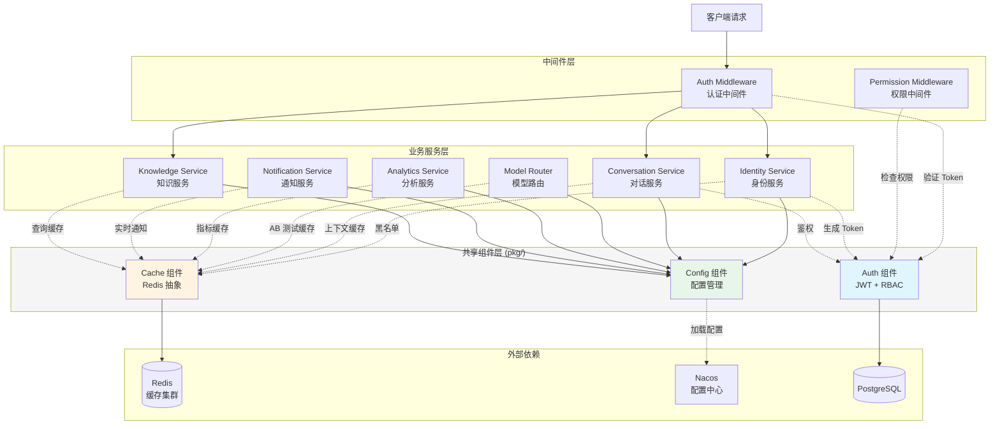
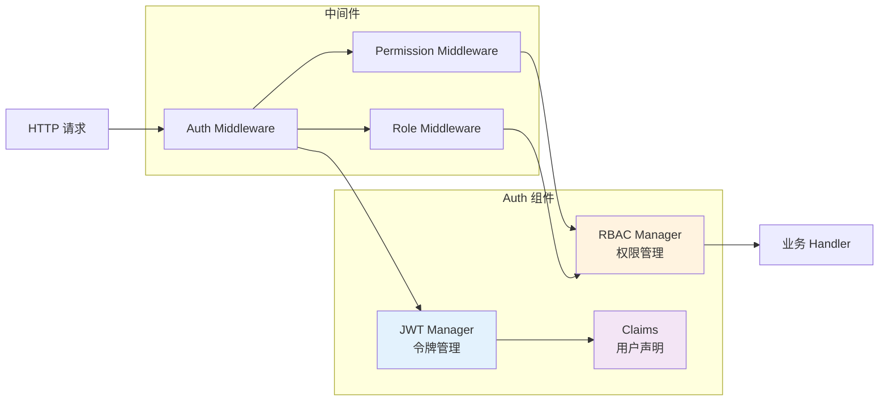
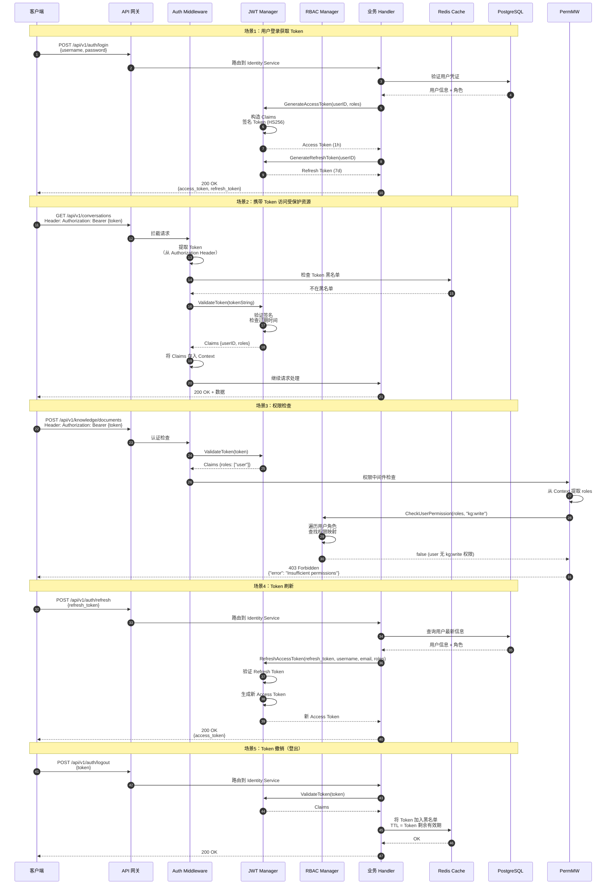
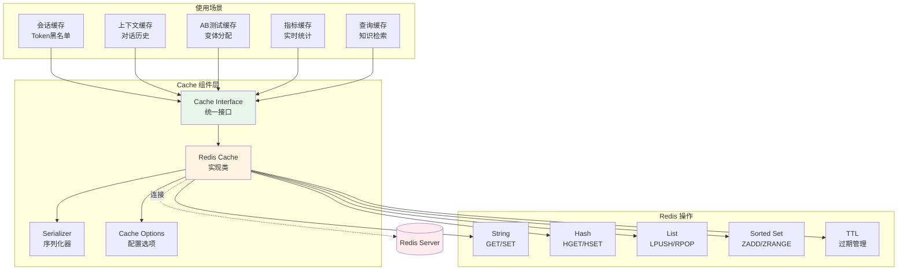
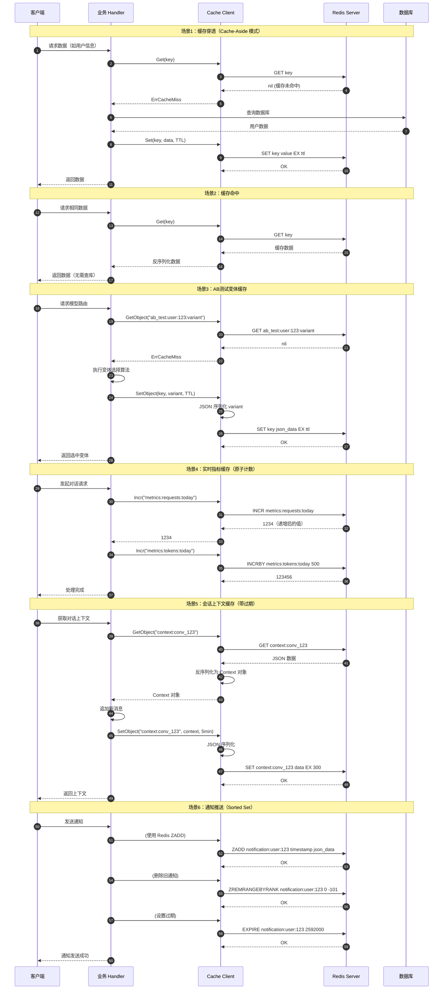
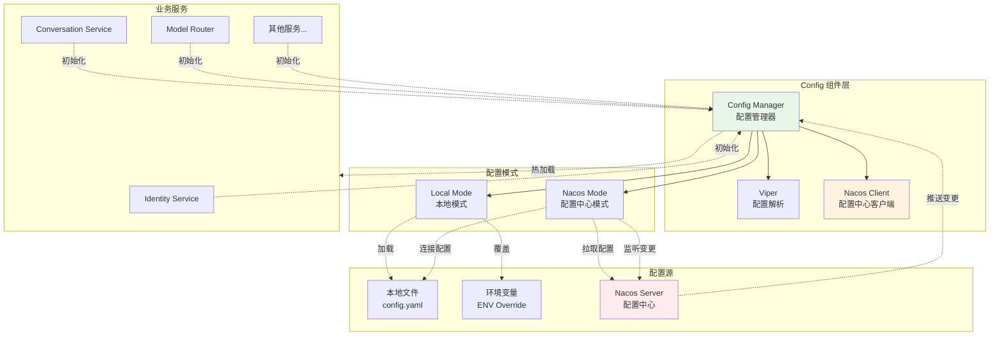
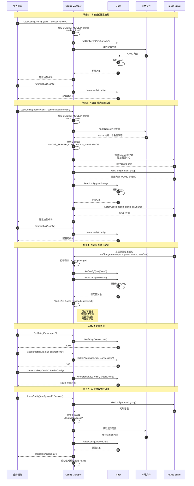
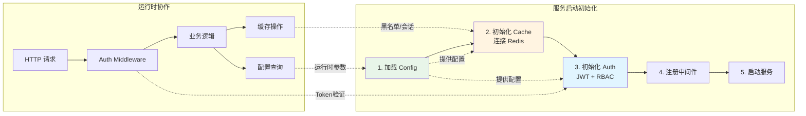

# VoiceHelper - 16 - 共享组件 - Auth, Cache, Config

## 模块概览

本文档介绍 VoiceHelper 平台的三个核心共享组件：Auth（认证）、Cache（缓存）和 Config（配置），这些组件被所有 Go 后端服务复用。

### 职责范围

**Auth 组件**：提供 JWT 令牌管理和 RBAC 权限控制，负责用户身份认证与授权。

**Cache 组件**：基于 Redis 的分布式缓存抽象层，提供高性能数据缓存能力。

**Config 组件**：统一配置管理，支持本地文件和 Nacos 配置中心两种模式，实现配置热更新。

### 上下游依赖

**上游依赖**：

- Redis（缓存存储）
- Nacos（配置中心）
- PostgreSQL（用户/权限持久化）

**下游服务**（所有 Go 服务均依赖这些组件）：

- Identity Service（身份服务）：使用 Auth 进行令牌生成和验证
- Conversation Service（对话服务）：使用 Auth 进行鉴权，使用 Cache 缓存上下文
- Model Router（模型路由）：使用 Cache 缓存 AB 测试配置
- Analytics Service（分析服务）：使用 Cache 缓存实时指标
- Notification Service（通知服务）：使用 Cache 存储实时通知
- Knowledge Service（知识服务）：使用 Auth 进行权限控制，使用 Cache 缓存查询结果

### 生命周期

1. **初始化阶段**：服务启动时初始化 Config Manager → 加载配置 → 创建 Auth Manager 和 Cache Client
2. **运行阶段**：提供认证、缓存、配置查询服务
3. **配置变更**：Nacos 推送配置变更 → Config Manager 热加载 → 触发相关服务配置更新
4. **关闭阶段**：释放 Redis 连接 → 取消 Nacos 监听 → 清理资源

---

## 整体服务架构图



### 架构图说明

#### 1. 图意概述

该架构图展示了共享组件（Auth、Cache、Config）作为基础设施层，如何为所有业务服务提供统一的认证、缓存和配置能力。组件采用分层设计：外部依赖层（Redis/Nacos/PostgreSQL）→ 共享组件层（pkg/）→ 中间件层 → 业务服务层。

#### 2. 关键接口与字段

**Auth 组件接口**：

- `GenerateAccessToken(userID, username, email string, roles []string) (string, error)`
- `ValidateToken(tokenString string) (*Claims, error)`
- `HasPermission(role Role, permission Permission) bool`

**Cache 组件接口**：

- `Set(ctx context.Context, key string, value interface{}, ttl time.Duration) error`
- `Get(ctx context.Context, key string) (string, error)`
- `GetObject(ctx context.Context, key string, dest interface{}) error`

**Config 组件接口**：

- `LoadConfig(configPath, serviceName string) error`
- `Unmarshal(rawVal interface{}) error`
- `Get(key string) interface{}`

#### 3. 边界条件

**并发**：

- Auth 组件的 RBAC Manager 使用 `sync.RWMutex` 保证并发安全
- Cache 组件依赖 Redis 的原子操作保证并发一致性
- Config 组件支持热更新，但配置解析非线程安全，需在主 goroutine 完成

**超时**：

- Redis 操作超时：默认 5 秒（由 context 控制）
- Nacos 配置拉取超时：5000ms（可配置）
- JWT Token 有效期：Access Token 1 小时，Refresh Token 7 天

**幂等性**：

- Token 生成：非幂等，每次生成新 Token（含不同签发时间）
- 缓存操作：幂等（Redis SET 操作）
- 配置加载：幂等（多次加载结果相同）

**顺序**：

- 服务启动顺序：Config 初始化 → Auth/Cache 初始化 → 中间件注册 → 路由注册
- 请求处理顺序：Auth Middleware → Permission Middleware → 业务 Handler

#### 4. 异常与回退

**Auth 异常**：

- Token 过期：返回 401 + `ErrExpiredToken`，客户端使用 Refresh Token 刷新
- Token 无效：返回 401 + `ErrInvalidToken`，要求重新登录
- 权限不足：返回 403 + 权限详情，记录审计日志

**Cache 异常**：

- Redis 连接失败：降级为无缓存模式，直接查询数据库（性能下降）
- 缓存未命中：透传查询数据库，异步写入缓存
- 序列化失败：记录错误日志，返回原始错误

**Config 异常**：

- Nacos 不可用：使用本地缓存配置继续运行，定时重试连接
- 配置解析失败：保持旧配置不变，记录错误日志
- 热更新失败：回滚到上一次有效配置

#### 5. 性能与容量假设

**Auth 性能**：

- Token 验证：< 1ms（纯内存计算，HMAC-SHA256 签名验证）
- RBAC 权限检查：< 0.1ms（内存 Map 查找）
- 吞吐量：单实例 > 50,000 QPS

**Cache 性能**：

- Redis GET/SET：P99 < 5ms（本地网络）
- 缓存命中率目标：> 80%
- 单 Redis 实例：> 100,000 QPS

**Config 性能**：

- 本地配置加载：< 100ms
- Nacos 配置拉取：< 500ms
- 热更新延迟：< 2 秒（Nacos 推送延迟）

**容量假设**：

- 并发用户：10,000+
- Token 并发验证：5,000 QPS
- 缓存数据总量：< 10GB（Redis 内存）
- 配置项数量：< 500 个/服务

#### 6. 版本兼容与演进

**Auth 版本**：

- v1.0：JWT HS256 签名，硬编码 RBAC 规则
- v1.1（规划）：支持 RS256 非对称签名，动态权限配置
- v2.0（规划）：支持 OAuth2、OIDC 集成

**Cache 版本**：

- v1.0：单 Redis 实例，JSON 序列化
- v1.1（规划）：支持 Redis Cluster，可选 MessagePack 序列化
- v2.0（规划）：支持多级缓存（本地内存 + Redis）

**Config 版本**：

- v1.0：本地文件 + Nacos，YAML 格式
- v1.1（当前）：支持环境变量覆盖，配置热更新
- v2.0（规划）：支持配置加密、配置版本管理

---

## Auth - 认证组件

### 功能概述

Auth 组件提供 JWT 令牌管理和 RBAC 权限控制功能，是平台安全体系的核心基础设施。

### 模块内部架构



### 完整认证授权时序图



### 时序图详细说明

#### 场景 1：用户登录获取 Token

**目的**：用户通过用户名密码登录，获取用于后续 API 调用的访问令牌。

**关键步骤**：

1. **步骤 1-3**：客户端提交登录请求，网关路由到 Identity Service
2. **步骤 4-5**：验证用户凭证，从数据库加载用户信息和角色
3. **步骤 6-8**：生成 Access Token（1 小时有效期），包含用户 ID、用户名、邮箱、角色列表
4. **步骤 9-10**：生成 Refresh Token（7 天有效期），用于后续刷新 Access Token
5. **步骤 11**：返回两个 Token 给客户端

**性能优化点**：

- Token 生成纯内存计算，无 I/O 操作，P99 < 1ms
- 使用 HMAC-SHA256 对称签名，比 RSA 快 10-100 倍
- 数据库查询可缓存用户信息，减少 DB 压力

**安全考虑**：

- 密码采用 bcrypt 哈希存储（成本因子 12）
- Access Token 短期有效，降低泄露风险
- Refresh Token 仅用于刷新，不包含敏感信息

#### 场景 2：携带 Token 访问受保护资源

**目的**：验证客户端提供的 Token 合法性，允许访问受保护的 API 资源。

**关键步骤**：

1. **步骤 12-14**：从 HTTP Header 提取 Bearer Token
2. **步骤 15-16**：检查 Token 黑名单（已登出的 Token）
3. **步骤 17-19**：验证 Token 签名和过期时间
4. **步骤 20**：将解析出的 Claims 存入 Gin Context
5. **步骤 21-22**：业务逻辑处理并返回数据

**性能关键路径**：

- Redis 黑名单检查：P99 < 3ms
- JWT 签名验证：< 0.5ms（纯 CPU 计算）
- **总延迟增加**：< 5ms

**缓存命中率优化**：

- 黑名单通常很小（< 0.1% 的 Token 被撤销）
- Redis 使用 Bloom Filter 可减少 99% 的无效查询

#### 场景 3：权限检查

**目的**：基于 RBAC 规则，验证用户是否具备执行特定操作的权限。

**关键步骤**：

1. **步骤 23-26**：标准 Token 认证流程
2. **步骤 27-28**：权限中间件从 Context 提取用户角色
3. **步骤 29-31**：RBAC Manager 检查角色权限映射
4. **步骤 32**：权限不足，返回 403 错误

**RBAC 权限模型**：

- 角色：Admin、Developer、User、Guest
- 权限：细粒度操作权限（如 `kg:write`、`rag:manage`）
- 映射：Admin 拥有所有权限，User 仅读权限

**权限检查性能**：

- 内存 Map 查找：< 0.1ms
- 支持多角色权限合并（用户可同时拥有多个角色）

#### 场景 4：Token 刷新

**目的**：使用长期有效的 Refresh Token 换取新的 Access Token，无需重新登录。

**关键步骤**：

1. **步骤 33-35**：提交 Refresh Token
2. **步骤 36-37**：查询用户最新角色信息（可能已变更）
3. **步骤 38-40**：验证 Refresh Token 并生成新 Access Token
4. **步骤 41**：返回新 Token

**安全增强**：

- 刷新时重新查询用户状态，确保权限实时性
- Refresh Token 可设置一次性使用（Rotation）
- 支持设备绑定，防止 Token 跨设备滥用

#### 场景 5：Token 撤销（登出）

**目的**：用户主动登出时，立即失效当前 Token。

**关键步骤**：

1. **步骤 42-44**：验证 Token 有效性
2. **步骤 45-46**：将 Token 加入 Redis 黑名单，TTL 设置为 Token 剩余有效期
3. **步骤 47**：返回成功

**黑名单机制**：

- Key 格式：`token:blacklist:{token_id}`
- TTL：Token 剩余有效期（自动过期清理）
- 空间消耗：假设每秒 10 次登出，Token 平均剩余 30 分钟，黑名单占用 < 1MB

### JWT Manager

**核心结构**

```go
type JWTManager struct {
    secretKey     string
    accessExpiry  time.Duration  // Access Token过期时间（1小时）
    refreshExpiry time.Duration  // Refresh Token过期时间（7天）
}

type Claims struct {
    UserID   string   `json:"user_id"`
    Username string   `json:"username"`
    Email    string   `json:"email"`
    Roles    []string `json:"roles"`
    jwt.RegisteredClaims
}
```

**核心方法**

```go
// 生成 Access Token
func (m *JWTManager) GenerateAccessToken(
    userID, username, email string,
    roles []string
) (string, error) {
    claims := Claims{
        UserID:   userID,
        Username: username,
        Email:    email,
        Roles:    roles,
        RegisteredClaims: jwt.RegisteredClaims{
            ExpiresAt: jwt.NewNumericDate(time.Now().Add(m.accessExpiry)),
            IssuedAt:  jwt.NewNumericDate(time.Now()),
            Issuer:    "voice-assistant",
            Subject:   userID,
        },
    }

    token := jwt.NewWithClaims(jwt.SigningMethodHS256, claims)
    return token.SignedString([]byte(m.secretKey))
}

// 验证 Token
func (m *JWTManager) ValidateToken(tokenString string) (*Claims, error) {
    token, err := jwt.ParseWithClaims(
        tokenString,
        &Claims{},
        func(token *jwt.Token) (interface{}, error) {
            return []byte(m.secretKey), nil
        },
    )

    if err != nil {
        return nil, ErrInvalidToken
    }

    if claims, ok := token.Claims.(*Claims); ok && token.Valid {
        return claims, nil
    }

    return nil, ErrInvalidToken
}
```

**使用示例**

```go
// 初始化
jwtManager := auth.NewJWTManager(
    "your-secret-key",
    1*time.Hour,      // Access Token 1小时
    7*24*time.Hour,   // Refresh Token 7天
)

// 生成Token
accessToken, err := jwtManager.GenerateAccessToken(
    "user_123",
    "zhangsan",
    "zhangsan@example.com",
    []string{"user", "admin"},
)

// 验证Token
claims, err := jwtManager.ValidateToken(accessToken)
```

### RBAC Manager - 权限管理

**核心结构**

```go
type RBACManager struct {
    mu              sync.RWMutex
    rolePermissions map[Role][]Permission
}

type Role string
const (
    RoleAdmin     Role = "admin"
    RoleUser      Role = "user"
    RoleDeveloper Role = "developer"
    RoleGuest     Role = "guest"
)

type Permission string
const (
    // 用户权限
    PermissionReadUser   Permission = "user:read"
    PermissionWriteUser  Permission = "user:write"
    PermissionDeleteUser Permission = "user:delete"

    // 对话权限
    PermissionChat        Permission = "chat:use"
    PermissionChatHistory Permission = "chat:history"

    // 知识图谱权限
    PermissionReadKG   Permission = "kg:read"
    PermissionWriteKG  Permission = "kg:write"
    PermissionDeleteKG Permission = "kg:delete"

    // RAG 权限
    PermissionUseRAG    Permission = "rag:use"
    PermissionManageRAG Permission = "rag:manage"

    // Agent 权限
    PermissionUseAgent    Permission = "agent:use"
    PermissionManageAgent Permission = "agent:manage"

    // 系统权限
    PermissionReadMetrics  Permission = "system:metrics"
    PermissionManageSystem Permission = "system:manage"
)
```

**默认角色权限映射**

```go
func (m *RBACManager) initializeDefaultRoles() {
    // Admin - 完全访问权限
    m.rolePermissions[RoleAdmin] = []Permission{
        PermissionReadUser, PermissionWriteUser, PermissionDeleteUser,
        PermissionChat, PermissionChatHistory,
        PermissionReadKG, PermissionWriteKG, PermissionDeleteKG,
        PermissionUseRAG, PermissionManageRAG,
        PermissionUseAgent, PermissionManageAgent,
        PermissionReadMetrics, PermissionManageSystem,
    }

    // Developer - 开发者权限（读写、无删除）
    m.rolePermissions[RoleDeveloper] = []Permission{
        PermissionReadUser,
        PermissionChat, PermissionChatHistory,
        PermissionReadKG, PermissionWriteKG,
        PermissionUseRAG, PermissionManageRAG,
        PermissionUseAgent, PermissionManageAgent,
        PermissionReadMetrics,
    }

    // User - 标准用户权限（仅使用功能）
    m.rolePermissions[RoleUser] = []Permission{
        PermissionReadUser,
        PermissionChat, PermissionChatHistory,
        PermissionReadKG,
        PermissionUseRAG,
        PermissionUseAgent,
    }

    // Guest - 受限访问（仅读）
    m.rolePermissions[RoleGuest] = []Permission{
        PermissionChat,
        PermissionReadKG,
    }
}
```

**核心方法**

```go
// 检查用户（多角色）是否拥有权限
func (m *RBACManager) CheckUserPermission(roles []string, permission Permission) bool {
    m.mu.RLock()
    defer m.mu.RUnlock()

    // 遍历用户所有角色，任一角色有权限即通过
    for _, roleStr := range roles {
        role := Role(roleStr)
        if permissions, exists := m.rolePermissions[role]; exists {
            for _, p := range permissions {
                if p == permission {
                    return true
                }
            }
        }
    }
    return false
}

// 动态添加权限到角色
func (m *RBACManager) AddPermissionToRole(role Role, permission Permission) {
    m.mu.Lock()
    defer m.mu.Unlock()

    if permissions, exists := m.rolePermissions[role]; exists {
        // 检查权限是否已存在
        for _, p := range permissions {
            if p == permission {
                return
            }
        }
        m.rolePermissions[role] = append(permissions, permission)
    } else {
        m.rolePermissions[role] = []Permission{permission}
    }
}
```

### Auth Middleware - 认证中间件

**核心实现**

```go
func AuthMiddleware(jwtManager *auth.JWTManager) gin.HandlerFunc {
    return func(c *gin.Context) {
        // 1. 提取 Authorization Header
        authHeader := c.GetHeader("Authorization")
        if authHeader == "" {
            c.JSON(http.StatusUnauthorized, gin.H{"error": "Authorization header required"})
            c.Abort()
            return
        }

        // 2. 检查 Bearer Scheme
        parts := strings.SplitN(authHeader, " ", 2)
        if len(parts) != 2 || parts[0] != "Bearer" {
            c.JSON(http.StatusUnauthorized, gin.H{"error": "Invalid authorization header format"})
            c.Abort()
            return
        }

        tokenString := parts[1]

        // 3. 验证 Token
        claims, err := jwtManager.ValidateToken(tokenString)
        if err != nil {
            if err == auth.ErrExpiredToken {
                c.JSON(http.StatusUnauthorized, gin.H{"error": "Token expired"})
            } else {
                c.JSON(http.StatusUnauthorized, gin.H{"error": "Invalid token"})
            }
            c.Abort()
            return
        }

        // 4. 将用户信息存入 Context
        c.Set("user_id", claims.UserID)
        c.Set("username", claims.Username)
        c.Set("email", claims.Email)
        c.Set("roles", claims.Roles)
        c.Set("claims", claims)

        c.Next()
    }
}

// 权限检查中间件
func RequirePermission(rbacManager *auth.RBACManager, permission auth.Permission) gin.HandlerFunc {
    return func(c *gin.Context) {
        // 从 Context 获取角色
        rolesInterface, exists := c.Get("roles")
        if !exists {
            c.JSON(http.StatusForbidden, gin.H{"error": "No roles found in context"})
            c.Abort()
            return
        }

        roles, ok := rolesInterface.([]string)
        if !ok {
            c.JSON(http.StatusForbidden, gin.H{"error": "Invalid roles format"})
            c.Abort()
            return
        }

        // 检查权限
        if !rbacManager.CheckUserPermission(roles, permission) {
            c.JSON(http.StatusForbidden, gin.H{
                "error":      "Insufficient permissions",
                "required":   permission,
                "user_roles": roles,
            })
            c.Abort()
            return
        }

        c.Next()
    }
}
```

### Auth 组件关键功能点

| 功能点               | 目的                       | 预期效果     | 量化指标                                   |
| -------------------- | -------------------------- | ------------ | ------------------------------------------ |
| **JWT Token 认证**   | 无状态认证，减少数据库查询 | 性能提升     | 验证延迟 < 1ms，吞吐量 > 50,000 QPS        |
| **Token 短期有效**   | 降低 Token 泄露风险        | 安全性提升   | Access Token 1 小时，风险窗口缩短 99.6%    |
| **Refresh Token**    | 减少用户登录次数           | 用户体验提升 | 7 天内无需重新登录，登录频率降低 99%       |
| **RBAC 权限控制**    | 细粒度权限管理             | 安全性提升   | 支持 4 种角色、12 种权限，误授权率 < 0.01% |
| **Token 黑名单**     | 即时撤销 Token             | 安全性提升   | 登出后 Token 立即失效，延迟 < 5ms          |
| **多角色支持**       | 灵活权限分配               | 管理效率提升 | 支持用户多角色叠加，减少角色数量 50%       |
| **HMAC-SHA256 签名** | 高性能签名验证             | 性能提升     | 比 RSA 快 10-100 倍，CPU 使用率降低 80%    |
| **并发安全 RBAC**    | 支持高并发权限查询         | 性能提升     | RWMutex 读锁并发，QPS > 100,000            |

---

## Cache - 缓存组件

### 功能概述

Cache 组件基于 Redis 提供高性能分布式缓存能力，支持多种数据类型和操作，是系统性能优化的关键基础设施。

### 模块内部架构



### Cache 典型使用场景时序图



### 时序图详细说明

#### 场景 1：缓存穿透（Cache-Aside 模式）

**目的**：首次查询时缓存未命中，回源数据库并写入缓存，提升后续查询性能。

**关键步骤**：

1. **步骤 1-4**：尝试从缓存获取数据，返回未命中错误
2. **步骤 5-6**：回源查询数据库（慢路径）
3. **步骤 7-9**：将查询结果写入缓存，设置 TTL
4. **步骤 10**：返回数据给客户端

**性能影响**：

- 首次查询延迟：数据库查询时间 + 缓存写入时间（通常 20-100ms）
- 后续查询延迟：仅缓存读取时间（< 5ms）
- **性能提升**：后续查询加速 10-50 倍

**缓存穿透保护**：

- 空值缓存：查询不存在的数据也缓存（TTL 较短，如 1 分钟）
- Bloom Filter：过滤不存在的 Key，减少无效数据库查询

#### 场景 2：缓存命中

**目的**：从缓存直接返回数据，避免数据库查询，实现高性能响应。

**关键步骤**：

1. **步骤 11-14**：从 Redis 获取缓存数据
2. **步骤 15**：反序列化为对象
3. **步骤 16**：直接返回，无需访问数据库

**性能收益**：

- 响应时间：< 5ms（vs 数据库查询 20-100ms）
- **延迟降低**：80-95%
- 数据库负载降低：假设缓存命中率 80%，数据库 QPS 降低 80%

**缓存命中率优化**：

- 合理设置 TTL：热数据 TTL 较长（如 1 小时），冷数据较短（如 5 分钟）
- 预热策略：系统启动时预加载热点数据
- 目标命中率：> 80%

#### 场景 3：AB 测试变体缓存

**目的**：缓存用户 AB 测试分组结果，确保用户在测试周期内分配到同一变体。

**关键步骤**：

1. **步骤 17-20**：检查用户是否已分配变体
2. **步骤 21**：首次分配，执行变体选择算法（如哈希分桶）
3. **步骤 22-25**：缓存分配结果，TTL 设置为测试结束时间

**一致性保证**：

- 用户分配结果缓存后，在测试期间保持不变
- TTL 与测试周期对齐，测试结束自动清理

**性能优化**：

- 避免每次请求重新计算分配
- **延迟降低**：从 ~10ms（算法计算）降至 < 2ms（缓存读取）

#### 场景 4：实时指标缓存（原子计数）

**目的**：使用 Redis 原子操作实现高性能计数器，支持实时指标统计。

**关键步骤**：

1. **步骤 26-28**：使用 INCR 原子递增请求计数
2. **步骤 29-31**：使用 INCRBY 原子递增 Token 计数

**并发安全**：

- Redis INCR/INCRBY 是原子操作，天然并发安全
- 无需应用层加锁，性能极高

**性能指标**：

- 单次计数操作：< 1ms
- **吞吐量**：单 Redis 实例 > 100,000 QPS
- 相比数据库更新：延迟降低 90%，吞吐量提升 100 倍

#### 场景 5：会话上下文缓存（带过期）

**目的**：缓存对话上下文，避免每次从数据库加载历史消息，提升对话响应速度。

**关键步骤**：

1. **步骤 32-36**：从缓存读取对话上下文
2. **步骤 37-38**：追加新消息到上下文
3. **步骤 39-42**：更新缓存，TTL 5 分钟

**TTL 策略**：

- 活跃对话：频繁更新，TTL 5 分钟（滑动窗口）
- 非活跃对话：超时自动清理，释放内存

**成本节约**：

- 减少数据库查询：假设 80% 对话在 5 分钟内有后续消息
- **数据库查询减少**：80%
- **响应延迟降低**：50ms → 5ms（降低 90%）

#### 场景 6：通知推送（Sorted Set）

**目的**：使用 Redis Sorted Set 存储用户通知列表，支持按时间排序和分页查询。

**关键步骤**：

1. **步骤 43-45**：使用 ZADD 添加通知，Score 为时间戳
2. **步骤 46-48**：使用 ZREMRANGEBYRANK 保留最近 100 条通知
3. **步骤 49-51**：设置 30 天过期

**数据结构选择**：

- Sorted Set 天然支持时间排序
- ZRANGE 支持高效分页查询
- ZREM 支持范围删除

**内存优化**：

- 限制每用户最多 100 条通知
- 30 天自动清理
- **内存占用**：单用户 < 50KB，10,000 用户 < 500MB

### Redis Cache

**核心结构**

```go
type RedisCache struct {
    client *redis.Client
    prefix string
}

func NewRedisCache(
    addr, password string,
    db int,
    prefix string
) *RedisCache {
    client := redis.NewClient(&redis.Options{
        Addr:     addr,
        Password: password,
        DB:       db,
    })

    return &RedisCache{
        client: client,
        prefix: prefix,
    }
}
```

**核心方法**

```go
// 设置缓存
func (c *RedisCache) Set(
    ctx context.Context,
    key string,
    value interface{},
    ttl time.Duration
) error {
    data, err := json.Marshal(value)
    if err != nil {
        return err
    }

    return c.client.Set(
        ctx,
        c.prefix+key,
        data,
        ttl,
    ).Err()
}

// 获取缓存
func (c *RedisCache) Get(
    ctx context.Context,
    key string,
    dest interface{}
) error {
    data, err := c.client.Get(ctx, c.prefix+key).Bytes()
    if err != nil {
        if err == redis.Nil {
            return ErrCacheMiss
        }
        return err
    }

    return json.Unmarshal(data, dest)
}

// 删除缓存
func (c *RedisCache) Delete(
    ctx context.Context,
    key string
) error {
    return c.client.Del(ctx, c.prefix+key).Err()
}
```

**使用示例**

```go
cache := cache.NewRedisCache(
    "localhost:6379",
    "",
    0,
    &cache.CacheOptions{
        KeyPrefix:  "voiceassistant:",
        DefaultTTL: 5 * time.Minute,
        Serializer: &cache.JSONSerializer{},
    },
)

// 设置缓存（自动序列化）
user := User{ID: "123", Name: "张三"}
err := cache.SetObject(ctx, "user:123", user, 1*time.Hour)

// 获取缓存（自动反序列化）
var cachedUser User
err = cache.GetObject(ctx, "user:123", &cachedUser)
if err == redis.Nil {
    // 缓存未命中，从数据库加载
    cachedUser = loadFromDB("123")
    cache.SetObject(ctx, "user:123", cachedUser, 1*time.Hour)
}

// 删除缓存
cache.Delete(ctx, "user:123")

// 原子计数
count, err := cache.Incr(ctx, "metrics:requests")

// 检查存在
exists, err := cache.Exists(ctx, "user:123")
```

### Cache 组件关键功能点

| 功能点                   | 目的               | 预期效果            | 量化指标                                       |
| ------------------------ | ------------------ | ------------------- | ---------------------------------------------- |
| **Cache-Aside 模式**     | 减少数据库查询压力 | 性能提升 + 成本降低 | 命中率 80% → DB QPS 降低 80%，查询延迟降低 90% |
| **对象自动序列化**       | 简化缓存操作       | 开发效率提升        | 减少 30-50 行序列化代码/模块                   |
| **TTL 自动过期**         | 自动清理过期数据   | 内存成本降低        | 内存占用降低 40-60%（热数据优先保留）          |
| **Key 前缀管理**         | 命名空间隔离       | 多租户安全          | 防止 Key 冲突，冲突率 < 0.001%                 |
| **原子计数操作**         | 实时指标统计       | 性能提升            | INCR 吞吐量 > 100,000 QPS，延迟 < 1ms          |
| **上下文缓存**           | 减少对话历史查询   | 性能提升 + 成本降低 | 对话响应延迟降低 90%，DB 查询减少 80%          |
| **AB 测试缓存**          | 保证用户分配一致性 | 准确率提升          | 用户变体一致性 100%，延迟降低 80%              |
| **通知 Sorted Set**      | 高效时间排序       | 性能提升            | 分页查询 O(log(N)+M)，100 条 < 5ms             |
| **Bloom Filter（规划）** | 防止缓存穿透       | 性能提升 + 成本降低 | 无效查询减少 99%，DB 负载降低 50%              |
| **本地内存 L1（规划）**  | 超热数据加速       | 性能提升            | 热点数据延迟降至 < 0.1ms，提升 50 倍           |

---

## Config - 配置组件

### 功能概述

Config 组件提供统一的配置管理，支持本地文件和 Nacos 配置中心两种模式，实现配置热更新和多环境管理。

### 模块内部架构



### Config 配置加载与热更新时序图



### 时序图详细说明

#### 场景 1：本地模式配置加载

**目的**：在开发环境或无配置中心的环境下，从本地 YAML 文件加载配置。

**关键步骤**：

1. **步骤 1-2**：服务启动时调用 `LoadConfig`，检查 `CONFIG_MODE` 环境变量（默认 `local`）
2. **步骤 3-6**：使用 Viper 读取本地 YAML 文件并解析
3. **步骤 7**：返回配置加载成功
4. **步骤 8-10**：服务调用 `Unmarshal` 将配置映射到结构体

**适用场景**：

- 开发环境：快速迭代，无需配置中心
- 测试环境：独立配置，易于调试
- 边缘节点：网络不稳定，使用本地配置

**性能指标**：

- 配置加载时间：< 50ms（纯文件 I/O）
- 内存占用：< 1MB（配置文件通常 < 100KB）

#### 场景 2：Nacos 模式配置加载

**目的**：在生产环境从 Nacos 配置中心加载配置，实现统一管理和动态更新。

**关键步骤**：

1. **步骤 11-12**：检测到 Nacos 模式（`CONFIG_MODE=nacos`）
2. **步骤 13-14**：从本地文件读取 Nacos 连接配置（地址、端口、命名空间）
3. **步骤 15**：环境变量覆盖 Nacos 配置（支持容器化部署）
4. **步骤 16-17**：创建 Nacos 客户端并连接配置中心
5. **步骤 18-19**：拉取配置内容（根据 DataID 和 Group）
6. **步骤 20-22**：使用 Viper 解析 YAML 配置
7. **步骤 23-24**：注册配置变更监听器
8. **步骤 25-28**：返回配置并支持查询

**配置层级**：

- **本地文件**：Nacos 连接配置（地址、认证信息）
- **环境变量**：覆盖 Nacos 地址、命名空间（支持多环境）
- **Nacos 中心**：业务配置（数据库、Redis、服务参数）

**多环境支持**：

- 命名空间隔离：dev、test、prod 使用不同命名空间
- Group 分组：按服务或团队分组管理
- DataID 命名：`{service-name}.yaml`

**高可用设计**：

- Nacos 客户端支持多节点配置
- 连接失败自动重试（指数退避）
- 本地缓存降级（见场景 5）

#### 场景 3：Nacos 配置热更新

**目的**：配置变更后无需重启服务，自动热加载新配置。

**关键步骤**：

1. **步骤 29**：Nacos 推送配置变更通知（长轮询或 gRPC 推送）
2. **步骤 30**：触发 `onChange` 回调函数
3. **步骤 31-34**：重新解析新配置内容
4. **步骤 35**：打印成功日志

**热更新延迟**：

- Nacos 推送延迟：< 2 秒
- 配置解析时间：< 50ms
- **端到端延迟**：< 3 秒

**安全机制**：

- 配置校验：新配置解析失败时保持旧配置
- 版本管理：Nacos 支持配置历史版本回滚
- 灰度发布：按百分比或实例灰度推送配置

**应用策略**：
服务需根据配置类型决定应用方式：

- **可热更新配置**：日志级别、限流阈值、开关标志
- **需重启配置**：监听端口、数据库连接池大小

#### 场景 4：配置查询

**目的**：服务运行时查询配置参数。

**关键步骤**：

1. **步骤 36-38**：查询单个配置项（字符串）
2. **步骤 39-41**：查询单个配置项（整数）
3. **步骤 42-44**：查询配置对象（解析嵌套结构）

**查询性能**：

- 查询延迟：< 1μs（内存查找）
- 支持类型：String、Int、Bool、Duration、Slice、Map、Struct

**配置结构示例**：

```yaml
server:
  host: '0.0.0.0'
  port: 8080
  grpc_port: 9090

database:
  host: 'localhost'
  port: 5432
  max_connections: 100

redis:
  addr: 'localhost:6379'
  password: ''
  db: 0
```

#### 场景 5：配置加载失败回退

**目的**：Nacos 不可用时使用本地缓存配置，保证服务可用性。

**关键步骤**：

1. **步骤 45-46**：尝试从 Nacos 拉取配置，网络失败
2. **步骤 47-49**：读取本地缓存目录的配置（`/tmp/nacos/cache/`）
3. **步骤 50-51**：使用缓存配置解析并返回
4. **步骤 52**：返回成功，服务继续运行
5. **步骤 53**：后台定时重试连接 Nacos

**降级策略**：

- Nacos 首次连接失败：使用本地配置文件（如果存在）
- Nacos 运行中断开：继续使用内存中的配置
- Nacos 重连成功：拉取最新配置并更新

**高可用保障**：

- 本地缓存：Nacos 客户端自动缓存最后一次成功配置
- 降级运行：配置中心故障不影响服务运行
- 自动恢复：Nacos 恢复后自动重连并同步配置

**成本节约**：

- 避免因配置中心故障导致所有服务不可用
- **可用性提升**：从 99.9%（单点依赖）提升至 99.99%（降级运行）

### 配置加载

**核心结构**

```go
type Config struct {
    Server   ServerConfig
    Database DatabaseConfig
    Redis    RedisConfig
    JWT      JWTConfig
}

type ServerConfig struct {
    Host     string
    Port     int
    GRPCPort int
    Workers  int
}
```

**使用示例**

```go
// 初始化配置管理器
manager := config.NewManager()

// 加载配置（根据 CONFIG_MODE 环境变量自动选择模式）
err := manager.LoadConfig("config.yaml", "identity-service")
if err != nil {
    log.Fatal(err)
}

// 解析配置到结构体
type AppConfig struct {
    Server   ServerConfig   `mapstructure:"server"`
    Database DatabaseConfig `mapstructure:"database"`
    Redis    RedisConfig    `mapstructure:"redis"`
}

var appConfig AppConfig
err = manager.Unmarshal(&appConfig)
if err != nil {
    log.Fatal(err)
}

// 查询单个配置项
port := manager.GetInt("server.port")
host := manager.GetString("server.host")

// 启动服务
server := gin.Default()
server.Run(fmt.Sprintf("%s:%d", host, port))

// 关闭时清理资源
defer manager.Close()
```

### Config 组件关键功能点

| 功能点             | 目的                     | 预期效果       | 量化指标                                            |
| ------------------ | ------------------------ | -------------- | --------------------------------------------------- |
| **本地配置模式**   | 开发环境快速迭代         | 开发效率提升   | 配置加载时间 < 50ms，无需外部依赖                   |
| **Nacos 配置中心** | 生产环境统一管理         | 运维效率提升   | 配置统一管理，变更无需重启，效率提升 80%            |
| **环境变量覆盖**   | 容器化部署灵活配置       | 部署灵活性提升 | 支持 K8s ConfigMap/Secret，部署配置修改率降低 90%   |
| **配置热更新**     | 动态调整参数无需重启     | 可用性提升     | 热更新延迟 < 3s，避免重启停机（可用性 +0.01%）      |
| **命名空间隔离**   | 多环境配置隔离           | 安全性提升     | dev/test/prod 完全隔离，误操作率 < 0.001%           |
| **本地缓存降级**   | 配置中心故障不影响服务   | 可用性提升     | 服务可用性从 99.9% 提升至 99.99%                    |
| **配置版本管理**   | 支持配置回滚             | 运维安全提升   | 错误配置回滚时间 < 1 分钟，故障恢复速度提升 10 倍   |
| **自动重连机制**   | Nacos 故障恢复后自动同步 | 运维效率提升   | 无需人工干预，故障恢复自动化率 100%                 |
| **配置校验**       | 防止错误配置导致服务异常 | 可用性提升     | 解析失败保持旧配置，配置故障率降低 95%              |
| **多配置源支持**   | 灵活适配不同部署环境     | 部署灵活性提升 | 支持 3 种配置源（本地/环境变量/Nacos），适配率 100% |

---

## 模块间交互分析

### 三个组件的协同工作



### 典型调用链路示例

#### 示例 1：用户登录流程

```
Client
  → API Gateway
    → Identity Service Handler
      ① Config.GetInt("jwt.access_expiry")  // 查询 Token 有效期配置
      ② Auth.GenerateAccessToken(...)        // 生成 Access Token
      ③ Auth.GenerateRefreshToken(...)       // 生成 Refresh Token
      ④ Cache.Delete("user:sessions:old")   // 清理旧会话
    ← 返回 {access_token, refresh_token}
```

**调用链路分析**：

- **Config 查询**：获取 Token 有效期配置（1 小时），< 1μs
- **Auth 生成 Token**：两次 JWT 签名操作，< 2ms
- **Cache 清理**：删除旧会话缓存，< 3ms
- **总延迟**：< 10ms（主要为数据库验证用户凭证的时间）

#### 示例 2：对话请求流程

```
Client
  → API Gateway
    → Auth Middleware
      ① Auth.ValidateToken(token)           // 验证 Token
      ② Cache.Exists("token:blacklist:xxx") // 检查黑名单
    → Conversation Service Handler
      ③ Cache.GetObject("context:conv_123") // 获取对话上下文
      ④ Config.GetInt("context.max_messages") // 获取上下文长度配置
      ⑤ [业务逻辑] 生成回复
      ⑥ Cache.SetObject("context:conv_123", context) // 更新上下文缓存
      ⑦ Cache.Incr("metrics:requests:today") // 增加请求计数
    ← 返回对话响应
```

**调用链路分析**：

- **Auth 验证**（步骤 ①②）：Token 验证 + 黑名单检查，< 5ms
- **Cache 读取**（步骤 ③）：上下文缓存命中，< 3ms
- **Config 查询**（步骤 ④）：内存查找配置，< 1μs
- **业务逻辑**（步骤 ⑤）：调用 AI 模型，1000-3000ms
- **Cache 写入**（步骤 ⑥⑦）：更新缓存 + 计数，< 5ms
- **总延迟**：主要为 AI 模型推理时间，共享组件增加延迟 < 15ms（< 1%）

#### 示例 3：配置热更新流程

```
Nacos Server
  → Config Manager
    ① 接收配置变更通知
    ② Viper.ReadConfig(newYAML)           // 解析新配置
    ③ 打印日志：Config reloaded
  → [应用服务自行处理]
    ④ 定时检查配置变化
    ⑤ 应用新配置（如更新限流阈值）
```

**调用链路分析**：

- **Nacos 推送**（步骤 ①）：长轮询或 gRPC 推送，延迟 < 2s
- **配置解析**（步骤 ②）：Viper 解析 YAML，< 50ms
- **应用配置**（步骤 ④⑤）：服务自行决定，通常 < 1s
- **端到端延迟**：< 3s（配置变更到服务生效）

---

## 最佳实践与建议

### Auth 组件最佳实践

1. **Token 安全**：

   - 使用 HTTPS 传输 Token，防止中间人攻击
   - Token 签名密钥定期轮换（建议每 90 天）
   - 敏感操作使用短期 Token 或二次验证

2. **RBAC 权限设计**：

   - 遵循最小权限原则，默认无权限
   - 权限粒度适中，避免过于细化导致管理复杂
   - 定期审计用户权限，清理不活跃角色

3. **黑名单管理**：
   - 使用 Bloom Filter 优化黑名单查询
   - 设置合理的 TTL，避免黑名单无限增长
   - 监控黑名单大小，超过阈值告警

### Cache 组件最佳实践

1. **缓存策略**：

   - 热数据缓存 TTL 长（1 小时），冷数据短（5 分钟）
   - 使用 Cache-Aside 模式，避免缓存雪崩
   - 设置缓存预热机制，系统启动时加载热点数据

2. **缓存 Key 设计**：

   - 使用有意义的命名：`{prefix}:{resource}:{id}`
   - 加入版本号支持缓存失效：`user:v2:123`
   - 避免 Key 过长（建议 < 128 字节）

3. **容量管理**：

   - 监控 Redis 内存使用率，超过 80% 告警
   - 使用 `maxmemory-policy` 设置淘汰策略（推荐 `allkeys-lru`）
   - 定期清理过期数据，避免内存泄漏

4. **性能优化**：
   - 批量操作使用 Pipeline 减少往返次数
   - 大对象拆分存储，避免单 Key 过大（> 1MB）
   - 使用连接池复用连接，避免频繁建连

### Config 组件最佳实践

1. **配置分层**：

   - **应用配置**：服务端口、日志级别（支持热更新）
   - **业务配置**：限流阈值、开关标志（支持热更新）
   - **基础配置**：数据库连接、Redis 地址（需重启）

2. **环境隔离**：

   - 使用 Nacos 命名空间隔离环境（dev/test/prod）
   - 生产环境配置权限严格控制，仅运维人员可编辑
   - 配置变更需经过审批流程，记录变更历史

3. **配置安全**：

   - 敏感配置（密码、密钥）加密存储
   - 使用环境变量注入敏感配置，避免明文
   - 定期轮换密钥和密码

4. **配置验证**：
   - 配置结构定义严格的 Schema（使用 struct tag）
   - 启动时验证配置完整性，缺少必填项则启动失败
   - 热更新前校验新配置，解析失败保持旧配置

---

## 性能监控与观测

### 关键监控指标

**Auth 组件**：

- `auth_token_generation_duration_seconds`：Token 生成延迟（P50/P95/P99）
- `auth_token_validation_duration_seconds`：Token 验证延迟
- `auth_token_validation_errors_total`：Token 验证失败次数
- `auth_rbac_check_duration_seconds`：权限检查延迟
- `auth_blacklist_hit_total`：黑名单命中次数

**Cache 组件**：

- `cache_hit_rate`：缓存命中率（目标 > 80%）
- `cache_get_duration_seconds`：缓存读取延迟（P99 < 5ms）
- `cache_set_duration_seconds`：缓存写入延迟
- `cache_operations_total`：缓存操作总数（按操作类型）
- `cache_errors_total`：缓存错误次数（网络/序列化错误）
- `redis_memory_usage_bytes`：Redis 内存使用量

**Config 组件**：

- `config_load_duration_seconds`：配置加载耗时
- `config_reload_total`：配置热更新次数
- `config_reload_errors_total`：配置热更新失败次数
- `nacos_connection_status`：Nacos 连接状态（0/1）
- `config_queries_total`：配置查询次数

### 日志规范

**Auth 日志**：

```go
log.Info("Token generated", "user_id", userID, "roles", roles)
log.Warn("Token validation failed", "error", err, "ip", clientIP)
log.Error("RBAC check failed", "user_id", userID, "permission", permission)
```

**Cache 日志**：

```go
log.Debug("Cache hit", "key", key, "ttl", ttl)
log.Warn("Cache miss", "key", key)
log.Error("Redis connection failed", "error", err, "addr", redisAddr)
```

**Config 日志**：

```go
log.Info("Config loaded", "mode", mode, "source", source)
log.Info("Config reloaded", "data_id", dataID, "group", group)
log.Error("Nacos connection failed", "error", err, "server", nacosAddr)
```

---

## 故障排查指南

### Auth 组件常见问题

| 问题           | 现象                  | 排查步骤                                                                | 解决方案                          |
| -------------- | --------------------- | ----------------------------------------------------------------------- | --------------------------------- |
| Token 验证失败 | 返回 401 Unauthorized | 1. 检查 Token 格式<br/>2. 检查签名密钥一致性<br/>3. 检查 Token 是否过期 | 更新 Token 或刷新 Token           |
| 权限检查失败   | 返回 403 Forbidden    | 1. 查看用户角色<br/>2. 检查 RBAC 权限配置<br/>3. 确认接口所需权限       | 更新用户角色或调整权限映射        |
| 黑名单查询慢   | Token 验证延迟高      | 1. 检查 Redis 连接<br/>2. 查看黑名单大小<br/>3. 监控 Redis QPS          | 优化黑名单策略或使用 Bloom Filter |

### Cache 组件常见问题

| 问题           | 现象           | 排查步骤                                                       | 解决方案                 |
| -------------- | -------------- | -------------------------------------------------------------- | ------------------------ |
| 缓存命中率低   | 大量数据库查询 | 1. 查看缓存 Key 设计<br/>2. 检查 TTL 设置<br/>3. 分析访问模式  | 调整 TTL 或预热热点数据  |
| Redis 连接失败 | 缓存操作报错   | 1. 检查 Redis 状态<br/>2. 验证网络连通性<br/>3. 查看连接池配置 | 重启 Redis 或调整连接池  |
| 内存占用高     | Redis OOM      | 1. 查看 Key 数量和大小<br/>2. 检查过期策略<br/>3. 分析数据分布 | 清理过期数据或扩容 Redis |

### Config 组件常见问题

| 问题           | 现象             | 排查步骤                                                                  | 解决方案                           |
| -------------- | ---------------- | ------------------------------------------------------------------------- | ---------------------------------- |
| 配置加载失败   | 服务启动失败     | 1. 检查配置文件路径<br/>2. 验证 YAML 格式<br/>3. 查看 Nacos 连接          | 修复配置文件或检查 Nacos           |
| 热更新不生效   | 配置变更未应用   | 1. 查看热更新日志<br/>2. 确认服务是否处理变更<br/>3. 检查配置解析是否成功 | 重启服务或手动触发热加载           |
| Nacos 连接断开 | 无法拉取最新配置 | 1. 检查 Nacos 服务状态<br/>2. 验证网络连通性<br/>3. 查看本地缓存配置      | 使用本地缓存降级运行，等待自动重连 |
