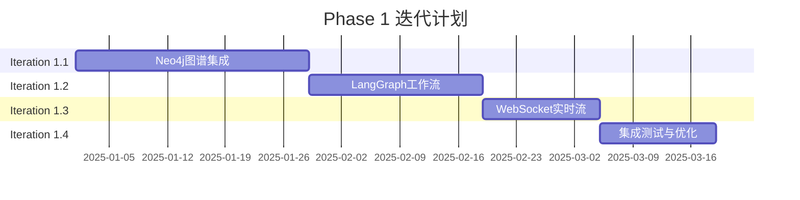

# VoiceAssistant 算法服务功能对齐 - 总览

---

## 📌 快速导航

本文档是VoiceAssistant算法服务功能对齐工作的总览和入口，提供快速理解和访问相关文档的路径。

### 核心文档

1. **[算法服务功能对比报告](./algo-services-comparison-report.md)** 🔍
   - 详细对比VoiceAssistant与VoiceHelper的功能差距
   - 识别10个关键差距项
   - 提供优先级排序和成本估算

2. **[算法服务迭代计划与详细实施方案](./algo-services-iteration-plan.md)** 📋
   - 6个月（36周）完整迭代计划
   - Phase 1详细实施方案（代码级）
   - API设计、架构图、测试用例

---

## 🎯 核心目标

将VoiceAssistant的算法服务能力对齐到VoiceHelper水平，重点提升：
- **知识图谱**：Neo4j集成，三路并行检索（Vector + BM25 + Graph）
- **Agent工作流**：LangGraph状态机，4节点循环
- **实时语音**：WebSocket双向通信，VAD触发ASR
- **高级功能**：社区检测、增量索引、情感识别

**整体对齐度目标**: 从当前60% → 85%以上

---

## 📊 功能差距概览

### P0 高优先级（前3个月）

| # | 差距项 | 当前状态 | 目标状态 | 工期 | 影响 |
|---|--------|---------|----------|------|------|
| 1 | **Neo4j知识图谱集成** | knowledge-service独立 | 集成到retrieval-service，三路并行 | 4周 | 🔴 高 |
| 2 | **LangGraph状态机** | 简单ReAct循环 | 4节点状态机工作流 | 3周 | 🔴 高 |
| 3 | **WebSocket实时流** | 仅HTTP批量 | 双向通信，VAD触发 | 2周 | 🔴 高 |

### P1 中优先级（中3个月）

| # | 差距项 | 当前状态 | 目标状态 | 工期 | 影响 |
|---|--------|---------|----------|------|------|
| 4 | **社区检测** | 无 | Leiden/Louvain算法 | 2周 | 🟡 中 |
| 5 | **增量索引** | 全量重建 | 版本管理+差异检测 | 3周 | 🟡 中 |
| 6 | **情感识别** | 无 | MFCC特征+分类模型 | 2周 | 🟡 中 |
| 7 | **工具权限升级** | 2级 | 5级权限+审计 | 1周 | 🟡 中 |

### P2 低优先级（后3个月）

| # | 差距项 | 当前状态 | 目标状态 | 工期 | 影响 |
|---|--------|---------|----------|------|------|
| 8 | **说话人分离** | 无 | Pyannote集成 | 3周 | 🟢 低 |
| 9 | **全双工打断** | 无 | 打断检测+TTS控制 | 2周 | 🟢 低 |
| 10 | **实体消歧** | 基础 | 向量相似度消歧 | 2周 | 🟢 低 |

---

## 🗓️ 迭代计划总览

### Phase 1: 知识图谱与核心工作流（Q1 2025，12周）



**交付成果**:
- ✅ retrieval-service支持三路并行检索
- ✅ agent-engine集成LangGraph
- ✅ voice-engine支持WebSocket实时流
- ✅ API文档、测试用例、性能基准

### Phase 2: 高级检索与智能处理（Q2 2025，12周）

**交付成果**:
- ✅ 社区检测算法上线
- ✅ 增量索引系统完成
- ✅ 情感识别集成
- ✅ 工具权限体系升级

### Phase 3: 高级语音与优化（Q3 2025，12周）

**交付成果**:
- ✅ 说话人分离功能
- ✅ 全双工打断处理
- ✅ 实体消歧算法
- ✅ 全面性能优化

---

## 💡 关键技术亮点

### 1. 三路并行检索架构

```
Query → 并行检索
         ├─ Vector (FAISS)    → 语义相似度
         ├─ BM25 (关键词)     → 精确匹配
         └─ Graph (Neo4j)     → 关系推理
                ↓
         RRF融合 (权重: 5:2:3)
                ↓
         Cross-Encoder重排
                ↓
         Top-K结果
```

**性能目标**: P95延迟 < 500ms

### 2. LangGraph 4节点状态机

```
Planner（规划）
    ↓
Executor（执行）
    ↓
Critic（反思）
    ↓
Synthesizer（综合）
```

**特性**:
- 条件边动态路由
- 自动状态管理
- 支持重新规划
- 最大迭代控制

### 3. WebSocket实时语音流

```
Client → 音频帧
         ↓
     VAD检测
         ↓
    静音触发
         ↓
     ASR识别
         ↓
  JSON结果返回
```

**性能目标**:
- VAD触发延迟 < 50ms
- ASR识别延迟 < 500ms
- 支持并发连接 ≥ 100

---

## 📈 成功标准

### 功能对齐度

| 维度 | 当前 | 目标 | 测量方法 |
|------|------|------|----------|
| 整体对齐度 | 60% | ≥ 85% | 功能矩阵覆盖率 |
| Agent能力 | 60% | ≥ 90% | 复杂任务成功率 |
| 语音能力 | 70% | ≥ 90% | 实时流稳定性 |
| 检索能力 | 50% | ≥ 85% | 混合检索召回率 |

### 性能指标

| 指标 | 目标值 | 备注 |
|------|--------|------|
| 混合检索P95延迟 | < 500ms | Vector+BM25+Graph |
| 实时语音流延迟 | < 100ms | VAD触发到识别 |
| Agent任务成功率 | ≥ 85% | 复杂任务 |
| 知识图谱准确率 | ≥ 80% | 实体关系提取 |
| 服务可用性 | ≥ 99.5% | 核心算法服务 |

### 质量指标

| 指标 | 目标值 | 备注 |
|------|--------|------|
| 代码覆盖率 | ≥ 80% | 核心模块 |
| API文档完整性 | 100% | 所有端点 |
| 性能测试通过率 | 100% | 基准测试 |
| 安全审计通过 | 100% | 工具权限、数据隐私 |

---

## 🛠️ 资源需求

### 人员配置（6个月）

| 角色 | 人数 | 全职 | 职责 |
|------|------|------|------|
| 算法工程师 | 2 | ✅ | Neo4j/LangGraph/NLP |
| 后端工程师 | 2 | ✅ | WebSocket/API/集成 |
| 测试工程师 | 1 | ✅ | 测试与质量保证 |
| 项目经理 | 1 | 50% | 进度管理 |
| **总计** | **6** | **5.5 FTE** | - |

**人力成本**: 约$180,000（6个月）

### 基础设施

| 组件 | 规格 | 数量 | 月成本 | 用途 |
|------|------|------|--------|------|
| Neo4j Enterprise | 8C16G, 500GB | 1 | $3,000 | 知识图谱 |
| Redis Cluster | 4C8G | 3节点 | $500 | 缓存/任务 |
| GPU服务器 | NVIDIA T4 | 2 | $1,500 | 情感识别 |
| **总计** | - | - | **$5,000** | - |

**基础设施成本**: $30,000（6个月）

### 总预算

| 类别 | 金额 | 占比 |
|------|------|------|
| 人力成本 | $180,000 | 79% |
| 基础设施 | $30,000 | 13% |
| 软件License | $6,000 | 3% |
| 杂项 | $12,000 | 5% |
| **总计** | **$228,000** | **100%** |

---

## 🚀 快速开始

### 1. 阅读对比报告（30分钟）

```bash
# 打开对比报告
open docs/algo-services-comparison-report.md
```

**重点关注**:
- 第2章：Agent执行引擎对比
- 第3章：语音处理引擎对比
- 第4章：知识检索引擎对比
- 第6章：功能差距优先级排序

### 2. 查看迭代计划（1小时）

```bash
# 打开迭代计划
open docs/algo-services-iteration-plan.md
```

**重点关注**:
- Iteration 1.1：Neo4j图谱集成（详细实施方案）
- Iteration 1.2：LangGraph工作流（代码示例）
- Iteration 1.3：WebSocket实时流（完整代码）

### 3. 启动POC验证（1-2天）

#### POC 1: Neo4j图谱集成

```bash
# 启动Neo4j
docker run -d \
  --name neo4j \
  -p 7474:7474 -p 7687:7687 \
  -e NEO4J_AUTH=neo4j/password \
  neo4j:5.15-community

# 测试连接
python tests/poc/test_neo4j_connection.py

# 导入测试数据
python tests/poc/load_neo4j_test_data.py

# 测试Graph检索
python tests/poc/test_graph_retrieval.py
```

#### POC 2: LangGraph工作流

```bash
# 安装LangGraph
pip install langgraph langchain

# 运行简单示例
python tests/poc/test_langgraph_simple.py

# 运行完整工作流
python tests/poc/test_langgraph_workflow.py
```

#### POC 3: WebSocket实时流

```bash
# 启动voice-engine
cd algo/voice-engine
python -m uvicorn main:app --host 0.0.0.0 --port 8004

# 在浏览器中打开测试页面
open static/test_voice_stream.html

# 或使用Python客户端测试
python tests/poc/test_websocket_client.py
```

### 4. 团队会议（1小时）

**议程**:
1. 对比报告解读（15分钟）
2. 迭代计划讨论（30分钟）
3. POC结果评审（10分钟）
4. 资源确认与启动决策（5分钟）

---

## 📋 检查清单

### 启动前检查

- [ ] 对比报告已阅读并理解
- [ ] 迭代计划已评审
- [ ] POC已完成验证
- [ ] 团队人员已到位
- [ ] 基础设施已准备
- [ ] 预算已批准
- [ ] 项目周报机制已建立

### Phase 1交付检查

- [ ] Neo4j图谱集成完成
- [ ] 三路并行检索上线
- [ ] LangGraph工作流集成
- [ ] WebSocket实时流上线
- [ ] API文档已更新
- [ ] 测试用例全部通过
- [ ] 性能基准达标
- [ ] 监控指标已配置

---

## 📞 联系与支持

### 文档维护

- **文档作者**: AI Assistant
- **创建日期**: 2025-10-27
- **最后更新**: 2025-10-27
- **版本**: v1.0

### 问题反馈

如有疑问或建议，请通过以下方式联系：
1. 提交GitHub Issue
2. 发送邮件至项目组
3. 在项目Wiki讨论

### 更新日志

| 版本 | 日期 | 变更说明 |
|------|------|----------|
| v1.0 | 2025-10-27 | 初版发布，包含对比报告和迭代计划 |

---

## 🔗 相关链接

### 内部文档

- [VoiceHelper-06-Agent Service源码剖析](./VoiceHelper-06-AgentService.md)
- [VoiceHelper-07-Voice Service源码剖析](./VoiceHelper-07-VoiceService.md)
- [VoiceHelper-08-GraphRAG Service源码剖析](./VoiceHelper-08-GraphRAGService.md)
- [算法服务功能对比报告](./algo-services-comparison-report.md)
- [算法服务迭代计划](./algo-services-iteration-plan.md)

### 外部参考

- [LangGraph官方文档](https://langchain-ai.github.io/langgraph/)
- [Neo4j Python Driver](https://neo4j.com/docs/api/python-driver/)
- [FastAPI WebSocket](https://fastapi.tiangolo.com/advanced/websockets/)
- [Silero VAD](https://github.com/snakers4/silero-vad)
- [Whisper ASR](https://github.com/openai/whisper)

### 技术博客

- [Building Production-Ready RAG with Neo4j](https://neo4j.com/blog/rag-knowledge-graphs/)
- [LangGraph: Multi-Agent Workflows](https://blog.langchain.dev/langgraph-multi-agent-workflows/)
- [Real-time Speech Recognition with WebSockets](https://web.dev/websockets/)

---

## 📊 进度跟踪

### 当前进度（模板）

```
Phase 1: ▓▓░░░░░░░░░░ 20% (Iteration 1.1进行中)
Phase 2: ░░░░░░░░░░░░  0% (未开始)
Phase 3: ░░░░░░░░░░░░  0% (未开始)

整体进度: ▓░░░░░░░░░░░  7% (Week 2/36)
```

### 里程碑

| 里程碑 | 目标日期 | 状态 | 备注 |
|--------|----------|------|------|
| Phase 1启动 | 2025-01-01 | 🟢 待启动 | - |
| Neo4j集成完成 | 2025-01-28 | ⚪ 未开始 | - |
| LangGraph集成完成 | 2025-02-18 | ⚪ 未开始 | - |
| WebSocket上线 | 2025-03-04 | ⚪ 未开始 | - |
| Phase 1交付 | 2025-03-18 | ⚪ 未开始 | - |
| Phase 2交付 | 2025-06-30 | ⚪ 未开始 | - |
| Phase 3交付 | 2025-09-30 | ⚪ 未开始 | - |

---

**祝项目顺利！🎉**

如有任何问题，请随时参考详细文档或联系项目组。
