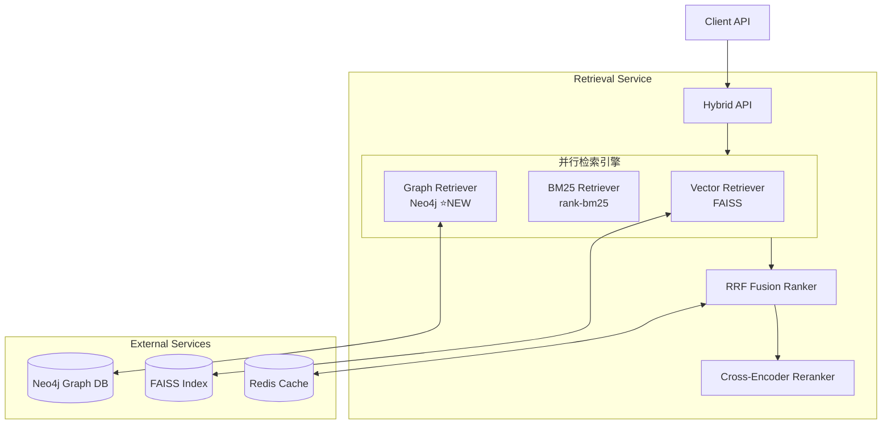
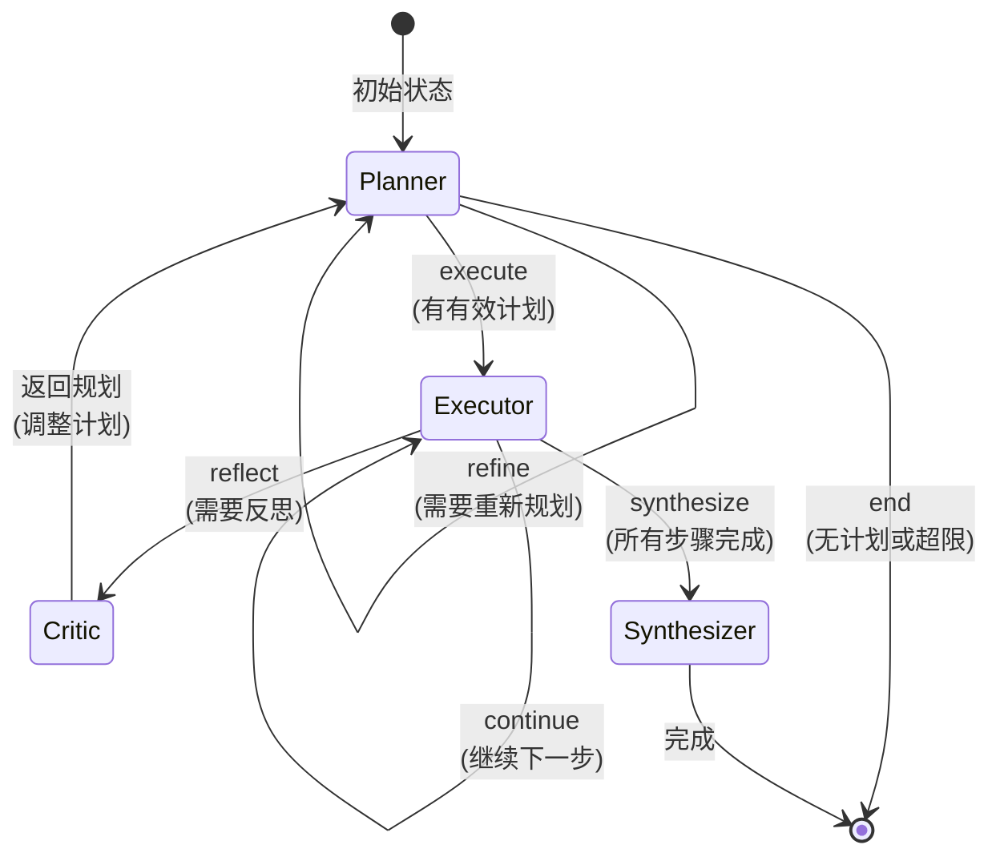
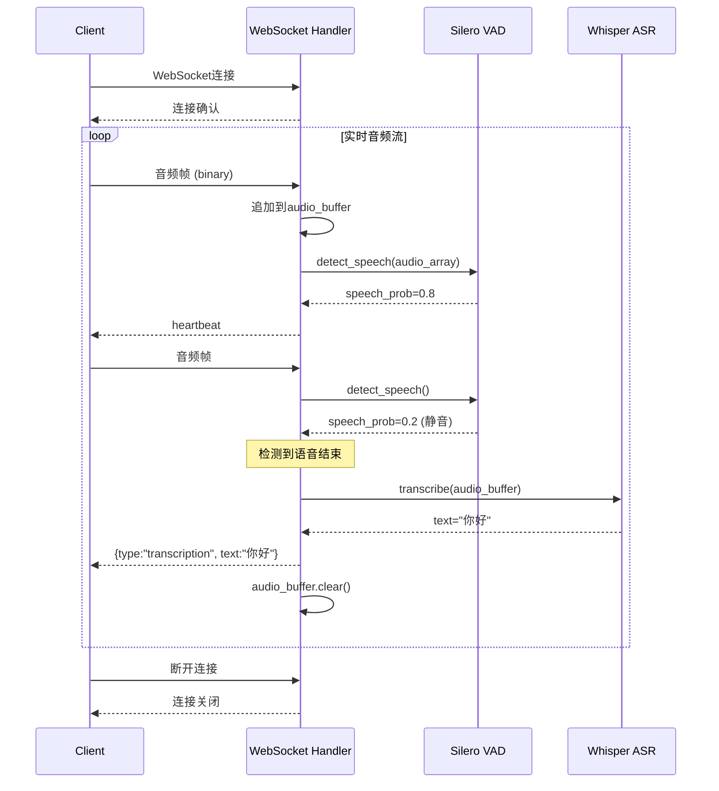

# VoiceAssistant 算法服务迭代计划与详细实施方案

---

## 📋 文档信息

**文档版本**: v1.0
**创建日期**: 2025-10-27
**适用项目**: VoiceAssistant
**规划周期**: 2025 Q1 - Q3 (6个月)
**相关文档**: [算法服务功能对比报告](./algo-services-comparison-report.md)

---

## 🎯 目标与范围

### 总体目标

对齐VoiceHelper算法服务功能，提升VoiceAssistant的AI能力，重点实现：
1. Neo4j知识图谱集成与三路并行检索
2. LangGraph状态机工作流
3. WebSocket实时语音流
4. 社区检测与增量索引
5. 情感识别与高级语音处理

### 成功标准

| 指标类别 | 指标名称 | 目标值 | 备注 |
|---------|----------|--------|------|
| **功能对齐度** | 整体对齐率 | ≥ 85% | 对标VoiceHelper |
| **性能指标** | 混合检索P95延迟 | < 500ms | Vector+BM25+Graph |
| **性能指标** | 实时语音流延迟 | < 100ms | VAD触发到识别 |
| **质量指标** | 知识图谱准确率 | ≥ 80% | 实体和关系提取 |
| **稳定性** | 服务可用性 | ≥ 99.5% | 核心算法服务 |

---

## 📅 迭代计划总览

### Phase 1: 知识图谱与核心工作流 (2025 Q1, 12周)

**目标**: 完成P0优先级功能，建立核心能力

| 迭代 | 周期 | 交付内容 | 责任人 |
|------|------|----------|--------|
| Iteration 1.1 | Week 1-4 | Neo4j图谱集成到retrieval-service | 算法团队 |
| Iteration 1.2 | Week 5-7 | LangGraph工作流集成到agent-engine | 算法团队 |
| Iteration 1.3 | Week 8-10 | WebSocket实时语音流 | 后端团队 |
| Iteration 1.4 | Week 11-12 | 集成测试与性能优化 | 全员 |

### Phase 2: 高级检索与智能处理 (2025 Q2, 12周)

**目标**: 完成P1优先级功能，提升智能化水平

| 迭代 | 周期 | 交付内容 | 责任人 |
|------|------|----------|--------|
| Iteration 2.1 | Week 13-15 | 社区检测算法 | 算法团队 |
| Iteration 2.2 | Week 16-19 | 增量索引系统 | 后端团队 |
| Iteration 2.3 | Week 20-22 | 情感识别 | 算法团队 |
| Iteration 2.4 | Week 23-24 | 工具权限体系升级 | 后端团队 |

### Phase 3: 高级语音与优化 (2025 Q3, 12周)

**目标**: 完成P2优先级功能，全面对齐

| 迭代 | 周期 | 交付内容 | 责任人 |
|------|------|----------|--------|
| Iteration 3.1 | Week 25-28 | 说话人分离 | 算法团队 |
| Iteration 3.2 | Week 29-31 | 全双工打断处理 | 后端团队 |
| Iteration 3.3 | Week 32-34 | 实体消歧算法 | 算法团队 |
| Iteration 3.4 | Week 35-36 | 全面优化与总结 | 全员 |

---

## 🔧 Phase 1 详细实施方案

---

## Iteration 1.1: Neo4j图谱集成 (Week 1-4)

### 1. 目标与范围

#### 交付物
- ✅ retrieval-service集成Neo4j客户端
- ✅ 实现Graph检索路径
- ✅ 三路并行检索（Vector + BM25 + Graph）
- ✅ RRF融合算法
- ✅ API接口 `/api/v1/retrieval/hybrid-graph`

#### 成功标准
- ✅ Graph检索P95延迟 < 200ms
- ✅ 三路并行总延迟 < 500ms
- ✅ 检索召回率提升 ≥ 15%（对比二路并行）

### 2. 技术架构设计

#### 2.1 整体架构



#### 2.2 数据模型设计

**Neo4j节点模型**:
```cypher
// 实体节点
CREATE (e:Entity {
    id: "entity_uuid",
    name: "Python",
    type: "ProgrammingLanguage",
    description: "高级编程语言",
    source_doc: "doc_123",
    chunk_id: "chunk_0",
    embedding: [0.1, 0.2, ...],  // 768维向量
    created_at: 1729760000,
    updated_at: 1729760000
})

// 文档节点
CREATE (d:Document {
    id: "doc_123",
    title: "Python教程",
    content_hash: "abc123",
    created_at: 1729760000
})

// 实体-文档关系
CREATE (e)-[:MENTIONED_IN {chunk_id: "chunk_0"}]->(d)
```

**Neo4j关系模型**:
```cypher
// 实体关系
CREATE (a:Entity {name: "Python"})-[r:USED_FOR {
    strength: 0.9,
    context: "Python用于数据科学",
    source_doc: "doc_123",
    created_at: 1729760000
}]->(b:Entity {name: "数据科学"})
```

#### 2.3 API设计

**请求结构体**:
```python
# app/models/retrieval.py
from pydantic import BaseModel, Field
from typing import List, Optional, Dict
from enum import Enum

class RetrievalMode(str, Enum):
    VECTOR_ONLY = "vector_only"
    BM25_ONLY = "bm25_only"
    GRAPH_ONLY = "graph_only"
    HYBRID = "hybrid"  # Vector + BM25
    HYBRID_GRAPH = "hybrid_graph"  # Vector + BM25 + Graph ⭐NEW

class HybridGraphRetrievalRequest(BaseModel):
    query: str = Field(..., description="查询文本")
    mode: RetrievalMode = Field(
        RetrievalMode.HYBRID_GRAPH,
        description="检索模式"
    )
    top_k: int = Field(10, ge=1, le=100, description="返回结果数")
    use_rerank: bool = Field(True, description="是否使用Cross-Encoder重排")
    weights: Optional[Dict[str, float]] = Field(
        None,
        description="权重配置",
        example={"vector": 0.5, "bm25": 0.2, "graph": 0.3}
    )
    graph_depth: int = Field(2, ge=1, le=3, description="图谱查询深度（跳数）")

class RetrievalResult(BaseModel):
    document_id: str
    chunk_id: str
    text: str
    score: float
    source: str  # "vector" | "bm25" | "graph" | "fusion"
    metadata: Dict
    entities: Optional[List[str]] = None  # Graph检索时包含
    relations: Optional[List[Dict]] = None  # Graph检索时包含
```

**响应结构体**:
```python
class HybridGraphRetrievalResponse(BaseModel):
    results: List[RetrievalResult]
    total: int
    stats: Dict[str, float]  # 各路检索耗时
    mode: RetrievalMode
    elapsed_time: float

# 响应示例
{
    "results": [
        {
            "document_id": "doc_123",
            "chunk_id": "chunk_0",
            "text": "Python是一种高级编程语言，广泛用于数据科学...",
            "score": 0.95,
            "source": "graph",
            "metadata": {"title": "Python教程", "author": "张三"},
            "entities": ["Python", "数据科学", "机器学习"],
            "relations": [
                {
                    "source": "Python",
                    "target": "数据科学",
                    "type": "USED_FOR",
                    "strength": 0.9
                }
            ]
        }
    ],
    "total": 10,
    "stats": {
        "vector_time": 0.102,
        "bm25_time": 0.053,
        "graph_time": 0.145,
        "fusion_time": 0.018,
        "rerank_time": 0.082
    },
    "mode": "hybrid_graph",
    "elapsed_time": 0.400
}
```

### 3. 核心代码实现

#### 3.1 Neo4j客户端封装

```python
# app/infrastructure/neo4j_client.py
from neo4j import AsyncGraphDatabase, AsyncDriver
from typing import List, Dict, Optional
import asyncio
import logging

logger = logging.getLogger(__name__)

class Neo4jClient:
    """Neo4j异步客户端"""

    def __init__(
        self,
        uri: str,
        user: str,
        password: str,
        database: str = "neo4j"
    ):
        self.uri = uri
        self.user = user
        self.password = password
        self.database = database
        self._driver: Optional[AsyncDriver] = None

    async def connect(self):
        """建立连接"""
        self._driver = AsyncGraphDatabase.driver(
            self.uri,
            auth=(self.user, self.password)
        )
        # 验证连接
        await self._driver.verify_connectivity()
        logger.info(f"Connected to Neo4j at {self.uri}")

    async def close(self):
        """关闭连接"""
        if self._driver:
            await self._driver.close()
            logger.info("Neo4j connection closed")

    async def query(
        self,
        cypher: str,
        parameters: Optional[Dict] = None
    ) -> List[Dict]:
        """执行Cypher查询"""
        async with self._driver.session(database=self.database) as session:
            result = await session.run(cypher, parameters or {})
            records = await result.data()
            return records

    async def create_entity(
        self,
        name: str,
        entity_type: str,
        description: str,
        source_doc: str,
        chunk_id: str,
        properties: Optional[Dict] = None
    ) -> str:
        """创建实体节点"""
        cypher = """
        MERGE (e:Entity {name: $name})
        ON CREATE SET
            e.id = randomUUID(),
            e.type = $type,
            e.description = $description,
            e.created_at = timestamp()
        ON MATCH SET
            e.updated_at = timestamp()
        WITH e
        MERGE (e)-[:MENTIONED_IN {chunk_id: $chunk_id}]->(:Document {id: $source_doc})
        RETURN e.id as entity_id
        """
        params = {
            "name": name,
            "type": entity_type,
            "description": description,
            "source_doc": source_doc,
            "chunk_id": chunk_id
        }
        if properties:
            params.update(properties)

        result = await self.query(cypher, params)
        return result[0]["entity_id"] if result else None

    async def create_relationship(
        self,
        source_name: str,
        target_name: str,
        rel_type: str,
        strength: float,
        context: str,
        source_doc: str
    ) -> bool:
        """创建实体关系"""
        cypher = """
        MATCH (a:Entity {name: $source})
        MATCH (b:Entity {name: $target})
        MERGE (a)-[r:RELATES {type: $rel_type}]->(b)
        SET r.strength = $strength,
            r.context = $context,
            r.source_doc = $source_doc,
            r.updated_at = timestamp()
        RETURN id(r) as rel_id
        """
        params = {
            "source": source_name,
            "target": target_name,
            "rel_type": rel_type,
            "strength": strength,
            "context": context,
            "source_doc": source_doc
        }
        result = await self.query(cypher, params)
        return bool(result)

    async def get_entity_by_name(self, name: str) -> Optional[Dict]:
        """根据名称获取实体"""
        cypher = """
        MATCH (e:Entity {name: $name})
        RETURN e
        """
        result = await self.query(cypher, {"name": name})
        return result[0]["e"] if result else None

    async def get_related_entities(
        self,
        entity_name: str,
        depth: int = 2,
        limit: int = 50
    ) -> List[Dict]:
        """获取相关实体（多跳关系）"""
        cypher = f"""
        MATCH path = (e1:Entity {{name: $name}})-[*1..{depth}]-(e2:Entity)
        WITH e2, relationships(path) as rels, length(path) as dist
        RETURN DISTINCT
            e2.name as name,
            e2.type as type,
            e2.description as description,
            dist,
            [r in rels | {{type: type(r), strength: r.strength, context: r.context}}] as relations
        ORDER BY dist ASC, e2.name
        LIMIT $limit
        """
        result = await self.query(cypher, {"name": entity_name, "limit": limit})
        return result
```

#### 3.2 Graph检索器

```python
# app/services/graph_retrieval_service.py
from typing import List, Dict, Optional
from app.infrastructure.neo4j_client import Neo4jClient
from app.models.retrieval import RetrievalResult
import logging

logger = logging.getLogger(__name__)

class GraphRetrievalService:
    """基于Neo4j的图谱检索服务"""

    def __init__(self, neo4j_client: Neo4jClient):
        self.neo4j = neo4j_client

    async def retrieve(
        self,
        query: str,
        top_k: int = 20,
        depth: int = 2
    ) -> List[RetrievalResult]:
        """
        图谱检索

        策略:
        1. 从query中提取实体（简化：分词）
        2. 在Neo4j中查找这些实体
        3. 获取多跳相关实体和关系
        4. 聚合来源文档
        5. 按相关性排序
        """
        # Step 1: 提取查询中的实体（简化实现，后续可集成NER）
        query_entities = await self._extract_entities_from_query(query)

        if not query_entities:
            logger.warning(f"未从query提取到实体: {query}")
            return []

        # Step 2: 多跳关系查询
        cypher = f"""
        MATCH path = (e1:Entity)-[*1..{depth}]-(e2:Entity)
        WHERE e1.name IN $entity_names
        WITH
            path,
            relationships(path) as rels,
            length(path) as dist,
            [n in nodes(path) | n.name] as entity_path
        UNWIND rels as rel
        WITH DISTINCT
            rel.source_doc as document_id,
            rel.context as context,
            rel.chunk_id as chunk_id,
            entity_path,
            dist,
            COUNT(*) as relevance,
            COLLECT(DISTINCT {{
                source: startNode(rel).name,
                target: endNode(rel).name,
                type: type(rel),
                strength: rel.strength
            }}) as relations
        ORDER BY relevance DESC, dist ASC
        LIMIT $top_k
        """

        params = {
            "entity_names": query_entities,
            "top_k": top_k
        }

        results = await self.neo4j.query(cypher, params)

        # Step 3: 转换为RetrievalResult
        retrieval_results = []
        max_relevance = max([r["relevance"] for r in results], default=1)

        for r in results:
            retrieval_results.append(RetrievalResult(
                document_id=r["document_id"] or "unknown",
                chunk_id=r.get("chunk_id", f"graph_{r['document_id']}"),
                text=r["context"] or "",
                score=r["relevance"] / max_relevance,  # 归一化到[0,1]
                source="graph",
                metadata={
                    "distance": r["dist"],
                    "entity_path": r["entity_path"]
                },
                entities=r["entity_path"],
                relations=r["relations"]
            ))

        logger.info(f"Graph检索返回 {len(retrieval_results)} 条结果")
        return retrieval_results

    async def _extract_entities_from_query(self, query: str) -> List[str]:
        """
        从查询中提取实体（简化实现）

        后续可集成:
        - NER模型（SpaCy/HanLP）
        - LLM提取
        - 关键词提取
        """
        # 简化实现：分词 + Neo4j模糊匹配
        import jieba
        words = list(jieba.cut(query))

        # 在Neo4j中查找匹配的实体
        cypher = """
        UNWIND $words as word
        MATCH (e:Entity)
        WHERE e.name CONTAINS word OR word CONTAINS e.name
        RETURN DISTINCT e.name as entity_name
        LIMIT 10
        """
        results = await self.neo4j.query(cypher, {"words": words})

        entity_names = [r["entity_name"] for r in results]
        logger.info(f"从query提取实体: {entity_names}")

        return entity_names
```

#### 3.3 三路并行检索 + RRF融合

```python
# app/services/hybrid_graph_service.py
from typing import List, Dict, Optional
import asyncio
import time
from app.services.vector_service import VectorRetrievalService
from app.services.bm25_service import BM25RetrievalService
from app.services.graph_retrieval_service import GraphRetrievalService
from app.services.rerank_service import RerankService
from app.models.retrieval import (
    RetrievalResult,
    HybridGraphRetrievalRequest,
    HybridGraphRetrievalResponse
)
import logging

logger = logging.getLogger(__name__)

class HybridGraphService:
    """混合图谱检索服务（三路并行）"""

    def __init__(
        self,
        vector_service: VectorRetrievalService,
        bm25_service: BM25RetrievalService,
        graph_service: GraphRetrievalService,
        rerank_service: RerankService
    ):
        self.vector_service = vector_service
        self.bm25_service = bm25_service
        self.graph_service = graph_service
        self.rerank_service = rerank_service

    async def retrieve(
        self,
        request: HybridGraphRetrievalRequest
    ) -> HybridGraphRetrievalResponse:
        """三路并行检索 + RRF融合 + 重排"""
        start_time = time.time()
        stats = {}

        # Step 1: 三路并行检索
        vector_start = time.time()
        bm25_start = time.time()
        graph_start = time.time()

        vector_results, bm25_results, graph_results = await asyncio.gather(
            self._vector_retrieve(request.query, request.top_k * 2),
            self._bm25_retrieve(request.query, request.top_k * 2),
            self._graph_retrieve(
                request.query,
                request.top_k * 2,
                request.graph_depth
            ),
            return_exceptions=True
        )

        # 处理异常
        if isinstance(vector_results, Exception):
            logger.error(f"Vector检索失败: {vector_results}")
            vector_results = []
        if isinstance(bm25_results, Exception):
            logger.error(f"BM25检索失败: {bm25_results}")
            bm25_results = []
        if isinstance(graph_results, Exception):
            logger.error(f"Graph检索失败: {graph_results}")
            graph_results = []

        stats["vector_time"] = time.time() - vector_start
        stats["bm25_time"] = time.time() - bm25_start
        stats["graph_time"] = time.time() - graph_start

        logger.info(
            f"三路检索完成: "
            f"vector={len(vector_results)}, "
            f"bm25={len(bm25_results)}, "
            f"graph={len(graph_results)}"
        )

        # Step 2: RRF融合
        fusion_start = time.time()
        weights = request.weights or {"vector": 0.5, "bm25": 0.2, "graph": 0.3}
        fused_results = self._rrf_fusion(
            {
                "vector": vector_results,
                "bm25": bm25_results,
                "graph": graph_results
            },
            weights=weights,
            k=60
        )
        stats["fusion_time"] = time.time() - fusion_start

        # Step 3: Cross-Encoder重排（可选）
        if request.use_rerank and len(fused_results) > 0:
            rerank_start = time.time()
            reranked_results = await self.rerank_service.rerank(
                query=request.query,
                results=fused_results,
                top_k=request.top_k
            )
            stats["rerank_time"] = time.time() - rerank_start
            final_results = reranked_results
        else:
            final_results = fused_results[:request.top_k]
            stats["rerank_time"] = 0.0

        elapsed_time = time.time() - start_time

        return HybridGraphRetrievalResponse(
            results=final_results,
            total=len(final_results),
            stats=stats,
            mode=request.mode,
            elapsed_time=elapsed_time
        )

    async def _vector_retrieve(
        self,
        query: str,
        top_k: int
    ) -> List[RetrievalResult]:
        """向量检索"""
        return await self.vector_service.retrieve(query, top_k)

    async def _bm25_retrieve(
        self,
        query: str,
        top_k: int
    ) -> List[RetrievalResult]:
        """BM25检索"""
        return await self.bm25_service.retrieve(query, top_k)

    async def _graph_retrieve(
        self,
        query: str,
        top_k: int,
        depth: int
    ) -> List[RetrievalResult]:
        """图谱检索"""
        return await self.graph_service.retrieve(query, top_k, depth)

    def _rrf_fusion(
        self,
        retrieval_results: Dict[str, List[RetrievalResult]],
        weights: Dict[str, float],
        k: int = 60
    ) -> List[RetrievalResult]:
        """
        RRF融合算法

        公式: score(d) = Σ weight_i / (k + rank_i(d))
        其中 k=60 是经验常数
        """
        doc_scores: Dict[str, Dict] = {}

        for source, results in retrieval_results.items():
            weight = weights.get(source, 1.0)

            for rank, result in enumerate(results):
                doc_key = f"{result.document_id}_{result.chunk_id}"

                # RRF分数
                rrf_score = weight / (k + rank + 1)

                if doc_key not in doc_scores:
                    doc_scores[doc_key] = {
                        "result": result,
                        "score": 0.0,
                        "sources": []
                    }

                doc_scores[doc_key]["score"] += rrf_score
                doc_scores[doc_key]["sources"].append(source)

        # 排序
        sorted_docs = sorted(
            doc_scores.values(),
            key=lambda x: x["score"],
            reverse=True
        )

        # 更新分数并标记来源
        fused_results = []
        for doc in sorted_docs:
            result = doc["result"]
            result.score = doc["score"]
            result.source = "fusion" if len(doc["sources"]) > 1 else doc["sources"][0]
            result.metadata["fusion_sources"] = doc["sources"]
            fused_results.append(result)

        logger.info(f"RRF融合后: {len(fused_results)} 条结果")
        return fused_results
```

#### 3.4 API路由

```python
# app/routers/retrieval.py
from fastapi import APIRouter, Depends, HTTPException
from app.services.hybrid_graph_service import HybridGraphService
from app.models.retrieval import (
    HybridGraphRetrievalRequest,
    HybridGraphRetrievalResponse
)
from app.core.dependencies import get_hybrid_graph_service
import logging

logger = logging.getLogger(__name__)
router = APIRouter(prefix="/api/v1/retrieval", tags=["retrieval"])

@router.post(
    "/hybrid-graph",
    response_model=HybridGraphRetrievalResponse,
    summary="混合图谱检索（三路并行）"
)
async def hybrid_graph_retrieval(
    request: HybridGraphRetrievalRequest,
    service: HybridGraphService = Depends(get_hybrid_graph_service)
):
    """
    混合图谱检索API

    特性:
    - 三路并行: Vector (FAISS) + BM25 + Graph (Neo4j)
    - RRF融合: 倒数排名融合算法
    - Cross-Encoder重排（可选）
    - 可配置权重

    示例:
    ```json
    {
        "query": "Python在数据科学中的应用",
        "mode": "hybrid_graph",
        "top_k": 10,
        "use_rerank": true,
        "weights": {"vector": 0.5, "bm25": 0.2, "graph": 0.3},
        "graph_depth": 2
    }
    ```
    """
    try:
        response = await service.retrieve(request)
        return response
    except Exception as e:
        logger.error(f"混合图谱检索失败: {e}", exc_info=True)
        raise HTTPException(status_code=500, detail=str(e))
```

### 4. 测试与验证

#### 4.1 单元测试

```python
# tests/test_graph_retrieval.py
import pytest
from app.services.graph_retrieval_service import GraphRetrievalService
from app.infrastructure.neo4j_client import Neo4jClient

@pytest.fixture
async def neo4j_client():
    client = Neo4jClient(
        uri="bolt://localhost:7687",
        user="neo4j",
        password="password"
    )
    await client.connect()
    yield client
    await client.close()

@pytest.fixture
async def graph_service(neo4j_client):
    return GraphRetrievalService(neo4j_client)

@pytest.mark.asyncio
async def test_graph_retrieve_basic(graph_service):
    """测试基础图谱检索"""
    results = await graph_service.retrieve(
        query="Python编程语言",
        top_k=10,
        depth=2
    )

    assert len(results) > 0
    assert all(r.source == "graph" for r in results)
    assert all(r.entities is not None for r in results)

@pytest.mark.asyncio
async def test_graph_retrieve_multi_hop(graph_service):
    """测试多跳关系检索"""
    results = await graph_service.retrieve(
        query="机器学习",
        top_k=20,
        depth=3
    )

    # 验证有多跳关系的结果
    multi_hop = [r for r in results if r.metadata.get("distance", 1) > 1]
    assert len(multi_hop) > 0

@pytest.mark.asyncio
async def test_rrf_fusion(hybrid_graph_service):
    """测试RRF融合"""
    # 准备模拟数据
    vector_results = [...]
    bm25_results = [...]
    graph_results = [...]

    fused = hybrid_graph_service._rrf_fusion(
        {
            "vector": vector_results,
            "bm25": bm25_results,
            "graph": graph_results
        },
        weights={"vector": 0.5, "bm25": 0.2, "graph": 0.3}
    )

    assert len(fused) > 0
    # 验证分数排序
    assert all(
        fused[i].score >= fused[i+1].score
        for i in range(len(fused)-1)
    )
```

#### 4.2 集成测试

```bash
# tests/integration/test_hybrid_graph_e2e.sh
#!/bin/bash

# 准备测试环境
docker-compose up -d neo4j redis

# 等待服务就绪
sleep 10

# 导入测试数据
python tests/fixtures/load_neo4j_data.py

# 运行检索服务
python -m uvicorn main:app --host 0.0.0.0 --port 8007 &
sleep 5

# 测试混合检索API
curl -X POST "http://localhost:8007/api/v1/retrieval/hybrid-graph" \
  -H "Content-Type: application/json" \
  -d '{
    "query": "Python在数据科学中的应用",
    "mode": "hybrid_graph",
    "top_k": 10,
    "use_rerank": true,
    "weights": {"vector": 0.5, "bm25": 0.2, "graph": 0.3},
    "graph_depth": 2
  }' | jq '.results | length'

# 清理
docker-compose down
```

#### 4.3 性能测试

```python
# tests/performance/test_retrieval_performance.py
import asyncio
import time
from statistics import mean, stdev

async def test_retrieval_latency():
    """测试检索延迟"""
    latencies = []

    for i in range(100):
        start = time.time()
        response = await hybrid_graph_service.retrieve(
            HybridGraphRetrievalRequest(
                query=f"测试查询 {i}",
                top_k=10
            )
        )
        elapsed = time.time() - start
        latencies.append(elapsed)

    print(f"平均延迟: {mean(latencies)*1000:.2f}ms")
    print(f"P95延迟: {sorted(latencies)[94]*1000:.2f}ms")
    print(f"P99延迟: {sorted(latencies)[98]*1000:.2f}ms")

    # 验证P95 < 500ms
    assert sorted(latencies)[94] < 0.5

asyncio.run(test_retrieval_latency())
```

### 5. 部署与配置

#### 5.1 环境变量配置

```bash
# .env
# Neo4j配置
NEO4J_URI=bolt://localhost:7687
NEO4J_USER=neo4j
NEO4J_PASSWORD=your_password
NEO4J_DATABASE=neo4j

# 检索配置
RETRIEVAL_TOP_K=20
RETRIEVAL_GRAPH_DEPTH=2
RRF_K=60

# 权重配置
RETRIEVAL_VECTOR_WEIGHT=0.5
RETRIEVAL_BM25_WEIGHT=0.2
RETRIEVAL_GRAPH_WEIGHT=0.3

# 性能配置
MAX_CONCURRENT_RETRIEVALS=10
RETRIEVAL_TIMEOUT=5.0
```

#### 5.2 Docker Compose

```yaml
# docker-compose.yml
version: '3.8'

services:
  retrieval-service:
    build: ./algo/retrieval-service
    ports:
      - "8007:8007"
    environment:
      - NEO4J_URI=bolt://neo4j:7687
      - NEO4J_USER=neo4j
      - NEO4J_PASSWORD=password
      - REDIS_URL=redis://redis:6379/0
    depends_on:
      - neo4j
      - redis
    networks:
      - voiceassistant

  neo4j:
    image: neo4j:5.15-community
    ports:
      - "7474:7474"
      - "7687:7687"
    environment:
      - NEO4J_AUTH=neo4j/password
      - NEO4J_PLUGINS=["apoc"]
    volumes:
      - neo4j_data:/data
      - neo4j_logs:/logs
    networks:
      - voiceassistant

  redis:
    image: redis:7-alpine
    ports:
      - "6379:6379"
    volumes:
      - redis_data:/data
    networks:
      - voiceassistant

volumes:
  neo4j_data:
  neo4j_logs:
  redis_data:

networks:
  voiceassistant:
    driver: bridge
```

### 6. 监控与运维

#### 6.1 Prometheus指标

```python
# app/core/metrics.py
from prometheus_client import Histogram, Counter, Gauge

# 检索延迟直方图
retrieval_latency = Histogram(
    'retrieval_latency_seconds',
    'Retrieval latency in seconds',
    ['retrieval_type']  # vector, bm25, graph, fusion
)

# 检索请求计数
retrieval_requests_total = Counter(
    'retrieval_requests_total',
    'Total retrieval requests',
    ['mode', 'status']
)

# Neo4j连接池状态
neo4j_connections_active = Gauge(
    'neo4j_connections_active',
    'Active Neo4j connections'
)
```

#### 6.2 日志规范

```python
# 业务日志
logger.info(
    "混合图谱检索",
    extra={
        "query": query,
        "top_k": top_k,
        "vector_results": len(vector_results),
        "bm25_results": len(bm25_results),
        "graph_results": len(graph_results),
        "total_time_ms": int(elapsed_time * 1000)
    }
)

# 性能日志
logger.info(
    "检索性能统计",
    extra={
        "vector_time_ms": int(stats["vector_time"] * 1000),
        "bm25_time_ms": int(stats["bm25_time"] * 1000),
        "graph_time_ms": int(stats["graph_time"] * 1000),
        "fusion_time_ms": int(stats["fusion_time"] * 1000),
        "rerank_time_ms": int(stats["rerank_time"] * 1000)
    }
)
```

### 7. 上线检查清单

- [ ] Neo4j已部署并创建索引
  ```cypher
  CREATE INDEX entity_name_idx IF NOT EXISTS FOR (e:Entity) ON (e.name);
  CREATE INDEX entity_type_idx IF NOT EXISTS FOR (e:Entity) ON (e.type);
  CREATE INDEX document_id_idx IF NOT EXISTS FOR (d:Document) ON (d.id);
  ```

- [ ] 测试数据已导入Neo4j
- [ ] 单元测试全部通过（覆盖率 > 80%）
- [ ] 集成测试通过
- [ ] 性能测试达标（P95 < 500ms）
- [ ] 监控指标已配置
- [ ] 日志输出正常
- [ ] API文档已更新
- [ ] 灰度发布计划已制定

---

## Iteration 1.2: LangGraph工作流 (Week 5-7)

### 1. 目标与范围

#### 交付物
- ✅ agent-engine集成LangGraph库
- ✅ 实现4节点状态机（Planner/Executor/Critic/Synthesizer）
- ✅ 条件边逻辑
- ✅ 任务迭代控制
- ✅ API接口 `/api/v1/agent/execute-langgraph`

#### 成功标准
- ✅ 复杂任务成功率 ≥ 85%
- ✅ 平均迭代次数 ≤ 5
- ✅ 单任务执行时间 < 30秒

### 2. 技术架构设计

#### 2.1 LangGraph状态图



### 3. 核心代码实现

#### 3.1 AgentState定义

```python
# app/core/langgraph_workflow.py
from typing import TypedDict, List, Dict, Any, Optional
from langgraph.graph import StateGraph, END
import logging

logger = logging.getLogger(__name__)

class AgentState(TypedDict):
    """Agent状态定义"""
    # 输入
    task: str                          # 原始任务描述
    context: Dict[str, Any]           # 上下文信息
    available_tools: List[str]         # 可用工具列表

    # 中间状态
    plan: List[Dict[str, Any]]        # 任务计划
    current_step: int                  # 当前步骤
    execution_results: List[Dict]      # 执行结果

    # 控制标志
    need_reflection: bool              # 是否需要反思
    need_replan: bool                  # 是否需要重新规划
    iterations: int                    # 当前迭代次数
    max_iterations: int                # 最大迭代次数

    # 输出
    final_result: str                  # 最终结果
    error: str                         # 错误信息
```

#### 3.2 节点实现

```python
class LangGraphWorkflow:
    """LangGraph工作流"""

    def __init__(
        self,
        llm_service,
        tool_service,
        max_iterations: int = 10
    ):
        self.llm = llm_service
        self.tools = tool_service
        self.max_iterations = max_iterations

        # 构建状态图
        self.graph = self._build_graph()
        self.app = self.graph.compile()

    def _build_graph(self) -> StateGraph:
        """构建LangGraph状态图"""
        workflow = StateGraph(AgentState)

        # 添加节点
        workflow.add_node("planner", self._planning_node)
        workflow.add_node("executor", self._execution_node)
        workflow.add_node("critic", self._reflection_node)
        workflow.add_node("synthesizer", self._synthesis_node)

        # 设置入口点
        workflow.set_entry_point("planner")

        # 添加条件边
        workflow.add_conditional_edges(
            "planner",
            self._should_execute,
            {
                "execute": "executor",
                "refine": "planner",
                "end": END
            }
        )

        workflow.add_conditional_edges(
            "executor",
            self._should_reflect,
            {
                "continue": "executor",
                "reflect": "critic",
                "synthesize": "synthesizer"
            }
        )

        workflow.add_edge("critic", "planner")
        workflow.add_edge("synthesizer", END)

        return workflow

    async def _planning_node(self, state: AgentState) -> Dict:
        """规划节点 - 任务分解"""
        logger.info(f"[Planner] 迭代 {state['iterations']}")

        task = state["task"]
        context = state["context"]
        available_tools = state.get("available_tools", [])

        # 构建规划提示
        tools_desc = self.tools.get_tools_description(available_tools)

        planning_prompt = f"""
        任务: {task}
        上下文: {context}
        可用工具: {tools_desc}

        请将任务分解为具体的执行步骤。每个步骤包含:
        1. step_number: 步骤编号
        2. description: 步骤描述
        3. tool: 需要使用的工具 (如果需要)
        4. input: 工具输入参数
        5. expected_output: 预期输出

        返回JSON格式的计划列表。
        """

        # 调用LLM生成计划
        response = await self.llm.chat(
            messages=[
                {"role": "system", "content": "你是一个任务规划专家"},
                {"role": "user", "content": planning_prompt}
            ],
            temperature=0.7
        )

        # 解析计划
        plan = self._parse_plan(response)

        return {
            "plan": plan,
            "current_step": 0,
            "iterations": state["iterations"] + 1,
            "need_replan": False
        }

    async def _execution_node(self, state: AgentState) -> Dict:
        """执行节点 - 执行当前步骤"""
        logger.info(f"[Executor] 执行步骤 {state['current_step']}")

        plan = state["plan"]
        current_step = state["current_step"]
        execution_results = state.get("execution_results", [])

        if current_step >= len(plan):
            return {
                "current_step": current_step,
                "need_reflection": False
            }

        step = plan[current_step]

        # 执行步骤
        try:
            result = await self._execute_step(step)

            execution_results.append({
                "step": current_step,
                "description": step.get("description"),
                "result": result,
                "success": True,
                "error": None
            })

            return {
                "current_step": current_step + 1,
                "execution_results": execution_results,
                "need_reflection": True
            }

        except Exception as e:
            logger.error(f"步骤执行失败: {e}")
            execution_results.append({
                "step": current_step,
                "result": None,
                "success": False,
                "error": str(e)
            })

            return {
                "current_step": current_step,
                "execution_results": execution_results,
                "need_replan": True
            }

    async def _reflection_node(self, state: AgentState) -> Dict:
        """反思节点 - 验证执行结果"""
        logger.info("[Critic] 反思执行结果")

        execution_results = state.get("execution_results", [])
        plan = state["plan"]

        reflection_prompt = f"""
        计划: {plan}
        执行结果: {execution_results}

        请评估:
        1. 执行结果是否符合预期?
        2. 是否需要调整计划?
        3. 下一步应该做什么?

        返回JSON: {{"assessment": "评估", "need_replan": true/false}}
        """

        response = await self.llm.chat(
            messages=[
                {"role": "system", "content": "你是一个结果验证专家"},
                {"role": "user", "content": reflection_prompt}
            ]
        )

        reflection = self._parse_reflection(response)

        return {
            "need_replan": reflection.get("need_replan", False)
        }

    async def _synthesis_node(self, state: AgentState) -> Dict:
        """综合节点 - 生成最终结果"""
        logger.info("[Synthesizer] 综合最终结果")

        task = state["task"]
        execution_results = state.get("execution_results", [])

        synthesis_prompt = f"""
        原始任务: {task}
        执行结果: {execution_results}

        请综合所有执行结果,生成完整的最终答案。
        """

        response = await self.llm.chat(
            messages=[
                {"role": "system", "content": "你是一个信息综合专家"},
                {"role": "user", "content": synthesis_prompt}
            ]
        )

        return {
            "final_result": response
        }

    def _should_execute(self, state: AgentState) -> str:
        """判断是否应该执行"""
        if state["iterations"] >= state["max_iterations"]:
            return "end"

        if state.get("need_replan", False):
            return "refine"

        if not state.get("plan") or len(state["plan"]) == 0:
            return "end"

        return "execute"

    def _should_reflect(self, state: AgentState) -> str:
        """判断是否需要反思"""
        current_step = state.get("current_step", 0)
        plan = state.get("plan", [])
        need_reflection = state.get("need_reflection", False)

        # 所有步骤完成
        if current_step >= len(plan):
            return "synthesize"

        # 需要反思
        if need_reflection:
            return "reflect"

        # 继续执行
        return "continue"

    async def run(
        self,
        task: str,
        context: Optional[Dict[str, Any]] = None,
        available_tools: Optional[List[str]] = None,
        max_iterations: int = None
    ) -> Dict[str, Any]:
        """运行工作流"""
        initial_state = {
            "task": task,
            "context": context or {},
            "available_tools": available_tools or [],
            "plan": [],
            "current_step": 0,
            "execution_results": [],
            "need_reflection": False,
            "need_replan": False,
            "iterations": 0,
            "max_iterations": max_iterations or self.max_iterations,
            "final_result": "",
            "error": ""
        }

        result = await self.app.ainvoke(initial_state)

        return {
            "success": True,
            "final_result": result.get("final_result", ""),
            "execution_results": result.get("execution_results", []),
            "iterations": result.get("iterations", 0)
        }
```

#### 3.3 API集成

```python
# app/routers/agent.py
from fastapi import APIRouter, BackgroundTasks, Depends
from app.core.langgraph_workflow import LangGraphWorkflow
from app.models.agent import ExecuteRequest, ExecuteResponse
import uuid

router = APIRouter(prefix="/api/v1/agent", tags=["agent"])

@router.post("/execute-langgraph", response_model=ExecuteResponse)
async def execute_with_langgraph(
    request: ExecuteRequest,
    background_tasks: BackgroundTasks,
    workflow: LangGraphWorkflow = Depends(get_langgraph_workflow)
):
    """使用LangGraph工作流执行任务"""
    task_id = str(uuid.uuid4())

    # 后台执行
    async def run_task():
        result = await workflow.run(
            task=request.task,
            context=request.context,
            available_tools=request.tools,
            max_iterations=request.max_iterations
        )
        # 保存结果到Redis
        await save_task_result(task_id, result)

    background_tasks.add_task(run_task)

    return ExecuteResponse(
        task_id=task_id,
        status="pending",
        message="任务已提交"
    )
```

### 4. 测试与验证

```python
# tests/test_langgraph_workflow.py
import pytest
from app.core.langgraph_workflow import LangGraphWorkflow

@pytest.mark.asyncio
async def test_simple_task():
    """测试简单任务"""
    workflow = LangGraphWorkflow(llm_service, tool_service)

    result = await workflow.run(
        task="计算 25 * 4 + 10",
        available_tools=["calculator"]
    )

    assert result["success"] is True
    assert "110" in result["final_result"]
    assert result["iterations"] <= 3

@pytest.mark.asyncio
async def test_complex_task_with_replan():
    """测试复杂任务（需要重新规划）"""
    workflow = LangGraphWorkflow(llm_service, tool_service)

    result = await workflow.run(
        task="搜索最近的天气，然后建议穿衣",
        available_tools=["web_search"],
        max_iterations=10
    )

    assert result["success"] is True
    assert result["iterations"] > 1
    assert len(result["execution_results"]) > 0
```

---

## Iteration 1.3: WebSocket实时语音流 (Week 8-10)

### 1. 目标与范围

#### 交付物
- ✅ voice-engine实现WebSocket端点
- ✅ 实时VAD触发ASR
- ✅ 心跳机制
- ✅ 连接管理（超时、重连）
- ✅ WebSocket API `/api/v1/voice/stream`

#### 成功标准
- ✅ VAD触发延迟 < 50ms
- ✅ ASR识别延迟 < 500ms
- ✅ 支持并发连接 ≥ 100
- ✅ 连接稳定性 ≥ 99%

### 2. 技术架构设计

#### 2.1 WebSocket流程图



### 3. 核心代码实现

#### 3.1 WebSocket端点

```python
# app/routers/voice_stream.py
from fastapi import APIRouter, WebSocket, WebSocketDisconnect
from app.services.realtime_voice_service import RealtimeVoiceService
import logging

logger = logging.getLogger(__name__)
router = APIRouter(prefix="/api/v1/voice", tags=["voice"])

@router.websocket("/stream")
async def websocket_voice_stream(
    websocket: WebSocket,
    service: RealtimeVoiceService = Depends(get_realtime_voice_service)
):
    """
    WebSocket实时语音流

    流程:
    1. 客户端发送音频帧（binary，PCM 16bit 16kHz）
    2. 服务端VAD检测语音活动
    3. 检测到静音→触发ASR识别
    4. 返回识别结果（JSON）
    5. 定期发送心跳
    """
    await websocket.accept()

    session_id = str(uuid.uuid4())
    logger.info(f"[Session {session_id}] WebSocket连接建立")

    try:
        await service.handle_stream(websocket, session_id)

    except WebSocketDisconnect:
        logger.info(f"[Session {session_id}] 客户端断开连接")

    except Exception as e:
        logger.error(f"[Session {session_id}] 异常: {e}", exc_info=True)
        await websocket.close(code=1011, reason=str(e))

    finally:
        await service.cleanup_session(session_id)
        logger.info(f"[Session {session_id}] 会话清理完成")
```

#### 3.2 实时语音服务

```python
# app/services/realtime_voice_service.py
from fastapi import WebSocket
import numpy as np
import time
import asyncio
from app.services.asr_service import ASRService
from app.services.vad_service import VADService
import logging

logger = logging.getLogger(__name__)

class RealtimeVoiceService:
    """实时语音流服务"""

    def __init__(
        self,
        asr_service: ASRService,
        vad_service: VADService,
        sample_rate: int = 16000,
        vad_threshold: float = 0.3,
        min_speech_duration: float = 0.5,
        heartbeat_interval: float = 1.0
    ):
        self.asr = asr_service
        self.vad = vad_service
        self.sample_rate = sample_rate
        self.vad_threshold = vad_threshold
        self.min_speech_duration = min_speech_duration
        self.heartbeat_interval = heartbeat_interval

        # 会话管理
        self.sessions = {}

    async def handle_stream(
        self,
        websocket: WebSocket,
        session_id: str
    ):
        """处理WebSocket音频流"""
        # 初始化会话
        session = {
            "audio_buffer": bytearray(),
            "buffer_duration": 0.0,
            "is_speaking": False,
            "last_speech_time": 0,
            "last_heartbeat_time": time.time(),
            "total_frames": 0
        }
        self.sessions[session_id] = session

        # 启动心跳任务
        heartbeat_task = asyncio.create_task(
            self._send_heartbeats(websocket, session_id)
        )

        try:
            while True:
                # 接收音频数据（binary）
                data = await websocket.receive_bytes()

                session["audio_buffer"].extend(data)
                session["buffer_duration"] += len(data) / (self.sample_rate * 2)
                session["total_frames"] += 1

                # VAD检测
                audio_array = np.frombuffer(
                    bytes(session["audio_buffer"]),
                    dtype=np.int16
                ).astype(np.float32) / 32768.0

                speech_prob = await self.vad.detect_speech(
                    audio_array,
                    self.sample_rate
                )

                # 状态转换
                if speech_prob > self.vad_threshold:
                    session["is_speaking"] = True
                    session["last_speech_time"] = time.time()

                elif session["is_speaking"]:
                    silence_duration = time.time() - session["last_speech_time"]

                    # 检测到语音结束
                    if (silence_duration > self.min_speech_duration and
                        session["buffer_duration"] > 0.5):

                        # 触发ASR
                        start_time = time.time()
                        text = await self.asr.transcribe(
                            bytes(session["audio_buffer"])
                        )
                        asr_time = time.time() - start_time

                        # 发送识别结果
                        await websocket.send_json({
                            "type": "transcription",
                            "text": text,
                            "duration": session["buffer_duration"],
                            "asr_time": asr_time,
                            "timestamp": time.time()
                        })

                        logger.info(
                            f"[Session {session_id}] ASR识别: {text} "
                            f"(duration={session['buffer_duration']:.2f}s, "
                            f"asr_time={asr_time*1000:.0f}ms)"
                        )

                        # 清空缓冲区
                        session["audio_buffer"].clear()
                        session["buffer_duration"] = 0.0
                        session["is_speaking"] = False

        finally:
            heartbeat_task.cancel()

    async def _send_heartbeats(
        self,
        websocket: WebSocket,
        session_id: str
    ):
        """发送心跳"""
        while True:
            try:
                await asyncio.sleep(self.heartbeat_interval)

                session = self.sessions.get(session_id)
                if not session:
                    break

                await websocket.send_json({
                    "type": "heartbeat",
                    "buffer_duration": session["buffer_duration"],
                    "total_frames": session["total_frames"],
                    "timestamp": time.time()
                })

            except asyncio.CancelledError:
                break

            except Exception as e:
                logger.error(f"心跳发送失败: {e}")
                break

    async def cleanup_session(self, session_id: str):
        """清理会话"""
        if session_id in self.sessions:
            del self.sessions[session_id]
```

#### 3.3 客户端示例（JavaScript）

```html
<!-- static/test_voice_stream.html -->
<!DOCTYPE html>
<html>
<head>
    <title>WebSocket实时语音测试</title>
</head>
<body>
    <h1>WebSocket实时语音测试</h1>
    <button id="start">开始录音</button>
    <button id="stop" disabled>停止录音</button>
    <div id="results"></div>

    <script>
        const startBtn = document.getElementById('start');
        const stopBtn = document.getElementById('stop');
        const resultsDiv = document.getElementById('results');

        let ws = null;
        let mediaRecorder = null;
        let audioContext = null;

        startBtn.onclick = async () => {
            // 建立WebSocket连接
            ws = new WebSocket('ws://localhost:8004/api/v1/voice/stream');

            ws.onopen = () => {
                console.log('WebSocket连接已建立');
                resultsDiv.innerHTML += '<p>✅ 连接成功</p>';
            };

            ws.onmessage = (event) => {
                const data = JSON.parse(event.data);

                if (data.type === 'transcription') {
                    resultsDiv.innerHTML += `<p><strong>识别结果:</strong> ${data.text}</p>`;
                    console.log('识别结果:', data);
                }
                else if (data.type === 'heartbeat') {
                    console.log('心跳:', data);
                }
            };

            ws.onerror = (error) => {
                console.error('WebSocket错误:', error);
                resultsDiv.innerHTML += '<p>❌ 连接错误</p>';
            };

            ws.onclose = () => {
                console.log('WebSocket连接已关闭');
                resultsDiv.innerHTML += '<p>🔴 连接关闭</p>';
            };

            // 开始录音
            const stream = await navigator.mediaDevices.getUserMedia({
                audio: {
                    sampleRate: 16000,
                    channelCount: 1,
                    echoCancellation: true,
                    noiseSuppression: true
                }
            });

            audioContext = new AudioContext({ sampleRate: 16000 });
            const source = audioContext.createMediaStreamSource(stream);
            const processor = audioContext.createScriptProcessor(4096, 1, 1);

            processor.onaudioprocess = (e) => {
                if (ws && ws.readyState === WebSocket.OPEN) {
                    const inputData = e.inputBuffer.getChannelData(0);

                    // 转换为PCM 16bit
                    const pcm = new Int16Array(inputData.length);
                    for (let i = 0; i < inputData.length; i++) {
                        pcm[i] = Math.max(-32768, Math.min(32767, inputData[i] * 32768));
                    }

                    // 发送音频数据
                    ws.send(pcm.buffer);
                }
            };

            source.connect(processor);
            processor.connect(audioContext.destination);

            startBtn.disabled = true;
            stopBtn.disabled = false;
        };

        stopBtn.onclick = () => {
            if (ws) {
                ws.close();
                ws = null;
            }

            if (audioContext) {
                audioContext.close();
                audioContext = null;
            }

            startBtn.disabled = false;
            stopBtn.disabled = true;
        };
    </script>
</body>
</html>
```

### 4. 测试与验证

```python
# tests/test_voice_stream.py
import pytest
import asyncio
from fastapi.testclient import TestClient
from websockets.client import connect

@pytest.mark.asyncio
async def test_websocket_connection():
    """测试WebSocket连接"""
    async with connect("ws://localhost:8004/api/v1/voice/stream") as ws:
        # 发送测试音频数据
        test_audio = np.random.randint(-32768, 32767, 16000, dtype=np.int16)
        await ws.send(test_audio.tobytes())

        # 接收心跳
        response = await asyncio.wait_for(ws.recv(), timeout=2.0)
        data = json.loads(response)

        assert data["type"] == "heartbeat"

@pytest.mark.asyncio
async def test_vad_trigger_asr():
    """测试VAD触发ASR"""
    async with connect("ws://localhost:8004/api/v1/voice/stream") as ws:
        # 发送包含语音的音频（模拟）
        speech_audio = load_test_audio("hello.wav")
        await ws.send(speech_audio.tobytes())

        # 等待识别结果
        response = await asyncio.wait_for(ws.recv(), timeout=5.0)
        data = json.loads(response)

        assert data["type"] == "transcription"
        assert len(data["text"]) > 0
```

---

## Phase 2 & Phase 3 迭代计划概要

由于篇幅限制，Phase 2和Phase 3的详细实施方案将在后续独立文档中提供。以下是概要：

### Phase 2: 高级检索与智能处理

**Iteration 2.1: 社区检测算法** (Week 13-15)
- Leiden/Louvain算法集成
- Neo4j社区摘要生成
- API: `/api/v1/knowledge/community/detect`

**Iteration 2.2: 增量索引系统** (Week 16-19)
- 文档版本管理（Redis）
- 内容哈希对比
- 差异检测算法
- 原子更新

**Iteration 2.3: 情感识别** (Week 20-22)
- MFCC特征提取
- 情感分类模型
- API: `/api/v1/voice/emotion/recognize`

**Iteration 2.4: 工具权限体系升级** (Week 23-24)
- 5级权限（LOW_RISK → CRITICAL）
- 审计日志
- 工具黑名单

### Phase 3: 高级语音与优化

**Iteration 3.1: 说话人分离** (Week 25-28)
- Pyannote集成
- 多人对话处理
- API: `/api/v1/voice/diarization`

**Iteration 3.2: 全双工打断处理** (Week 29-31)
- 打断检测
- TTS播放控制
- WebSocket双向通信

**Iteration 3.3: 实体消歧算法** (Week 32-34)
- 向量相似度计算
- 自动合并重复实体
- API: `/api/v1/knowledge/entity/merge`

**Iteration 3.4: 全面优化与总结** (Week 35-36)
- 性能优化
- 文档完善
- 上线总结

---

## 📊 资源规划

### 人员配置

| 角色 | 人数 | 职责 | 关键技能 |
|------|------|------|----------|
| **算法工程师** | 2 | Neo4j/LangGraph/情感识别 | Python, NLP, 图算法 |
| **后端工程师** | 2 | WebSocket/增量索引/API | FastAPI, Redis, WebSocket |
| **测试工程师** | 1 | 测试与质量保证 | pytest, 性能测试 |
| **项目经理** | 1 | 进度管理与协调 | 敏捷管理 |

### 基础设施规划

| 组件 | 规格 | 数量 | 用途 |
|------|------|------|------|
| Neo4j Enterprise | 8C16G, 500GB SSD | 1 | 知识图谱 |
| Redis Cluster | 4C8G | 3节点 | 缓存/任务 |
| GPU服务器 | NVIDIA T4 | 2 | 情感识别 |
| 开发服务器 | 8C16G | 4 | 开发测试 |

### 预算估算

| 类别 | 月成本 | 6个月总成本 | 备注 |
|------|--------|-------------|------|
| 人力成本 | $30,000 | $180,000 | 6人×平均$5K/月 |
| 基础设施 | $5,000 | $30,000 | Neo4j+Redis+GPU |
| 软件License | $1,000 | $6,000 | 开发工具 |
| 杂项 | $2,000 | $12,000 | 培训、差旅等 |
| **总计** | **$38,000** | **$228,000** | - |

---

## 📈 风险管理

### 技术风险

| 风险 | 概率 | 影响 | 缓解措施 |
|------|------|------|----------|
| Neo4j集成复杂度超预期 | 高 | 高 | 提前POC，分阶段集成 |
| LangGraph学习曲线陡峭 | 中 | 中 | 培训，小范围试点 |
| WebSocket并发瓶颈 | 中 | 高 | 负载测试，限流降级 |
| 情感识别准确率不足 | 高 | 低 | 预训练模型，快速迭代 |

### 进度风险

| 风险 | 概率 | 影响 | 缓解措施 |
|------|------|------|----------|
| 关键人员离职 | 低 | 高 | 知识文档化，双人备份 |
| 需求变更频繁 | 中 | 中 | 敏捷迭代，MVP优先 |
| 测试周期延长 | 中 | 中 | 自动化测试，CI/CD |

---

## 📚 附录

### A. 参考文档

1. [VoiceHelper算法服务对比报告](./algo-services-comparison-report.md)
2. [LangGraph官方文档](https://langchain-ai.github.io/langgraph/)
3. [Neo4j Python Driver文档](https://neo4j.com/docs/api/python-driver/)
4. [WebSocket协议规范](https://datatracker.ietf.org/doc/html/rfc6455)

### B. 术语表

| 术语 | 说明 |
|------|------|
| LangGraph | 状态机工作流框架 |
| RRF | Reciprocal Rank Fusion，倒数排名融合 |
| VAD | Voice Activity Detection，语音活动检测 |
| Leiden | 社区检测算法 |
| Cross-Encoder | 交叉编码器，用于重排 |

### C. 更新记录

| 版本 | 日期 | 作者 | 变更说明 |
|------|------|------|----------|
| v1.0 | 2025-10-27 | AI Assistant | 初版，Phase 1详细方案 |

---

**文档结束**

**下一步行动**:
1. ✅ 评审本迭代计划
2. ✅ 启动Iteration 1.1 POC
3. ✅ 组建专项团队
4. ✅ 建立周报机制
