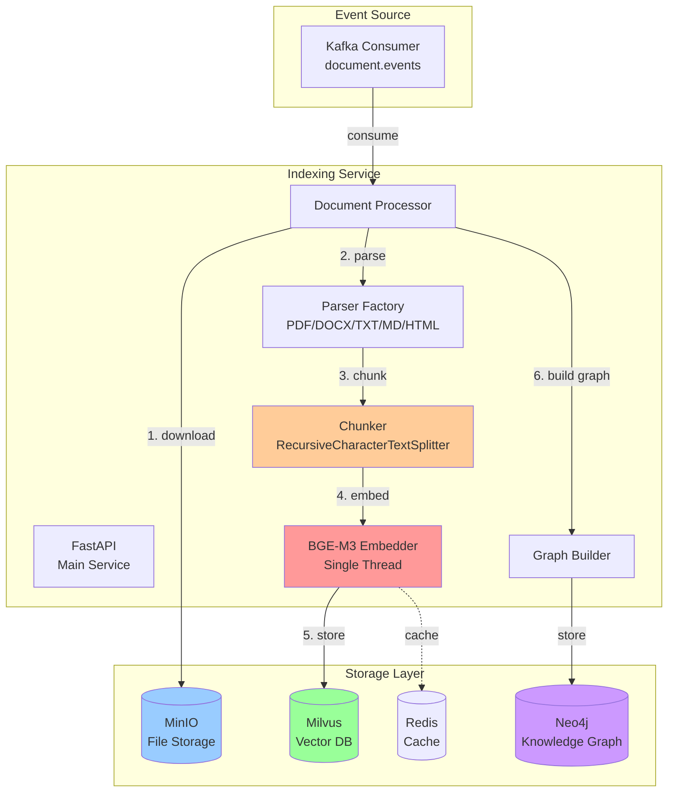
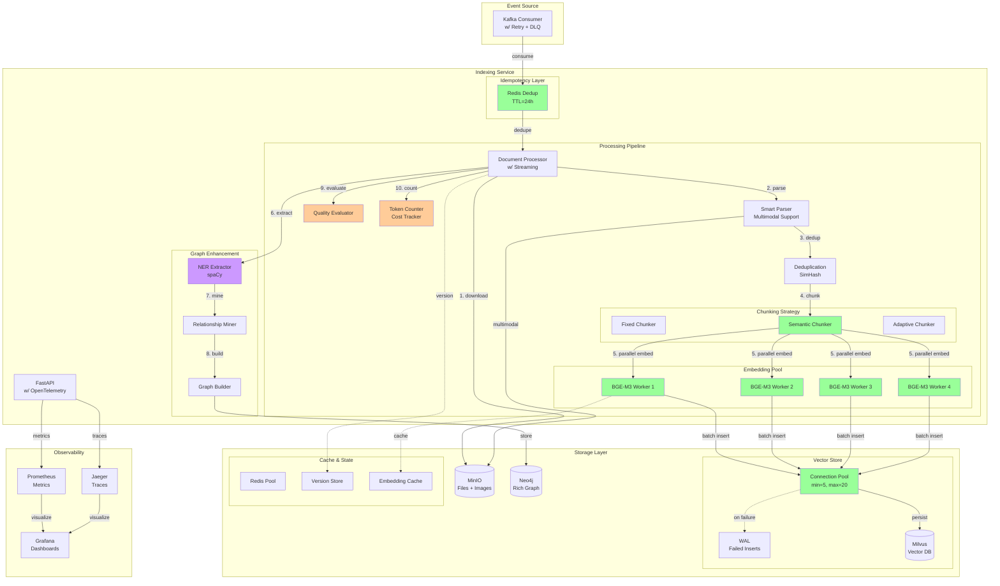

# Indexing Service - Architecture Evolution

## Current Architecture (v2.0.0)



**Current Bottlenecks**:
- 🔴 **Embedder**: Single thread, CPU utilization < 30%
- 🟠 **Chunker**: Fixed rules, breaks semantic boundaries
- 🟡 **No retry**: Kafka consumer message loss risk
- 🟡 **No pooling**: Milvus connection exhaustion
- 🟡 **No streaming**: Large docs cause OOM

---

## Target Architecture (v3.0.0 - After N4)



**Key Improvements**:
- ✅ **Parallel Embedding**: 4 workers, CPU utilization > 80%
- ✅ **Semantic Chunking**: Preserves semantic boundaries
- ✅ **Idempotency**: Redis deduplication
- ✅ **Connection Pool**: Milvus pool + WAL
- ✅ **Streaming**: Support 500MB documents
- ✅ **Multimodal**: Image/table extraction
- ✅ **Quality**: Automated evaluation
- ✅ **Observability**: OpenTelemetry traces

---

## Performance Comparison

| Metric | Current (v2.0) | Quick Wins | N1 | N2 | N3 | Target (v3.0) |
|--------|---------------|------------|----|----|----|--------------|
| **Throughput** | 10 docs/s | 25 docs/s | 40 docs/s | 45 docs/s | 45 docs/s | **50 docs/s** |
| **p95 Latency** | 5s | 3.5s | 2.5s | 2.3s | 2.3s | **2.5s** |
| **Max Doc Size** | 100MB | 100MB | 500MB | 500MB | 500MB | **500MB** |
| **CPU Util** | 30% | 40% | 80% | 80% | 80% | **80%** |
| **Success Rate** | 95% | 99% | 99.5% | 99.5% | 99.5% | **99.5%** |
| **Message Loss** | 5% | 0.5% | 0.25% | 0.25% | 0.25% | **0.25%** |
| **Chunk F1** | 0.65 | 0.65 | 0.65 | 0.85 | 0.85 | **0.85** |
| **Info Extract** | 60% | 60% | 60% | 60% | 78% | **78%** |

---

## Component Evolution Roadmap

### Phase 0: Quick Wins (Week 1-2)
```
Before:
  Embedder [Single Thread] → Milvus [Single Insert]

After:
  Embedder [Warmed Up] → Milvus [Batch Insert, size=500]
  + Redis Dedup
  + Kafka Retry (3x)
```

### Phase 1: N1 - Streaming & Parallelization (Week 3-4)
```
Before:
  Parse [In-Memory] → Chunk → Embed [Single]

After:
  Parse [Streaming, 5MB batch] → Chunk → Embed [4 Workers] → Pool [min=5, max=20]
  + Checkpoint Resume
  + WAL for failures
```

### Phase 2: N2 - Smart Chunking & Quality (Week 5-6)
```
Before:
  RecursiveCharacterTextSplitter [Fixed Rules]

After:
  SemanticChunker [Similarity-based]
  + Deduplication (SimHash)
  + Quality Evaluator
  + Multi-language Adaptive
```

### Phase 3: N3 - Multimodal & NER (Week 7-9)
```
Before:
  PDF → Text Only

After:
  PDF → Text + Images + Tables
  + OCR (PaddleOCR)
  + NER (spaCy)
  + Relationship Mining
```

### Phase 4: N4 - Observability (Week 10-11)
```
Before:
  Prometheus Metrics Only

After:
  OpenTelemetry Traces
  + Token/Cost Tracking
  + SLO Error Budget
  + Grafana Dashboards
```

---

## Migration Strategy

### 1. Feature Flags
```yaml
# configs/algo-services.yaml
indexing:
  features:
    streaming_parser: false  # Enable in N1
    semantic_chunking: false  # Enable in N2
    multimodal_extraction: false  # Enable in N3
    parallel_embedding: false  # Enable in N1
    deduplication: false  # Enable in N2
```

### 2. Gradual Rollout
```
Week 1-2: Quick Wins → All tenants
Week 3-4: N1 → Canary 5% → 50% → 100%
Week 5-6: N2 → Canary 10% → 100%
Week 7-9: N3 → Opt-in → Gradual
Week 10-11: N4 → All tenants
```

### 3. A/B Testing
- **Chunking Strategy**: Fixed vs Semantic (measure retrieval accuracy)
- **Embedding Workers**: 1 vs 2 vs 4 (measure throughput)
- **Batch Size**: 100 vs 500 vs 1000 (measure latency)

---

## Rollback Plan

### Automatic Rollback Triggers
1. Success rate < 98% for 5 minutes
2. p95 latency > 5s for 10 minutes
3. Error rate spike > 5%
4. Memory usage > 90%

### Manual Rollback
```bash
# Feature flag rollback
kubectl set env deployment/indexing-service \
  FEATURE_SEMANTIC_CHUNKING=false

# Full deployment rollback
kubectl rollout undo deployment/indexing-service
```

---

## Success Criteria

### Quick Wins
- ✅ Throughput +150%
- ✅ Cold start -90%
- ✅ Message loss -95%

### N1
- ✅ p95 < 2.5s
- ✅ Support 500MB docs
- ✅ CPU util > 80%

### N2
- ✅ Chunk F1 > 0.85
- ✅ Dedup rate > 90%
- ✅ Quality score > 0.80

### N3
- ✅ Info extract +30%
- ✅ Image/table extraction > 85%
- ✅ NER F1 > 0.80

### N4
- ✅ MTTD < 2min
- ✅ Cost visibility 100%
- ✅ SLO compliance

---

**Version**: 1.0
**Last Updated**: 2025-11-01
**Next Review**: After N1 completion


