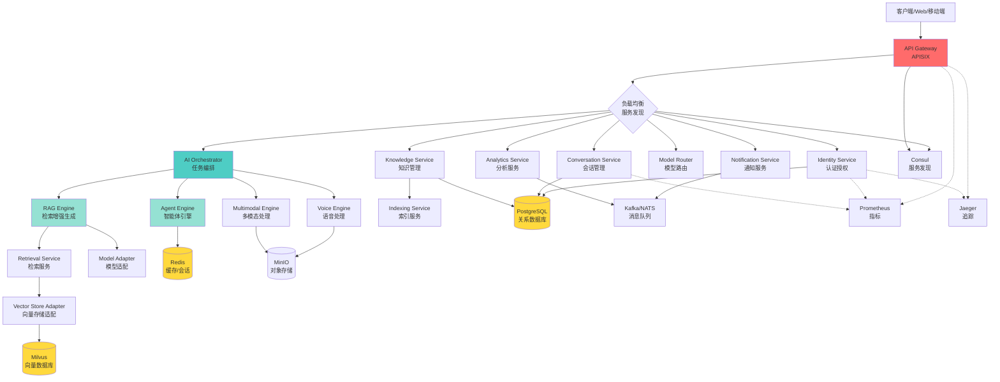
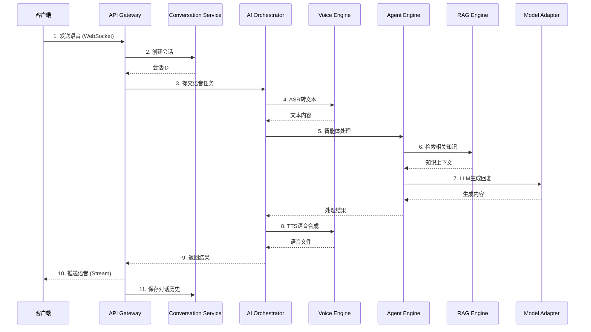
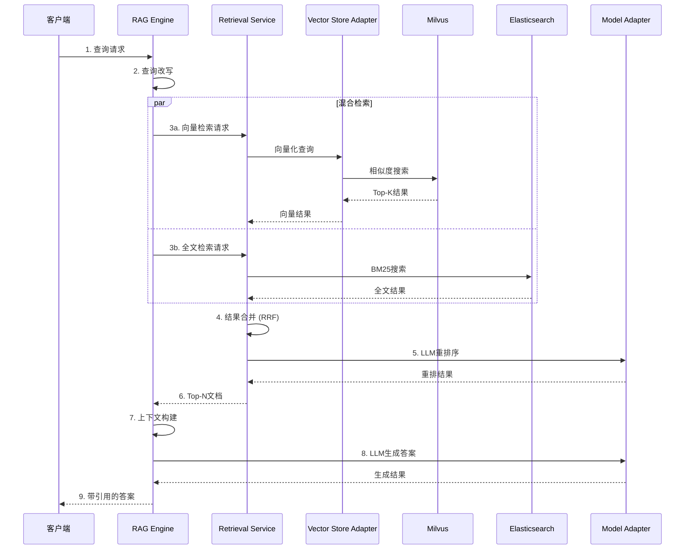
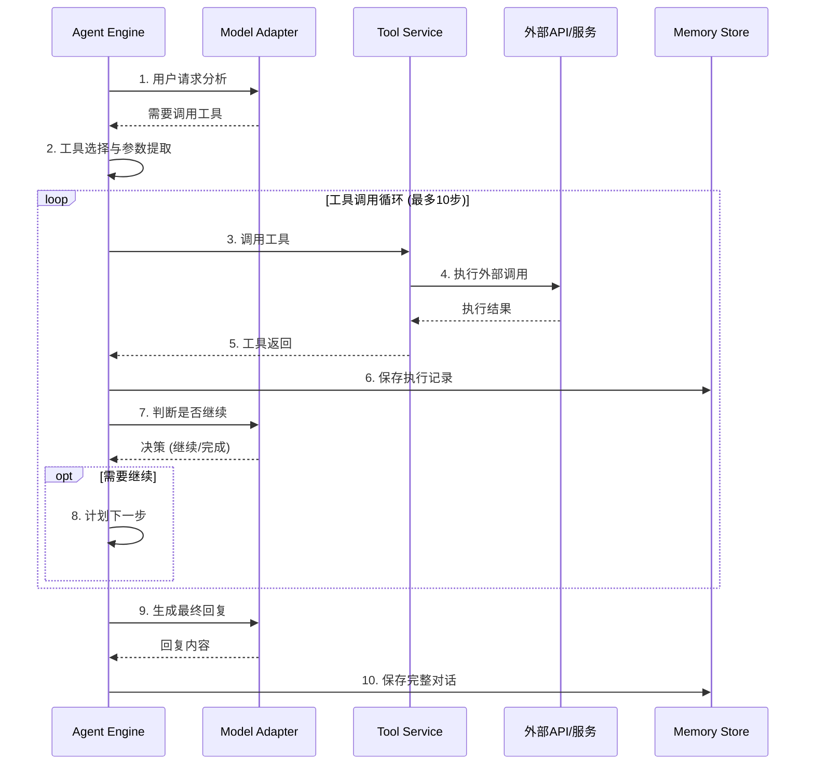

# VoiceAssistant 微服务架构概览

## 系统架构

VoiceAssistant 是一个基于微服务架构的 AI 语音助手平台，采用 Go 和 Python 混合技术栈，支持大规模并发和高可用性。

### 架构组件图



### 关键时序图

#### 1. 语音对话流程



#### 2. RAG 检索-重排流程



#### 3. 工具调用流程



## 技术栈

### 后端服务

- **Go 服务**: Kratos 框架, Gin, gRPC, GORM
- **Python 服务**: FastAPI, LangChain, LangGraph
- **API 网关**: Apache APISIX

### 数据存储

- **关系数据库**: PostgreSQL (pgvector 扩展)
- **向量数据库**: Milvus
- **缓存**: Redis
- **消息队列**: Kafka / NATS
- **对象存储**: MinIO

### 基础设施

- **容器编排**: Kubernetes
- **服务发现**: Consul
- **配置管理**: Nacos (可选)
- **负载均衡**: APISIX + K8s Service

### 可观测性

- **指标**: Prometheus + Grafana
- **追踪**: Jaeger / OpenTelemetry
- **日志**: ELK Stack / Loki
- **监控**: Grafana Dashboards

### AI/ML

- **LLM**: OpenAI, Anthropic, 本地模型
- **Embedding**: BGE-M3, OpenAI Ada
- **语音**: ASR/TTS 引擎集成

## 核心特性

### 1. 高可用性

- ✅ N+1 冗余部署
- ✅ 自动故障转移
- ✅ 金丝雀发布
- ✅ 健康检查与自动恢复

### 2. 高性能

- ✅ API 网关 P95 延迟 < 200ms
- ✅ 流式响应 TTFB < 300ms
- ✅ 端到端 QA < 2.5s
- ✅ 支持 1000+ RPS 基准

### 3. 可扩展性

- ✅ 水平扩展支持
- ✅ HPA 自动伸缩
- ✅ 微服务解耦设计
- ✅ 插件化架构

### 4. 弹性容错

- ✅ 断路器模式
- ✅ 指数退避重试
- ✅ 限流与降级
- ✅ 超时控制

### 5. 安全性

- ✅ JWT 认证
- ✅ RBAC 权限控制
- ✅ 数据加密
- ✅ PII 脱敏
- ✅ 审计日志

### 6. 可观测性

- ✅ OpenTelemetry 全链路追踪
- ✅ Prometheus 指标采集
- ✅ 统一日志聚合
- ✅ SLO/Error Budget 监控

## 服务清单

### Go 服务 (7 个)

| 服务                 | 职责               | 端口                      | 语言 |
| -------------------- | ------------------ | ------------------------- | ---- |
| identity-service     | 用户认证与授权     | 9000 (gRPC) / 8080 (HTTP) | Go   |
| conversation-service | 会话管理           | 8080                      | Go   |
| knowledge-service    | 知识库管理         | 9000 (gRPC) / 8080 (HTTP) | Go   |
| ai-orchestrator      | AI 任务编排        | 9003                      | Go   |
| model-router         | 模型路由与负载均衡 | 9004                      | Go   |
| notification-service | 通知服务           | 9006                      | Go   |
| analytics-service    | 分析服务           | 9007                      | Go   |

### Python 服务 (9 个)

| 服务                       | 职责         | 端口 | 语言   |
| -------------------------- | ------------ | ---- | ------ |
| agent-engine               | 智能体引擎   | 8003 | Python |
| rag-engine                 | 检索增强生成 | 8006 | Python |
| retrieval-service          | 检索服务     | 8012 | Python |
| indexing-service           | 文档索引     | 8004 | Python |
| model-adapter              | 模型适配器   | 8005 | Python |
| vector-store-adapter       | 向量存储适配 | 8003 | Python |
| voice-engine               | 语音处理     | 8002 | Python |
| multimodal-engine          | 多模态处理   | 8007 | Python |
| knowledge-service (Python) | 知识图谱服务 | 8010 | Python |

## 部署架构

### Kubernetes 部署

```
Namespace: voiceassistant
├── Go Services (Deployments)
│   ├── identity-service (3 replicas, HPA)
│   ├── conversation-service (3 replicas, HPA)
│   └── ...
├── Python Services (Deployments)
│   ├── agent-engine (3 replicas, HPA)
│   ├── rag-engine (3 replicas, HPA)
│   └── ...
├── Infrastructure
│   ├── PostgreSQL (StatefulSet, 3 replicas)
│   ├── Redis (StatefulSet, 3 replicas)
│   ├── Milvus (StatefulSet)
│   ├── Consul (StatefulSet, 3 replicas)
│   └── Kafka (StatefulSet, 3 replicas)
└── Observability
    ├── Prometheus (StatefulSet)
    ├── Grafana (Deployment)
    └── Jaeger (Deployment)
```

## NFR (非功能需求)

### 性能指标

- API Gateway P95 延迟: **< 200ms**
- 流式 TTFB: **< 300ms**
- 端到端 QA: **< 2.5s**
- 基准 RPS: **1000+**

### 可用性

- SLA: **≥ 99.9%**
- 核心服务: **N+1 冗余**
- 故障恢复: **自动 + 金丝雀**

### 可观测性

- 追踪: **OpenTelemetry 全链路**
- 指标: **Prometheus + Grafana**
- SLO/Error Budget: **实时监控**

### 安全性

- 认证: **JWT + OAuth2**
- 授权: **RBAC 最小权限**
- 数据: **KMS 加密 + PII 脱敏**
- 合规: **GDPR/CCPA 审计日志**

### 成本

- 请求级 Token 计费
- 模型/Embedding/召回/重排拆分
- 预算告警与自动降级

## 链接

- [源码入口](../../)
- [API 文档](../../api/)
- [运行手册](../runbook/index.md)
- [SLO 指标](../nfr/slo.md)
- [变更日志](../../CHANGELOG.md)
