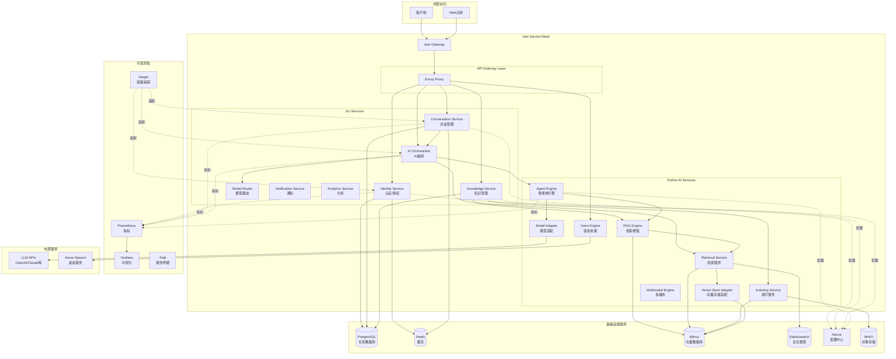
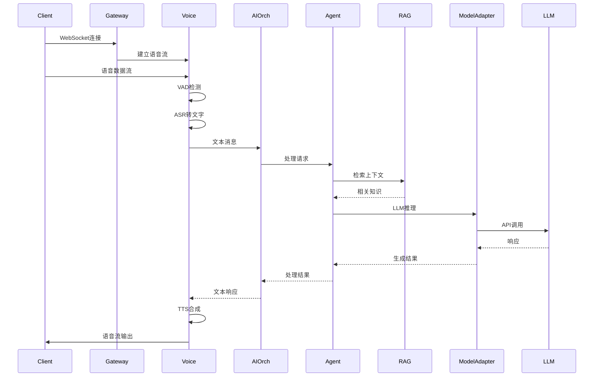
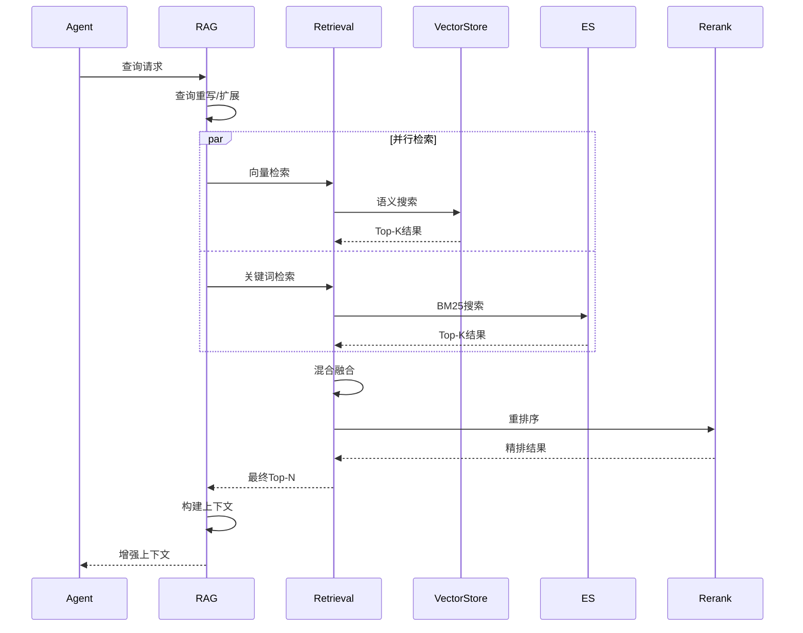
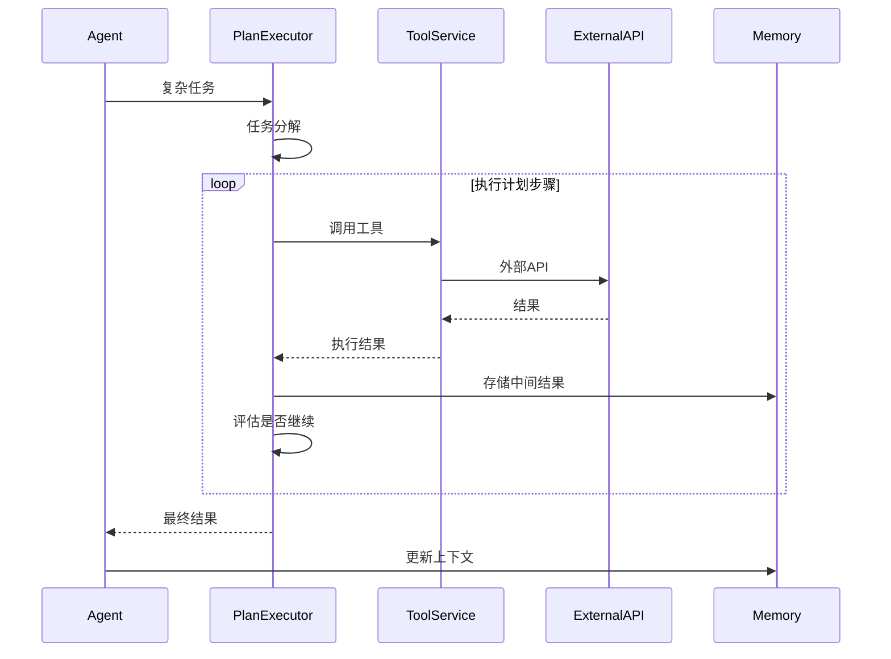

# VoiceAssistant 架构概览

## 系统架构图

## 关键时序图

### 1. 语音对话流程

### 2. RAG 检索-重排流程

### 3. 工具调用流程

## 核心组件说明

### Go 服务层

- **Identity Service** ([`cmd/identity-service/`](../../cmd/identity-service/))

  - JWT 认证/授权
  - 用户管理
  - RBAC 权限控制

- **Conversation Service** ([`cmd/conversation-service/`](../../cmd/conversation-service/))

  - 对话会话管理
  - 消息持久化
  - 上下文压缩

- **Knowledge Service** ([`cmd/knowledge-service/`](../../cmd/knowledge-service/))

  - 知识库管理
  - 文档管理
  - 向量索引协调

- **AI Orchestrator** ([`cmd/ai-orchestrator/`](../../cmd/ai-orchestrator/))
  - AI 服务编排
  - 请求路由
  - 服务聚合

### Python AI 服务层

- **Agent Engine** ([`algo/agent-engine/`](../../algo/agent-engine/))

  - ReAct/Plan-Execute 智能体
  - 工具调用
  - 多智能体协作

- **RAG Engine** ([`algo/rag-engine/`](../../algo/rag-engine/))

  - 检索增强生成
  - 查询重写
  - 上下文构建

- **Voice Engine** ([`algo/voice-engine/`](../../algo/voice-engine/))

  - VAD 语音检测
  - ASR 语音识别
  - TTS 语音合成

- **Model Adapter** ([`algo/model-adapter/`](../../algo/model-adapter/))
  - 统一 LLM 接口
  - 多模型适配（OpenAI/Claude/通义等）
  - 流式响应

### 基础设施

- **Nacos**: 配置中心和服务发现
- **PostgreSQL**: 业务数据持久化
- **Redis**: 缓存和会话存储
- **Milvus**: 向量数据库
- **Elasticsearch**: 全文检索
- **MinIO**: 对象存储（文档、多媒体）

## 部署架构

### Kubernetes + Istio

- **命名空间隔离**:

  - `voiceassistant-prod`: 应用服务
  - `voiceassistant-infra`: 基础设施
  - `istio-system`: Istio 组件

- **流量管理**:

  - Istio Gateway 统一入口
  - VirtualService 路由规则
  - DestinationRule 负载均衡

- **安全**:

  - mTLS 服务间加密
  - JWT 认证
  - RBAC 授权策略
  - Network Policy 网络隔离

- **可观测性**:
  - Prometheus 指标采集
  - Jaeger 分布式追踪
  - Grafana 可视化
  - Kiali 服务网格监控

## NFR 指标

| 指标            | 目标值  | 当前值 | 状态   |
| --------------- | ------- | ------ | ------ |
| API Gateway P95 | < 200ms | -      | 待测试 |
| TTFB (Stream)   | < 300ms | -      | 待测试 |
| E2E QA          | < 2.5s  | -      | 待测试 |
| 可用性          | ≥ 99.9% | -      | 待测试 |
| 并发 RPS        | ≥ 1000  | -      | 待测试 |

## 扩展性

- **水平扩展**: HPA 自动扩缩容
- **垂直扩展**: VPA 资源调整
- **数据库**: 读写分离、分片
- **缓存**: Redis 集群、多级缓存
- **向量库**: Milvus 分布式集群

## 参考链接

- [部署指南](../../deployments/k8s/README.md)
- [Runbook](../runbook/index.md)
- [API 文档](../../api/openapi.yaml)
- [SLO 目标](../nfr/slo.md)
