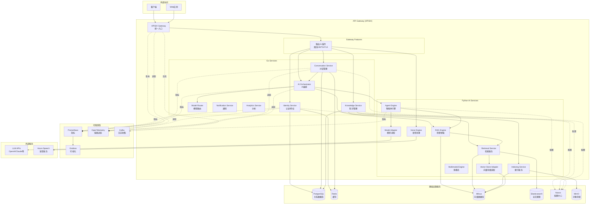
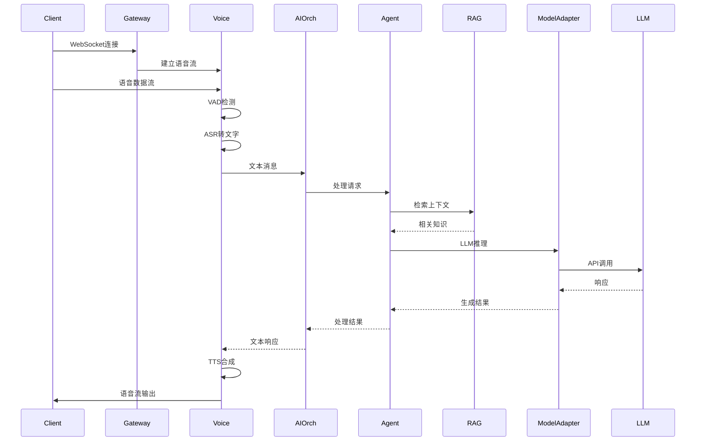
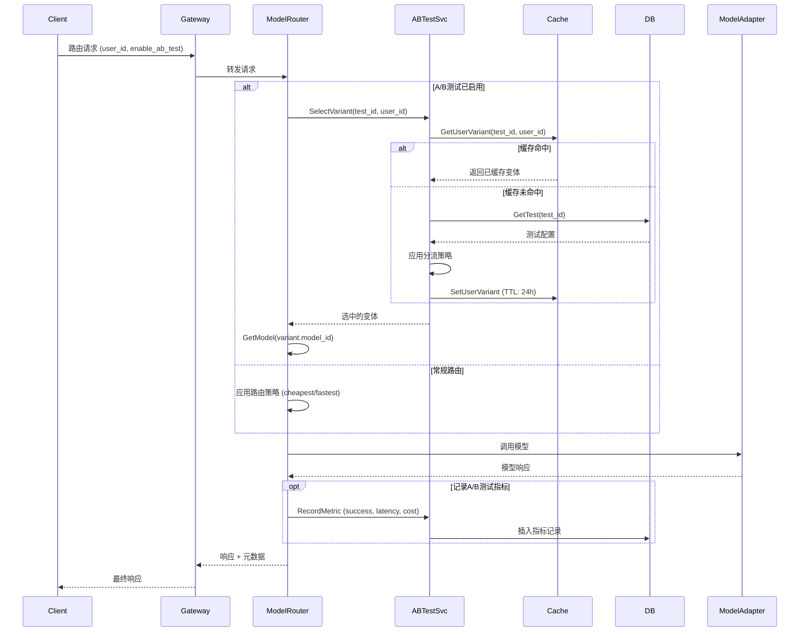
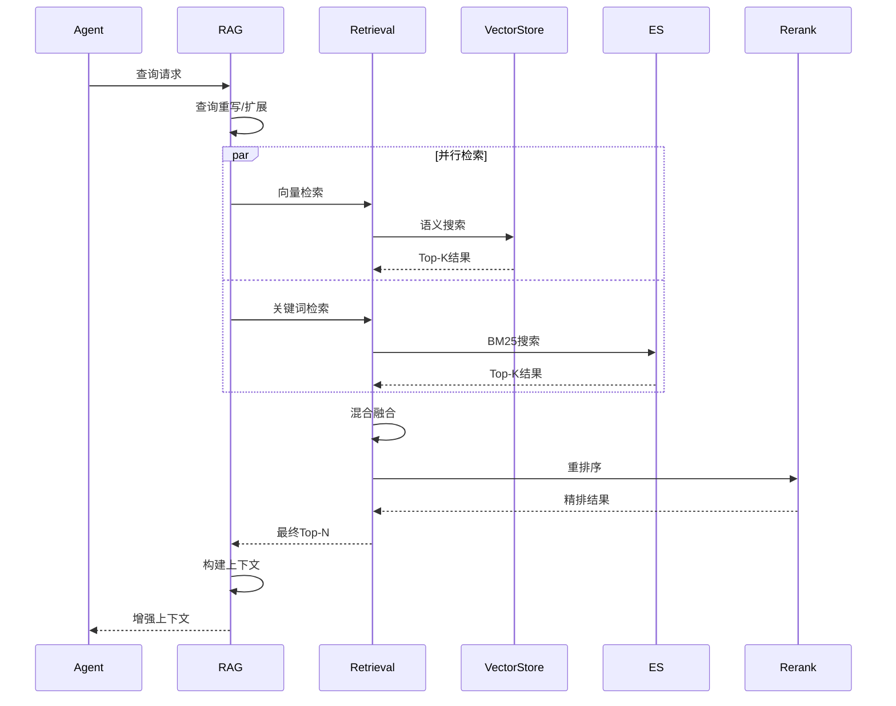
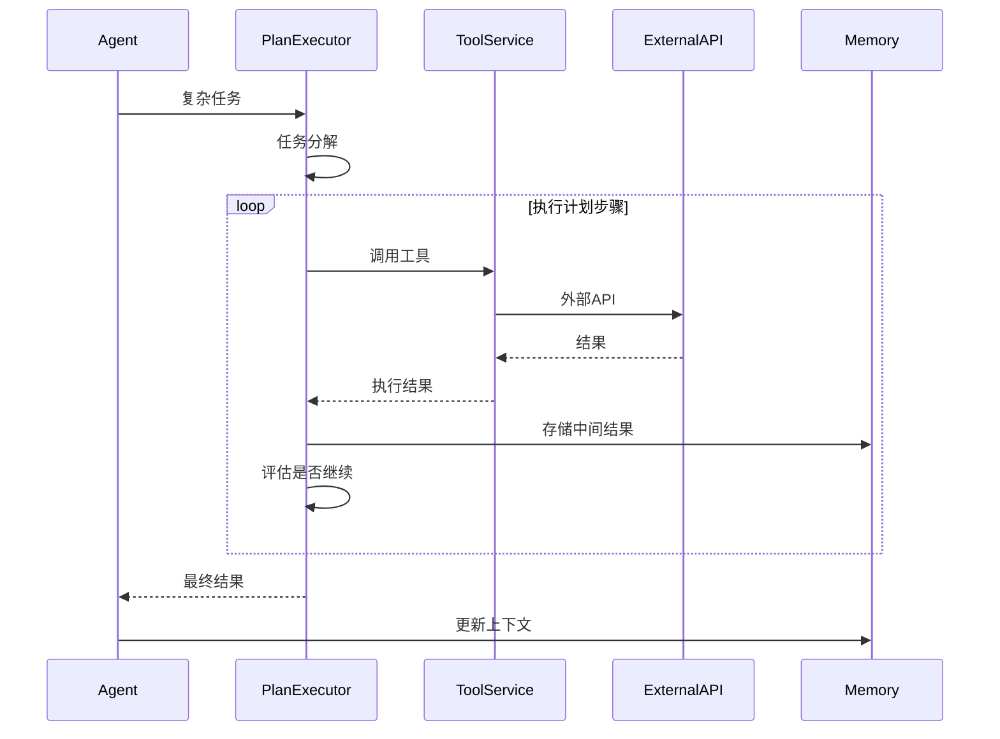

# VoiceAssistant 架构概览

## 系统架构图

## 关键时序图

### 1. 语音对话流程

### 2. A/B测试模型路由流程

### 3. RAG 检索-重排流程

### 4. 工具调用流程

## 核心组件说明

### Go 服务层

- **Identity Service** ([`cmd/identity-service/`](../../cmd/identity-service/))

  - JWT 认证/授权
  - 用户管理
  - RBAC 权限控制

- **Conversation Service** ([`cmd/conversation-service/`](../../cmd/conversation-service/))

  - 对话会话管理
  - 消息持久化
  - 上下文压缩

- **Knowledge Service** ([`cmd/knowledge-service/`](../../cmd/knowledge-service/))

  - 知识库管理
  - 文档管理
  - 向量索引协调

- **AI Orchestrator** ([`cmd/ai-orchestrator/`](../../cmd/ai-orchestrator/))
  - AI 服务编排
  - 请求路由
  - 服务聚合

### Python AI 服务层

- **Agent Engine** ([`algo/agent-engine/`](../../algo/agent-engine/))

  - ReAct/Plan-Execute 智能体
  - 工具调用
  - 多智能体协作

- **RAG Engine** ([`algo/rag-engine/`](../../algo/rag-engine/))

  - 检索增强生成
  - 查询重写
  - 上下文构建

- **Voice Engine** ([`algo/voice-engine/`](../../algo/voice-engine/))

  - VAD 语音检测
  - ASR 语音识别
  - TTS 语音合成

- **Model Adapter** ([`algo/model-adapter/`](../../algo/model-adapter/))
  - 统一 LLM 接口
  - 多模型适配（OpenAI/Claude/通义等）
  - 流式响应

- **Model Router** ([`cmd/model-router/`](../../cmd/model-router/))
  - 智能模型路由（成本/延迟/质量优化）
  - A/B测试管理
  - 模型健康检查与熔断
  - 成本预测与预算控制

### 基础设施

- **Nacos**: 配置中心和服务发现
- **PostgreSQL**: 业务数据持久化
- **Redis**: 缓存和会话存储
- **Milvus**: 向量数据库
- **Elasticsearch**: 全文检索
- **MinIO**: 对象存储（文档、多媒体）

## 部署架构

### Kubernetes + APISIX Gateway

> **架构演进**: 已从 Istio/Envoy 迁移到 APISIX，实现更轻量级的网关架构

- **命名空间隔离**:

  - `voiceassistant-prod`: 应用服务
  - `voiceassistant-infra`: 基础设施
  - `apisix`: APISIX 网关

- **流量管理 (APISIX)**:

  - APISIX Gateway 统一入口（替代 Istio Gateway + Envoy）
  - Routes 路由规则（对应 Istio VirtualService）
  - Upstreams 负载均衡和健康检查（对应 Istio DestinationRule）
  - 支持 HTTP/HTTPS、WebSocket、gRPC
  - Kubernetes 服务发现

- **安全**:

  - mTLS 服务间加密（APISIX Upstream TLS）
  - JWT 认证（jwt-auth 插件）
  - RBAC 授权策略（APISIX RBAC）
  - WAF 防护（自定义规则）
  - PII 数据脱敏
  - IP 限流和租户限流

- **可观测性**:

  - OpenTelemetry 全链路追踪（替代 Jaeger）
  - Prometheus 指标采集（APISIX metrics exporter）
  - Grafana Dashboard 可视化
  - Kafka 日志收集（access log + error log）
  - 自定义告警规则

- **性能优化**:

  - 无 Sidecar 开销（~90% 内存节省）
  - HPA 自动扩缩容（3-10 副本）
  - 连接池和 keepalive 优化
  - Redis 集群限流缓存

### APISIX vs Istio 对比

| 维度 | Istio/Envoy | APISIX | 说明 |
|------|-------------|--------|------|
| **架构** | Sidecar 模式 | 集中式网关 | APISIX 无 Sidecar 开销 |
| **资源消耗** | 高（每 Pod 1 Sidecar） | 低（共享网关） | ~90% 内存节省 |
| **配置方式** | CRD (Gateway/VirtualService) | Route/Upstream | APISIX 更直观 |
| **插件生态** | Envoy Filter | 80+ 内置插件 | APISIX 插件更丰富 |
| **性能** | 好 | 优秀 | APISIX 延迟更低 |
| **学习曲线** | 陡峭 | 平缓 | APISIX 更易上手 |
| **可观测性** | Istio Telemetry | OpenTelemetry + Prometheus | 功能对等 |
| **安全** | mTLS + RBAC | mTLS + JWT + WAF | APISIX 更全面 |

**迁移文档**: [`deployments/k8s/apisix/README.md`](../../deployments/k8s/apisix/README.md)

## NFR 指标

| 指标            | 目标值  | 当前值 | 状态   |
| --------------- | ------- | ------ | ------ |
| API Gateway P95 | < 200ms | -      | 待测试 |
| TTFB (Stream)   | < 300ms | -      | 待测试 |
| E2E QA          | < 2.5s  | -      | 待测试 |
| 可用性          | ≥ 99.9% | -      | 待测试 |
| 并发 RPS        | ≥ 1000  | -      | 待测试 |

## 扩展性

- **水平扩展**: HPA 自动扩缩容
- **垂直扩展**: VPA 资源调整
- **数据库**: 读写分离、分片
- **缓存**: Redis 集群、多级缓存
- **向量库**: Milvus 分布式集群

## 参考链接

- [部署指南](../../deployments/k8s/README.md)
- [Runbook](../runbook/index.md)
- [API 文档](../../api/openapi.yaml)
- [SLO 目标](../nfr/slo.md)
