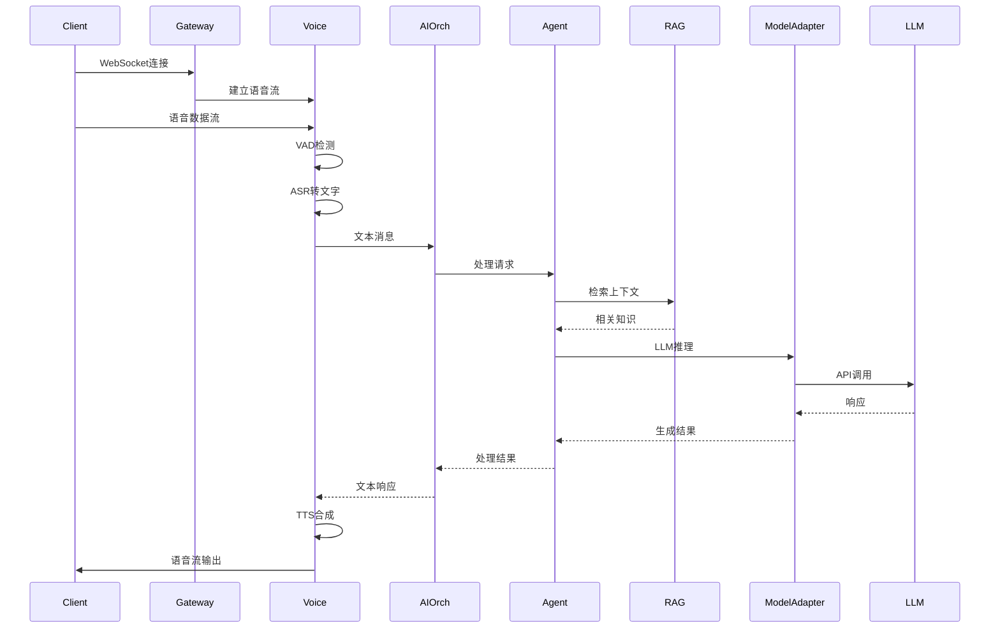
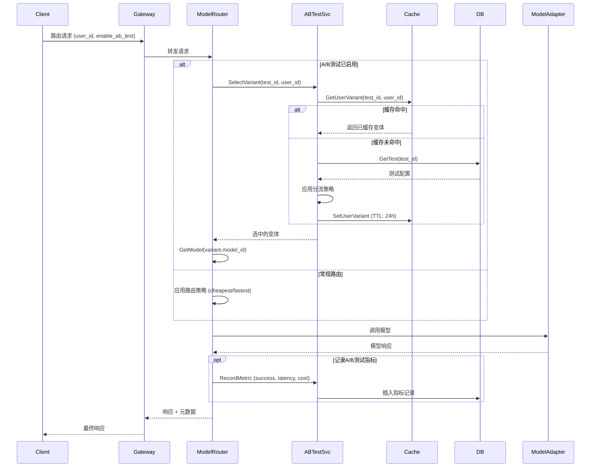
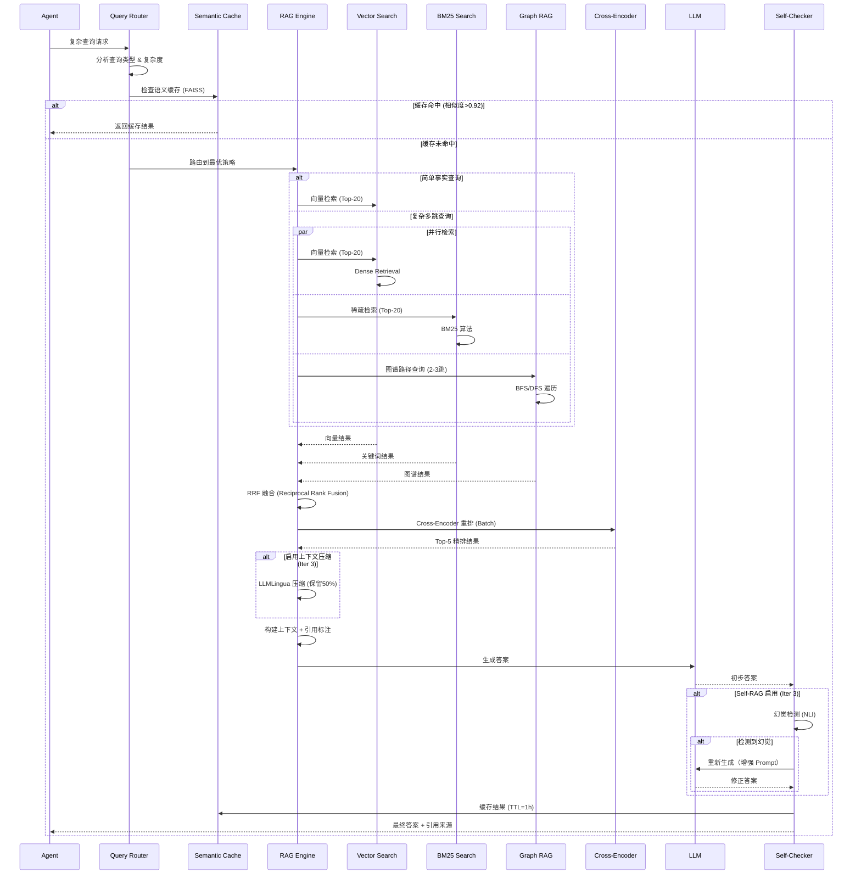
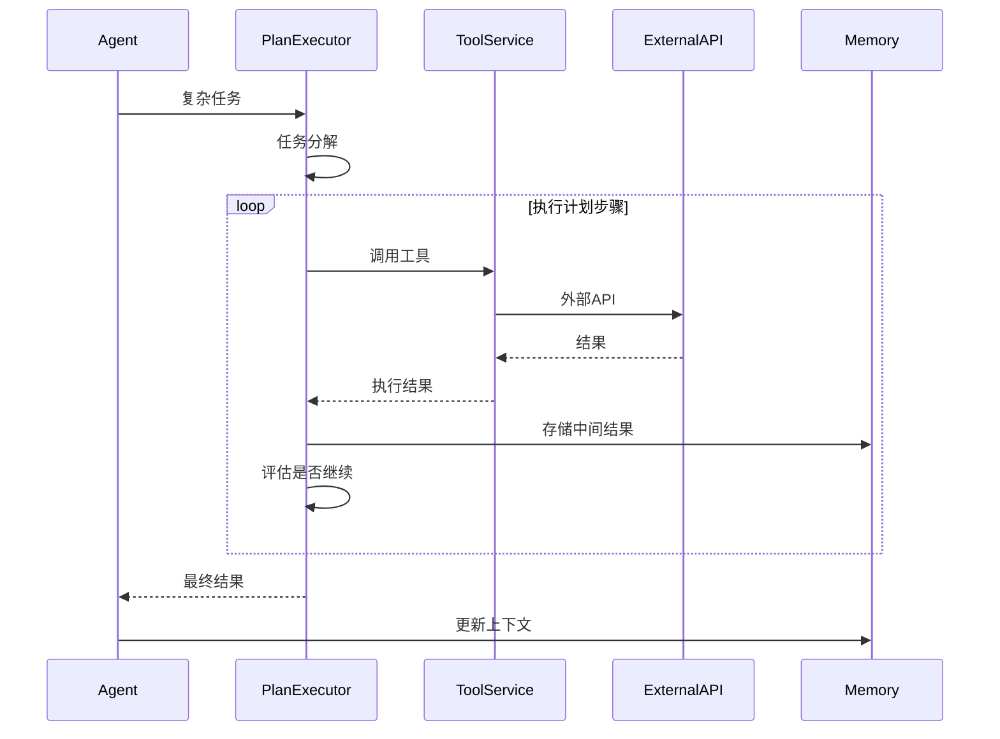

# VoiceHelper 架构概览

## 系统架构图

## 关键时序图

### 1. 语音对话流程

### 2. A/B测试模型路由流程

### 3. RAG 检索-重排流程（v2.0 优化版）

**优化亮点**：
- ✅ 混合检索（Vector + BM25 + Graph）
- ✅ 语义缓存（命中率 60%+）
- ✅ Cross-Encoder 重排
- ✅ Self-RAG 自我纠错
- ✅ 上下文压缩（节省 Token 30%）

### 4. 工具调用流程

## 核心组件说明

### Go 服务层

- **Identity Service** ([`cmd/identity-service/`](../../cmd/identity-service/))

  - JWT 认证/授权
  - 用户管理
  - RBAC 权限控制

- **Conversation Service** ([`cmd/conversation-service/`](../../cmd/conversation-service/))

  - 对话会话管理
  - 消息持久化
  - 上下文压缩

- **Knowledge Service** ([`cmd/knowledge-service/`](../../cmd/knowledge-service/))

  - 知识库管理
  - 文档管理
  - 向量索引协调

- **AI Orchestrator** ([`cmd/ai-orchestrator/`](../../cmd/ai-orchestrator/))
  - AI 服务编排
  - 请求路由
  - 服务聚合

### Python AI 服务层

- **Agent Engine** ([`algo/agent-engine/`](../../algo/agent-engine/))

  - ReAct/Plan-Execute 智能体
  - 工具调用
  - 多智能体协作

- **RAG Engine** ([`algo/rag-engine/`](../../algo/rag-engine/))

  - **v2.0 架构** ([优化迭代计划](../RAG_ENGINE_ITERATION_PLAN.md))
  - 多策略检索（Vector + BM25 + Graph）
  - 查询重写/分解
  - Cross-Encoder 重排
  - Self-RAG 自我纠错
  - 语义缓存（FAISS + Redis）
  - 上下文压缩（LLMLingua）
  - Agentic RAG（计划中）

- **Voice Engine** ([`algo/voice-engine/`](../../algo/voice-engine/))

  - VAD 语音检测
  - ASR 语音识别
  - TTS 语音合成

- **Model Adapter** ([`algo/model-adapter/`](../../algo/model-adapter/))
  - 统一 LLM 接口
  - 多模型适配（OpenAI/Claude/通义等）
  - 流式响应

- **Model Router** ([`cmd/model-router/`](../../cmd/model-router/))
  - 智能模型路由（成本/延迟/质量优化）
  - A/B测试管理
  - 模型健康检查与熔断
  - 成本预测与预算控制

### 基础设施

- **Nacos**: 配置中心和服务发现
- **PostgreSQL**: 业务数据持久化
- **Redis**: 缓存和会话存储
- **Milvus**: 向量数据库
- **Elasticsearch**: 全文检索
- **MinIO**: 对象存储（文档、多媒体）

## 部署架构

### Kubernetes + Istio Service Mesh

> **架构演进**: 已从 APISIX 迁移到 Istio Gateway + Envoy，实现服务网格架构

- **命名空间隔离**:

  - `voiceassistant-prod`: 应用服务（Sidecar 自动注入）
  - `voiceassistant-infra`: 基础设施
  - `istio-system`: Istio 控制平面与 Ingress Gateway

- **流量管理 (Istio)**:

  - Istio Gateway: 外部流量入口（HTTP/HTTPS/gRPC/WebSocket）
  - VirtualService: 路由规则（URI、Header、权重路由）
  - DestinationRule: 流量策略（负载均衡、连接池、熔断）
  - EnvoyFilter: 高级功能（限流、认证、压缩、日志）
  - Sidecar 模式：每个服务 Pod 注入 Envoy 代理

- **安全**:

  - PeerAuthentication: 服务间 mTLS（STRICT 模式，零信任）
  - RequestAuthentication: JWT 验证（多 Issuer 支持）
  - AuthorizationPolicy: 细粒度授权（Namespace、ServiceAccount、JWT Claims）
  - Deny by Default: 默认拒绝策略 + 显式授权
  - 租户隔离: 基于 JWT tenant_id 的访问控制
  - PII 数据脱敏: 日志自动脱敏

- **可观测性**:

  - OpenTelemetry: 全链路追踪（服务间调用链完整）
  - Prometheus: 指标采集（Istio Metrics + Envoy Stats）
  - Grafana: Istio 官方 Dashboard（Mesh/Service/Workload）
  - JSON Access Log: 结构化日志（租户/用户/会话 ID）
  - ServiceMonitor: 自动发现和采集

- **性能与可靠性**:

  - HPA 自动扩缩容（Gateway 3-10 副本，Istiod 2-5 副本）
  - 连接池优化（HTTP/1.1 + HTTP/2）
  - 熔断与重试（OutlierDetection）
  - 流量分割与金丝雀发布（基于权重）
  - Redis 分布式限流

### Istio vs APISIX 对比

| 维度 | APISIX | Istio + Envoy | 说明 |
|------|--------|---------------|------|
| **架构** | 集中式网关 | Sidecar 模式 | Istio 实现服务级流量控制 |
| **资源消耗** | 低（~1.5GB） | 高（~15GB+） | Istio 每服务额外 Sidecar |
| **配置方式** | Route/Upstream | Gateway/VirtualService/DestinationRule | Istio Kubernetes 原生 |
| **插件生态** | 80+ 内置插件 | Envoy Filter + 社区生态 | Istio 是云原生标准 |
| **性能** | 优秀（低延迟） | 好（+5-10ms） | Sidecar 有额外开销 |
| **学习曲线** | 平缓 | 陡峭 | Istio 概念更多 |
| **可观测性** | 网关层面 | 服务间全链路 | Istio 完整调用链追踪 |
| **安全** | mTLS + JWT + WAF | mTLS + RBAC + JWT | Istio 零信任架构 |
| **流量管理** | 路由规则 | VirtualService + DestinationRule | Istio 更细粒度控制 |
| **多集群** | 有限支持 | 原生多集群联邦 | Istio 跨集群流量管理 |

**迁移文档**: [`deployments/k8s/istio/MIGRATION_GUIDE.md`](../../deployments/k8s/istio/MIGRATION_GUIDE.md)

## NFR 指标

### 系统级指标

| 指标            | 目标值  | 当前值 | 状态   |
| --------------- | ------- | ------ | ------ |
| API Gateway P95 | < 200ms | -      | 待测试 |
| TTFB (Stream)   | < 300ms | -      | 待测试 |
| E2E QA          | < 2.5s  | -      | 待测试 |
| 可用性          | ≥ 99.9% | -      | 待测试 |
| 并发 RPS        | ≥ 1000  | -      | 待测试 |

### RAG Engine 专项指标 (v2.0 目标)

| 指标类别 | 指标名称 | v1.0 当前值 | v2.0 目标值 | 提升幅度 |
|---------|---------|------------|------------|---------|
| **准确性** | 检索召回率@5 | 0.68 | 0.85+ | +25% |
| **准确性** | 答案准确率 | 0.71 | 0.90+ | +27% |
| **准确性** | 幻觉率 | 15% | <5% | -67% |
| **性能** | E2E 延迟 P95 | 3200ms | <2500ms | -22% |
| **性能** | 检索延迟 P95 | 800ms | <500ms | -38% |
| **成本** | 平均 Token 消耗 | 2450 | <2000 | -18% |
| **体验** | 缓存命中率 | 20% | 60%+ | +200% |

**详细优化计划**: [RAG Engine 迭代计划](../RAG_ENGINE_ITERATION_PLAN.md)

## 扩展性

- **水平扩展**: HPA 自动扩缩容
- **垂直扩展**: VPA 资源调整
- **数据库**: 读写分离、分片
- **缓存**: Redis 集群、多级缓存
- **向量库**: Milvus 分布式集群

## 参考链接

- [部署指南](../../deployments/k8s/README.md)
- [Runbook](../runbook/index.md)
- [API 文档](../../api/openapi.yaml)
- [SLO 目标](../nfr/slo.md)
