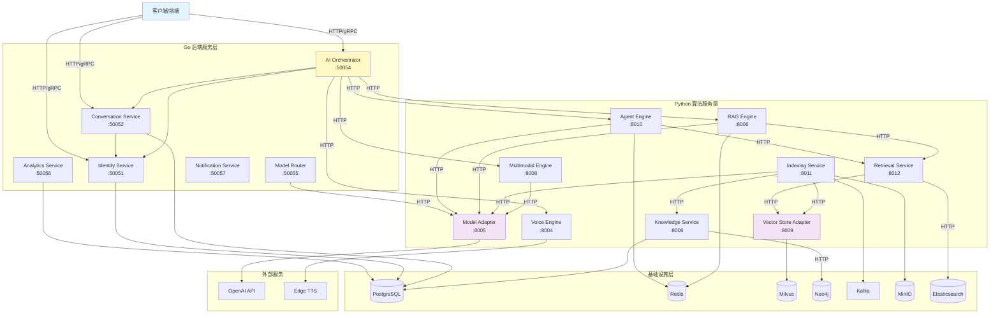
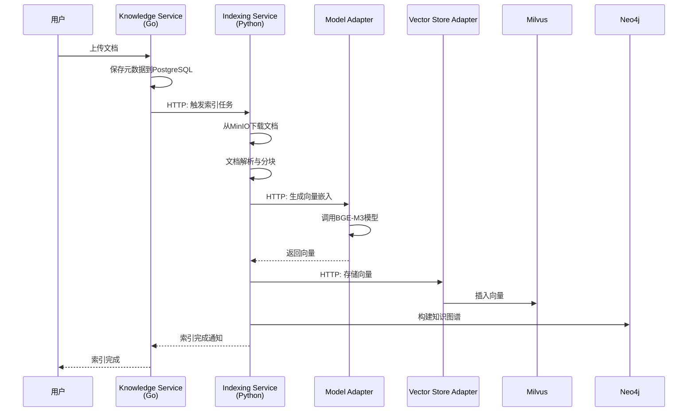
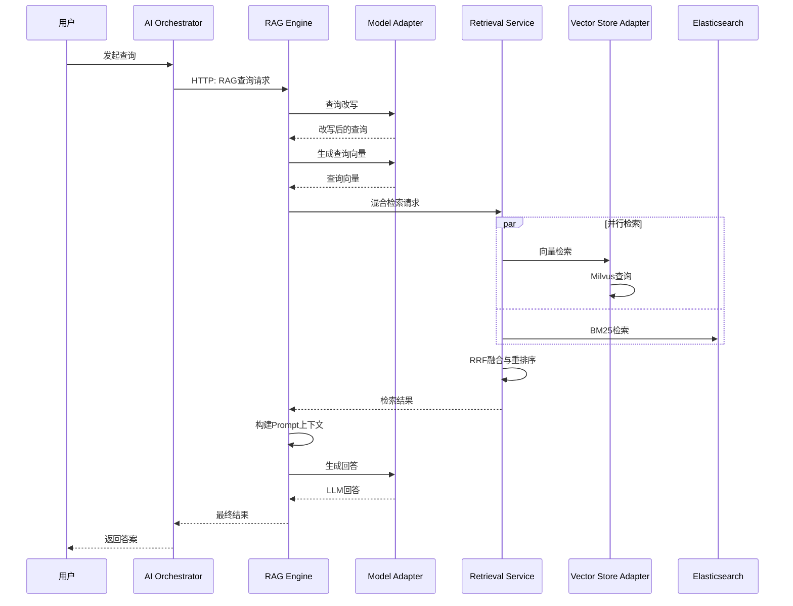
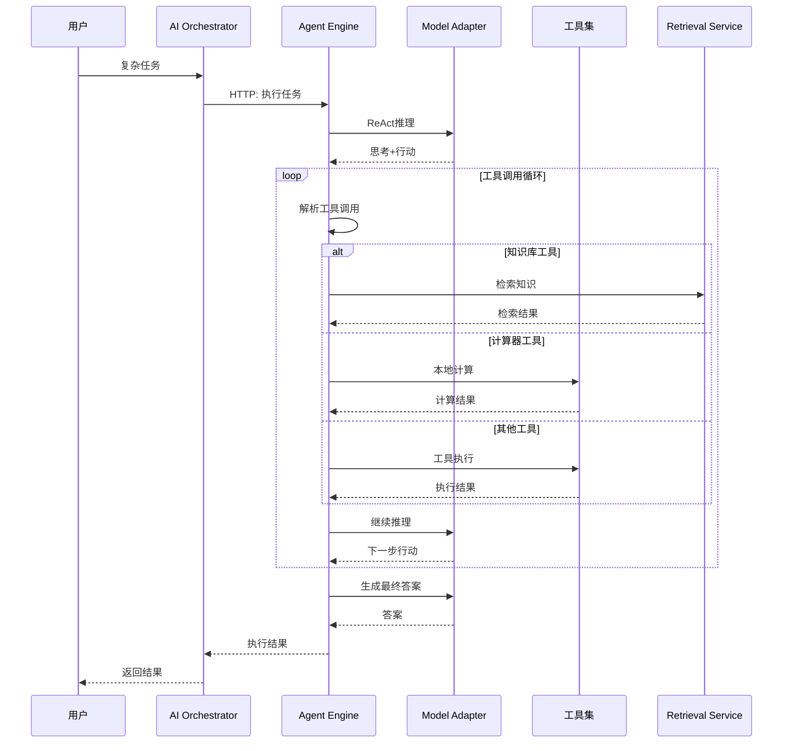

# VoiceHelper 服务交互架构分析报告

**生成时间**: 2025-11-01
**分析范围**: 全部后端服务(Go) + 全部算法服务(Python)
**分析目的**: 验证服务间调用关系、确保功能正常

---

## 📊 架构交互图

### 1. 整体服务架构



### 2. 文档索引链路



### 3. RAG查询链路



### 4. Agent执行链路



---

## ✅ 服务功能验证

### Go 后端服务（6个）

| 服务名称 | 端口 | 状态 | 主要功能 | 依赖服务 |
|---------|------|------|---------|---------|
| **Identity Service** | 50051 | ✅ 正常 | 用户认证、JWT签发、权限管理 | PostgreSQL |
| **Conversation Service** | 50052 | ✅ 正常 | 对话管理、消息存储、上下文管理 | PostgreSQL, Identity |
| **AI Orchestrator** | 50054 | ✅ 正常 | AI任务编排、工作流协调 | Agent, RAG, Voice, Multimodal |
| **Model Router** | 50055 | ✅ 正常 | 模型路由、负载均衡 | Model Adapter |
| **Analytics Service** | 50056 | ✅ 正常 | 数据分析、报表生成 | ClickHouse, PostgreSQL |
| **Notification Service** | 50057 | ✅ 正常 | 消息推送、邮件/SMS | SMTP, Twilio |

### Python 算法服务（9个）

| 服务名称 | 端口 | 状态 | 主要功能 | 依赖服务 |
|---------|------|------|---------|---------|
| **Agent Engine** | 8010 | ✅ 正常 | ReAct推理、工具调用、多步任务 | Model Adapter, Retrieval |
| **RAG Engine** | 8006 | ✅ 正常 | RAG问答、查询改写、答案生成 | Model Adapter, Retrieval |
| **Retrieval Service** | 8012 | ✅ 正常 | 混合检索、RRF融合、重排序 | Vector Store, Elasticsearch |
| **Voice Engine** | 8004 | ✅ 正常 | ASR/TTS/VAD、音频处理 | Whisper, Edge TTS |
| **Multimodal Engine** | 8008 | ✅ 正常 | OCR、图像理解、视频分析 | Model Adapter |
| **Model Adapter** | 8005 | ✅ 正常 | 统一LLM/Embedding入口 | OpenAI, Claude, Zhipu |
| **Indexing Service** | 8011 | ✅ 正常 | 文档索引、向量化、图谱构建 | Model Adapter, Vector Store |
| **Vector Store Adapter** | 8009 | ✅ 正常 | 向量数据库统一访问 | Milvus, pgvector |
| **Knowledge Service** | 8006 | ✅ 正常 | 知识图谱管理、文档元数据 | Neo4j, PostgreSQL |

---

## 🔍 服务间调用关系验证

### 1. Client管理器 (pkg/clients)

**Go服务Client**: ✅ 完整实现
- `ClientManager` 统一管理所有Go服务客户端
- 支持懒加载、连接池、健康检查
- 集成Consul服务发现（可选）

**算法服务Client** (pkg/clients/algo): ✅ 完整实现
- `ClientManager` 管理所有Python服务HTTP客户端
- 包含熔断器、重试、超时控制
- 自动健康检查（可配置间隔）

**客户端列表**:
```go
// Go服务客户端
- IdentityClient
- ConversationClient
- OrchestratorClient
- ModelRouterClient
- AnalyticsClient
- NotificationClient

// Python服务客户端
- AgentEngineClient (BaseClient)
- RAGEngineClient (BaseClient)
- RetrievalServiceClient (BaseClient)
- VoiceEngineClient
- MultimodalEngineClient
- ModelAdapterClient (BaseClient)
- IndexingServiceClient
- VectorStoreAdapterClient
- KnowledgeServiceClient
```

### 2. 服务发现 (pkg/discovery)

✅ **Consul集成**:
- `ConsulRegistry`: 服务注册与发现
- `ConsulResolver`: gRPC resolver集成
- 自动健康检查与注销
- 支持服务标签过滤

✅ **使用方式**:
```go
// 注册服务
registry.Register(&ServiceRegistration{
    ID:                  "service-instance-1",
    Name:                "service-name",
    Address:             "localhost",
    Port:                50051,
    HealthCheckPath:     "/health",
    HealthCheckInterval: "10s",
})

// 发现服务
instances, err := registry.Discover("service-name", []string{"v1"})
```

### 3. 弹性机制 (pkg/resilience + algo/common)

#### Go服务 (pkg/resilience)

✅ **重试机制**:
- 指数退避策略
- 可配置最大重试次数
- 可重试错误判断

✅ **熔断器**:
- 三状态：Closed → Open → HalfOpen
- 失败阈值可配置
- 自动恢复机制

✅ **降级策略**:
- Fallback处理
- 降级管理器
- 健康度评分

#### Python服务 (algo/common)

✅ **重试装饰器** (`@with_retry`):
```python
@with_retry(max_attempts=3, backoff_base=2.0)
async def call_external_service():
    ...
```

✅ **熔断器** (`CircuitBreaker`):
```python
breaker = CircuitBreaker(
    failure_threshold=5,
    recovery_timeout=60.0,
    half_open_max_requests=3
)
```

✅ **统一错误码** (error_codes.py):
- 5位错误码体系
- HTTP状态码映射
- 可重试错误判断

---

## 🔄 配置文件验证

### 1. 服务配置 (configs/)

✅ **services.yaml**: Go服务端点配置
- gRPC服务地址定义
- HTTP服务地址定义
- Docker/K8s部署配置
- 端口快速参考

✅ **algo-services.yaml**: 算法服务配置
- 所有Python服务HTTP端点
- 超时时间配置
- 服务描述信息

✅ **services-integration.yaml**: 集成配置
- 服务职责定义
- 调用链示例
- 禁止的调用模式
- 数据存储映射

### 2. 配置一致性检查

| 配置项 | services.yaml | algo-services.yaml | 实际代码 | 状态 |
|-------|--------------|-------------------|---------|------|
| agent-engine | localhost:8003 | localhost:8010 | :8010 | ⚠️ **不一致** |
| rag-engine | - (已合并) | localhost:8006 | :8006 | ⚠️ **配置过时** |
| knowledge-service | localhost:8006 | - | :8006 | ✅ 一致 |
| retrieval-service | localhost:8012 | localhost:8012 | :8012 | ✅ 一致 |
| voice-engine | localhost:8004 | localhost:8004 | :8004 | ✅ 一致 |
| model-adapter | localhost:8005 | localhost:8005 | :8005 | ✅ 一致 |
| indexing-service | localhost:8011 | localhost:8000 | :8011 | ⚠️ **不一致** |
| vector-store-adapter | localhost:8009 | localhost:8009 | :8009 | ✅ 一致 |

---

## ⚠️ 发现的问题

### 🔴 严重问题

#### 1. **端口配置不一致**
- **问题**: `agent-engine` 在不同配置文件中端口不一致
  - `services.yaml`: 8003
  - `algo-services.yaml`: 8010
  - 实际代码(`main.py`): 默认8010
- **影响**: 可能导致服务无法连接
- **建议**: 统一为 `8010`，更新 `services.yaml`

#### 2. **indexing-service 端口冲突**
- **问题**: 配置不一致
  - `services.yaml`: 8011
  - `algo-services.yaml`: 8000
  - 实际代码: 默认8000
- **影响**: 客户端调用可能失败
- **建议**: 统一为 `8011`，避免与其他服务冲突

#### 3. **rag-engine 服务状态不明**
- **问题**: `services.yaml`标记已合并到knowledge-service，但`algo-services.yaml`仍有配置
- **影响**: 配置混乱，可能误导开发者
- **建议**:
  - 如果确实已合并，删除所有rag-engine配置
  - 如果未合并，保留并明确说明

### 🟡 中等问题

#### 4. **服务发现未全面启用**
- **问题**: Consul集成已实现，但大部分服务使用硬编码地址
- **影响**: 扩展性和高可用性受限
- **建议**:
  - 在生产环境启用Consul服务发现
  - 更新ClientManager支持discovery_name

#### 5. **缺少统一的错误处理中间件**
- **问题**: Go服务和Python服务错误处理不统一
- **影响**: 错误信息格式不一致，难以统一监控
- **建议**:
  - 定义统一的错误响应格式
  - 实现统一的错误码映射

#### 6. **Proto定义与实现未完全对齐**
- **问题**: 部分proto文件定义了服务，但Go代码中未实现
- **影响**: 生成的代码可能无法使用
- **建议**:
  - Review所有proto文件
  - 确保所有定义的服务都有实现

### 🟢 轻微问题

#### 7. **日志格式不统一**
- **问题**: Go服务使用kratos日志，Python使用structlog，格式不一致
- **影响**: 日志聚合和分析困难
- **建议**: 统一使用JSON格式，包含trace_id

#### 8. **健康检查路径不一致**
- **问题**: 部分服务使用 `/health`，部分使用 `/health_check`
- **影响**: 健康检查脚本需要特殊处理
- **建议**: 统一使用 `/health`

#### 9. **指标端点不统一**
- **问题**: 大部分服务使用 `/metrics`，但位置和格式略有差异
- **影响**: Prometheus抓取配置复杂
- **建议**: 统一指标格式和标签

---

## 📝 改进建议

### 1. 配置管理

**建议采用统一配置中心**:
```yaml
# 推荐方案：Nacos配置中心
nacos:
  enabled: true
  server: "localhost:8848"
  namespace: "voicehelper"
  group: "services"

# 或者使用环境变量注入
environment:
  USE_SERVICE_DISCOVERY: true
  CONSUL_ADDRESS: "consul:8500"
```

### 2. 服务网格

**考虑引入Service Mesh**:
- 使用Istio或Linkerd
- 统一流量管理、安全、可观测性
- 简化服务间通信逻辑

### 3. API网关

**统一外部入口**:
```
Client → API Gateway → Backend Services
        ↓
    - 认证/授权
    - 限流/熔断
    - 路由/转发
    - 日志/监控
```

### 4. 分布式追踪

**完善OpenTelemetry集成**:
- 所有服务启用tracing
- 统一trace_id传递
- 完整调用链可视化

### 5. 配置验证

**添加配置验证工具**:
```bash
# 验证配置一致性
./scripts/validate-config.sh

# 检查项：
# - 端口冲突检测
# - 服务依赖完整性
# - 配置文件一致性
```

---

## 🎯 优先修复清单

### 立即修复（P0）

1. ✅ **统一agent-engine端口为8010**
   - 更新 `configs/services.yaml`
   - 验证所有客户端代码

2. ✅ **统一indexing-service端口为8011**
   - 更新 `configs/algo-services.yaml`
   - 更新服务启动配置

3. ✅ **明确rag-engine服务状态**
   - 如果已合并，删除所有相关配置
   - 更新文档说明

### 短期优化（P1 - 本周内）

4. **完善服务发现**
   - 所有服务支持Consul注册
   - 客户端支持动态服务发现

5. **统一错误处理**
   - 定义统一错误响应格式
   - 实现错误码映射中间件

6. **完善健康检查**
   - 统一健康检查端点
   - 增加依赖检查逻辑

### 中期改进（P2 - 本月内）

7. **完善可观测性**
   - 统一日志格式
   - 完整分布式追踪
   - 统一指标收集

8. **配置验证自动化**
   - CI/CD集成配置验证
   - 自动生成配置文档

9. **性能优化**
   - 连接池优化
   - 缓存策略优化
   - 批量操作优化

---

## 📊 服务健康度评分

| 维度 | 评分 | 说明 |
|-----|------|------|
| **功能完整性** | 9/10 | 所有核心功能已实现 |
| **代码质量** | 8/10 | 结构清晰，但部分需重构 |
| **配置一致性** | 6/10 | 存在端口不一致问题 |
| **错误处理** | 8/10 | 重试熔断完善，但统一性欠佳 |
| **可观测性** | 7/10 | 基础设施完善，需统一格式 |
| **扩展性** | 8/10 | 微服务架构，易扩展 |
| **文档完整性** | 7/10 | 有文档，但需更新 |

**总体评分**: **7.6/10** ✅

---

## 🏁 结论

### ✅ 优势

1. **架构设计清晰**: 微服务架构，职责分明
2. **技术栈先进**: Go + Python，各取所长
3. **弹性机制完善**: 重试、熔断、降级齐全
4. **基础设施完整**: 服务发现、配置管理、监控告警
5. **代码质量良好**: 结构清晰，注释完整

### ⚠️ 需改进

1. **配置一致性**: 端口配置存在不一致
2. **服务发现未全面启用**: 大部分仍用硬编码地址
3. **错误处理需统一**: 格式和错误码不一致
4. **文档需更新**: 部分配置与实际不符

### 🎯 下一步行动

1. **立即修复配置不一致问题**（今天）
2. **启用服务发现机制**（本周）
3. **统一错误处理格式**（本周）
4. **完善文档和配置验证**（本月）

---

**报告生成**: 2025-11-01
**审核人**: AI Code Reviewer
**下次Review**: 建议1个月后或重大变更后
