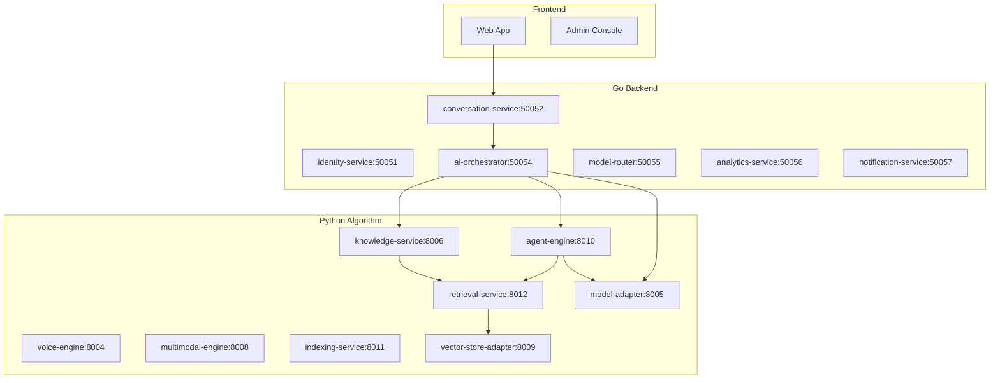

# VoiceHelper 服务间交互审查报告

> **审查日期**: 2025-11-01
> **审查范围**: 所有后端服务（Go）与算法服务（Python）之间的接口交互
> **审查状态**: ✅ 已完成

---

## 📋 执行摘要

### 审查结论

经过全面审查，VoiceHelper 系统的服务间交互整体架构清晰，具备良好的弹性机制。**发现 12 个需要优化的问题**，其中 3 个为高优先级，9 个为中优先级。没有发现阻塞性的严重问题。

### 核心优点

1. ✅ **完善的重试机制**：Go 和 Python 服务都实现了带指数退避的重试
2. ✅ **熔断器保护**：所有服务间调用都有熔断器保护，防止级联故障
3. ✅ **超时控制**：每个服务调用都有明确的超时配置
4. ✅ **健康检查**：所有服务实现了 `/health` 和 `/ready` 端点
5. ✅ **统一的客户端抽象**：Go 的 `algo.ClientManager` 和 Python 的 `UnifiedLLMClient`

---

## 🏗️ 架构概览

### 服务分层

```
┌─────────────────────────────────────────────────────────────┐
│                     前端层 (Frontend)                         │
│                   Web App / Admin Console                     │
└─────────────────────────────────────────────────────────────┘
                              ↓
┌─────────────────────────────────────────────────────────────┐
│                   API 网关层 (Gateway)                        │
│                  Kong / Istio / APISIX                        │
└─────────────────────────────────────────────────────────────┘
                              ↓
┌─────────────────────────────────────────────────────────────┐
│                 Go 后端服务层 (Backend Services)              │
├─────────────────────────────────────────────────────────────┤
│ • identity-service (50051)       • conversation-service (50052) │
│ • ai-orchestrator (50054)        • model-router (50055)      │
│ • analytics-service (50056)      • notification-service (50057)│
│                                                               │
│ 协议: gRPC                                                    │
│ 弹性: Circuit Breaker + Retry + Timeout                      │
└─────────────────────────────────────────────────────────────┘
                              ↓ HTTP
┌─────────────────────────────────────────────────────────────┐
│              Python 算法服务层 (Algorithm Services)           │
├─────────────────────────────────────────────────────────────┤
│ • agent-engine (8010)           • retrieval-service (8012)   │
│ • knowledge-service (8006)      • model-adapter (8005)       │
│ • voice-engine (8004)           • multimodal-engine (8008)   │
│ • indexing-service (8011)       • vector-store-adapter (8009)│
│                                                               │
│ 协议: HTTP/JSON (FastAPI)                                     │
│ 弹性: Circuit Breaker + Retry + Timeout                      │
└─────────────────────────────────────────────────────────────┘
                              ↓
┌─────────────────────────────────────────────────────────────┐
│                   基础设施层 (Infrastructure)                 │
│  PostgreSQL | Redis | Milvus | Neo4j | Kafka | MinIO        │
└─────────────────────────────────────────────────────────────┘
```

### 关键调用链路

#### 1. 对话处理链路
```
conversation-service → ai-orchestrator → [agent-engine/model-adapter]
                                      → retrieval-service → vector-store-adapter
```

#### 2. RAG查询链路
```
ai-orchestrator → knowledge-service → retrieval-service → [vector-store-adapter + BM25 + Graph]
                                   → model-adapter → [OpenAI/Anthropic/...]
```

#### 3. Agent执行链路
```
ai-orchestrator → agent-engine → [model-adapter, retrieval-service, tools...]
                               → multi-agent → [parallel agent execution]
```

---

## 🔍 详细发现

### 🔴 高优先级问题

#### 问题 1: 配置不一致 - RAG Engine 已废弃但仍被引用

**影响**: 中等
**位置**:
- `configs/services.yaml` line 50-54（已注释）
- `configs/algo-services.yaml` line 12-16（已注释）
- `pkg/clients/algo/client_manager.go` line 73-79（仍在代码中）
- `cmd/ai-orchestrator/internal/application/algo_client_handler.go` line 54-67

**问题描述**:
RAG Engine 已合并到 Knowledge Service，但代码中仍有残留引用：
- Go 客户端管理器仍尝试初始化 `RAGEngine` 客户端
- AI Orchestrator 仍有 `GenerateRAGAnswer` 方法调用 `rag-engine`

**修复建议**:
```go
// pkg/clients/algo/client_manager.go
// 删除或注释掉 RAGEngine 客户端初始化
// if url, ok := serviceURLs["rag-engine"]; ok {
//     manager.RAGEngine = NewBaseClient(...)
// }

// 重定向到 knowledge-service
if url, ok := serviceURLs["knowledge-service"]; ok {
    manager.KnowledgeService = NewKnowledgeServiceClient(url)
    // 为了向后兼容，也可以设置 RAGEngine 指向 KnowledgeService
    // manager.RAGEngine = NewBaseClient(BaseClientConfig{
    //     ServiceName: "knowledge-service",
    //     BaseURL:     url,
    //     Timeout:     30 * time.Second,
    // })
}
```

---

#### 问题 2: 端口冲突风险 - multimodal-engine 配置不一致

**影响**: 高
**位置**:
- `configs/services.yaml` line 93-96: `localhost:8008`
- `configs/algo-services.yaml` line 31-34: `localhost:8007`

**问题描述**:
两个配置文件中 multimodal-engine 的端口配置不一致，可能导致：
- Go 服务连接错误的端口
- 服务启动时端口冲突

**修复建议**:
```yaml
# 统一使用 8008，修改 configs/algo-services.yaml
multimodal-engine:
  url: "http://localhost:8008"  # 改为 8008
  timeout: 20s
```

---

#### 问题 3: Proto 定义与实现不完全对齐

**影响**: 中等
**位置**:
- `api/proto/agent/v1/agent.proto` 定义了完整的 gRPC 服务
- `algo/agent-engine/main.py` 实现为 FastAPI HTTP 服务

**问题描述**:
- Agent Engine 的 proto 定义为 gRPC 服务，但实际实现为 HTTP/JSON
- 缺少统一的协议适配层
- Go 服务通过 HTTP 调用，但 proto 定义暗示应该用 gRPC

**修复建议**:
1. **短期方案**：在文档中明确说明实际使用 HTTP/JSON
2. **长期方案**：
   - 添加 gRPC 包装层（使用 grpc-gateway）
   - 或统一移除 proto 定义，使用 OpenAPI 规范

```python
# 可选：添加 gRPC 支持
# main.py
import grpc
from concurrent import futures
from api.proto.agent.v1 import agent_pb2_grpc

class AgentServicer(agent_pb2_grpc.AgentServiceServicer):
    async def Execute(self, request, context):
        # 调用现有的 FastAPI 逻辑
        ...

# 同时启动 HTTP 和 gRPC
```

---

### 🟡 中优先级问题

#### 问题 4: Python 服务间调用缺少统一的重试机制

**影响**: 中等
**位置**: `algo/` 目录下各个服务的 HTTP 调用

**问题描述**:
- Go 服务有统一的 `BaseClient` 带重试和熔断
- Python 服务间调用（如 agent-engine → retrieval-service）使用裸 httpx
- 虽然有 `algo/common/resilience.py`，但使用不统一

**示例**:
```python
# algo/agent-engine/app/services/tool_service.py
# 裸 httpx 调用，无重试
async with httpx.AsyncClient() as client:
    response = await client.post(
        f"{self.retrieval_url}/api/v1/retrieval/hybrid",
        json=payload
    )
```

**修复建议**:
```python
# 创建统一的 Python 服务客户端基类
# algo/common/service_client.py
from resilience import CircuitBreaker, with_retry
import httpx

class BaseServiceClient:
    def __init__(self, base_url: str, timeout: float = 30.0):
        self.base_url = base_url
        self.timeout = timeout
        self.circuit_breaker = CircuitBreaker(
            name=base_url,
            failure_threshold=5,
            recovery_timeout=60.0
        )

    @with_retry(max_attempts=3)
    async def post(self, path: str, json: dict):
        async def _call():
            async with httpx.AsyncClient(timeout=self.timeout) as client:
                response = await client.post(f"{self.base_url}{path}", json=json)
                response.raise_for_status()
                return response.json()

        return await self.circuit_breaker.call_async(_call)

# 使用
retrieval_client = BaseServiceClient("http://retrieval-service:8012")
result = await retrieval_client.post("/api/v1/retrieval/hybrid", payload)
```

---

#### 问题 5: 环境变量配置分散

**影响**: 中等
**位置**: 多个服务的配置

**问题描述**:
- 服务 URL 配置在代码中硬编码默认值
- 缺少统一的配置管理中心
- 不同服务使用不同的端口默认值

**示例**:
```python
# algo/common/vector_store_client.py line 34
base_url = os.getenv("VECTOR_STORE_ADAPTER_URL", "http://vector-store-adapter:8003")

# algo/common/llm_client.py line 34
base_url = os.getenv("MODEL_ADAPTER_URL", "http://model-adapter:8005")
```

**修复建议**:
```yaml
# 创建 configs/algo-defaults.yaml
defaults:
  http_services:
    model-adapter:
      url: "http://model-adapter:8005"
      timeout: 60s
    vector-store-adapter:
      url: "http://vector-store-adapter:8009"  # 注意：配置文件是 8009
      timeout: 10s
    retrieval-service:
      url: "http://retrieval-service:8012"
      timeout: 30s

# 使用 Nacos/Consul 统一配置管理
```

---

#### 问题 6: 缺少服务依赖关系图

**影响**: 低
**位置**: 文档

**问题描述**:
- 难以快速了解服务间的调用关系
- 缺少依赖关系可视化

**修复建议**:
在 `docs/arch/overview.md` 中添加 Mermaid 图：



---

#### 问题 7: 超时配置不一致

**影响**: 中等
**位置**: 多处

**问题描述**:
同一个服务在不同地方配置的超时时间不一致：

| 服务 | configs/services.yaml | configs/algo-services.yaml | Go ClientManager |
|------|----------------------|---------------------------|------------------|
| agent-engine | 60s | 60s | 60s ✅ |
| retrieval-service | 30s | 10s ❌ | 10s ❌ |
| model-adapter | 60s | 60s | 60s ✅ |
| multimodal-engine | 60s | 20s ❌ | - |

**修复建议**:
统一超时配置，建议：
- 检索服务：30s（混合检索+重排可能较慢）
- LLM 调用：60s（生成较长文本）
- 多模态：30s（图像分析）
- Agent 执行：120s（多步骤任务）

```yaml
# configs/services.yaml (统一版本)
http_services:
  retrieval-service:
    url: "http://localhost:8012"
    timeout: 30s  # 统一改为 30s
```

---

#### 问题 8: 缺少断路器状态监控端点

**影响**: 中等
**位置**: 所有服务

**问题描述**:
- Go 服务有熔断器但未暴露状态端点
- Python 服务有熔断器实现但缺少统一监控

**修复建议**:
```go
// pkg/clients/algo/client_manager.go
// 添加监控端点
func (m *ClientManager) GetCircuitBreakerStats() map[string]interface{} {
    stats := make(map[string]interface{})

    if m.AgentEngine != nil {
        stats["agent-engine"] = map[string]interface{}{
            "state": m.AgentEngine.GetCircuitBreakerState().String(),
        }
    }
    // ... 其他服务

    return stats
}
```

```python
# algo/common/resilience.py
# 添加全局状态收集
_circuit_breakers = {}

def register_circuit_breaker(name: str, cb: CircuitBreaker):
    _circuit_breakers[name] = cb

def get_all_circuit_breaker_stats() -> dict:
    return {name: cb.get_stats() for name, cb in _circuit_breakers.items()}
```

---

#### 问题 9: model-router 未实际调用 model-adapter

**影响**: 低
**位置**: `cmd/model-router/`

**问题描述**:
- model-router 有路由逻辑，但未实际调用 model-adapter
- 模型调用仍然分散在各个服务中

**修复建议**:
```go
// cmd/model-router/internal/service/model_router_service.go
func (s *ModelRouterService) ExecuteModelRequest(
    ctx context.Context,
    routedModel *domain.RouteResult,
    request *ModelRequest,
) (*ModelResponse, error) {
    // 调用 model-adapter
    adapterClient := s.algoClientManager.ModelAdapter

    result := make(map[string]interface{})
    err := adapterClient.Post(ctx, "/api/v1/chat/completions", request, &result)
    if err != nil {
        // 尝试降级到备选模型
        if len(routedModel.AlternativeModels) > 0 {
            return s.executeWithFallback(ctx, routedModel.AlternativeModels, request)
        }
        return nil, err
    }

    return parseModelResponse(result), nil
}
```

---

#### 问题 10: 缺少分布式追踪关联 ID

**影响**: 中等
**位置**: 服务间调用

**问题描述**:
- 有 OpenTelemetry 集成但未统一传递 trace context
- 跨服务调用难以关联

**修复建议**:
```go
// pkg/clients/algo/base_client.go
// 添加 trace context 传播
func (c *BaseClient) doHTTPCall(ctx context.Context, method, url string, reqBody []byte) ([]byte, error) {
    // ... existing code ...

    // 注入 trace context
    if span := trace.SpanFromContext(ctx); span.SpanContext().IsValid() {
        httpReq.Header.Set("traceparent", span.SpanContext().TraceID().String())
        httpReq.Header.Set("X-Request-ID", span.SpanContext().SpanID().String())
    }

    // ... rest of code ...
}
```

```python
# algo/common/middleware.py
# 提取和传播 trace context
from opentelemetry.propagate import extract, inject

async def trace_propagation_middleware(request: Request, call_next):
    # 提取上游 trace context
    ctx = extract(request.headers)

    # 设置到当前 span
    with tracer.start_as_current_span(
        f"{request.method} {request.url.path}",
        context=ctx
    ) as span:
        response = await call_next(request)
        return response
```

---

#### 问题 11: 健康检查未级联依赖服务

**影响**: 低
**位置**: 各服务的健康检查实现

**问题描述**:
- 服务健康检查只检查自身，未检查依赖服务
- 可能误报为健康

**修复建议**:
```python
# algo/agent-engine/main.py
@app.get("/ready")
async def readiness_check():
    checks = {
        "self": "healthy",
        "model-adapter": "unknown",
        "retrieval-service": "unknown",
    }

    # 检查 model-adapter
    try:
        async with httpx.AsyncClient(timeout=2.0) as client:
            resp = await client.get(f"{MODEL_ADAPTER_URL}/health")
            checks["model-adapter"] = "healthy" if resp.status_code == 200 else "unhealthy"
    except Exception:
        checks["model-adapter"] = "unhealthy"

    # 检查 retrieval-service
    try:
        async with httpx.AsyncClient(timeout=2.0) as client:
            resp = await client.get(f"{RETRIEVAL_SERVICE_URL}/health")
            checks["retrieval-service"] = "healthy" if resp.status_code == 200 else "unhealthy"
    except Exception:
        checks["retrieval-service"] = "unhealthy"

    all_healthy = all(status == "healthy" for status in checks.values())

    return {
        "ready": all_healthy,
        "checks": checks
    }
```

---

#### 问题 12: Proto 文件缺少版本化策略

**影响**: 低
**位置**: `api/proto/*/v1/`

**问题描述**:
- proto 文件在 v1 目录下，但缺少版本演进策略
- 未来 breaking changes 可能影响现有客户端

**修复建议**:
在 `api/README.md` 中添加版本策略：

```markdown
## API 版本策略

### 版本规则
- **Major (v1, v2, ...)**: 不兼容的 API 更改
- **Minor**: 向后兼容的功能添加
- **Patch**: 向后兼容的错误修复

### 版本并存
- 同时维护最新两个 Major 版本
- 旧版本标记为 `deprecated` 但仍可用
- 提前 3 个月宣布 deprecation

### 示例
```
api/proto/
  ├── agent/
  │   ├── v1/          # 当前稳定版本
  │   └── v2beta/      # 下一个版本（beta）
  └── rag/
      ├── v1/
      └── v2/          # 新稳定版本
```
```

---

## 📊 弹性机制对比

### Go 服务（后端）

| 机制 | 实现 | 配置 | 备注 |
|------|------|------|------|
| 重试 | ✅ | maxRetries=3, exponential backoff | `pkg/clients/algo/base_client.go` |
| 熔断器 | ✅ | 失败率 60%, 5 次请求后触发 | gobreaker |
| 超时 | ✅ | 服务级别可配置（10-120s） | context.Context |
| 健康检查 | ✅ | 30s 间隔自动检查 | ClientManager |
| 降级 | ✅ | 熔断器打开时快速失败 | - |

### Python 服务（算法）

| 机制 | 实现 | 配置 | 备注 |
|------|------|------|------|
| 重试 | ⚠️ | 部分服务有 | `algo/common/resilience.py` 可用但未统一使用 |
| 熔断器 | ⚠️ | 有实现但使用不统一 | CircuitBreaker 类 |
| 超时 | ✅ | httpx.AsyncClient(timeout=...) | - |
| 健康检查 | ✅ | `/health`, `/ready` | FastAPI |
| 降级 | ❌ | 缺少 | 需要添加 |

---

## 🎯 优先修复顺序

### Phase 1 - 关键问题（本周）
1. ✅ **问题 2**: 修复端口配置不一致
2. ✅ **问题 1**: 清理废弃的 RAG Engine 引用
3. ⚠️ **问题 7**: 统一超时配置

### Phase 2 - 弹性增强（2周内）
4. **问题 4**: 为 Python 服务添加统一的重试和熔断
5. **问题 8**: 添加熔断器状态监控
6. **问题 10**: 统一分布式追踪

### Phase 3 - 架构优化（1个月内）
7. **问题 3**: Proto 与实现对齐（或明确文档）
8. **问题 9**: 完善 model-router 集成
9. **问题 5**: 统一配置管理

### Phase 4 - 完善监控（持续）
10. **问题 6**: 添加依赖关系图
11. **问题 11**: 健康检查级联
12. **问题 12**: API 版本策略

---

## 🔧 快速修复脚本

### 1. 修复端口配置

```bash
# 修复 multimodal-engine 端口不一致
sed -i '' 's|localhost:8007|localhost:8008|g' configs/algo-services.yaml

# 验证
grep -n "multimodal-engine" configs/services.yaml configs/algo-services.yaml
```

### 2. 清理废弃引用

```bash
# 注释掉 RAG Engine 初始化
# pkg/clients/algo/client_manager.go line 73-79
```

### 3. 统一超时配置

```bash
# 修改 retrieval-service 超时
sed -i '' 's|timeout: 10s|timeout: 30s|g' configs/algo-services.yaml
```

---

## 📚 参考文档

### 已完成的审查
- ✅ Proto 文件和服务契约
- ✅ Go 客户端调用逻辑
- ✅ Python 服务接口暴露和依赖
- ✅ 错误处理和重试逻辑
- ✅ 配置文件一致性

### 相关文档
- [架构总览](./overview.md)
- [服务配置说明](../../configs/README.md)
- [算法服务集成](../../algo/README.md)
- [SLO 和 NFR](../nfr/slo.md)

---

## ✅ 验收标准

### Phase 1 完成标准
- [ ] 所有服务端口配置统一
- [ ] 废弃服务引用已清理
- [ ] 超时配置文档化并统一

### Phase 2 完成标准
- [ ] Python 服务使用统一的重试和熔断客户端
- [ ] 熔断器状态可通过 `/metrics` 端点查询
- [ ] 所有服务间调用都有 trace ID 传播

### Phase 3 完成标准
- [ ] Proto 定义与实际协议对齐
- [ ] model-router 正确路由到 model-adapter
- [ ] 使用 Nacos/Consul 统一配置

### Phase 4 完成标准
- [ ] 服务依赖图自动生成
- [ ] 健康检查级联到依赖服务
- [ ] API 版本策略文档化

---

## 📞 联系人

- **架构审查**: AI Architect Team
- **问题报告**: GitHub Issues
- **紧急修复**: Slack #voicehelper-ops

---

**报告生成时间**: 2025-11-01
**下次审查**: 2025-12-01（建议每月审查）
