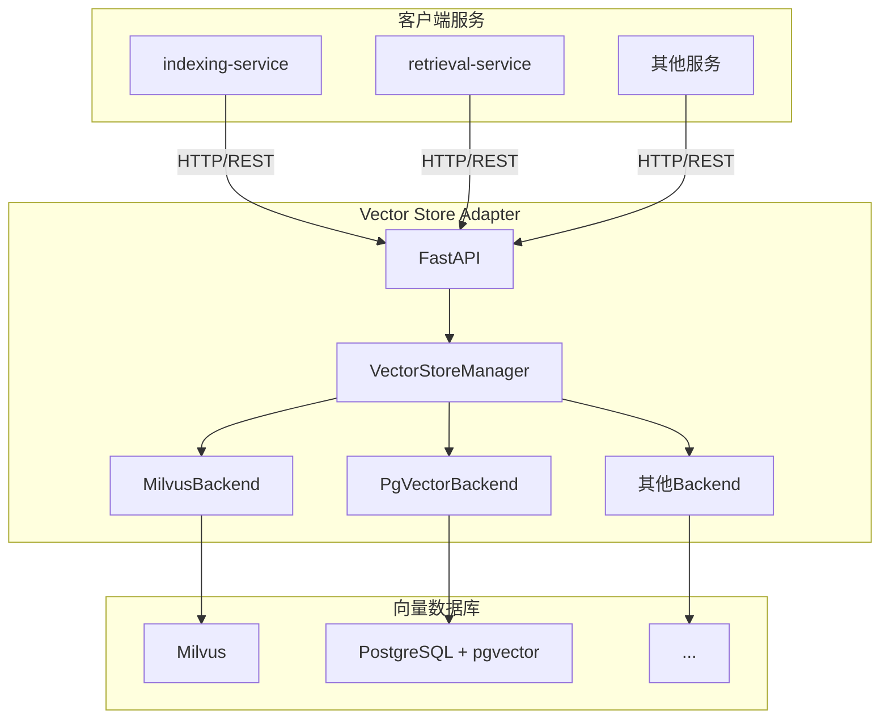

# Vector Store Adapter Service - 向量库适配服务

## 概述

向量库适配服务（Vector Store Adapter Service）是一个统一的向量数据库访问层，为上层应用提供统一的 API 接口，屏蔽底层不同向量数据库的差异。

## 设计目标

1. **统一接口**：提供统一的 REST API，屏蔽不同向量数据库的实现细节
2. **多后端支持**：支持 Milvus、pgvector 等多种向量数据库
3. **易于扩展**：新增向量数据库后端只需实现统一接口
4. **高性能**：异步 I/O，连接池管理，批量操作优化
5. **可观测性**：完整的监控指标和健康检查

## 架构设计

### 系统架构



### 核心组件

#### 1. VectorStoreManager

管理多个向量数据库后端，提供统一的操作接口。

**职责**：

- 初始化和管理多个后端实例
- 路由请求到指定后端
- 健康检查和统计信息聚合

#### 2. VectorStoreBackend（抽象基类）

定义向量数据库后端的标准接口。

**接口方法**：

- `insert_vectors()`: 插入向量
- `search_vectors()`: 向量检索
- `delete_by_document()`: 删除向量
- `get_count()`: 获取数量
- `create_collection()`: 创建集合
- `drop_collection()`: 删除集合

#### 3. MilvusBackend

Milvus 向量数据库后端实现。

**特性**：

- HNSW 索引
- 高性能向量检索
- 支持标量过滤

#### 4. PgVectorBackend

PostgreSQL + pgvector 后端实现。

**特性**：

- IVFFlat 索引
- 统一数据管理
- 适合中小规模

## API 接口

### 1. 插入向量

```http
POST /collections/{collection_name}/insert
Content-Type: application/json

{
  "backend": "milvus",
  "data": [
    {
      "chunk_id": "chunk_001",
      "document_id": "doc_001",
      "content": "文本内容",
      "embedding": [0.1, 0.2, ...],
      "tenant_id": "tenant_123",
      "metadata": {}
    }
  ]
}
```

**响应**：

```json
{
  "status": "success",
  "collection": "document_chunks",
  "backend": "milvus",
  "inserted": 1,
  "result": {}
}
```

### 2. 向量检索

```http
POST /collections/{collection_name}/search
Content-Type: application/json

{
  "backend": "milvus",
  "query_vector": [0.1, 0.2, ...],
  "top_k": 10,
  "tenant_id": "tenant_123",
  "filters": null,
  "search_params": {
    "metric_type": "IP",
    "params": {"ef": 128}
  }
}
```

**响应**：

```json
{
  "status": "success",
  "collection": "document_chunks",
  "backend": "milvus",
  "count": 10,
  "results": [
    {
      "chunk_id": "chunk_001",
      "document_id": "doc_001",
      "content": "文本内容",
      "tenant_id": "tenant_123",
      "score": 0.95,
      "distance": 0.05,
      "backend": "milvus"
    }
  ]
}
```

### 3. 删除向量

```http
DELETE /collections/{collection_name}/documents/{document_id}?backend=milvus
```

### 4. 获取数量

```http
GET /collections/{collection_name}/count?backend=milvus
```

### 5. 健康检查

```http
GET /health
GET /ready
```

### 6. 统计信息

```http
GET /stats
```

## 客户端使用

### VectorStoreClient

客户端库封装了对适配服务的调用。

```python
from app.infrastructure.vector_store_client import VectorStoreClient

# 初始化客户端
client = VectorStoreClient(
    base_url="http://vector-store-adapter:8003",
    collection_name="document_chunks",
    backend="milvus",
)

# 插入向量
await client.insert_batch([
    {
        "chunk_id": "chunk_001",
        "document_id": "doc_001",
        "content": "文本内容",
        "embedding": [0.1, 0.2, ...],
        "tenant_id": "tenant_123",
    }
])

# 检索向量
results = await client.search(
    query_vector=[0.1, 0.2, ...],
    top_k=10,
    tenant_id="tenant_123",
)

# 删除向量
await client.delete_by_document("doc_001")

# 获取数量
count = await client.count()

# 关闭连接
await client.close()
```

## 服务迁移

### 迁移前

```python
# 直接调用 MilvusClient
from app.infrastructure.milvus_client import MilvusClient

milvus_client = MilvusClient()
await milvus_client.insert_batch(data)
results = await milvus_client.search(query_vector, top_k=10)
```

### 迁移后

```python
# 通过适配服务调用
from app.infrastructure.vector_store_client import VectorStoreClient

vector_store_client = VectorStoreClient()
await vector_store_client.insert_batch(data)
results = await vector_store_client.search(query_vector, top_k=10)
```

## 配置管理

### 环境变量

#### Milvus

```bash
MILVUS_HOST=localhost
MILVUS_PORT=19530
MILVUS_USER=
MILVUS_PASSWORD=
```

#### pgvector

```bash
PGVECTOR_HOST=localhost
PGVECTOR_PORT=5432
PGVECTOR_DATABASE=voicehelper
PGVECTOR_USER=postgres
PGVECTOR_PASSWORD=
```

#### 通用

```bash
DEFAULT_BACKEND=milvus
VECTOR_DIMENSION=1024
```

## 部署指南

### Docker Compose 部署

```bash
cd deployments/docker
docker-compose -f docker-compose.vector-store-adapter.yml up -d
```

### Kubernetes 部署

```yaml
apiVersion: apps/v1
kind: Deployment
metadata:
  name: vector-store-adapter
spec:
  replicas: 3
  selector:
    matchLabels:
      app: vector-store-adapter
  template:
    metadata:
      labels:
        app: vector-store-adapter
    spec:
      containers:
        - name: vector-store-adapter
          image: vector-store-adapter:latest
          ports:
            - containerPort: 8003
          env:
            - name: MILVUS_HOST
              value: 'milvus-service'
            - name: PGVECTOR_HOST
              value: 'postgres-service'
          resources:
            requests:
              cpu: 500m
              memory: 512Mi
            limits:
              cpu: 2000m
              memory: 2Gi
---
apiVersion: v1
kind: Service
metadata:
  name: vector-store-adapter
spec:
  selector:
    app: vector-store-adapter
  ports:
    - port: 8003
      targetPort: 8003
```

## 性能指标

### 延迟

- **插入延迟**：< 50ms (批量 100 条)
- **检索延迟**：< 20ms (Top 10)

### 吞吐量

- **插入 QPS**：> 1000 (批量插入)
- **检索 QPS**：> 500

### 并发

- **最大并发连接**：1000
- **连接池大小**：20 (可配置)

## 监控指标

### Prometheus 指标

访问 `/metrics` 端点：

```
# 操作总数
vector_operations_total{operation="insert",backend="milvus",status="success"} 1234

# 操作延迟
vector_operation_duration_seconds_bucket{operation="search",backend="milvus",le="0.01"} 980
vector_operation_duration_seconds_bucket{operation="search",backend="milvus",le="0.05"} 1200
```

### 告警规则

```yaml
# 高延迟告警
- alert: VectorStoreHighLatency
  expr: histogram_quantile(0.95, rate(vector_operation_duration_seconds_bucket[5m])) > 0.1
  for: 5m
  labels:
    severity: warning
  annotations:
    summary: '向量库操作延迟过高'

# 高错误率告警
- alert: VectorStoreHighErrorRate
  expr: rate(vector_operations_total{status="error"}[5m]) / rate(vector_operations_total[5m]) > 0.01
  for: 5m
  labels:
    severity: critical
  annotations:
    summary: '向量库操作错误率 > 1%'
```

## 扩展新后端

### 1. 实现 VectorStoreBackend 接口

```python
from app.core.base_backend import VectorStoreBackend

class NewVectorBackend(VectorStoreBackend):
    async def initialize(self):
        # 初始化连接
        pass

    async def insert_vectors(self, collection_name, data):
        # 实现插入逻辑
        pass

    async def search_vectors(self, collection_name, query_vector, top_k, ...):
        # 实现检索逻辑
        pass

    # ... 实现其他接口方法
```

### 2. 注册到 VectorStoreManager

```python
# app/core/vector_store_manager.py
from app.backends.new_backend import NewVectorBackend

async def initialize(self):
    # ...
    try:
        new_config = config.get_backend_config("new_backend")
        new_backend = NewVectorBackend(new_config)
        await new_backend.initialize()
        self.backends["new_backend"] = new_backend
    except Exception as e:
        logger.error(f"Failed to initialize new backend: {e}")
```

## 故障排查

### 常见问题

#### 1. 连接失败

**症状**：`/ready` 返回 `ready: false`

**排查**：

1. 检查后端服务是否运行
2. 检查网络连接
3. 检查环境变量配置

#### 2. 检索延迟高

**症状**：检索耗时 > 100ms

**排查**：

1. 检查向量维度是否过大
2. 检查索引是否正确创建
3. 检查并发数是否过高

#### 3. 插入失败

**症状**：插入返回 500 错误

**排查**：

1. 检查数据格式是否正确
2. 检查向量维度是否匹配
3. 检查后端存储空间

## 最佳实践

1. **批量操作**：尽量使用批量插入，提高吞吐量
2. **连接复用**：使用连接池，避免频繁创建连接
3. **缓存结果**：对热点查询进行缓存
4. **租户隔离**：使用 tenant_id 进行数据隔离
5. **监控告警**：配置完整的监控和告警

## 路线图

- [x] Milvus 后端支持
- [x] pgvector 后端支持
- [ ] Qdrant 后端支持
- [ ] Weaviate 后端支持
- [ ] 缓存层（Redis）
- [ ] 批量操作优化
- [ ] 流式插入
- [ ] 自动分片

## 参考资料

- [Milvus 文档](https://milvus.io/docs)
- [pgvector 文档](https://github.com/pgvector/pgvector)
- [FastAPI 文档](https://fastapi.tiangolo.com/)
