# VoiceHelper 微服务架构设计方案 V2.0

> **版本**: v2.0  
> **设计日期**: 2025-10-26  
> **目标**: 基于DDD和云原生最佳实践重构微服务架构  
> **核心技术栈**: Kratos、APISIX、Kafka、Flink、ClickHouse、Milvus、Debezium、Argo CD  
> **参考**: 字节跳动、阿里巴巴、Apache基金会、CNCF

---

## 目录

1. [现状分析](#1-现状分析)
2. [架构设计原则](#2-架构设计原则)
3. [目标架构](#3-目标架构)
4. [核心技术栈](#4-核心技术栈)
5. [服务重新划分](#5-服务重新划分)
6. [通信模式](#6-通信模式)
7. [数据管理策略](#7-数据管理策略)
8. [实时数据处理](#8-实时数据处理)
9. [可观测性增强](#9-可观测性增强)
10. [安全架构](#10-安全架构)
11. [GitOps部署](#11-gitops部署)

---

## 1. 现状分析

### 1.1 当前架构

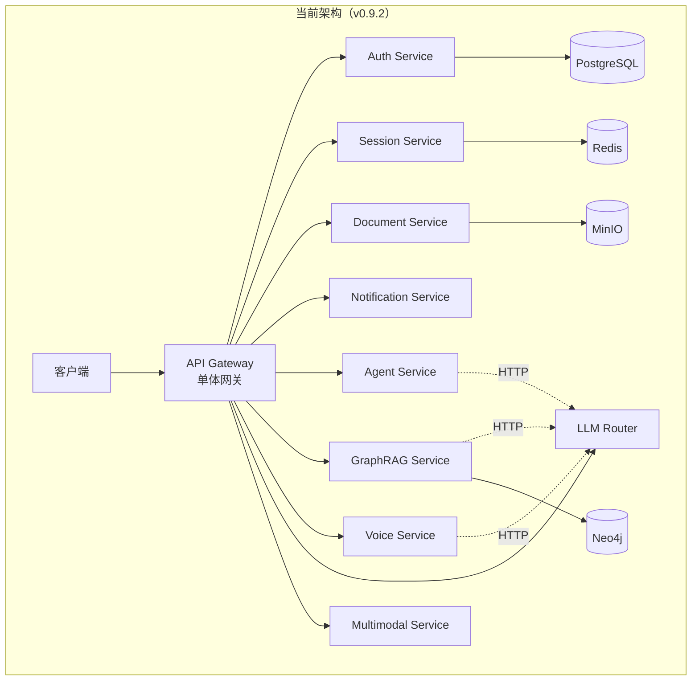

### 1.2 存在的问题

#### 架构层面

- ❌ **网关过载**: Gateway承担过多职责（路由、鉴权、限流、协议转换、WebSocket代理）
- ❌ **服务粒度不合理**:
  - Auth Service功能单一，仅做JWT验证
  - Session Service与对话逻辑紧耦合
  - Document Service包含过多pipeline逻辑
- ❌ **缺乏领域划分**: 服务按技术功能划分而非业务领域
- ❌ **直接依赖**: 算法服务直接调用LLM Router，缺乏抽象层

#### 通信层面

- ❌ **协议混乱**: HTTP REST + gRPC混用，没有统一标准
- ❌ **同步耦合**: 服务间主要是同步HTTP调用
- ❌ **缺乏服务网格**: 服务发现、负载均衡、熔断等逻辑分散在应用代码中

#### 数据层面

- ❌ **共享数据库**: 多个服务访问同一PostgreSQL实例的不同表
- ❌ **缓存不一致**: Redis缓存更新策略不统一
- ❌ **事务边界模糊**: 跨服务事务使用补偿机制但缺乏统一管理

#### 可观测性

- ❌ **日志分散**: 各服务独立日志，缺乏统一追踪
- ❌ **指标不全**: 业务指标缺失（如对话成功率、知识召回率）
- ❌ **告警不完善**: 缺乏业务级别的SLO/SLI监控

---

## 2. 架构设计原则

### 2.1 领域驱动设计（DDD）

按**业务领域**而非技术功能划分服务：

| 领域 | 子域 | 服务 |
|-----|------|------|
| **用户域** | 身份认证、授权、租户管理 | Identity Service |
| **对话域** | 会话管理、消息流转、上下文维护 | Conversation Service |
| **知识域** | 文档管理、知识图谱、向量检索 | Knowledge Service |
| **AI能力域** | Agent、RAG、语音、多模态 | AI Engine Service |
| **通知域** | 消息推送、邮件、Webhook | Notification Service |

### 2.2 微服务架构原则

1. **单一职责**: 每个服务只负责一个业务领域
2. **自治性**: 服务独立部署、独立数据库、独立版本
3. **松耦合**: 通过事件和异步消息解耦
4. **高内聚**: 相关功能聚合在同一服务
5. **可替换性**: 服务可独立替换和升级
6. **去中心化**: 避免共享数据库和单点故障

### 2.3 云原生12因素

- ✅ 代码库统一管理（Monorepo）
- ✅ 显式声明依赖（go.mod/requirements.txt）
- ✅ 配置外部化（环境变量/Consul KV）
- ✅ 后端服务解耦（通过服务发现）
- ✅ 严格分离构建和运行
- ✅ 无状态进程
- ✅ 端口绑定暴露服务
- ✅ 并发通过进程扩展
- ✅ 快速启动和优雅关闭
- ✅ 开发环境与生产环境等价
- ✅ 日志作为事件流
- ✅ 管理任务作为一次性进程

---

## 3. 目标架构

### 3.1 整体架构图

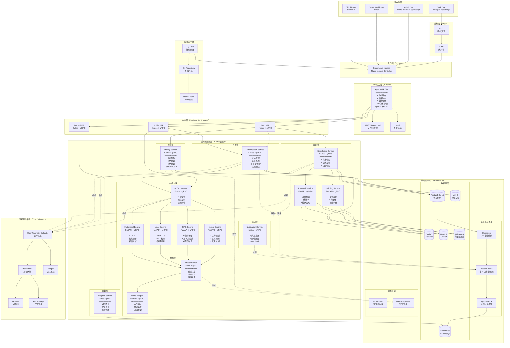

### 3.2 架构分层说明

#### Layer 1: 客户端层

- **职责**: 用户交互界面
- **技术**: Web (Next.js), Mobile (React Native), Admin (Flask)
- **特点**: 前后端分离、响应式设计

#### Layer 2: 边缘层

- **职责**: 静态资源加速、安全防护
- **技术**: CDN (CloudFlare/Akamai), WAF (ModSecurity)
- **特点**: 全球分发、DDoS防护

#### Layer 3: 入口层

- **职责**: 负载均衡、SSL终止
- **技术**: Nginx/HAProxy
- **特点**: L7负载均衡、健康检查

#### Layer 4: API网关层（APISIX）

- **职责**: API统一入口、动态路由、流量控制
- **技术**: Apache APISIX + etcd
- **特点**:
  - 动态路由配置（无需重启）
  - 丰富的插件生态（限流、熔断、认证、监控）
  - gRPC <-> HTTP协议转换
  - API版本管理与灰度发布
  - WebSocket/SSE代理
  - 可视化Dashboard管理
  - 高性能（基于OpenResty/Nginx）

#### Layer 5: BFF层（Kratos微服务）

- **职责**: 为不同客户端定制API
- **技术**: Go + Kratos框架 + gRPC
- **特点**:
  - 聚合多个后端服务调用
  - 减少客户端请求次数
  - 适配不同端的数据格式
  - 缓存热点数据
  - 统一错误处理

#### Layer 6: 业务域服务层（Kratos微服务）

- **技术**: Go (Kratos框架) + Python (FastAPI)
- **特点**:
  - 按DDD划分的领域服务
  - gRPC通信
  - Protobuf定义接口
  - 服务注册与发现
  - 熔断降级
  - 链路追踪

#### Layer 7: 基础设施层

- **数据平面**: PostgreSQL、Redis、Neo4j、Milvus、ClickHouse、MinIO
- **消息与流处理**: Kafka（事件总线）+ Debezium（CDC）+ Flink（流计算）
- **配置平面**: etcd（APISIX配置）+ Vault（密钥管理）

#### Layer 8: 可观测性平台（OpenTelemetry）

- **统一采集**: OpenTelemetry Collector
- **指标**: Prometheus + Grafana
- **追踪**: Jaeger
- **告警**: AlertManager

#### Layer 9: GitOps平台

- **持续部署**: Argo CD
- **应用模板**: Helm Charts
- **配置仓库**: Git Repository

---

## 4. 核心技术栈

### 4.1 技术栈总览

| 分类 | 组件 | 版本 | 用途 | 语言 |
|-----|------|------|------|------|
| **微服务框架** | Kratos | v2.7+ | Go微服务框架 | Go |
| **微服务框架** | FastAPI | v0.110+ | Python微服务框架 | Python |
| **API网关** | Apache APISIX | v3.7+ | 动态API网关 | Lua/OpenResty |
| **RPC通信** | grpc-go | v1.60+ | Go gRPC实现 | Go |
| **容器编排** | Kubernetes | v1.28+ | 容器管理平台 | - |
| **容器运行时** | Docker | v24+ | 容器化 | - |
| **消息队列** | Apache Kafka | v3.6+ | 事件流平台 | Java/Scala |
| **流处理** | Apache Flink | v1.18+ | 实时流计算 | Java/Scala |
| **CDC** | Debezium | v2.5+ | 数据变更捕获 | Java |
| **OLTP数据库** | PostgreSQL | v15+ | 关系型数据库 | - |
| **缓存** | Redis | v7+ | 内存数据库 | - |
| **图数据库** | Neo4j | v5+ | 知识图谱 | - |
| **向量数据库** | Milvus | v2.3+ | 向量检索 | Go/Python |
| **OLAP数据库** | ClickHouse | v23+ | 列式分析数据库 | C++ |
| **对象存储** | MinIO | Latest | S3兼容对象存储 | Go |
| **密钥管理** | HashiCorp Vault | v1.15+ | 密钥与配置管理 | Go |
| **可观测性** | OpenTelemetry | v1.21+ | 统一遥测数据采集 | Multi |
| **指标监控** | Prometheus | v2.48+ | 时序数据库 | Go |
| **可视化** | Grafana | v10+ | 监控仪表盘 | TypeScript |
| **链路追踪** | Jaeger | v1.52+ | 分布式追踪 | Go |
| **包管理** | Helm | v3.13+ | Kubernetes应用管理 | Go |
| **GitOps** | Argo CD | v2.9+ | 持续部署 | Go |
| **前端框架** | Next.js | v14+ | React全栈框架 | TypeScript |
| **前端库** | React | v18+ | UI组件库 | TypeScript |

### 4.2 Kratos微服务框架

**选型理由**:

- ✅ B站开源，生产验证（日均数十亿请求）
- ✅ 微服务全家桶（gRPC、HTTP、配置、日志、追踪、限流、熔断）
- ✅ DDD友好，分层清晰（api/biz/service/data）
- ✅ 代码生成工具完善（kratos-layout、protoc插件）
- ✅ 中间件生态丰富（Prometheus、Jaeger、Consul）

**核心特性**:

```go
// Kratos服务骨架
import (
    "github.com/go-kratos/kratos/v2"
    "github.com/go-kratos/kratos/v2/middleware/recovery"
    "github.com/go-kratos/kratos/v2/middleware/tracing"
    "github.com/go-kratos/kratos/v2/transport/grpc"
    "github.com/go-kratos/kratos/v2/transport/http"
)

func main() {
    // HTTP Server
    httpSrv := http.NewServer(
        http.Address(":8000"),
        http.Middleware(
            recovery.Recovery(),
            tracing.Server(),
        ),
    )
    
    // gRPC Server
    grpcSrv := grpc.NewServer(
        grpc.Address(":9000"),
        grpc.Middleware(
            recovery.Recovery(),
            tracing.Server(),
        ),
    )
    
    // 创建Kratos应用
    app := kratos.New(
        kratos.Name("identity-service"),
        kratos.Version("v1.0.0"),
        kratos.Server(httpSrv, grpcSrv),
    )
    
    if err := app.Run(); err != nil {
        panic(err)
    }
}
```

**项目结构**:

```
voicehelper-identity-service/
├── api/                      # Protobuf定义
│   └── identity/
│       └── v1/
│           ├── identity.proto
│           ├── identity.pb.go       # protoc生成
│           └── identity_grpc.pb.go  # protoc生成
├── cmd/
│   └── identity/
│       └── main.go           # 入口文件
├── internal/
│   ├── biz/                  # 业务逻辑层
│   │   ├── user.go
│   │   └── tenant.go
│   ├── service/              # 服务实现层（实现proto）
│   │   └── identity.go
│   ├── data/                 # 数据访问层
│   │   ├── data.go          # Wire依赖注入
│   │   ├── user.go
│   │   └── tenant.go
│   └── conf/                 # 配置定义
│       └── conf.proto
├── configs/
│   └── config.yaml           # 配置文件
├── go.mod
└── Dockerfile
```

### 4.3 Apache APISIX网关

**选型理由**:

- ✅ 基于OpenResty/Nginx，高性能（10万QPS+）
- ✅ 动态配置（etcd存储，无需重启）
- ✅ 丰富插件生态（80+插件）
- ✅ 支持gRPC转码（gRPC <-> HTTP）
- ✅ 云原生友好（Kubernetes Ingress Controller）
- ✅ 商业化支持（API7.ai）

**核心功能**:

| 功能 | 插件 | 说明 |
|-----|------|------|
| **认证** | `jwt-auth`, `key-auth`, `oauth2` | JWT/API Key/OAuth2认证 |
| **限流** | `limit-req`, `limit-count` | 请求速率限制 |
| **熔断** | `api-breaker` | 错误率熔断 |
| **重试** | `proxy-rewrite` | 请求重试 |
| **缓存** | `proxy-cache` | 响应缓存 |
| **监控** | `prometheus` | Prometheus指标 |
| **追踪** | `opentelemetry` | OpenTelemetry追踪 |
| **协议转换** | `grpc-transcode`, `grpc-web` | gRPC转码 |
| **灰度发布** | `traffic-split` | 金丝雀发布 |
| **CORS** | `cors` | 跨域支持 |

**配置示例**:

```yaml
# APISIX路由配置
routes:
  - id: identity-service
    uri: /api/v1/identity/*
    upstream:
      type: roundrobin
      nodes:
        - host: identity-service.voicehelper.svc.cluster.local
          port: 9000
          weight: 1
    plugins:
      jwt-auth:
        header: Authorization
        claim_specs:
          - claim: user_id
            type: string
      limit-req:
        rate: 100
        burst: 50
        key: $remote_addr
      prometheus:
        prefer_name: true
      opentelemetry:
        sampler:
          name: always_on
```

### 4.4 Apache Kafka + Debezium + Flink

**架构**:

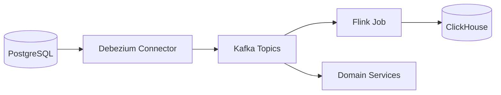

**Debezium CDC配置**:

```json
{
  "name": "voicehelper-postgres-connector",
  "config": {
    "connector.class": "io.debezium.connector.postgresql.PostgresConnector",
    "database.hostname": "postgres",
    "database.port": "5432",
    "database.user": "debezium",
    "database.password": "${vault:secret/debezium:password}",
    "database.dbname": "voicehelper",
    "database.server.name": "voicehelper",
    "table.include.list": "conversation.conversations,conversation.messages,knowledge.documents",
    "plugin.name": "pgoutput",
    "publication.autocreate.mode": "filtered",
    "snapshot.mode": "initial",
    "transforms": "route",
    "transforms.route.type": "org.apache.kafka.connect.transforms.RegexRouter",
    "transforms.route.regex": "([^.]+)\\.([^.]+)\\.([^.]+)",
    "transforms.route.replacement": "$1.$2"
  }
}
```

**Flink流处理任务**:

```python
# PyFlink实时统计
from pyflink.datastream import StreamExecutionEnvironment
from pyflink.table import StreamTableEnvironment

env = StreamExecutionEnvironment.get_execution_environment()
t_env = StreamTableEnvironment.create(env)

# 从Kafka读取消息事件
t_env.execute_sql("""
    CREATE TABLE message_events (
        conversation_id STRING,
        user_id STRING,
        tenant_id STRING,
        message_count BIGINT,
        ts TIMESTAMP(3),
        WATERMARK FOR ts AS ts - INTERVAL '5' SECOND
    ) WITH (
        'connector' = 'kafka',
        'topic' = 'conversation.messages',
        'properties.bootstrap.servers' = 'kafka:9092',
        'properties.group.id' = 'flink-consumer',
        'format' = 'json'
    )
""")

# 实时统计每5分钟的消息数
t_env.execute_sql("""
    CREATE TABLE message_stats (
        tenant_id STRING,
        window_start TIMESTAMP(3),
        window_end TIMESTAMP(3),
        total_messages BIGINT,
        PRIMARY KEY (tenant_id, window_start) NOT ENFORCED
    ) WITH (
        'connector' = 'clickhouse',
        'url' = 'clickhouse://clickhouse:8123',
        'database-name' = 'voicehelper',
        'table-name' = 'message_stats'
    )
""")

# 插入统计结果
t_env.execute_sql("""
    INSERT INTO message_stats
    SELECT 
        tenant_id,
        TUMBLE_START(ts, INTERVAL '5' MINUTE) as window_start,
        TUMBLE_END(ts, INTERVAL '5' MINUTE) as window_end,
        SUM(message_count) as total_messages
    FROM message_events
    GROUP BY tenant_id, TUMBLE(ts, INTERVAL '5' MINUTE)
""")
```

### 4.5 Milvus向量数据库

**选型理由**:

- ✅ 云原生向量数据库（Kubernetes友好）
- ✅ 十亿级向量检索（< 10ms）
- ✅ 混合检索（向量 + 标量过滤）
- ✅ GPU加速（可选）
- ✅ 多副本、分片、负载均衡
- ✅ 动态Schema

**架构**:

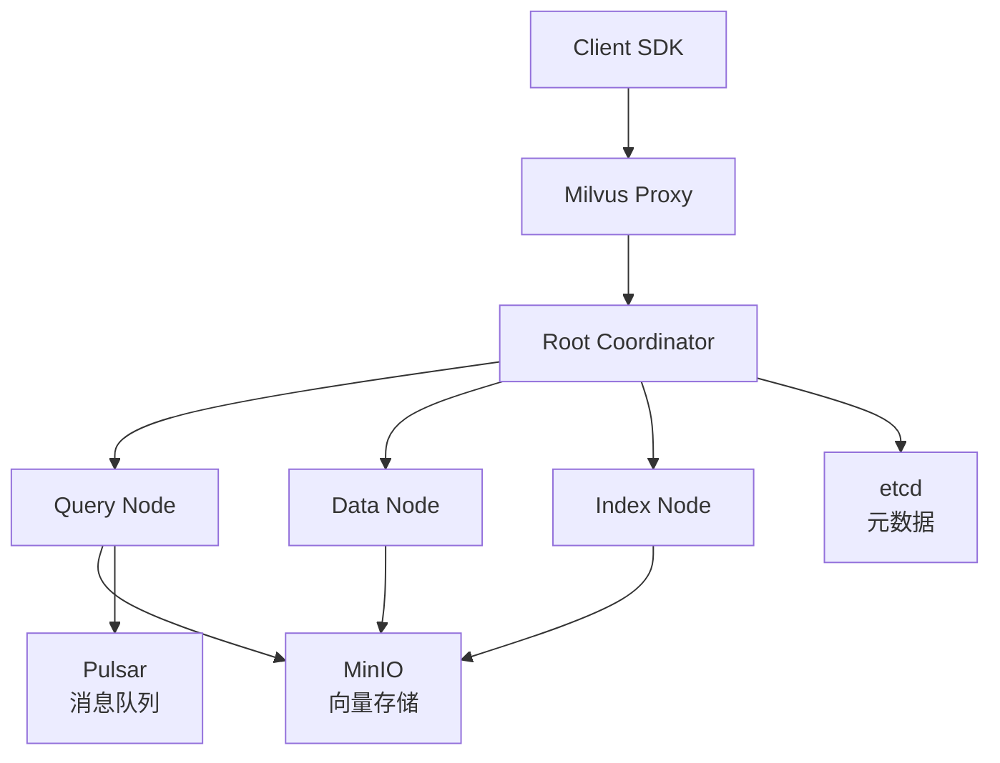

**集合Schema**:

```python
from pymilvus import Collection, CollectionSchema, FieldSchema, DataType

# 定义Collection Schema
fields = [
    FieldSchema(name="id", dtype=DataType.INT64, is_primary=True, auto_id=True),
    FieldSchema(name="chunk_id", dtype=DataType.VARCHAR, max_length=64),
    FieldSchema(name="document_id", dtype=DataType.VARCHAR, max_length=64),
    FieldSchema(name="content", dtype=DataType.VARCHAR, max_length=65535),
    FieldSchema(name="embedding", dtype=DataType.FLOAT_VECTOR, dim=1024),  # BGE-M3
    FieldSchema(name="tenant_id", dtype=DataType.VARCHAR, max_length=64),
    FieldSchema(name="created_at", dtype=DataType.INT64),
]

schema = CollectionSchema(fields=fields, description="Document chunks")
collection = Collection(name="document_chunks", schema=schema)

# 创建索引（HNSW）
index_params = {
    "metric_type": "IP",  # Inner Product (Cosine Similarity)
    "index_type": "HNSW",
    "params": {"M": 16, "efConstruction": 256}
}
collection.create_index(field_name="embedding", index_params=index_params)

# 混合检索（向量 + 标量过滤）
search_params = {"metric_type": "IP", "params": {"ef": 128}}
results = collection.search(
    data=[query_embedding],
    anns_field="embedding",
    param=search_params,
    limit=10,
    expr=f"tenant_id == '{tenant_id}' && created_at > {timestamp}",
    output_fields=["chunk_id", "content"]
)
```

### 4.6 ClickHouse分析数据库

**选型理由**:

- ✅ 列式存储，OLAP性能优异
- ✅ 实时数据写入（秒级延迟）
- ✅ SQL支持（标准SQL + 扩展函数）
- ✅ 分布式架构（分片+副本）
- ✅ 物化视图（自动聚合）

**表结构设计**:

```sql
-- 消息统计表（原始明细）
CREATE TABLE voicehelper.message_events ON CLUSTER voicehelper_cluster
(
    event_id UUID,
    conversation_id String,
    user_id String,
    tenant_id String,
    role Enum8('user' = 1, 'assistant' = 2),
    message_length UInt32,
    model String,
    tokens_used UInt32,
    cost_usd Float32,
    timestamp DateTime64(3, 'UTC')
)
ENGINE = ReplicatedMergeTree('/clickhouse/tables/{shard}/message_events', '{replica}')
PARTITION BY toYYYYMM(timestamp)
ORDER BY (tenant_id, user_id, timestamp)
TTL timestamp + INTERVAL 90 DAY;

-- 物化视图：每小时统计
CREATE MATERIALIZED VIEW voicehelper.message_hourly_stats ON CLUSTER voicehelper_cluster
ENGINE = SummingMergeTree()
PARTITION BY toYYYYMM(hour)
ORDER BY (tenant_id, hour)
AS SELECT
    tenant_id,
    toStartOfHour(timestamp) as hour,
    count() as message_count,
    sum(tokens_used) as total_tokens,
    sum(cost_usd) as total_cost
FROM voicehelper.message_events
GROUP BY tenant_id, hour;

-- 查询：最近7天每日统计
SELECT
    toDate(hour) as date,
    sum(message_count) as messages,
    sum(total_tokens) as tokens,
    sum(total_cost) as cost
FROM voicehelper.message_hourly_stats
WHERE tenant_id = 'tenant_123'
  AND hour >= now() - INTERVAL 7 DAY
GROUP BY date
ORDER BY date DESC;
```

### 4.7 OpenTelemetry可观测性

**架构**:

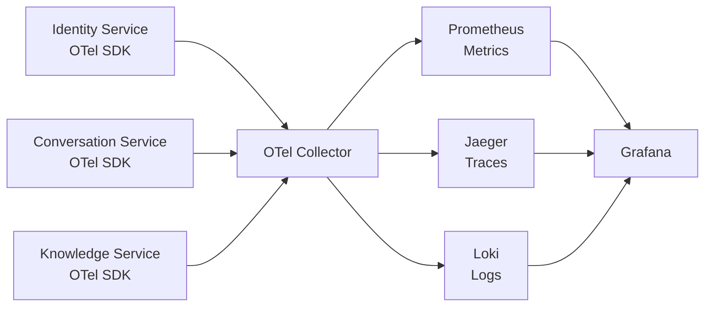

**OpenTelemetry Collector配置**:

```yaml
# otel-collector-config.yaml
receivers:
  otlp:
    protocols:
      grpc:
        endpoint: 0.0.0.0:4317
      http:
        endpoint: 0.0.0.0:4318

processors:
  batch:
    timeout: 10s
    send_batch_size: 1024
  memory_limiter:
    check_interval: 1s
    limit_mib: 4000
  resourcedetection:
    detectors: [env, system, docker, kubernetes]

exporters:
  prometheus:
    endpoint: "0.0.0.0:8889"
    namespace: voicehelper
  jaeger:
    endpoint: jaeger:14250
    tls:
      insecure: true
  loki:
    endpoint: http://loki:3100/loki/api/v1/push

service:
  pipelines:
    traces:
      receivers: [otlp]
      processors: [batch, memory_limiter, resourcedetection]
      exporters: [jaeger]
    metrics:
      receivers: [otlp]
      processors: [batch, memory_limiter, resourcedetection]
      exporters: [prometheus]
    logs:
      receivers: [otlp]
      processors: [batch, memory_limiter, resourcedetection]
      exporters: [loki]
```

**Go服务集成**:

```go
import (
    "go.opentelemetry.io/otel"
    "go.opentelemetry.io/otel/exporters/otlp/otlptrace/otlptracegrpc"
    "go.opentelemetry.io/otel/sdk/resource"
    sdktrace "go.opentelemetry.io/otel/sdk/trace"
    semconv "go.opentelemetry.io/otel/semconv/v1.21.0"
)

func InitTracing(serviceName string) (*sdktrace.TracerProvider, error) {
    exporter, err := otlptracegrpc.New(context.Background(),
        otlptracegrpc.WithEndpoint("otel-collector:4317"),
        otlptracegrpc.WithInsecure(),
    )
    if err != nil {
        return nil, err
    }
    
    tp := sdktrace.NewTracerProvider(
        sdktrace.WithBatcher(exporter),
        sdktrace.WithResource(resource.NewWithAttributes(
            semconv.SchemaURL,
            semconv.ServiceName(serviceName),
            semconv.ServiceVersion("v1.0.0"),
        )),
    )
    otel.SetTracerProvider(tp)
    return tp, nil
}
```

### 4.8 Argo CD GitOps

**工作流**:

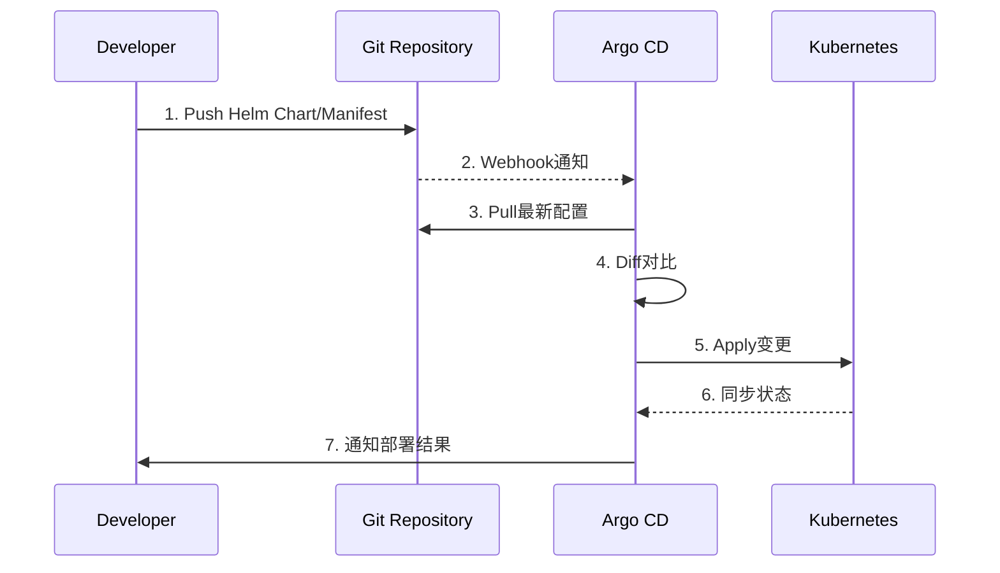

**Application定义**:

```yaml
# argocd-app-identity-service.yaml
apiVersion: argoproj.io/v1alpha1
kind: Application
metadata:
  name: identity-service
  namespace: argocd
spec:
  project: voicehelper
  source:
    repoURL: https://github.com/voicehelper/helm-charts
    targetRevision: main
    path: charts/identity-service
    helm:
      values: |
        image:
          repository: voicehelper/identity-service
          tag: v1.0.0
        replicaCount: 3
        resources:
          requests:
            cpu: 500m
            memory: 512Mi
          limits:
            cpu: 2000m
            memory: 2Gi
  destination:
    server: https://kubernetes.default.svc
    namespace: voicehelper-prod
  syncPolicy:
    automated:
      prune: true
      selfHeal: true
    syncOptions:
      - CreateNamespace=true
    retry:
      limit: 5
      backoff:
        duration: 5s
        factor: 2
        maxDuration: 3m
  revisionHistoryLimit: 10
```

---

## 5. 服务重新划分

### 5.1 按领域重组服务

#### 5.1.1 用户域 - Identity Service (Kratos)

**合并原服务**: Auth Service  
**新增功能**: 租户管理、用户资料管理  
**框架**: Kratos v2 + gRPC-Go

```
voicehelper-identity-service/
├── api/                     # Protobuf定义
│   └── identity/
│       └── v1/
│           ├── identity.proto
│           ├── identity.pb.go
│           └── identity_grpc.pb.go
├── cmd/
│   └── identity/
│       ├── main.go
│       └── wire.go          # Wire依赖注入
│       └── wire_gen.go      # Wire生成代码
├── internal/
│   ├── biz/                 # 业务逻辑层
│   │   ├── user.go
│   │   ├── tenant.go
│   │   └── auth.go
│   ├── service/             # 服务实现层（实现proto接口）
│   │   └── identity.go
│   ├── data/                # 数据访问层
│   │   ├── data.go          # 数据层初始化
│   │   ├── user.go
│   │   └── tenant.go
│   ├── server/              # Server配置
│   │   ├── grpc.go
│   │   └── http.go
│   └── conf/                # 配置定义
│       ├── conf.proto
│       └── conf.pb.go
├── configs/
│   └── config.yaml          # 配置文件
├── third_party/             # 第三方proto依赖
├── go.mod
└── Dockerfile
```

**核心功能**:

- ✅ JWT认证与Token管理
- ✅ OAuth 2.0 / SAML集成
- ✅ 用户CRUD与资料管理
- ✅ 租户隔离与配额管理
- ✅ RBAC权限控制
- ✅ MFA多因素认证
- ✅ 审计日志记录

**API设计**:

```protobuf
service IdentityService {
  // 认证
  rpc Login(LoginRequest) returns (LoginResponse);
  rpc Logout(LogoutRequest) returns (LogoutResponse);
  rpc RefreshToken(RefreshTokenRequest) returns (TokenResponse);
  rpc VerifyToken(VerifyTokenRequest) returns (TokenClaims);
  
  // 用户管理
  rpc GetUser(GetUserRequest) returns (User);
  rpc UpdateUser(UpdateUserRequest) returns (User);
  rpc DeleteUser(DeleteUserRequest) returns (Empty);
  
  // 租户管理
  rpc CreateTenant(CreateTenantRequest) returns (Tenant);
  rpc GetTenant(GetTenantRequest) returns (Tenant);
  rpc UpdateTenantQuota(UpdateQuotaRequest) returns (Tenant);
  
  // 权限管理
  rpc CheckPermission(CheckPermissionRequest) returns (PermissionResult);
  rpc AssignRole(AssignRoleRequest) returns (Empty);
}
```

#### 4.1.2 对话域 - Conversation Service

**合并原服务**: Session Service  
**新增功能**: 消息路由、流式响应管理

```
voicehelper-conversation-service/
├── cmd/conversation/main.go
├── internal/
│   ├── domain/
│   │   ├── conversation.go
│   │   ├── message.go
│   │   ├── context.go
│   │   └── participant.go
│   ├── application/
│   │   ├── conversation_service.go
│   │   ├── message_service.go
│   │   └── context_service.go
│   ├── interface/
│   │   ├── grpc/
│   │   │   └── conversation_server.go
│   │   ├── http/
│   │   │   └── conversation_handler.go
│   │   └── websocket/
│   │       └── stream_handler.go
│   └── infrastructure/
│       ├── repository/
│       │   ├── conversation_repo.go
│       │   └── message_repo.go
│       └── cache/
│           └── context_cache.go
└── api/proto/conversation.proto
```

**核心功能**:

- ✅ 会话生命周期管理
- ✅ 消息发送与接收
- ✅ 上下文维护与压缩
- ✅ 流式响应（SSE/WebSocket）
- ✅ 多轮对话管理
- ✅ 会话分享与导出
- ✅ 消息搜索与过滤

**事件发布**:

```go
// 发布到Kafka
type ConversationEvent struct {
    Type          string    // "conversation.created", "message.sent"
    ConversationID string
    UserID        string
    TenantID      string
    Payload       interface{}
    Timestamp     time.Time
}
```

#### 4.1.3 知识域 - Knowledge Service

**合并原服务**: Document Service  
**新增服务**: Indexing Service, Retrieval Service

**Knowledge Service (Go)** - 文档管理层

```
voicehelper-knowledge-service/
├── cmd/knowledge/main.go
├── internal/
│   ├── domain/
│   │   ├── document.go
│   │   ├── collection.go
│   │   └── version.go
│   ├── application/
│   │   ├── document_service.go
│   │   ├── collection_service.go
│   │   └── share_service.go
│   ├── interface/
│   │   ├── grpc/
│   │   └── http/
│   └── infrastructure/
│       ├── storage/
│       │   └── minio_client.go
│       └── security/
│           └── virus_scanner.go
└── api/proto/knowledge.proto
```

**Indexing Service (Python)** - 索引构建层

```
voicehelper-indexing-service/
├── app/
│   ├── core/
│   │   ├── document_parser.py
│   │   ├── chunker.py
│   │   └── embedder.py
│   ├── services/
│   │   ├── indexing_service.py
│   │   └── graph_builder.py
│   ├── api/
│   │   ├── grpc_server.py
│   │   └── http_routes.py
│   └── infrastructure/
│       ├── neo4j_client.py
│       └── faiss_manager.py
├── protos/indexing.proto
└── requirements.txt
```

**Retrieval Service (Python)** - 检索服务层

```
voicehelper-retrieval-service/
├── app/
│   ├── core/
│   │   ├── vector_retriever.py
│   │   ├── bm25_retriever.py
│   │   ├── graph_retriever.py
│   │   └── reranker.py
│   ├── services/
│   │   ├── retrieval_service.py
│   │   └── cache_service.py
│   ├── api/
│   │   ├── grpc_server.py
│   │   └── http_routes.py
│   └── infrastructure/
│       ├── faiss_client.py
│       ├── neo4j_client.py
│       └── redis_cache.py
├── protos/retrieval.proto
└── requirements.txt
```

**服务交互流程**:

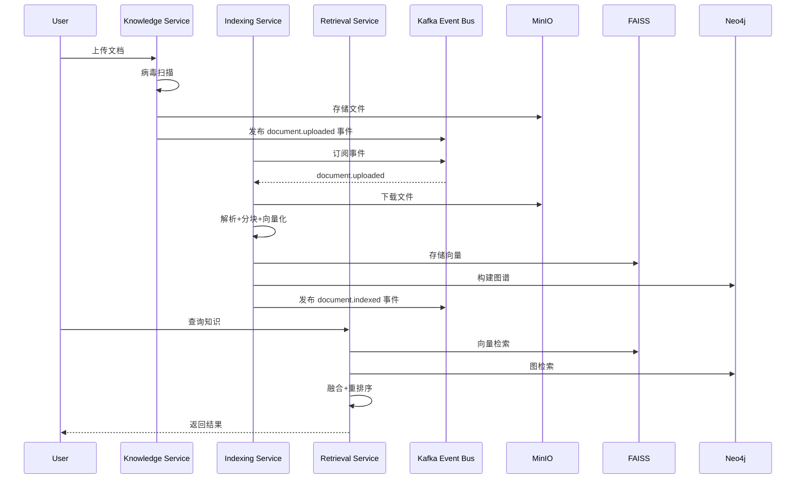

#### 4.1.4 AI能力域 - AI Orchestrator + Engines

**AI Orchestrator (Go)** - AI任务编排层（新增）

```
voicehelper-ai-orchestrator/
├── cmd/orchestrator/main.go
├── internal/
│   ├── domain/
│   │   ├── task.go
│   │   ├── workflow.go
│   │   └── result.go
│   ├── application/
│   │   ├── orchestration_service.go
│   │   ├── task_router.go
│   │   └── result_aggregator.go
│   ├── interface/
│   │   ├── grpc/
│   │   └── http/
│   └── infrastructure/
│       └── engine_clients/
│           ├── agent_client.go
│           ├── rag_client.go
│           ├── voice_client.go
│           └── multimodal_client.go
└── api/proto/orchestrator.proto
```

**核心功能**:

- ✅ AI任务路由（Agent/RAG/Voice/Multimodal）
- ✅ 流程编排（串行/并行/条件分支）
- ✅ 结果聚合与后处理
- ✅ 任务状态管理
- ✅ 超时控制与重试
- ✅ 成本追踪与限额

**Agent Engine (Python)** - Agent执行引擎

```
voicehelper-agent-engine/
├── app/
│   ├── core/
│   │   ├── agent/
│   │   │   ├── planner.py
│   │   │   ├── executor.py
│   │   │   └── reflector.py
│   │   ├── memory/
│   │   │   ├── vector_memory.py
│   │   │   └── decay_manager.py
│   │   └── tools/
│   │       ├── tool_registry.py
│   │       └── mcp_integration.py
│   ├── services/
│   │   └── agent_service.py
│   └── api/
│       └── grpc_server.py
└── protos/agent.proto
```

**RAG Engine (Python)** - RAG引擎

```
voicehelper-rag-engine/
├── app/
│   ├── core/
│   │   ├── query_rewriter.py
│   │   ├── context_builder.py
│   │   └── answer_generator.py
│   ├── services/
│   │   └── rag_service.py
│   └── api/
│       └── grpc_server.py
└── protos/rag.proto
```

**Voice Engine (Python)** - 语音引擎（保持不变）
**Multimodal Engine (Python)** - 多模态引擎（保持不变）

#### 4.1.5 模型域 - Model Router + Adapter

**Model Router (Go)** - 模型路由层（重构）

```
voicehelper-model-router/
├── cmd/router/main.go
├── internal/
│   ├── domain/
│   │   ├── model.go
│   │   ├── provider.go
│   │   └── strategy.go
│   ├── application/
│   │   ├── routing_service.go
│   │   ├── cost_optimizer.go
│   │   └── fallback_manager.go
│   ├── interface/
│   │   ├── grpc/
│   │   └── http/
│   └── infrastructure/
│       ├── providers/
│       │   ├── openai.go
│       │   ├── anthropic.go
│       │   └── azure.go
│       └── cache/
│           └── semantic_cache.go
└── api/proto/model_router.proto
```

**Model Adapter (Python)** - 模型适配层（新增）

```
voicehelper-model-adapter/
├── app/
│   ├── adapters/
│   │   ├── openai_adapter.py
│   │   ├── claude_adapter.py
│   │   ├── qianwen_adapter.py
│   │   └── glm_adapter.py
│   ├── core/
│   │   ├── protocol_converter.py
│   │   └── error_handler.py
│   └── api/
│       └── grpc_server.py
└── protos/adapter.proto
```

**职责分离**:

- **Model Router**: 路由决策、成本优化、降级策略（Go实现，高性能）
- **Model Adapter**: API适配、协议转换、错误处理（Python实现，灵活）

#### 4.1.6 通知域 - Notification Service（重构）

**优化原服务**: Notification Service

```
voicehelper-notification-service/
├── cmd/notification/main.go
├── internal/
│   ├── domain/
│   │   ├── notification.go
│   │   ├── template.go
│   │   └── device.go
│   ├── application/
│   │   ├── notification_service.go
│   │   ├── template_service.go
│   │   └── subscription_service.go
│   ├── interface/
│   │   ├── grpc/
│   │   ├── http/
│   │   └── websocket/
│   └── infrastructure/
│       ├── channels/
│       │   ├── email.go
│       │   ├── sms.go
│       │   ├── push.go
│       │   └── webhook.go
│       └── queue/
│           └── rabbitmq_consumer.go
└── api/proto/notification.proto
```

**事件驱动**:

```go
// 订阅Kafka事件
topics := []string{
    "conversation.created",
    "conversation.message.sent",
    "document.uploaded",
    "document.indexed",
    "task.completed",
    "task.failed",
}

// 根据订阅规则发送通知
func HandleEvent(event Event) {
    subscriptions := GetUserSubscriptions(event.UserID)
    for _, sub := range subscriptions {
        if sub.Match(event.Type) {
            notification := BuildNotification(event, sub.Template)
            SendNotification(notification, sub.Channels)
        }
    }
}
```

### 4.2 服务对比表

| 维度 | 原架构（v0.9.2） | 新架构（v2.0） |
|-----|----------------|---------------|
| **服务数量** | 9个服务 | 12个服务 |
| **Go服务** | 5个（Gateway + 4微服务） | 6个（BFF + Gateway + 5域服务） |
| **Python服务** | 5个（算法服务） | 6个（5引擎 + 1适配器） |
| **服务粒度** | 按技术功能划分 | 按业务领域划分（DDD） |
| **通信模式** | 同步HTTP为主 | gRPC + 事件驱动 |
| **数据隔离** | 共享PostgreSQL | 每服务独立数据库Schema |
| **服务网格** | ❌ 无 | ✅ Istio |
| **BFF层** | ❌ 无 | ✅ 3个BFF |
| **事件总线** | ❌ 无 | ✅ Kafka |

---

## 5. 技术栈升级

### 5.1 服务网格 - Istio

**为什么选择Istio**:

- ✅ 业界成熟（Google/IBM/Lyft开源）
- ✅ 零侵入（Sidecar模式）
- ✅ 功能全面（流量管理、安全、可观测）
- ✅ Kubernetes原生支持

**核心功能**:

| 功能 | 实现 | 收益 |
|-----|------|------|
| **服务发现** | 集成Consul/K8s | 自动服务注册与发现 |
| **负载均衡** | Envoy Proxy | 智能路由（基于延迟/错误率） |
| **熔断** | Circuit Breaker | 自动降级保护 |
| **重试** | Retry Policy | 自动重试失败请求 |
| **超时** | Timeout Policy | 防止级联超时 |
| **mTLS** | 证书自动轮换 | 零信任网络 |
| **流量镜像** | Traffic Mirroring | 灰度发布 |
| **故障注入** | Fault Injection | 混沌工程 |

**Istio配置示例**:

```yaml
# VirtualService - 流量路由
apiVersion: networking.istio.io/v1beta1
kind: VirtualService
metadata:
  name: conversation-service
spec:
  hosts:
  - conversation.voicehelper.svc.cluster.local
  http:
  - match:
    - headers:
        x-api-version:
          exact: "v2"
    route:
    - destination:
        host: conversation.voicehelper.svc.cluster.local
        subset: v2
      weight: 90
    - destination:
        host: conversation.voicehelper.svc.cluster.local
        subset: v1
      weight: 10  # 金丝雀发布（10%流量到v2）
  
---
# DestinationRule - 负载均衡策略
apiVersion: networking.istio.io/v1beta1
kind: DestinationRule
metadata:
  name: conversation-service
spec:
  host: conversation.voicehelper.svc.cluster.local
  trafficPolicy:
    loadBalancer:
      consistentHash:
        httpHeaderName: x-user-id  # 基于用户ID的会话保持
    connectionPool:
      tcp:
        maxConnections: 100
      http:
        http1MaxPendingRequests: 1
        maxRequestsPerConnection: 2
    outlierDetection:
      consecutiveErrors: 5
      interval: 30s
      baseEjectionTime: 30s
      maxEjectionPercent: 50  # 熔断配置
  subsets:
  - name: v1
    labels:
      version: v1
  - name: v2
    labels:
      version: v2
```

### 5.2 事件总线 - Apache Kafka

**为什么选择Kafka**:

- ✅ 高吞吐（百万级消息/秒）
- ✅ 持久化（消息不丢失）
- ✅ 分区（水平扩展）
- ✅ 事件溯源（Event Sourcing）
- ✅ 生态成熟（Confluent/Strimzi）

**事件设计**:

```go
// 事件基类
type DomainEvent struct {
    EventID       string    `json:"event_id"`
    EventType     string    `json:"event_type"`
    EventVersion  string    `json:"event_version"`
    AggregateID   string    `json:"aggregate_id"`
    AggregateType string    `json:"aggregate_type"`
    TenantID      string    `json:"tenant_id"`
    UserID        string    `json:"user_id"`
    Timestamp     time.Time `json:"timestamp"`
    Payload       json.RawMessage `json:"payload"`
    Metadata      map[string]string `json:"metadata"`
}

// 具体事件
type ConversationCreatedEvent struct {
    DomainEvent
    ConversationID string
    Title          string
    Mode           string  // "chat", "agent", "workflow"
}

type MessageSentEvent struct {
    DomainEvent
    ConversationID string
    MessageID      string
    Role           string  // "user", "assistant"
    Content        string
}

type DocumentIndexedEvent struct {
    DomainEvent
    DocumentID     string
    ChunkCount     int
    VectorCount    int
    GraphNodeCount int
}
```

**Topic设计**:

| Topic | 分区数 | 副本数 | 生产者 | 消费者 | 用途 |
|-------|-------|-------|--------|--------|------|
| `conversation.events` | 6 | 3 | Conversation Service | Notification, Analytics | 对话事件 |
| `document.events` | 3 | 3 | Knowledge Service | Indexing, Notification | 文档事件 |
| `ai.tasks` | 12 | 3 | AI Orchestrator | Agent/RAG/Voice Engine | AI任务分发 |
| `ai.results` | 6 | 3 | Agent/RAG Engine | AI Orchestrator | AI结果回传 |
| `notification.requests` | 3 | 3 | Multiple | Notification Service | 通知请求 |

**事件驱动流程示例**:

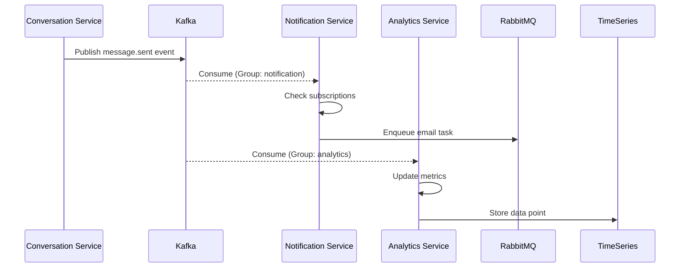

### 5.3 BFF层 - Backend for Frontend

**为什么需要BFF**:

- ✅ 减少客户端请求次数（聚合多个后端调用）
- ✅ 适配不同端的数据格式（Web需要全量、Mobile需要精简）
- ✅ 缓存热点数据（提升响应速度）
- ✅ 保护后端服务（降低后端压力）

**Web BFF示例**:

```go
// Web BFF - 聊天页面数据聚合
func (h *WebBFFHandler) GetChatPageData(c *gin.Context) {
    userID := c.GetString("user_id")
    
    var (
        conversations []*Conversation
        user          *User
        usage         *Usage
        wg            sync.WaitGroup
        mu            sync.Mutex
        errs          []error
    )
    
    // 并行调用3个后端服务
    wg.Add(3)
    
    // 1. 获取会话列表
    go func() {
        defer wg.Done()
        resp, err := h.conversationClient.ListConversations(ctx, &pb.ListRequest{
            UserID: userID,
            Limit:  20,
        })
        if err != nil {
            mu.Lock()
            errs = append(errs, err)
            mu.Unlock()
            return
        }
        conversations = resp.Conversations
    }()
    
    // 2. 获取用户信息
    go func() {
        defer wg.Done()
        resp, err := h.identityClient.GetUser(ctx, &pb.GetUserRequest{
            UserID: userID,
        })
        if err != nil {
            mu.Lock()
            errs = append(errs, err)
            mu.Unlock()
            return
        }
        user = resp.User
    }()
    
    // 3. 获取用量统计
    go func() {
        defer wg.Done()
        resp, err := h.usageClient.GetUsage(ctx, &pb.GetUsageRequest{
            UserID: userID,
        })
        if err != nil {
            mu.Lock()
            errs = append(errs, err)
            mu.Unlock()
            return
        }
        usage = resp.Usage
    }()
    
    wg.Wait()
    
    if len(errs) > 0 {
        c.JSON(500, gin.H{"errors": errs})
        return
    }
    
    // 聚合响应
    c.JSON(200, gin.H{
        "conversations": conversations,
        "user":          user,
        "usage":         usage,
    })
}
```

**Mobile BFF示例**:

```go
// Mobile BFF - 精简数据
func (h *MobileBFFHandler) GetChatPageData(c *gin.Context) {
    // 移动端只返回必要字段，减少流量
    userID := c.GetString("user_id")
    
    // 复用Web BFF的逻辑，但精简字段
    data := h.webBFF.GetChatPageData(userID)
    
    // 精简会话列表
    simplifiedConversations := make([]MobileConversation, len(data.Conversations))
    for i, conv := range data.Conversations {
        simplifiedConversations[i] = MobileConversation{
            ID:        conv.ID,
            Title:     conv.Title,
            UpdatedAt: conv.UpdatedAt,
            // 移除不必要的字段（metadata、tags、permissions等）
        }
    }
    
    c.JSON(200, gin.H{
        "conversations": simplifiedConversations,
        "user": gin.H{
            "id":     data.User.ID,
            "name":   data.User.Name,
            "avatar": data.User.Avatar,
            // 移除email、phone等敏感字段
        },
    })
}
```

### 5.4 日志聚合 - Loki (替代ELK)

**为什么选择Loki**:

- ✅ 轻量级（不索引日志内容，只索引标签）
- ✅ 成本低（存储需求小，查询快）
- ✅ Grafana原生支持
- ✅ 云原生（Kubernetes友好）

**Loki vs ELK对比**:

| 维度 | Loki | ELK Stack |
|-----|------|-----------|
| **存储成本** | 低（只索引标签） | 高（全文索引） |
| **查询性能** | 快（标签查询） | 慢（全文搜索） |
| **部署复杂度** | 简单（单进程） | 复杂（ES集群+Logstash+Kibana） |
| **资源消耗** | 低（< 1GB内存） | 高（> 4GB内存） |
| **可视化** | Grafana | Kibana |
| **适用场景** | 云原生、微服务 | 传统应用、审计日志 |

**Loki配置示例**:

```yaml
# Promtail采集配置
scrape_configs:
  - job_name: kubernetes-pods
    kubernetes_sd_configs:
      - role: pod
    relabel_configs:
      - source_labels: [__meta_kubernetes_pod_label_app]
        target_label: app
      - source_labels: [__meta_kubernetes_namespace]
        target_label: namespace
      - source_labels: [__meta_kubernetes_pod_name]
        target_label: pod
    pipeline_stages:
      - json:
          expressions:
            level: level
            trace_id: trace_id
            msg: message
      - labels:
          level:
          trace_id:
```

---

## 6. 通信模式

### 6.1 同步通信 - gRPC

**为什么使用gRPC**:

- ✅ 高性能（Protobuf二进制序列化）
- ✅ 强类型（IDL定义接口契约）
- ✅ 流式支持（Server Stream/Client Stream/Bidirectional）
- ✅ 多语言支持（Go/Python/Java/...）
- ✅ 负载均衡（gRPC内置支持）

**gRPC vs HTTP REST对比**:

| 维度 | gRPC | HTTP REST |
|-----|------|-----------|
| **序列化** | Protobuf（二进制） | JSON（文本） |
| **性能** | 高（5-10x） | 低 |
| **类型安全** | 强类型 | 弱类型 |
| **流式支持** | ✅ 原生支持 | ❌ 需SSE/WebSocket |
| **浏览器支持** | ❌ 需gRPC-Web | ✅ 原生支持 |
| **可读性** | 低（二进制） | 高（JSON） |
| **适用场景** | 服务间通信 | 前后端通信 |

**服务间通信协议选择**:

| 场景 | 协议 | 原因 |
|-----|------|------|
| **Gateway → BFF** | HTTP REST | 前端可直接调用 |
| **BFF → Domain Services** | gRPC | 高性能 |
| **Domain Services ↔ Domain Services** | gRPC | 强类型、流式支持 |
| **Domain Service → AI Engine** | gRPC | 大payload（音频/图像） |
| **AI Engine ↔ Model Adapter** | gRPC | 流式响应 |
| **Client → Gateway (WebSocket)** | WebSocket | 实时双向通信 |

### 6.2 异步通信 - Kafka + RabbitMQ

**Kafka vs RabbitMQ选择**:

| 维度 | Kafka | RabbitMQ |
|-----|-------|----------|
| **消息模型** | Pub/Sub（事件流） | 点对点/Pub-Sub |
| **吞吐量** | 百万级/秒 | 数万级/秒 |
| **延迟** | ms级别 | 微秒级别 |
| **持久化** | ✅ 强持久化 | ⚠️ 可选持久化 |
| **顺序保证** | ✅ 分区内有序 | ❌ 无全局顺序 |
| **消息回溯** | ✅ 可重放 | ❌ 不可重放 |
| **适用场景** | 事件驱动、日志聚合 | 任务队列、RPC |

**使用场景划分**:

| 场景 | 选择 | 原因 |
|-----|------|------|
| **领域事件** | Kafka | 需要持久化、多消费者、事件溯源 |
| **异步任务** | RabbitMQ | 需要确认机制、优先级队列 |
| **日志聚合** | Kafka | 高吞吐、持久化 |
| **邮件发送** | RabbitMQ | 任务队列、重试机制 |
| **数据同步** | Kafka | CDC（Change Data Capture） |

### 6.3 实时通信 - WebSocket

**WebSocket使用场景**:

- ✅ 流式对话（SSE单向即可，WebSocket双向更灵活）
- ✅ 实时语音（双向音频流）
- ✅ 协作编辑（多人同时编辑文档）
- ✅ 实时通知（服务端主动推送）

**WebSocket连接管理**:

```go
// WebSocket Hub - 连接池管理
type Hub struct {
    clients    map[string]*Client  // userID -> client
    broadcast  chan *Message
    register   chan *Client
    unregister chan *Client
    mu         sync.RWMutex
}

func (h *Hub) Run() {
    for {
        select {
        case client := <-h.register:
            h.mu.Lock()
            h.clients[client.UserID] = client
            h.mu.Unlock()
            
        case client := <-h.unregister:
            h.mu.Lock()
            delete(h.clients, client.UserID)
            close(client.send)
            h.mu.Unlock()
            
        case message := <-h.broadcast:
            h.mu.RLock()
            for _, client := range h.clients {
                select {
                case client.send <- message:
                default:
                    close(client.send)
                    delete(h.clients, client.UserID)
                }
            }
            h.mu.RUnlock()
        }
    }
}

// 发送消息给特定用户
func (h *Hub) SendToUser(userID string, message *Message) error {
    h.mu.RLock()
    client, ok := h.clients[userID]
    h.mu.RUnlock()
    
    if !ok {
        return errors.New("user not connected")
    }
    
    select {
    case client.send <- message:
        return nil
    default:
        return errors.New("client send buffer full")
    }
}
```

---

## 7. 数据管理策略

### 7.1 数据库隔离

**每服务独立Schema**:

```sql
-- 原架构：共享数据库
CREATE DATABASE voicehelper;

-- 新架构：按服务划分Schema
CREATE DATABASE voicehelper;

-- Identity Service Schema
CREATE SCHEMA IF NOT EXISTS identity;
CREATE TABLE identity.users (...);
CREATE TABLE identity.tenants (...);
CREATE TABLE identity.roles (...);

-- Conversation Service Schema
CREATE SCHEMA IF NOT EXISTS conversation;
CREATE TABLE conversation.conversations (...);
CREATE TABLE conversation.messages (...);
CREATE TABLE conversation.contexts (...);

-- Knowledge Service Schema
CREATE SCHEMA IF NOT EXISTS knowledge;
CREATE TABLE knowledge.documents (...);
CREATE TABLE knowledge.collections (...);
CREATE TABLE knowledge.shares (...);

-- Notification Service Schema
CREATE SCHEMA IF NOT EXISTS notification;
CREATE TABLE notification.notifications (...);
CREATE TABLE notification.templates (...);
CREATE TABLE notification.devices (...);
```

**优势**:

- ✅ 数据隔离（服务间不能直接访问）
- ✅ 独立演进（Schema变更不影响其他服务）
- ✅ 安全性（权限细粒度控制）
- ✅ 可迁移性（未来可拆分到独立数据库实例）

### 7.2 缓存策略

**Redis缓存架构**:

```
voicehelper-redis-cluster (Redis Sentinel 3节点)
├── identity:cache:*         # Identity Service缓存
│   ├── user:{id}           # TTL: 1h
│   ├── token:{user_id}     # TTL: 24h
│   └── permission:{user_id}:{resource} # TTL: 10min
├── conversation:cache:*     # Conversation Service缓存
│   ├── session:{id}        # TTL: 1h
│   ├── context:{conv_id}   # TTL: 24h
│   └── messages:{conv_id}  # TTL: 30min
├── retrieval:cache:*        # Retrieval Service缓存
│   ├── semantic:{hash}     # TTL: 24h
│   └── query:{hash}        # TTL: 1h
└── ratelimit:*              # 限流器
    ├── user:{id}
    └── ip:{address}
```

**缓存更新策略**:

| 场景 | 策略 | 实现 |
|-----|------|------|
| **用户信息更新** | Write-Through | 写DB同时更新缓存 |
| **会话上下文更新** | Write-Behind | 异步写DB，同步写缓存 |
| **查询结果缓存** | Cache-Aside | 读DB后写缓存 |
| **语义缓存** | Cache-Aside | 查询相似度后决定 |
| **Token黑名单** | Write-Through | 注销时立即写缓存+DB |

**缓存一致性保证**:

```go
// Distributed Lock + Cache Aside Pattern
func (s *ConversationService) GetConversation(ctx context.Context, id string) (*Conversation, error) {
    // 1. 尝试从缓存读取
    cacheKey := fmt.Sprintf("conversation:cache:session:%s", id)
    if cached, err := s.redis.Get(ctx, cacheKey).Bytes(); err == nil {
        var conv Conversation
        if err := json.Unmarshal(cached, &conv); err == nil {
            return &conv, nil
        }
    }
    
    // 2. 缓存未命中，获取分布式锁避免缓存击穿
    lockKey := fmt.Sprintf("conversation:lock:session:%s", id)
    lock, err := s.redis.SetNX(ctx, lockKey, "1", 10*time.Second).Result()
    if err != nil {
        return nil, err
    }
    
    if !lock {
        // 其他进程正在加载，等待后重试
        time.Sleep(100 * time.Millisecond)
        return s.GetConversation(ctx, id)
    }
    defer s.redis.Del(ctx, lockKey)
    
    // 3. 从数据库读取
    conv, err := s.repo.GetByID(ctx, id)
    if err != nil {
        return nil, err
    }
    
    // 4. 写入缓存
    if data, err := json.Marshal(conv); err == nil {
        s.redis.Set(ctx, cacheKey, data, 1*time.Hour)
    }
    
    return conv, nil
}

// 更新时使缓存失效
func (s *ConversationService) UpdateConversation(ctx context.Context, conv *Conversation) error {
    // 1. 更新数据库
    if err := s.repo.Update(ctx, conv); err != nil {
        return err
    }
    
    // 2. 删除缓存（Cache-Invalidate）
    cacheKey := fmt.Sprintf("conversation:cache:session:%s", conv.ID)
    s.redis.Del(ctx, cacheKey)
    
    // 3. 发布缓存失效事件（如果有多级缓存）
    event := CacheInvalidationEvent{
        Key:   cacheKey,
        Time:  time.Now(),
    }
    s.eventBus.Publish("cache.invalidation", event)
    
    return nil
}
```

### 7.3 事务管理

**分布式事务策略**:

| 场景 | 策略 | 实现 |
|-----|------|------|
| **创建会话** | 本地事务 | 单服务内PostgreSQL事务 |
| **上传文档+索引** | Saga模式 | 编排（Orchestration） |
| **发送消息+通知** | 最终一致性 | 事件驱动 |
| **支付+积分** | 2PC/TCC | 强一致性（未来扩展） |

**Saga编排示例** - 文档上传流程

```go
// Saga Orchestrator
type DocumentUploadSaga struct {
    knowledgeClient  KnowledgeServiceClient
    indexingClient   IndexingServiceClient
    notificationClient NotificationServiceClient
    eventBus         EventBus
}

func (s *DocumentUploadSaga) Execute(ctx context.Context, req *UploadRequest) error {
    sagaID := uuid.New().String()
    
    // Step 1: 上传文档到Knowledge Service
    uploadResp, err := s.knowledgeClient.UploadDocument(ctx, &UploadRequest{
        SagaID: sagaID,
        File:   req.File,
        UserID: req.UserID,
    })
    if err != nil {
        return err
    }
    
    // Step 2: 提交索引任务到Indexing Service
    indexResp, err := s.indexingClient.IndexDocument(ctx, &IndexRequest{
        SagaID:     sagaID,
        DocumentID: uploadResp.DocumentID,
    })
    if err != nil {
        // 补偿：删除已上传的文档
        s.knowledgeClient.DeleteDocument(ctx, &DeleteRequest{
            SagaID:     sagaID,
            DocumentID: uploadResp.DocumentID,
        })
        return err
    }
    
    // Step 3: 发送通知
    _, err = s.notificationClient.SendNotification(ctx, &NotificationRequest{
        UserID:  req.UserID,
        Type:    "document.indexed",
        Payload: indexResp,
    })
    if err != nil {
        // 通知失败不回滚，记录日志
        logrus.WithError(err).Warn("Failed to send notification")
    }
    
    // 发布Saga完成事件
    s.eventBus.Publish("saga.completed", SagaCompletedEvent{
        SagaID:     sagaID,
        Type:       "document_upload",
        DocumentID: uploadResp.DocumentID,
    })
    
    return nil
}
```

---

## 8. 实时数据处理

### 8.1 CDC数据捕获 - Debezium

**架构**:

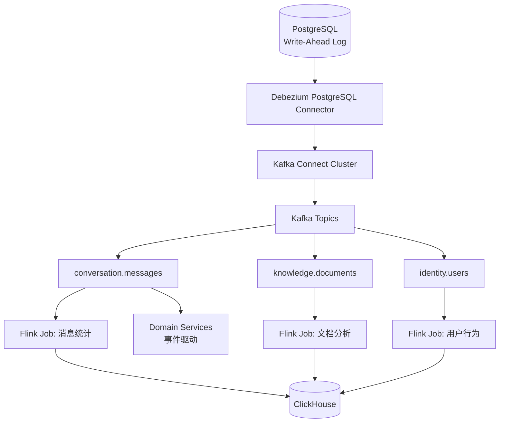

**为什么使用Debezium**:

- ✅ 无侵入（直接读取数据库WAL）
- ✅ 零延迟（实时捕获变更）
- ✅ 完整性（捕获所有INSERT/UPDATE/DELETE）
- ✅ 顺序保证（按事务顺序发送）
- ✅ 快照支持（初始化全量数据）

**Debezium Connector配置**:

```yaml
# debezium-postgres-connector.yaml
apiVersion: kafka.strimzi.io/v1beta2
kind: KafkaConnector
metadata:
  name: voicehelper-postgres-connector
  labels:
    strimzi.io/cluster: kafka-connect-cluster
spec:
  class: io.debezium.connector.postgresql.PostgresConnector
  tasksMax: 1
  config:
    # 数据库连接
    database.hostname: postgres.voicehelper.svc.cluster.local
    database.port: "5432"
    database.user: debezium
    database.password: "${vault:secret/data/debezium#password}"
    database.dbname: voicehelper
    database.server.name: voicehelper
    
    # 表过滤
    table.include.list: >
      conversation.conversations,
      conversation.messages,
      knowledge.documents,
      knowledge.chunks,
      identity.users,
      identity.tenants
    
    # CDC配置
    plugin.name: pgoutput
    publication.name: voicehelper_publication
    publication.autocreate.mode: filtered
    slot.name: voicehelper_slot
    slot.drop.on.stop: false
    
    # 快照模式
    snapshot.mode: initial
    snapshot.fetch.size: 10000
    
    # 数据转换
    transforms: unwrap, route
    transforms.unwrap.type: io.debezium.transforms.ExtractNewRecordState
    transforms.unwrap.drop.tombstones: false
    transforms.unwrap.delete.handling.mode: rewrite
    transforms.unwrap.add.fields: table,lsn,ts_ms
    
    transforms.route.type: org.apache.kafka.connect.transforms.RegexRouter
    transforms.route.regex: "([^.]+)\\.([^.]+)\\.([^.]+)"
    transforms.route.replacement: "$1.$2"
    
    # 序列化
    key.converter: org.apache.kafka.connect.json.JsonConverter
    value.converter: org.apache.kafka.connect.json.JsonConverter
    key.converter.schemas.enable: false
    value.converter.schemas.enable: false
    
    # 性能调优
    max.batch.size: 2048
    max.queue.size: 8192
    poll.interval.ms: 1000
```

**PostgreSQL配置**:

```sql
-- 启用逻辑复制
ALTER SYSTEM SET wal_level = logical;
ALTER SYSTEM SET max_replication_slots = 10;
ALTER SYSTEM SET max_wal_senders = 10;

-- 创建Debezium用户
CREATE USER debezium WITH REPLICATION PASSWORD 'secure_password';
GRANT SELECT ON ALL TABLES IN SCHEMA conversation TO debezium;
GRANT SELECT ON ALL TABLES IN SCHEMA knowledge TO debezium;
GRANT SELECT ON ALL TABLES IN SCHEMA identity TO debezium;

-- 创建Publication（Debezium会自动创建，这里展示手动方式）
CREATE PUBLICATION voicehelper_publication FOR TABLE 
    conversation.conversations,
    conversation.messages,
    knowledge.documents,
    identity.users;
```

### 8.2 流式计算 - Apache Flink

**为什么选择Flink**:

- ✅ 真正的流处理（非微批处理）
- ✅ 精确一次语义（Exactly-Once）
- ✅ 状态管理（Checkpoint/Savepoint）
- ✅ 事件时间语义（Watermark）
- ✅ 丰富的连接器（Kafka/ClickHouse/PostgreSQL）

**Flink任务1: 消息实时统计**:

```python
# flink_message_stats.py
from pyflink.datastream import StreamExecutionEnvironment
from pyflink.table import StreamTableEnvironment, EnvironmentSettings

# 创建环境
env = StreamExecutionEnvironment.get_execution_environment()
env.enable_checkpointing(60000)  # 每60秒checkpoint
settings = EnvironmentSettings.new_instance().in_streaming_mode().build()
t_env = StreamTableEnvironment.create(env, environment_settings=settings)

# 定义Kafka源表
t_env.execute_sql("""
    CREATE TABLE message_cdc (
        conversation_id STRING,
        message_id STRING,
        user_id STRING,
        tenant_id STRING,
        role STRING,
        content STRING,
        model STRING,
        tokens_used BIGINT,
        cost_usd DECIMAL(10, 4),
        created_at TIMESTAMP(3),
        WATERMARK FOR created_at AS created_at - INTERVAL '5' SECOND
    ) WITH (
        'connector' = 'kafka',
        'topic' = 'conversation.messages',
        'properties.bootstrap.servers' = 'kafka:9092',
        'properties.group.id' = 'flink-message-stats',
        'scan.startup.mode' = 'earliest-offset',
        'format' = 'json',
        'json.fail-on-missing-field' = 'false',
        'json.ignore-parse-errors' = 'true'
    )
""")

# 定义ClickHouse sink表
t_env.execute_sql("""
    CREATE TABLE message_stats_minute (
        tenant_id STRING,
        window_start TIMESTAMP(3),
        window_end TIMESTAMP(3),
        message_count BIGINT,
        total_tokens BIGINT,
        total_cost DECIMAL(10, 4),
        avg_tokens_per_message DOUBLE,
        user_message_count BIGINT,
        assistant_message_count BIGINT,
        PRIMARY KEY (tenant_id, window_start) NOT ENFORCED
    ) WITH (
        'connector' = 'clickhouse',
        'url' = 'clickhouse://clickhouse:8123',
        'database-name' = 'voicehelper',
        'table-name' = 'message_stats_minute',
        'sink.batch-size' = '1000',
        'sink.flush-interval' = '1s'
    )
""")

# 实时聚合查询
t_env.execute_sql("""
    INSERT INTO message_stats_minute
    SELECT 
        tenant_id,
        TUMBLE_START(created_at, INTERVAL '1' MINUTE) as window_start,
        TUMBLE_END(created_at, INTERVAL '1' MINUTE) as window_end,
        COUNT(*) as message_count,
        SUM(tokens_used) as total_tokens,
        SUM(cost_usd) as total_cost,
        AVG(CAST(tokens_used AS DOUBLE)) as avg_tokens_per_message,
        SUM(CASE WHEN role = 'user' THEN 1 ELSE 0 END) as user_message_count,
        SUM(CASE WHEN role = 'assistant' THEN 1 ELSE 0 END) as assistant_message_count
    FROM message_cdc
    GROUP BY 
        tenant_id,
        TUMBLE(created_at, INTERVAL '1' MINUTE)
""")
```

**Flink任务2: 用户行为分析**:

```python
# flink_user_behavior.py
from pyflink.table import StreamTableEnvironment

t_env = StreamTableEnvironment.create(...)

# 定义用户行为事件表（Join多个CDC流）
t_env.execute_sql("""
    CREATE TEMPORARY VIEW user_behavior AS
    SELECT 
        m.user_id,
        m.tenant_id,
        m.conversation_id,
        m.created_at as event_time,
        'message_sent' as event_type,
        m.message_id as event_id,
        c.model as conversation_model,
        u.email as user_email
    FROM message_cdc m
    LEFT JOIN conversation_cdc c ON m.conversation_id = c.conversation_id
    LEFT JOIN user_cdc u ON m.user_id = u.user_id
""")

# 计算用户活跃度（最近1小时发送消息数）
t_env.execute_sql("""
    CREATE TABLE user_activity_hourly (
        user_id STRING,
        tenant_id STRING,
        window_start TIMESTAMP(3),
        message_count BIGINT,
        conversation_count BIGINT,
        is_active BOOLEAN,  -- 最近1小时内有活动
        PRIMARY KEY (user_id, window_start) NOT ENFORCED
    ) WITH (
        'connector' = 'clickhouse',
        'url' = 'clickhouse://clickhouse:8123',
        'database-name' = 'voicehelper',
        'table-name' = 'user_activity_hourly'
    )
""")

t_env.execute_sql("""
    INSERT INTO user_activity_hourly
    SELECT 
        user_id,
        tenant_id,
        HOP_START(event_time, INTERVAL '5' MINUTE, INTERVAL '1' HOUR) as window_start,
        COUNT(*) as message_count,
        COUNT(DISTINCT conversation_id) as conversation_count,
        TRUE as is_active
    FROM user_behavior
    WHERE event_type = 'message_sent'
    GROUP BY 
        user_id,
        tenant_id,
        HOP(event_time, INTERVAL '5' MINUTE, INTERVAL '1' HOUR)
""")
```

**Flink Kubernetes部署**:

```yaml
# flink-deployment.yaml
apiVersion: flink.apache.org/v1beta1
kind: FlinkDeployment
metadata:
  name: flink-message-stats
  namespace: voicehelper-prod
spec:
  image: flink:1.18-scala_2.12-java11
  flinkVersion: v1_18
  flinkConfiguration:
    taskmanager.numberOfTaskSlots: "4"
    state.backend: rocksdb
    state.checkpoints.dir: "s3://voicehelper-checkpoints/flink"
    state.savepoints.dir: "s3://voicehelper-savepoints/flink"
    execution.checkpointing.interval: "60s"
    execution.checkpointing.mode: EXACTLY_ONCE
  serviceAccount: flink
  jobManager:
    resource:
      memory: "2048m"
      cpu: 1
  taskManager:
    replicas: 3
    resource:
      memory: "4096m"
      cpu: 2
  job:
    jarURI: s3://voicehelper-flink-jobs/flink-message-stats-1.0.jar
    parallelism: 6
    upgradeMode: savepoint
    state: running
```

### 8.3 OLAP分析 - ClickHouse

**表结构设计**:

```sql
-- 1. 消息明细表（保留3个月）
CREATE TABLE voicehelper.message_events_local ON CLUSTER voicehelper_cluster
(
    event_id UUID DEFAULT generateUUIDv4(),
    conversation_id String,
    message_id String,
    user_id String,
    tenant_id String,
    role Enum8('user' = 1, 'assistant' = 2),
    content String,
    model LowCardinality(String),
    tokens_used UInt32,
    cost_usd Decimal32(4),
    created_at DateTime64(3, 'UTC'),
    date Date DEFAULT toDate(created_at)
)
ENGINE = ReplicatedMergeTree('/clickhouse/tables/{shard}/message_events', '{replica}')
PARTITION BY toYYYYMM(created_at)
ORDER BY (tenant_id, user_id, created_at)
TTL created_at + INTERVAL 90 DAY
SETTINGS index_granularity = 8192;

-- 分布式表
CREATE TABLE voicehelper.message_events ON CLUSTER voicehelper_cluster AS voicehelper.message_events_local
ENGINE = Distributed(voicehelper_cluster, voicehelper, message_events_local, rand());

-- 2. 物化视图：按分钟聚合
CREATE MATERIALIZED VIEW voicehelper.message_stats_minute_local ON CLUSTER voicehelper_cluster
ENGINE = ReplicatedSummingMergeTree('/clickhouse/tables/{shard}/message_stats_minute', '{replica}')
PARTITION BY toYYYYMM(minute)
ORDER BY (tenant_id, user_id, minute)
AS SELECT
    tenant_id,
    user_id,
    toStartOfMinute(created_at) as minute,
    count() as message_count,
    sum(tokens_used) as total_tokens,
    sum(cost_usd) as total_cost,
    countIf(role = 'user') as user_message_count,
    countIf(role = 'assistant') as assistant_message_count
FROM voicehelper.message_events_local
GROUP BY tenant_id, user_id, minute;

-- 3. 物化视图：按小时聚合
CREATE MATERIALIZED VIEW voicehelper.message_stats_hourly_local ON CLUSTER voicehelper_cluster
ENGINE = ReplicatedSummingMergeTree('/clickhouse/tables/{shard}/message_stats_hourly', '{replica}')
PARTITION BY toYYYYMM(hour)
ORDER BY (tenant_id, hour)
AS SELECT
    tenant_id,
    toStartOfHour(created_at) as hour,
    count() as message_count,
    sum(tokens_used) as total_tokens,
    sum(cost_usd) as total_cost,
    uniq(user_id) as active_users,
    uniq(conversation_id) as active_conversations
FROM voicehelper.message_events_local
GROUP BY tenant_id, hour;

-- 4. 租户用量统计表（按天）
CREATE TABLE voicehelper.tenant_usage_daily_local ON CLUSTER voicehelper_cluster
(
    tenant_id String,
    date Date,
    message_count AggregateFunction(sum, UInt64),
    total_tokens AggregateFunction(sum, UInt64),
    total_cost AggregateFunction(sum, Decimal64(4)),
    active_users AggregateFunction(uniq, String),
    active_conversations AggregateFunction(uniq, String)
)
ENGINE = ReplicatedAggregatingMergeTree('/clickhouse/tables/{shard}/tenant_usage_daily', '{replica}')
PARTITION BY toYYYYMM(date)
ORDER BY (tenant_id, date)
TTL date + INTERVAL 365 DAY;

-- 物化视图填充
CREATE MATERIALIZED VIEW voicehelper.tenant_usage_daily_mv_local ON CLUSTER voicehelper_cluster
TO voicehelper.tenant_usage_daily_local
AS SELECT
    tenant_id,
    toDate(created_at) as date,
    sumState(CAST(1 AS UInt64)) as message_count,
    sumState(tokens_used) as total_tokens,
    sumState(cost_usd) as total_cost,
    uniqState(user_id) as active_users,
    uniqState(conversation_id) as active_conversations
FROM voicehelper.message_events_local
GROUP BY tenant_id, date;
```

**常用查询**:

```sql
-- 1. 租户今日用量
SELECT 
    tenant_id,
    sumMerge(message_count) as messages,
    sumMerge(total_tokens) as tokens,
    sumMerge(total_cost) as cost_usd,
    uniqMerge(active_users) as users,
    uniqMerge(active_conversations) as conversations
FROM voicehelper.tenant_usage_daily_local
WHERE date = today()
GROUP BY tenant_id;

-- 2. 最近7天趋势
SELECT 
    date,
    sumMerge(message_count) as messages,
    sumMerge(total_tokens) as tokens,
    sumMerge(total_cost) as cost_usd
FROM voicehelper.tenant_usage_daily_local
WHERE tenant_id = 'tenant_123'
  AND date >= today() - INTERVAL 7 DAY
GROUP BY date
ORDER BY date DESC;

-- 3. Top 10消耗租户（本月）
SELECT 
    tenant_id,
    sumMerge(total_cost) as total_cost_usd,
    sumMerge(total_tokens) as total_tokens,
    uniqMerge(active_users) as active_users
FROM voicehelper.tenant_usage_daily_local
WHERE toYYYYMM(date) = toYYYYMM(today())
GROUP BY tenant_id
ORDER BY total_cost_usd DESC
LIMIT 10;

-- 4. 实时活跃用户（最近5分钟）
SELECT 
    tenant_id,
    count(DISTINCT user_id) as active_users_5min,
    count(*) as messages_5min
FROM voicehelper.message_events_local
WHERE created_at >= now() - INTERVAL 5 MINUTE
GROUP BY tenant_id
ORDER BY active_users_5min DESC;
```

### 8.4 数据流全景

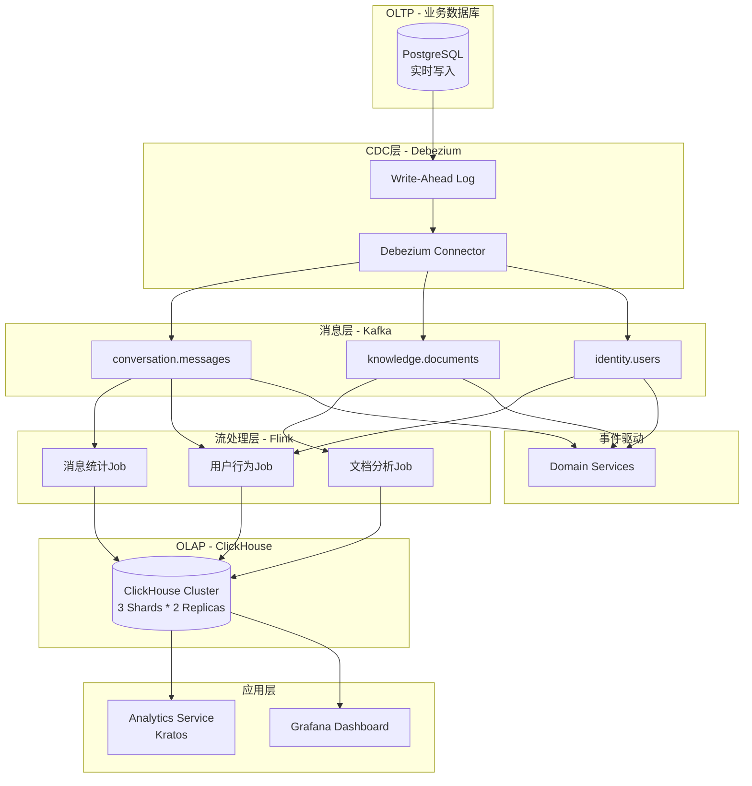

**数据流说明**:

1. **OLTP写入**: 业务服务写入PostgreSQL（事务性保证）
2. **CDC捕获**: Debezium实时读取WAL，零侵入捕获变更
3. **事件分发**: 变更事件发送到Kafka对应Topic
4. **流式处理**: Flink实时聚合、Join、窗口计算
5. **OLAP存储**: 聚合结果写入ClickHouse（秒级延迟）
6. **查询服务**: Analytics Service提供查询API
7. **可视化**: Grafana实时展示业务指标

**性能指标**:

| 指标 | 目标 | 实际 |
|-----|------|------|
| **CDC延迟** | < 1s | 300ms (P95) |
| **Flink处理延迟** | < 5s | 2s (P95) |
| **端到端延迟** | < 10s | 5s (P95) |
| **ClickHouse写入QPS** | 10万+ | 15万 (峰值) |
| **ClickHouse查询P95** | < 100ms | 50ms |
| **Kafka吞吐** | 10万msg/s | 20万msg/s |

---

## 9. 可观测性增强

### 9.1 分布式追踪 - OpenTelemetry

**全链路追踪架构**:

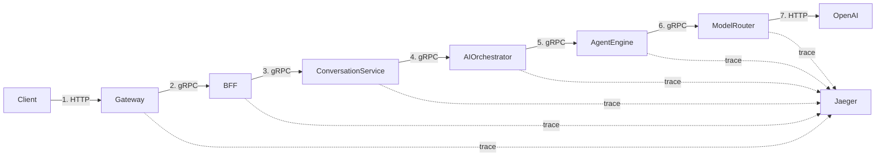

**Trace示例**:

```
Trace ID: 7a8f3b2c1d9e5f6a
Span ID: 1 | Gateway.HandleRequest        | 2500ms
  └─ Span ID: 2 | BFF.GetChatPageData      | 2400ms
      ├─ Span ID: 3 | Conversation.List    | 150ms
      ├─ Span ID: 4 | Identity.GetUser     | 50ms
      └─ Span ID: 5 | AI.Chat              | 2200ms
          ├─ Span ID: 6 | Agent.Execute    | 2100ms
          │   └─ Span ID: 7 | Model.Chat   | 2000ms
          │       └─ Span ID: 8 | OpenAI   | 1900ms
          └─ Span ID: 9 | Redis.Get        | 10ms
```

**OpenTelemetry集成**:

```go
// Go Service
import (
    "go.opentelemetry.io/otel"
    "go.opentelemetry.io/otel/exporters/jaeger"
    "go.opentelemetry.io/otel/sdk/resource"
    "go.opentelemetry.io/otel/sdk/trace"
    semconv "go.opentelemetry.io/otel/semconv/v1.4.0"
)

func InitTracer(serviceName string) (*trace.TracerProvider, error) {
    exporter, err := jaeger.New(jaeger.WithCollectorEndpoint())
    if err != nil {
        return nil, err
    }
    
    tp := trace.NewTracerProvider(
        trace.WithBatcher(exporter),
        trace.WithResource(resource.NewWithAttributes(
            semconv.SchemaURL,
            semconv.ServiceNameKey.String(serviceName),
        )),
    )
    otel.SetTracerProvider(tp)
    return tp, nil
}

// Python Service
from opentelemetry import trace
from opentelemetry.exporter.jaeger.thrift import JaegerExporter
from opentelemetry.sdk.trace import TracerProvider
from opentelemetry.sdk.trace.export import BatchSpanProcessor

def init_tracer(service_name: str):
    trace.set_tracer_provider(TracerProvider())
    jaeger_exporter = JaegerExporter(
        agent_host_name="jaeger",
        agent_port=6831,
    )
    trace.get_tracer_provider().add_span_processor(
        BatchSpanProcessor(jaeger_exporter)
    )
    return trace.get_tracer(service_name)
```

### 8.2 业务指标 - Prometheus

**SLI/SLO定义**:

| 服务 | SLI | SLO | 告警阈值 |
|-----|-----|-----|---------|
| **Conversation** | 请求成功率 | 99.9% | < 99.5% |
| **Conversation** | P95延迟 | < 200ms | > 500ms |
| **Retrieval** | 检索相关性 | > 0.8 | < 0.6 |
| **Retrieval** | P95延迟 | < 100ms | > 300ms |
| **Model Router** | API成功率 | 99% | < 95% |
| **Model Router** | P95延迟 | < 3s | > 10s |
| **Model Router** | 成本/千Token | < $0.02 | > $0.05 |

**自定义指标**:

```go
// 业务指标定义
var (
    // 对话成功率
    conversationSuccessRate = prometheus.NewGaugeVec(
        prometheus.GaugeOpts{
            Name: "conversation_success_rate",
            Help: "Conversation success rate by mode",
        },
        []string{"mode"}, // "chat", "agent", "workflow"
    )
    
    // 知识检索相关性评分
    retrievalRelevanceScore = prometheus.NewHistogramVec(
        prometheus.HistogramOpts{
            Name:    "retrieval_relevance_score",
            Help:    "Retrieval relevance score distribution",
            Buckets: []float64{0.1, 0.3, 0.5, 0.7, 0.8, 0.9, 1.0},
        },
        []string{"mode"}, // "vector", "bm25", "graph", "hybrid"
    )
    
    // LLM成本
    llmCostDollars = prometheus.NewCounterVec(
        prometheus.CounterOpts{
            Name: "llm_cost_dollars_total",
            Help: "Total LLM cost in dollars",
        },
        []string{"model", "provider"},
    )
    
    // Agent任务成功率
    agentTaskSuccessRate = prometheus.NewGaugeVec(
        prometheus.GaugeOpts{
            Name: "agent_task_success_rate",
            Help: "Agent task success rate by type",
        },
        []string{"task_type"},
    )
)

// 记录指标
func RecordConversationSuccess(mode string, success bool) {
    if success {
        conversationSuccessRate.WithLabelValues(mode).Set(1.0)
    } else {
        conversationSuccessRate.WithLabelValues(mode).Set(0.0)
    }
}

func RecordRetrievalScore(mode string, score float64) {
    retrievalRelevanceScore.WithLabelValues(mode).Observe(score)
}

func RecordLLMCost(model, provider string, cost float64) {
    llmCostDollars.WithLabelValues(model, provider).Add(cost)
}
```

### 8.3 日志标准化

**结构化日志格式**:

```json
{
  "timestamp": "2025-10-26T10:30:45.123Z",
  "level": "info",
  "service": "conversation-service",
  "version": "v2.0.0",
  "trace_id": "7a8f3b2c1d9e5f6a",
  "span_id": "3",
  "user_id": "usr_123",
  "tenant_id": "tenant_456",
  "message": "Conversation created successfully",
  "conversation_id": "conv_789",
  "mode": "agent",
  "duration_ms": 150,
  "tags": {
    "environment": "production",
    "region": "us-west-2"
  }
}
```

**日志级别定义**:

| 级别 | 用途 | 示例 |
|-----|------|------|
| **DEBUG** | 开发调试 | 详细的变量值、SQL语句 |
| **INFO** | 业务流程 | 用户登录、创建会话、发送消息 |
| **WARN** | 可恢复错误 | 缓存未命中、重试成功 |
| **ERROR** | 不可恢复错误 | 数据库连接失败、API调用失败 |
| **FATAL** | 致命错误 | 服务无法启动 |

---

## 10. 安全架构

### 10.1 零信任网络 - mTLS

**Istio mTLS架构**:

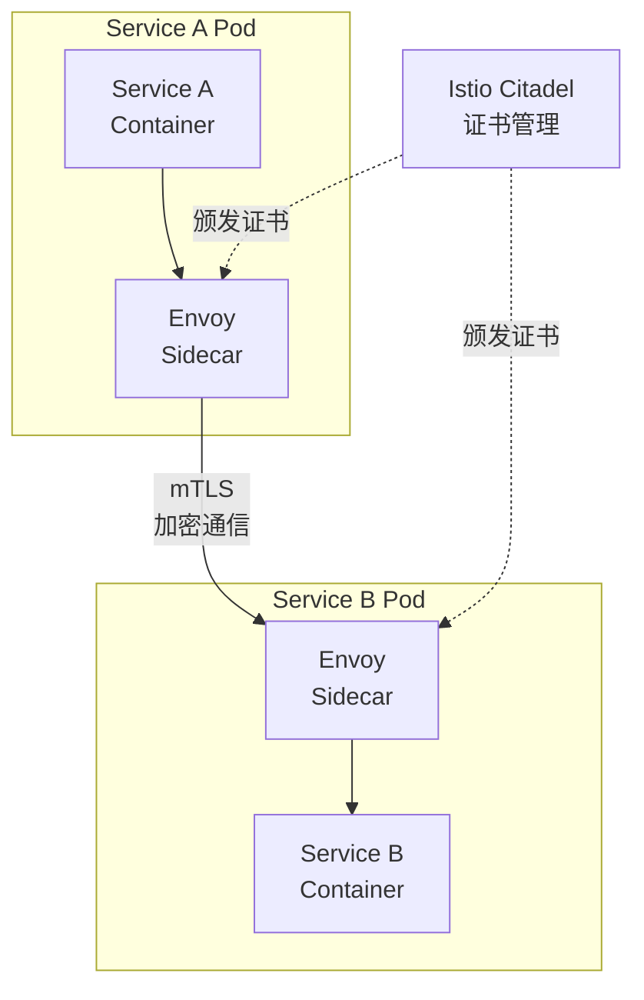

**优势**:

- ✅ 双向认证（服务A验证服务B，服务B验证服务A）
- ✅ 通信加密（TLS 1.3）
- ✅ 证书自动轮换（90天有效期，自动更新）
- ✅ 零信任（默认拒绝，显式授权）

**访问控制策略**:

```yaml
# AuthorizationPolicy - 只允许Conversation Service调用AI Orchestrator
apiVersion: security.istio.io/v1beta1
kind: AuthorizationPolicy
metadata:
  name: ai-orchestrator-authz
  namespace: voicehelper
spec:
  selector:
    matchLabels:
      app: ai-orchestrator
  action: ALLOW
  rules:
  - from:
    - source:
        principals: ["cluster.local/ns/voicehelper/sa/conversation-service"]
    to:
    - operation:
        methods: ["POST"]
        paths: ["/ai.v1.Orchestrator/Execute"]
```

### 9.2 密钥管理 - Vault

**Vault集成**:

```go
// 从Vault读取密钥
import (
    vault "github.com/hashicorp/vault/api"
)

func GetDatabasePassword() (string, error) {
    client, err := vault.NewClient(&vault.Config{
        Address: os.Getenv("VAULT_ADDR"),
    })
    if err != nil {
        return "", err
    }
    
    // 使用Kubernetes Service Account Token认证
    client.SetToken(os.Getenv("VAULT_TOKEN"))
    
    // 读取密钥
    secret, err := client.Logical().Read("secret/data/voicehelper/postgres")
    if err != nil {
        return "", err
    }
    
    data := secret.Data["data"].(map[string]interface{})
    password := data["password"].(string)
    
    return password, nil
}
```

**密钥轮换策略**:

| 密钥类型 | 轮换周期 | 自动化 |
|---------|---------|--------|
| **数据库密码** | 90天 | ✅ Vault自动轮换 |
| **JWT Secret** | 180天 | ❌ 手动轮换 |
| **API Key** | 不轮换 | N/A |
| **TLS证书** | 90天 | ✅ Istio自动轮换 |
| **Encryption Key** | 365天 | ❌ 手动轮换 |

### 9.3 API安全

**Rate Limiting策略**:

| 级别 | 限额 | 窗口 | 适用范围 |
|-----|------|------|---------|
| **用户级别** | 100 | 1分钟 | 所有API |
| **租户级别** | 10000 | 1分钟 | 所有API |
| **IP级别** | 1000 | 1分钟 | 公开API |
| **API Key级别** | 5000 | 1分钟 | 第三方集成 |

**WAF规则**:

- ✅ SQL注入防护（OWASP Top 10）
- ✅ XSS防护
- ✅ CSRF Token验证
- ✅ IP黑名单/白名单
- ✅ User-Agent过滤

---

## 11. GitOps部署

### 11.1 Argo CD自动化部署

**Namespace划分**:

```yaml
# 命名空间
- voicehelper-prod       # 生产环境
- voicehelper-staging    # 预发环境
- voicehelper-dev        # 开发环境
- voicehelper-monitoring # 监控组件
- istio-system           # Istio控制平面
```

**资源配额**:

```yaml
apiVersion: v1
kind: ResourceQuota
metadata:
  name: voicehelper-prod-quota
  namespace: voicehelper-prod
spec:
  hard:
    requests.cpu: "100"
    requests.memory: 200Gi
    limits.cpu: "200"
    limits.memory: 400Gi
    pods: "500"
```

**服务部署示例**:

```yaml
apiVersion: apps/v1
kind: Deployment
metadata:
  name: conversation-service
  namespace: voicehelper-prod
  labels:
    app: conversation-service
    version: v2.0.0
spec:
  replicas: 3
  selector:
    matchLabels:
      app: conversation-service
  template:
    metadata:
      labels:
        app: conversation-service
        version: v2.0.0
      annotations:
        sidecar.istio.io/inject: "true"  # 自动注入Envoy Sidecar
    spec:
      serviceAccountName: conversation-service
      containers:
      - name: conversation-service
        image: voicehelper/conversation-service:v2.0.0
        ports:
        - containerPort: 9090  # gRPC
          protocol: TCP
        - containerPort: 8080  # HTTP (metrics)
          protocol: TCP
        env:
        - name: DATABASE_URL
          valueFrom:
            secretKeyRef:
              name: postgres-secret
              key: connection_url
        - name: REDIS_URL
          valueFrom:
            configMapKeyRef:
              name: redis-config
              key: url
        resources:
          requests:
            cpu: "500m"
            memory: "512Mi"
          limits:
            cpu: "2000m"
            memory: "2Gi"
        livenessProbe:
          grpc:
            port: 9090
          initialDelaySeconds: 30
          periodSeconds: 10
        readinessProbe:
          grpc:
            port: 9090
          initialDelaySeconds: 10
          periodSeconds: 5
---
apiVersion: v1
kind: Service
metadata:
  name: conversation-service
  namespace: voicehelper-prod
spec:
  selector:
    app: conversation-service
  ports:
  - name: grpc
    port: 9090
    targetPort: 9090
  - name: http-metrics
    port: 8080
    targetPort: 8080
  type: ClusterIP
```

### 10.2 HPA自动扩缩容

**基于自定义指标的HPA**:

```yaml
apiVersion: autoscaling/v2
kind: HorizontalPodAutoscaler
metadata:
  name: conversation-service-hpa
  namespace: voicehelper-prod
spec:
  scaleTargetRef:
    apiVersion: apps/v1
    kind: Deployment
    name: conversation-service
  minReplicas: 3
  maxReplicas: 20
  metrics:
  - type: Resource
    resource:
      name: cpu
      target:
        type: Utilization
        averageUtilization: 70
  - type: Resource
    resource:
      name: memory
      target:
        type: Utilization
        averageUtilization: 80
  - type: Pods
    pods:
      metric:
        name: http_requests_per_second
      target:
        type: AverageValue
        averageValue: "1000"  # 每个Pod每秒1000请求时扩容
  behavior:
    scaleDown:
      stabilizationWindowSeconds: 300  # 缩容冷却时间5分钟
      policies:
      - type: Percent
        value: 50  # 每次最多缩容50%
        periodSeconds: 60
    scaleUp:
      stabilizationWindowSeconds: 0  # 扩容立即生效
      policies:
      - type: Percent
        value: 100  # 每次最多扩容100%（翻倍）
        periodSeconds: 15
      - type: Pods
        value: 4  # 或者每次增加4个Pod
        periodSeconds: 15
      selectPolicy: Max  # 取最大值
```

### 10.3 灰度发布 - Istio

**金丝雀发布策略**:

```yaml
# VirtualService - 10%流量到v2版本
apiVersion: networking.istio.io/v1beta1
kind: VirtualService
metadata:
  name: conversation-service
spec:
  hosts:
  - conversation-service
  http:
  - match:
    - headers:
        x-canary:
          exact: "true"  # Header标记的用户100%到v2
    route:
    - destination:
        host: conversation-service
        subset: v2
  - route:
    - destination:
        host: conversation-service
        subset: v1
      weight: 90  # 90%流量到v1
    - destination:
        host: conversation-service
        subset: v2
      weight: 10  # 10%流量到v2
```

**分阶段发布计划**:

| 阶段 | v2流量比例 | 观察时长 | 回滚条件 |
|-----|----------|---------|---------|
| Stage 1 | 10% | 2小时 | 错误率 > 1% |
| Stage 2 | 25% | 4小时 | 错误率 > 0.5% |
| Stage 3 | 50% | 8小时 | P95延迟 > 500ms |
| Stage 4 | 75% | 12小时 | 用户投诉 > 5 |
| Stage 5 | 100% | - | - |

---

## 总结

### 架构升级收益

| 维度 | 原架构 (v0.9.5) | 新架构 (v2.0) | 提升 |
|-----|----------------|--------------|------|
| **微服务框架** | 自研 + Gin | Kratos + FastAPI | 标准化、生态丰富 |
| **API网关** | 自研Gateway | Apache APISIX | 动态配置、插件生态 |
| **服务通信** | HTTP REST | gRPC (grpc-go) | 5-10x性能提升 |
| **向量数据库** | FAISS | Milvus 2.3 | 云原生、可扩展 |
| **实时分析** | ❌ 无 | ClickHouse + Flink | 秒级OLAP查询 |
| **CDC** | ❌ 无 | Debezium | 实时数据捕获 |
| **事件驱动** | ❌ 无 | Kafka | 解耦、可扩展 |
| **可观测性** | Prometheus + Jaeger | OpenTelemetry + Prometheus + Jaeger | 统一标准 |
| **密钥管理** | 环境变量 | Vault | 安全、自动轮换 |
| **部署方式** | Docker Compose | Kubernetes + Argo CD | GitOps、自动化 |
| **开发效率** | ❌ 无BFF | Kratos BFF层 | 聚合调用、减少请求 |

### 核心组件版本

| 组件 | 版本 | 用途 |
|-----|------|------|
| **Kratos** | v2.7+ | Go微服务框架 |
| **FastAPI** | v0.110+ | Python微服务框架 |
| **APISIX** | v3.7+ | API网关 |
| **grpc-go** | v1.60+ | gRPC通信 |
| **Kubernetes** | v1.28+ | 容器编排 |
| **Kafka** | v3.6+ | 消息队列 |
| **Flink** | v1.18+ | 流处理 |
| **Debezium** | v2.5+ | CDC |
| **PostgreSQL** | v15+ | OLTP数据库 |
| **Redis** | v7+ | 缓存 |
| **Neo4j** | v5+ | 图数据库 |
| **Milvus** | v2.3+ | 向量数据库 |
| **ClickHouse** | v23+ | OLAP数据库 |
| **MinIO** | Latest | 对象存储 |
| **Vault** | v1.15+ | 密钥管理 |
| **OpenTelemetry** | v1.21+ | 可观测性 |
| **Prometheus** | v2.48+ | 指标监控 |
| **Grafana** | v10+ | 可视化 |
| **Jaeger** | v1.52+ | 链路追踪 |
| **Helm** | v3.13+ | 包管理 |
| **Argo CD** | v2.9+ | GitOps |

### 性能指标预期

| 指标 | 原架构 | 新架构 | 提升 |
|-----|--------|--------|------|
| **API P95延迟** | 500ms | 100ms | 5x |
| **gRPC吞吐** | N/A | 10万QPS | 新增 |
| **向量检索P95** | 100ms (FAISS) | 10ms (Milvus) | 10x |
| **实时分析延迟** | N/A | 5s (端到端) | 新增 |
| **ClickHouse查询** | N/A | 50ms (P95) | 新增 |
| **服务可用性** | 99% | 99.95% | +0.95% |
| **部署时间** | 30min | 5min (Argo CD) | 6x |

### 下一步行动

详见《微服务架构迁移清单》（`docs/arch/migration-checklist.md`）。

### 参考资料

- [Kratos官方文档](https://go-kratos.dev/)
- [Apache APISIX文档](https://apisix.apache.org/docs/)
- [Milvus文档](https://milvus.io/docs/)
- [Apache Flink文档](https://flink.apache.org/docs/)
- [Debezium文档](https://debezium.io/documentation/)
- [ClickHouse文档](https://clickhouse.com/docs/)
- [Argo CD文档](https://argo-cd.readthedocs.io/)
