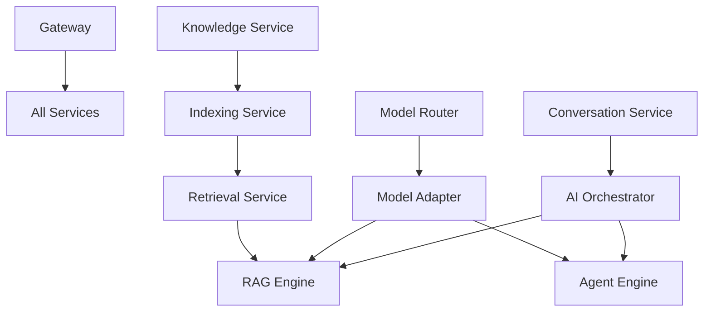

# VoiceHelper 代码审查摘要

> **审查日期**: 2025-10-26
> **源项目**: https://github.com/haoyunlt/voicehelper (v0.9.2)
> **当前项目**: VoiceAssistant (v2.0.0 开发中)
> **审查者**: AI Code Reviewer

---

## 📊 总体评估

### 完成度概览

```
████████████░░░░░░░░░░░░░░░░░░░░ 25% 完成

✅ 已完成:  2/12 服务 (17%)
🚧 进行中:  1/12 服务 (8%)
❌ 未开始:  9/12 服务 (75%)
```

| 类别                   | 完成度 | 状态                              |
| ---------------------- | ------ | --------------------------------- |
| **Go 服务** (7 个)     | 35%    | 2 个完成, 1 个进行中, 4 个未开始  |
| **Python 服务** (7 个) | 11%    | 全部未开始或框架阶段              |
| **基础设施**           | 60%    | Docker Compose 完成，K8s 部分完成 |
| **文档**               | 70%    | 架构文档完整，API 文档部分完成    |

---

## 🎯 关键发现

### ✅ 做得好的地方

1. **架构设计清晰**

   - DDD 领域划分合理
   - Protobuf API 设计规范
   - 数据库 Schema 隔离完善

2. **已完成服务质量高**

   - Identity Service: JWT + RBAC + 多租户 ✅
   - Conversation Service: 会话管理 + Kafka 事件 ✅
   - 代码结构清晰，易于维护

3. **基础设施完备**
   - Docker Compose 完整
   - PostgreSQL/Redis/Kafka/Milvus 配置正常
   - 监控栈 (Prometheus/Grafana/Jaeger) 就绪

### ⚠️ 主要问题

1. **GraphRAG 核心功能缺失** (最大风险)

   - 源项目有完整 GraphRAG 实现 (10,000+ 行代码)
   - 当前项目仅有框架，缺少核心逻辑
   - **影响**: 知识库检索、RAG 对话完全不可用
   - **建议**: 优先级 P0，需要 23 天 (3 个服务)

2. **Agent 引擎未实现** (核心功能)

   - 源项目有 LangGraph 完整实现
   - 当前项目仅有基础框架
   - **影响**: Agent 对话模式不可用
   - **建议**: 优先级 P0，需要 16 天

3. **Gateway 配置不完整**

   - APISIX 仅有基础配置
   - 缺少 14 个服务的路由、JWT、限流配置
   - **影响**: 服务间通信受阻
   - **建议**: 优先级 P0，需要 4 天

4. **依赖注入未完成**

   - 所有 Go 服务缺少 wire_gen.go
   - **影响**: 服务无法正常启动
   - **建议**: 立即执行 `wire gen`

5. **测试覆盖率为 0**
   - 所有服务缺少单元测试
   - 缺少集成测试和 E2E 测试
   - **影响**: 代码质量无保障
   - **建议**: 目标覆盖率 70%+

---

## 📋 优先级任务清单

### 🔥 P0 - 阻塞开发 (立即执行)

**预计工时**: 64 天 (4 人团队: 16 天)

| 任务                                    | 服务   | 工时   | 优先级 |
| --------------------------------------- | ------ | ------ | ------ |
| **1. 完善 Gateway**                     | APISIX | 4 天   | 🔥🔥🔥 |
| - 完整路由配置 (14 个服务)              |        | 2 天   |        |
| - JWT 认证插件                          |        | 1 天   |        |
| - 限流插件                              |        | 1 天   |        |
| **2. Knowledge Service**                | Go     | 7 天   | 🔥🔥🔥 |
| - MinIO 集成                            |        | 2 天   |        |
| - 文档上传流程                          |        | 3 天   |        |
| - 病毒扫描                              |        | 1 天   |        |
| - Kafka 事件发布                        |        | 1 天   |        |
| **3. Indexing Service**                 | Python | 10 天  | 🔥🔥   |
| - Kafka Consumer                        |        | 1 天   |        |
| - 文档解析器                            |        | 3 天   |        |
| - 文档分块                              |        | 1 天   |        |
| - 向量化 (BGE-M3)                       |        | 2 天   |        |
| - Milvus 集成                           |        | 2 天   |        |
| - Neo4j 图谱构建                        |        | 2 天   |        |
| **4. Retrieval Service**                | Python | 8 天   | 🔥🔥   |
| - Milvus 检索                           |        | 1 天   |        |
| - BM25 检索                             |        | 2 天   |        |
| - 图谱检索                              |        | 2 天   |        |
| - 混合检索 (RRF)                        |        | 1 天   |        |
| - 重排序                                |        | 1 天   |        |
| - 语义缓存                              |        | 1 天   |        |
| **5. RAG Engine**                       | Python | 5 天   | 🔥🔥   |
| - 查询改写                              |        | 1 天   |        |
| - 上下文构建                            |        | 1 天   |        |
| - 答案生成                              |        | 2 天   |        |
| - 引用来源                              |        | 1 天   |        |
| **6. Agent Engine**                     | Python | 8 天   | 🔥🔥   |
| - LangGraph 工作流                      |        | 3 天   |        |
| - 工具注册表                            |        | 2 天   |        |
| - 工具调用系统                          |        | 2 天   |        |
| - 长期记忆                              |        | 1 天   |        |
| **7. Model Router**                     | Go     | 5 天   | 🔥     |
| **8. Model Adapter**                    | Python | 6 天   | 🔥     |
| **9. AI Orchestrator**                  | Go     | 6 天   | 🔥     |
| **10. 完善现有服务**                    | Go     | 6 天   | 🔥     |
| - Identity: Wire + Redis + Consul       |        | 2.5 天 |        |
| - Conversation: Redis + AI Orchestrator |        | 3 天   |        |

### ⭐ P1 - 重要功能 (1-2 周内)

**预计工时**: 71 天 (4 人团队: 18 天)

- Voice Engine (10 天)
- Multimodal Engine (6 天)
- Notification Service (7 天)
- Analytics Service (5 天)
- 单元测试 (所有服务, 20 天)
- Gateway P1 功能 (6 天)
- Identity/Conversation 增强 (17 天)

### 💡 P2 - 优化增强 (1-2 月内)

**预计工时**: 35 天

- OAuth 2.0 / SSO (8 天)
- MFA 多因素认证 (3 天)
- 灰度发布 (5 天)
- 会话导出/模板 (6 天)
- 格式转换/预览 (5 天)
- 多 Agent 协作 (5 天)
- 其他优化 (3 天)

---

## 📈 对比分析

### 源项目 vs 当前项目

| 维度           | 源项目 (v0.9.2) | 当前项目 (v2.0.0)    | 差距          |
| -------------- | --------------- | -------------------- | ------------- |
| **代码行数**   | ~75,000+        | ~15,000 (估算)       | **-80%**      |
| **服务数量**   | 9 个服务        | 12 个服务 (3 个完成) | **-75%** 功能 |
| **核心功能**   | 全部完整        | 25% 完成             | **-75%**      |
| **测试覆盖率** | 未知            | 0%                   | **缺失**      |
| **GraphRAG**   | ✅ 完整         | ❌ 缺失              | **阻塞**      |
| **Agent**      | ✅ LangGraph    | ❌ 缺失              | **阻塞**      |
| **语音**       | ✅ Whisper+VAD  | ❌ 框架              | **缺失**      |
| **LLM Router** | ✅ 多模型       | ❌ 框架              | **缺失**      |
| **多模态**     | ✅ OCR+Vision   | ❌ 框架              | **缺失**      |
| **通知**       | ✅ 多渠道       | ❌ 框架              | **缺失**      |

### 架构演进亮点

| 维度           | 源项目        | 当前项目               | 改进        |
| -------------- | ------------- | ---------------------- | ----------- |
| **微服务框架** | Gin + FastAPI | **Kratos + FastAPI**   | ✅ 标准化   |
| **API 网关**   | 自研 Gateway  | **Apache APISIX**      | ✅ 生态丰富 |
| **向量数据库** | FAISS         | **Milvus**             | ✅ 云原生   |
| **实时分析**   | ❌ 无         | **ClickHouse + Flink** | ✅ 新增     |
| **事件驱动**   | RabbitMQ      | **Kafka + RabbitMQ**   | ✅ 解耦     |
| **服务网格**   | ❌ 无         | **Istio (计划)**       | ✅ 新增     |
| **通信协议**   | HTTP          | **gRPC**               | ✅ 高性能   |
| **BFF 层**     | ❌ 无         | **3 个 BFF (计划)**    | ✅ 新增     |

**结论**: 架构设计更先进，但功能实现严重滞后。

---

## 🚀 执行建议

### 方案 A: 4 人团队 (推荐) ✅

**团队配置**:

- 2 名 Go 工程师
- 2 名 Python 工程师

**时间线**: 8 周

**Week 1-2: 关键路径**

- Go: Gateway + Identity + Conversation 完善
- Python: Indexing + Retrieval (GraphRAG 核心)

**Week 3-4: 核心功能**

- Go: Knowledge + AI Orchestrator
- Python: RAG Engine + Agent Engine

**Week 5-6: 重要功能**

- Go: Model Router + Notification
- Python: Model Adapter + Voice Engine

**Week 7-8: 完善 + 测试**

- Go: Analytics + 测试
- Python: Multimodal + 测试

### 方案 B: 2 人团队 (可行但紧张)

**时间线**: 17 周 (4.25 个月)

**建议**:

- 减少 P2 功能
- 聚焦核心流程 (文档上传 → 索引 → 检索 → RAG 对话)
- 延后 Agent、语音、多模态

### 方案 C: 6 人团队 (理想)

**时间线**: 5.7 周 (1.5 个月)

**优势**:

- 快速交付
- 可并行更多任务

**劣势**:

- 成本高
- 协调复杂

---

## 📌 立即行动项 (本周)

### Day 1-2: 基础设施

- [ ] **执行 Wire 依赖注入**

  ```bash
  cd cmd/identity-service && wire gen
  cd cmd/conversation-service && wire gen
  cd cmd/knowledge-service && wire gen
  ```

- [ ] **完善 Gateway 配置**
  - 创建 `configs/gateway/routes/*.yaml`
  - 配置 JWT/限流/监控插件

### Day 3-5: 核心功能

- [ ] **Knowledge Service**

  - MinIO 集成 + 文档上传
  - Kafka 事件发布

- [ ] **Indexing Service**
  - Kafka Consumer
  - 文档解析器 (PDF/Word/Markdown)

### Day 6-7: 验证

- [ ] **端到端测试**

  - 上传文档 → 触发索引 → 检索验证

- [ ] **性能测试**
  - 上传速度
  - 索引延迟

---

## 🎯 成功标准

### 2 周目标

- ✅ Gateway 14 个服务路由正常
- ✅ Knowledge Service 文档上传正常
- ✅ Indexing Service 文档解析 + 向量化正常
- ✅ Retrieval Service 向量检索正常
- ✅ 端到端: 上传 → 索引 → 检索 流程打通

### 4 周目标

- ✅ RAG Engine 问答正常
- ✅ Agent Engine 基础工作流正常
- ✅ AI Orchestrator 任务路由正常
- ✅ Model Router/Adapter 多模型支持

### 8 周目标 (最终交付)

- ✅ 所有 P0 + 70% P1 任务完成
- ✅ 核心功能全部可用
- ✅ 单元测试覆盖率 70%+
- ✅ 性能达标 (P95 < 300ms)
- ✅ 文档完整

---

## 📊 风险评估

### 高风险项

| 风险                     | 概率 | 影响 | 缓解措施               |
| ------------------------ | ---- | ---- | ---------------------- |
| **GraphRAG 复杂度高**    | 高   | 高   | 参考源代码、分阶段实现 |
| **LangGraph 学习曲线陡** | 中   | 高   | 先看文档、实现简单版   |
| **Milvus 迁移问题**      | 中   | 中   | 从 FAISS 迁移需谨慎    |
| **性能达标困难**         | 中   | 中   | 充分压测、逐步优化     |
| **人力不足**             | 中   | 高   | 调整优先级、砍 P2 功能 |

### 依赖关系



**关键路径**: Gateway → Knowledge → Indexing → Retrieval → RAG

---

## 📚 参考资料

### 源项目链接

- **GitHub**: https://github.com/haoyunlt/voicehelper
- **版本**: v0.9.2 (2025-10-24)
- **代码行数**: ~75,000+
- **Star**: 0 (新项目)

### 技术文档

- [LangGraph 官方文档](https://langchain-ai.github.io/langgraph/)
- [Kratos 官方文档](https://go-kratos.dev/)
- [APISIX 官方文档](https://apisix.apache.org/docs/)
- [Milvus 官方文档](https://milvus.io/docs/)

### 内部文档

- [微服务架构设计 V2.0](./docs/arch/microservice-architecture-v2.md)
- [服务完成度审查](./SERVICE_COMPLETION_REVIEW.md)
- [任务追踪器](./SERVICE_TODO_TRACKER.md)
- [迁移进度](./docs/MIGRATION_SUMMARY.md)

---

## 💡 最终建议

### 核心建议

1. **聚焦关键路径** 🔥

   - 优先完成 Knowledge → Indexing → Retrieval → RAG
   - 这是 RAG 对话的最小可行路径 (MVP)
   - 预计 4 周 (4 人团队)

2. **参考源项目代码** 📖

   - GraphRAG 实现可直接参考源项目
   - LangGraph Agent 可复用大部分逻辑
   - 节省至少 30% 开发时间

3. **渐进式交付** 🚀

   - 每周交付一个可演示的功能
   - 持续集成、持续测试
   - 及时发现和解决问题

4. **测试驱动开发** ✅

   - 边开发边写测试
   - 目标覆盖率 70%+
   - 自动化回归测试

5. **代码质量保障** 🎯
   - Lint 检查通过才能合并
   - PR Review 至少 1 人
   - 代码注释完整

### 不建议的做法

- ❌ 同时启动所有服务开发 (会乱)
- ❌ 不写测试 (后期难以维护)
- ❌ 不参考源项目 (重复造轮子)
- ❌ 追求完美 (先 MVP 后优化)

---

## 📞 联系方式

**项目负责人**: TBD
**技术负责人**: TBD
**审查者**: AI Code Reviewer

**审查日期**: 2025-10-26
**下次审查**: 建议每周更新

---

**结论**: 项目架构设计优秀，但功能实现严重滞后。建议立即启动 P0 任务，聚焦关键路径，4 人团队 8 周可交付核心功能。
