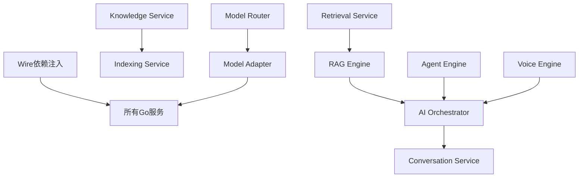

# VoiceHelper 未完成功能清单

> **代码 Review 日期**: 2025-10-26
> **Review 方式**: 系统性代码扫描 + 对照.cursorrules 规范
> **整体完成度**: ~35% (基础框架完成，核心功能待实现)

---

## 📊 总览统计

| 类别              | 总数 | 已完成 | 进行中 | 未开始 | 完成率 |
| ----------------- | ---- | ------ | ------ | ------ | ------ |
| **基础设施**      | 15   | 11     | 0      | 4      | 73%    |
| **Go 微服务**     | 7    | 2      | 3      | 2      | 43%    |
| **Python 微服务** | 7    | 2      | 0      | 5      | 29%    |
| **数据流处理**    | 3    | 0      | 1      | 2      | 10%    |
| **前端开发**      | 8    | 1      | 0      | 7      | 13%    |
| **CI/CD**         | 5    | 0      | 0      | 5      | 0%     |
| **可观测性**      | 8    | 2      | 2      | 4      | 38%    |
| **安全合规**      | 6    | 1      | 2      | 3      | 25%    |
| **测试**          | 4    | 0      | 0      | 4      | 0%     |
| **文档**          | 5    | 3      | 0      | 2      | 60%    |

---

## 🔥 P0 - 阻塞性任务 (必须立即完成)

### 1. Go 服务 - Wire 依赖注入生成 ⚠️

**状态**: 🟡 Wire 文件已创建，但 wire_gen.go 未生成

**影响**: 所有 Go 服务无法正常启动

**缺失内容**:

```bash
# 需要为每个服务执行
cd cmd/identity-service && wire gen
cd cmd/conversation-service && wire gen
cd cmd/knowledge-service && wire gen
cd cmd/ai-orchestrator && wire gen
cd cmd/model-router && wire gen
cd cmd/notification-service && wire gen
cd cmd/analytics-service && wire gen
```

**预计工时**: 0.5 天

---

### 2. Knowledge Service - MinIO 集成 ❌

**状态**: ❌ 完全未实现

**缺失功能**:

- [ ] MinIO 客户端封装
- [ ] 文件上传/下载
- [ ] 预签名 URL 生成
- [ ] 病毒扫描(ClamAV)集成
- [ ] Kafka 事件发布

**关键文件**:

```
cmd/knowledge-service/internal/infrastructure/
├── storage/
│   └── minio_client.go          # ❌ 未创建
├── security/
│   └── virus_scanner.go         # ❌ 未创建
└── event/
    └── publisher.go              # ❌ 未创建
```

**参考实现**: `algo/indexing-service/app/infrastructure/minio_client.py`

**预计工时**: 7 天

---

### 3. RAG Engine - 检索增强生成 ❌

**状态**: ❌ 只有框架，核心功能未实现

**缺失功能**:

- [ ] 调用 Retrieval Service
- [ ] 查询改写(HyDE, Multi-Query)
- [ ] 上下文构建(Token 截断)
- [ ] Prompt 模板管理
- [ ] 答案生成(流式/非流式)
- [ ] 引用来源生成
- [ ] 语义缓存

**关键文件**:

```
algo/rag-engine/app/
├── core/
│   ├── query_rewriter.py        # ❌ 未创建
│   ├── context_builder.py       # ❌ 未创建
│   ├── answer_generator.py      # ❌ 未创建
│   └── citation_generator.py    # ❌ 未创建
└── infrastructure/
    └── retrieval_client.py       # ❌ 未创建
```

**预计工时**: 5 天

---

### 4. Agent Engine - LangGraph 工作流 ❌

**状态**: ❌ 只有 FastAPI 框架

**缺失功能**:

- [ ] LangGraph Agent 工作流
- [ ] ReAct 模式实现
- [ ] 工具注册表(50+工具)
- [ ] 工具调用系统
- [ ] 长期记忆(FAISS)
- [ ] 记忆衰减管理
- [ ] MCP 集成

**关键文件**:

```
algo/agent-engine/app/
├── core/
│   ├── agent/
│   │   ├── workflow.py          # ❌ 未创建
│   │   └── state.py             # ❌ 未创建
│   ├── tools/
│   │   ├── registry.py          # ❌ 未创建
│   │   └── executor.py          # ❌ 未创建
│   └── memory/
│       ├── vector_memory.py     # ❌ 未创建
│       └── decay_manager.py     # ❌ 未创建
```

**预计工时**: 8 天

---

### 5. Model Router - 路由决策引擎 ❌

**状态**: ❌ 只有目录结构

**缺失功能**:

- [ ] 模型路由决策(成本/延迟/可用性)
- [ ] 成本优化器
- [ ] 降级管理器
- [ ] 模型能力注册表
- [ ] gRPC Service 实现

**关键文件**:

```
cmd/model-router/internal/
├── application/
│   ├── routing_service.go       # 🟡 框架存在
│   ├── cost_optimizer.go        # ❌ 未创建
│   └── fallback_manager.go      # ❌ 未创建
└── domain/
    └── model_registry.go         # ❌ 未创建
```

**预计工时**: 5 天

---

### 6. Model Adapter - 多 Provider 适配 ❌

**状态**: ❌ 只有目录结构

**缺失功能**:

- [ ] OpenAI 适配器
- [ ] Claude 适配器
- [ ] 智谱 AI 适配器
- [ ] 协议转换器
- [ ] Token 计数
- [ ] 成本计算
- [ ] 错误处理与重试

**关键文件**:

```
algo/model-adapter/app/
├── adapters/
│   ├── openai_adapter.py        # ❌ 未创建
│   ├── claude_adapter.py        # ❌ 未创建
│   └── zhipu_adapter.py         # ❌ 未创建
└── core/
    ├── protocol_converter.py    # ❌ 未创建
    └── error_handler.py          # ❌ 未创建
```

**预计工时**: 6 天

---

### 7. AI Orchestrator - 任务编排 🟡

**状态**: 🟡 有 Wire 配置，但业务逻辑未实现

**缺失功能**:

- [ ] 任务路由器(Agent/RAG/Voice)
- [ ] 流程编排器(串行/并行/条件)
- [ ] 结果聚合器
- [ ] 流式响应处理
- [ ] 超时与取消

**关键文件**:

```
cmd/ai-orchestrator/internal/
├── application/
│   ├── task_router.go           # 🟡 框架存在
│   ├── orchestration_service.go # 🟡 框架存在
│   └── result_aggregator.go     # ❌ 未创建
└── domain/
    ├── task.go                   # 🟡 部分实现
    └── pipeline.go               # 🟡 部分实现
```

**预计工时**: 6 天

---

## ⭐ P1 - 重要功能 (1-2 周内完成)

### 8. Flink 流处理任务 🟡

**状态**: 🟡 有框架，核心逻辑未实现

**缺失功能**:

#### Message Stats Job

- [ ] Kafka 消费(conversation.messages)
- [ ] 窗口聚合(1 小时滚动)
- [ ] ClickHouse Sink
- [ ] Checkpoint 配置

#### User Behavior Job

- [ ] 多流 Join(identity.users + conversation.events)
- [ ] 会话窗口(30 分钟)
- [ ] 行为分析指标
- [ ] ClickHouse Sink

#### Document Analysis Job

- [ ] 文档统计聚合
- [ ] 按租户分组
- [ ] ClickHouse Sink

**文件状态**:

```
flink-jobs/
├── message-stats/main.py        # 🟡 有TODO
├── user-behavior/main.py        # ❌ 空框架
└── document-analysis/main.py    # ❌ 空框架
```

**预计工时**: 10 天

---

### 9. Debezium CDC 配置 ❌

**状态**: ❌ 文档中有配置，但未实际部署

**缺失内容**:

- [ ] PostgreSQL WAL 配置(已在 docker-compose 中)
- [ ] Debezium Connector 部署
- [ ] Kafka Connect 集群
- [ ] CDC 监控
- [ ] 错误处理与重试

**需要创建**:

```
deployments/k8s/
└── debezium/
    ├── connector-config.yaml    # ❌ 未创建
    └── kafka-connect.yaml       # ❌ 未创建
```

**预计工时**: 5 天

---

### 10. Voice Engine - 语音处理 ❌

**状态**: ❌ 只有框架

**缺失功能**:

- [ ] ASR(Whisper)
- [ ] TTS(Edge-TTS)
- [ ] VAD(Silero-VAD)
- [ ] WebRTC 集成
- [ ] 音频处理(降噪/增强)

**关键文件**:

```
algo/voice-engine/app/
├── core/
│   ├── asr/
│   │   └── whisper_asr.py       # ❌ 未创建
│   ├── tts/
│   │   └── edge_tts.py          # ❌ 未创建
│   ├── vad/
│   │   └── silero_vad.py        # ❌ 未创建
│   └── audio/
│       └── processor.py         # ❌ 未创建
```

**预计工时**: 10 天

---

### 11. Multimodal Engine - 多模态处理 ❌

**状态**: ❌ 只有框架

**缺失功能**:

- [ ] OCR(PaddleOCR)
- [ ] 图像理解(GPT-4V)
- [ ] 视频分析
- [ ] 表格识别
- [ ] 文档布局分析

**关键文件**:

```
algo/multimodal-engine/app/
├── core/
│   ├── ocr/
│   │   └── paddle_ocr.py        # ❌ 未创建
│   ├── vision/
│   │   └── gpt4v.py             # ❌ 未创建
│   └── video/
│       └── analyzer.py          # ❌ 未创建
```

**预计工时**: 6 天

---

### 12. Notification Service - 通知服务 ❌

**状态**: ❌ 只有 Wire 框架

**缺失功能**:

- [ ] 邮件发送
- [ ] 短信发送
- [ ] Push 通知(FCM/APNs)
- [ ] Webhook
- [ ] 模板引擎
- [ ] Kafka 消费者
- [ ] RabbitMQ 任务队列

**关键文件**:

```
cmd/notification-service/internal/
├── infrastructure/
│   └── channels/
│       ├── email.go             # ❌ 未创建
│       ├── sms.go               # ❌ 未创建
│       └── push.go              # ❌ 未创建
└── application/
    └── template_service.go      # ❌ 未创建
```

**预计工时**: 7 天

---

### 13. Analytics Service - 分析服务 🟡

**状态**: 🟡 有 Wire 框架

**缺失功能**:

- [ ] ClickHouse 客户端完善
- [ ] 实时指标查询
- [ ] 报表生成
- [ ] 成本看板 API
- [ ] 趋势分析

**关键文件**:

```
cmd/analytics-service/internal/
├── infrastructure/
│   └── clickhouse_client.go     # 🟡 框架存在
└── application/
    ├── metrics_service.go       # ❌ 未实现
    └── report_service.go         # ❌ 未实现
```

**预计工时**: 5 天

---

### 14. 前端开发 ❌

**状态**: ❌ 只有 Next.js 框架和首页

**缺失页面**:

- [ ] `/chat` - 对话界面
- [ ] `/knowledge` - 知识库管理
- [ ] `/analytics` - 分析看板
- [ ] `/settings` - 设置页面
- [ ] `/login` - 登录页
- [ ] `/register` - 注册页

**缺失组件**:

- [ ] ChatBox 组件(消息列表+输入框)
- [ ] DocumentUploader 组件
- [ ] MarkdownRenderer 组件
- [ ] VoiceRecorder 组件
- [ ] 流式响应显示

**状态管理**:

- [ ] Zustand store (已安装但未配置)
- [ ] React Query (已安装但未配置)

**文件状态**:

```
platforms/web/src/
├── app/
│   ├── page.tsx                 # ✅ 首页完成
│   ├── chat/                    # ❌ 未创建
│   ├── knowledge/               # ❌ 未创建
│   └── analytics/               # ❌ 未创建
├── components/                  # ❌ 未创建
├── hooks/                       # ❌ 未创建
└── lib/                         # ❌ 未创建
```

**预计工时**: 15 天

---

### 15. OpenTelemetry 完整集成 🟡

**状态**: 🟡 有配置，但实际埋点可能不完整

**缺失内容**:

- [ ] OpenTelemetry Collector 部署
- [ ] 所有服务的完整追踪埋点
- [ ] 自定义 Span 属性
- [ ] 业务指标完善
- [ ] Jaeger UI 配置
- [ ] Loki 日志集成

**需要检查**:

```bash
# 每个服务是否都有完整的追踪?
grep -r "otel.Tracer" cmd/*/internal/
grep -r "opentelemetry" algo/*/app/
```

**预计工时**: 5 天

---

### 16. Vault 集成完善 🟡

**状态**: 🟡 配置文件中引用 Vault，但实际集成可能不完整

**缺失内容**:

- [ ] Vault 集群部署
- [ ] Kubernetes 认证配置
- [ ] 密钥轮换脚本
- [ ] 所有服务的 Vault 客户端
- [ ] 动态密钥获取

**检查点**:

```go
// 每个服务是否都有Vault客户端?
// cmd/*/internal/infrastructure/vault_client.go
```

**预计工时**: 5 天

---

### 17. Grafana Dashboard ❌

**状态**: ❌ Grafana 已部署，但 Dashboard 未创建

**缺失 Dashboard**:

- [ ] 系统概览(CPU/Memory/Network)
- [ ] API 性能(QPS/Latency/Error)
- [ ] 业务指标(用户/消息/文档)
- [ ] LLM 监控(Token/成本/模型)
- [ ] 任务监控(Agent/RAG/Voice)

**需要创建**:

```
configs/monitoring/grafana/
├── system-overview.json         # ❌ 未创建
├── api-performance.json         # ❌ 未创建
├── business-metrics.json        # ❌ 未创建
└── llm-monitoring.json          # ❌ 未创建
```

**预计工时**: 4 天

---

### 18. AlertManager 告警规则 ❌

**状态**: ❌ 完全未配置

**缺失规则**:

- [ ] 错误率 > 1%
- [ ] P95 延迟 > 500ms
- [ ] 服务不可用
- [ ] 成本超限
- [ ] 数据库连接池满
- [ ] Redis 连接失败
- [ ] Kafka 消费延迟

**需要创建**:

```
configs/monitoring/prometheus/
└── rules/
    ├── slo.yml                  # ❌ 未创建
    ├── cost.yml                 # ❌ 未创建
    └── infrastructure.yml       # ❌ 未创建
```

**预计工时**: 2 天

---

## 💡 P2 - 优化增强 (1-2 月内完成)

### 19. CI/CD Pipeline ❌

**状态**: ❌ 完全缺失

**缺失内容**:

- [ ] `.github/workflows/ci.yml` - Lint + Test + Build
- [ ] `.github/workflows/build.yml` - Docker 镜像构建
- [ ] `.github/workflows/deploy.yml` - 部署
- [ ] PR 模板
- [ ] Issue 模板
- [ ] semantic-release 配置

**需要创建**:

```
.github/
├── workflows/
│   ├── ci.yml                   # ❌ 未创建
│   ├── build.yml                # ❌ 未创建
│   └── deploy.yml               # ❌ 未创建
├── pull_request_template.md    # ❌ 未创建
└── ISSUE_TEMPLATE/              # ❌ 未创建
```

**预计工时**: 5 天

---

### 20. 单元测试 ❌

**状态**: ❌ 只有 tests/目录和 README

**缺失测试**:

- [ ] Go 服务单元测试(目标覆盖率 70%+)
- [ ] Python 服务单元测试(目标覆盖率 70%+)
- [ ] 前端组件测试
- [ ] 测试覆盖率 CI 检查

**需要创建**:

```
cmd/*/internal/*_test.go         # ❌ 未创建
algo/*/tests/test_*.py           # ❌ 未创建
platforms/web/src/**/*.test.tsx  # ❌ 未创建
```

**预计工时**: 20 天

---

### 21. 集成测试 ❌

**状态**: ❌ 只有 README

**缺失测试**:

- [ ] 服务间 gRPC 调用测试
- [ ] 数据库读写测试
- [ ] Kafka 生产消费测试
- [ ] Redis 缓存测试
- [ ] dockertest 环境

**预计工时**: 10 天

---

### 22. E2E 测试 ❌

**状态**: ❌ 只有 README

**缺失测试**:

- [ ] Playwright 测试配置
- [ ] 用户注册登录流程
- [ ] 对话流程
- [ ] 文档上传流程
- [ ] 分析报表查看

**需要创建**:

```
tests/e2e/
├── playwright.config.ts         # ❌ 未创建
└── specs/
    ├── auth.spec.ts             # ❌ 未创建
    ├── chat.spec.ts             # ❌ 未创建
    └── knowledge.spec.ts        # ❌ 未创建
```

**预计工时**: 8 天

---

### 23. 压力测试 ❌

**状态**: ❌ 完全缺失

**缺失测试**:

- [ ] k6 测试脚本
- [ ] 对话接口压测
- [ ] 检索接口压测
- [ ] 文件上传压测
- [ ] 性能基准报告

**需要创建**:

```
tests/load/k6/
├── chat_sse.js                  # ❌ 未创建
├── retrieval.js                 # ❌ 未创建
└── upload.js                    # ❌ 未创建
```

**预计工时**: 5 天

---

### 24. Elasticsearch 集成 ❌

**状态**: ❌ 完全缺失

**用途**: BM25 检索(替代当前基于内存的实现)

**缺失内容**:

- [ ] Elasticsearch 部署
- [ ] 索引 Schema 设计
- [ ] Retrieval Service 集成
- [ ] 中文分词配置(IK)

**预计工时**: 5 天

---

### 25. RabbitMQ 集成 ❌

**状态**: ❌ 完全缺失

**用途**: 任务队列(异步任务、延迟任务、死信队列)

**缺失内容**:

- [ ] RabbitMQ 部署
- [ ] 队列定义
- [ ] 生产者/消费者客户端
- [ ] 死信队列处理

**预计工时**: 3 天

---

### 26. Argo CD 应用定义 ❌

**状态**: ❌ 部分 Helm Chart 存在，但 Argo CD 应用定义缺失

**缺失内容**:

- [ ] 14 个服务的 Application 定义
- [ ] AppProject 定义
- [ ] 灰度发布配置
- [ ] 自动同步策略

**需要创建**:

```
deployments/argocd/
├── applications/
│   ├── identity-service.yaml    # ❌ 未创建
│   ├── conversation-service.yaml# ❌ 未创建
│   └── ...
└── projects/
    └── voicehelper.yaml         # ❌ 未创建
```

**预计工时**: 3 天

---

### 27. Helm Charts 完善 🟡

**状态**: 🟡 只有 identity-service 的 Chart

**缺失 Chart**:

- [ ] 其余 13 个服务的 Chart
- [ ] values.yaml 完善(HPA/Probes/Resources)
- [ ] ConfigMap/Secret 模板
- [ ] Istio 配置

**预计工时**: 10 天

---

### 28. 文档完善 🟡

**状态**: 🟡 有架构文档和迁移清单，但运维文档不足

**缺失文档**:

- [ ] 每个服务的 Runbook
- [ ] API 文档(OpenAPI 完善)
- [ ] ADR(架构决策记录)
- [ ] 评测基准集
- [ ] 威胁模型文档

**需要创建**:

```
docs/
├── runbook/
│   └── <service>.md             # 🟡 部分缺失
├── api/
│   └── api-docs.md              # 🟡 需完善
├── adr/                         # ❌ 未创建
├── eval/                        # ❌ 未创建
└── threat-model/                # ❌ 未创建
```

**预计工时**: 10 天

---

### 29. OAuth 2.0 / SSO ❌

**状态**: ❌ 完全未实现

**缺失功能**:

- [ ] Google OAuth
- [ ] GitHub OAuth
- [ ] SAML 2.0
- [ ] LDAP 集成

**预计工时**: 5 天

---

### 30. MFA 多因素认证 ❌

**状态**: ❌ 完全未实现

**缺失功能**:

- [ ] TOTP(Time-based OTP)
- [ ] SMS 验证码
- [ ] 邮箱验证码
- [ ] 备用码生成

**预计工时**: 3 天

---

## 📋 按模块分类的完成度

### Go 微服务 (43%)

| 服务                 | 完成度 | 缺失项                        | 预计工时 |
| -------------------- | ------ | ----------------------------- | -------- |
| Identity Service     | 80%    | Wire 生成、Consul、OAuth、MFA | 3 天     |
| Conversation Service | 75%    | SSE/WebSocket、AI 调用、分享  | 4 天     |
| Knowledge Service    | 30%    | MinIO、病毒扫描、Kafka、版本  | 7 天     |
| AI Orchestrator      | 30%    | 任务路由、编排、聚合          | 6 天     |
| Model Router         | 10%    | 全部核心功能                  | 5 天     |
| Notification Service | 10%    | 全部核心功能                  | 7 天     |
| Analytics Service    | 20%    | ClickHouse、查询、报表        | 5 天     |

### Python 微服务 (29%)

| 服务              | 完成度 | 缺失项                | 预计工时 |
| ----------------- | ------ | --------------------- | -------- |
| Indexing Service  | 90%    | 优化、监控            | 1 天     |
| Retrieval Service | 85%    | Elasticsearch、图谱   | 2 天     |
| RAG Engine        | 10%    | 全部核心功能          | 5 天     |
| Agent Engine      | 15%    | LangGraph、工具、记忆 | 8 天     |
| Voice Engine      | 10%    | ASR、TTS、VAD         | 10 天    |
| Multimodal Engine | 10%    | OCR、视觉、视频       | 6 天     |
| Model Adapter     | 10%    | 全部适配器            | 6 天     |

### 基础设施 (73%)

| 组件          | 状态      | 缺失项           | 预计工时 |
| ------------- | --------- | ---------------- | -------- |
| PostgreSQL    | ✅ 完成   | -                | -        |
| Redis         | ✅ 完成   | -                | -        |
| Kafka         | ✅ 完成   | Topic 初始化脚本 | 0.5 天   |
| Milvus        | ✅ 完成   | -                | -        |
| Neo4j         | ✅ 完成   | -                | -        |
| ClickHouse    | ✅ 完成   | 物化视图         | 1 天     |
| MinIO         | ✅ 完成   | -                | -        |
| APISIX        | ✅ 完成   | -                | -        |
| Prometheus    | ✅ 完成   | -                | -        |
| Grafana       | ✅ 完成   | Dashboard        | 4 天     |
| Jaeger        | ✅ 完成   | -                | -        |
| Vault         | ❌ 未部署 | 全部             | 5 天     |
| Elasticsearch | ❌ 未部署 | 全部             | 5 天     |
| RabbitMQ      | ❌ 未部署 | 全部             | 3 天     |
| Debezium      | ❌ 未部署 | 全部             | 5 天     |

---

## 📊 工时预估汇总

### 按优先级

| 优先级            | 任务数 | 预计工时   | 人天        |
| ----------------- | ------ | ---------- | ----------- |
| **P0** (阻塞性)   | 7      | 43 天      | ~43 天      |
| **P1** (重要功能) | 11     | 104 天     | ~104 天     |
| **P2** (优化增强) | 12     | 95 天      | ~95 天      |
| **总计**          | 30     | **242 天** | **~242 天** |

### 按类别

| 类别              | 任务数 | 预计工时 |
| ----------------- | ------ | -------- |
| Go 微服务完善     | 7      | 37 天    |
| Python 微服务开发 | 7      | 43 天    |
| 数据流处理        | 3      | 20 天    |
| 基础设施部署      | 4      | 18 天    |
| 前端开发          | 1      | 15 天    |
| 测试开发          | 4      | 43 天    |
| CI/CD             | 1      | 5 天     |
| 可观测性          | 3      | 11 天    |
| 安全合规          | 3      | 13 天    |
| 文档完善          | 3      | 10 天    |
| 其他优化          | 4      | 27 天    |

### 按团队规模

| 团队规模 | 预计时间         | 备注        |
| -------- | ---------------- | ----------- |
| 1 人     | ~48 周 (12 个月) | ❌ 不推荐   |
| 2 人     | ~24 周 (6 个月)  | ⚠️ 紧张     |
| 4 人     | ~12 周 (3 个月)  | ✅ **推荐** |
| 6 人     | ~8 周 (2 个月)   | 💰 成本高   |

---

## 🎯 推荐执行路线图

### Week 1-2: P0 阻塞项 (4 人团队)

**Go Team (2 人)**:

1. Wire 依赖注入生成(0.5 天)
2. Knowledge Service 完善(7 天)
3. AI Orchestrator 完善(6 天)

**Python Team (2 人)**:

1. RAG Engine 实现(5 天)
2. Agent Engine 实现(8 天)

### Week 3-4: P0 核心服务 (4 人团队)

**Go Team**:

1. Model Router 实现(5 天)
2. Analytics Service 完善(5 天)

**Python Team**:

1. Model Adapter 实现(6 天)
2. Voice Engine 实现(10 天)

### Week 5-8: P1 重要功能 (4 人团队)

**Go Team**:

1. Notification Service(7 天)
2. Flink 任务(10 天)
3. OpenTelemetry 完善(5 天)

**Python Team**:

1. Multimodal Engine(6 天)
2. Debezium CDC(5 天)
3. Vault 集成(5 天)

### Week 9-12: P1 完善 + P2 优化 (4 人团队)

**Go Team**:

1. 前端开发(15 天)
2. Grafana Dashboard(4 天)
3. AlertManager(2 天)

**Python Team**:

1. 测试开发(43 天, 并行进行)
2. CI/CD(5 天)
3. 文档完善(10 天)

---

## ⚠️ 关键风险

### 高风险项

1. **Agent Engine 复杂度高**

   - LangGraph 工作流较复杂
   - 工具系统需要 50+工具
   - 建议参考源项目实现

2. **前端工作量大**

   - 需要完整的页面和组件
   - 流式响应显示有技术难度
   - 建议使用现成 UI 组件库

3. **测试覆盖率目标高**
   - 70%覆盖率需要大量测试代码
   - 建议边开发边写测试

### 依赖关系



---

## 📝 验收标准

### P0 验收清单

- [ ] 所有 Go 服务可独立启动
- [ ] 文档上传 → 索引 → 检索完整流程跑通
- [ ] 基本对话功能可用
- [ ] RAG 检索可返回结果
- [ ] Agent 可执行简单任务
- [ ] 模型路由可切换模型

### P1 验收清单

- [ ] Flink 任务正常运行
- [ ] ClickHouse 有实时数据
- [ ] Debezium CDC 正常工作
- [ ] 语音对话可用
- [ ] 多模态识别可用
- [ ] 通知发送成功
- [ ] Grafana 有数据展示
- [ ] 告警规则生效

### P2 验收清单

- [ ] CI/CD 自动化工作
- [ ] 单元测试覆盖率 ≥70%
- [ ] E2E 测试通过
- [ ] 压力测试达标
- [ ] 文档齐全
- [ ] OAuth/SSO 可用

---

## 📞 联系方式

**维护者**: VoiceHelper Team
**更新日期**: 2025-10-26
**版本**: v1.0
**建议复审频率**: 每周更新

---

**说明**: 本清单基于系统性代码 review 和`.cursorrules`规范对照生成，供团队规划和追踪使用。
