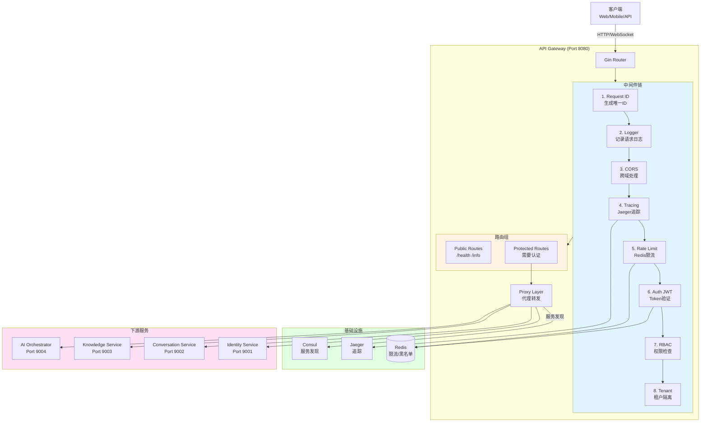

# Phase 1: API Gateway 详细实施方案

---

## 📋 基本信息

- **阶段**: Phase 1
- **时间**: Q1 2025, Week 1-5 (5周)
- **目标**: 实现统一API Gateway服务
- **优先级**: 🔴 P0 - 最高优先级
- **负责人**: 后端开发组
- **状态**: 📋 待开始

---

## 🎯 Phase目标

### 主要目标
实现一个**生产级API Gateway服务**，对齐VoiceHelper的网关能力，提供统一的认证、授权、限流、熔断、服务发现功能。

### 成功标准
1. ✅ Gateway服务正常运行，通过健康检查
2. ✅ JWT认证中间件工作正常，拦截未授权请求
3. ✅ RBAC权限控制准确，支持资源级授权
4. ✅ 分布式限流器有效，防止服务过载
5. ✅ Consul服务发现集成，自动发现后端服务
6. ✅ 单元测试覆盖率 > 70%
7. ✅ 集成测试通过率 100%
8. ✅ P95延迟 < 200ms

---

## 📐 架构设计

### 目标架构



### 目录结构

```
cmd/api-gateway/
├── main.go                     # 入口，初始化与启动
├── config/
│   └── config.go               # 配置结构体
└── internal/
    ├── handler/
    │   ├── proxy_handler.go    # 代理处理器
    │   ├── health_handler.go   # 健康检查
    │   └── info_handler.go     # 服务信息
    ├── middleware/
    │   ├── request_id.go       # 请求ID中间件
    │   ├── logger.go           # 日志中间件
    │   ├── cors.go             # CORS中间件
    │   ├── tracing.go          # 追踪中间件
    │   ├── rate_limit.go       # 限流中间件
    │   ├── auth.go             # JWT认证中间件
    │   ├── rbac.go             # RBAC权限中间件
    │   └── tenant.go           # 租户隔离中间件
    ├── proxy/
    │   ├── proxy.go            # HTTP代理
    │   └── stream_proxy.go     # 流式代理
    ├── discovery/
    │   ├── consul.go           # Consul客户端
    │   └── service_manager.go  # 服务管理器
    └── limiter/
        ├── distributed.go      # 分布式限流器
        └── redis_limiter.go    # Redis限流实现

pkg/
├── middleware/                  # 共享中间件（移动到这里）
│   ├── auth.go
│   ├── rbac.go
│   └── rate_limit.go
└── discovery/                   # 服务发现（新增）
    ├── consul.go
    └── client_manager.go
```

---

## 📅 详细任务分解

### Week 1: 服务框架搭建（3天）

#### Task 1.1: 创建项目结构 (1天)
**负责人**: 后端开发 A

**工作内容**:
```bash
# 创建目录结构
mkdir -p cmd/api-gateway/{config,internal/{handler,middleware,proxy,discovery,limiter}}
mkdir -p pkg/{middleware,discovery}

# 创建基础文件
touch cmd/api-gateway/main.go
touch cmd/api-gateway/config/config.go
touch cmd/api-gateway/internal/handler/{proxy,health,info}_handler.go
```

**配置结构体**:
```go
// cmd/api-gateway/config/config.go
package config

type Config struct {
    Server    ServerConfig
    JWT       JWTConfig
    Redis     RedisConfig
    Consul    ConsulConfig
    Tracing   TracingConfig
    RateLimit RateLimitConfig
}

type ServerConfig struct {
    Host string `mapstructure:"host" default:"0.0.0.0"`
    Port int    `mapstructure:"port" default:"8080"`
}

type JWTConfig struct {
    Secret string        `mapstructure:"secret"`
    Expiry time.Duration `mapstructure:"expiry" default:"2h"`
}

type RedisConfig struct {
    Addr     string `mapstructure:"addr" default:"localhost:6379"`
    Password string `mapstructure:"password"`
    DB       int    `mapstructure:"db" default:"0"`
}

type ConsulConfig struct {
    Addr string `mapstructure:"addr" default:"localhost:8500"`
}

type RateLimitConfig struct {
    Enabled bool `mapstructure:"enabled" default:"true"`
    Rate    int  `mapstructure:"rate" default:"100"`
    Burst   int  `mapstructure:"burst" default:"200"`
}
```

**交付物**:
- ✅ 完整目录结构
- ✅ 基础配置文件
- ✅ main.go骨架

#### Task 1.2: 实现基础路由和健康检查 (1天)
**负责人**: 后端开发 A

**main.go实现**:
```go
// cmd/api-gateway/main.go
package main

import (
    "context"
    "fmt"
    "net/http"
    "os"
    "os/signal"
    "syscall"
    "time"

    "github.com/gin-gonic/gin"
    "github.com/sirupsen/logrus"
    "github.com/spf13/viper"

    "voiceassistant/cmd/api-gateway/config"
    "voiceassistant/cmd/api-gateway/internal/handler"
)

func main() {
    // 1. 加载配置
    cfg := loadConfig()

    // 2. 初始化日志
    initLogger()

    // 3. 创建Gin引擎
    r := gin.New()

    // 4. 注册全局中间件
    r.Use(gin.Recovery())

    // 5. 注册路由
    setupRoutes(r)

    // 6. 启动HTTP服务器
    server := &http.Server{
        Addr:    fmt.Sprintf("%s:%d", cfg.Server.Host, cfg.Server.Port),
        Handler: r,
    }

    go func() {
        logrus.Infof("API Gateway starting on %s", server.Addr)
        if err := server.ListenAndServe(); err != nil && err != http.ErrServerClosed {
            logrus.Fatalf("Failed to start server: %v", err)
        }
    }()

    // 7. 优雅关闭
    quit := make(chan os.Signal, 1)
    signal.Notify(quit, syscall.SIGINT, syscall.SIGTERM)
    <-quit

    logrus.Info("Shutting down server...")
    ctx, cancel := context.WithTimeout(context.Background(), 10*time.Second)
    defer cancel()

    if err := server.Shutdown(ctx); err != nil {
        logrus.Fatalf("Server forced to shutdown: %v", err)
    }

    logrus.Info("Server exited")
}

func setupRoutes(r *gin.Engine) {
    // 健康检查（公开）
    r.GET("/health", handler.HealthCheck)
    r.GET("/ping", handler.Ping)

    // API v1
    v1 := r.Group("/api/v1")
    {
        v1.GET("/info", handler.GetInfo)
    }
}
```

**健康检查处理器**:
```go
// cmd/api-gateway/internal/handler/health_handler.go
package handler

import (
    "net/http"
    "github.com/gin-gonic/gin"
)

func HealthCheck(c *gin.Context) {
    c.JSON(http.StatusOK, gin.H{
        "status":  "healthy",
        "service": "api-gateway",
    })
}

func Ping(c *gin.Context) {
    c.JSON(http.StatusOK, gin.H{"message": "pong"})
}
```

**服务信息处理器**:
```go
// cmd/api-gateway/internal/handler/info_handler.go
package handler

import (
    "net/http"
    "github.com/gin-gonic/gin"
)

func GetInfo(c *gin.Context) {
    c.JSON(http.StatusOK, gin.H{
        "service":     "VoiceAssistant API Gateway",
        "version":     "1.0.0",
        "description": "Unified API Gateway with JWT Auth, RBAC, Rate Limiting",
        "endpoints": gin.H{
            "health":        "/health",
            "info":          "/api/v1/info",
            "conversations": "/api/v1/conversations",
            "knowledge":     "/api/v1/knowledge",
            "ai":            "/api/v1/ai",
        },
    })
}
```

**交付物**:
- ✅ main.go完整实现
- ✅ 健康检查API
- ✅ 服务信息API
- ✅ 优雅关闭机制

#### Task 1.3: 编写Kubernetes部署文件 (1天)
**负责人**: DevOps

**Deployment**:
```yaml
# deployments/k8s/services/api-gateway/deployment.yaml
apiVersion: apps/v1
kind: Deployment
metadata:
  name: api-gateway
  namespace: voiceassistant-prod
  labels:
    app: api-gateway
    version: v1
spec:
  replicas: 3
  selector:
    matchLabels:
      app: api-gateway
  template:
    metadata:
      labels:
        app: api-gateway
        version: v1
    spec:
      containers:
      - name: api-gateway
        image: voiceassistant/api-gateway:v1.0.0
        ports:
        - containerPort: 8080
          name: http
        env:
        - name: SERVER_PORT
          value: "8080"
        - name: CONSUL_ADDR
          value: "consul.voiceassistant-prod.svc.cluster.local:8500"
        - name: REDIS_ADDR
          value: "redis.voiceassistant-prod.svc.cluster.local:6379"
        - name: JWT_SECRET
          valueFrom:
            secretKeyRef:
              name: api-gateway-secrets
              key: jwt-secret
        resources:
          requests:
            memory: "256Mi"
            cpu: "250m"
          limits:
            memory: "512Mi"
            cpu: "500m"
        livenessProbe:
          httpGet:
            path: /health
            port: 8080
          initialDelaySeconds: 10
          periodSeconds: 10
        readinessProbe:
          httpGet:
            path: /health
            port: 8080
          initialDelaySeconds: 5
          periodSeconds: 5
```

**Service**:
```yaml
# deployments/k8s/services/api-gateway/service.yaml
apiVersion: v1
kind: Service
metadata:
  name: api-gateway
  namespace: voiceassistant-prod
  labels:
    app: api-gateway
spec:
  type: ClusterIP
  ports:
  - port: 8080
    targetPort: 8080
    protocol: TCP
    name: http
  selector:
    app: api-gateway
```

**交付物**:
- ✅ Kubernetes Deployment
- ✅ Kubernetes Service
- ✅ ConfigMap（可选）
- ✅ Secret（JWT密钥）

---

### Week 2: 中间件实现（Part 1）（5天）

#### Task 2.1: 实现Request ID中间件 (0.5天)
**负责人**: 后端开发 A

```go
// pkg/middleware/request_id.go
package middleware

import (
    "github.com/gin-gonic/gin"
    "github.com/google/uuid"
)

func RequestID() gin.HandlerFunc {
    return func(c *gin.Context) {
        // 1. 尝试从Header获取请求ID
        requestID := c.GetHeader("X-Request-ID")

        // 2. 如果没有，生成新的UUID
        if requestID == "" {
            requestID = uuid.New().String()
        }

        // 3. 注入到上下文
        c.Set("request_id", requestID)

        // 4. 设置响应Header
        c.Header("X-Request-ID", requestID)

        c.Next()
    }
}
```

#### Task 2.2: 实现Logger中间件 (0.5天)
**负责人**: 后端开发 A

```go
// pkg/middleware/logger.go
package middleware

import (
    "time"
    "github.com/gin-gonic/gin"
    "github.com/sirupsen/logrus"
)

func Logger() gin.HandlerFunc {
    return func(c *gin.Context) {
        start := time.Now()
        path := c.Request.URL.Path
        method := c.Request.Method

        c.Next()

        duration := time.Since(start)
        statusCode := c.Writer.Status()
        requestID := c.GetString("request_id")

        logrus.WithFields(logrus.Fields{
            "request_id": requestID,
            "method":     method,
            "path":       path,
            "status":     statusCode,
            "duration":   duration.Milliseconds(),
            "client_ip":  c.ClientIP(),
        }).Info("Request processed")
    }
}
```

#### Task 2.3: 实现CORS中间件 (0.5天)
**负责人**: 后端开发 A

```go
// pkg/middleware/cors.go
package middleware

import (
    "github.com/gin-gonic/gin"
)

func CORS() gin.HandlerFunc {
    return func(c *gin.Context) {
        c.Writer.Header().Set("Access-Control-Allow-Origin", "*")
        c.Writer.Header().Set("Access-Control-Allow-Credentials", "true")
        c.Writer.Header().Set("Access-Control-Allow-Headers",
            "Content-Type, Authorization, X-Request-ID, X-Trace-ID")
        c.Writer.Header().Set("Access-Control-Allow-Methods",
            "GET, POST, PUT, DELETE, OPTIONS, PATCH")

        if c.Request.Method == "OPTIONS" {
            c.AbortWithStatus(204)
            return
        }

        c.Next()
    }
}
```

#### Task 2.4: 实现Tracing中间件 (1天)
**负责人**: 后端开发 B

```go
// pkg/middleware/tracing.go
package middleware

import (
    "github.com/gin-gonic/gin"
    "go.opentelemetry.io/otel"
    "go.opentelemetry.io/otel/attribute"
    "go.opentelemetry.io/otel/propagation"
)

func TracingMiddleware(serviceName string) gin.HandlerFunc {
    return func(c *gin.Context) {
        tracer := otel.Tracer(serviceName)

        // 1. 从Header提取Trace上下文
        ctx := otel.GetTextMapPropagator().Extract(
            c.Request.Context(),
            propagation.HeaderCarrier(c.Request.Header),
        )

        // 2. 创建Span
        ctx, span := tracer.Start(ctx, c.Request.URL.Path)
        defer span.End()

        // 3. 设置Span属性
        span.SetAttributes(
            attribute.String("http.method", c.Request.Method),
            attribute.String("http.url", c.Request.URL.String()),
            attribute.String("http.user_agent", c.Request.UserAgent()),
        )

        // 4. 注入到上下文
        c.Request = c.Request.WithContext(ctx)

        c.Next()

        // 5. 记录响应状态
        span.SetAttributes(
            attribute.Int("http.status_code", c.Writer.Status()),
        )
    }
}
```

#### Task 2.5: 实现分布式限流器 (2.5天)
**负责人**: 后端开发 B

```go
// pkg/middleware/rate_limit.go
package middleware

import (
    "context"
    "fmt"
    "time"
    "net/http"

    "github.com/gin-gonic/gin"
    "github.com/redis/go-redis/v9"
)

type DistributedLimiter struct {
    client *redis.Client
    rate   int    // 每秒速率
    burst  int    // 突发容量
    prefix string
}

func NewDistributedLimiter(client *redis.Client, rate, burst int) *DistributedLimiter {
    return &DistributedLimiter{
        client: client,
        rate:   rate,
        burst:  burst,
        prefix: "ratelimit",
    }
}

// Allow 检查是否允许请求（令牌桶算法）
func (l *DistributedLimiter) Allow(key string) (bool, error) {
    redisKey := fmt.Sprintf("%s:%s", l.prefix, key)

    // Lua脚本实现令牌桶
    script := `
        local key = KEYS[1]
        local rate = tonumber(ARGV[1])
        local burst = tonumber(ARGV[2])
        local now = tonumber(ARGV[3])

        -- 获取当前令牌数和最后更新时间
        local tokens = tonumber(redis.call('HGET', key, 'tokens') or burst)
        local last_time = tonumber(redis.call('HGET', key, 'last_time') or now)

        -- 计算新增令牌
        local elapsed = now - last_time
        local new_tokens = math.min(burst, tokens + elapsed * rate)

        -- 尝试消费1个令牌
        if new_tokens >= 1 then
            redis.call('HSET', key, 'tokens', new_tokens - 1)
            redis.call('HSET', key, 'last_time', now)
            redis.call('EXPIRE', key, 60)
            return 1
        else
            return 0
        end
    `

    result, err := l.client.Eval(
        context.Background(),
        script,
        []string{redisKey},
        l.rate, l.burst, time.Now().Unix(),
    ).Int()

    return result == 1, err
}

// RateLimitMiddleware 限流中间件
func RateLimitMiddleware(limiter *DistributedLimiter) gin.HandlerFunc {
    return func(c *gin.Context) {
        // 1. 构建限流Key（基于IP或用户ID）
        key := c.ClientIP()
        if userID := c.GetString("user_id"); userID != "" {
            key = userID
        }

        // 2. 检查是否允许
        allowed, err := limiter.Allow(key)
        if err != nil {
            // 限流器故障，放行请求（Fail Open）
            c.Next()
            return
        }

        if !allowed {
            // 429 Too Many Requests
            c.JSON(http.StatusTooManyRequests, gin.H{
                "error":       "Rate limit exceeded",
                "retry_after": 60,
            })
            c.Abort()
            return
        }

        c.Next()
    }
}
```

**交付物**:
- ✅ Request ID中间件
- ✅ Logger中间件
- ✅ CORS中间件
- ✅ Tracing中间件
- ✅ 分布式限流器
- ✅ 单元测试

---

### Week 3: JWT认证与RBAC（5天）

#### Task 3.1: 实现JWT认证中间件 (3天)
**负责人**: 后端开发 A

```go
// pkg/middleware/auth.go
package middleware

import (
    "net/http"
    "strings"
    "time"

    "github.com/gin-gonic/gin"
    "github.com/golang-jwt/jwt/v5"
    "github.com/redis/go-redis/v9"
)

type Claims struct {
    UserID   string   `json:"user_id"`
    TenantID string   `json:"tenant_id"`
    Role     string   `json:"role"`
    Scopes   []string `json:"scopes"`
    jwt.RegisteredClaims
}

type AuthMiddleware struct {
    secretKey      []byte
    redisClient    *redis.Client
    tokenBlacklist map[string]time.Time
}

func NewAuthMiddleware(secret string, redisClient *redis.Client) *AuthMiddleware {
    return &AuthMiddleware{
        secretKey:      []byte(secret),
        redisClient:    redisClient,
        tokenBlacklist: make(map[string]time.Time),
    }
}

func (a *AuthMiddleware) Handle() gin.HandlerFunc {
    return func(c *gin.Context) {
        // 1. 检查是否跳过验证（白名单）
        if a.shouldSkip(c.Request.URL.Path) {
            c.Next()
            return
        }

        // 2. 提取Token（Header/Query/Cookie）
        tokenString := a.extractToken(c)
        if tokenString == "" {
            c.JSON(http.StatusUnauthorized, gin.H{"error": "No token provided"})
            c.Abort()
            return
        }

        // 3. 检查黑名单
        if a.isBlacklisted(tokenString) {
            c.JSON(http.StatusUnauthorized, gin.H{"error": "Token has been revoked"})
            c.Abort()
            return
        }

        // 4. 验证Token
        claims, err := a.validateToken(tokenString)
        if err != nil {
            c.JSON(http.StatusUnauthorized, gin.H{"error": "Invalid token"})
            c.Abort()
            return
        }

        // 5. 检查过期
        if claims.ExpiresAt != nil && claims.ExpiresAt.Before(time.Now()) {
            c.JSON(http.StatusUnauthorized, gin.H{"error": "Token has expired"})
            c.Abort()
            return
        }

        // 6. 注入用户信息到上下文
        c.Set("user_id", claims.UserID)
        c.Set("tenant_id", claims.TenantID)
        c.Set("role", claims.Role)
        c.Set("scopes", claims.Scopes)
        c.Set("token", tokenString)

        // 7. 自动续期（如果Token快过期）
        if a.shouldRenew(claims) {
            newToken, err := a.renewToken(claims)
            if err == nil {
                c.Header("X-New-Token", newToken)
            }
        }

        c.Next()
    }
}

func (a *AuthMiddleware) extractToken(c *gin.Context) string {
    // 1. 从Header获取（标准方式）
    authHeader := c.GetHeader("Authorization")
    if authHeader != "" {
        parts := strings.SplitN(authHeader, " ", 2)
        if len(parts) == 2 && strings.ToLower(parts[0]) == "bearer" {
            return parts[1]
        }
    }

    // 2. 从Query参数获取（用于WebSocket）
    if token := c.Query("token"); token != "" {
        return token
    }

    // 3. 从Cookie获取
    if cookie, err := c.Cookie("access_token"); err == nil && cookie != "" {
        return cookie
    }

    return ""
}

func (a *AuthMiddleware) validateToken(tokenString string) (*Claims, error) {
    token, err := jwt.ParseWithClaims(
        tokenString,
        &Claims{},
        func(token *jwt.Token) (interface{}, error) {
            return a.secretKey, nil
        },
    )
    if err != nil {
        return nil, err
    }

    if claims, ok := token.Claims.(*Claims); ok && token.Valid {
        return claims, nil
    }

    return nil, jwt.ErrSignatureInvalid
}

func (a *AuthMiddleware) shouldSkip(path string) bool {
    // 白名单路径
    whitelist := []string{
        "/health",
        "/ping",
        "/api/v1/info",
        "/api/v1/auth/login",
        "/api/v1/auth/register",
    }

    for _, p := range whitelist {
        if path == p {
            return true
        }
    }
    return false
}

func (a *AuthMiddleware) shouldRenew(claims *Claims) bool {
    if claims.ExpiresAt == nil {
        return false
    }

    timeLeft := time.Until(claims.ExpiresAt.Time)
    return timeLeft < 30*time.Minute && timeLeft > 0
}

func (a *AuthMiddleware) renewToken(oldClaims *Claims) (string, error) {
    newClaims := &Claims{
        UserID:   oldClaims.UserID,
        TenantID: oldClaims.TenantID,
        Role:     oldClaims.Role,
        Scopes:   oldClaims.Scopes,
        RegisteredClaims: jwt.RegisteredClaims{
            ExpiresAt: jwt.NewNumericDate(time.Now().Add(2 * time.Hour)),
            IssuedAt:  jwt.NewNumericDate(time.Now()),
        },
    }

    token := jwt.NewWithClaims(jwt.SigningMethodHS256, newClaims)
    return token.SignedString(a.secretKey)
}

func (a *AuthMiddleware) isBlacklisted(token string) bool {
    // 实际应使用Redis检查
    if expiry, exists := a.tokenBlacklist[token]; exists {
        if time.Now().Before(expiry) {
            return true
        }
        delete(a.tokenBlacklist, token)
    }
    return false
}
```

#### Task 3.2: 实现RBAC权限中间件 (2天)
**负责人**: 后端开发 B

```go
// pkg/middleware/rbac.go
package middleware

import (
    "fmt"
    "net/http"
    "strings"

    "github.com/gin-gonic/gin"
)

type Permission struct {
    Resource string // 资源名称，如: "document", "user", "conversation"
    Action   string // 操作名称，如: "read", "write", "delete"
}

type RBACMiddleware struct {
    rolePermissions map[string][]Permission
}

func NewRBACMiddleware() *RBACMiddleware {
    return &RBACMiddleware{
        rolePermissions: initDefaultPermissions(),
    }
}

func initDefaultPermissions() map[string][]Permission {
    return map[string][]Permission{
        "super_admin": {{Resource: "*", Action: "*"}},
        "admin": {
            {Resource: "document", Action: "*"},
            {Resource: "user", Action: "read"},
            {Resource: "conversation", Action: "*"},
            {Resource: "knowledge", Action: "*"},
        },
        "user": {
            {Resource: "document", Action: "read"},
            {Resource: "conversation", Action: "*"},
            {Resource: "knowledge", Action: "read"},
        },
        "guest": {
            {Resource: "document", Action: "read"},
            {Resource: "conversation", Action: "read"},
        },
    }
}

func (r *RBACMiddleware) Handle() gin.HandlerFunc {
    return func(c *gin.Context) {
        // 1. 获取用户角色（由Auth中间件注入）
        role := c.GetString("role")
        if role == "" {
            c.JSON(http.StatusForbidden, gin.H{
                "error": "No role found in token",
            })
            c.Abort()
            return
        }

        // 2. 获取请求的资源和操作
        resource := r.getResourceFromPath(c.Request.URL.Path)
        action := r.getActionFromMethod(c.Request.Method)

        // 3. 检查权限
        if !r.hasPermission(role, resource, action) {
            c.JSON(http.StatusForbidden, gin.H{
                "error":               "Permission denied",
                "required_permission": fmt.Sprintf("%s:%s", resource, action),
                "your_role":           role,
            })
            c.Abort()
            return
        }

        c.Next()
    }
}

func (r *RBACMiddleware) getResourceFromPath(path string) string {
    // /api/v1/conversations -> conversation
    // /api/v1/knowledge -> knowledge
    parts := strings.Split(path, "/")
    if len(parts) >= 4 {
        return strings.TrimSuffix(parts[3], "s") // 去掉复数
    }
    return ""
}

func (r *RBACMiddleware) getActionFromMethod(method string) string {
    switch method {
    case "GET":
        return "read"
    case "POST":
        return "write"
    case "PUT", "PATCH":
        return "update"
    case "DELETE":
        return "delete"
    default:
        return ""
    }
}

func (r *RBACMiddleware) hasPermission(role, resource, action string) bool {
    permissions, ok := r.rolePermissions[role]
    if !ok {
        return false
    }

    for _, perm := range permissions {
        // 通配符匹配
        if perm.Resource == "*" && perm.Action == "*" {
            return true
        }
        if perm.Resource == resource && (perm.Action == "*" || perm.Action == action) {
            return true
        }
    }

    return false
}
```

**交付物**:
- ✅ JWT认证中间件（含Token提取、验证、续期）
- ✅ RBAC权限中间件（含资源解析、权限检查）
- ✅ 单元测试
- ✅ 集成测试

---

### Week 4: Consul集成与代理转发（5天）

#### Task 4.1: 实现Consul客户端 (2天)
**负责人**: 后端开发 A

```go
// pkg/discovery/consul.go
package discovery

import (
    "fmt"
    "time"

    "github.com/hashicorp/consul/api"
    "github.com/sirupsen/logrus"
)

type ConsulRegistry struct {
    client *api.Client
    logger *logrus.Logger
}

type ServiceRegistration struct {
    ID      string
    Name    string
    Address string
    Port    int
    Tags    []string
    Meta    map[string]string
    Check   *HealthCheck
}

type HealthCheck struct {
    HTTP                           string
    Interval                       time.Duration
    Timeout                        time.Duration
    DeregisterCriticalServiceAfter time.Duration
}

func NewConsulRegistry(addr string, logger *logrus.Logger) (*ConsulRegistry, error) {
    config := api.DefaultConfig()
    config.Address = addr

    client, err := api.NewClient(config)
    if err != nil {
        return nil, fmt.Errorf("failed to create consul client: %w", err)
    }

    return &ConsulRegistry{
        client: client,
        logger: logger,
    }, nil
}

func (r *ConsulRegistry) Register(reg *ServiceRegistration) error {
    registration := &api.AgentServiceRegistration{
        ID:      reg.ID,
        Name:    reg.Name,
        Address: reg.Address,
        Port:    reg.Port,
        Tags:    reg.Tags,
        Meta:    reg.Meta,
    }

    if reg.Check != nil {
        registration.Check = &api.AgentServiceCheck{
            HTTP:                           reg.Check.HTTP,
            Interval:                       reg.Check.Interval.String(),
            Timeout:                        reg.Check.Timeout.String(),
            DeregisterCriticalServiceAfter: reg.Check.DeregisterCriticalServiceAfter.String(),
        }
    }

    if err := r.client.Agent().ServiceRegister(registration); err != nil {
        return fmt.Errorf("failed to register service: %w", err)
    }

    r.logger.WithFields(logrus.Fields{
        "service_id":   reg.ID,
        "service_name": reg.Name,
        "address":      fmt.Sprintf("%s:%d", reg.Address, reg.Port),
    }).Info("Service registered with Consul")

    return nil
}

func (r *ConsulRegistry) Deregister(serviceID string) error {
    if err := r.client.Agent().ServiceDeregister(serviceID); err != nil {
        return fmt.Errorf("failed to deregister service: %w", err)
    }

    r.logger.WithField("service_id", serviceID).Info("Service deregistered from Consul")
    return nil
}

func (r *ConsulRegistry) GetService(serviceName string) ([]*api.ServiceEntry, error) {
    services, _, err := r.client.Health().Service(serviceName, "", true, nil)
    if err != nil {
        return nil, fmt.Errorf("failed to get service: %w", err)
    }

    return services, nil
}
```

#### Task 4.2: 实现服务管理器（负载均衡） (2天)
**负责人**: 后端开发 B

```go
// pkg/discovery/client_manager.go
package discovery

import (
    "fmt"
    "sync"
)

type ServiceClientManager struct {
    registry *ConsulRegistry
    clients  map[string]*ServiceClient
    mu       sync.RWMutex
}

type ServiceClient struct {
    name      string
    instances []*ServiceInstance
    balancer  LoadBalancer
    mu        sync.RWMutex
}

type ServiceInstance struct {
    ID      string
    Address string
    Port    int
    Tags    []string
}

type LoadBalancer interface {
    Next(instances []*ServiceInstance) (*ServiceInstance, error)
}

// RoundRobinBalancer 轮询负载均衡
type RoundRobinBalancer struct {
    current int
    mu      sync.Mutex
}

func NewRoundRobinBalancer() *RoundRobinBalancer {
    return &RoundRobinBalancer{current: 0}
}

func (b *RoundRobinBalancer) Next(instances []*ServiceInstance) (*ServiceInstance, error) {
    b.mu.Lock()
    defer b.mu.Unlock()

    if len(instances) == 0 {
        return nil, fmt.Errorf("no available instances")
    }

    instance := instances[b.current%len(instances)]
    b.current++
    return instance, nil
}

func NewServiceClientManager(registry *ConsulRegistry) *ServiceClientManager {
    return &ServiceClientManager{
        registry: registry,
        clients:  make(map[string]*ServiceClient),
    }
}

func (m *ServiceClientManager) GetClient(serviceName string, balancer LoadBalancer) (*ServiceClient, error) {
    m.mu.Lock()
    defer m.mu.Unlock()

    // 如果已存在，直接返回
    if client, ok := m.clients[serviceName]; ok {
        return client, nil
    }

    // 创建新的ServiceClient
    client := &ServiceClient{
        name:     serviceName,
        balancer: balancer,
    }

    // 获取服务实例
    if err := client.Refresh(m.registry); err != nil {
        return nil, err
    }

    m.clients[serviceName] = client
    return client, nil
}

func (c *ServiceClient) Refresh(registry *ConsulRegistry) error {
    entries, err := registry.GetService(c.name)
    if err != nil {
        return err
    }

    instances := make([]*ServiceInstance, 0, len(entries))
    for _, entry := range entries {
        instances = append(instances, &ServiceInstance{
            ID:      entry.Service.ID,
            Address: entry.Service.Address,
            Port:    entry.Service.Port,
            Tags:    entry.Service.Tags,
        })
    }

    c.mu.Lock()
    c.instances = instances
    c.mu.Unlock()

    return nil
}

func (c *ServiceClient) GetInstance() (*ServiceInstance, error) {
    c.mu.RLock()
    instances := c.instances
    c.mu.RUnlock()

    return c.balancer.Next(instances)
}

func (c *ServiceClient) GetAddress() string {
    instance, err := c.GetInstance()
    if err != nil {
        return ""
    }
    return fmt.Sprintf("http://%s:%d", instance.Address, instance.Port)
}

func (c *ServiceClient) GetInstanceCount() int {
    c.mu.RLock()
    defer c.mu.RUnlock()
    return len(c.instances)
}
```

#### Task 4.3: 实现HTTP代理转发 (1天)
**负责人**: 后端开发 A

```go
// cmd/api-gateway/internal/proxy/proxy.go
package proxy

import (
    "bytes"
    "fmt"
    "io"
    "net/http"
    "time"

    "github.com/gin-gonic/gin"
)

type ProxyHandler struct {
    serviceManager *discovery.ServiceClientManager
    httpClient     *http.Client
}

func NewProxyHandler(serviceManager *discovery.ServiceClientManager) *ProxyHandler {
    return &ProxyHandler{
        serviceManager: serviceManager,
        httpClient: &http.Client{
            Timeout: 30 * time.Second,
        },
    }
}

func (h *ProxyHandler) ProxyToService(serviceName string) gin.HandlerFunc {
    return func(c *gin.Context) {
        // 1. 获取服务客户端
        client, err := h.serviceManager.GetClient(
            serviceName,
            discovery.NewRoundRobinBalancer(),
        )
        if err != nil {
            c.JSON(http.StatusServiceUnavailable, gin.H{
                "error": fmt.Sprintf("Service %s not available", serviceName),
            })
            return
        }

        // 2. 获取服务实例地址
        serviceURL := client.GetAddress()
        if serviceURL == "" {
            c.JSON(http.StatusServiceUnavailable, gin.H{
                "error": "No healthy instances available",
            })
            return
        }

        // 3. 读取请求体
        body, err := io.ReadAll(c.Request.Body)
        if err != nil {
            c.JSON(http.StatusBadRequest, gin.H{"error": "Failed to read request body"})
            return
        }

        // 4. 构建目标URL
        targetURL := fmt.Sprintf("%s%s", serviceURL, c.Request.URL.Path)
        if c.Request.URL.RawQuery != "" {
            targetURL = fmt.Sprintf("%s?%s", targetURL, c.Request.URL.RawQuery)
        }

        // 5. 创建新请求
        req, err := http.NewRequest(c.Request.Method, targetURL, bytes.NewReader(body))
        if err != nil {
            c.JSON(http.StatusInternalServerError, gin.H{"error": "Failed to create request"})
            return
        }

        // 6. 复制Header
        for k, v := range c.Request.Header {
            req.Header[k] = v
        }

        // 7. 添加认证信息（从上下文）
        if token := c.GetString("token"); token != "" {
            req.Header.Set("Authorization", "Bearer "+token)
        }

        // 8. 添加请求ID
        if requestID := c.GetString("request_id"); requestID != "" {
            req.Header.Set("X-Request-ID", requestID)
        }

        // 9. 发送请求
        resp, err := h.httpClient.Do(req)
        if err != nil {
            c.JSON(http.StatusBadGateway, gin.H{"error": "Failed to proxy request"})
            return
        }
        defer resp.Body.Close()

        // 10. 读取响应
        respBody, err := io.ReadAll(resp.Body)
        if err != nil {
            c.JSON(http.StatusInternalServerError, gin.H{"error": "Failed to read response"})
            return
        }

        // 11. 转发响应
        c.Data(resp.StatusCode, resp.Header.Get("Content-Type"), respBody)
    }
}
```

**交付物**:
- ✅ Consul客户端实现
- ✅ 服务管理器（含负载均衡）
- ✅ HTTP代理转发
- ✅ 单元测试

---

### Week 5: 测试、文档与部署（5天）

#### Task 5.1: 编写单元测试 (2天)
**负责人**: 后端开发 A + B

**测试覆盖**:
- ✅ JWT认证中间件测试
- ✅ RBAC权限中间件测试
- ✅ 分布式限流器测试
- ✅ Consul客户端测试
- ✅ 负载均衡器测试
- ✅ HTTP代理测试

**示例测试**:
```go
// pkg/middleware/auth_test.go
package middleware_test

import (
    "net/http"
    "net/http/httptest"
    "testing"
    "time"

    "github.com/gin-gonic/gin"
    "github.com/golang-jwt/jwt/v5"
    "github.com/stretchr/testify/assert"

    "voiceassistant/pkg/middleware"
)

func TestAuthMiddleware_ValidToken(t *testing.T) {
    gin.SetMode(gin.TestMode)

    // 创建测试Token
    secret := "test-secret"
    claims := &middleware.Claims{
        UserID:   "user123",
        TenantID: "tenant456",
        Role:     "user",
        Scopes:   []string{"read", "write"},
        RegisteredClaims: jwt.RegisteredClaims{
            ExpiresAt: jwt.NewNumericDate(time.Now().Add(2 * time.Hour)),
            IssuedAt:  jwt.NewNumericDate(time.Now()),
        },
    }

    token := jwt.NewWithClaims(jwt.SigningMethodHS256, claims)
    tokenString, _ := token.SignedString([]byte(secret))

    // 创建路由
    r := gin.New()
    auth := middleware.NewAuthMiddleware(secret, nil)
    r.GET("/test", auth.Handle(), func(c *gin.Context) {
        c.JSON(200, gin.H{
            "user_id": c.GetString("user_id"),
            "role":    c.GetString("role"),
        })
    })

    // 发送请求
    w := httptest.NewRecorder()
    req, _ := http.NewRequest("GET", "/test", nil)
    req.Header.Set("Authorization", "Bearer "+tokenString)
    r.ServeHTTP(w, req)

    // 断言
    assert.Equal(t, 200, w.Code)
    assert.Contains(t, w.Body.String(), "user123")
}

func TestAuthMiddleware_InvalidToken(t *testing.T) {
    gin.SetMode(gin.TestMode)

    // 创建路由
    r := gin.New()
    auth := middleware.NewAuthMiddleware("test-secret", nil)
    r.GET("/test", auth.Handle(), func(c *gin.Context) {
        c.JSON(200, gin.H{"message": "ok"})
    })

    // 发送请求（无效Token）
    w := httptest.NewRecorder()
    req, _ := http.NewRequest("GET", "/test", nil)
    req.Header.Set("Authorization", "Bearer invalid-token")
    r.ServeHTTP(w, req)

    // 断言
    assert.Equal(t, 401, w.Code)
    assert.Contains(t, w.Body.String(), "Invalid token")
}
```

#### Task 5.2: 编写集成测试 (2天)
**负责人**: 测试工程师

**集成测试场景**:
1. ✅ 完整请求流程（Request ID → Auth → RBAC → Proxy）
2. ✅ 限流器触发（发送超过限制的请求）
3. ✅ Token自动续期
4. ✅ 服务发现与负载均衡
5. ✅ 权限拒绝场景

#### Task 5.3: 编写文档 (1天)
**负责人**: 后端开发 A

**文档内容**:
- ✅ API Gateway使用文档
- ✅ 中间件配置说明
- ✅ Consul集成指南
- ✅ 部署文档
- ✅ 故障排查手册

**README.md**:
```markdown
# API Gateway

## 概述

API Gateway是VoiceAssistant的统一入口，提供：
- ✅ JWT认证
- ✅ RBAC权限控制
- ✅ 分布式限流
- ✅ 服务发现与负载均衡
- ✅ 请求追踪
- ✅ 自动Token续期

## 快速开始

### 配置

编辑`configs/api-gateway.yaml`:

```yaml
server:
  host: "0.0.0.0"
  port: 8080

jwt:
  secret: "your-secret-key"
  expiry: 2h

redis:
  addr: "redis:6379"
  password: ""
  db: 0

consul:
  addr: "consul:8500"

rate_limit:
  enabled: true
  rate: 100  # 每秒100请求
  burst: 200 # 突发200请求
```

### 运行

```bash
cd cmd/api-gateway
go run main.go
```

### 测试

```bash
# 健康检查
curl http://localhost:8080/health

# 获取服务信息
curl http://localhost:8080/api/v1/info

# 测试认证（需要Token）
curl -H "Authorization: Bearer YOUR_TOKEN" \
     http://localhost:8080/api/v1/conversations
```

## 中间件说明

### 1. Request ID
为每个请求生成唯一ID，用于追踪。

### 2. Logger
记录请求日志（method, path, status, duration）。

### 3. CORS
处理跨域请求。

### 4. Tracing
Jaeger分布式追踪集成。

### 5. Rate Limit
Redis分布式限流器，防止服务过载。

### 6. Auth
JWT认证，验证Token有效性。

### 7. RBAC
基于角色的权限控制。

### 8. Tenant
多租户隔离。

## API列表

| 端点 | 方法 | 认证 | 说明 |
|-----|------|------|------|
| `/health` | GET | ❌ | 健康检查 |
| `/api/v1/info` | GET | ❌ | 服务信息 |
| `/api/v1/*` | * | ✅ | 需要认证 |

## 部署

见`deployments/k8s/services/api-gateway/README.md`

## 故障排查

### Token验证失败
检查JWT_SECRET是否正确，Token是否过期。

### 限流触发
检查Redis连接，调整rate_limit配置。

### 服务发现失败
检查Consul连接，确保后端服务已注册。
```

---

## 📊 验收标准

### 功能验收

| 功能 | 验收标准 | 验收方法 |
|-----|---------|---------|
| 健康检查 | 返回200状态 | `curl /health` |
| JWT认证 | 拦截未授权请求 | 无Token访问保护路由 |
| Token自动续期 | Header返回新Token | Token快过期时访问 |
| RBAC | 拒绝无权限请求 | guest角色访问admin资源 |
| 限流 | 429错误 | 发送超过限制的请求 |
| 服务发现 | 正确路由到后端 | 访问/api/v1/conversations |
| 负载均衡 | 轮询多个实例 | 查看日志，验证请求分布 |

### 性能验收

| 指标 | 目标 | 实际 | 验收方法 |
|-----|------|------|---------|
| P50延迟 | <50ms | TBD | 压测 |
| P95延迟 | <200ms | TBD | 压测 |
| P99延迟 | <500ms | TBD | 压测 |
| QPS | >1000 | TBD | 压测 |
| CPU使用率 | <50% | TBD | 监控 |
| 内存使用 | <512MB | TBD | 监控 |

### 质量验收

| 指标 | 目标 | 实际 | 验收方法 |
|-----|------|------|---------|
| 单元测试覆盖率 | >70% | TBD | `go test -cover` |
| 集成测试通过率 | 100% | TBD | CI/CD |
| 代码评审通过 | 100% | TBD | Pull Request |
| 文档完整性 | 100% | TBD | 人工检查 |

---

## ⚠️ 风险与缓解

### 技术风险

| 风险 | 影响 | 概率 | 缓解措施 | 负责人 |
|-----|------|------|---------|--------|
| Consul集成复杂 | 高 | 中 | 参考VoiceHelper代码，POC验证 | 开发A |
| Redis单点故障 | 高 | 低 | Redis Sentinel，主从复制 | DevOps |
| 性能不达标 | 中 | 中 | 提前压测，优化瓶颈 | 开发A+B |
| JWT密钥泄露 | 高 | 低 | 使用Kubernetes Secret，定期轮换 | DevOps |

### 进度风险

| 风险 | 影响 | 概率 | 缓解措施 | 负责人 |
|-----|------|------|---------|--------|
| 中间件开发延期 | 高 | 中 | 提前1周启动，预留缓冲 | 项目经理 |
| 测试资源不足 | 中 | 中 | 自动化测试，CI/CD | 测试组长 |
| Consul环境问题 | 中 | 低 | 提前准备测试环境 | DevOps |

---

## 📈 后续优化计划

### Phase 1.5 - 增强功能（可选）

1. **熔断器集成** (3天)
   - 实现熔断器中间件
   - 集成hystrix-go或自研

2. **API版本管理** (2天)
   - 支持多版本API共存
   - 版本路由规则

3. **WebSocket代理** (3天)
   - 实现WebSocket升级
   - 双向消息转发

4. **监控面板** (2天)
   - Grafana仪表盘
   - 自定义指标

---

## 📝 变更日志

| 日期 | 版本 | 变更内容 | 负责人 |
|-----|------|---------|--------|
| 2025-01-27 | v1.0 | 初始版本 | 后端组 |

---

## 📖 参考文档

- [VoiceHelper-01-APIGateway.md](../VoiceHelper-01-APIGateway.md)
- [Consul Documentation](https://www.consul.io/docs)
- [Gin Middleware Guide](https://gin-gonic.com/docs/examples/custom-middleware/)
- [JWT Best Practices](https://datatracker.ietf.org/doc/html/rfc8725)

---

**文档版本**: v1.0
**最后更新**: 2025-01-27
**维护者**: VoiceAssistant后端团队
