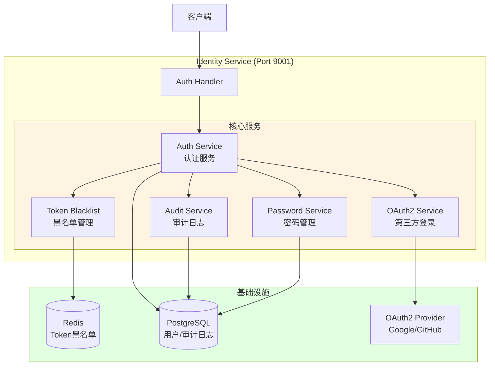
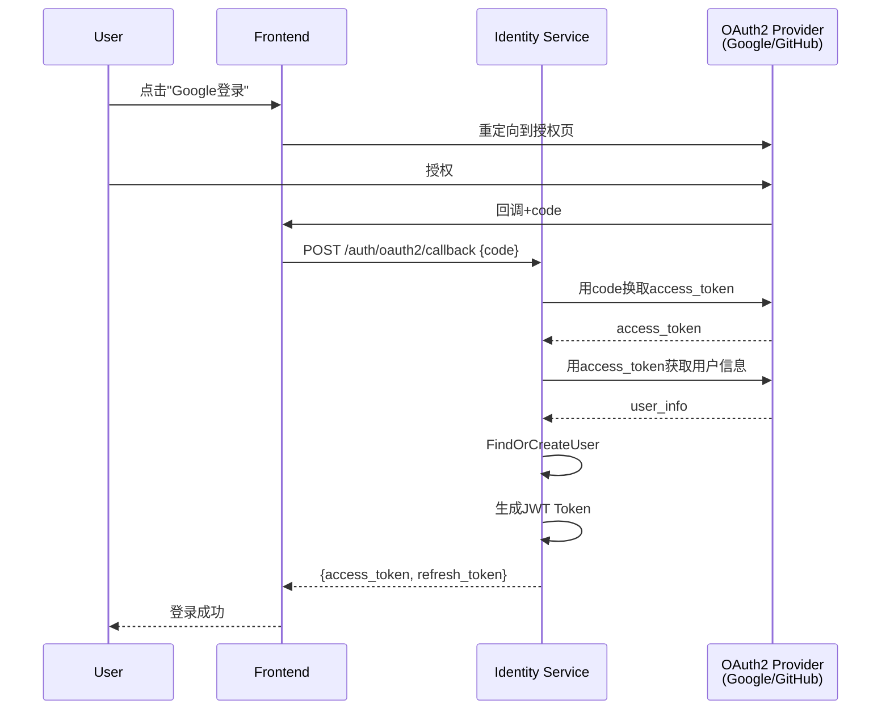

# Phase 2: 认证授权增强 - 详细实施方案

---

## 📋 基本信息

- **阶段**: Phase 2
- **时间**: Q1 2025, Week 6-8 (3周)
- **目标**: 增强Token管理和安全性
- **优先级**: 🟡 P1 - 中优先级
- **前置依赖**: Phase 1 - API Gateway完成
- **负责人**: 后端开发组
- **状态**: 📋 待开始

---

## 🎯 Phase目标

### 主要目标
对齐VoiceHelper的Auth Service能力，实现企业级认证授权系统，包括：
1. Token黑名单机制（Redis）
2. Token自动续期
3. OAuth2/SSO集成
4. 审计日志系统
5. 密码策略增强

### 成功标准
1. ✅ Token黑名单正常工作，撤销Token后无法使用
2. ✅ Token自动续期，Response Header返回新Token
3. ✅ OAuth2登录（Google/GitHub）正常工作
4. ✅ 审计日志记录所有关键操作
5. ✅ 密码策略生效，弱密码被拒绝
6. ✅ 单元测试覆盖率 > 70%
7. ✅ 集成测试通过率 100%

---

## 📐 架构设计

### 目标架构



### 增强的Identity Service结构

```
cmd/identity-service/
├── main.go
├── config/
│   └── config.go
└── internal/
    ├── handler/
    │   ├── auth_handler.go           # 现有
    │   ├── oauth2_handler.go          # 新增 ⭐
    │   └── password_handler.go        # 新增 ⭐
    ├── service/
    │   ├── auth_service.go            # 现有
    │   ├── token_blacklist.go         # 新增 ⭐
    │   ├── oauth2_service.go          # 新增 ⭐
    │   ├── audit_service.go           # 新增 ⭐
    │   └── password_service.go        # 新增 ⭐
    ├── repository/
    │   ├── user_repository.go         # 现有
    │   ├── audit_repository.go        # 新增 ⭐
    │   ├── password_history_repo.go   # 新增 ⭐
    │   └── oauth2_binding_repo.go     # 新增 ⭐
    └── model/
        ├── user.go                    # 现有
        ├── audit_log.go               # 新增 ⭐
        ├── password_history.go        # 新增 ⭐
        └── oauth2_binding.go          # 新增 ⭐
```

---

## 📅 详细任务分解

### Week 1: Token黑名单与自动续期（5天）

#### Task 1.1: 实现Token黑名单服务 (3天)

**目标**: 实现Redis Token黑名单机制

**数据结构设计**:
```go
// cmd/identity-service/internal/service/token_blacklist.go
package service

import (
    "context"
    "fmt"
    "strconv"
    "time"

    "github.com/redis/go-redis/v9"
)

type TokenBlacklist struct {
    redis *redis.Client
}

func NewTokenBlacklist(redis *redis.Client) *TokenBlacklist {
    return &TokenBlacklist{redis: redis}
}

// RevokeToken 撤销单个Token
// 使用Redis存储，Key为"blacklist:token:{tokenID}"
// TTL设置为Token的剩余有效期
func (b *TokenBlacklist) RevokeToken(ctx context.Context, tokenID string, expiry time.Time) error {
    ttl := time.Until(expiry)
    if ttl <= 0 {
        return nil // Token已过期，无需撤销
    }

    key := fmt.Sprintf("blacklist:token:%s", tokenID)
    return b.redis.Set(ctx, key, "1", ttl).Err()
}

// RevokeUserTokens 撤销用户所有Token
// 记录撤销时间，之前签发的所有token都无效
// 用于：修改密码、账号被封禁等场景
func (b *TokenBlacklist) RevokeUserTokens(ctx context.Context, userID string) error {
    key := fmt.Sprintf("blacklist:user:%s", userID)
    // 记录撤销时间，7天后自动过期（Refresh Token最长有效期）
    return b.redis.Set(ctx, key, time.Now().Unix(), 7*24*time.Hour).Err()
}

// IsBlacklisted 检查Token是否被单独撤销
func (b *TokenBlacklist) IsBlacklisted(ctx context.Context, tokenID string) (bool, error) {
    key := fmt.Sprintf("blacklist:token:%s", tokenID)
    result, err := b.redis.Exists(ctx, key).Result()
    if err != nil {
        return false, err
    }
    return result > 0, nil
}

// IsUserRevoked 检查用户Token是否被全局撤销
// 如果Token的签发时间早于撤销时间，则视为无效
func (b *TokenBlacklist) IsUserRevoked(ctx context.Context, userID string, issuedAt time.Time) (bool, error) {
    key := fmt.Sprintf("blacklist:user:%s", userID)
    revokeTimeStr, err := b.redis.Get(ctx, key).Result()
    if err == redis.Nil {
        return false, nil // 用户未被全局撤销
    }
    if err != nil {
        return false, err
    }

    revokeTime, _ := strconv.ParseInt(revokeTimeStr, 10, 64)
    return issuedAt.Before(time.Unix(revokeTime, 0)), nil
}

// CleanExpiredBlacklist 清理过期的黑名单记录（定时任务）
func (b *TokenBlacklist) CleanExpiredBlacklist(ctx context.Context) error {
    // Redis自动过期，无需手动清理
    // 此方法预留用于统计或其他用途
    return nil
}
```

**集成到AuthService**:
```go
// cmd/identity-service/internal/service/auth_service.go
type AuthService struct {
    userRepo        *repository.UserRepository
    tokenBlacklist  *TokenBlacklist  // 新增
    jwtSecret       []byte
    accessExpiry    time.Duration
    refreshExpiry   time.Duration
}

func NewAuthService(
    userRepo *repository.UserRepository,
    tokenBlacklist *TokenBlacklist,  // 新增参数
    jwtSecret string,
) *AuthService {
    return &AuthService{
        userRepo:       userRepo,
        tokenBlacklist: tokenBlacklist,
        jwtSecret:      []byte(jwtSecret),
        accessExpiry:   15 * time.Minute,
        refreshExpiry:  7 * 24 * time.Hour,
    }
}

// ValidateToken 验证Token（增加黑名单检查）
func (s *AuthService) ValidateToken(ctx context.Context, tokenString string) (*model.JWTClaims, error) {
    token, err := jwt.Parse(tokenString, func(token *jwt.Token) (interface{}, error) {
        if _, ok := token.Method.(*jwt.SigningMethodHMAC); !ok {
            return nil, errors.New("invalid signing method")
        }
        return s.jwtSecret, nil
    })
    if err != nil {
        return nil, err
    }

    if claims, ok := token.Claims.(jwt.MapClaims); ok && token.Valid {
        tokenID := claims["jti"].(string)

        // 检查Token是否被单独撤销
        if s.tokenBlacklist != nil {
            if isBlacklisted, _ := s.tokenBlacklist.IsBlacklisted(ctx, tokenID); isBlacklisted {
                return nil, errors.New("token has been revoked")
            }

            // 检查用户Token是否被全局撤销
            userID := claims["user_id"].(string)
            iat := time.Unix(int64(claims["iat"].(float64)), 0)
            if isRevoked, _ := s.tokenBlacklist.IsUserRevoked(ctx, userID, iat); isRevoked {
                return nil, errors.New("user tokens have been revoked")
            }
        }

        return &model.JWTClaims{
            TokenID:  tokenID,
            UserID:   claims["user_id"].(string),
            Username: claims["username"].(string),
            TenantID: claims["tenant_id"].(string),
            Role:     claims["role"].(string),
            Type:     claims["type"].(string),
        }, nil
    }

    return nil, jwt.ErrSignatureInvalid
}
```

**新增API端点**:
```go
// cmd/identity-service/internal/handler/auth_handler.go

// Logout 登出（撤销Token）
func (h *AuthHandler) Logout(c *gin.Context) {
    var req struct {
        Token string `json:"token" binding:"required"`
    }

    if err := c.ShouldBindJSON(&req); err != nil {
        c.JSON(400, gin.H{"code": 400, "message": "Invalid request"})
        return
    }

    // 解析Token获取TokenID和过期时间
    claims, err := h.authService.ValidateToken(c.Request.Context(), req.Token)
    if err != nil {
        c.JSON(401, gin.H{"code": 401, "message": "Invalid token"})
        return
    }

    // 撤销Token
    if err := h.authService.RevokeToken(c.Request.Context(), claims.TokenID, claims.ExpiresAt); err != nil {
        c.JSON(500, gin.H{"code": 500, "message": "Failed to revoke token"})
        return
    }

    c.JSON(200, gin.H{
        "code":    200,
        "message": "Logout successful",
    })
}

// ChangePassword 修改密码（撤销用户所有Token）
func (h *AuthHandler) ChangePassword(c *gin.Context) {
    var req struct {
        OldPassword string `json:"old_password" binding:"required"`
        NewPassword string `json:"new_password" binding:"required"`
    }

    if err := c.ShouldBindJSON(&req); err != nil {
        c.JSON(400, gin.H{"code": 400, "message": "Invalid request"})
        return
    }

    userID := c.GetString("user_id")

    // 验证旧密码
    if err := h.authService.VerifyPassword(c.Request.Context(), userID, req.OldPassword); err != nil {
        c.JSON(401, gin.H{"code": 401, "message": "Old password incorrect"})
        return
    }

    // 修改密码
    if err := h.authService.UpdatePassword(c.Request.Context(), userID, req.NewPassword); err != nil {
        c.JSON(500, gin.H{"code": 500, "message": "Failed to change password"})
        return
    }

    // 撤销用户所有Token
    if err := h.authService.RevokeUserTokens(c.Request.Context(), userID); err != nil {
        c.JSON(500, gin.H{"code": 500, "message": "Failed to revoke tokens"})
        return
    }

    c.JSON(200, gin.H{
        "code":    200,
        "message": "Password changed successfully. Please login again.",
    })
}
```

**单元测试**:
```go
// cmd/identity-service/internal/service/token_blacklist_test.go
package service_test

import (
    "context"
    "testing"
    "time"

    "github.com/alicebob/miniredis/v2"
    "github.com/redis/go-redis/v9"
    "github.com/stretchr/testify/assert"

    "voiceassistant/cmd/identity-service/internal/service"
)

func TestTokenBlacklist_RevokeToken(t *testing.T) {
    // 创建Mock Redis
    mr, _ := miniredis.Run()
    defer mr.Close()

    client := redis.NewClient(&redis.Options{
        Addr: mr.Addr(),
    })

    blacklist := service.NewTokenBlacklist(client)
    ctx := context.Background()

    // 测试撤销Token
    tokenID := "test-token-id"
    expiry := time.Now().Add(1 * time.Hour)

    err := blacklist.RevokeToken(ctx, tokenID, expiry)
    assert.NoError(t, err)

    // 验证Token已被撤销
    isBlacklisted, err := blacklist.IsBlacklisted(ctx, tokenID)
    assert.NoError(t, err)
    assert.True(t, isBlacklisted)
}

func TestTokenBlacklist_RevokeUserTokens(t *testing.T) {
    mr, _ := miniredis.Run()
    defer mr.Close()

    client := redis.NewClient(&redis.Options{
        Addr: mr.Addr(),
    })

    blacklist := service.NewTokenBlacklist(client)
    ctx := context.Background()

    userID := "user123"

    // 撤销用户所有Token
    err := blacklist.RevokeUserTokens(ctx, userID)
    assert.NoError(t, err)

    // 验证：签发时间早于撤销时间的Token无效
    oldToken := time.Now().Add(-1 * time.Hour)
    isRevoked, err := blacklist.IsUserRevoked(ctx, userID, oldToken)
    assert.NoError(t, err)
    assert.True(t, isRevoked)

    // 验证：签发时间晚于撤销时间的Token有效
    newToken := time.Now().Add(1 * time.Hour)
    isRevoked, err = blacklist.IsUserRevoked(ctx, userID, newToken)
    assert.NoError(t, err)
    assert.False(t, isRevoked)
}
```

**交付物**:
- ✅ cmd/identity-service/internal/service/token_blacklist.go
- ✅ 集成到AuthService的ValidateToken
- ✅ POST /api/v1/auth/logout API
- ✅ POST /api/v1/auth/change-password API
- ✅ 单元测试（覆盖率>80%）

#### Task 1.2: 实现Token自动续期 (2天)

**目标**: 实现Token自动续期机制

**续期策略**:
- 当Access Token剩余时间 < 30分钟时触发续期
- 续期只更新ExpiresAt和IssuedAt，其他Claims保持不变
- 新Token通过Response Header返回：`X-New-Token`

**实现代码**:
```go
// pkg/middleware/auth.go（在Phase 1基础上增强）

func (a *AuthMiddleware) Handle() gin.HandlerFunc {
    return func(c *gin.Context) {
        // ... 现有的认证逻辑 ...

        // 6. 注入用户信息到上下文
        c.Set("user_id", claims.UserID)
        c.Set("tenant_id", claims.TenantID)
        c.Set("role", claims.Role)
        c.Set("token", tokenString)

        // 7. 自动续期（新增）
        if a.shouldRenew(claims) {
            newToken, err := a.renewToken(claims)
            if err == nil {
                c.Header("X-New-Token", newToken)
                logrus.WithFields(logrus.Fields{
                    "user_id":   claims.UserID,
                    "token_id":  claims.TokenID,
                    "time_left": time.Until(claims.ExpiresAt.Time).Minutes(),
                }).Info("Token auto-renewed")
            }
        }

        c.Next()
    }
}

// shouldRenew 判断是否需要续期
func (a *AuthMiddleware) shouldRenew(claims *Claims) bool {
    if claims.ExpiresAt == nil {
        return false
    }

    // 只对Access Token续期，Refresh Token不续期
    if claims.Type != "access" {
        return false
    }

    timeLeft := time.Until(claims.ExpiresAt.Time)
    // 剩余时间 < 30分钟 且 > 0 时续期
    return timeLeft < 30*time.Minute && timeLeft > 0
}

// renewToken 生成新Token
func (a *AuthMiddleware) renewToken(oldClaims *Claims) (string, error) {
    // 生成新的TokenID和时间戳
    newTokenID := uuid.New().String()
    now := time.Now()

    newClaims := &Claims{
        UserID:   oldClaims.UserID,
        TenantID: oldClaims.TenantID,
        Role:     oldClaims.Role,
        Scopes:   oldClaims.Scopes,
        RegisteredClaims: jwt.RegisteredClaims{
            ID:        newTokenID,  // 新的Token ID
            ExpiresAt: jwt.NewNumericDate(now.Add(2 * time.Hour)),
            IssuedAt:  jwt.NewNumericDate(now),
        },
    }

    token := jwt.NewWithClaims(jwt.SigningMethodHS256, newClaims)
    return token.SignedString(a.secretKey)
}
```

**客户端处理指南**:
```javascript
// 前端示例代码
async function apiRequest(url, options = {}) {
    const response = await fetch(url, {
        ...options,
        headers: {
            'Authorization': `Bearer ${getAccessToken()}`,
            ...options.headers,
        },
    });

    // 检查是否有新Token
    const newToken = response.headers.get('X-New-Token');
    if (newToken) {
        console.log('Token auto-renewed');
        setAccessToken(newToken);
    }

    return response;
}
```

**监控指标**:
```go
// 记录续期次数
var tokenRenewalCounter = promauto.NewCounter(prometheus.CounterOpts{
    Name: "token_renewal_total",
    Help: "Total number of token renewals",
})

// 在renewToken成功后调用
tokenRenewalCounter.Inc()
```

**交付物**:
- ✅ Token续期逻辑实现
- ✅ Response Header添加X-New-Token
- ✅ 客户端处理文档
- ✅ Prometheus监控指标
- ✅ 单元测试

---

### Week 2: OAuth2/SSO集成（5天）

#### Task 2.1: OAuth2框架设计 (1天)

**目标**: 设计OAuth2集成架构

**支持的Provider**:
1. Google OAuth2
2. GitHub OAuth2
3. WeChat OAuth2 (可选)

**OAuth2流程**:


**数据模型**:
```go
// cmd/identity-service/internal/model/oauth2_binding.go
package model

import "time"

// OAuth2Binding OAuth2账号绑定
type OAuth2Binding struct {
    ID           uint      `gorm:"primaryKey"`
    UserID       string    `gorm:"index;not null"`
    Provider     string    `gorm:"index;not null"` // google, github, wechat
    ProviderID   string    `gorm:"index;not null"` // Provider侧的用户ID
    Email        string    `gorm:"index"`
    AccessToken  string    `gorm:"type:text"`      // 加密存储
    RefreshToken string    `gorm:"type:text"`      // 加密存储
    ExpiresAt    time.Time
    CreatedAt    time.Time
    UpdatedAt    time.Time
}

// OAuth2User OAuth2用户信息
type OAuth2User struct {
    Provider   string
    ProviderID string
    Email      string
    Name       string
    Avatar     string
}
```

**数据库表**:
```sql
CREATE TABLE oauth2_bindings (
    id            SERIAL PRIMARY KEY,
    user_id       VARCHAR(100) NOT NULL,
    provider      VARCHAR(50) NOT NULL,
    provider_id   VARCHAR(200) NOT NULL,
    email         VARCHAR(255),
    access_token  TEXT,
    refresh_token TEXT,
    expires_at    TIMESTAMP,
    created_at    TIMESTAMP DEFAULT CURRENT_TIMESTAMP,
    updated_at    TIMESTAMP DEFAULT CURRENT_TIMESTAMP,

    UNIQUE(provider, provider_id),
    INDEX idx_user_id (user_id),
    INDEX idx_provider_id (provider, provider_id)
);
```

#### Task 2.2: 实现OAuth2 Service (2天)

**OAuth2配置**:
```yaml
# configs/identity-service.yaml
oauth2:
  google:
    enabled: true
    client_id: "your-client-id.apps.googleusercontent.com"
    client_secret: "your-client-secret"
    redirect_url: "http://localhost:3000/auth/google/callback"

  github:
    enabled: true
    client_id: "your-github-client-id"
    client_secret: "your-github-client-secret"
    redirect_url: "http://localhost:3000/auth/github/callback"

  wechat:
    enabled: false
    app_id: "your-wechat-app-id"
    app_secret: "your-wechat-app-secret"
    redirect_url: "http://localhost:3000/auth/wechat/callback"
```

**OAuth2Service实现**:
```go
// cmd/identity-service/internal/service/oauth2_service.go
package service

import (
    "context"
    "encoding/json"
    "fmt"
    "io"
    "net/http"
    "net/url"

    "voiceassistant/cmd/identity-service/internal/model"
)

type OAuth2Service struct {
    httpClient *http.Client
    config     *OAuth2Config
}

type OAuth2Config struct {
    Google *ProviderConfig
    GitHub *ProviderConfig
    WeChat *ProviderConfig
}

type ProviderConfig struct {
    Enabled      bool
    ClientID     string
    ClientSecret string
    RedirectURL  string
}

func NewOAuth2Service(config *OAuth2Config) *OAuth2Service {
    return &OAuth2Service{
        httpClient: &http.Client{},
        config:     config,
    }
}

// VerifyGoogleToken 验证Google OAuth2 Token并获取用户信息
func (s *OAuth2Service) VerifyGoogleToken(code string) (*model.OAuth2User, error) {
    if !s.config.Google.Enabled {
        return nil, fmt.Errorf("google oauth2 not enabled")
    }

    // 1. 用code换取access_token
    tokenURL := "https://oauth2.googleapis.com/token"
    data := url.Values{}
    data.Set("code", code)
    data.Set("client_id", s.config.Google.ClientID)
    data.Set("client_secret", s.config.Google.ClientSecret)
    data.Set("redirect_uri", s.config.Google.RedirectURL)
    data.Set("grant_type", "authorization_code")

    resp, err := s.httpClient.PostForm(tokenURL, data)
    if err != nil {
        return nil, err
    }
    defer resp.Body.Close()

    var tokenResp struct {
        AccessToken string `json:"access_token"`
        TokenType   string `json:"token_type"`
        ExpiresIn   int    `json:"expires_in"`
    }

    if err := json.NewDecoder(resp.Body).Decode(&tokenResp); err != nil {
        return nil, err
    }

    // 2. 用access_token获取用户信息
    userInfoURL := "https://www.googleapis.com/oauth2/v2/userinfo"
    req, _ := http.NewRequest("GET", userInfoURL, nil)
    req.Header.Set("Authorization", "Bearer "+tokenResp.AccessToken)

    resp, err = s.httpClient.Do(req)
    if err != nil {
        return nil, err
    }
    defer resp.Body.Close()

    var userInfo struct {
        ID      string `json:"id"`
        Email   string `json:"email"`
        Name    string `json:"name"`
        Picture string `json:"picture"`
    }

    if err := json.NewDecoder(resp.Body).Decode(&userInfo); err != nil {
        return nil, err
    }

    return &model.OAuth2User{
        Provider:   "google",
        ProviderID: userInfo.ID,
        Email:      userInfo.Email,
        Name:       userInfo.Name,
        Avatar:     userInfo.Picture,
    }, nil
}

// VerifyGitHubToken 验证GitHub OAuth2 Token
func (s *OAuth2Service) VerifyGitHubToken(code string) (*model.OAuth2User, error) {
    if !s.config.GitHub.Enabled {
        return nil, fmt.Errorf("github oauth2 not enabled")
    }

    // 1. 用code换取access_token
    tokenURL := "https://github.com/login/oauth/access_token"
    data := url.Values{}
    data.Set("code", code)
    data.Set("client_id", s.config.GitHub.ClientID)
    data.Set("client_secret", s.config.GitHub.ClientSecret)
    data.Set("redirect_uri", s.config.GitHub.RedirectURL)

    req, _ := http.NewRequest("POST", tokenURL, nil)
    req.Header.Set("Accept", "application/json")
    req.URL.RawQuery = data.Encode()

    resp, err := s.httpClient.Do(req)
    if err != nil {
        return nil, err
    }
    defer resp.Body.Close()

    var tokenResp struct {
        AccessToken string `json:"access_token"`
        TokenType   string `json:"token_type"`
        Scope       string `json:"scope"`
    }

    if err := json.NewDecoder(resp.Body).Decode(&tokenResp); err != nil {
        return nil, err
    }

    // 2. 用access_token获取用户信息
    userInfoURL := "https://api.github.com/user"
    req, _ = http.NewRequest("GET", userInfoURL, nil)
    req.Header.Set("Authorization", "Bearer "+tokenResp.AccessToken)
    req.Header.Set("Accept", "application/json")

    resp, err = s.httpClient.Do(req)
    if err != nil {
        return nil, err
    }
    defer resp.Body.Close()

    var userInfo struct {
        ID        int    `json:"id"`
        Login     string `json:"login"`
        Email     string `json:"email"`
        Name      string `json:"name"`
        AvatarURL string `json:"avatar_url"`
    }

    if err := json.NewDecoder(resp.Body).Decode(&userInfo); err != nil {
        return nil, err
    }

    return &model.OAuth2User{
        Provider:   "github",
        ProviderID: fmt.Sprintf("%d", userInfo.ID),
        Email:      userInfo.Email,
        Name:       userInfo.Name,
        Avatar:     userInfo.AvatarURL,
    }, nil
}
```

#### Task 2.3: 用户绑定逻辑 (1天)

**FindOrCreateOAuthUser实现**:
```go
// cmd/identity-service/internal/service/auth_service.go

// FindOrCreateOAuthUser 查找或创建OAuth用户
func (s *AuthService) FindOrCreateOAuthUser(
    ctx context.Context,
    oauthUser *model.OAuth2User,
) (*model.User, error) {
    // 1. 查找OAuth绑定
    binding, err := s.oauth2BindingRepo.FindByProviderID(ctx, oauthUser.Provider, oauthUser.ProviderID)
    if err == nil {
        // 已绑定，查找用户
        user, err := s.userRepo.FindByID(ctx, binding.UserID)
        if err != nil {
            return nil, err
        }
        return user, nil
    }

    // 2. 未绑定，尝试通过Email查找现有用户
    var user *model.User
    if oauthUser.Email != "" {
        user, _ = s.userRepo.FindByEmail(ctx, oauthUser.Email)
    }

    // 3. 如果用户不存在，创建新用户
    if user == nil {
        user = &model.User{
            ID:       uuid.New().String(),
            Username: oauthUser.Email,
            Email:    oauthUser.Email,
            FullName: oauthUser.Name,
            Avatar:   oauthUser.Avatar,
            Role:     "user",
            Status:   "active",
            AuthType: "oauth2", // 标记为OAuth2登录
        }

        if err := s.userRepo.Create(ctx, user); err != nil {
            return nil, err
        }
    }

    // 4. 创建OAuth绑定
    binding = &model.OAuth2Binding{
        UserID:     user.ID,
        Provider:   oauthUser.Provider,
        ProviderID: oauthUser.ProviderID,
        Email:      oauthUser.Email,
    }

    if err := s.oauth2BindingRepo.Create(ctx, binding); err != nil {
        return nil, err
    }

    return user, nil
}
```

#### Task 2.4: OAuth2 Handler实现 (1天)

```go
// cmd/identity-service/internal/handler/oauth2_handler.go
package handler

import (
    "net/http"

    "github.com/gin-gonic/gin"

    "voiceassistant/cmd/identity-service/internal/service"
)

type OAuth2Handler struct {
    authService   *service.AuthService
    oauth2Service *service.OAuth2Service
}

func NewOAuth2Handler(
    authService *service.AuthService,
    oauth2Service *service.OAuth2Service,
) *OAuth2Handler {
    return &OAuth2Handler{
        authService:   authService,
        oauth2Service: oauth2Service,
    }
}

// GoogleCallback Google OAuth2回调
func (h *OAuth2Handler) GoogleCallback(c *gin.Context) {
    var req struct {
        Code string `json:"code" binding:"required"`
    }

    if err := c.ShouldBindJSON(&req); err != nil {
        c.JSON(400, gin.H{"code": 400, "message": "Invalid request"})
        return
    }

    // 1. 验证Google Token并获取用户信息
    oauthUser, err := h.oauth2Service.VerifyGoogleToken(req.Code)
    if err != nil {
        c.JSON(401, gin.H{"code": 401, "message": "Google verification failed"})
        return
    }

    // 2. 查找或创建用户
    user, err := h.authService.FindOrCreateOAuthUser(c.Request.Context(), oauthUser)
    if err != nil {
        c.JSON(500, gin.H{"code": 500, "message": "Failed to process user"})
        return
    }

    // 3. 生成JWT Token
    tokens, err := h.authService.GenerateTokens(
        c.Request.Context(),
        user.ID, user.Username, user.TenantID, user.Role,
    )
    if err != nil {
        c.JSON(500, gin.H{"code": 500, "message": "Failed to generate tokens"})
        return
    }

    c.JSON(200, gin.H{
        "code":    200,
        "message": "OAuth2 login successful",
        "data": gin.H{
            "user":   user,
            "tokens": tokens,
        },
    })
}

// GitHubCallback GitHub OAuth2回调
func (h *OAuth2Handler) GitHubCallback(c *gin.Context) {
    var req struct {
        Code string `json:"code" binding:"required"`
    }

    if err := c.ShouldBindJSON(&req); err != nil {
        c.JSON(400, gin.H{"code": 400, "message": "Invalid request"})
        return
    }

    // 验证GitHub Token
    oauthUser, err := h.oauth2Service.VerifyGitHubToken(req.Code)
    if err != nil {
        c.JSON(401, gin.H{"code": 401, "message": "GitHub verification failed"})
        return
    }

    // 查找或创建用户
    user, err := h.authService.FindOrCreateOAuthUser(c.Request.Context(), oauthUser)
    if err != nil {
        c.JSON(500, gin.H{"code": 500, "message": "Failed to process user"})
        return
    }

    // 生成JWT Token
    tokens, err := h.authService.GenerateTokens(
        c.Request.Context(),
        user.ID, user.Username, user.TenantID, user.Role,
    )
    if err != nil {
        c.JSON(500, gin.H{"code": 500, "message": "Failed to generate tokens"})
        return
    }

    c.JSON(200, gin.H{
        "code":    200,
        "message": "OAuth2 login successful",
        "data": gin.H{
            "user":   user,
            "tokens": tokens,
        },
    })
}
```

**路由注册**:
```go
// cmd/identity-service/main.go
oauth2Handler := handler.NewOAuth2Handler(authService, oauth2Service)

v1 := r.Group("/api/v1")
{
    oauth2 := v1.Group("/auth/oauth2")
    {
        oauth2.POST("/google/callback", oauth2Handler.GoogleCallback)
        oauth2.POST("/github/callback", oauth2Handler.GitHubCallback)
    }
}
```

**交付物**:
- ✅ OAuth2Service实现（Google/GitHub）
- ✅ OAuth2Handler实现
- ✅ OAuth2Binding数据表
- ✅ FindOrCreateOAuthUser逻辑
- ✅ API文档
- ✅ 集成测试

---

### Week 3: 审计日志与密码策略（5天）

#### Task 3.1: 审计日志系统 (3天)

**审计日志表结构**:
```sql
CREATE TABLE audit_logs (
    id            UUID PRIMARY KEY,
    user_id       VARCHAR(100),
    tenant_id     VARCHAR(100),
    action        VARCHAR(50) NOT NULL,  -- login, logout, register, change_password, delete_user, etc.
    resource      VARCHAR(100),          -- user, document, conversation, knowledge
    resource_id   VARCHAR(100),
    ip_address    VARCHAR(45),
    user_agent    TEXT,
    status        VARCHAR(20) NOT NULL,  -- success, failed
    message       TEXT,
    metadata      JSONB,                 -- 额外信息
    created_at    TIMESTAMP DEFAULT CURRENT_TIMESTAMP,

    INDEX idx_user_id (user_id),
    INDEX idx_tenant_id (tenant_id),
    INDEX idx_action (action),
    INDEX idx_created_at (created_at),
    INDEX idx_status (status)
);
```

**审计服务实现**:
```go
// cmd/identity-service/internal/service/audit_service.go
package service

import (
    "context"
    "time"

    "github.com/google/uuid"

    "voiceassistant/cmd/identity-service/internal/model"
    "voiceassistant/cmd/identity-service/internal/repository"
)

type AuditService struct {
    auditRepo *repository.AuditRepository
}

func NewAuditService(auditRepo *repository.AuditRepository) *AuditService {
    return &AuditService{auditRepo: auditRepo}
}

// LogAction 记录审计日志
func (s *AuditService) LogAction(
    ctx context.Context,
    userID, tenantID, action, resource, resourceID, ip, userAgent, status, message string,
    metadata map[string]interface{},
) error {
    auditLog := &model.AuditLog{
        ID:         uuid.New().String(),
        UserID:     userID,
        TenantID:   tenantID,
        Action:     action,
        Resource:   resource,
        ResourceID: resourceID,
        IPAddress:  ip,
        UserAgent:  userAgent,
        Status:     status,
        Message:    message,
        Metadata:   metadata,
        CreatedAt:  time.Now(),
    }

    return s.auditRepo.Create(ctx, auditLog)
}

// QueryLogs 查询审计日志
func (s *AuditService) QueryLogs(
    ctx context.Context,
    userID, tenantID, action string,
    startTime, endTime time.Time,
    limit, offset int,
) ([]*model.AuditLog, int64, error) {
    return s.auditRepo.Query(ctx, userID, tenantID, action, startTime, endTime, limit, offset)
}
```

**审计中间件**:
```go
// pkg/middleware/audit.go
package middleware

import (
    "time"

    "github.com/gin-gonic/gin"

    "voiceassistant/cmd/identity-service/internal/service"
)

func AuditMiddleware(auditService *service.AuditService) gin.HandlerFunc {
    return func(c *gin.Context) {
        start := time.Now()

        // 处理请求
        c.Next()

        // 只审计关键操作
        if !shouldAudit(c.Request.URL.Path) {
            return
        }

        // 记录审计日志
        userID := c.GetString("user_id")
        tenantID := c.GetString("tenant_id")
        action := getActionFromPath(c.Request.URL.Path)
        status := "success"
        if c.Writer.Status() >= 400 {
            status = "failed"
        }

        auditService.LogAction(
            c.Request.Context(),
            userID,
            tenantID,
            action,
            "",  // resource
            "",  // resource_id
            c.ClientIP(),
            c.Request.UserAgent(),
            status,
            "",  // message
            map[string]interface{}{
                "method":   c.Request.Method,
                "path":     c.Request.URL.Path,
                "duration": time.Since(start).Milliseconds(),
            },
        )
    }
}

func shouldAudit(path string) bool {
    auditPaths := []string{
        "/api/v1/auth/login",
        "/api/v1/auth/register",
        "/api/v1/auth/logout",
        "/api/v1/auth/change-password",
        "/api/v1/users",
    }

    for _, p := range auditPaths {
        if strings.HasPrefix(path, p) {
            return true
        }
    }
    return false
}
```

**审计日志查询API**:
```go
// cmd/identity-service/internal/handler/audit_handler.go
package handler

import (
    "net/http"
    "time"

    "github.com/gin-gonic/gin"

    "voiceassistant/cmd/identity-service/internal/service"
)

type AuditHandler struct {
    auditService *service.AuditService
}

func NewAuditHandler(auditService *service.AuditService) *AuditHandler {
    return &AuditHandler{auditService: auditService}
}

// QueryLogs 查询审计日志
func (h *AuditHandler) QueryLogs(c *gin.Context) {
    var req struct {
        UserID    string    `form:"user_id"`
        TenantID  string    `form:"tenant_id"`
        Action    string    `form:"action"`
        StartTime time.Time `form:"start_time"`
        EndTime   time.Time `form:"end_time"`
        Limit     int       `form:"limit"`
        Offset    int       `form:"offset"`
    }

    if err := c.ShouldBindQuery(&req); err != nil {
        c.JSON(400, gin.H{"code": 400, "message": "Invalid request"})
        return
    }

    // 权限检查：只有admin可以查看所有审计日志
    role := c.GetString("role")
    if role != "admin" && role != "super_admin" {
        // 普通用户只能查看自己的
        req.UserID = c.GetString("user_id")
    }

    if req.Limit == 0 {
        req.Limit = 20
    }

    logs, total, err := h.auditService.QueryLogs(
        c.Request.Context(),
        req.UserID,
        req.TenantID,
        req.Action,
        req.StartTime,
        req.EndTime,
        req.Limit,
        req.Offset,
    )
    if err != nil {
        c.JSON(500, gin.H{"code": 500, "message": "Failed to query logs"})
        return
    }

    c.JSON(200, gin.H{
        "code":    200,
        "message": "Success",
        "data": gin.H{
            "logs":   logs,
            "total":  total,
            "limit":  req.Limit,
            "offset": req.Offset,
        },
    })
}
```

#### Task 3.2: 密码策略增强 (2天)

**密码强度验证**:
```go
// pkg/auth/password_validator.go
package auth

import (
    "errors"
    "unicode"
)

type PasswordPolicy struct {
    MinLength      int
    RequireUpper   bool
    RequireLower   bool
    RequireDigit   bool
    RequireSpecial bool
}

var DefaultPolicy = PasswordPolicy{
    MinLength:      8,
    RequireUpper:   true,
    RequireLower:   true,
    RequireDigit:   true,
    RequireSpecial: true,
}

func ValidatePassword(password string, policy PasswordPolicy) error {
    if len(password) < policy.MinLength {
        return errors.New("密码长度至少8个字符")
    }

    hasUpper := false
    hasLower := false
    hasDigit := false
    hasSpecial := false

    for _, char := range password {
        switch {
        case unicode.IsUpper(char):
            hasUpper = true
        case unicode.IsLower(char):
            hasLower = true
        case unicode.IsDigit(char):
            hasDigit = true
        case unicode.IsPunct(char) || unicode.IsSymbol(char):
            hasSpecial = true
        }
    }

    if policy.RequireUpper && !hasUpper {
        return errors.New("密码必须包含大写字母")
    }
    if policy.RequireLower && !hasLower {
        return errors.New("密码必须包含小写字母")
    }
    if policy.RequireDigit && !hasDigit {
        return errors.New("密码必须包含数字")
    }
    if policy.RequireSpecial && !hasSpecial {
        return errors.New("密码必须包含特殊字符")
    }

    return nil
}
```

**密码历史记录**:
```sql
CREATE TABLE password_history (
    id         UUID PRIMARY KEY,
    user_id    VARCHAR(100) NOT NULL,
    password   VARCHAR(255) NOT NULL,  -- bcrypt hash
    created_at TIMESTAMP DEFAULT CURRENT_TIMESTAMP,

    INDEX idx_user_id (user_id),
    INDEX idx_created_at (created_at)
);
```

**密码服务**:
```go
// cmd/identity-service/internal/service/password_service.go
package service

import (
    "context"
    "errors"

    "golang.org/x/crypto/bcrypt"

    "voiceassistant/cmd/identity-service/internal/repository"
    "voiceassistant/pkg/auth"
)

type PasswordService struct {
    userRepo            *repository.UserRepository
    passwordHistoryRepo *repository.PasswordHistoryRepository
    policy              auth.PasswordPolicy
}

func NewPasswordService(
    userRepo *repository.UserRepository,
    passwordHistoryRepo *repository.PasswordHistoryRepository,
) *PasswordService {
    return &PasswordService{
        userRepo:            userRepo,
        passwordHistoryRepo: passwordHistoryRepo,
        policy:              auth.DefaultPolicy,
    }
}

// ChangePassword 修改密码
func (s *PasswordService) ChangePassword(
    ctx context.Context,
    userID, oldPassword, newPassword string,
) error {
    // 1. 验证新密码强度
    if err := auth.ValidatePassword(newPassword, s.policy); err != nil {
        return err
    }

    // 2. 获取用户
    user, err := s.userRepo.FindByID(ctx, userID)
    if err != nil {
        return err
    }

    // 3. 验证旧密码
    if err := bcrypt.CompareHashAndPassword([]byte(user.Password), []byte(oldPassword)); err != nil {
        return errors.New("old password incorrect")
    }

    // 4. 检查密码历史（防止重复使用最近5次的密码）
    history, err := s.passwordHistoryRepo.GetRecentPasswords(ctx, userID, 5)
    if err != nil {
        return err
    }

    for _, h := range history {
        if err := bcrypt.CompareHashAndPassword([]byte(h.Password), []byte(newPassword)); err == nil {
            return errors.New("不能使用最近5次使用过的密码")
        }
    }

    // 5. Hash新密码
    hashedPassword, err := bcrypt.GenerateFromPassword([]byte(newPassword), bcrypt.DefaultCost)
    if err != nil {
        return err
    }

    // 6. 更新密码
    user.Password = string(hashedPassword)
    if err := s.userRepo.Update(ctx, user); err != nil {
        return err
    }

    // 7. 保存到密码历史
    if err := s.passwordHistoryRepo.AddPasswordHistory(ctx, userID, string(hashedPassword)); err != nil {
        return err
    }

    return nil
}
```

**交付物**:
- ✅ 审计日志表和模型
- ✅ AuditService实现
- ✅ 审计中间件
- ✅ 审计日志查询API
- ✅ 密码强度验证
- ✅ 密码历史记录
- ✅ PasswordService实现
- ✅ 单元测试
- ✅ 文档更新

---

## 📊 验收标准

### 功能验收

| 功能 | 验收标准 | 验收方法 | 负责人 |
|-----|---------|---------|--------|
| Token黑名单 | 撤销Token后无法使用 | 调用/auth/logout后用Token访问 | 测试工程师 |
| 用户Token全局撤销 | 修改密码后所有Token无效 | 修改密码后用旧Token访问 | 测试工程师 |
| Token自动续期 | Response Header包含新Token | Token快过期时访问 | 测试工程师 |
| Google OAuth2 | Google登录成功 | 使用Google账号登录 | 测试工程师 |
| GitHub OAuth2 | GitHub登录成功 | 使用GitHub账号登录 | 测试工程师 |
| OAuth账号绑定 | 同邮箱账号正确绑定 | 使用相同邮箱OAuth登录 | 测试工程师 |
| 审计日志 | 关键操作被记录 | 查询审计日志表 | 测试工程师 |
| 审计日志查询 | API返回正确数据 | 调用/api/v1/audit/logs | 测试工程师 |
| 密码强度 | 弱密码被拒绝 | 注册时使用弱密码 | 测试工程师 |
| 密码历史 | 不能重复使用最近5次密码 | 多次修改密码测试 | 测试工程师 |

### 性能验收

| 指标 | 目标 | 实际 | 验收方法 |
|-----|------|------|---------|
| Token验证延迟 | <10ms | TBD | 单元测试 |
| Redis黑名单查询 | <5ms | TBD | 单元测试 |
| OAuth2登录延迟 | <2s | TBD | 集成测试 |
| 审计日志写入延迟 | <50ms | TBD | 压测 |
| 密码验证延迟 | <100ms | TBD | 单元测试 |

### 质量验收

| 指标 | 目标 | 实际 | 验收方法 |
|-----|------|------|---------|
| 单元测试覆盖率 | >70% | TBD | `go test -cover` |
| 集成测试通过率 | 100% | TBD | CI/CD |
| 代码评审通过 | 100% | TBD | Pull Request |
| 文档完整性 | 100% | TBD | 人工检查 |
| 安全扫描通过 | 100% | TBD | gosec/staticcheck |

---

## ⚠️ 风险与缓解

### 技术风险

| 风险 | 影响 | 概率 | 缓解措施 | 负责人 |
|-----|------|------|---------|--------|
| Redis单点故障 | 高 | 低 | Redis Sentinel，黑名单降级策略 | DevOps |
| OAuth2 Provider不稳定 | 中 | 中 | 超时重试，错误提示 | 开发A |
| 审计日志表过大 | 中 | 高 | 分区表，定期归档（6个月） | DBA |
| 密码历史查询慢 | 低 | 低 | 限制查询数量（5次），建立索引 | 开发B |

### 进度风险

| 风险 | 影响 | 概率 | 缓解措施 | 负责人 |
|-----|------|------|---------|--------|
| OAuth2调试耗时 | 中 | 中 | 提前准备测试账号，Mock测试 | 开发A |
| 审计日志需求变更 | 低 | 低 | 预留扩展字段（metadata JSONB） | 项目经理 |

---

## 📖 相关文档

### 参考文档
- [VoiceHelper-03-AuthService.md](../VoiceHelper-03-AuthService.md)
- [JWT Best Practices](https://datatracker.ietf.org/doc/html/rfc8725)
- [OAuth 2.0 RFC](https://datatracker.ietf.org/doc/html/rfc6749)
- [Google OAuth2文档](https://developers.google.com/identity/protocols/oauth2)
- [GitHub OAuth2文档](https://docs.github.com/en/apps/oauth-apps)

### API文档
- POST /api/v1/auth/logout - Token撤销
- POST /api/v1/auth/change-password - 修改密码
- POST /api/v1/auth/oauth2/google/callback - Google登录回调
- POST /api/v1/auth/oauth2/github/callback - GitHub登录回调
- GET /api/v1/audit/logs - 查询审计日志

---

**文档版本**: v1.0
**最后更新**: 2025-01-27
**维护者**: VoiceAssistant后端团队
