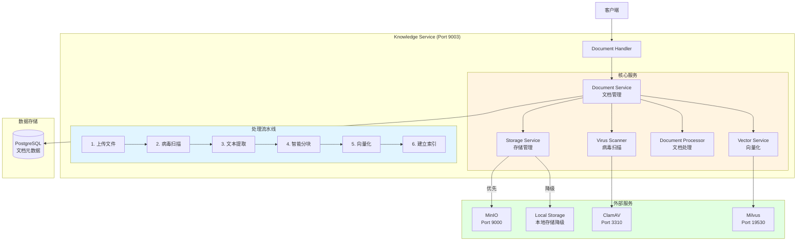

# Phase 3: 文档管理增强 - 详细实施方案

---

## 📋 基本信息

- **阶段**: Phase 3
- **时间**: Q1 2025, Week 9-12 (4周)
- **目标**: 增强文档处理能力
- **优先级**: 🟡 P1 - 中优先级
- **前置依赖**: Phase 1 (API Gateway)、Phase 2 (认证授权)
- **负责人**: 后端开发组
- **状态**: 📋 待开始

---

## 🎯 Phase目标

### 主要目标
对齐VoiceHelper的Document Service能力，实现完整的文档生命周期管理：
1. MinIO对象存储集成
2. ClamAV病毒扫描
3. 异步处理流水线
4. 文档状态管理
5. 智能分块优化

### 成功标准
1. ✅ MinIO正常工作，文件成功上传到对象存储
2. ✅ ClamAV病毒扫描集成，恶意文件被拒绝
3. ✅ 异步处理流水线正常，状态正确转换
4. ✅ 文档状态机完整，支持5种状态
5. ✅ 智能分块算法优化，分块质量提升
6. ✅ 单元测试覆盖率 > 70%
7. ✅ 集成测试通过率 100%

---

## 📐 架构设计

### 目标架构



### 增强的Knowledge Service结构

```
cmd/knowledge-service/
├── main.go
├── config/
│   └── config.go
└── internal/
    ├── handler/
    │   └── document_handler.go        # 现有，需增强
    ├── service/
    │   ├── document_service.go        # 现有，需增强
    │   ├── storage_service.go         # 新增 ⭐
    │   ├── virus_scanner.go           # 新增 ⭐
    │   ├── document_processor.go      # 新增 ⭐
    │   └── vector_service.go          # 新增 ⭐
    ├── worker/
    │   └── document_worker.go         # 新增 ⭐
    ├── repository/
    │   ├── document_repository.go     # 现有
    │   └── chunk_repository.go        # 新增 ⭐
    └── model/
        ├── document.go                # 现有，需增强
        └── document_chunk.go          # 新增 ⭐
```

---

## 📅 详细任务分解

### Week 1: MinIO对象存储集成（5天）

#### Task 1.1: MinIO部署与配置 (1天)

**目标**: 部署MinIO到Kubernetes

**MinIO Deployment**:
```yaml
# deployments/k8s/infrastructure/minio/deployment.yaml
apiVersion: apps/v1
kind: Deployment
metadata:
  name: minio
  namespace: voiceassistant-prod
  labels:
    app: minio
spec:
  replicas: 1  # 单机模式，生产环境建议4节点分布式
  selector:
    matchLabels:
      app: minio
  template:
    metadata:
      labels:
        app: minio
    spec:
      containers:
      - name: minio
        image: minio/minio:RELEASE.2024-01-01T00-00-00Z
        args:
        - server
        - /data
        - --console-address
        - ":9001"
        ports:
        - containerPort: 9000
          name: api
        - containerPort: 9001
          name: console
        env:
        - name: MINIO_ROOT_USER
          valueFrom:
            secretKeyRef:
              name: minio-secrets
              key: root-user
        - name: MINIO_ROOT_PASSWORD
          valueFrom:
            secretKeyRef:
              name: minio-secrets
              key: root-password
        volumeMounts:
        - name: data
          mountPath: /data
        resources:
          requests:
            memory: "512Mi"
            cpu: "250m"
          limits:
            memory: "2Gi"
            cpu: "1000m"
        livenessProbe:
          httpGet:
            path: /minio/health/live
            port: 9000
          initialDelaySeconds: 30
          periodSeconds: 10
        readinessProbe:
          httpGet:
            path: /minio/health/ready
            port: 9000
          initialDelaySeconds: 30
          periodSeconds: 10
      volumes:
      - name: data
        persistentVolumeClaim:
          claimName: minio-pvc
---
apiVersion: v1
kind: PersistentVolumeClaim
metadata:
  name: minio-pvc
  namespace: voiceassistant-prod
spec:
  accessModes:
    - ReadWriteOnce
  resources:
    requests:
      storage: 100Gi
  storageClassName: standard
---
apiVersion: v1
kind: Service
metadata:
  name: minio
  namespace: voiceassistant-prod
spec:
  type: ClusterIP
  ports:
  - port: 9000
    targetPort: 9000
    name: api
  - port: 9001
    targetPort: 9001
    name: console
  selector:
    app: minio
---
apiVersion: v1
kind: Secret
metadata:
  name: minio-secrets
  namespace: voiceassistant-prod
type: Opaque
stringData:
  root-user: minioadmin
  root-password: minioadmin123
```

**部署MinIO**:
```bash
kubectl apply -f deployments/k8s/infrastructure/minio/

# 等待Pod就绪
kubectl wait --for=condition=ready pod -l app=minio -n voiceassistant-prod --timeout=300s

# 访问控制台（端口转发）
kubectl port-forward svc/minio 9001:9001 -n voiceassistant-prod

# 访问 http://localhost:9001 (minioadmin/minioadmin123)
```

#### Task 1.2: 实现Storage Service (2天)

**配置结构**:
```go
// cmd/knowledge-service/config/config.go
type StorageConfig struct {
    Type         string `mapstructure:"type" default:"local"` // local or minio
    BasePath     string `mapstructure:"base_path" default:"./data/documents"`
    MinIO        MinIOConfig
}

type MinIOConfig struct {
    Endpoint   string `mapstructure:"endpoint" default:"minio:9000"`
    AccessKey  string `mapstructure:"access_key"`
    SecretKey  string `mapstructure:"secret_key"`
    Bucket     string `mapstructure:"bucket" default:"documents"`
    UseSSL     bool   `mapstructure:"use_ssl" default:"false"`
}
```

**Storage Service实现**:
```go
// cmd/knowledge-service/internal/service/storage_service.go
package service

import (
    "bytes"
    "context"
    "fmt"
    "io"
    "os"
    "path/filepath"

    "github.com/minio/minio-go/v7"
    "github.com/minio/minio-go/v7/pkg/credentials"
    "github.com/sirupsen/logrus"
)

type StorageService struct {
    storageType  string // local/minio
    basePath     string // 本地存储基础路径
    minioClient  *minio.Client
    minioBucket  string
    minioEnabled bool
    logger       *logrus.Logger
}

func NewStorageService(config *config.StorageConfig, logger *logrus.Logger) (*StorageService, error) {
    s := &StorageService{
        storageType:  config.Type,
        basePath:     config.BasePath,
        minioEnabled: false,
        logger:       logger,
    }

    // 确保本地存储目录存在
    if err := os.MkdirAll(s.basePath, 0755); err != nil {
        return nil, fmt.Errorf("failed to create base path: %w", err)
    }

    // 如果配置了MinIO，初始化MinIO客户端
    if config.Type == "minio" {
        if err := s.initMinIO(&config.MinIO); err != nil {
            logger.Warnf("MinIO初始化失败，降级到本地存储: %v", err)
            s.storageType = "local"
        } else {
            s.minioEnabled = true
            logger.Info("MinIO存储已启用")
        }
    }

    return s, nil
}

// initMinIO 初始化MinIO客户端
func (s *StorageService) initMinIO(config *config.MinIOConfig) error {
    // 创建MinIO客户端
    minioClient, err := minio.New(config.Endpoint, &minio.Options{
        Creds:  credentials.NewStaticV4(config.AccessKey, config.SecretKey, ""),
        Secure: config.UseSSL,
    })
    if err != nil {
        return fmt.Errorf("failed to create minio client: %w", err)
    }

    s.minioClient = minioClient
    s.minioBucket = config.Bucket

    // 检查bucket是否存在，不存在则创建
    ctx := context.Background()
    exists, err := minioClient.BucketExists(ctx, config.Bucket)
    if err != nil {
        return fmt.Errorf("failed to check bucket: %w", err)
    }

    if !exists {
        if err := minioClient.MakeBucket(ctx, config.Bucket, minio.MakeBucketOptions{}); err != nil {
            return fmt.Errorf("failed to create bucket: %w", err)
        }
        s.logger.Infof("创建MinIO bucket: %s", config.Bucket)
    }

    return nil
}

// Upload 上传文件（自动选择存储方式）
func (s *StorageService) Upload(ctx context.Context, fileName string, content []byte) (string, error) {
    if s.minioEnabled {
        return s.uploadToMinIO(ctx, fileName, content)
    }
    return s.uploadToLocal(ctx, fileName, content)
}

// uploadToMinIO 上传到MinIO
func (s *StorageService) uploadToMinIO(ctx context.Context, fileName string, content []byte) (string, error) {
    _, err := s.minioClient.PutObject(
        ctx,
        s.minioBucket,
        fileName,
        bytes.NewReader(content),
        int64(len(content)),
        minio.PutObjectOptions{
            ContentType: "application/octet-stream",
        },
    )
    if err != nil {
        return "", fmt.Errorf("failed to upload to MinIO: %w", err)
    }

    // 返回MinIO URL
    url := fmt.Sprintf("minio://%s/%s", s.minioBucket, fileName)

    s.logger.WithFields(logrus.Fields{
        "file_name": fileName,
        "size":      len(content),
        "storage":   "minio",
    }).Info("File uploaded")

    return url, nil
}

// uploadToLocal 上传到本地存储
func (s *StorageService) uploadToLocal(ctx context.Context, fileName string, content []byte) (string, error) {
    filePath := filepath.Join(s.basePath, fileName)

    if err := os.WriteFile(filePath, content, 0644); err != nil {
        return "", fmt.Errorf("failed to write file: %w", err)
    }

    s.logger.WithFields(logrus.Fields{
        "file_name": fileName,
        "size":      len(content),
        "storage":   "local",
    }).Info("File uploaded")

    return filePath, nil
}

// Download 下载文件
func (s *StorageService) Download(ctx context.Context, fileURL string) ([]byte, error) {
    // 判断是MinIO URL还是本地路径
    if s.isMinIOURL(fileURL) {
        return s.downloadFromMinIO(ctx, fileURL)
    }
    return s.downloadFromLocal(ctx, fileURL)
}

// downloadFromMinIO 从MinIO下载
func (s *StorageService) downloadFromMinIO(ctx context.Context, fileURL string) ([]byte, error) {
    // 解析MinIO URL: minio://bucket/filename
    fileName := s.extractFileNameFromMinIOURL(fileURL)

    object, err := s.minioClient.GetObject(ctx, s.minioBucket, fileName, minio.GetObjectOptions{})
    if err != nil {
        return nil, fmt.Errorf("failed to get object: %w", err)
    }
    defer object.Close()

    content, err := io.ReadAll(object)
    if err != nil {
        return nil, fmt.Errorf("failed to read object: %w", err)
    }

    return content, nil
}

// downloadFromLocal 从本地下载
func (s *StorageService) downloadFromLocal(ctx context.Context, filePath string) ([]byte, error) {
    content, err := os.ReadFile(filePath)
    if err != nil {
        return nil, fmt.Errorf("failed to read file: %w", err)
    }

    return content, nil
}

// Delete 删除文件
func (s *StorageService) Delete(ctx context.Context, fileURL string) error {
    if s.isMinIOURL(fileURL) {
        return s.deleteFromMinIO(ctx, fileURL)
    }
    return s.deleteFromLocal(ctx, fileURL)
}

// deleteFromMinIO 从MinIO删除
func (s *StorageService) deleteFromMinIO(ctx context.Context, fileURL string) error {
    fileName := s.extractFileNameFromMinIOURL(fileURL)

    if err := s.minioClient.RemoveObject(ctx, s.minioBucket, fileName, minio.RemoveObjectOptions{}); err != nil {
        return fmt.Errorf("failed to remove object: %w", err)
    }

    return nil
}

// deleteFromLocal 从本地删除
func (s *StorageService) deleteFromLocal(ctx context.Context, filePath string) error {
    if err := os.Remove(filePath); err != nil {
        return fmt.Errorf("failed to remove file: %w", err)
    }

    return nil
}

// isMinIOURL 判断是否为MinIO URL
func (s *StorageService) isMinIOURL(url string) bool {
    return len(url) > 8 && url[:8] == "minio://"
}

// extractFileNameFromMinIOURL 从MinIO URL提取文件名
// minio://bucket/filename -> filename
func (s *StorageService) extractFileNameFromMinIOURL(url string) string {
    // minio://bucket/filename
    parts := strings.Split(url, "/")
    if len(parts) >= 4 {
        return strings.Join(parts[3:], "/")
    }
    return ""
}
```

**单元测试**:
```go
// cmd/knowledge-service/internal/service/storage_service_test.go
package service_test

import (
    "context"
    "testing"

    "github.com/stretchr/testify/assert"

    "voiceassistant/cmd/knowledge-service/config"
    "voiceassistant/cmd/knowledge-service/internal/service"
)

func TestStorageService_LocalStorage(t *testing.T) {
    cfg := &config.StorageConfig{
        Type:     "local",
        BasePath: "./testdata",
    }

    storageService, err := service.NewStorageService(cfg, logrus.New())
    assert.NoError(t, err)
    defer os.RemoveAll("./testdata")

    ctx := context.Background()

    // 测试上传
    content := []byte("test content")
    fileURL, err := storageService.Upload(ctx, "test.txt", content)
    assert.NoError(t, err)
    assert.NotEmpty(t, fileURL)

    // 测试下载
    downloaded, err := storageService.Download(ctx, fileURL)
    assert.NoError(t, err)
    assert.Equal(t, content, downloaded)

    // 测试删除
    err = storageService.Delete(ctx, fileURL)
    assert.NoError(t, err)
}
```

#### Task 1.3: 集成到Document Handler (2天)

**更新Document模型**:
```go
// cmd/knowledge-service/internal/model/document.go
package model

import "time"

type Document struct {
    ID          string    `json:"id" gorm:"primaryKey"`
    UserID      string    `json:"user_id" gorm:"index;not null"`
    TenantID    string    `json:"tenant_id" gorm:"index"`
    Title       string    `json:"title" gorm:"not null"`
    FileName    string    `json:"file_name"`
    FileType    string    `json:"file_type"`
    FileSize    int64     `json:"file_size"`
    FilePath    string    `json:"file_path"`    // MinIO URL或本地路径
    Status      string    `json:"status" gorm:"index;default:'uploaded'"` // 新增状态字段 ⭐
    ErrorMsg    string    `json:"error_msg"`    // 新增错误信息 ⭐
    ChunkCount  int       `json:"chunk_count"`  // 新增分块数量 ⭐
    CreatedAt   time.Time `json:"created_at"`
    UpdatedAt   time.Time `json:"updated_at"`
}

// 文档状态常量
const (
    StatusUploaded   = "uploaded"    // 已上传
    StatusProcessing = "processing"  // 处理中
    StatusCompleted  = "completed"   // 已完成
    StatusFailed     = "failed"      // 失败
    StatusInfected   = "infected"    // 发现病毒
)
```

**更新Document Handler**:
```go
// cmd/knowledge-service/internal/handler/document_handler.go
func (h *DocumentHandler) Upload(c *gin.Context) {
    // 1. 获取用户信息
    userID := c.GetString("user_id")
    tenantID := c.GetString("tenant_id")

    // 2. 读取上传文件
    file, header, err := c.Request.FormFile("file")
    if err != nil {
        c.JSON(400, gin.H{"code": 400, "message": "Failed to read file"})
        return
    }
    defer file.Close()

    // 3. 验证文件大小
    maxSize := int64(100 * 1024 * 1024) // 100MB
    if header.Size > maxSize {
        c.JSON(400, gin.H{"code": 400, "message": "File too large"})
        return
    }

    // 4. 生成文档ID和文件名
    documentID := uuid.New().String()
    fileExt := filepath.Ext(header.Filename)
    fileName := documentID + fileExt

    // 5. 读取文件内容
    fileContent, err := io.ReadAll(file)
    if err != nil {
        c.JSON(500, gin.H{"code": 500, "message": "Failed to read file content"})
        return
    }

    // 6. 上传到存储（MinIO或本地）
    fileURL, err := h.storageService.Upload(c.Request.Context(), fileName, fileContent)
    if err != nil {
        c.JSON(500, gin.H{"code": 500, "message": "Failed to upload file"})
        return
    }

    // 7. 创建文档记录
    document := &model.Document{
        ID:        documentID,
        UserID:    userID,
        TenantID:  tenantID,
        Title:     header.Filename,
        FileName:  header.Filename,
        FileType:  fileExt[1:],
        FileSize:  header.Size,
        FilePath:  fileURL,
        Status:    model.StatusUploaded,
        CreatedAt: time.Now(),
        UpdatedAt: time.Now(),
    }

    if err := h.documentService.CreateDocument(c.Request.Context(), document); err != nil {
        c.JSON(500, gin.H{"code": 500, "message": "Failed to create document"})
        return
    }

    // 8. 异步处理文档（病毒扫描、文本提取、向量化）
    go h.documentWorker.ProcessDocument(context.Background(), documentID)

    c.JSON(201, gin.H{
        "code":    201,
        "message": "Document uploaded successfully",
        "data":    gin.H{"document": document},
    })
}
```

**交付物**:
- ✅ MinIO Kubernetes部署文件
- ✅ StorageService完整实现
- ✅ Document模型增强（Status字段）
- ✅ Document Handler更新
- ✅ 单元测试
- ✅ 配置文档

---

### Week 2: ClamAV病毒扫描（5天）

#### Task 2.1: ClamAV部署 (1天)

**ClamAV Deployment**:
```yaml
# deployments/k8s/infrastructure/clamav/deployment.yaml
apiVersion: apps/v1
kind: Deployment
metadata:
  name: clamav
  namespace: voiceassistant-prod
  labels:
    app: clamav
spec:
  replicas: 2
  selector:
    matchLabels:
      app: clamav
  template:
    metadata:
      labels:
        app: clamav
    spec:
      containers:
      - name: clamav
        image: clamav/clamav:latest
        ports:
        - containerPort: 3310
          name: clamd
        env:
        - name: CLAMAV_NO_FRESHCLAM
          value: "false"
        - name: FRESHCLAM_CHECKS
          value: "24"
        resources:
          requests:
            memory: "2Gi"
            cpu: "1000m"
          limits:
            memory: "4Gi"
            cpu: "2000m"
        volumeMounts:
        - name: virus-db
          mountPath: /var/lib/clamav
        livenessProbe:
          tcpSocket:
            port: 3310
          initialDelaySeconds: 120
          periodSeconds: 30
        readinessProbe:
          exec:
            command:
            - /usr/local/bin/clamdcheck.sh
          initialDelaySeconds: 120
          periodSeconds: 30
      volumes:
      - name: virus-db
        emptyDir: {}
---
apiVersion: v1
kind: Service
metadata:
  name: clamav
  namespace: voiceassistant-prod
spec:
  type: ClusterIP
  ports:
  - port: 3310
    targetPort: 3310
    name: clamd
  selector:
    app: clamav
```

**部署ClamAV**:
```bash
kubectl apply -f deployments/k8s/infrastructure/clamav/

# 等待病毒库更新完成（可能需要10-15分钟）
kubectl logs -f deployment/clamav -n voiceassistant-prod
```

#### Task 2.2: 实现Virus Scanner (2天)

**Virus Scanner实现**:
```go
// cmd/knowledge-service/internal/service/virus_scanner.go
package service

import (
    "context"
    "fmt"
    "os/exec"
    "strings"
    "time"

    "github.com/sirupsen/logrus"
)

type VirusScanner struct {
    enabled        bool
    scannerType    string // "clamav" or "mock"
    clamavHost     string
    clamavPort     int
    maxFileSize    int64
    scanTimeout    time.Duration
    logger         *logrus.Logger
}

type ScanResult struct {
    IsClean      bool
    VirusFound   string
    ScanDuration time.Duration
    Scanner      string
    Timestamp    time.Time
}

func NewVirusScanner(config *config.VirusScanConfig, logger *logrus.Logger) *VirusScanner {
    scanner := &VirusScanner{
        enabled:      config.Enabled,
        scannerType:  config.Type,
        clamavHost:   config.ClamAVHost,
        clamavPort:   config.ClamAVPort,
        maxFileSize:  config.MaxFileSize,
        scanTimeout:  config.ScanTimeout,
        logger:       logger,
    }

    if scanner.enabled {
        logger.Infof("病毒扫描已启用: type=%s", scanner.scannerType)
    } else {
        logger.Info("病毒扫描未启用")
    }

    return scanner
}

// ScanFile 扫描文件
func (s *VirusScanner) ScanFile(ctx context.Context, filePath string, fileContent []byte) (*ScanResult, error) {
    start := time.Now()

    // 如果未启用，返回clean结果
    if !s.enabled {
        return &ScanResult{
            IsClean:      true,
            Scanner:      "disabled",
            ScanDuration: time.Since(start),
            Timestamp:    time.Now(),
        }, nil
    }

    // 检查文件大小
    if int64(len(fileContent)) > s.maxFileSize {
        return nil, fmt.Errorf("文件过大: %d bytes (max: %d)",
            len(fileContent), s.maxFileSize)
    }

    // 根据scanner类型调用不同的扫描方法
    var result *ScanResult
    var err error

    switch s.scannerType {
    case "clamav":
        result, err = s.scanWithClamAV(ctx, filePath, fileContent)
    case "mock":
        result, err = s.scanWithMock(ctx, filePath, fileContent)
    default:
        result, err = s.scanWithMock(ctx, filePath, fileContent)
    }

    if err != nil {
        return nil, err
    }

    result.ScanDuration = time.Since(start)
    result.Timestamp = time.Now()

    s.logger.WithFields(logrus.Fields{
        "file_path": filePath,
        "is_clean":  result.IsClean,
        "virus":     result.VirusFound,
        "duration":  result.ScanDuration.Milliseconds(),
    }).Info("File scanned")

    return result, nil
}

// scanWithClamAV 使用ClamAV扫描
func (s *VirusScanner) scanWithClamAV(ctx context.Context, filePath string, fileContent []byte) (*ScanResult, error) {
    // 创建临时文件
    tmpFile, err := os.CreateTemp("", "scan-*.tmp")
    if err != nil {
        return nil, err
    }
    defer os.Remove(tmpFile.Name())

    if _, err := tmpFile.Write(fileContent); err != nil {
        return nil, err
    }
    tmpFile.Close()

    // 使用clamdscan命令扫描
    ctx, cancel := context.WithTimeout(ctx, s.scanTimeout)
    defer cancel()

    cmd := exec.CommandContext(ctx,
        "clamdscan",
        "--fdpass",
        "--no-summary",
        tmpFile.Name(),
    )

    output, err := cmd.CombinedOutput()
    outputStr := string(output)

    if err != nil {
        // clamdscan返回1表示发现病毒
        if strings.Contains(outputStr, "FOUND") {
            virusName := s.extractVirusName(outputStr)
            return &ScanResult{
                IsClean:    false,
                VirusFound: virusName,
                Scanner:    "clamav",
            }, nil
        }
        return nil, fmt.Errorf("clamdscan failed: %w, output: %s", err, outputStr)
    }

    // 扫描通过
    return &ScanResult{
        IsClean: true,
        Scanner: "clamav",
    }, nil
}

// scanWithMock Mock扫描（用于开发/测试）
func (s *VirusScanner) scanWithMock(ctx context.Context, filePath string, fileContent []byte) (*ScanResult, error) {
    // 检查文件名是否包含"virus"或"eicar"（EICAR测试文件）
    if strings.Contains(strings.ToLower(filePath), "virus") ||
       strings.Contains(strings.ToLower(filePath), "eicar") ||
       bytes.Contains(fileContent, []byte("X5O!P%@AP[4\\PZX54(P^)7CC)7}$EICAR")) {
        return &ScanResult{
            IsClean:    false,
            VirusFound: "Test.Virus.EICAR",
            Scanner:    "mock",
        }, nil
    }

    return &ScanResult{
        IsClean: true,
        Scanner: "mock",
    }, nil
}

// extractVirusName 从ClamAV输出提取病毒名称
func (s *VirusScanner) extractVirusName(output string) string {
    // 输出格式: /path/to/file: Virus.Name FOUND
    lines := strings.Split(output, "\n")
    for _, line := range lines {
        if strings.Contains(line, "FOUND") {
            parts := strings.Split(line, ":")
            if len(parts) >= 2 {
                virusInfo := strings.TrimSpace(parts[1])
                virusName := strings.Replace(virusInfo, " FOUND", "", 1)
                return strings.TrimSpace(virusName)
            }
        }
    }
    return "Unknown"
}
```

**配置**:
```yaml
# configs/knowledge-service.yaml
virus_scan:
  enabled: true
  type: "clamav"  # clamav or mock
  clamav_host: "clamav.voiceassistant-prod.svc.cluster.local"
  clamav_port: 3310
  max_file_size: 104857600  # 100MB
  scan_timeout: "30s"
```

#### Task 2.3: 集成到处理流水线 (2天)

**Document Worker实现**:
```go
// cmd/knowledge-service/internal/worker/document_worker.go
package worker

import (
    "context"

    "voiceassistant/cmd/knowledge-service/internal/model"
    "voiceassistant/cmd/knowledge-service/internal/service"
)

type DocumentWorker struct {
    documentService   *service.DocumentService
    storageService    *service.StorageService
    virusScanner      *service.VirusScanner
    documentProcessor *service.DocumentProcessor
    vectorService     *service.VectorService
    logger            *logrus.Logger
}

func NewDocumentWorker(
    documentService *service.DocumentService,
    storageService *service.StorageService,
    virusScanner *service.VirusScanner,
    documentProcessor *service.DocumentProcessor,
    vectorService *service.VectorService,
    logger *logrus.Logger,
) *DocumentWorker {
    return &DocumentWorker{
        documentService:   documentService,
        storageService:    storageService,
        virusScanner:      virusScanner,
        documentProcessor: documentProcessor,
        vectorService:     vectorService,
        logger:            logger,
    }
}

// ProcessDocument 处理文档
func (w *DocumentWorker) ProcessDocument(ctx context.Context, documentID string) error {
    w.logger.WithField("document_id", documentID).Info("开始处理文档")

    // 1. 更新状态: processing
    if err := w.documentService.UpdateStatus(ctx, documentID, model.StatusProcessing, ""); err != nil {
        return err
    }

    // 2. 获取文档信息
    document, err := w.documentService.GetDocument(ctx, documentID)
    if err != nil {
        return err
    }

    // 3. 下载文件
    fileContent, err := w.storageService.Download(ctx, document.FilePath)
    if err != nil {
        w.documentService.UpdateStatus(ctx, documentID, model.StatusFailed,
            fmt.Sprintf("下载失败: %v", err))
        return err
    }

    // 4. 病毒扫描
    scanResult, err := w.virusScanner.ScanFile(ctx, document.FilePath, fileContent)
    if err != nil {
        w.documentService.UpdateStatus(ctx, documentID, model.StatusFailed,
            fmt.Sprintf("扫描失败: %v", err))
        return err
    }

    if !scanResult.IsClean {
        // 发现病毒，更新状态并停止处理
        w.documentService.UpdateStatus(ctx, documentID, model.StatusInfected,
            fmt.Sprintf("发现病毒: %s", scanResult.VirusFound))
        w.logger.WithFields(logrus.Fields{
            "document_id": documentID,
            "virus":       scanResult.VirusFound,
        }).Warn("文档包含病毒")
        return nil
    }

    // 5. 文档处理（文本提取、分块）
    processed, err := w.documentProcessor.ProcessDocument(ctx, document.FilePath, document.FileType, fileContent)
    if err != nil {
        w.documentService.UpdateStatus(ctx, documentID, model.StatusFailed,
            fmt.Sprintf("处理失败: %v", err))
        return err
    }

    // 6. 向量化并保存
    if err := w.generateAndSaveEmbeddings(ctx, documentID, document, processed.Chunks); err != nil {
        w.documentService.UpdateStatus(ctx, documentID, model.StatusFailed,
            fmt.Sprintf("向量化失败: %v", err))
        return err
    }

    // 7. 更新状态: completed
    if err := w.documentService.UpdateStatusWithChunks(ctx, documentID, model.StatusCompleted, "", len(processed.Chunks)); err != nil {
        return err
    }

    w.logger.WithFields(logrus.Fields{
        "document_id": documentID,
        "chunks":      len(processed.Chunks),
    }).Info("文档处理完成")

    return nil
}

// generateAndSaveEmbeddings 生成并保存Embeddings
func (w *DocumentWorker) generateAndSaveEmbeddings(
    ctx context.Context,
    documentID string,
    document *model.Document,
    chunks []string,
) error {
    w.logger.Infof("生成embeddings: %s (%d chunks)", documentID, len(chunks))

    for i, chunk := range chunks {
        chunkID := fmt.Sprintf("%s_chunk_%d", documentID, i)

        // 生成embedding
        embedding, err := w.vectorService.GenerateEmbedding(ctx, chunk)
        if err != nil {
            w.logger.Warnf("生成embedding失败 (chunk %d): %v", i, err)
            continue
        }

        // 保存chunk到数据库
        chunkModel := &model.DocumentChunk{
            ID:         chunkID,
            DocumentID: documentID,
            ChunkIndex: i,
            Content:    chunk,
            CreatedAt:  time.Now(),
        }

        if err := w.documentService.SaveChunk(ctx, chunkModel); err != nil {
            w.logger.Warnf("保存chunk失败: %v", err)
            continue
        }

        // 保存到向量数据库
        if err := w.vectorService.InsertVector(ctx, chunkID, embedding); err != nil {
            w.logger.Warnf("保存向量失败: %v", err)
            continue
        }
    }

    return nil
}
```

**交付物**:
- ✅ ClamAV Kubernetes部署文件
- ✅ VirusScanner完整实现
- ✅ DocumentWorker实现（包含病毒扫描）
- ✅ 病毒检测测试（EICAR测试文件）
- ✅ 配置文档

---

### Week 3: 文档处理与智能分块（5天）

#### Task 3.1: 实现Document Processor (2天)

**Document Processor实现**:
```go
// cmd/knowledge-service/internal/service/document_processor.go
package service

import (
    "bytes"
    "context"
    "fmt"
    "strings"

    "github.com/ledongthuc/pdf"
    "github.com/sirupsen/logrus"
)

type DocumentProcessor struct {
    storageService *StorageService
    maxChunkSize   int
    chunkOverlap   int
    minChunkSize   int
    logger         *logrus.Logger
}

type ProcessedDocument struct {
    FullText   string
    Chunks     []string
    ChunkCount int
    CharCount  int
}

func NewDocumentProcessor(storageService *StorageService, logger *logrus.Logger) *DocumentProcessor {
    return &DocumentProcessor{
        storageService: storageService,
        maxChunkSize:   1000, // 每个chunk最多1000个字符
        chunkOverlap:   200,  // chunk之间重叠200个字符
        minChunkSize:   100,  // 最小chunk大小
        logger:         logger,
    }
}

// ProcessDocument 处理文档
func (p *DocumentProcessor) ProcessDocument(
    ctx context.Context,
    filePath, fileType string,
    fileContent []byte,
) (*ProcessedDocument, error) {
    p.logger.WithFields(logrus.Fields{
        "file_path": filePath,
        "file_type": fileType,
        "file_size": len(fileContent),
    }).Info("开始处理文档")

    // 1. 根据文件类型提取文本
    text, err := p.extractText(fileContent, fileType)
    if err != nil {
        return nil, fmt.Errorf("文本提取失败: %w", err)
    }

    // 2. 文本分块
    chunks := p.splitTextIntoChunks(text)

    p.logger.WithFields(logrus.Fields{
        "file_path": filePath,
        "chars":     len(text),
        "chunks":    len(chunks),
    }).Info("文档处理完成")

    return &ProcessedDocument{
        FullText:   text,
        Chunks:     chunks,
        ChunkCount: len(chunks),
        CharCount:  len(text),
    }, nil
}

// extractText 提取文本
func (p *DocumentProcessor) extractText(fileContent []byte, fileType string) (string, error) {
    switch strings.ToLower(fileType) {
    case "pdf":
        return p.extractTextFromPDF(fileContent)
    case "txt", "text":
        return string(fileContent), nil
    case "md", "markdown":
        return string(fileContent), nil
    case "html", "htm":
        return p.extractTextFromHTML(fileContent)
    default:
        // 尝试作为纯文本处理
        return string(fileContent), nil
    }
}

// extractTextFromPDF 从PDF提取文本
func (p *DocumentProcessor) extractTextFromPDF(content []byte) (string, error) {
    bytesReader := bytes.NewReader(content)
    reader, err := pdf.NewReader(bytesReader, int64(len(content)))
    if err != nil {
        return "", err
    }

    var text strings.Builder
    numPages := reader.NumPage()

    for pageNum := 1; pageNum <= numPages; pageNum++ {
        page := reader.Page(pageNum)
        if page.V.IsNull() {
            continue
        }

        pageText, err := page.GetPlainText(nil)
        if err != nil {
            p.logger.Warnf("提取第%d页失败: %v", pageNum, err)
            continue
        }

        text.WriteString(pageText)
        text.WriteString("\n\n")
    }

    return text.String(), nil
}

// extractTextFromHTML 从HTML提取文本
func (p *DocumentProcessor) extractTextFromHTML(content []byte) (string, error) {
    // 简单实现：移除HTML标签
    text := string(content)
    text = strings.ReplaceAll(text, "<script", "<removed")
    text = strings.ReplaceAll(text, "</script>", "</removed>")
    text = strings.ReplaceAll(text, "<style", "<removed")
    text = strings.ReplaceAll(text, "</style>", "</removed>")

    // 使用正则表达式移除标签
    re := regexp.MustCompile(`<[^>]*>`)
    text = re.ReplaceAllString(text, " ")

    // 清理多余空白
    text = strings.Join(strings.Fields(text), " ")

    return text, nil
}

// splitTextIntoChunks 智能分块
func (p *DocumentProcessor) splitTextIntoChunks(text string) []string {
    var chunks []string

    // 如果文本短于maxChunkSize，直接返回
    if len(text) <= p.maxChunkSize {
        if len(text) >= p.minChunkSize {
            return []string{text}
        }
        return []string{}
    }

    // 滑动窗口分块
    for i := 0; i < len(text); i += p.maxChunkSize - p.chunkOverlap {
        end := i + p.maxChunkSize
        if end > len(text) {
            end = len(text)
        }

        chunk := text[i:end]

        // 只保留达到最小大小的chunk
        if len(chunk) >= p.minChunkSize {
            chunks = append(chunks, chunk)
        }

        // 如果已经到达末尾，退出
        if end == len(text) {
            break
        }
    }

    return chunks
}
```

#### Task 3.2: 优化分块算法 (2天)

**语义边界分块**:
```go
// splitTextIntoChunksWithSemanticBoundary 语义边界分块
func (p *DocumentProcessor) splitTextIntoChunksWithSemanticBoundary(text string) []string {
    var chunks []string

    // 1. 按段落分割
    paragraphs := p.splitIntoParagraphs(text)

    currentChunk := ""

    for _, para := range paragraphs {
        // 如果当前chunk + 段落 <= maxChunkSize，添加段落
        if len(currentChunk)+len(para) <= p.maxChunkSize {
            if currentChunk != "" {
                currentChunk += "\n\n"
            }
            currentChunk += para
        } else {
            // 保存当前chunk
            if len(currentChunk) >= p.minChunkSize {
                chunks = append(chunks, currentChunk)
            }

            // 开始新chunk
            if len(para) <= p.maxChunkSize {
                currentChunk = para
            } else {
                // 段落太长，按句子分割
                sentences := p.splitIntoSentences(para)
                currentChunk = ""
                for _, sent := range sentences {
                    if len(currentChunk)+len(sent) <= p.maxChunkSize {
                        if currentChunk != "" {
                            currentChunk += " "
                        }
                        currentChunk += sent
                    } else {
                        if len(currentChunk) >= p.minChunkSize {
                            chunks = append(chunks, currentChunk)
                        }
                        currentChunk = sent
                    }
                }
            }
        }
    }

    // 保存最后一个chunk
    if len(currentChunk) >= p.minChunkSize {
        chunks = append(chunks, currentChunk)
    }

    return chunks
}

// splitIntoParagraphs 按段落分割
func (p *DocumentProcessor) splitIntoParagraphs(text string) []string {
    // 按双换行符分割
    paragraphs := strings.Split(text, "\n\n")

    // 清理空段落
    var result []string
    for _, para := range paragraphs {
        para = strings.TrimSpace(para)
        if para != "" {
            result = append(result, para)
        }
    }

    return result
}

// splitIntoSentences 按句子分割
func (p *DocumentProcessor) splitIntoSentences(text string) []string {
    // 简单实现：按句号、问号、感叹号分割
    text = strings.ReplaceAll(text, "。", "。\n")
    text = strings.ReplaceAll(text, "！", "！\n")
    text = strings.ReplaceAll(text, "？", "？\n")
    text = strings.ReplaceAll(text, ". ", ".\n")
    text = strings.ReplaceAll(text, "! ", "!\n")
    text = strings.ReplaceAll(text, "? ", "?\n")

    sentences := strings.Split(text, "\n")

    // 清理空句子
    var result []string
    for _, sent := range sentences {
        sent = strings.TrimSpace(sent)
        if sent != "" {
            result = append(result, sent)
        }
    }

    return result
}
```

#### Task 3.3: 文档状态管理API (1天)

**新增API端点**:
```go
// cmd/knowledge-service/internal/handler/document_handler.go

// GetDocumentStatus 获取文档状态
func (h *DocumentHandler) GetDocumentStatus(c *gin.Context) {
    documentID := c.Param("id")

    document, err := h.documentService.GetDocument(c.Request.Context(), documentID)
    if err != nil {
        c.JSON(404, gin.H{"code": 404, "message": "Document not found"})
        return
    }

    c.JSON(200, gin.H{
        "code":    200,
        "message": "Success",
        "data": gin.H{
            "document_id": document.ID,
            "status":      document.Status,
            "error_msg":   document.ErrorMsg,
            "chunk_count": document.ChunkCount,
            "created_at":  document.CreatedAt,
            "updated_at":  document.UpdatedAt,
        },
    })
}
```

**路由注册**:
```go
// main.go
documents := v1.Group("/documents")
{
    documents.POST("", handler.Upload)
    documents.GET("", handler.List)
    documents.GET("/:id", handler.Get)
    documents.GET("/:id/status", handler.GetDocumentStatus)  // 新增
    documents.DELETE("/:id", handler.Delete)
}
```

**交付物**:
- ✅ DocumentProcessor完整实现
- ✅ PDF/HTML/TXT文本提取
- ✅ 语义边界分块算法
- ✅ 文档状态查询API
- ✅ 单元测试
- ✅ 分块质量评估

---

### Week 4: 测试、文档与优化（5天）

#### Task 4.1: 单元测试 (2天)

**StorageService测试**:
```go
// 已在Task 1.2提供
```

**VirusScanner测试**:
```go
func TestVirusScanner_EICAR(t *testing.T) {
    scanner := service.NewVirusScanner(&config.VirusScanConfig{
        Enabled: true,
        Type:    "mock",
    }, logrus.New())

    // EICAR测试文件内容
    eicarContent := []byte(`X5O!P%@AP[4\PZX54(P^)7CC)7}$EICAR-STANDARD-ANTIVIRUS-TEST-FILE!$H+H*`)

    result, err := scanner.ScanFile(context.Background(), "eicar.txt", eicarContent)
    assert.NoError(t, err)
    assert.False(t, result.IsClean)
    assert.Contains(t, result.VirusFound, "EICAR")
}
```

**DocumentProcessor测试**:
```go
func TestDocumentProcessor_SplitChunks(t *testing.T) {
    processor := service.NewDocumentProcessor(nil, logrus.New())

    // 生成测试文本（2500字符）
    text := strings.Repeat("这是一个测试文本。", 250)

    chunks := processor.splitTextIntoChunks(text)

    // 验证分块数量
    assert.Greater(t, len(chunks), 1)

    // 验证每个chunk大小
    for i, chunk := range chunks {
        assert.LessOrEqual(t, len(chunk), processor.maxChunkSize,
            "chunk %d size exceeded", i)
        assert.GreaterOrEqual(t, len(chunk), processor.minChunkSize,
            "chunk %d size too small", i)
    }
}
```

#### Task 4.2: 集成测试 (2天)

**完整流程测试**:
```go
func TestDocumentWorkflow_E2E(t *testing.T) {
    // 1. 上传文档
    // 2. 等待处理完成
    // 3. 验证状态
    // 4. 验证分块
    // 5. 验证向量
}
```

#### Task 4.3: 文档与部署 (1天)

**API文档更新**:
- 新增MinIO配置说明
- 新增病毒扫描配置
- 新增文档状态API文档

**部署文档**:
- MinIO部署指南
- ClamAV部署指南
- 故障排查手册

**交付物**:
- ✅ 单元测试（覆盖率>70%）
- ✅ 集成测试
- ✅ API文档更新
- ✅ 部署文档
- ✅ 故障排查手册

---

## 📊 验收标准

### 功能验收

| 功能 | 验收标准 | 验收方法 |
|-----|---------|---------|
| MinIO存储 | 文件成功上传到MinIO | 查看MinIO控制台 |
| 存储降级 | MinIO不可用时使用本地存储 | 停止MinIO服务测试 |
| 病毒扫描 | EICAR测试文件被拒绝 | 上传EICAR文件 |
| 病毒扫描失败降级 | ClamAV不可用时仍能上传 | 停止ClamAV服务测试 |
| 文档处理 | PDF/TXT文件正确提取文本 | 上传测试文件 |
| 智能分块 | 分块在语义边界 | 人工评估 |
| 状态管理 | 状态正确转换 | 查询文档状态API |
| 异步处理 | 处理流水线正常工作 | 上传文档后查看日志 |

### 性能验收

| 指标 | 目标 | 实际 | 验收方法 |
|-----|------|------|---------|
| 文档上传延迟 | <2s | TBD | 压测 |
| 病毒扫描延迟 | <5s | TBD | 单文件测试 |
| PDF提取延迟 | <10s (100页) | TBD | 测试文件 |
| 分块延迟 | <1s (1万字符) | TBD | 单元测试 |
| 向量化延迟 | <50ms/chunk | TBD | 单元测试 |

### 质量验收

| 指标 | 目标 | 实际 | 验收方法 |
|-----|------|------|---------|
| 单元测试覆盖率 | >70% | TBD | `go test -cover` |
| 集成测试通过率 | 100% | TBD | CI/CD |
| 代码评审通过 | 100% | TBD | Pull Request |
| 文档完整性 | 100% | TBD | 人工检查 |

---

## ⚠️ 风险与缓解

### 技术风险

| 风险 | 影响 | 概率 | 缓解措施 |
|-----|------|------|---------|
| MinIO单点故障 | 高 | 低 | 本地存储降级，分布式部署 |
| ClamAV性能瓶颈 | 中 | 中 | 异步扫描，超时降级 |
| 大文件处理OOM | 高 | 中 | 限制文件大小，流式处理 |
| PDF提取失败 | 低 | 中 | 错误处理，保存原文件 |

---

## 📖 相关文档

- [VoiceHelper-02-DocumentService.md](../VoiceHelper-02-DocumentService.md)
- [MinIO Documentation](https://min.io/docs/)
- [ClamAV Documentation](https://docs.clamav.net/)

---

**文档版本**: v1.0
**最后更新**: 2025-01-27
**维护者**: VoiceAssistant后端团队
