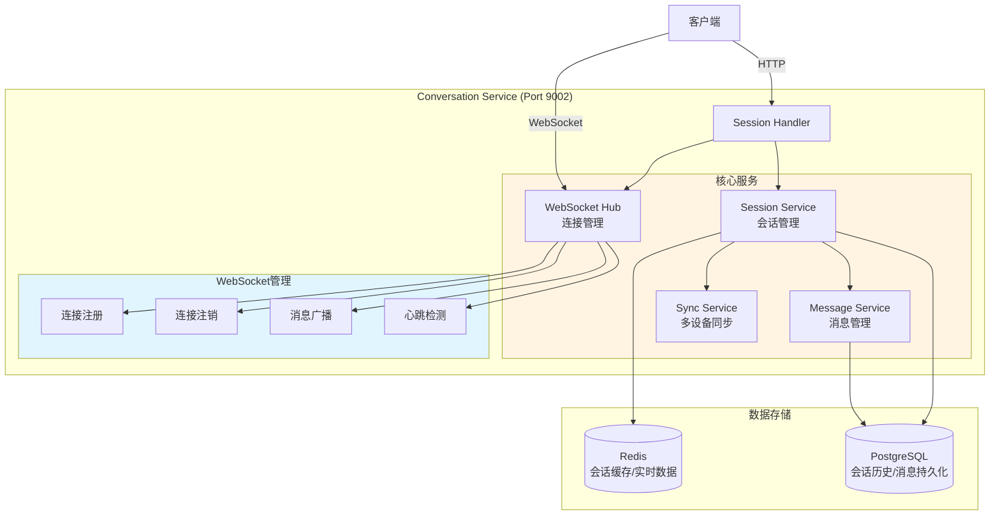

# Phase 4: 会话管理增强 - 详细实施方案

---

## 📋 基本信息

- **阶段**: Phase 4
- **时间**: Q2 2025, Week 1-3 (3周)
- **目标**: 增强会话管理能力
- **优先级**: 🟢 P2 - 中低优先级
- **前置依赖**: Phase 1 (API Gateway)、Phase 2 (认证授权)
- **负责人**: 后端开发组
- **状态**: 📋 待开始

---

## 🎯 Phase目标

### 主要目标
对齐VoiceHelper的Session Service能力，实现完整的会话管理系统：
1. WebSocket连接管理（Hub模式）
2. 会话持久化到Redis
3. 会话超时控制
4. 多设备会话同步
5. 会话历史查询优化

### 成功标准
1. ✅ WebSocket Hub正常工作，支持1000+并发连接
2. ✅ 会话正确持久化到Redis
3. ✅ 会话超时自动清理
4. ✅ 多设备会话正确同步
5. ✅ 会话历史查询性能 < 100ms
6. ✅ 单元测试覆盖率 > 70%
7. ✅ 负载测试通过（1000并发）

---

## 📐 架构设计

### 目标架构



### 增强的Conversation Service结构

```
cmd/conversation-service/
├── main.go
├── config/
│   └── config.go
└── internal/
    ├── handler/
    │   ├── session_handler.go         # 现有，需增强
    │   ├── websocket_handler.go       # 新增 ⭐
    │   └── message_handler.go         # 新增 ⭐
    ├── service/
    │   ├── session_service.go         # 现有，需增强
    │   ├── message_service.go         # 新增 ⭐
    │   └── sync_service.go            # 新增 ⭐
    ├── websocket/
    │   ├── hub.go                     # 新增 ⭐
    │   ├── client.go                  # 新增 ⭐
    │   └── message.go                 # 新增 ⭐
    ├── repository/
    │   ├── session_repository.go      # 现有
    │   └── message_repository.go      # 新增 ⭐
    └── model/
        ├── session.go                 # 现有，需增强
        └── message.go                 # 新增 ⭐
```

---

## 📅 详细任务分解

### Week 1: WebSocket Hub实现（5天）

#### Task 1.1: WebSocket基础架构 (2天)

**Client模型**:
```go
// cmd/conversation-service/internal/websocket/client.go
package websocket

import (
    "sync"
    "time"

    "github.com/gorilla/websocket"
    "github.com/sirupsen/logrus"
)

const (
    // 写入超时
    writeWait = 10 * time.Second

    // Pong超时
    pongWait = 60 * time.Second

    // Ping周期（必须小于pongWait）
    pingPeriod = (pongWait * 9) / 10

    // 最大消息大小
    maxMessageSize = 512 * 1024 // 512KB
)

type Client struct {
    ID         string
    UserID     string
    SessionID  string
    DeviceID   string
    Conn       *websocket.Conn
    Send       chan []byte
    Hub        *Hub
    Logger     *logrus.Logger
    mu         sync.Mutex
}

func NewClient(
    id, userID, sessionID, deviceID string,
    conn *websocket.Conn,
    hub *Hub,
    logger *logrus.Logger,
) *Client {
    return &Client{
        ID:        id,
        UserID:    userID,
        SessionID: sessionID,
        DeviceID:  deviceID,
        Conn:      conn,
        Send:      make(chan []byte, 256),
        Hub:       hub,
        Logger:    logger,
    }
}

// ReadPump 从WebSocket读取消息
func (c *Client) ReadPump() {
    defer func() {
        c.Hub.Unregister <- c
        c.Conn.Close()
    }()

    c.Conn.SetReadDeadline(time.Now().Add(pongWait))
    c.Conn.SetPongHandler(func(string) error {
        c.Conn.SetReadDeadline(time.Now().Add(pongWait))
        return nil
    })

    c.Conn.SetReadLimit(maxMessageSize)

    for {
        _, message, err := c.Conn.ReadMessage()
        if err != nil {
            if websocket.IsUnexpectedCloseError(err,
                websocket.CloseGoingAway,
                websocket.CloseAbnormalClosure) {
                c.Logger.Errorf("WebSocket error: %v", err)
            }
            break
        }

        // 处理消息
        c.Hub.HandleMessage(c, message)
    }
}

// WritePump 向WebSocket写入消息
func (c *Client) WritePump() {
    ticker := time.NewTicker(pingPeriod)
    defer func() {
        ticker.Stop()
        c.Conn.Close()
    }()

    for {
        select {
        case message, ok := <-c.Send:
            c.Conn.SetWriteDeadline(time.Now().Add(writeWait))
            if !ok {
                // Hub关闭了通道
                c.Conn.WriteMessage(websocket.CloseMessage, []byte{})
                return
            }

            w, err := c.Conn.NextWriter(websocket.TextMessage)
            if err != nil {
                return
            }
            w.Write(message)

            // 批量写入队列中的其他消息
            n := len(c.Send)
            for i := 0; i < n; i++ {
                w.Write([]byte{'\n'})
                w.Write(<-c.Send)
            }

            if err := w.Close(); err != nil {
                return
            }

        case <-ticker.C:
            c.Conn.SetWriteDeadline(time.Now().Add(writeWait))
            if err := c.Conn.WriteMessage(websocket.PingMessage, nil); err != nil {
                return
            }
        }
    }
}

// SendMessage 发送消息给客户端
func (c *Client) SendMessage(message []byte) error {
    c.mu.Lock()
    defer c.mu.Unlock()

    select {
    case c.Send <- message:
        return nil
    default:
        return fmt.Errorf("send buffer full")
    }
}
```

**Hub实现**:
```go
// cmd/conversation-service/internal/websocket/hub.go
package websocket

import (
    "encoding/json"
    "sync"

    "github.com/sirupsen/logrus"

    "voiceassistant/cmd/conversation-service/internal/service"
)

type Hub struct {
    // 已注册的客户端
    Clients map[string]*Client

    // 客户端注册
    Register chan *Client

    // 客户端注销
    Unregister chan *Client

    // 广播消息
    Broadcast chan *BroadcastMessage

    // 按用户ID索引的客户端
    UserClients map[string]map[string]*Client

    // 服务
    sessionService *service.SessionService
    messageService *service.MessageService

    // 日志
    logger *logrus.Logger

    // 互斥锁
    mu sync.RWMutex
}

type BroadcastMessage struct {
    UserID  string
    Message []byte
    Exclude string // 排除的ClientID
}

func NewHub(
    sessionService *service.SessionService,
    messageService *service.MessageService,
    logger *logrus.Logger,
) *Hub {
    return &Hub{
        Clients:        make(map[string]*Client),
        Register:       make(chan *Client),
        Unregister:     make(chan *Client),
        Broadcast:      make(chan *BroadcastMessage, 256),
        UserClients:    make(map[string]map[string]*Client),
        sessionService: sessionService,
        messageService: messageService,
        logger:         logger,
    }
}

// Run 运行Hub
func (h *Hub) Run() {
    for {
        select {
        case client := <-h.Register:
            h.registerClient(client)

        case client := <-h.Unregister:
            h.unregisterClient(client)

        case broadcast := <-h.Broadcast:
            h.broadcastToUser(broadcast)
        }
    }
}

// registerClient 注册客户端
func (h *Hub) registerClient(client *Client) {
    h.mu.Lock()
    defer h.mu.Unlock()

    // 添加到客户端映射
    h.Clients[client.ID] = client

    // 添加到用户客户端映射
    if _, ok := h.UserClients[client.UserID]; !ok {
        h.UserClients[client.UserID] = make(map[string]*Client)
    }
    h.UserClients[client.UserID][client.ID] = client

    h.logger.WithFields(logrus.Fields{
        "client_id":  client.ID,
        "user_id":    client.UserID,
        "session_id": client.SessionID,
        "device_id":  client.DeviceID,
    }).Info("WebSocket client registered")

    // 发送欢迎消息
    welcomeMsg := map[string]interface{}{
        "type":    "welcome",
        "message": "Connected to VoiceAssistant",
        "client_id": client.ID,
    }
    msgBytes, _ := json.Marshal(welcomeMsg)
    client.SendMessage(msgBytes)

    // 通知其他设备
    h.notifyOtherDevices(client, "device_online")
}

// unregisterClient 注销客户端
func (h *Hub) unregisterClient(client *Client) {
    h.mu.Lock()
    defer h.mu.Unlock()

    if _, ok := h.Clients[client.ID]; ok {
        delete(h.Clients, client.ID)
        close(client.Send)

        // 从用户客户端映射中移除
        if userClients, ok := h.UserClients[client.UserID]; ok {
            delete(userClients, client.ID)
            if len(userClients) == 0 {
                delete(h.UserClients, client.UserID)
            }
        }

        h.logger.WithFields(logrus.Fields{
            "client_id":  client.ID,
            "user_id":    client.UserID,
            "session_id": client.SessionID,
        }).Info("WebSocket client unregistered")

        // 通知其他设备
        h.notifyOtherDevices(client, "device_offline")
    }
}

// broadcastToUser 广播消息给用户的所有设备
func (h *Hub) broadcastToUser(broadcast *BroadcastMessage) {
    h.mu.RLock()
    defer h.mu.RUnlock()

    if userClients, ok := h.UserClients[broadcast.UserID]; ok {
        for clientID, client := range userClients {
            // 跳过排除的客户端
            if clientID == broadcast.Exclude {
                continue
            }

            select {
            case client.Send <- broadcast.Message:
            default:
                h.logger.Warnf("Failed to send to client %s", clientID)
            }
        }
    }
}

// notifyOtherDevices 通知用户的其他设备
func (h *Hub) notifyOtherDevices(client *Client, eventType string) {
    notification := map[string]interface{}{
        "type":      eventType,
        "device_id": client.DeviceID,
        "timestamp": time.Now().Unix(),
    }
    msgBytes, _ := json.Marshal(notification)

    h.Broadcast <- &BroadcastMessage{
        UserID:  client.UserID,
        Message: msgBytes,
        Exclude: client.ID,
    }
}

// HandleMessage 处理客户端消息
func (h *Hub) HandleMessage(client *Client, message []byte) {
    var msg Message
    if err := json.Unmarshal(message, &msg); err != nil {
        h.logger.Errorf("Invalid message format: %v", err)
        return
    }

    switch msg.Type {
    case "ping":
        h.handlePing(client)
    case "message":
        h.handleChatMessage(client, &msg)
    case "typing":
        h.handleTyping(client, &msg)
    default:
        h.logger.Warnf("Unknown message type: %s", msg.Type)
    }
}

// handlePing 处理Ping
func (h *Hub) handlePing(client *Client) {
    pongMsg := map[string]interface{}{
        "type": "pong",
        "timestamp": time.Now().Unix(),
    }
    msgBytes, _ := json.Marshal(pongMsg)
    client.SendMessage(msgBytes)
}

// handleChatMessage 处理聊天消息
func (h *Hub) handleChatMessage(client *Client, msg *Message) {
    // 保存消息到数据库
    if err := h.messageService.SaveMessage(
        context.Background(),
        client.SessionID,
        client.UserID,
        msg.Content,
    ); err != nil {
        h.logger.Errorf("Failed to save message: %v", err)
    }

    // 广播给用户的其他设备
    h.Broadcast <- &BroadcastMessage{
        UserID:  client.UserID,
        Message: []byte(msg.Content),
        Exclude: client.ID,
    }
}

// handleTyping 处理输入状态
func (h *Hub) handleTyping(client *Client, msg *Message) {
    typingMsg := map[string]interface{}{
        "type":      "typing",
        "user_id":   client.UserID,
        "device_id": client.DeviceID,
        "is_typing": msg.Data["is_typing"],
    }
    msgBytes, _ := json.Marshal(typingMsg)

    // 广播给用户的其他设备
    h.Broadcast <- &BroadcastMessage{
        UserID:  client.UserID,
        Message: msgBytes,
        Exclude: client.ID,
    }
}

// GetClientCount 获取在线客户端数量
func (h *Hub) GetClientCount() int {
    h.mu.RLock()
    defer h.mu.RUnlock()
    return len(h.Clients)
}

// GetUserDeviceCount 获取用户的设备数量
func (h *Hub) GetUserDeviceCount(userID string) int {
    h.mu.RLock()
    defer h.mu.RUnlock()

    if userClients, ok := h.UserClients[userID]; ok {
        return len(userClients)
    }
    return 0
}
```

**Message模型**:
```go
// cmd/conversation-service/internal/websocket/message.go
package websocket

type Message struct {
    Type      string                 `json:"type"`      // ping, pong, message, typing, etc.
    Content   string                 `json:"content"`   // 消息内容
    Data      map[string]interface{} `json:"data"`      // 额外数据
    Timestamp int64                  `json:"timestamp"` // 时间戳
}
```

#### Task 1.2: WebSocket Handler (2天)

**WebSocket Handler实现**:
```go
// cmd/conversation-service/internal/handler/websocket_handler.go
package handler

import (
    "net/http"

    "github.com/gin-gonic/gin"
    "github.com/google/uuid"
    "github.com/gorilla/websocket"
    "github.com/sirupsen/logrus"

    "voiceassistant/cmd/conversation-service/internal/service"
    ws "voiceassistant/cmd/conversation-service/internal/websocket"
)

var upgrader = websocket.Upgrader{
    ReadBufferSize:  1024,
    WriteBufferSize: 1024,
    CheckOrigin: func(r *http.Request) bool {
        // 生产环境应该验证Origin
        return true
    },
}

type WebSocketHandler struct {
    hub            *ws.Hub
    sessionService *service.SessionService
    logger         *logrus.Logger
}

func NewWebSocketHandler(
    hub *ws.Hub,
    sessionService *service.SessionService,
    logger *logrus.Logger,
) *WebSocketHandler {
    return &WebSocketHandler{
        hub:            hub,
        sessionService: sessionService,
        logger:         logger,
    }
}

// HandleWebSocket 处理WebSocket连接
func (h *WebSocketHandler) HandleWebSocket(c *gin.Context) {
    // 1. 获取用户信息（从JWT中间件注入）
    userID := c.GetString("user_id")
    if userID == "" {
        c.JSON(401, gin.H{"error": "Unauthorized"})
        return
    }

    // 2. 获取session_id和device_id（可选）
    sessionID := c.Query("session_id")
    deviceID := c.Query("device_id")

    if sessionID == "" {
        // 如果没有提供session_id，创建新会话
        session, err := h.sessionService.CreateSession(c.Request.Context(), userID, deviceID)
        if err != nil {
            c.JSON(500, gin.H{"error": "Failed to create session"})
            return
        }
        sessionID = session.ID
    }

    if deviceID == "" {
        deviceID = "default"
    }

    // 3. 升级到WebSocket
    conn, err := upgrader.Upgrade(c.Writer, c.Request, nil)
    if err != nil {
        h.logger.Errorf("Failed to upgrade to WebSocket: %v", err)
        return
    }

    // 4. 创建客户端
    clientID := uuid.New().String()
    client := ws.NewClient(clientID, userID, sessionID, deviceID, conn, h.hub, h.logger)

    // 5. 注册客户端
    h.hub.Register <- client

    // 6. 启动读写goroutine
    go client.WritePump()
    go client.ReadPump()
}

// GetOnlineUsers 获取在线用户
func (h *WebSocketHandler) GetOnlineUsers(c *gin.Context) {
    count := h.hub.GetClientCount()

    c.JSON(200, gin.H{
        "code":    200,
        "message": "Success",
        "data": gin.H{
            "online_users": count,
        },
    })
}
```

#### Task 1.3: 主程序集成 (1天)

**main.go更新**:
```go
// cmd/conversation-service/main.go
package main

import (
    "context"
    "fmt"
    "net/http"
    "os"
    "os/signal"
    "syscall"
    "time"

    "github.com/gin-gonic/gin"
    "github.com/sirupsen/logrus"

    "voiceassistant/cmd/conversation-service/config"
    "voiceassistant/cmd/conversation-service/internal/handler"
    "voiceassistant/cmd/conversation-service/internal/service"
    ws "voiceassistant/cmd/conversation-service/internal/websocket"
    "voiceassistant/pkg/database"
)

func main() {
    // 1. 加载配置
    cfg, err := config.Load()
    if err != nil {
        logrus.Fatalf("Failed to load config: %v", err)
    }

    // 2. 初始化日志
    logger := logrus.New()
    logger.SetLevel(logrus.InfoLevel)

    // 3. 连接数据库
    db, err := database.NewPostgresDB(cfg.Database)
    if err != nil {
        logrus.Fatalf("Failed to connect database: %v", err)
    }
    defer db.Close()

    // 4. 连接Redis
    redisClient, err := database.NewRedisClient(cfg.Redis)
    if err != nil {
        logrus.Fatalf("Failed to connect Redis: %v", err)
    }
    defer redisClient.Close()

    // 5. 初始化服务
    sessionService := service.NewSessionService(db, redisClient, logger)
    messageService := service.NewMessageService(db, logger)

    // 6. 创建WebSocket Hub
    hub := ws.NewHub(sessionService, messageService, logger)
    go hub.Run()

    // 7. 初始化Handler
    sessionHandler := handler.NewSessionHandler(sessionService, logger)
    wsHandler := handler.NewWebSocketHandler(hub, sessionService, logger)
    messageHandler := handler.NewMessageHandler(messageService, logger)

    // 8. 设置路由
    r := gin.Default()

    v1 := r.Group("/api/v1")
    {
        // 会话管理
        sessions := v1.Group("/sessions")
        {
            sessions.POST("", sessionHandler.CreateSession)
            sessions.GET("", sessionHandler.ListSessions)
            sessions.GET("/:id", sessionHandler.GetSession)
            sessions.DELETE("/:id", sessionHandler.DeleteSession)
        }

        // WebSocket
        ws := v1.Group("/ws")
        {
            ws.GET("/connect", wsHandler.HandleWebSocket)
            ws.GET("/online", wsHandler.GetOnlineUsers)
        }

        // 消息管理
        messages := v1.Group("/messages")
        {
            messages.GET("", messageHandler.ListMessages)
            messages.GET("/:id", messageHandler.GetMessage)
        }
    }

    // 9. 启动服务器
    addr := fmt.Sprintf(":%d", cfg.Server.Port)
    srv := &http.Server{
        Addr:    addr,
        Handler: r,
    }

    go func() {
        logger.Infof("Starting server on %s", addr)
        if err := srv.ListenAndServe(); err != nil && err != http.ErrServerClosed {
            logrus.Fatalf("Failed to start server: %v", err)
        }
    }()

    // 10. 优雅关闭
    quit := make(chan os.Signal, 1)
    signal.Notify(quit, syscall.SIGINT, syscall.SIGTERM)
    <-quit

    logger.Info("Shutting down server...")

    ctx, cancel := context.WithTimeout(context.Background(), 5*time.Second)
    defer cancel()

    if err := srv.Shutdown(ctx); err != nil {
        logrus.Errorf("Server forced to shutdown: %v", err)
    }

    logger.Info("Server exited")
}
```

**交付物**:
- ✅ WebSocket Client实现
- ✅ WebSocket Hub实现
- ✅ WebSocket Handler实现
- ✅ 主程序集成
- ✅ 单元测试

---

### Week 2: 会话持久化与同步（5天）

#### Task 2.1: Redis会话缓存 (2天)

**Session模型增强**:
```go
// cmd/conversation-service/internal/model/session.go
package model

import "time"

type Session struct {
    ID           string                 `json:"id" gorm:"primaryKey"`
    UserID       string                 `json:"user_id" gorm:"index;not null"`
    TenantID     string                 `json:"tenant_id" gorm:"index"`
    DeviceID     string                 `json:"device_id"`
    Status       string                 `json:"status" gorm:"default:'active'"` // active/inactive
    LastActivity time.Time              `json:"last_activity"`
    Metadata     map[string]interface{} `json:"metadata" gorm:"type:jsonb"`
    CreatedAt    time.Time              `json:"created_at"`
    UpdatedAt    time.Time              `json:"updated_at"`
    ExpiresAt    time.Time              `json:"expires_at"`
}

const (
    StatusActive   = "active"
    StatusInactive = "inactive"
)
```

**SessionService增强**:
```go
// cmd/conversation-service/internal/service/session_service.go
package service

import (
    "context"
    "encoding/json"
    "fmt"
    "time"

    "github.com/google/uuid"
    "github.com/redis/go-redis/v9"
    "github.com/sirupsen/logrus"
    "gorm.io/gorm"

    "voiceassistant/cmd/conversation-service/internal/model"
)

type SessionService struct {
    db     *gorm.DB
    redis  *redis.Client
    logger *logrus.Logger
    ttl    time.Duration
}

func NewSessionService(db *gorm.DB, redis *redis.Client, logger *logrus.Logger) *SessionService {
    return &SessionService{
        db:     db,
        redis:  redis,
        logger: logger,
        ttl:    24 * time.Hour, // 默认24小时过期
    }
}

// CreateSession 创建会话
func (s *SessionService) CreateSession(ctx context.Context, userID, deviceID string) (*model.Session, error) {
    session := &model.Session{
        ID:           uuid.New().String(),
        UserID:       userID,
        DeviceID:     deviceID,
        Status:       model.StatusActive,
        LastActivity: time.Now(),
        CreatedAt:    time.Now(),
        UpdatedAt:    time.Now(),
        ExpiresAt:    time.Now().Add(s.ttl),
    }

    // 1. 保存到PostgreSQL
    if err := s.db.WithContext(ctx).Create(session).Error; err != nil {
        return nil, err
    }

    // 2. 保存到Redis（缓存）
    if err := s.saveToRedis(ctx, session); err != nil {
        s.logger.Warnf("Failed to save session to Redis: %v", err)
    }

    s.logger.WithFields(logrus.Fields{
        "session_id": session.ID,
        "user_id":    userID,
        "device_id":  deviceID,
    }).Info("Session created")

    return session, nil
}

// GetSession 获取会话（优先从Redis）
func (s *SessionService) GetSession(ctx context.Context, sessionID string) (*model.Session, error) {
    // 1. 尝试从Redis获取
    session, err := s.getFromRedis(ctx, sessionID)
    if err == nil {
        return session, nil
    }

    // 2. 从PostgreSQL获取
    session = &model.Session{}
    if err := s.db.WithContext(ctx).First(session, "id = ?", sessionID).Error; err != nil {
        return nil, err
    }

    // 3. 回写Redis
    if err := s.saveToRedis(ctx, session); err != nil {
        s.logger.Warnf("Failed to save session to Redis: %v", err)
    }

    return session, nil
}

// UpdateActivity 更新活动时间
func (s *SessionService) UpdateActivity(ctx context.Context, sessionID string) error {
    now := time.Now()

    // 1. 更新数据库
    if err := s.db.WithContext(ctx).
        Model(&model.Session{}).
        Where("id = ?", sessionID).
        Updates(map[string]interface{}{
            "last_activity": now,
            "updated_at":    now,
        }).Error; err != nil {
        return err
    }

    // 2. 更新Redis
    key := fmt.Sprintf("session:%s", sessionID)
    s.redis.Expire(ctx, key, s.ttl)

    return nil
}

// saveToRedis 保存到Redis
func (s *SessionService) saveToRedis(ctx context.Context, session *model.Session) error {
    key := fmt.Sprintf("session:%s", session.ID)

    data, err := json.Marshal(session)
    if err != nil {
        return err
    }

    return s.redis.Set(ctx, key, data, s.ttl).Err()
}

// getFromRedis 从Redis获取
func (s *SessionService) getFromRedis(ctx context.Context, sessionID string) (*model.Session, error) {
    key := fmt.Sprintf("session:%s", sessionID)

    data, err := s.redis.Get(ctx, key).Result()
    if err != nil {
        return nil, err
    }

    session := &model.Session{}
    if err := json.Unmarshal([]byte(data), session); err != nil {
        return nil, err
    }

    return session, nil
}

// CleanExpiredSessions 清理过期会话（定时任务）
func (s *SessionService) CleanExpiredSessions(ctx context.Context) error {
    result := s.db.WithContext(ctx).
        Model(&model.Session{}).
        Where("status = ? AND expires_at < ?", model.StatusActive, time.Now()).
        Update("status", model.StatusInactive)

    s.logger.Infof("Cleaned %d expired sessions", result.RowsAffected)

    return result.Error
}
```

#### Task 2.2: 多设备同步 (2天)

**SyncService实现**:
```go
// cmd/conversation-service/internal/service/sync_service.go
package service

import (
    "context"
    "encoding/json"
    "fmt"

    "github.com/redis/go-redis/v9"
    "github.com/sirupsen/logrus"

    ws "voiceassistant/cmd/conversation-service/internal/websocket"
)

type SyncService struct {
    redis  *redis.Client
    hub    *ws.Hub
    logger *logrus.Logger
}

func NewSyncService(redis *redis.Client, hub *ws.Hub, logger *logrus.Logger) *SyncService {
    return &SyncService{
        redis:  redis,
        hub:    hub,
        logger: logger,
    }
}

// SyncDevices 同步用户的所有设备
func (s *SyncService) SyncDevices(ctx context.Context, userID string, event string, data map[string]interface{}) error {
    // 1. 构建同步消息
    syncMsg := map[string]interface{}{
        "type":  "sync",
        "event": event,
        "data":  data,
    }

    msgBytes, err := json.Marshal(syncMsg)
    if err != nil {
        return err
    }

    // 2. 广播给用户的所有设备
    s.hub.Broadcast <- &ws.BroadcastMessage{
        UserID:  userID,
        Message: msgBytes,
    }

    // 3. 保存到Redis（供离线设备同步）
    key := fmt.Sprintf("sync:%s", userID)
    s.redis.RPush(ctx, key, msgBytes)
    s.redis.Expire(ctx, key, 7*24*time.Hour) // 保留7天

    return nil
}

// GetPendingSyncEvents 获取待同步事件（用户上线时）
func (s *SyncService) GetPendingSyncEvents(ctx context.Context, userID string, lastSyncTime int64) ([][]byte, error) {
    key := fmt.Sprintf("sync:%s", userID)

    events, err := s.redis.LRange(ctx, key, 0, -1).Result()
    if err != nil {
        return nil, err
    }

    // 过滤出lastSyncTime之后的事件
    var result [][]byte
    for _, event := range events {
        var msg map[string]interface{}
        if err := json.Unmarshal([]byte(event), &msg); err != nil {
            continue
        }

        if timestamp, ok := msg["timestamp"].(float64); ok {
            if int64(timestamp) > lastSyncTime {
                result = append(result, []byte(event))
            }
        }
    }

    return result, nil
}
```

#### Task 2.3: 会话超时管理 (1天)

**定时任务**:
```go
// cmd/conversation-service/internal/cron/session_cleaner.go
package cron

import (
    "context"
    "time"

    "github.com/sirupsen/logrus"

    "voiceassistant/cmd/conversation-service/internal/service"
)

type SessionCleaner struct {
    sessionService *service.SessionService
    logger         *logrus.Logger
    interval       time.Duration
}

func NewSessionCleaner(sessionService *service.SessionService, logger *logrus.Logger) *SessionCleaner {
    return &SessionCleaner{
        sessionService: sessionService,
        logger:         logger,
        interval:       10 * time.Minute, // 每10分钟清理一次
    }
}

// Run 运行清理任务
func (c *SessionCleaner) Run(ctx context.Context) {
    ticker := time.NewTicker(c.interval)
    defer ticker.Stop()

    for {
        select {
        case <-ctx.Done():
            return
        case <-ticker.C:
            c.clean(ctx)
        }
    }
}

// clean 执行清理
func (c *SessionCleaner) clean(ctx context.Context) {
    c.logger.Info("Starting session cleanup")

    if err := c.sessionService.CleanExpiredSessions(ctx); err != nil {
        c.logger.Errorf("Session cleanup failed: %v", err)
    }
}
```

**主程序集成**:
```go
// main.go中添加
cleaner := cron.NewSessionCleaner(sessionService, logger)
go cleaner.Run(context.Background())
```

**交付物**:
- ✅ Redis会话缓存实现
- ✅ SyncService实现
- ✅ 会话超时清理
- ✅ 单元测试

---

### Week 3: 测试与优化（5天）

#### Task 3.1: 负载测试 (2天)

**WebSocket负载测试**:
```go
// tests/load/websocket_test.go
package load_test

import (
    "fmt"
    "sync"
    "testing"
    "time"

    "github.com/gorilla/websocket"
)

func TestWebSocket_1000Connections(t *testing.T) {
    const numConnections = 1000

    var wg sync.WaitGroup
    errors := make(chan error, numConnections)

    for i := 0; i < numConnections; i++ {
        wg.Add(1)
        go func(id int) {
            defer wg.Done()

            url := fmt.Sprintf("ws://localhost:9002/api/v1/ws/connect?token=test_token_%d", id)
            conn, _, err := websocket.DefaultDialer.Dial(url, nil)
            if err != nil {
                errors <- err
                return
            }
            defer conn.Close()

            // 保持连接10秒
            time.Sleep(10 * time.Second)
        }(i)
    }

    wg.Wait()
    close(errors)

    errorCount := 0
    for err := range errors {
        t.Logf("Connection error: %v", err)
        errorCount++
    }

    if errorCount > 0 {
        t.Errorf("Failed connections: %d/%d", errorCount, numConnections)
    }
}
```

#### Task 3.2: 性能优化 (2天)

**Redis连接池优化**:
```go
// config/redis.go
func NewRedisClient(cfg *RedisConfig) *redis.Client {
    return redis.NewClient(&redis.Options{
        Addr:         cfg.Addr,
        Password:     cfg.Password,
        DB:           cfg.DB,
        PoolSize:     100,      // 连接池大小
        MinIdleConns: 10,       // 最小空闲连接
        MaxRetries:   3,        // 重试次数
    })
}
```

#### Task 3.3: 监控指标 (1天)

**Prometheus指标**:
```go
// internal/metrics/websocket_metrics.go
package metrics

import (
    "github.com/prometheus/client_golang/prometheus"
    "github.com/prometheus/client_golang/prometheus/promauto"
)

var (
    WebSocketConnectionsTotal = promauto.NewCounter(prometheus.CounterOpts{
        Name: "websocket_connections_total",
        Help: "Total number of WebSocket connections",
    })

    WebSocketConnectionsActive = promauto.NewGauge(prometheus.GaugeOpts{
        Name: "websocket_connections_active",
        Help: "Number of active WebSocket connections",
    })

    WebSocketMessagesSent = promauto.NewCounter(prometheus.CounterOpts{
        Name: "websocket_messages_sent_total",
        Help: "Total number of messages sent",
    })

    WebSocketMessagesReceived = promauto.NewCounter(prometheus.CounterOpts{
        Name: "websocket_messages_received_total",
        Help: "Total number of messages received",
    })
)
```

**交付物**:
- ✅ 负载测试
- ✅ 性能优化
- ✅ Prometheus指标
- ✅ 压测报告
- ✅ 文档更新

---

## 📊 验收标准

### 功能验收

| 功能 | 验收标准 | 验收方法 |
|-----|---------|---------|
| WebSocket连接 | 正常建立连接 | 手动测试 |
| 心跳机制 | 断线自动重连 | 断网测试 |
| 消息广播 | 多设备同步接收 | 多设备测试 |
| 会话持久化 | Redis+PG正确保存 | 查询数据库 |
| 会话超时 | 过期会话自动清理 | 等待超时 |
| 多设备同步 | 消息实时同步 | 多设备测试 |

### 性能验收

| 指标 | 目标 | 实际 | 验收方法 |
|-----|------|------|---------|
| 并发连接数 | 1000+ | TBD | 负载测试 |
| 消息延迟 | <100ms | TBD | 压测 |
| Redis查询延迟 | <5ms | TBD | 单元测试 |
| 会话查询延迟 | <100ms | TBD | 压测 |

### 质量验收

| 指标 | 目标 | 实际 | 验收方法 |
|-----|------|------|---------|
| 单元测试覆盖率 | >70% | TBD | `go test -cover` |
| 负载测试通过率 | 100% | TBD | 负载测试 |
| 代码评审通过 | 100% | TBD | Pull Request |

---

## ⚠️ 风险与缓解

### 技术风险

| 风险 | 影响 | 概率 | 缓解措施 |
|-----|------|------|---------|
| Redis单点故障 | 高 | 低 | Redis Sentinel |
| WebSocket连接数限制 | 高 | 中 | 水平扩展 |
| 消息丢失 | 中 | 低 | 消息持久化 |

---

## 📖 相关文档

- [VoiceHelper-04-SessionService.md](../VoiceHelper-04-SessionService.md)
- [WebSocket Protocol](https://datatracker.ietf.org/doc/html/rfc6455)

---

**文档版本**: v1.0
**最后更新**: 2025-01-27
**维护者**: VoiceAssistant后端团队
